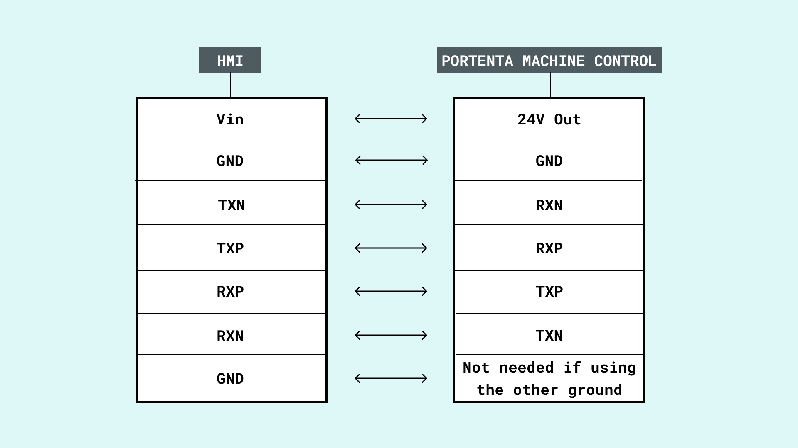
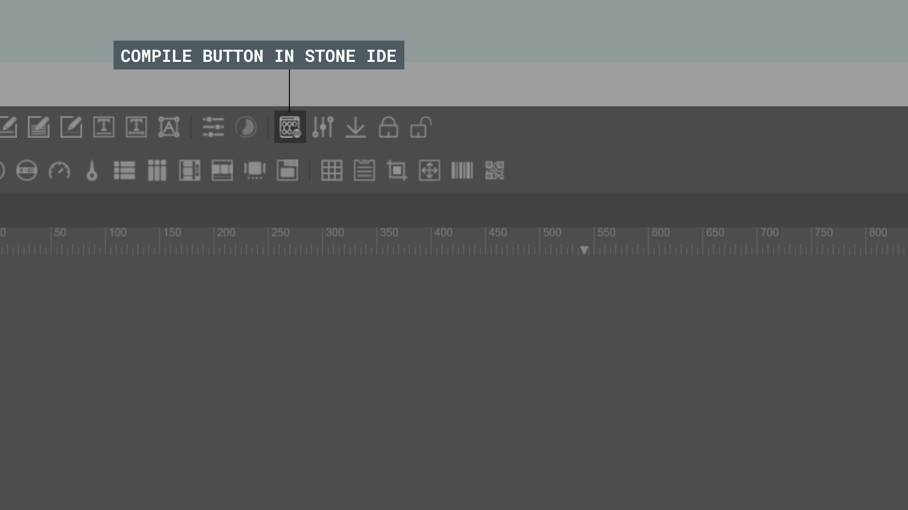
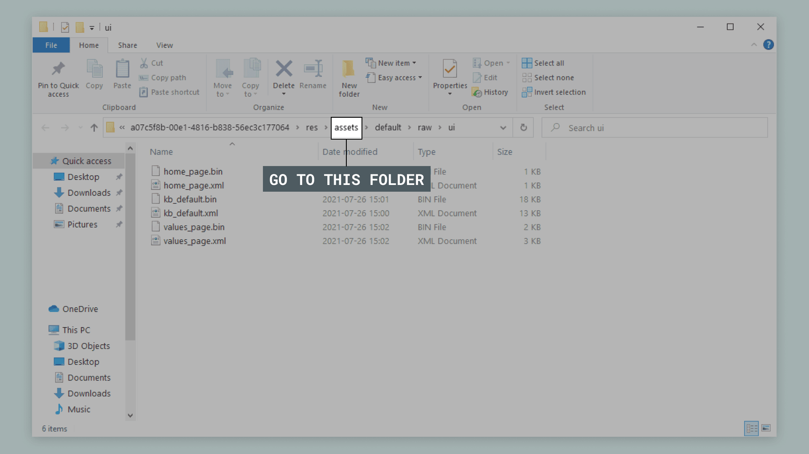
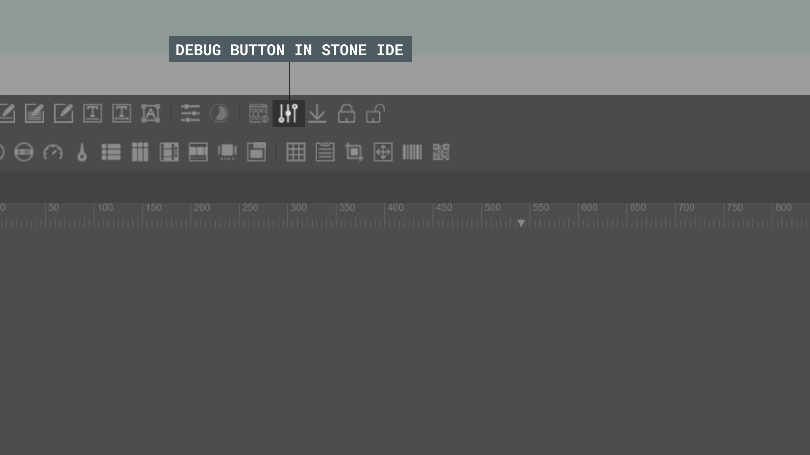
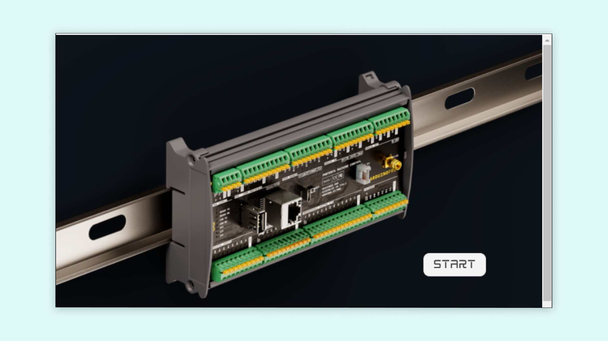
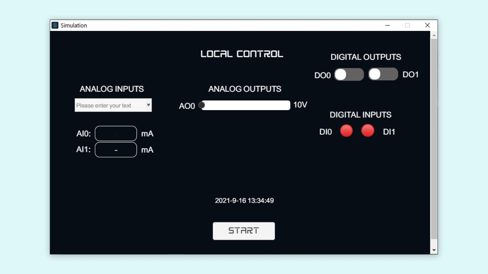
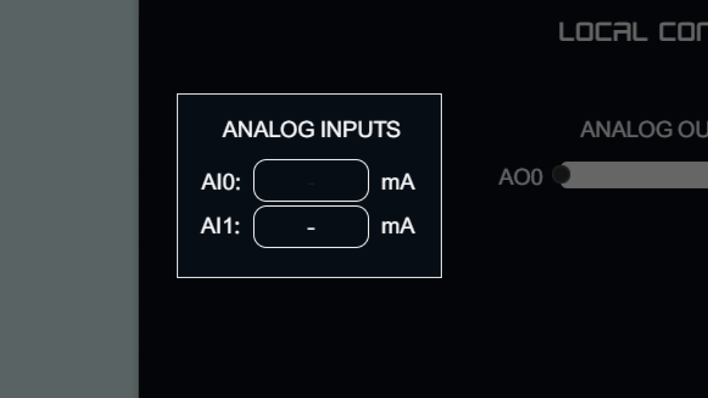
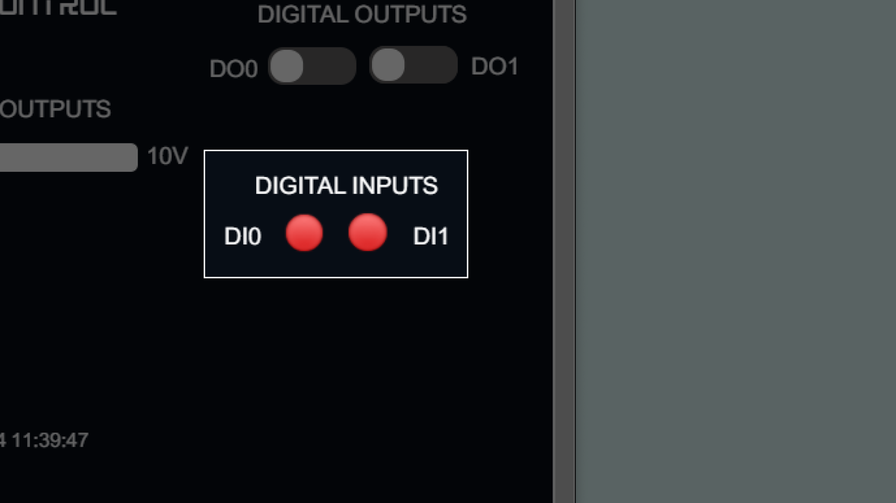
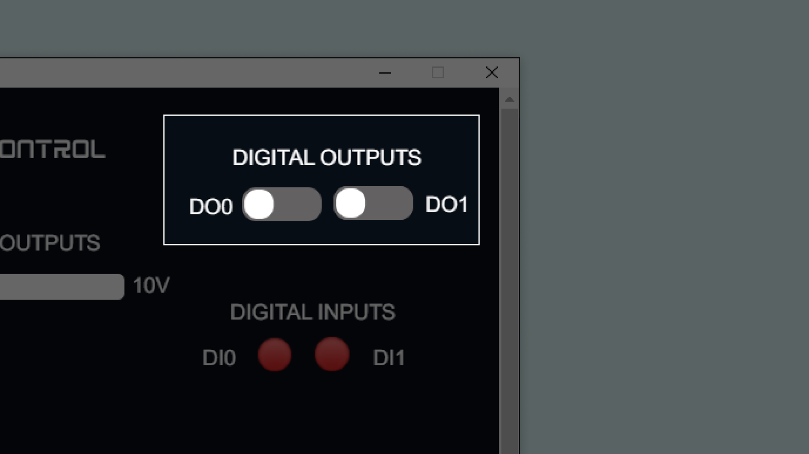

## Overview
This tutorial will show you how to connect your Stone HMI with your Portenta machine control (PMC). When these are connected we will use a simple sketch that will make the two devices communicate. Using an UI that can be easily made with the Stone Designer for the HMI.

With this set up we have two devices that operate on their own, but they can exchange data by using serial communication. The HMI is running everything by itself, but every action is sent to the PMC using the Serial communication (RS-485), with the API from the library we can get the data from Serial communication.

For example, when a button is touched on the screen, it sends the button **ID** and the **type of press** through the serial communication. On the Arduino sketch side you can have a callback for that button and add reactions for the PMC to the button press.

### Required Hardware & Software

- [Portenta Machine Control (PMC)](https://store.arduino.cc/products/arduino-portenta-machine-control)
- Portenta H7 (Included with the Machine Control Carrier)
- 6x Jumper Wires (connection between PMC and HMI)
- 2x Jumper Wires (connection between Power supply and PMC)
- Micro USB
- Male USB-A to Male USB-A (upload UI to the HMI)
- Stone Designer v210601 (Only for Windows)
- Arduino IDE

## Instructions

### Connecting the HMI and PMC

Below you can find a table that shows which connections to make between the HMI and PMC. Connect the HMI and PMC according to the table below. The PMC will also need to be powered by a external power supply of 24V and minimum 0.2A.

***The PMC + HMI consumes ~0.2A, if you connect more devices to the PMC you will need more current.***



### Stone Designer and HMI

First make sure that you downloaded and installed the [Stone Designer](https://www.stoneitech.com/support/download/software). You can download the HMI demo for the Stone Designer [here](assets/stone-App-tutorial.st). If you are on a mac and can't use the Stone designer app, then please download [this folder](assets/stone-App-demo.zip), extract the folder inside and follow the instructions below.

Open the demo file in the Stone Designer. Now press the compile button.



This will open the directory where your sketch is located. Go backwards in the file hierarchy to the `assets` folder and copy the default folder located in there.



Now connect the HMI through USB to your computer. You should see a new drive called `APP`. Remove the default folder inside `APP`, and drop the one that you copied before, or you can replace the file already existing in there. This will upload the new UI to the HMI. You can restart the HMI to see the new UI, but the PMC will reboot the Stone HMI with the sketch that we will upload in the next step.

> You can preview and simulate the UI by pressing the “debug” button on the top bar



### Arduino Sketch

If you haven't already, download and install the [Arduino IDE](https://www.arduino.cc/en/software). In the Arduino IDE we need to install some libraries. The `Arduino_MachineControl` library, the `Arduino_StoneHMIv2` library. These can be found in the library manager of the Arduino IDE.

The `StoneHMI_ArduinoSketch.ino` sketch will be our main sketch that we upload to the PMC.

### Using the HMI and PMC

After uploading the `StoneHMI_ArduinoSketch.ino` sketch to the PMC you should see the `welcome` page on the HMI. If you do not see the UI on the Stone HMI, then please try restarting the HMI.



The demo has two pages. The `welcome` page, this page just contains a start button, pressing this button will take you to the `dashboard` page.



The `dashboard` page contains several elements that interact with the PMC. Lets take a closer look at the individual features we have in this UI. Pressing the Start button will bring you back to the `welcome` page.

In the sketch we use the loop to check for changes to UI or on the PMC and then calling specific functions. Using checking variables that we switch from true to false so that the checks are not made too quickly. The elements on the Stone HMI UI are linked to the sketch by using the names that we give them in the Stone designer.

```arduino
void loop(){
  hmi.loop(); //Check for callback requests

  if (analogIn_ready == true){
    read_4_20_Input(0); //read sensor at ch0 (AI0)
    analogIn_ready = false;
  }

  if (digitalIn_ready == true){
    readDigitalInput(0);
    readDigitalInput(1);

    digitalIn_ready = false;
  }
}
```



We read the value in the analog input and use conversions to make it display the value in voltage.

```arduino
void read_4_20_Input(int ch){
  //4-20mA read
  float raw_voltage_ch = analog_in.read(ch);
  float voltage_ch = (raw_voltage_ch * reference) / 65535;
  float current_ch = (voltage_ch / SENSE_RES) * 1000;
  String stringCurrent = String(current_ch, 2); // using a float and the decimal places

  //set labels
  switch (ch){
  case 0:
    hmi.setLabelText("ai0", stringCurrent);
    break;
  }
}
```


You can control the analog output by changing the slider. Giving you variable control of the voltage output on the Analog output 0.

```arduino
void setAnalogOutput0(float sliderValue){
  analog_out.write(0, sliderValue);
}
```



The digital inputs will change color from red to green when it detects that those are connected on the PMC. We will use the below function to change the color of the button.

```arduino
void readDigitalInput(int ch_PMC, String imageName, int ch){
  uint16_t reading;
  reading = digital_inputs.read(ch_PMC);
  
  if (reading != prevReadDig[ch]){
    if (reading == true){
      hmi.setImageValue(imageName, "icons8_green_circle_48");
    }else{
      hmi.setImageValue(imageName, "icons8_red_circle_48");
    }
    prevReadDig[ch] = reading;
  }
}
```



The digital outputs on the PMC can be toggled on and off with the HMI by pressing the buttons on the screen. We will handle these events with switch cases in the sketch. The function will simply change the output from low to high or vice versa, depending on the button that is pressed. When an output is set to high you will see the light on the PMC by the output turn on.

```arduino
void setDO(int outputPin, byte switchStatus){
  switch (switchStatus){
  case 0x00:
    digital_outputs.set(outputPin, LOW);
    break;
  case 0x01:
    digital_outputs.set(outputPin, HIGH);
    break;
  default:
    Serial.println("error setting Digital Output..");
  }
}

void setDO0(byte switchStatus){
  setDO(0, switchStatus);
}

void setDO1(byte switchStatus){
  setDO(1, switchStatus);
}
```

## Conclusion

In this tutorial you learned how to connect the HMI and PMC so that they can communicate through serial connection. This tutorial also showed you how to upload sketches on the HMI and PMC. And how to control the PMC via button presses on a custom UI on the Stone HMI. We also went through some useful features for the PMC and HMI, letting you control and visualize the connections made to the PMC.

## Example Code

### StoneHMI_ArduinoSketch.ino

```arduino

/**
 * Stone HMI demo for Arduino Portenta Machine Control
 * 
 * Description:
 *  The sketch allows to Set and read Analog/Digital Inputs/Outputs from the HMI
 * 
 * Prerequisites:
 *  Load the stone dashboard in the HMI (link: )
*/

#include <Arduino_MachineControl.h>
using namespace machinecontrol;

//HMI Variables
#include <Arduino_StoneHMIv2.h>
StoneHMI hmi(machinecontrol::comm_protocols.rs485, SerialType::SERIAL_RS485); // stone display on RS485

//Use MbedOS tickers to manage fixed-interval, recurring tasks
mbed::Ticker analogIn_clock;
volatile bool analogIn_ready{false};
mbed::Ticker digitalIn_clock;
volatile bool digitalIn_ready{false};

//PMC Variables
#define SENSE_RES 120
float reference = 3;
int prevReadDig[8] = {1, 1, 1, 1, 1, 1, 1, 1};

/*************
  SETUP
**************/
void setup(){
  Serial.begin(115200);
  while (!Serial)
    ;

  Serial.println("Stone HMI Sample sketch. Used with the PMC.");
  Serial.println("");

  // HMI
  // In case you want to display more info
  // hmi.debug()

  // initialise display
  Serial.print("Initialising the Arduino/Stone interface... ");
  while (!hmi.begin()){
    Serial.print('.');
    delay(500);
  }
  Serial.println("done.");

  //restart HMI
  Serial.print("Restarting the Stone display...");
  hmi.sysReboot();
  Serial.println(" done.");

  //connect to HMI
  Serial.print("Connecting to the Stone display...");
  while (!hmi.sysHello()){
    Serial.print('.');
    delay(500);
  }
  Serial.println(" done.");

  //print version
  Serial.print("Version: ");
  String version;
  hmi.sysVersion(&version);
  Serial.println(version);

  //Set callbacks
  hmi.addSwitchHandler("switc_do0", setDO0);
  hmi.addSwitchHandler("switc_do1", setDO1);

  hmi.addSliderChangedHandler("slider_ao0", setAnalogOutput0);

  //activate intro page. Determines the page that the HMI starts with
  hmi.openWin("welcome");

  Serial.println("*** SETUP COMPLETED ***");
  Serial.println();

  // Attach a lambda (timer) to the tickers
  analogIn_clock.attach([]
                        { analogIn_ready = true; },
                        2.0);
  digitalIn_clock.attach([]
                         { digitalIn_ready = true; },
                         1.0);


  // PMC
  //Configure Digital outputs
  digital_outputs.setLatch(); //setup overcurrent behavior on all channels.
  digital_outputs.setAll(0);  //At startup set all channels (0-255)

  //Analog inputs
  analogReadResolution(16);
  analog_in.set4_20mA();

  //Configure Digital inputs
  Wire.begin();
  if (!digital_inputs.init()){
    Serial.println("Digital input GPIO expander initialization fail!!");
  }

  //Configure analog outputs
  //analog_out.period_ms(CHANNEL, PERIOD_MILLISECONDS);
  analog_out.period_ms(0, 4);
  analog_out.period_ms(1, 4);
}

void loop(){
  hmi.loop(); //Check for callback requests

  if (analogIn_ready == true){
    read_4_20_Input(0); //read sensor at ch0 (AI0)
    analogIn_ready = false;
  }

  if (digitalIn_ready == true){
    readDigitalInput(0);
    readDigitalInput(1);

    digitalIn_ready = false;
  }
}

/**
 * Digital read update to HMI.
 * channels available 0-1
 */
void readDigitalInput(int ch){
  switch (ch){
  case 0:
    readDigitalInput(DIN_READ_CH_PIN_00, "di0", 0);
    break;
  case 1:
    readDigitalInput(DIN_READ_CH_PIN_01, "di1", 1);
    break;
  }
}

/**
 *   Digital read update to HMI.
 */
void readDigitalInput(int ch_PMC, String imageName, int ch){
  uint16_t reading;
  reading = digital_inputs.read(ch_PMC);
  
  if (reading != prevReadDig[ch]){
    if (reading == true){
      hmi.setImageValue(imageName, "icons8_green_circle_48");
    }else{
      hmi.setImageValue(imageName, "icons8_red_circle_48");
    }
    prevReadDig[ch] = reading;
  }
}

/**
 * Analog read when input configured for 4-20mA sensors
 * channels available: 0,1.
 */ 
void read_4_20_Input(int ch){
  //4-20mA read
  float raw_voltage_ch = analog_in.read(ch);
  float voltage_ch = (raw_voltage_ch * reference) / 65535;
  float current_ch = (voltage_ch / SENSE_RES) * 1000;
  String stringCurrent = String(current_ch, 2); // using a float and the decimal places

  //set labels
  switch (ch){
  case 0:
    hmi.setLabelText("ai0", stringCurrent);
    break;
  }
}

// Handlers

/**
 * Set Analog outputs from HMI.
 */
void setAnalogOutput0(float sliderValue){
  analog_out.write(0, sliderValue);
}

void setAnalogOutput1(float sliderValue){
  analog_out.write(1, sliderValue);
}

/**
 * Set Digital outputs from HMI
 */
void setDO(int outputPin, byte switchStatus){
  switch (switchStatus){
  case 0x00:
    digital_outputs.set(outputPin, LOW);
    break;
  case 0x01:
    digital_outputs.set(outputPin, HIGH);
    break;
  default:
    Serial.println("error setting Digital Output..");
  }
}

void setDO0(byte switchStatus){
  setDO(0, switchStatus);
}

void setDO1(byte switchStatus){
  setDO(1, switchStatus);
}

```