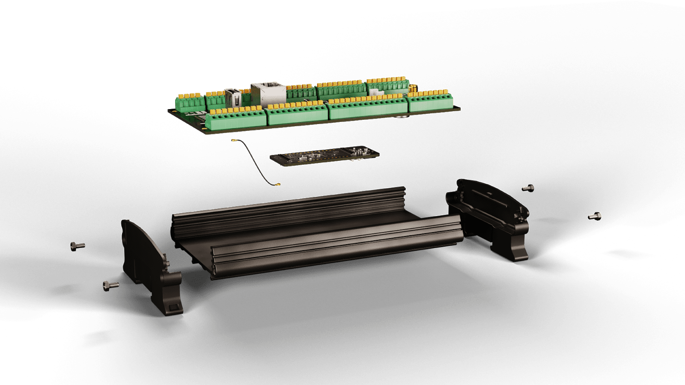
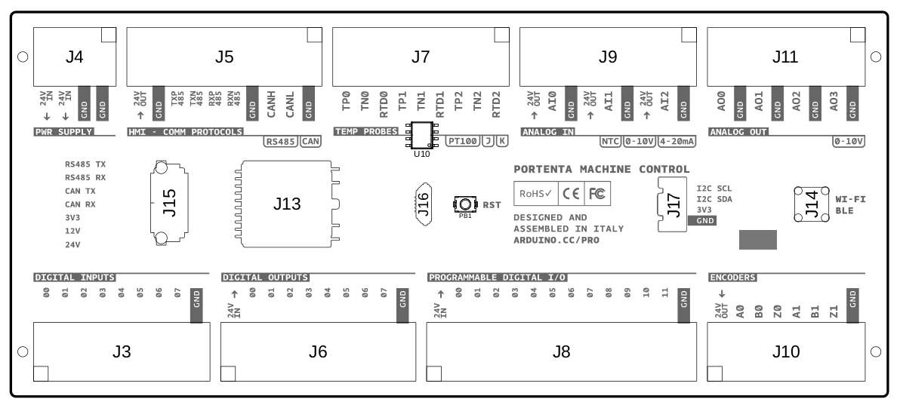

# Description

The Arduino® Portenta Machine Control is powered with a 24V DC power supply and provides several input/output digital and analog pins. This makes the board capable of driving high-power relays, sampling analog signals and measuring temperature with different probes.

# Target Areas
Industry 4.0, system integrators

# Features
- **STM32H747XI dual Cortex® Microcontroller**
  - Arm® Cortex®-M7 core at up to 480 MHz + Arm® 32-bit Cortex®-M4 core at up to 240 MHz
  - 2 MB of Flash Memory with read-while-write support
  - 1 MB of RAM
- **On-board memory**
  - 8 MB SDRAM
  - 16 MB Flash QSPI
- **NXP SE0502 secure element**
- **Power**
    - Input voltage: 24V DC +/- 20%
    - Output voltage: 24V DC
    - Reverse polarity protection
- **8x digital input channels**
    - 0-24V DC input
- **8x Digital output channels**
  - Non-galvanic isolated 24V power input
  - 8x High-side switches with current limit and inductive load kick-back protection
- **3x Analog input channels**
  
  Each channel is software configurable to be:
  - 0-10V input
  - 4-20mA input
  - NTC input with 3V voltage reference **REF3330AIRSER**
- **4x Analog output channels**
  - DC Voltage output software configurable: 0-10V DC
  - Max 20mA per channel
- **12x Digital programmable channels**
  - Non-galvanic isolated 24V power input
  - 12x High-side switches with current limit and inductive load kick-back protection
  - 12x Digital inputs
- **3x Temperature channels**

  Each channel is software configurable to measure:
  - Thermocouple K, non-grounded, front-end **MAX31855KASA+T**
  - Thermocouple J, non-grounded, front-end **MAX31855KASA+T** with software multiplication coefficient
  - PT100, front-end **MAX31865ATP+T**
- **2x Encoder channels ABZ**
  - 0-24V DC input
- **High-speed CAN**
  - **TJA1049T/3J** able to work at 12V/24V DC
  - On-board termination resistors
- **RS-232/RS-422/RS-485 software configurable**
  - **SP335ECR1-L** with onboard termination resistors. RS-485 is configurable to be half duplex or full duplex
- **I2C**
  - Grove connector
  - 10 kΩ pull-ups on board
- **Ethernet**
  - On-board LAN transformer
- **Full-speed USB-A connector**
- **Half-speed micro-USB Type B connector**
- **RTC**
  - At least 48 hours of memory retention
- **Wi-Fi®/Bluetooth® Low Energy**
  - SMA connector 50 Ω

***Note: ESD protection on all inputs/outputs***

# Contents
## The Board
### Application Examples
- **Food processing:** The Portenta Machine Control is the perfect solution to meet your food processing needs by providing control to your lab and industrial operation's demands across the beverage, drying, and fermentation fields. Access professional support from Arduino or take advantage of the community support to reduce your time-to-market. With the Portenta Machine Control, you will have real-time information about the status of your process being able to improve the yield and minimize waste by adjusting the food processing parameters using edge computing.

- **Glass bottle manufacturing:** Make use of the fast-edge computing capabilities of the Portenta range for minimal latency control of industrial components used in glass bottle manufacturing. Ensure the consistency of glass bottles created while simultaneously increasing the overall equipment effectiveness and increasing the generated revenue. Make use of custom thermal control algorithms to ensure optimum annealing processes with minimal resource consumption. All while increasing the bottles per minute ratio (BPM).

- **Packaging:** Develop and control machines that fill, freeze, wrap, seal, label, and much more to ensure that your product is safely packaged to reach your consumer. Interconnect different processes of your manufacturing line with Arduino's advanced technologies such as the Arduino Cloud infrastructure. Reduce labor costs and achieve a fully automated line with minimal human interaction to meet the strongest hygiene and quality standards.

### Related Products
- Portenta H7

### Solution Overview

## Ratings
### Recommended Operating Conditions

| Symbol          | Description                                      | Min            | Max            |
| --------------- | ------------------------------------------------ | -------------- | -------------- |
| TMax | Conservative thermal limits for the whole board: | -40 °C (-40°F) | 85 °C (185 °F) |

### Absolute Maximum Ratings

| Symbol                  | Description                                                                                                                                                                                                        | Min | Typ | Max | Unit |
| ----------------------- | ------------------------------------------------------------------------------------------------------------------------------------------------------------------------------------------------------------------ | --- | --- | --- | ---- |
| VINMax       | Input voltage on PWR SUPPLY connector 24V IN pin                                                                                                                                                                   | 0   | -   | 35  | V    |
| VA_IN_0-10V  | Input voltage on analog IN pins in 0-10V mode                                                                                                                                                                      | 0   | -   | 13  | V    |
| IA_IN_4-20mA | Input current on analog IN pins in 4-20mA mode                                                                                                                                                                     | 0   | -   | 30  | mA   |
| VA_IN_NTC    | Input voltage on analog IN pins in NTC mode                                                                                                                                                                        | 0   | -   | 3.5 | V    |
| VI2C         | I2C connector voltage                                                                                                                                                                                              | 0   | -   | 3.4 | V    |
| VD_IN        | Input voltage on DIGITAL IN connector channels. Exceeding 25V will trigger the ESD protection diodes.                                                                                                              | 0   | -   | 25  | V    |
| VD_OUT       | Output voltage on DIGITAL OUT connector channels. It is the same as DIGITAL OUT connector pin 24V IN since it must be provided externally. Exceeding 25V will trigger the ESD protection diodes.                   | 0   | -   | 25  | V    |
| VD_PROG_OUT  | Output voltage on DIGITAL PROGRAMMABLE connector channels. It is the same as DIGITAL PROGRAMMABLE connector pin 24V IN since it must be provided externally. Exceeding 25V will trigger the ESD protection diodes. | 0   | -   | 25  | V    |
| IOUT_24V     | Maximum output current from any 24V OUT pin                                                                                                                                                                        | 0   | -   | 500 | mA   |
| IOUT_ENC     | Maximum output current from any ENCODERS pin                                                                                                                                                                       | 0   | -   | 2   | mA   |

## Functional Overview
### Block Diagram

### Board Topology

| **Ref.** | **Description**                                    | **Ref.** | **Description**                       |
| -------- | -------------------------------------------------- | -------- | ------------------------------------- |
| J3       | Digital inputs                                     | J10      | Encoders                              |
| J4       | Power supply 24V                                   | J11      | Analog out                            |
| J5       | HMI - Comm protocols (RS-232, RS-422, RS-485, CAN) | J13      | Ethernet                              |
| J6       | Digital outputs                                    | J14      | Wi-Fi® / Bluetooth® Low Energy SMA    |
| J7       | Temperature probes                                 | J15      | USB A                                 |
| J8       | Digital programmable                               | J16      | USB micro                             |
| J9       | Analog in                                          | J17      | Grove I2C                             |
| PB1      | RESET Push Button                                  | U10      | MAX31855KASA+T Thermocouple converter |

### Digital Inputs
The digital inputs connector has 8x channels, each is a 680 kΩ and 100 kΩ resistor divider: a 0-24V input is scaled down to 0-3V.

### Digital Outputs

The Portenta Machine Control has the following outputs specifications:

- 8x high side switches (2x **TPS4H160AQPWPRQ1**), one for each channel.
- The current limit nominal value is 0.6A per channel. Due to internal **TPS4H160AQPWPRQ1** circuit tolerances, the real value can be higher, up to 0.9A.

The digital output connector (J6) has a 24V IN pin which must be supplied with 24V DC. The 24V IN pin is not galvanically isolated: the input voltage must be referred to the same GND of the board.

The supply voltage can be the same 24V which is powering the board.

### Programmable Digital I/O
The **programmable digital I/O** connector has a 24V IN pin which must be supplied with 24V DC.

The 24V IN pin is not galvanically isolated: the input voltage must be referred to the same GND of the board.

The supply voltage can be the same 24V which is powering the board. There are 3x **TPS4H160AQPWPRQ1** chipsets, one for each channel, having a total of 12x high-side switches.

#### Current Limit
- The nominal value is 0.6A per channel, however, due to the internal **TPS4H160AQPWPRQ1** circuit tolerances the real value can be reach up to 0.9A.
- It is possible to change the behavior of the 12 channels when the current limit is reached:
  - **Latch**: when the current limit is reached the channel is shut down and the co-respective channel *enable* pin must be toggled to activate the channel again.
  - **Retry**: when the current limit is reached the channel is shut down and re-connected after a short period of time.

#### Kick-Back Protection
There is an internal inductive loads kick-back protection with an additional external protection of a 60V, 2A Schottky diode **PMEG6020ER**:

- 12x digital input channels, each is a 680 kΩ and 100 kΩ resistor divider: a 0-24V input is scaled down to 0-3V.
  Although the high-side switches are independent of the digital input channels, it is possible to read the status of the high-side switches through the digital input channels.

### Analog Input
The internal A/D converter of the microcontroller has a range resolution of 12-16 bits, delivering decimal values from 0 to a maximum of 65535 and being configurable by the user via software.

There are three independent analog input channels available. Each of them has an analog switch **TS12A44514PWR** which is switching between three modes:

- **0-10V**:
The input is connected to a 100 kΩ and 39 kΩ resistor divider. A 0-10V input is scaled down to 0-2.8V. The input impedance is approximately 28 kΩ.
- **4-20mA**:
The input is connected to a 120Ω resistor. Having 4-20mA current input for a 0.48V-2.4V voltage.
- **NTC**:
The input is connected to a 3V voltage reference (**REF3330AIRSER**) with a 100 kΩ resistor in series, becoming part of a resistor divider powered by the voltage reference.

An output pin provides 24V to power sensors. A 500mA PTC resettable fuse protects the 24V output pin.

### Analog Output
Four independent analog output channels are available. Each of them has a double low-pass filter and a high-current op-amp arranged in a non-inverting topology with a gain of 3.3.

At each input of each channel, a PWM from the Portenta board is provided and filtered by a double low-pass filter, obtaining a DC output with a small AC ripple. The signal is then fed to the channel non-inverting amplifier which amplifies it by 3.3.

The output signal is a DC whose amplitude is a function of the PWM duty cycle.

The maximum output current is 20mA per channel.

### Temperature Measurements
Three independent temperature measurement channels are available.

Each channel can measure non-grounded thermocouples or PT100 sensors, but not both at the same time.

**NOTE**: **Do not connect both a thermocouple and a PT100 to one channel**.
Only a single channel at a time is available to be read, according to the analog switch's position.

### Front-Ends
There are two front ends on the board:
- MAX31855KASA+T dedicated to thermocouples.
- MAX31865ATP+T dedicated to PT100.

The front ends are multiplexed to the three channels via:
  - A single low-ohmic single-pole double-throw analog switch **NX3L4053HR,115** which is switching between one front end or the other.
  - Three quadruple single pole single throw analog switches **TMUX1511RSVR** which are switching the active channel between the three available.

### Connecting Thermocouples
**WARNING**: Connect only **non-grounded** thermocouples. Do not connect a thermocouple and a PT100 to the same channel.

Connect a **thermocouple** to a channel `CH` (0-2):
  - Connect the thermocouple positive pin to **TP**`CH`.
  - Connect the thermocouple negative pin to **TN**`CH`.

**NOTE**: Depending on the region and normative, thermocouples can have different cables color codes. Please check the meaning of each cable code before connecting them do the device. Do not connect the thermocouple negative pin to GND.

### Connecting Two Wires RTDs (PT100)
Connect a **two-wire RTD** to a channel `CH` (0-2):
  - Connect one RTD pin to **TP**`CH`.
  - Connect the other RTD pin to **TN**`CH`.
  - Connect a jumper between TP0 and **RTD**`CH`.

**NOTE**: Depending on the region and normative, RTD sensors like the PT100 can have different cables color codes. Please check the meaning of each cable code before connecting them do the device. Do not connect the RTD negative pin to GND.

### Connecting Three Wires RTDs (PT100)
Connect a **three-wire RTD** to a channel `CH` (0-2):
  - Connect one RTD pin to **TP**`CH`.
  - Connect a second RTD pin to **TN**`CH`. **Do not connect this pin to GND**.
  - Connect the third RTD pin to **RTD**`CH`.

**NOTE**: Depending on the region and normative, RTD sensors like the PT100 can have different cables color codes. Please check the meaning of each cable code before connecting them do the device. Do not connect the RTD negative pin to GND.

### Encoders
  - Two independent ABZ encoder channels are available.
  - Each channel is pulled-up to the board 24V supply with a 10 kΩ pull-up resistor.

### CAN
The on-board transceiver is the **TJA1049T/3J** and implements the CAN physical layer as defined in *ISO 11898-2:2016* and *SAE J2284-1* to *SAE J2284-5*. It is compatible with a 12V or 24V bus:
  - **Nominal** maximum data rate: 5 Mbit/s.
  - Integrated ESD protection.
  - 60 Ω termination resistors are on board, with 4.7 nF to GND.

A 500mA PTC resettable fuse protects the 24V OUT pin.

### RS-232/RS-422/RS-485
The on-board transceiver is the **TJA1049T/3J**, which can be SW configured for RS-232, RS-442 or RS-485 half/full duplex:

  - **Nominal** data rates are: 20 Mbps for the RS-485 and 1 Mbps for the RS-232.
  - Selectable 250 kbps Slew Limiting.
  - Integrated RS-485 120 Ω differential cable termination, inactive for RS-232.
  - Integrated ESD protection.
  - A 500mA PTC resettable fuse protects the 24V output pin.

### I2C
  - Grove connector.
  - 10 kΩ pull-ups on board.

### Ethernet
  - On-board transformer.
  - The 10/100 Ethernet physical interface is directly connected to the internal Ethernet MAC and provides full duplex communication with automatic *MDIX* support.

### USB-A Connector
  - Transfer rates of up to 480 Mbps.
  - It can be used both as a host and as a device.
  - ESD protection.

### Micro-USB Connector
The Half-Speed USB interface of the Portenta board is connected to the micro-USB connector of the Portenta Machine Control.
  - It can be used to program the Portenta board via a micro-USB cable.
  - It can be used to power the Portenta board while the 24V power supply is off.
  - ESD protection.

### RTC
The on-board real-time clock/calendar is the **PCF8563T/F4** which clock is provided by a dedicated external crystal oscillator:
  - A 100 mF supercapacitor (**FC0V104ZFTBR24**) provides power to the **PCF8563T/F4** when the board power supply is disconnected. The RTC chipset will be powered by the supercapacitor for at least 48 hours.
  - 32,768 kHz crystal clock (**Q13FC1350000400**).

### Power Tree

## Board Operation
### Getting Started - IDE
If you want to program your *Arduino Machine Control* while being offline you need to install the Arduino Desktop IDE [[1]](#11-reference-documentation) To connect the *Arduino Machine Control* to your computer, you’ll need a micro-B USB cable. This also provides power to the board, as indicated by the LED.

### Getting Started - Arduino Web Editor
All Arduino boards, including this one, work out-of-the-box on the Arduino Web Editor [[2]](#11-reference-documentation), by just installing a simple plugin.

The Arduino Web Editor is hosted online, therefore it will always be up-to-date with the latest features and support for all boards. Follow [[3]](#11-reference-documentation) to start coding on the browser and upload your sketches onto your board.

### Getting Started - Arduino IoT Cloud
All Arduino IoT-enabled products are supported on Arduino IoT Cloud which allows you to Log, graph and analyze sensor data, trigger events, and automate your home or business.

### Online Resources
Now that you have gone through the basics of what you can do with the board you can explore the endless possibilities it provides by checking exciting projects on ProjectHub [[4]](#11-reference-documentation), the Arduino Library Reference [[5]](#11-reference-documentation) and the online store [[6]](#11-reference-documentation) where you will be able to complement your board with sensors, actuators and more.

## Connector Pinouts
### Power Supply (J4)

| Pin | **Type** | **Description**                                  |
| --- | -------- | ------------------------------------------------ |
| 1   | 24V IN   | Board input voltage, reverse polarity protected. |
| 2   | 24V IN   | Board input voltage, reverse polarity protected. |
| 3   | GND      | GND                                              |
| 4   | GND      | GND                                              |

### HMI - Communication Protocols (J5)

| Pin | **Type**    | **RS-232** | **RS-485 Full Duplex/RS-422** | **RS-485 Half Duplex** | **CAN** |
| --- | ----------- | ---------- | ----------------------------- | -----------------------| ------- |
| 1   | 24V OUT     |            |                               |                        |         |
| 2   | GND         |            |                               |                        |         |
| 3   | TXP 485     |            | TX+                           | Data+                  |         |
| 4   | TXN 485     | TXD        | TX-                           | Data-                  |         |
| 5   | RXP 485     | RXD        | RX+                           |                        |         |
| 6   | RXN 485     |            | RX-                           |                        |         |
| 7   | GND         | Ground     | Ground                        | Ground                 |         |
| 8   | CANH/CAN TX |            |                               |                        | CAN_H   |
| 9   | CANL/CAN RX |            |                               |                        | CAN_L   |
| 10  | GND         |            |                               |                        | Ground  |

### Temperature Probes (J7)
**NOTE**: RTD (**R**esistance **T**emperature **D**etector) is a PT100 sensor.

| Pin | **Type** | **Channel** | **Description**                                                |
| --- | -------- | ----------- | -------------------------------------------------------------- |
| 1   | TP0      | 00          | Thermocouples P RTD P                                          |
| 2   | TN0      | 00          | Thermocouples N RTD N **NOTE:** DO NOT CONNECT THIS PIN TO GND |
| 3   | RTD0     | 00          | RTD P third wire                                               |
| 4   | TP1      | 01          | Thermocouples P RTD P                                          |
| 5   | TN1      | 01          | Thermocouples N RTD N **NOTE:** DO NOT CONNECT THIS PIN TO GND |
| 6   | RTD1     | 01          | RTD P third wire                                               |
| 7   | TP2      | 02          | Thermocouples P RTD P                                          |
| 8   | TN2      | 02          | Thermocouples N RTD N **NOTE:** DO NOT CONNECT THIS PIN TO GND |
| 9   | RTD2     | 02          | RTD P third wire                                               |

### Analog in (J9)

| Pin | **Type** | **Channel** | **Description**                                                                                                 |
| --- | -------- | ----------- | --------------------------------------------------------------------------------------------------------------- |
| 1   | 24V OUT  | -           | Output voltage connected to the board input voltage. A single PTC protects pins 1, 4, 7. PTC nominal value 0.5A |
| 2   | AI0      | 00          | Analog input                                                                                                    |
| 3   | GND      | -           | GND                                                                                                             |
| 4   | 24V OUT  | -           | Output voltage connected to the board input voltage. A single PTC protects pins 1, 4, 7. PTC nominal value 0.5A |
| 5   | AI1      | 01          | Analog input                                                                                                    |
| 6   | GND      | -           | GND                                                                                                             |
| 7   | 24V OUT  | -           | Output voltage connected to the board input voltage. A single PTC protects pins 1, 4, 7. PTC nominal value 0.5A |
| 8   | AI2      | 02          | Analog input                                                                                                    |
| 9   | GND      | -           | GND                                                                                                             |

### Analog Out (J11)

| Pin | **Type** | **Channel** | **Description** |
| --- | -------- | ----------- | --------------- |
| 1   | AO0      | 00          | Analog output   |
| 2   | GND      | -           | GND             |
| 3   | AO1      | 01          | Analog output   |
| 4   | GND      | -           | GND             |
| 5   | AO2      | 02          | Analog output   |
| 6   | GND      | -           | GND             |
| 7   | AO3      | 03          | Analog output   |
| 8   | GND      | -           | GND             |

### Digital Inputs (J3)

| Pin | **Type** | **Channel** | **Description** |
| --- | -------- | ----------- | --------------- |
| 1   | 00       | 00          | Digital input   |
| 2   | 01       | 01          | Digital input   |
| 3   | 02       | 02          | Digital input   |
| 4   | 03       | 03          | Digital input   |
| 5   | 04       | 04          | Digital input   |
| 6   | 05       | 05          | Digital input   |
| 7   | 06       | 06          | Digital input   |
| 8   | 07       | 07          | Digital input   |
| 9   | GND      | -           | GND             |

### Digital Outputs (J6)

| Pin | **Type** | **Channel** | **Description**                                                                                     |
| --- | -------- | ----------- | --------------------------------------------------------------------------------------------------- |
| 1   | 24V IN   | -           | Input voltage: this voltage is (non galvanically) isolated with respect to the board input voltage. |
| 2   | 00       | 00          | Digital output                                                                                      |
| 3   | 01       | 01          | Digital output                                                                                      |
| 4   | 02       | 02          | Digital output                                                                                      |
| 5   | 03       | 03          | Digital output                                                                                      |
| 6   | 04       | 04          | Digital output                                                                                      |
| 7   | 05       | 05          | Digital output                                                                                      |
| 8   | 06       | 06          | Digital output                                                                                      |
| 9   | 07       | 07          | Digital output                                                                                      |
| 10  | GND      | -           | GND                                                                                                 |

### Programmable Digital I/O (J8)

| Pin | **Type** | **Channel** | **Description**                                                                                     |
| --- | -------- | ----------- | --------------------------------------------------------------------------------------------------- |
| 1   | 24V IN   | -           | Input voltage: this voltage is (non galvanically) isolated with respect to the board input voltage. |
| 2   | 00       | 00          | Digital programmable Input/Output                                                                   |
| 3   | 01       | 01          | Digital programmable Input/Output                                                                   |
| 4   | 02       | 02          | Digital programmable Input/Output                                                                   |
| 5   | 03       | 03          | Digital programmable Input/Output                                                                   |
| 6   | 04       | 04          | Digital programmable Input/Output                                                                   |
| 7   | 05       | 05          | Digital programmable Input/Output                                                                   |
| 8   | 06       | 06          | Digital programmable Input/Output                                                                   |
| 9   | 07       | 07          | Digital programmable Input/Output                                                                   |
| 10  | 08       | 08          | Digital programmable Input/Output                                                                   |
| 11  | 09       | 09          | Digital programmable Input/Output                                                                   |
| 12  | 10       | 10          | Digital programmable Input/Output                                                                   |
| 13  | 11       | 11          | Digital programmable Input/Output                                                                   |
| 14  | GND      | -           | GND                                                                                                 |

### Encoders (J10)

| Pin | **Type** | **Channel** | **Description**                                                                            |
| --- | -------- | ----------- | ------------------------------------------------------------------------------------------ |
| 1   | 24V OUT  | -           | Output voltage connected to the board input voltage. PTC protected with nominal value 0.5A |
| 2   | A0       | 00          | Encoder A input                                                                            |
| 3   | B0       | 00          | Encoder B input                                                                            |
| 4   | Z0       | 00          | Encoder Z input                                                                            |
| 5   | A1       | 01          | Encoder A input                                                                            |
| 6   | B1       | 01          | Encoder B input                                                                            |
| 7   | Z1       | 01          | Encoder Z input                                                                            |
| 8   | GND      | -           | GND                                                                                        |

### USB A (J15)

| Pin | **Description** |
| --- | --------------- |
| 1   | VBUS            |
| 2   | DN              |
| 3   | DP              |
| 4   | GND             |

### USB Micro (J16)

| Pin | **Description** |
| --- | --------------- |
| 1   | VBUS            |
| 2   | DN              |
| 3   | DP              |
| 4   | ID              |
| 5   | GND             |

## Mechanical Information
### Board Outline

## Certifications
### Declaration of Conformity CE DoC (EU)
We declare under our sole responsibility that the products above are in conformity with the essential requirements of the following EU Directives and therefore qualify for free movement within markets comprising the European Union (EU) and European Economic Area (EEA).

**ROHS 2 Directive 2011/65/EU**
Conforms to:    EN50581:2012

**Directive 2014/35/EU. (LVD)**
Conforms to:    EN 60950-1:2006/A11:2009/A1:2010/A12:2011/AC:2011

**Directive 2004/40/EC & 2008/46/EC & 2013/35/EU, EMF**
Conforms to:    EN 62311:2008

### Declaration of Conformity to EU RoHS & REACH 211 01/19/2021
Arduino boards are in compliance with RoHS 2 Directive 2011/65/EU of the European Parliament and RoHS 3 Directive 2015/863/EU of the Council of 4 June 2015 on the restriction of the use of certain hazardous substances in electrical and electronic equipment.

| Substance                              | **Maximum limit (ppm)** |
| -------------------------------------- | ----------------------- |
| Lead (Pb)                              | 1000                    |
| Cadmium (Cd)                           | 100                     |
| Mercury (Hg)                           | 1000                    |
| Hexavalent Chromium (Cr6+)             | 1000                    |
| Poly Brominated Biphenyls (PBB)        | 1000                    |
| Poly Brominated Diphenyl ethers (PBDE) | 1000                    |
| Bis(2-Ethylhexyl} phthalate (DEHP)     | 1000                    |
| Benzyl butyl phthalate (BBP)           | 1000                    |
| Dibutyl phthalate (DBP)                | 1000                    |
| Diisobutyl phthalate (DIBP)            | 1000                    |

Exemptions : No exemptions are claimed.

Arduino Boards are fully compliant with the related requirements of European Union Regulation (EC) 1907 /2006 concerning the Registration, Evaluation, Authorization and Restriction of Chemicals (REACH). We declare none of the SVHCs (https://echa.europa.eu/web/guest/candidate-list-table), the Candidate List of Substances of Very High Concern for authorization currently released by ECHA, is present in all products (and also package) in quantities totaling in a concentration equal or above 0.1%. To the best of our knowledge, we also declare that our products do not contain any of the substances listed on the "Authorization List" (Annex XIV of the REACH regulations) and Substances of Very High Concern (SVHC) in any significant amounts as specified by the Annex XVII of Candidate list published by ECHA (European Chemical Agency) 1907 /2006/EC.

### Conflict Minerals Declaration
As a global supplier of electronic and electrical components, Arduino is aware of our obligations with regards to laws and regulations regarding Conflict Minerals, specifically the Dodd-Frank Wall Street Reform and Consumer Protection Act, Section 1502. Arduino does not directly source or process conflict minerals such as Tin, Tantalum, Tungsten, or Gold. Conflict minerals are contained in our products in the form of solder, or as a component in metal alloys. As part of our reasonable due diligence Arduino has contacted component suppliers within our supply chain to verify their continued compliance with the regulations. Based on the information received thus far we declare that our products contain Conflict Minerals sourced from conflict-free areas.

## FCC Caution
Any Changes or modifications not expressly approved by the party responsible for compliance could void the user’s authority to operate the equipment.

This device complies with part 15 of the FCC Rules. Operation is subject to the following two conditions:

(1) This device may not cause harmful interference

(2) this device must accept any interference received, including interference that may cause undesired operation.

**FCC RF Radiation Exposure Statement:**

1. This Transmitter must not be co-located or operating in conjunction with any other antenna or transmitter.

2. This equipment complies with RF radiation exposure limits set forth for an uncontrolled environment.

3. This equipment should be installed and operated with minimum distance 20cm between the radiator & your body.

**English**:
User manuals for license-exempt radio apparatus shall contain the following or equivalent notice in a conspicuous location in the user manual or alternatively on the device or both. This device complies with Industry Canada license-exempt RSS standard(s). Operation is subject to the following two conditions:

(1) this device may not cause interference

(2) this device must accept any interference, including interference that may cause undesired operation of the device.

**French**:
Le présent appareil est conforme aux CNR d’Industrie Canada applicables aux appareils radio exempts de licence. L’exploitation est autorisée aux deux conditions suivantes :

(1) l’ appareil nedoit pas produire de brouillage

(2) l’utilisateur de l’appareil doit accepter tout brouillage radioélectrique subi, même si le brouillage est susceptible d’en compromettre le fonctionnement.

**IC SAR Warning:**

**English**:
This equipment should be installed and operated with minimum distance 20 cm between the radiator and your body.

**French**:
Lors de l’ installation et de l’ exploitation de ce dispositif, la distance entre le radiateur et le corps est d ’au moins 20 cm.

**Important:** The operating temperature of the EUT can’t exceed 85℃ and shouldn’t be lower than -40℃.

Hereby, Arduino S.r.l. declares that this product is in compliance with essential requirements and other relevant provisions of Directive 2014/53/EU. This product is allowed to be used in all EU member states.

## Company Information

| Company name    | Arduino S.r.l.                             |
| --------------- | ------------------------------------------ |
| Company Address | Via Andrea Appiani,25 20900 MONZA（Italy） |

## Reference Documentation

| Reference                 | **Link**                                                                                            |
| ------------------------- | --------------------------------------------------------------------------------------------------- |
| Arduino IDE (Desktop)     | https://www.arduino.cc/en/Main/Software                                                             |
| Arduino IDE (Cloud)       | https://create.arduino.cc/editor                                                                    |
| Cloud IDE Getting Started | https://create.arduino.cc/projecthub/Arduino_Genuino/getting-started-with-arduino-web-editor-4b3e4a |
| Arduino Pro Website       | https://www.arduino.cc/pro                                                                          |
| Project Hub               | https://create.arduino.cc/projecthub?by=part&part_id=11332&sort=trending                            |
| Library Reference         | https://www.arduino.cc/reference/en/                                                                |
| Online Store              | https://store.arduino.cc/                                                                           |

## Revision History

| Date        | **Revision** | **Changes**   |
| ----------- | ------------ | ------------- |
| 13/04/2021  | 1            | First Release |
| 09/05//2022 | 2            | Remove PT1000, not compatible |
| 26/09//2022 | 3            | Fix features indentation, update analog output diagram, fix format issues and update images reflecting the location change of the MAX31855KASA+T converter (top side) |
| 13/10/2022  | 4             | Big improvements & Fixes |
| 11/04//2023 | 5            | Updates and table improvements        |
| 08/05//2023 | 6            | RTD and Thermocouples new information |