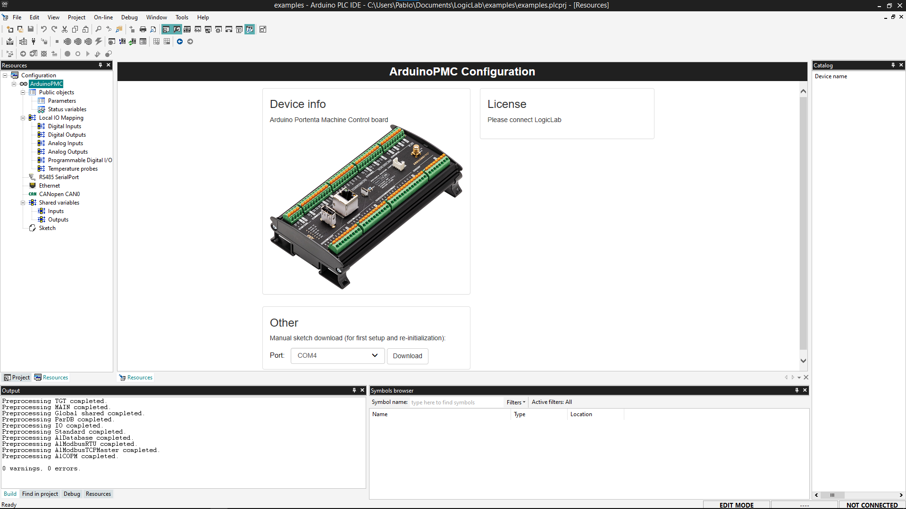

## Overview

The **Arduino PLC IDE** offers the possibility to use **IEC IEC61131-3** programming languages (*LD, SFC, FBD, ST, IL*) with the **Portenta Machine Control**. The **PLC IDE** offers a wide set of standard features commonly used in the industrial automation. This tutorial will show you how to connect the **Portenta Machine Control** to the **Arduino PLC IDE**, learning how to activate the software license and the basic setup to have your board up and running with the **Arduino PLC IDE**.

## Goals

- Install the Arduino PLC IDE and the Arduino PLC IDE Tools
- Upload the PLC IDE bootloader to the board
- Connect the computer to your device through the IDE
- Activate the device license
- Test the connection

### Required Hardware and Software

- Board compatible with the Arduino PLC IDE (Portenta Machine Control)
- Arduino PLC IDE ([Official Website](https://www.arduino.cc/pro/software-plc-ide))
- Unique PLC IDE License key for your device (https://store.arduino.cc/products/plc-key-portenta-machine-control)

***To get the Arduino PLC IDE and the PLC IDE License for your device, please visit the [Arduino software page](https://www.arduino.cc/pro/software-plc-ide), and the [store page](https://store.arduino.cc/plc-key-portenta-machine-control)***

## Instructions

To use the Arduino PLC IDE software, go to the [Arduino PLC IDE official website](https://www.arduino.cc/pro/software-plc-ide) and click on the download button. Download the following two executables:

  * The Arduino PLC IDE Tools
  * The Arduino PLC IDE

The first one will install all the required drivers, libraries and cores that you are going to need, while the second one will install the IDE software.

### 1. Arduino PLC IDE Tools

Before installing the Arduino PLC IDE you need to install all the required tools to make it work on your computer. Once you have downloaded the Arduino PLC IDE Tools executable, double-click on it and follow the installation instructions.

Once the installation is finished, all the required drivers, libraries and Arduino cores will be installed and ready to be used. Your computer is now ready to install the Arduino PLC IDE.

***It is possible that during the installation some windows terminals will be opened and closed by the installation program. Do not worry about it, those windows are required by the program to install all the tools that your computer needs**

### 2. Arduino PLC IDE Installation

Once the Arduino PLC IDE Tools are installed, double-click on the executable of the Arduino Pro IDE that you downloaded. Follow the installation instructions and, once the process is done, click on finish.

***In case you have any problem, perform a reboot to be sure that all the drivers, libraries and dependencies are working and up to date.***

Open the Arduino PLC IDE program to see the welcome screen.

### 3. Project Setup

Create a new project by clicking the middle **New project ...** button or **File > New Project**

After creating the project, there are some new windows on the screen, click on the left panel and switch it to the **Resources tab**, inside the window on the tree structure. Now click on your board and it will open the **Boards configuration page**.

### 4. Download the Runtime

The board needs to run a specific program (runtime) in order to interact with the **PLC IDE**. Go to the **"Other"** section below the **"Device Info"** block.

Plug your device to the computer, select the Serial Port of your board and click the **Download** button.

***The device will show up two Serial Ports, the default one (generally with the lowest number) is the usual Serial Port, the secondary one (usually with the highest number) is a virtual port for Modbus communication from the device to your computer. Take note of the port number assigned to the secondary port (virtual port for Modbus) as it will be needed in a second step.***

### 5. Connect to the Device

After the runtime is up and running, set up the communication by going to **On-line > Set up communication**.

On the new pop-up window open the properties of the Modbus protocol.

Make sure the Modbus protocol is using the secondary Serial port number, the Modbus Virtual port you took note of before.  Press OK.

Click OK to save the settings and press the connect button on **On-line > connect**.

### 6. License Activation

If the communication is successful the main panel will show the license section to be filled in and a status indicator.

To use your product license, fill it in on the form and press the **Activate** button.

After you click the **Activate** button, it will use the license and attach it to the board. A popup telling you to reboot the target (which is the device connected to the PLC IDE) will show up once the attachment finishes. Press the reset button of your device to perform the reboot.

Once the board has been activated, it is recommended to get the **Hardware-ID** of your device. 

### 7. Getting the Hardware-ID of Your Device

To do it follow the next steps:
- Be sure that your device is disconnected from the Arduino PLC IDE.
- Open the **Arduino IDE** software
- Go to **Tools** > **Board** > **Arduino Mbed OS Portenta Boards** > **Arduino Portenta H7 (M7 Core)**
- Go to **Tools** > **Port** to select the proper port (the default one shown before in the PLC IDE inside the **Arduino PMC Configuration** > **Other** section)
- Go to **Tools** > **Serial Monitor** and reset the board. Look at the end of the boot report to find the "Hardware-ID" and store it in a safe place.

### 8. Download a Program

Let's download and run the first program on your device. We are going to use the default program that is included in a project: a counter. To upload that program to your PLC, it is needed to compile the program and send it to the target device.

### 9. Communication Test

Open the **Watch** window by clicking on "View > Tool Windows > Watch", it will attach a new window on the right side called **Watch**. This window shows the real-time variables value.

To add a new variable to be watched you can click the **Insert new item** button inside the window, it will open a popup window, on the name label insert "cnt", and on the location "main", click OK and it will add the variable `cnt` from the `main` program on the table or drag and drop the `cnt` variable from the **Project** tree or from the **Main** program.

Select the **Watch** window and click on the **Start/Stop watch button** unless the value of the variable is already getting updated.

## Conclusions

In this tutorial we went through how to setup the Portenta Machine Control with the Arduino IDE lab, learning how to connect the board to the program through Modbus, activating the hardware license of your product, and creating a simple sketch with one variable that went compiled and downloaded inside the board. Finally, we learned how to see the values of the variables in real-time using the **Watch** window.

 Now that your board is up and running with the Arduino PLC IDE, you can start to create your own professional solutions.