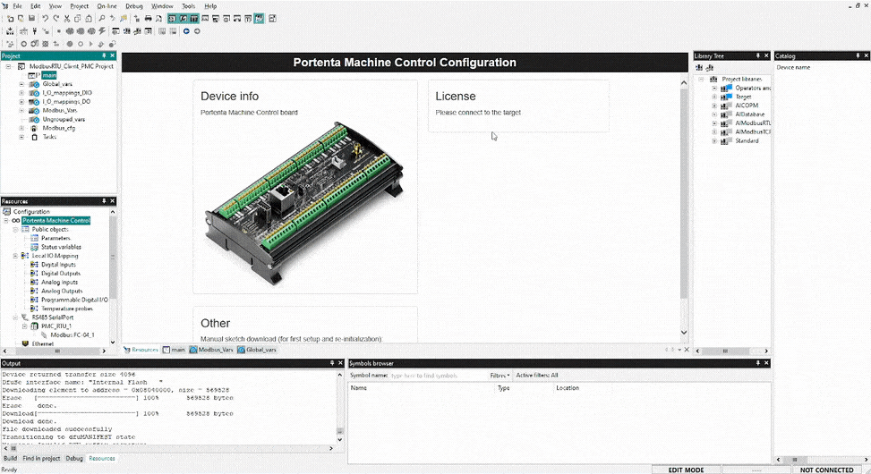

## Overview

The Portenta Machine Control boasts adaptable, high-quality industrial hardware and offers a diverse array of connection options. Its capabilities are further amplified by the Arduino PLC IDE software, optimizing the device for robust field operations. Moreover, the Portenta Machine Control is compatible with Modbus protocols, and with the Arduino PLC IDE, their integration is made straightforward.

In this tutorial, you will discover how to establish Modbus RTU communication between two Portenta Machine Control devices through the Arduino PLC IDE.

## Goals

- Learn how to configure the workspace environment to work with Modbus RTU using Arduino PLC IDE.
- Learn how to configure Modbus RTU for Portenta Machine Control using Arduino PLC IDE.
- Learn how to verify that Portenta Machine Control has been correctly set up using an example that uses Modbus RTU communication.

## Required Hardware and Software

### Hardware Requirements

- [Portenta Machine Control](https://store.arduino.cc/collections/pro-family) (x2)
- USB-C® cable (x2)
- Wire with either specification for RS-485 connection (x3):
- STP/UTP 24-18AWG (Unterminated) 100-130Ω rated
- STP/UTP 22-16AWG (Terminated) 100-130Ω rated

### Software Requirements

- [Arduino PLC IDE Tools](https://www.arduino.cc/en/software#arduino-plc-ide)
- [Arduino PLC IDE software](https://www.arduino.cc/en/software#arduino-plc-ide)
- If you have a Portenta Machine Control, you will need a unique PLC IDE License key for your device. Get your license key [here](https://store.arduino.cc/products/plc-key-portenta-machine-control). Go to section [__License Activation with Product Key (Portenta Machine Control)__](https://docs.arduino.cc/software/plc-ide/tutorials/plc-ide-setup-license#6-license-activation-with-product-key-portenta-machine-control) to know more.
- [Portenta Machine Control Modbus RTU PLC IDE Project Example File](assets/ModbusRTU_PMC_Example.zip)

## Modbus Protocol

Modbus is a client/server architecture-based serial communication protocol that is open and free of licensing restrictions. Particularly in Building Management Systems (BMS) and Industrial Automation Systems (IAS), it is commonly employed in industrial electrical equipment.

It was released by Modicon (now Schneider Electric) in 1979 and has since become the de facto industry standard for industrial electronic devices to utilize when communicating with PLCs.

In Supervisory Control and Data Acquisition (SCADA) systems, a Remote Terminal Unit (RTU) and a supervisory device are frequently connected via the Modbus communication protocol. When communicating with electronic equipment, Modbus messages have a straightforward 16-bit format and a Cyclic-Redundant Checksum (CRC).

## Modbus RTU & PLC IDE

In this tutorial, we will walk you through the process of setting up two Portenta Machine Control devices for Modbus RTU communication using the Arduino PLC IDE. This tutorial aims to clarify the steps required for successful implementation.

The accompanying diagram offers a clear representation of the Portenta Machine Control configuration and deployment process for Modbus RTU:


The entire procedure is divided into three distinct stages:

* __Modbus RTU Configuration__ serves as the initial step, wherein we configure the Portenta Machine Control device with Modbus RTU and other inherent properties.

  In this phase, the role of the Portenta Machine Control device as either a Client or Server within Modbus RTU is specified. This includes settings such as 'Baud rate' and 'Serial Mode', which are crucial for the communication protocol.

  Depending on the device's role within Modbus RTU, we either outline the 'Status variables' or define the Modbus node to identify the devices communicating under this protocol.

* __PLC Program__, is created post device configuration, integrating Modbus RTU and other functionalities. An important aspect of this stage is the removal of the need for detailed Modbus RTU configurations within the PLC code.

  The setup is user-friendly. By referencing predefined variables in the PLC code, the system autonomously manages Modbus RTU data exchange. Such an approach leverages the device's initial configuration, reducing redundancy and ensuring efficient communication.

* __System Operation__ showcases the expected results after Modbus RTU setup and the PLC program's execution based on the developer's logic. As an outcome, the device can be seen communicating with its counterparts via Modbus RTU.

The given diagram emphasizes the consistent Modbus RTU configuration across different Arduino devices with the PLC IDE. A strength of this system is its flexibility. No matter the Modbus RTU specifics, the PLC program can operate seamlessly. Its robust design makes it versatile across diverse settings.

Additionally, the PLC code development is not restricted to one language. The system is compliant with the IEC61131-3 standard, granting the option to choose from the languages mentioned in the standard. This strikes the right balance between ease-of-use and precise code crafting.

With this broader perspective laid out, we are ready to delve into the details.

## Instructions

### Setting Up the Arduino PLC IDE

Access the Arduino PLC IDE software by following [Arduino PLC IDE official website](https://www.arduino.cc/pro/software-plc-ide). You will have to download two executable files for proper software installation:

- [Arduino PLC IDE Tools](https://www.arduino.cc/en/software#arduino-plc-ide)
- [Arduino PLC IDE](https://www.arduino.cc/en/software#arduino-plc-ide)


The **Arduino PLC IDE Tools** will provide all the required drivers, libraries, and cores for development while the **Arduino PLC IDE** will install the IDE software.

Install the Arduino PLC IDE Tools before the Arduino PLC IDE to avoid potential problems related to old libraries and drivers.

***For more details regarding Arduino PLC IDE setup, please take a look at [Arduino PLC IDE Setup and Board's License Activation](https://docs.arduino.cc/tutorials/portenta-machine-control/plc-ide-setup-license) tutorial.***

### Hardware Setup

The two Portenta Machine Control devices will communicate using Modbus RTU. It is enabled by using RS-485 interface for both devices, set either with 'Full-Duplex' or 'Half-Duplex' mode. The following image shows the connection diagram to work with two Portenta Machine Control devices.


The previous illustration resembles a setup consisting of two Portenta Machine Control devices, communicating over RS-485 interface at Full-Duplex mode. The accompanying image shows an alternative mode at which two Portenta Machine Control devices are established over RS-485 interface with Half-Duplex mode.


Both configuration can be used to establish a Modbus RTU based communication. The Modbus RTU communication network can be scaled up by integrating additional protocol compatible devices as Portenta Machine Control or Opta™.

If we are connecting a Portenta Machine Control and an Opta™, the setup show below can help you understand the overall connection.


The Portenta Machine Control has integrated RS-485 120 Ω differential cable termination.

***Because Opta™ has no internal termination resistors, it must be installed per the Modbus protocol specification adding termination resistors. Also, if you experience inconsistent data transmission using Opta™ with other Modbus RTU compatible devices, please try again by inverting the A(-) and B(+) lines.***

### Workspace Pre-Configuration

For appropriate Modbus RTU operation, it requires some considerations to be taken into account beforehand to properly enable and use Modbus RTU on Portenta Machine Control using PLC IDE. Following subsections will help briefly explain such aspects.

***It is recommendable to check out [this tutorial](https://docs.arduino.cc/tutorials/portenta-machine-control/plc-ide-setup-license#3-project-setup) to familiarize with Arduino PLC IDE environment.***

#### Portenta Machine Control Basic Configuration
<br></br>

The Modbus RTU communication for the Portenta Machine Control does not require special pre-configuration. You will only have to make a manual sketch download with the desired protocol role with its properties, and its onboard elements to be used. These onboard elements can be programmable digital I/Os and encoders.

Portenta Machine Control can be initialized further in the process if additional changes in configuration is required.



#### Modbus RTU Client and Server Mode
<br></br>

The PLC IDE software provides the option to set the Portenta Machine Control as either a Modbus RTU Client, Server, or none of the previous modes. The option is configurable under `RS485 SerialPort` listed within `Resources` tab.

The Portenta Machine Control set as a Modbus RTU Client will provide 'Baud Rate' and 'Serial Mode' settings. The baud rate is available from 600 b/s to 115200 b/s. The serial mode provides set of options conformed with following elements:

- Parity: No Parity, Even Parity, Odd Parity
- Data Bits: 8 Data Bits (Only option for Data Bits)
- Stop Bits: 1 - 2 Stop Bits

Alternatively, the Portenta Machine Control set as a Modbus RTU Server requires an additional configuration called 'Slave Settings'. It will ask you to define the Modbus address with range between `1 .. 247`.

If you decide to disable Modbus RTU for the Portenta Machine Control, you can select the option 'none'. It will hide every Modbus RTU configuration parameter, disabling the protocol mode for the Portenta Machine Control.

#### General Modbus Node Configuration
<br></br>

The General Modbus Node allows to add information regarding the devices compatible with the Modbus messaging service.


It will require you to fill in basic information under the `General` tab and parameters to manage under the `Parametrization` tab. The basic information consists of:

- Name of the device to be communicated under Modbus protocol
- Modbus address (1..247)
- Minimum polling time [ms]
- Address type
- Swap words mode

These information will help identify and correctly communicate with the target device.

#### PLC IDE Modbus Custom Editor
<br></br>

The Modbus Custom Editor allows you to define a Modbus node with set of pre-defined parameters and variables. It can be later added by using 'Add' option under 'RS485 SerialPort'.

To open the Modbus Custom Editor window, go to `Tools -> Run Modbus Custom Editor` on PLC IDE.


It is a useful feature to have frequently deployed device configuration stored that is compatible with Modbus protocol.

### Project Overview

The example project will be used to test the Modbus RTU connection between two Portenta Machine Control devices after you have prepared the necessary prerequisites and the necessary tools.

To create a live handshake verification procedure between two Portenta Machine Control devices, the example project will slightly modify its default example code using the counter ('cnt') variable and broadcast the counter data.

-- TEST SETUP

Based on the counter data it receives from the "Modbus RTU Server Portenta Machine Control," the "Modbus RTU Client Portenta Machine Control" will activate the relay and the status LED. You may learn how to configure the Modbus RTU role for each Portenta Machine Control device using the role-specific sections.

You may access the entire example project [here](assets/ModbusRTU_PMC_Example.zip) if you would like to test it right away. Every setting and component is ready to be assembled and uploaded to the corresponding Portenta Machine Control.

The following sections will demonstrate how to set up each Portenta Machine Control according to its function in a Modbus RTU connection.

#### Modbus RTU Server Portenta Machine Control
<br></br>

To configure the Portenta Machine Control as a Modbus RTU Server, navigate to the `RS485 SerialPort` tab in the `Resources` panel within the PLC IDE. It will open a `Modbus Configuration` window where you should choose the `Modbus RTU Slave` setting. For the purpose of the tutorial example, we will employ the following properties for the client Portenta Machine Control:

- Port type: `RS485`
- Baud Rate: 19200 b/s
- Serial Mode: N,8,1 (No parity, 8 data bits, 1 stop bit)
- Slave settings (Modbus address): 10

Alternative values can be used per requirements if needed.

The subsequent image displays the `Status variables (volatile)` window. Within this window, we will define the `cnt` variable, specifying its access address and data type for Modbus RTU transmission.


The `cnt` status variable uses the following parameters:

* Address: 25000 (dec) / 0x61A8 (hex)
* Name: cnt
* PLC type: INT

Upon finalizing the settings, go to `Resources -> Opta` and select the corresponding port, subsequently beginning the `Manual sketch download` process. Navigate to `On-line -> Set up Communication` and activate Modbus RTU, ensuring that the elevated USB port number designated for the Portenta Machine Control is selected.


Proceed with `On-line -> Connect` to set up a connection with the Portenta Machine Control server. If everything is set up correctly, we will see a message in the bottom right of the PLC IDE software that says it is connected.


Symbols `(1)` and `(2)` show different connection statuses: Portenta Machine Control connected without any PLC code, and Portenta Machine Control connected with an available PLC code, respectively.

To get the main PLC code onto the Portenta Machine Control, go to the `main` tab in the `Project` section. Then, you can enter the following code:

```arduino
cnt := cnt + 1;

IF cnt >= 2750 THEN
    cnt := 0;
END_IF;
```

The role of the Portenta Machine Control server is to continually count until it hits `2750`, then reset. To transfer this counting task to the Portenta Machine Control, you can either select `Download PLC code` or simply hit `F7`. Once everything is in place, a successful upload will look like the image shown below.


Upon completing these steps, you will have effectively set up a Portenta Machine Control device to function as a Modbus RTU Server. The following section will guide you on how to configure another Portenta Machine Control as a Modbus RTU Client.

#### Modbus RTU Client Portenta Machine Control
<br></br>

To configure the Portenta Machine Control as a Modbus RTU Client, navigate to the `RS485 SerialPort` tab in the `Resources` section of the PLC IDE. This action will reveal the `Modbus Configuration` panel where you should choose the `Modbus RTU Master` setting. For the purpose of the tutorial example, set the client Portenta Machine Control with these specifications:

- Port type: `RS485`
- Baud Rate: 19200 b/s
- Serial Mode: N,8,1 (No parity, 8 data bits, 1 stop bit)

Alternative values can be used per requirements if needed.

To establish communication with the pre-configured Modbus RTU Server Portenta Machine Control, add a Modbus node by right-clicking the `RS485 SerialPort` tab within the `Resources` section. Once ready, you will see an 'Add' option. Use this to insert a 'Generic Modbus' node. For this example, configure the node with the following parameters:

* Name: PMC_RTU_1
* Modbus address: 10
* Minimum polling time: 1 ms
* Address type: Modbus
* Swap words mode: Little endian compliant (No words swapping)

Use the configuration model applied to the Modbus RTU Server Portenta Machine Control for these settings. The important detail to consider is the Modbus address. Make sure this address corresponds with that of the server Portenta Machine Control or any other compatible device, in case more nodes are added. The setup should resemble the image provided:


After setting up the Modbus node for the client Portenta Machine Control,we need to specify the Modbus function responsible for retrieving the counter (`cnt`) data from the server Portenta Machine Control. Right-click on `PMC_RTU_1` or any other name you set with, to see the 'Add' option, which will bring forth a device catalog window showcasing all available Modbus functions:


To retrieve the counter data from the server Portenta Machine Control, select the 'Modbus FC-04 (Read Input Registers)' function. Configure the 'General' tab with the following parameters to ensure correct data access:

* Start address: 25000
* Polling time: 0 ms (Continuous Read)
* Timeout: 1000 ms

Next, you will need to designate a variable to hold the counter data captured from the server Portenta Machine Control. To do this, go to the `Input Reg.` tab located in the Modbus function configuration menu. Create a variable named `counter_rec` to store the data sent via the protocol.

The following image shows a visual representation of the anticipated configuration:


In this tutorial's demonstration, the client Portenta Machine Control is configured to use WIP

The image below shows how it should look within the PLC IDE interface:


The OBJECT also needs labels to reference it later in the main PLC code. A table displaying the variable names designated for OBJECT can be seen below:


The main program below will be used to fetch counter data, control OBJECTS, and manage corresponding OBJECTS. A successful Modbus TCP communication will process previous tasks accordingly.

```arduino
WIP
```

The `counter` variable serves as a global reference for the client Portenta Machine Control. On the other hand, `counter_rec` is tailored for Modbus, storing the data retrieved from the server Portenta Machine Control. We established this variable when setting up the 'Read Input Registers' Modbus function.

Once you have successfully compiled and downloaded the main PLC code, the interface for the client Portenta Machine Control should mirror the image provided below:


Finally, Portenta Machine Control is now ready as a Modbus RTU Client.

### Testing Modbus RTU Communication Between Portenta Machine Control Devices (PLC IDE)

You can access the complete example project [here](assets/ModbusRTU_PMC_Example.zip). You can download the compressed file, extract it, and use the pre-configured example project for your Portenta Machine Control devices.

Set both Portenta Machine Control devices running with the corresponding main PLC code with the hardware setup explained in [this section](#hardware-setup).

The following short clip shows a briefly expected behavior of the example project.


## Conclusion

In this tutorial, you have learned to configure the workspace environment to work with Modbus RTU using Arduino PLC IDE and verified that Portenta Machine Control has been correctly set up and Modbus RTU communication is effective using an example project that controls Portenta Machine Control device's on-board features such as programmable digital I/Os and encoders based on customized example.

### Next Steps

Now that you have learned to implement the Modbus RTU between Portenta Machine Control devices using Arduino PLC IDE, try adding additional Modbus RTU compatible devices and create a Modbus RTU communication network.

Further, explore the possibilities by combining the Portenta Machine Control device's onboard features with the Modbus RTU communication network and deploy it as an enhancement solution for industrial management systems.