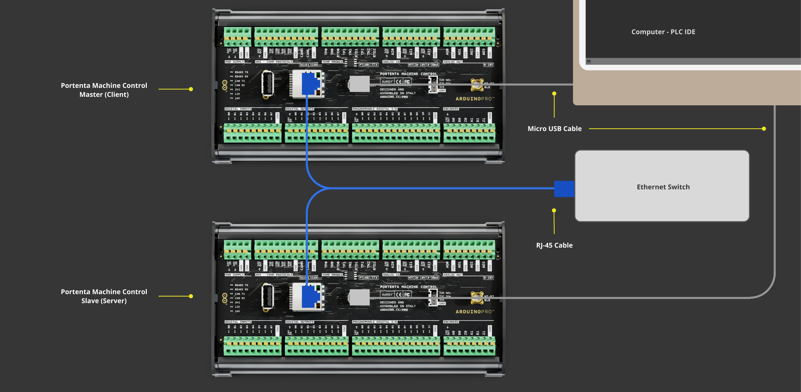

## Overview

The Portenta Machine Control is characterized by its industrial-grade hardware, which provides consistent performance and durability even in the most demanding conditions. A notable feature of its design is the available connectivity options, such as Modbus TCP via the onboard RJ-45 port.


In this tutorial, you will learn how to set up Modbus TCP-based communication between two Portenta Machine Control boards using the Arduino PLC IDE.

## Goals

- Learn how to set up the Arduino PLC IDE workspace environment for Modbus TCP.
- Using the Arduino PLC IDE, learn how to configure Modbus TCP for the Portenta Machine Control.
- Learn how to verify that the Portenta Machine Control has been correctly set up using a Modbus TCP communication example.

## Required Hardware and Software

### Hardware Requirements

- [Portenta Machine Control](https://store.arduino.cc/collections/pro-family) (x2)
- [Micro USB cable](https://store.arduino.cc/products/usb-2-0-cable-type-a-micro) (x2)
- RJ-45 LAN cable (x2)
- Recommended: Ethernet switch (x1)

### Software Requirements

- [Arduino PLC IDE Installer](https://www.arduino.cc/en/software#arduino-plc-ide)
- If you have a Portenta Machine Control, your device will need a unique PLC IDE License key. You can get your license key [here](https://store.arduino.cc/products/plc-key-portenta-machine-control). To learn more, go to the section [License Activation with Product Key (Portenta Machine Control)](https://docs.arduino.cc/software/plc-ide/tutorials/plc-ide-setup-license#6-license-activation-with-product-key-portenta-machine-control) section.
- [Portenta Machine Control Modbus TCP PLC IDE project example file](assets/ModbusTCP_PMC_Example.zip)

## Modbus TCP

The Modbus protocol is a messaging service structure operating with a Client/Server or Controller/Peripheral communications scheme. Recognized as an application protocol, the Modbus data handling mechanism remains distinct from its transmission mechanism.

The **Modbus over TCP/IP** — often referred to as **Modbus TCP** — is a derivative of the Modbus RTU protocol. It uses the TCP/IP interface over Ethernet, which processes data transfer between compliant devices. Modbus TCP is characterized by the following:

* The **Transmission Control Protocol (TCP)** supervises the packet transmissions.

* The **Internet Protocol (IP)** defines the addresses to guide messaging routes.

* A unique feature of Modbus TCP is how it ensures data integrity. Instead of a conventional Modbus checksum, Modbus TCP wraps the main data frame inside a TCP frame. The Ethernet TCP/IP layer's checksum then verifies the data integrity.

* Modbus over TCP/IP follows Ethernet TCP/IP networking standards, using the Modbus messaging service to transfer data. Typically, Modbus TCP/IP networks involve Client and Server devices. Connections can also be made through routers, gateways, or bridges to form a TCP/IP network.

***Controller/Peripheral was formerly known as Master/Slave. Arduino no longer supports this terminology. Devices formerly known as Master are referred to as Controller/Client and devices formerly known as Slaves are referred to as Peripheral/Server.***

## Modbus TCP & PLC IDE

This tutorial will walk you through setting up two Portenta Machine Control devices with Modbus TCP using the Arduino PLC IDE. It is important to understand the overall setup process to ensure a successful deployment of the protocol.

The following diagram visualizes how the Portenta Machine Control is configured and deployed with Modbus TCP:


The entire procedure is divided into three distinct stages:

* **Modbus TCP configuration** is the first step in setting up the Portenta Machine Control device with Modbus TCP and other core settings. A vital part of this step is configuring the IP address, which is necessary for Modbus TCP communication and is defined in the Arduino sketch.

  In this step, the selected Portenta Machine Control is assigned a Modbus TCP role, either Client or Server. Depending on the role, `Status variables` are defined, or a Modbus node is created to identify the devices communicating under this protocol.

* The **PLC program**, created after initializing the device, includes Modbus TCP and other features. The key point of this step is that minimal configuration or coding is required for the Modbus TCP specifics within the PLC code.

  The process is simplified for user convenience. The system automatically manages data transfer via Modbus TCP using preset variables in your PLC code. This method builds on the initial device setup, reducing repetitive tasks and improving communication efficiency.

* **System operation** reflects the intended behavior after configuring Modbus TCP and running the PLC program based on the developer's logic. As a result, the device communicates with other devices through Modbus TCP.

The diagram highlights the consistency of Modbus TCP configuration across Arduino devices using the PLC IDE. A key feature of this system is its flexibility. The PLC program operates independently of the Modbus TCP settings, ensuring interoperability and versatility in various scenarios.

Furthermore, the programming language is flexible when developing the PLC script. PLC IDE follows the *IEC61131-3* standard, allowing development in any of the supported languages and making it easy for program development.

With this overview complete, we can now create an example.

## Instructions

### Setting Up the Arduino PLC IDE

To get the Arduino PLC IDE software, go to the [official software website](https://www.arduino.cc/pro/software-plc-ide) and choose to download the PLC IDE installer file. The software is named **`Arduino PLC IDE Installer`**.


The software requires **Windows 10** or a newer operating system version for the x64 architecture.

The Arduino PLC IDE installer contains the IDE and all the required drivers, libraries, and cores. The following sections will help you install the software properly.

***For more details regarding Arduino PLC IDE setup, please take a look at [Arduino PLC IDE Setup and Board's License Activation](https://docs.arduino.cc/tutorials/portenta-machine-control/plc-ide-setup-license) tutorial.***

### Hardware Setup

We will use two Portenta Machine Control devices and the PLC IDE to set up the Modbus TCP communication.

The Ethernet LAN (RJ-45) cable makes a physical connection between both devices using the `ETH RJ45` port. The following image provides a connection diagram for both devices:



The setup uses an Ethernet switch to monitor the Portenta Machine Control devices with the PLC IDE. This configuration connects the devices and allows you to track information exchanges in real-time. This tutorial recommends using an Ethernet switch for this tutorial to ensure optimal device communication and monitor them in real-time.

### Workspace Pre-Configuration

Some considerations must be understood beforehand for the proper use of Modbus TCP on the Portenta Machine Control within PLC IDE. The following subsections will briefly explain such aspects.

#### PLC IDE Project Configuration & Licenses Management

Understanding project configuration and license management is essential in any robust development environment. The Arduino PLC IDE offers a range of features designed for industrial automation, but using them effectively requires a solid foundation.

We highly recommend reviewing [this tutorial](https://docs.arduino.cc/tutorials/portenta-machine-control/plc-ide-setup-license) before going through the next steps.

#### Portenta Machine Control Basic Configuration

Identify the IP address assigned to each Portenta Machine Control device to establish Modbus TCP communication. Connecting the Portenta Machine Control to a network infrastructure via an RJ-45 cable and an Ethernet port with standard settings will automatically assign an IP address from an external *DHCP* server. Tools like this [scanner](https://angryip.org/) can be useful for locating these auto-assigned IP addresses.

You can also assign a custom IP address to the Portenta Machine Control using the **Ethernet.begin()** method. This is helpful when you need specific addresses because of operational needs. To do this, we will use the sketch available in the `Resources` tab of the PLC IDE. The image below provides an overview of the setup options within the sketch.


***The __Ethernet.begin(ip, dns, gateway, subnet)__ method will delay initialization for 60 seconds if either the RJ-45 cable is not connected or the Ethernet properties, like the IP address, are misconfigured. This behavior can be modified with the __Ethernet.begin(NULL, ip, dns, gateway, subnet, connection_timeout)__ method by adjusting the `connection_timeout` argument. This parameter defines the timeout for establishing a Data Layer connection.***

The virtual serial port will establish communication between the computer and the Portenta Machine Control to develop in the Arduino PLC IDE environment. To pair with the Portenta Machine Control device, activate the Modbus RTU feature and select the highest secondary USB port number by navigating to `On-line -> Set up communication`.


Remember that proper setup is vital when interfacing with the PLC IDE and Portenta Machine Control. Once the Portenta Machine Control properties are all set, you can connect and monitor the status of both devices.

#### Modbus TCP Client and Server Mode

The image below shows the panel that appears when accessing the Modbus TCP configuration in the PLC IDE.


There are two options on the Modbus TCP configuration panel:

- Modbus TCP Master
- Modbus TCP Slave always enabled. Unit Identifier: 255

When `Modbus TCP Master` is not selected, the Portenta Machine Control device automatically takes on the Modbus TCP Server role with its specified Unit Identifier. In this case, the Unit Identifier does not require special attention. The IP address ensures communication with the correct device, even if multiple devices share the same Unit Identifier.

If `Modbus TCP Master` is selected, the Portenta Machine Control device functions as both Client and Server, prioritizing the Client role. In the Ethernet configuration tab, you will also see a *`General Modbus Node`* option, which will be explained in the next section.

#### General Modbus Node Configuration

The General Modbus Node allows you to add information about devices compatible with the Modbus messaging service.


In the `General` tab, we need to provide essential details, most importantly the IP address of the Modbus TCP-compatible device we want to communicate with. Additional properties can also be configured based on the project’s needs and your preferences.

If you initially configure a General Modbus Node with the Portenta Machine Control as a Modbus TCP Master and later deselect the Client role, the Node option will remain. However, the configuration field for that Node will change, requiring a Modbus address within the range of 1 to 247.

#### PLC IDE Modbus Custom Editor

We can also add a Modbus node through the `Ethernet` configuration tab using the Modbus Custom Editor. To access the editor window, navigate to `Tools -> Run Modbus Custom Editor` in the PLC IDE.

The editor allows you to specify the device version, parameters, and predefined Modbus functions. Once set up, it can be integrated into the `Ethernet` configuration tab.


It is a helpful feature to have frequently deployed device configuration stored that is compatible with Modbus protocol.
  
### Project Overview

With the prerequisites in place and the tools for configuring Modbus TCP on the Portenta Machine Control using the PLC IDE, we will now introduce an example project. This project demonstrates how to set up Modbus TCP communication between two Portenta Machine Control devices.

In this example, we will make a small adjustment to the default example code using the counter (`cnt`) variable. The counter value will be transmitted, enabling real-time handshake verification between the two devices. For this tutorial, we will manually assign Ethernet properties to each device.

The `Modbus TCP Server Portenta Machine Control` will provide the counter data, while the `Modbus TCP Client Portenta Machine Control` will manage the programmable digital I/Os and digital outputs. Each device will focus on specific tasks using these elements. You will learn how to assign the Modbus TCP role to each Portenta Machine Control device in the following sections.

For those ready to begin, the complete example project is available for download [here](assets/ModbusTCP_PMC_Example.zip). It includes all the necessary configurations and components, making it ready to compile and upload to the corresponding Portenta Machine Control device.

The next sections will cover the setup for each Portenta Machine Control, explaining their specific roles in Modbus TCP communication.

#### Modbus TCP Server Portenta Machine Control

To configure the Portenta Machine Control as a Modbus TCP Server, go to the `Ethernet` tab in the `Resources` panel of the PLC IDE. The *`Modbus TCP Slave mode`* is always enabled, so no additional settings need to be changed in this window. However, specific properties must be configured for the Portenta Machine Control to work properly with Modbus TCP.

When starting a new project in the PLC IDE, you may notice that the Ethernet properties in the sketch are commented out. To enable the necessary configurations, simply uncomment these lines. The sketch can be found in the `Resources` panel of the PLC IDE. Once you update the sketch, upload it to the Portenta Machine Control using the `Portenta Machine Control Configuration` window.

Below are the required Ethernet properties within the sketch for the Modbus TCP Server Portenta Machine Control.

```arduino
void setup()
{
    // Configure static IP address
    IPAddress ip(192, 168, 1, 2);
	IPAddress dns(192, 168, 1, 23);
    IPAddress gateway(192, 168, 1, 23);
    IPAddress subnet(255, 255, 255, 0);
	// If cable is not connected this will block the start of PLC with about 60s of timeout!
	Ethernet.begin(ip, dns, gateway, subnet);
}
```

The properties — such as `ip`, `dns`, `gateway`, and `subnet` — are used as arguments in the `Ethernet.begin()` method to determine the settings for Portenta Machine Control. These can be configured according to your preferences or network requirements. For instance, `ip(192, 168, 1, 2)` indicates the IP address given to the Modbus TCP Server Portenta Machine Control.

The image below shows the *`Status variables (volatile)`* window. Here, the `cnt` variable will be defined and its access address and data type will be specified for Modbus TCP communication.


The `cnt` status variable uses the following parameters:

* _Address_: 25000 (dec) / 0x61A8 (hex)
* _Name_: cnt
* _PLC type_: INT

To begin configuring, go to **Resources -> Portenta Machine Control**, select the corresponding port, and start the `Manual sketch download`. Then, navigate to **On-line -> Set up Communication** and activate the Modbus RTU protocol with the highest secondary USB port number for the Portenta Machine Control.


Next, select `On-line -> Connect` to connect your computer and the Portenta Machine Control server. If all is set up correctly, a notification will appear in the bottom right corner of the PLC IDE software, indicating a successful connection.


Icons `(1)` and `(2)` represent the different connection states: the Portenta Machine Control connecting without any PLC code and the Portenta Machine Control connecting with an existing PLC code, respectively.

Finally, you will need to compile and upload the main PLC code to the Portenta Machine Control. Access the `main` tab in the `Project` panel and enter the following code:

```arduino
counter_buffer := counter_buffer + 1;

IF counter_buffer >= delay_buffer THEN
	IF cnt < 255 THEN
	    cnt := cnt + 1;
	ELSE
	    cnt := 0;
	END_IF;
	counter_buffer := 0;
	counter_stack := counter_stack + 1;
END_IF;

// Translate count to binary
DO_0 := cnt AND 1;
DO_1 := SHR(cnt,1) AND 1;
DO_2 := SHR(cnt,2) AND 1;
DO_3 := SHR(cnt,3) AND 1;
DO_4 := SHR(cnt,4) AND 1;
DO_5 := SHR(cnt,5) AND 1;
DO_6 := SHR(cnt,6) AND 1;
DO_7 := SHR(cnt,7) AND 1;

IF counter_stack > 50 THEN
	counter_stack := 0;
END_IF;
```

The main role of the Portenta Machine Control server is to run a binary counter controlled by digital outputs based on a sub-counter variable, `cnt`, which operates within an 8-bit range. The counter speed is adjusted using `counter_buffer` and `delay_buffer` as timing parameters. For the client Portenta Machine Control, the shared Modbus counter variable, `counter_stack`, is used.


To integrate the `counter_buffer` and `delay_buffer` variables, right-click on `Global_vars` and select **New Variable**. While `counter_buffer` can be set as an automatic variable, `delay_buffer` was originally defined as a *`constant`* with a fixed value.

To deploy the main PLC code to the Portenta Machine Control, click **`Download PLC code`** or press **F7**. After completing these steps, you will have configured the Portenta Machine Control as a Modbus TCP Server. The next section will guide you through setting up another Portenta Machine Control as a Modbus TCP Client.

#### Modbus TCP Client Portenta Machine Control

To configure the Portenta Machine Control as a Modbus TCP Client, go to the `Ethernet` section in the Resources panel of the PLC IDE. Select the Modbus TCP Client checkbox. This step will assign the Portenta Machine Control as a Client. The Server option that appears greyed out can be ignored.

To begin communicating with the Modbus TCP Server on the Portenta Machine Control, right-click the `Ethernet` section in the `Resources` panel and click **`Add`**. Then, introduce a Generic Modbus node with the following specific parameters for this example:

* _Name_: PMC_TCP_1
* _IP address_: 192.168.1.2
* _Minimum polling time_: 1 ms
* _Address type_: Modbus

The settings for these properties should match those of the Modbus TCP Server Portenta Machine Control. The most important configuration is the IP address. Make sure it matches the address assigned to the server Portenta Machine Control or any other compatible devices if you add more nodes. The final configuration should look like the image below.


When defining the Modbus node for the Client Portenta Machine Control, it is important to specify the Modbus function to retrieve the counter (`cnt`) data from the server Portenta Machine Control. By right-clicking on `PMC_TCP_1` or the name you have chosen, select **Add**. This will open a device catalog window displaying a range of Modbus functions.


To retrieve counter information from the server Portenta Machine Control, choose the **`Modbus FC-04 (Read Input Registers)`** function. To ensure correct data access, set up the `General` tab using the subsequent parameters:

* _Start address_: 25000
* _Polling time_: 0 ms (Continuous Read)
* _Timeout_: 1000 ms


Next, a variable needs to be defined to hold the counter data from the server Portenta Machine Control. To add this variable, go to the `Input Reg.` tab in the Modbus function configuration window. Create a variable called `counter_rec` to store the data transmitted via the protocol.

The following image shows a visual representation of the expected configuration:


The Modbus TCP Client Portenta Machine Control will use the following Ethernet properties for this example.

```arduino
void setup()
{
    // Configure static IP address
    IPAddress ip(192, 168, 1, 1);
    IPAddress dns(192, 168, 1, 3);
    IPAddress gateway(192, 168, 1, 3);
    IPAddress subnet(255, 255, 255, 0);
    // If the cable is not connected this will block the start of PLC with about 60s of timeout!
    Ethernet.begin(ip, dns, gateway, subnet);
}
```

The `ip(192, 168, 1, 1)` represents the IP address of the Modbus TCP Master Portenta Machine Control. While you can modify the Internet Protocol properties as needed, it is essential to make sure the `subnet` aligns with that of your computer.

For this tutorial, the client Portenta Machine Control has been set up to use digital programmable I/Os and digital outputs.

The image below provides a glimpse of its appearance within the PLC IDE interface:


These elements also need labels to reference them later in the main PLC code. A table displaying the variable names designated for digital programmable I/Os can be seen below:


The main program below will fetch counter data, control programmable digital I/Os, and manage corresponding digital outputs. A successful Modbus TCP communication will process previous tasks accordingly.

```arduino
counter := counter_rec;

IF counter >= 10 THEN
	DIO_0 := 1;
END_IF;

IF counter >= 20 THEN
	DIO_1 := 1;
END_IF;

IF counter >= 30 THEN
	DIO_2 := 1;
END_IF;

IF counter >= 40 THEN
	DIO_3 := 1;
END_IF;

IF counter >= 50 THEN
	DIO_0 := 0;
	DIO_1 := 0;
	DIO_2 := 0;
	DIO_3 := 0;
	server_opCycle := server_opCycle + 1;
END_IF;

// Translate count to binary
DO_0 := server_opCycle AND 1;
DO_1 := SHR(server_opCycle,1) AND 1;
DO_2 := SHR(server_opCycle,2) AND 1;
DO_3 := SHR(server_opCycle,3) AND 1;
DO_4 := SHR(server_opCycle,4) AND 1;
DO_5 := SHR(server_opCycle,5) AND 1;
DO_6 := SHR(server_opCycle,6) AND 1;
DO_7 := SHR(server_opCycle,7) AND 1;
```

The `counter` variable serves as a universal reference for the client Portenta Machine Control. The `counter_rec` variable is specifically defined for Modbus transactions, capturing data from the server Portenta Machine Control related to the `counter_stack`. This variable was set up during the `Read Input Registers` Modbus function.

For operational indicators, the client Portenta Machine Control will use four programmable digital outputs, along with all digital outputs. Each time the `counter` reaches a multiple of ten, the corresponding programmable digital output, based on the first digit of the counter, will be triggered. For example, when the `counter` reaches 10, programmable digital output #1 is activated.

When the `counter` reaches `50` and then resets, it means the end of an operational cycle. This cycle repeats, with the digital outputs representing the cycle count as a binary counter. The counter value is stored in `server_opCycle`.

Once the main PLC code has been successfully compiled and downloaded to the client Portenta Machine Control, the complete workspace interface should look like the following image:


The Portenta Machine Control is now ready as a Modbus TCP Client.

### Testing Modbus TCP Communication Between Portenta Machine Control Devices (PLC IDE)

You can access the complete example project [here](assets/ModbusTCP_PMC_Example.zip).

Set both Portenta Machine Control devices running with the corresponding main PLC code with the hardware setup explained in [this section](#hardware-setup). You will be able to observe the following results on client Portenta Machine Control periodically:


In the clip, the left window shows the Modbus TCP Client Portenta Machine Control while the right window displays the Modbus TCP Server Portenta Machine Control.

The server Portenta Machine Control is responsible for:

- Running a binary counter using digital outputs as visual indicators within an 8-bit range.
- Incrementing the shared Modbus counter variable each time the 8-bit binary counter completes a cycle.
- Adjusting the counter's speed by modifying buffer variables to match the desired timing.

Meanwhile, the client Portenta Machine Control will:

- Retrieve the counter data from the server using the Modbus protocol.
- Decode the data and trigger the appropriate programmable digital I/Os.
- Use the entire cycle of programmable digital I/Os to represent the total operation cycles displayed as a binary counter through the digital outputs.

## Conclusion

In this tutorial, you have learned how to configure the workspace environment for Modbus TCP using the Arduino PLC IDE and the Portenta Machine Control.

Additionally, through a practical example, you have ensured the proper configuration of the Portenta Machine Control and verified that Modbus TCP communication works correctly. The example demonstrated using features like programmable digital I/Os in the Portenta Machine Control device.

### Next Steps

Now that you have implemented Modbus TCP between Portenta Machine Control devices using the Arduino PLC IDE, try expanding the setup by adding more Modbus TCP-compatible devices. You can also enhance this setup with Opta™ devices. Watch this [video](https://youtu.be/reBrbCq86uQ) to learn more.

Explore further possibilities by leveraging the onboard features of the Portenta Machine Control, combined with Modbus TCP, to create robust solutions for industrial management systems.

For more information on implementing the Modbus RTU protocol on a Portenta Machine Control, check out the [**Getting Started with Modbus RTU on Portenta Machine Control**](https://docs.arduino.cc/tutorials/opta/getting-started-with-modbus-rtu) tutorial.