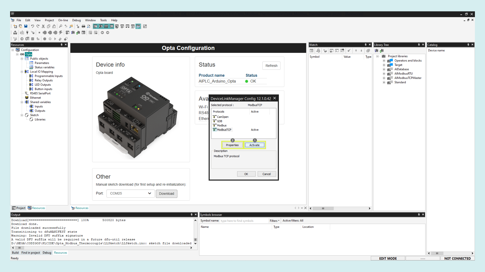
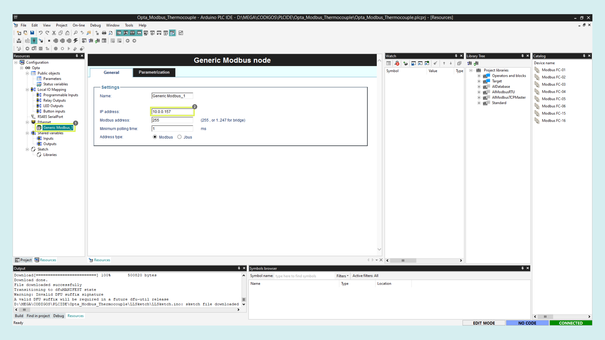

## Overview

In this tutorial, a Portenta Machine Control and an Opta micro PLC will be used as a **server** and a **client** respectively to share temperature information through a Modbus TCP using the PLC IDE. The server will do the measurements using a type K thermocouple and the client will activate its relay outputs when a certain threshold is reached.

Here is a detailed guide in video format if you are a visual learner.

<iframe width="560" height="315" src="https://www.youtube.com/embed/reBrbCq86uQ?si=q0EkR-B8bR0MeF5p" title="YouTube video player" frameborder="0" allow="accelerometer; autoplay; clipboard-write; encrypted-media; gyroscope; picture-in-picture; web-share" allowfullscreen></iframe>


If you prefer reading, continue here.

## Goals

- Learn how to measure temperature with the Portenta Machine Control using a thermocouple and the PLC IDE
- Learn how to use the Modbus protocol over TCP/IP using the PLC IDE
- Leverage Arduino Pro products for real industrial applications 

## Hardware and Software Requirements

### Hardware
- [Portenta Machine Control](https://store.arduino.cc/products/arduino-portenta-machine-control) (x1)
- [Opta™](https://store-usa.arduino.cc/collections/opta-family) (x1)
- Type K thermocouple (x1)
- Ethernet cables (x2)
- Wired internet access
- 24 VDC Power Supply (x2)
### Software
- The [Arduino PLC IDE](https://www.arduino.cc/pro/software-plc-ide) (including Arduino PLC IDE Tools)
- [Portenta Machine Control - PLC IDE Activation](https://docs.arduino.cc/tutorials/portenta-machine-control/plc-ide-setup-license)

## Instructions 

### Solution Wiring


- In the __Portenta Machine Control__, connect the thermocouple terminals to TP0 and TN0 respectively. The 24 VDC power supply to the 24-volt input and GND. 

- In the __Opta micro PLC__, connect the power supply to the respective inputs on the screw terminals.

- Connect both the PMC and the Opta to your router using ethernet cables.

### Portenta Machine Control Setup

After downloading the [PLC IDE](https://www.arduino.cc/pro/software-plc-ide), open it and create a __new project__ for the Portenta Machine Control.


We need a license for this product to be used with the PLC IDE that we can buy directly from the [Arduino store](https://store-usa.arduino.cc/products/plc-key-portenta-machine-control), it will include a **product key** needed to activate the device. 

Connect the PMC to the computer using a micro USB cable, the board needs to run a specific program (runtime) in order to interact with the **PLC IDE**. To flash it, select the device serial port and click on download.


Once the runtime is flashed, navigate to **On-line > Set up communication**, open the **Modbus** properties and select the **secondary** serial port, then click "OK". 


Now, in the upper left corner, click on the **Connect** button and wait for the base program to be uploaded. A green **Connected** flag should appear in the lower right corner if everything goes well.


The device will show its activation status, in this case, **No License** as is the first time we are using it with the PLC IDE. To activate it, paste the **product key** you bought in the highlighted box and click on **Activate**. 


After that, the status should say **OK**, and now you are ready to start programming the Portenta Machine Control with the PLC IDE.

If want to learn more about the PLC IDE first setup, continue reading this [detailed guide](https://docs.arduino.cc/software/plc-ide/tutorials/plc-ide-setup-license/#6-license-activation-with-product-key-portenta-machine-control).

#### Modbus TCP - Server
For the Modbus TCP configuration, on the **resources tab** go to the **Ethernet** section. As noticed, the Modbus TCP Slave mode is always enabled, so you don't have to make any changes.


Now, go to the **sketch editor** and uncomment the library and setup function code lines. As the IP, we must use the same as the Portenta Machine Control, as it is connected to your router, you can find it on its configurations. 

In this case, the following configurations are used.

```arduino
// Enable usage of EtherClass, to set static IP address and other
#include <PortentaEthernet.h>
arduino::EthernetClass eth(&m_netInterface);

void setup()
{
	// Configure static IP address
	IPAddress ip(10, 0, 0, 157);    // Portenta IP address
	IPAddress dns(10, 0, 0, 1);     // gateway IP address
	IPAddress gateway(10, 0, 0, 1); // gateway IP address
	IPAddress subnet(255, 255, 255, 0); 
	// If cable is not connected this will block the start of PLC with about 60s of timeout!
	eth.begin(ip, dns, gateway, subnet);

}
```


Now, create the variable that will be shared with the temperature sensor data in the network. For this, we go to **status variables** and click on **Add**, we give it a name, in this case: `temp_send`, change the variable address to `25000`, and the type to `REAL`.


Next, go to **Temperature probes** and select the sensor type, for this tutorial, enable the **thermocouple** connected to the first channel by setting it to true.


Finally, go to the **main program** in **project** and match the temperature variable with the temperature sensor lectures as follows:

```
temp_send := sysTempProbes[0].temperature; 
```


To check if everything is okay, click on compile, and if no error is shown, you can upload the code to your Portenta Machine Control. 


Once uploaded, click on the **Connect** button again. Now, you can monitor the **temp_send** variable in the **Watch** window dragging and dropping it from the __Global shared__ variables in the project tab.

You should see the temperature value measured by the sensor.


### Opta Micro PLC Setup

Now the server is configured, create a new project, this time for the Opta™ micro PLC that will be the Client or Master.


Upload the runtime for Opta™ by selecting its serial port and clicking on the **Download** button as before.


Once the runtime is flashed, with your Opta™ connected to your router, search for its IP address on the router configurations.

On the PLC IDE, navigate to **On-line > Set up communication**, activate and then open the **ModbusTCP** properties, add the Opta™ IP address, then click "OK". 




Now, in the upper left corner, click on the **Connect** button and wait for the base program to be uploaded. A green **Connected** flag should appear in the lower right corner if everything goes well.


***The Opta™ doesn’t need any license activation to be used with the PLC IDE***

#### Modbus TCP - Client

With the Opta™ successfully connected to the PLC IDE, it is time to configure the Modbus TCP communication.

In the **Ethernet** tab, enable the Modbus TCP Master mode.


Then right-click on the **Ethernet** tab, click on **Add** and select the _Generic Modbus device_.


On the `Generic Modbus_1` device settings, enter the Server IP, the Portenta Machine Control One.



Right-click on the device and add the FC-04 Modbus function that will let us read the server input registers. 


Now, click on the function and in the general settings, enter the shared variable address that you defined earlier in the server, `25000` in this case.


In the Input Register tab, create a label for it, which could be `temp_reg`.


Now, go to the **sketch editor** and uncomment the library and setup function code lines. As the IP, we must use the same as the Opta™. 

In this case, the following configurations are used.

```arduino
// Enable usage of EtherClass, to set static IP address and other
#include <PortentaEthernet.h>
arduino::EthernetClass eth(&m_netInterface);

void setup()
{
	// Configure static IP address
	IPAddress ip(10, 0, 0, 227);    // Opta IP address
	IPAddress dns(10, 0, 0, 1);     // gateway IP address
	IPAddress gateway(10, 0, 0, 1); // gateway IP address
	IPAddress subnet(255, 255, 255, 0); 
	// If cable is not connected this will block the start of PLC with about 60s of timeout!
	eth.begin(ip, dns, gateway, subnet);

}
```


Finally, define the Opta™ outputs behavior in function of the temperature read from the Portenta Machine Control. For this, we go to the **resources tab > Relay Outputs** and we give a variable name to each relay, in this case, call them `relay_1`, 2, 3 and 4 respectively.


The same with the LED outputs, LED1, 2, 3 and 4.


Now, go to the main code in the Project tab. Create a variable by right-clicking on the local variables window and then **insert**, call it **temp_local** and _integer_ as the type.


In the code editor, match the local variable with the shared one sent by the Portenta Machine Control.

And once stored locally, design the logic to control the outputs as you want. In this case, four different temperature levels will be set to control each output with the temperature rise respectively. Copy and paste the following script into the **main code** section.

```
temp_local:= temp_reg;

IF temp_local >= 30 THEN
    relay_1 := TRUE;
    LED1 := TRUE;    
ELSE
    relay_1 := FALSE;
    LED1 := FALSE;
END_IF;

IF temp_local >= 50 THEN 
    relay_2 := TRUE;
    LED2 := TRUE;
ELSE
    relay_2 := FALSE;
    LED2 := FALSE;
END_IF;

IF temp_local >= 70 THEN 
    relay_3 := TRUE;
    LED3 := TRUE;
ELSE
    relay_3 := FALSE;
    LED3 := FALSE;    
END_IF;

IF temp_local >= 100 THEN 
    relay_4 := TRUE;
    LED4 := TRUE;
ELSE
    relay_4 := FALSE;
    LED4 := FALSE;    
END_IF;

```


With the final code written, compile the project and upload it the the Opta™ micro PLC.

### Final Test

You can leave each device connected separately to the internet router or connect them together directly with one ethernet cable. The first option will let you update the preferred device remotely as you can access it through the local network.

Now, you can expose the temperature sensor to some heat and monitor it from the PLC IDE. The Opta™ relay outputs and LEDs will close and turn on when the temperature surpasses the programmed thresholds respectively.


#### Conclusion 

In this tutorial you learned how to communicate two Arduino PRO products using the Modbus TCP protocol, demonstrating a simple application of sharing temperature data to control a device's outputs.

As you can notice, the configuration process is very straightforward and the results were as expected. 