## Introduction

In this application note, you will learn how to control the temperature of an industrial tank using a PT100 RTD sensor connected to a Portenta Machine Control and an Opta™ that will be responsible for the tank temperature control.


The system will send the temperature values from the Portenta Machine Control to the Opta™ using Modbus RTU over the RS-485 interface. The Opta™ will subsequently use these values and control the reservoir temperature accordingly.

## Goals

- Establish connection between Portenta Machine Control and Opta™ using Modbus RTU
- Control the temperature of a tank of industrial category
- Learn about Modbus RTU and RS-485 of how it can be used in different professional applications
- Learn more about PLC IDE and how to use it to create Modbus communications in industrial environments

## Hardware and Software Requirements

### Hardware Requirements

- [Portenta Machine Control](https://store.arduino.cc/products/arduino-portenta-machine-control) (x1)
- [Opta™ with RS-485](https://store.arduino.cc/collections/home-industrial-automation) (x1)
- Micro-USB cable (x1)
- USB-C® cable (x1)
- PT100 RTD (x1)

### Software Requirements

- The [Arduino PLC IDE](https://www.arduino.cc/pro/software-plc-ide) (including Arduino PLC IDE Tools)
- [Portenta Machine Control - PLC IDE Activation](https://docs.arduino.cc/tutorials/portenta-machine-control/plc-ide-setup-license)
- [Opta™ - Set up with PLC IDE](https://docs.arduino.cc/tutorials/portenta-machine-control/plc-ide-setup-license#7-license-activation-with-pre-licensed-products-opta)
- You can directly download the Arduino [PLC IDE Projects](assets/pmc-opta-temp-ctrl.zip) and extract them in your workspace

***It is recommendable to read ["Connect RTD/Thermocouple to the Portenta Machine Control"](https://docs.arduino.cc/tutorials/portenta-machine-control/rtd-thermocouple-pmc) tutorial before continuing present tutorial.***

## Temperature Sensor

In this tutorial, a **Two-wire PT100 RTD** is used, but you can also use a Three-wire RTD or a thermocouple depending on your requirements or preferences. You can learn more about the differences between these temperature sensors and how to connect them to the Portenta Machine Control following the [previously mentioned tutorial](https://docs.arduino.cc/tutorials/portenta-machine-control/rtd-thermocouple-pmc). It is recommendable to read [this tutorial](https://docs.arduino.cc/tutorials/portenta-machine-control/rtd-thermocouple-pmc) to learn the basics about the temperature sensors introduced earlier.

## Connections

To establish communication between Opta™ and the Portenta Machine Control, we will do it through Modbus RTU communication using the RS-485 interface. The following table shows the required connection between two devices to achieve this communication:

<div align="center">

| **Opta™** | **Portenta Machine Control** |
|:---------:|:----------------------------:|
|    A(-)   |            TXP 485           |
|    B(+)   |            TXN 485           |
|    GND    |              GND             |

</div>

The Portenta Machine Control has support for full-duplex communication, while Opta™ specifically supports half-duplex communication. Due to this reason, the **TXP** and **TXN** RS-485 pins will be used only on the PMC as shown in the following image:

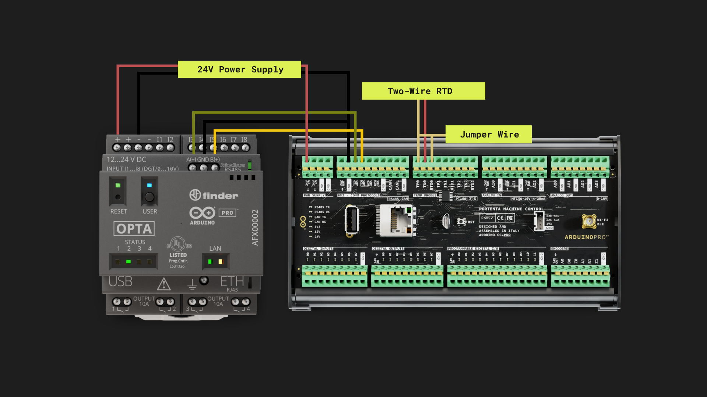

***Because Opta™ has no internal termination resistors, it must be installed per the Modbus protocol specification adding termination resistors. Also, if you experience inconsistent data transmission using Opta™ with other Modbus RTU compatible devices, please try again by inverting the A(-) and B(+) lines.***

## PLC IDE

To enable this example, you will need to create **two PLC IDE projects**. One project will be for the Portenta Machine Control, which will act as a Server in the Modbus RTU communication, while the other project will set the Opta™ to behave as the Client.

To create a project, open PLC IDE and click on `New Project`:


### Portenta Machine Control Project

#### Create the PMC Project
<br></br>

After clicking on `New Project` in the previous step, a window will appear. Set the name of your choice for the project and select **`Portenta Machine Control 1.0`** on the Target Selection:


#### Modbus Server Configuration
<br></br>

Once created, you will configure the Modbus RTU connection through the RS-485 serial port. To do this, go to the resources window and double-click on `RS485 SerialPort`. If you can't see the `Resources` tab, try going to ```View > Tool windows > Resources```.


On the `Modbus Configuration` window, set the following parameters to configure Portenta Machine Control as a Server:

- Mode: Modbus RTU Slave
- Port Type: RS-485
- Baud rate: 19200 b/s
- Serial Mode: N,8,2 (No parity, 8 data bits, 2 stop bits)
- Modbus address: 17

In this case, Modbus Server address is set as **17**, but you can define one address in the `1 ... 247` range. Your Modbus RS-485 Server configuration should look like this:


***Do not forget the configured Modbus address, as you will need it in the future.***

You will now create the variable that will be sent through Modbus RTU. To do this, go to the `Resources` window and double-click on `Status variables`:

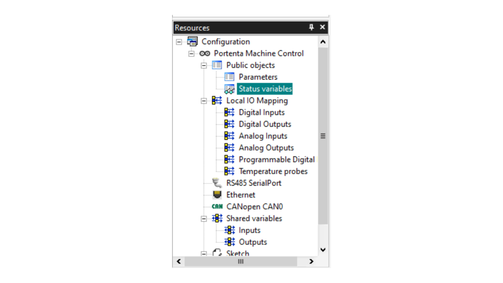

A `Status Variables (volatile)` window will appear. Click on the `Add` button and set the following parameters:

- Address: 25000
- Name: temp_send
- PLC type: INT

If everything is correct, it should look like in the next image:


This is all the necessary configuration on the server side. In the next step, you will configure the temperature sensor to be paired with Portenta Machine Control.

#### Temperature Sensor Configuration
<br></br>

We need to read the values of the temperature sensor. In this case, we are using a PT100 RTD as explained in the [Connect RTD/Thermocouple to the Portenta Machine Control](https://docs.arduino.cc/tutorials/portenta-machine-control/rtd-thermocouple-pmc) tutorial, but you can also use a Three-wire RTD or a Thermocouple depending on what you need.

To configure the temperature sensor, in the `Resources` window, double click on **`Temperature probes`** and select the `Behavior setting` depending on the sensor you are using and also the `TPXX` where the sensor is connected.

In this case, we are using an `RTD TWO WIRES` connected to the `TP00`, so we will set the Enable option as True shown in the following image:

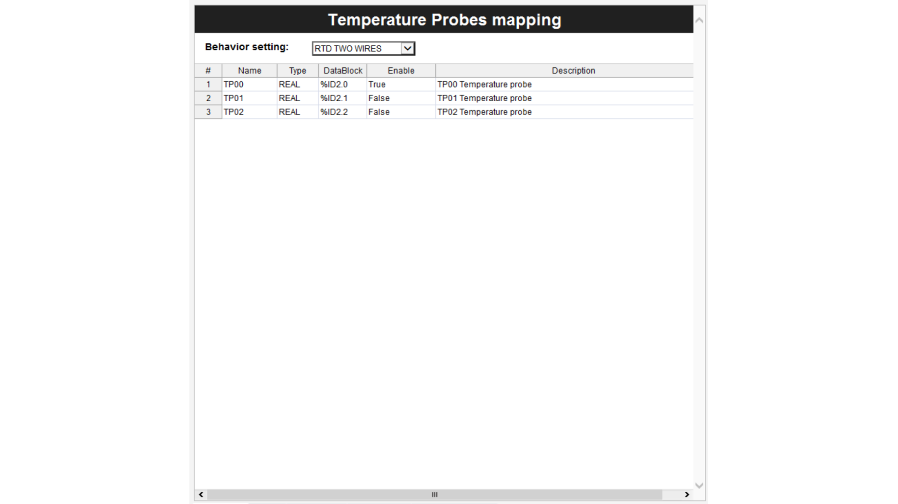

Inside the `Project` window, double-click on the `Main` program located under `Tasks` --> `Fast`, right-click on the `Local variables` section on top, and click `Insert`. You can also do the same by pressing `Ctrl + Shift + Ins`. Name the variable as `temp0` and select the type as `Real`.

#### Main Program Code
<br></br>

In the code section, you have to write the following code:

```
temp0 := sysTempProbes[0].temperature;
temp_send := temp0 * 100.00;
```

The Main code will read the sensor values from the temperature sensor stored in `sysTempProbes[0]`. The second line will multiply the temperature value by 1000 to convert it into a convenient integer value to send to Opta™; the Main program should look similar to the following figure:

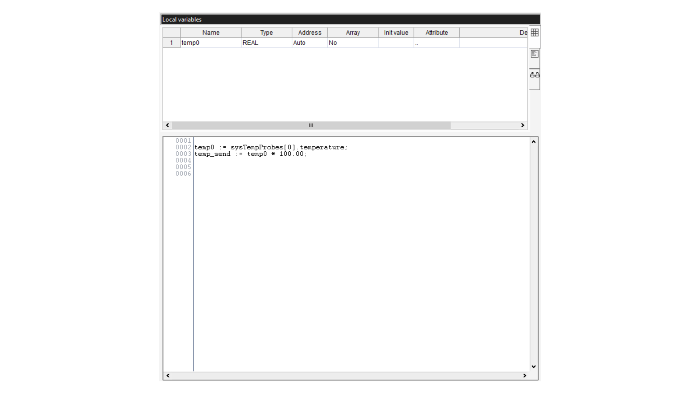

***By default, the project creates an automatic type int global variable called `cnt`. You can delete it by right-clicking on it and clicking `Delete`.***

#### Monitor the Values
<br></br>

Once followed all the previous steps, you will need to compile the program and download it to the Portenta Machine Control. First, connect your device and click on the `Connect to the target` button. You can also do the same by following ```On-line > Connect``` (We assume that you have activated your board license. If not, please [follow this tutorial](https://docs.arduino.cc/tutorials/portenta-machine-control/plc-ide-setup-license)).

Once connected, click on the `Compile PLC Project` to compile it. You can also do the same on ```Project > Compile``` or by pressing the **F7** key:


Then click on `Download PLC code` to download it to the board. You can also do it by going to ```On-line > Download code``` or by pressing the **F5** key:


To ensure that we are reading correct temperature values on the Portenta Machine Control, you can pick and drop the variable to the `Watch` window. If you can't see the `Watch` window, please try ```View > Tool window > Watch``` option.

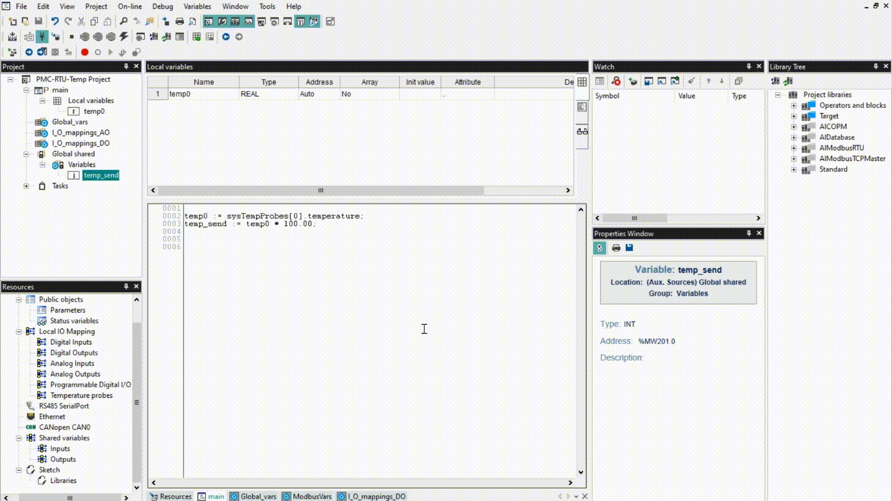

### Opta™ Project

#### Create the Opta™ Project
<br></br>

After creating and configuring the Portenta Machine Control project, you can create a new project for Opta™ by clicking on ```File > New Project```. It will display a new window where you have to insert a name for the Opta™ project and make sure that the **`Opta 1.0`** is selected on the Target Selection:

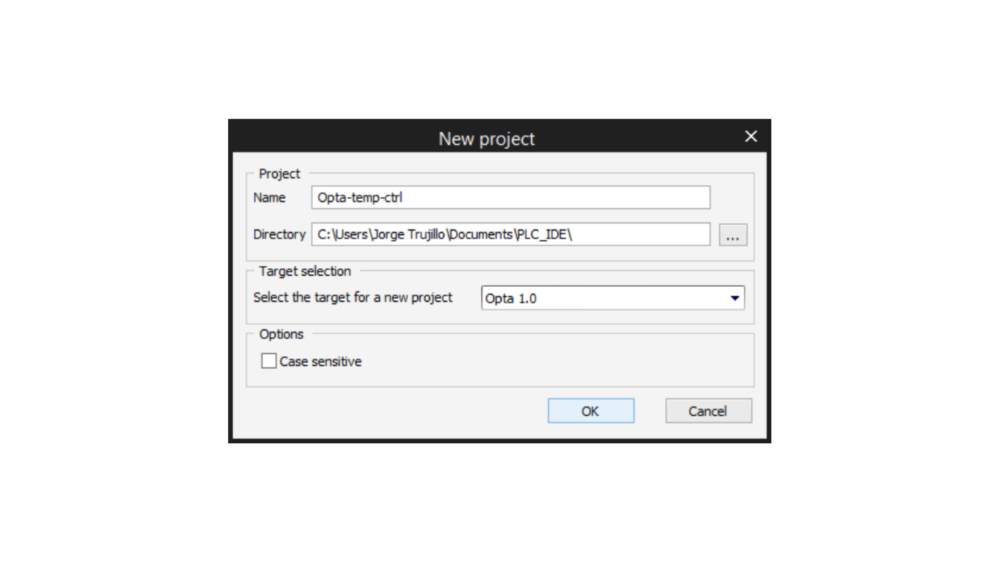

#### Client Modbus Configuration
<br></br>

On the Opta™ side, you will need to configure Modbus as the Client to receive the temperature values. To do that, you need to go to the `Resources` window and double-click on `RS485 SerialPort`:


On the `Modbus Configuration` window, you need to set the following parameters to configure it as the Master (Client):

- Mode: Modbus RTU Master
- Baud rate: 19200 b/s
- Serial Mode: N,8,2 (No parity, 8 data bits, 2 stop bits)

The configuration should contain same setting as the following image:

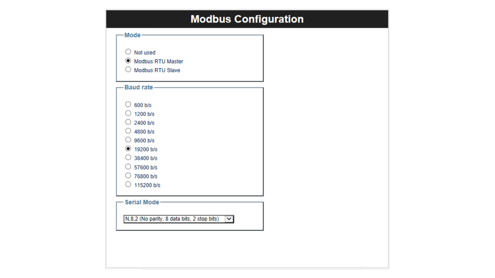

After configuring the Serial Port, go to the `Resources` tab and right-click on `RS485 SerialPort` and click on `Add`:


A new window named `Device catalog` will appear. On this window, select `Generic Modbus 1.0 Generic Modbus node` and click on `Select`:

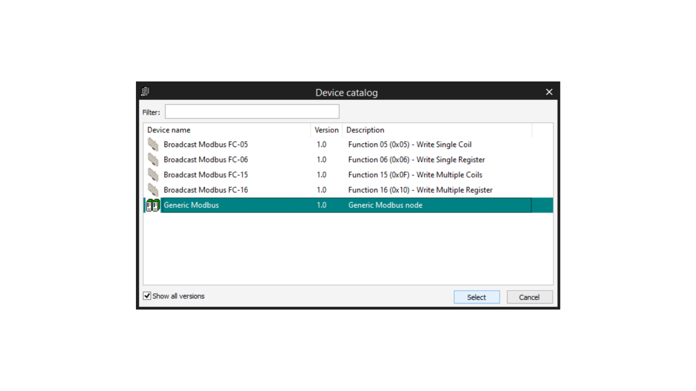

On the `Generic Modbus node` window, you will set the **slave configuration** for communicating with the Portenta Machine Control. On `Modbus address` field, set the server address that we previously configured for the Portenta Machine Control.
It should look as following image:

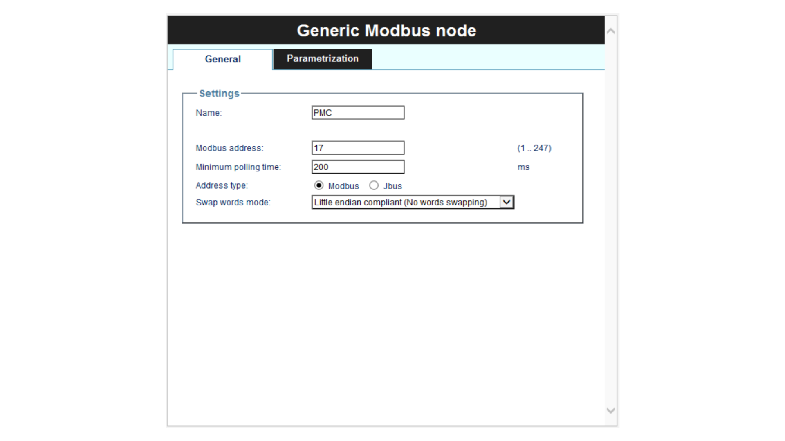

Now that we added the Portenta Machine Control Modbus node to the net, we need to read the temperature values from its database. To do this, right-click on the `PMC` node that we have created and click `Add`:


Here is a comprehensive list of the different options that you can add depending on your necessities:

- **Modbus FC-01 (Read Coils)**: reading of one or more RW bits by the slave node
- **Modbus FC-02 (Read Discrete Inputs)**: reading of one or more RO bits by the slave node
- **Modbus FC-03 (Read Holding Registers)**: reading of one or more RW registers by the slave node
- **Modbus FC-04 (Read Input Registers)**: reading of one or more RO registers by the slave node
- **Modbus FC-05 (Write Single Coil)**: writing of a single RW bit on slave node
- **Modbus FC-06 (Write Single Register)**: writing of a single RW register on slave node
- **Modbus FC-15 (Write Multiple Coils)**: writing of one or more RW bits on slave node
- **Modbus FC-16 (Write Multiple registers)**: writing of one or more RW registers on slave node

We will select `Modbus FC-04 1.0 Read Input Registers  - Function 04 (0x04)` to read the temperature values on the Portenta Machine Control database, and click `Select`.

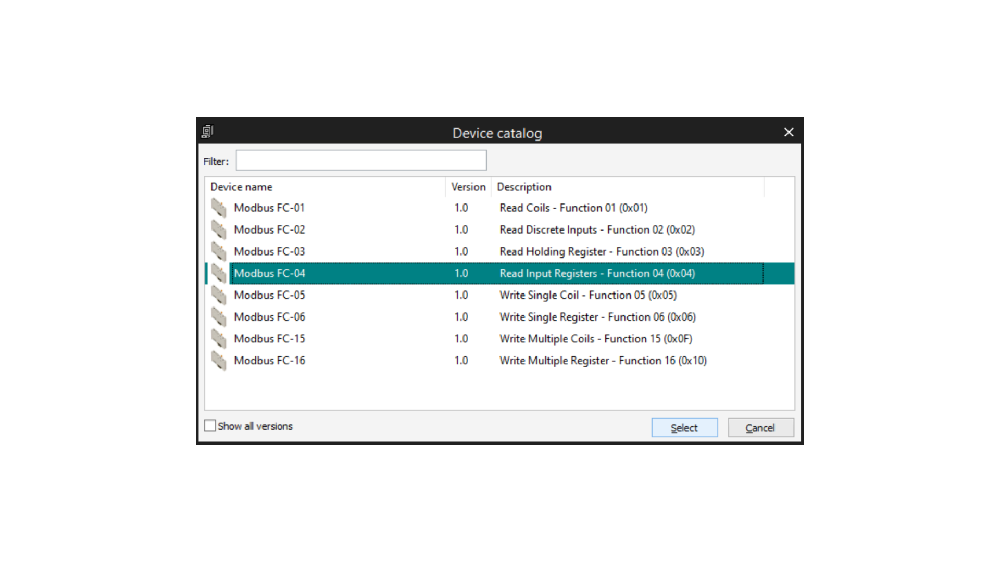

After clicking on `Select`, a new configuration window will appear. Here we will configure the Reading of Input Registers. To do this, set the start address of the memory address that we set before on the Portenta Machine Control configuration, as shown in the following image:


With the parameters defined, click on the `Input Reg.` tab inside the same configuration window. Inside this window click `add` on the left corner, and type `temp_volt` or a name of your choice. This will be the variable where we store the reading values for the Portenta Machine Control database. That tab should look like this:

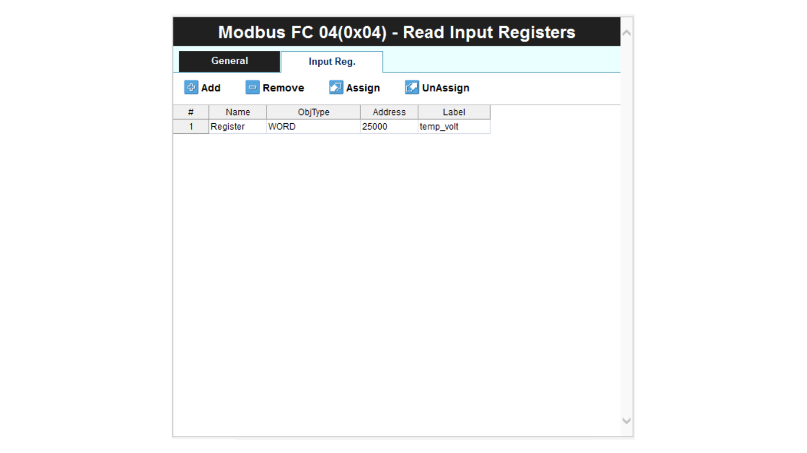

To select a type for this variable, we need to go to the `Projects` window and double-click on `Modbus_Vars`, and then double-click on `temp_volt`. Write `INT` in the `Type` column to assign an Integer type to the variable. In the future, we will convert this value into comprehensive data. The variable window should be like this:


#### Main Program Code
<br></br>

Before going with the main program code, go to the `Project` window, right-click on `Global_vars > New variable > Automatic` and set `temp` as the variable name, and type `REAL` on the variable type and click `Ok`:


Now that we have created the global variable where we are going to store the temperature values in `REAL` type format, go to `main` by double-clicking on it in the `Project` window. In the `Local variables` tab, right-click on a white space and click `Insert`. You can also do the same by pressing `Ctrl + Shift + Ins`. For this new variable, set the name `threshold` and Type as `REAL`.

In the code window, paste the next code:

```
//Set the temperature threshold to trigger on the relay

threshold := 30.00;

//This IF - ELSE turns on the Green LED when the Modbus communication is ok

IF sysMbMRtuNetList[0].active = FALSE THEN
    LEDG := FALSE;
ELSE 
    LEDG := TRUE;
END_IF;

//Adjust the received temperature data into actual correct value.
temp := temp_volt / 100.00;

//Control the relays depending on the temperature value compared to the Threshold

IF temp >= threshold THEN
    relay_1 := TRUE;
    LED1 := TRUE;
ELSE
    relay_1 := FALSE;
    LED1 := FALSE;
END_IF;
```

The main program window should look like this:

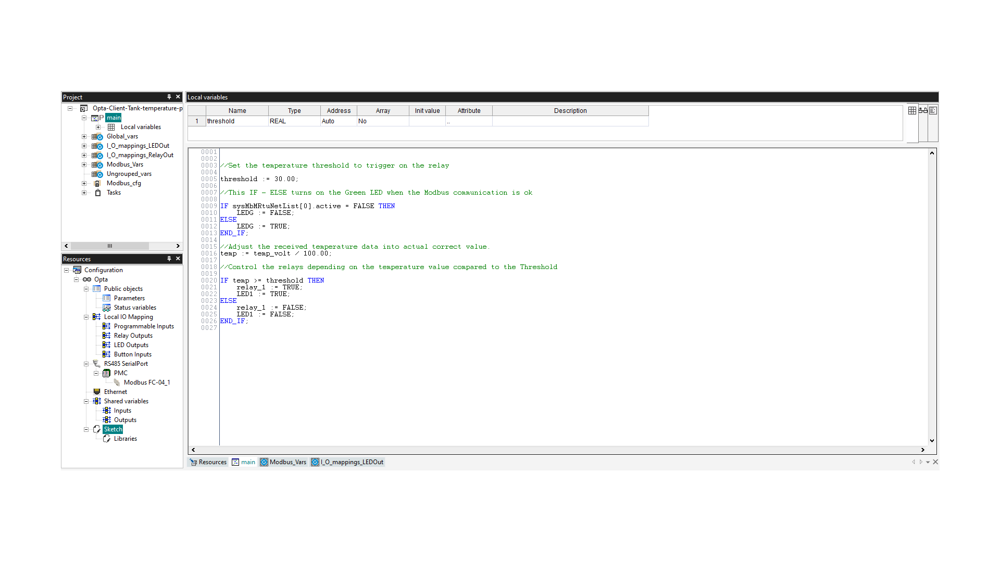

The variables `LED1`, `LEDG`, and `relay_1` represents onboard features of Opta™.

- `LED1`: is the number one status LED.
- `LEDG`: represents the Green LED.
- `relay_1`: represents the relay terminal one.

To use the variables `LED1`, `LEDG`, and `relay_1` in the main program, they need to be linked to their corresponding hardware outputs. To achieve this:

1. Navigate to the Resources tab.
2. Proceed to LED Outputs.
3. Associate the `LED1` and `LEDG` variables with their respective hardware outputs: 'L1' and 'LG'.

The setup should resemble the following image:


Following a similar process:

1. For the `relay_1` variable, associate it with the `O1` hardware output.
2. This can be done in the 'Relay Outputs' mapping section:


***Mapping onboard elements ensures that your software instructions directly influence the corresponding physical hardware components, bridging your program's logic with real-world actions.***

#### Task Configuration
<br></br>

It is recommendable to set an executing period of 50 ms for the main task; to do this, double-click on `Tasks` inside the `Project` window; a new `Tasks Configuration` window will appear.

On this window, change the `Set period` option of the `Fast Task` to `Yes` and set choose 50 ms period. If you want to learn more about task configuration, take a look at [this tutorial](https://docs.arduino.cc/software/plc-ide/tutorials/plc-programming-introduction#task-attachment).


#### Monitor the Values
<br></br>

Before begin monitoring the values, connect your Opta™, compile the code, and download it to the board as shown in the [Portenta Machine Control Monitor the Values section](#monitor-the-values). The following short clip provides an overview of what you can expect during the operation:

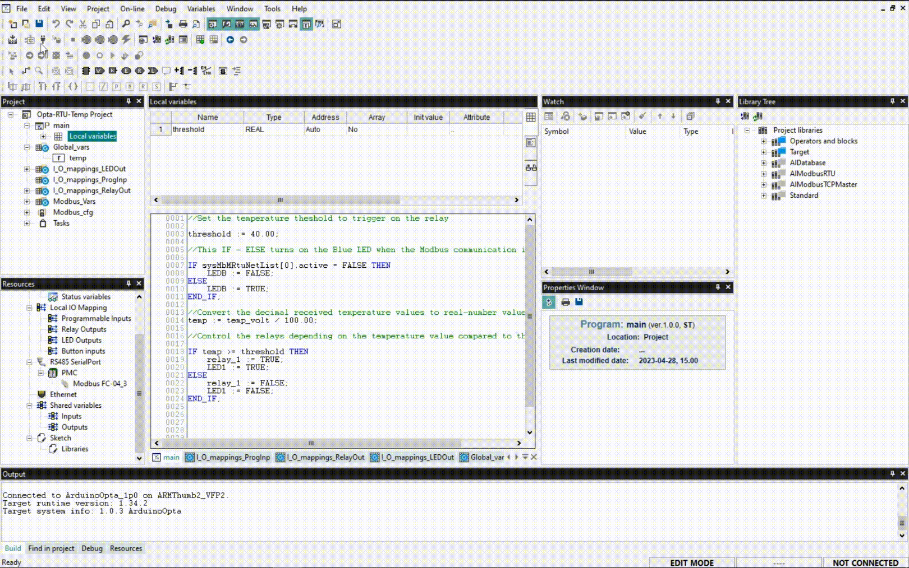

***Note: `temp_volt` variable refers to the read values from the Portenta Machine Control Database through Modbus RTU protocol.***

If you reach the threshold of 30 degrees Celsius, the Opta™ device's relay will close and the LED1 will turn on. Remember that you can set this value to any value you need by changing the threshold parameter in the main program code.

## Download the PLC Project

We recommend you follow **all the steps** to understand thoroughly how the project works and what are we doing in each step, but you can also directly download the Arduino PLC IDE Projects on the [Software Requirements](#software-requirements) section and uncompress the Zip file on your Arduino PLC IDE Projects Folder to set and test the example project.

## Conclusion

In this tutorial, you have learned how to measure and **control the temperature** of an industrial tank by reading the temperature values using an RTD with the Portenta Machine Control and sending it via Modbus RTU on the RS-485 interface to process the reading values and controlling a relay, activating a cooling system when a temperature has reached the threshold.

## Next Steps

It has been a theoretical guide on how to do it, so the challenge in this project now is to apply it in a real environment scenario, taking into account some other factors and applying [PID](https://en.wikipedia.org/wiki/PID_controller), normally used in these industrial applications.

Note that this same circuit can be used for many more scenarios than the temperature control of an industrial tank, as well the heating control of a home, or the refrigeration of a food chamber.

Use your imagination and knowledge to put into practice what you have learned in this tutorial, and if you have any questions, feel free to ask them at our [Arduino Help Center](https://support.arduino.cc/hc/en-us).
