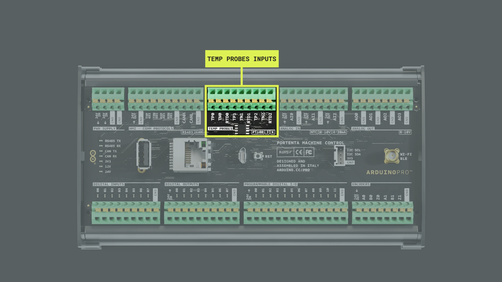
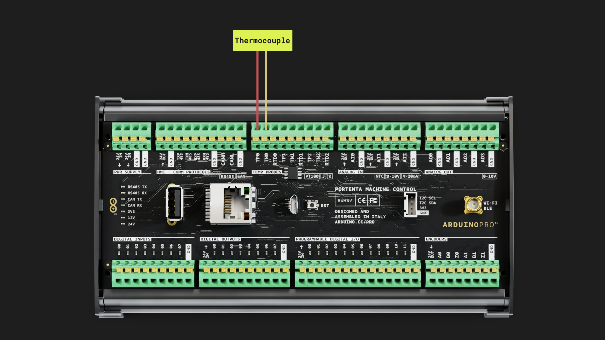
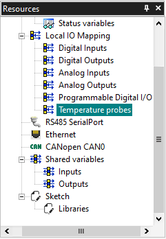
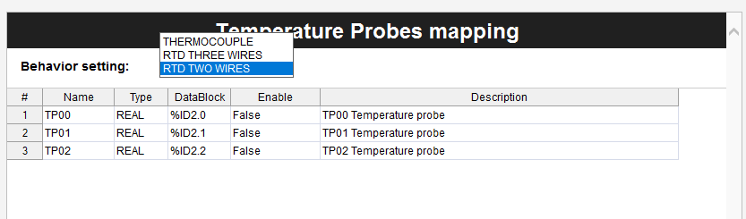
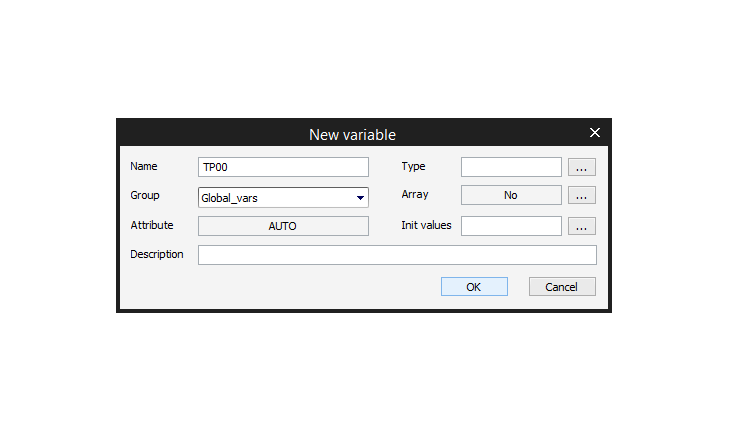
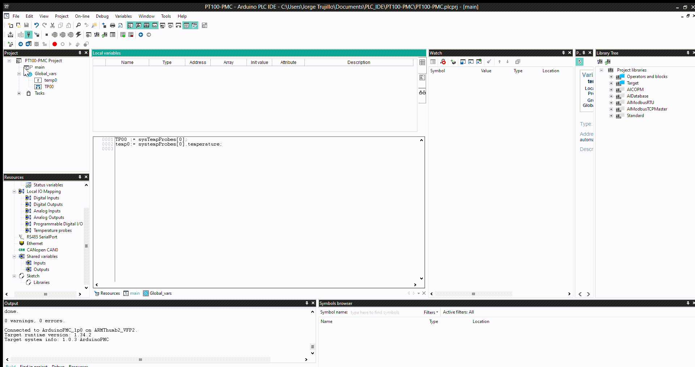

## Introduction
RTDs (Resistance Temperature Detectors) and Thermocouples are used for temperature measurement in various industrial fields. **RTDs** are sensors that change resistance in response to temperature variation. They are used regularly in industries that require precise temperature measurements, such as food processing and pharmaceuticals. 


On the other hand, **Thermocouples** are transducers that provide a voltage proportional to the temperature difference between two junctions. They are widely used in industrial applications such as HVAC systems, diesel engines, and power plants.

Both RTDs and thermocouples have unique characteristics, which make them suitable for different applications depending on the required accuracy, speed, and temperature range.

In this tutorial, we will use a two-wire **PT100** RTD to obtain temperature measurements. We will also briefly discuss how to connect a three-wire RTD and a thermocouple.

## Goals
The goals of this tutorial are:
- Learn about the differences between RTD and thermocouples
- Learn how to connect an RTD or thermocouple to the Portenta Machine Control
- Understand the operation of the Portenta Machine Control's Temperature Probe inputs
- Learn about PLC IDE functions and variables
- Read the temperature values using the Arduino PLC IDE

## Hardware and Software Requirements
### Hardware Requirements
- [Portenta Machine Control](https://store.arduino.cc/products/arduino-portenta-machine-control) (x1)
- Micro-USB cable (x1)
- PT100 RTD (x1)

### Software Requirements
- The [Arduino PLC IDE](https://www.arduino.cc/pro/software-plc-ide) (Including Arduino PLC IDE Tools)
- If you have not done so, set up and activate the Portenta Machine Control license following the steps of [this tutorial](https://docs.arduino.cc/tutorials/portenta-machine-control/plc-ide-setup-license)

## Temperature Sensors

### RTD 
A **Resistance Temperature Detector**, or **RTD**, is a temperature sensor that works by measuring the variation in the electrical resistance of a metallic element as a function of the temperature changes. The most commonly used metal for RTDs is platinum: one common type of RTD sensor is the PT100, where PT stands for platinum and 100 refers to the nominal resistance of the sensor at 0°C.

As the temperature increases, the resistance of the metal element in the RTD increases predictably and linearly. The resistance variation can be measured using an external circuit or measuring instrument and converted into a temperature reading, using a calibration curve or formula putting into relation the resistance value with the temperature.

RTDs are commonly used in industrial applications where the temperature measurement is critical for process control and safety. They are preferred over other types of temperature sensors because of their high accuracy, stability, and repeatability over a narrow temperature range.

### Thermocouples

A **thermocouple** is a temperature sensor made of two different metals, having dissimilar electrical conductivity, joined together at one end. When the junction is heated or cooled, a voltage is generated due to the thermoelectric effect: this voltage can be measured and converted into a temperature reading.

Thermocouples are used in a wide range of applications where temperature measurement is necessary, including industrial processes such as furnace and boiler monitoring, temperature control of plastic extrusion machines, and temperature measurement in power plants. They are also used in HVAC systems, automotive engines, and aerospace applications.

## Connections



Depending on the sensor you use, you will need to perform different connection settings. Find below three tables showing how to connect a two-wire RTD (PT100), a three-wire RTD (PT100) or a thermocouple. 

### Two Wires RTD Connection
The 2-wire RTD configuration is the simplest of the RTD circuit designs, but is more prone to errors.

|     Channel 0                        |      Channel 1                        |       Channel 2                       |
|--------------------------------------|---------------------------------------|---------------------------------------|
| Connect RTD pin to TP0               | Connect RTD pin to TP1                | Connect RTD pin to TP2                |
| Connect RTD pin to TN0               | Connect RTD pin to TN1                | Connect RTD pin to TN2                |
| Jumper between TP0 and RTD0          | Jumper between TP1 and RTD1           | Jumper between TP2 and RTD2           |

In this tutorial, we will use a two-wire RTD, so we will configure **channel 0** as described in the table. This is done by connecting one pin of the PT100 to the TP0 input, the other pin to TN0, and connecting a jumper between TP0 and RTD0 pins as you can see in the following picture:


### Three Wires RTD Connection
The 3-wire RTD configuration is the most commonly used RTD circuit design. In this configuration, two wires link the sensing element to the monitoring device on one side of the sensing element, and one links it on the other side.

|     Channel 0                     |      Channel 1                    |       Channel 2                   |
|-----------------------------------|-----------------------------------|-----------------------------------|
| Connect RTD pin to TP0            | Connect RTD pin to TP1            | Connect RTD pin to TP2            |
| Connect RTD pin to TN0            | Connect RTD pin to TN1            | Connect RTD pin to TN2            |
| Connect the RTD pin to the RTD0   | Connect the RTD pin tothe  RTD0   | Connect the RTD pin to the RTD0   |

***Do not connect any pin to GND***


### Thermocouples Connection

Connect **only non-grounded thermocouples** (grounded thermocouples are not supported). Do not connect both a thermocouple and a PT100 to a single same channel.
The thermocouples supported by the Portenta Machine Control are:
- Thermocouple Type K, non-grounded
- Thermocouple Type J, non-grounded

|     Channel 0                   |      Channel 1                  |       Channel 2                 |
|---------------------------------|---------------------------------|---------------------------------|
| Connect the positive pin to TP0 | Connect the positive pin to TP1 | Connect the positive pin to TP2 |
| Connect the negative pin to TN0 | Connect the negative pin to TN1 | Connect the negative pin to TN2 |


***Do not connect any pin to GND***



## PLC IDE

### Creating the Project

Once we have correctly [connected](#connections) the sensor to the Portenta Machine Control, the following steps are carried out in the Arduino PLC IDE. We assume that you have previously made the initial configuration of the Portenta Machine Control and activated [the necessary license](https://store.arduino.cc/products/plc-key-portenta-machine-control) to use it. If you have not done this, it is explained in the [configuration tutorial](https://docs.arduino.cc/tutorials/portenta-machine-control/plc-ide-setup-license) mentioned above.

First, we need to **create a new project**. To do this, open the Arduino PLC IDE and click on "New Project" or by clicking on ```File > New project```:


Name the project and select "Portenta Machine Control 1.0" as the project target; press OK:


### Behavior Setting

Once the project has been created, to visualize the "Temperature probes" inputs of the board, you need to go to the **Resources** Tools window and click on "**Temperature probes**". If you cannot find this window, you can try to click on: ```View > Tools Windows > Resources```.



After clicking on "Temperature Probes" we will see a table containing the three temperature probe inputs of the board. We have to make sure that the "**Behavior setting**" is set according to our RTD or thermocouple sensor. 

In this case, we are using a two-wires PT100 sensor, so we will select the "**RTD TWO WIRES**" option:



By default the TP00 input is disabled. To enable it, you only need to click next to "False" on TP00 "Enable" row and set it as "**True**":


Once enabled, we are ready to continue to the next step creating the necessary variables.

### Creating the Variables

***By default the project creates an automatic type int global variable called "cnt". You can delete it by right-clicking on it and clicking delete.***

To visualize the temperature values, we need to create a variable to save the values. To do this, we need to go to **Global vars** section and right-click on it, select "New variable" and select "Automatic" type. You can also do it by going to ```Project > New object > New variable > Automatic```. 


A New Variable Window will appear, set **TP00** as the variable name. This is just a name, not related to the name of the input, so you can set a name of your choice. 



On type, press the **[...]** button and scroll down to find and select the "**sysTempProbesType**". This variable has the automatic process to convert the RTD values into real-type temperature values. 


***Note: ensure that you have marked the User Type option to visualize the sysTempProbesType variable type***

When it is done, press the **OK** button:


Repeat the previous steps to create a new variable called "**temp0**" and type "**REAL**". With this last variable, we will directly store the temperature value of the sysTempProbesType variable in [real numbers](https://en.wikipedia.org/wiki/Real_number) as you will see in the following steps.


If everything is correct, when you double-click on **Global_vars**, a table with the two variables should appear as in the following image:


### Main Program Code

Now that we have created the variables, we have to make it work by defining the variables in the **main** program code. To do this, double-click on "main" and write the next lines in the code box:

```
TP00 := sysTempProbes[0];
temp0:= systempProbes[0].temperature;
```
Next, plug in your device, make sure it is connected to the Arduino PLC IDE and click the compile button to make sure there are no errors in the code.

If you are not sure about how to connect your device, you can check it on [the setup tutorial](https://docs.arduino.cc/tutorials/portenta-machine-control/plc-ide-setup-license#5-connect-to-the-device).


If there are no errors when compiling, you can download the code to the device by clicking on the button found next to the connection symbol. You may see a warning message about the need for a cold restart to download the code. Click Yes:


### Watch the Values

To visualize the values once we have downloaded the code into the Portenta Machine Control, we need to drop the variables in the "**Watch**" section as shown in the following animation. If you can't see the "Watch" window, you can try going to: ```View > Tool Windows > Watch```.



## Conclusion
RTDs are best for high-accuracy temperature measurements within a narrow range of up to 600°C. Thermocouples are better for high-temperature applications up to 2300°C, fast response times, and harsh environments. RTDs are used in laboratories and industrial process control, while thermocouples are used in industrial applications like furnaces and aerospace.

We have learned how to connect RTD and Thermocouple sensors to a Portenta Machine Control and how to monitor the temperature values through the Arduino PLC IDE.

We have also learned that there are many different types of RTDs and thermocouples and that we have to choose one according to our needs.

## Next Steps
Now that we know how to use these temperature sensors, we can implement them in a real industrial or domestic environment, such as an ambient temperature monitoring project.

- For more information on programming in the Arduino PLC IDE using IEC-61131-3 languages, please refer to the tutorial [Introduction to Programming with the Arduino PLC IDE](https://docs.arduino.cc/tutorials/portenta-machine-control/plc-programming-introduction) tutorial.

- If you are interested in how to set up the CAN bus communication, you can check out the [CAN Bus Setup with Arduino PLC IDE](https://docs.arduino.cc/tutorials/portenta-machine-control/can-setup) tutorial.