This user manual provides a comprehensive overview of the Portenta Machine Control, covering its major hardware and software elements. With this user manual, you will learn how to set up, configure, and use all the main features of the Portenta Machine Control.

***This User Manual teaches how to use the Portenta Machine Control with the new `Arduino_PortentaMachineControl` library. If you want to know how to use it with IEC 61131-3 PLC programming languages, check the [PLC IDE Tutorials](https://docs.arduino.cc/software/plc-ide). In case you are already using the older version of the `Arduino_MachineControl` library, check the following [tutorial to know the differences and how to migrate your code to the latest version.](https://docs.arduino.cc/tutorials/portenta-machine-control/pmc-arduino-library/)***

## Hardware and Software Requirements

### Hardware Requirements

- [Portenta Machine Control](https://store.arduino.cc/products/arduino-portenta-machine-control) (x1)
- [Micro-USB cable](https://store.arduino.cc/products/usb-2-0-cable-type-a-micro) (x1)
- +24 VDC/0.5 A power supply (x1)
- 2.4 GHz SMA male antenna (x1) (only required for Wi-Fi®/Bluetooth® capabilities)

### Software Requirements

- [Arduino IDE 2.0+](https://www.arduino.cc/en/software) or [Arduino Cloud Editor](https://create.arduino.cc/editor)
- [Arduino_PortentaMachineControl](https://github.com/arduino-libraries/Arduino_PortentaMachineControl) library

***This User Manual shows how to use the Portenta Machine Control using the Arduino IDE environment. To learn more about how to use it with IEC-61131-3 languages and the PLC IDE, check out our tutorials [here](https://docs.arduino.cc/software/plc-ide).***

## Portenta Machine Control Overview

The Portenta Machine Control is designed for efficiency and adaptability in industrial environments. It is compatible with the Arduino framework and other embedded platforms and provides a flexible solution for controlling various equipment and machinery. The Portenta H7 board (included) is central to its operation, which ensures stable performance across a broad temperature spectrum, ranging from -40 °C to +85 °C, without external cooling requirements.


This controller offers many connectivity options, from USB and Ethernet to Wi-Fi® and Bluetooth® Low Energy, as well as industry-specific protocols like Modbus and Canbus. It can also connect with various external sensors, actuators, and different Human Machine Interfaces (HMI), such as displays and touch panels, showcasing its adaptability. It is designed for harsh industrial operations with features like DIN bar compatible housing, compact size, and an integrated Real-Time Clock (RTC). For real-time control or predictive maintenance tasks, the Portenta Machine Control is a solid choice for businesses aiming to enhance production and equipment management processes.

### Portenta Machine Control Main Components

The Portenta Machine Control features a secure, certified, and durable design that enables it for automation and industrial applications. 


Here is an overview of the controller's main components shown in the image above:

**Microcontroller**: At the heart of the Portenta Machine Control is the STM32H747XI, a powerful, robust, and high-performance dual-core microcontroller from STMicroelectronics®. This microcontroller is built around an Arm® Cortex®-M7 and an Arm® Cortex®-M4 32-bit RISC cores. The Arm® Cortex®-M7 core operates at up to 480 MHz, while the Arm® Cortex®-M4 core operates at up to 240 MHz.

**Memory and storage**:
- 2 MB of Flash Memory
- 1 MB of RAM
- Additional onboard memory of 8 MB SDRAM
- 16 MB Flash QSPI

**Security**: The controller features an onboard ready-to-use secure element from NXP®, the SE0502. This secure element, specifically designed for Internet of Things (IoT) devices, provides advanced security features, perfect for Industrial IoT (IIoT) environments where security is critical.

**Power architecture**: The controller's power system was designed to be resilient. It operates at an input voltage of +24 VDC, with reverse polarity protection, ensuring the controller remains safeguarded from power irregularities.

**Digital and analog ports**: Equipped with a versatile set of input and output ports, the Portenta Machine Control supports:
- 8x digital input ports with 8x Status LEDs labeled as `DIGITAL INPUTS`
- 8x digital output ports with 8x Status LEDs labeled as `DIGITAL OUTPUTS`
- 3x software-configurable analog input ports labeled as `ANALOG IN`
- 4x analog output ports labeled as `ANALOG OUT`
- 12x digital programmable input/output ports labeled as `PROGRAMMABLE DIGITAL I/O` 

**Temperature sensing**: With three software-configurable temperature channels, the Portenta Machine Control can measure a variety of temperature ranges using:
- Type K thermocouples
- Type J thermocouples
- PT100 sensors

**Communication interfaces and protocols**: Seamless connectivity is a hallmark of this controller. The Portenta Machine Control offers high-speed, software-configurable communication interfaces and protocols such as:
- CAN bus
- RS-232
- RS-422
- RS-485
- I2C interface (accessible via a Grove connector)
- Modbus RTU (over RS-485)
- Modbus TCP (over Ethernet)

**Ethernet and USB**: The Portenta Machine Control features onboard Ethernet connectivity and full-speed USB-A and half-speed micro-USB Type B connectors for wired communication.

**Wireless connectivity**: The Portenta Machine Control supports 2.4 GHz Wi-Fi® (802.11 b/g/n) and Bluetooth® Low Energy (4.2 supported by firmware and 5.1 supported by hardware).

**Additional features**: The Portenta Machine Control features an onboard RTC with at least 48 hours of memory retention and two encoder channels. Moreover, Electrostatic Discharge (ESD) protection on all inputs and output ports ensures the longevity and durability of the controller.

**Form factor**: The Portenta Machine Control can be standalone on a DIN rail, a grid, or a panel, providing quick and easy access to all input/output ports and peripherals.

### Portenta Machine Control Core and Libraries

The `Arduino Mbed OS Portenta Boards` core contains the libraries and examples to work with Portenta's Machine Control peripherals and onboard components, such as its input ports, output ports, Wi-Fi® and Bluetooth® modules. To install the Portenta Machine Control core, navigate to **Tools > Board > Boards Manager** or click the **Boards Manager** icon in the left tab of the IDE. In the Boards Manager tab, search for `portenta` and install the latest `Arduino Mbed OS Portenta Boards` core version.


The `Arduino_PortentaMachineControl` library enables efficient management of the features of the Portenta Machine Control. To install the library:
1. Navigate to **Tools > Manage Libraries...** or click the **Library Manager** icon in the left tab of the IDE.
2. In the Library Manager tab, search for `portentamachinecontrol` and install the latest `Arduino_PortentaMachineControl` library version. If the IDE asks you to install additional dependent libraries, install all of them.


### Arduino PLC IDE

PLC IDE is the Arduino solution to program Portenta Machine Control devices using the five programming languages recognized by the IEC 61131-3 standard. 


The IEC 61131-3 programming languages include:

- Ladder Diagram (LD)
- Functional Block Diagram (FBD)
- Structured Text (ST)
- Sequential Function Chart (SFC)
- Instruction List (IL)

In the PLC IDE, you can mix PLC programming with standard Arduino sketches within the integrated sketch editor and share variables between the two environments. You can also automate tasks in your software applications; this gives you control over scheduling and repetition, enhancing the reliability and efficiency of your project. Moreover, communication protocols such as Modbus RTU and Modbus TCP can be managed effortlessly using integrated no-code fieldbus configurators.

Check out the following resources that will show you how to start with the Arduino PLC IDE and use IEC 61131-3 programming languages with the Portenta Machine Control:

- [Arduino PLC IDE download page and tutorials](https://docs.arduino.cc/software/plc-ide/)
- [Portenta Machine Control tutorials](https://docs.arduino.cc/hardware/portenta-machine-control/#tutorials)

### Pinout


The complete pinout is available and downloadable as PDF from the link below:

- [Portenta Machine Control pinout](https://docs.arduino.cc/resources/pinouts/AKX00032-full-pinout.pdf)

### Datasheet

The complete datasheet is available and downloadable as PDF from the link below:

- [Portenta Machine Control datasheet](https://docs.arduino.cc/resources/datasheets/AKX00032-datasheet.pdf)

### STEP Files

The complete STEP files are available and downloadable from the link below:

- [Portenta Machine Control STEP files](../../downloads/AKX00032-step.zip)

## First Use

### Powering the Portenta Machine Control

Portenta Machine Control can be powered in different ways:

- Using an **external +24 VDC/0.5 A power supply** connected to Portenta's Machine Control power supply terminals. Please refer to the [pinout section](#pinout) of the user manual.
- Using a **micro-USB cable** (not included) for programming purposes only.


The Portenta Machine Control has several LEDs that indicate how the board is being powered:

- If the board is powered using a **micro-USB cable**, the **3V3 LED** (red) will be turned on.
- The **12V LED** (yellow) and the **24V LED** (green LED) will be turned on if the board is powered using an **external +24 VDC power supply**. 


### Portenta Machine Control Terminals Features

Access to the main components and features of the Portenta Machine Control is provided through onboard terminal blocks, specifically from the SPTAF-1 connector series by Phoenix Contact. These connectors are distinguished by their low profile, ability to handle high currents, and intuitive push-in wire termination system. Below are the technical specifications of the Portenta Machine Control terminals:

- **Pitch**: 3.5 mm
- **Connection method**: Push-in spring connection
- **Connection direction**: 45º

The connector and wire specifications for the Portenta Machine Control terminals are outlined in the table below, indicating supported conductor cross sections and their respective capacities:

|          **Conductor Cross Section**          |                **Capacity**               |
|:---------------------------------------------:|:-----------------------------------------:|
|                     Solid                     |  0.2 mm<sup>2</sup> - 1.5 mm<sup>2</sup>  |
|                    Flexible                   |  0.2 mm<sup>2</sup> - 1.5 mm<sup>2</sup>  |
| Flexible, with ferrule without plastic sleeve | 0.25 mm<sup>2</sup> - 0.75 mm<sup>2</sup> |
|   Flexible, with ferrule with plastic sleeve  | 0.25 mm<sup>2</sup> - 0.75 mm<sup>2</sup> |
|                      AWG                      |                  24 - 16                  |

### Hello World Example

Let's program the Portenta Machine Control with a modified version of the classic `hello world` example used in the Arduino ecosystem: the `Blink` sketch. This example will verify that the controller's connection to the Arduino IDE, its core functionalities, and the `Arduino_PortentaMachineControl` library are working as expected.

***Remember to install the `Arduino Mbed OS Portenta Boards` core and the `Arduino_PortentaMachineControl` library; please refer to [this section of the User Manual](#portenta-machine-control-core-and-libraries) to learn how to do it.***

Copy and paste the sketch below into a new sketch in the Arduino IDE.

```arduino
// Include the Arduino_PortentaMachineControl library
#include <Arduino_PortentaMachineControl.h>

void setup() {
    // Initialize the digital outputs terminals of the Arduino_PortentaMachineControl library
    MachineControl_DigitalOutputs.begin();
}

void loop() {
    // Turn on the digital output at channel 0
    MachineControl_DigitalOutputs.write(0, HIGH);
    delay(1000);
    // Turn off the digital output at channel 0
    MachineControl_DigitalOutputs.write(0, LOW);
    delay(1000);
}
```
The sketch begins by including the `Arduino_PortentaMachineControl` library. The `setup()` function initializes the digital output terminals from this library. The `loop()` function, which continually runs after the `setup()` function is called, toggles a digital output at channel `0`.

To upload the sketch to your Portenta Machine Control, click the **Verify** button to compile the sketch and check for errors; once verification is successful, click the **Upload** button to program the controller with the sketch.


Upon successful upload, observe the red LED on your controller's digital output labeled as `00`. It should turn on for one second, then off for one second, repeatedly. Notice that a **micro-USB cable** can power the Portenta Machine Control for this example.


## Digital Outputs

The Portenta Machine Control has up to eight digital output channels, as shown in the image below.

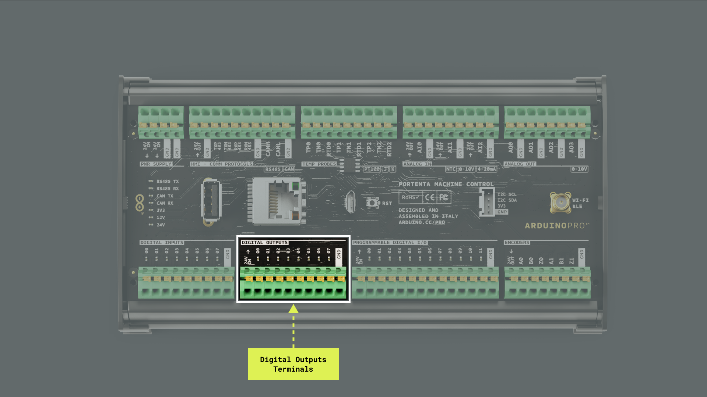

Some of the key features of the digital output channels of the Portenta Machine Control are the following:

- Digital outputs are **high-side switches** (TPS4H160AQPWPRQ1), handling up to 500 mA.
- All digital output terminals have **overcurrent protection**. If the current exceeds 700 mA (with a tolerance of ±20%), the channel opens to prevent damage.

***The digital output channels must be connected to an external +24 VDC power supply through pin `24V IN`; this power supply can be shared with the controller's +24 VDC power supply, as shown in the image below. Moreover, pin `24V IN` is not galvanically isolated, meaning the input power supply voltage must share the same `GND` as the controller.***


There are two modes of overcurrent protection in the digital output channels:

1. **Latch mode**: When overcurrent is detected, the digital output channel remains open and can only be closed manually via software. 
2. **Auto retry**: Upon detecting overcurrent, the channel opens. After a short duration (several tens of milliseconds), it attempts to close automatically. If the overcurrent condition persists in the channel, it will keep toggling.

***Ensure each channel does not exceed a maximum current of 500 mA to avoid potential damage or malfunctions in the digital output channels.***

The example sketch below showcases a "scanning" effect using the digital output channels of the Portenta Machine Control, activating each channel sequentially. This method also provides visual feedback through the Arduino IDE's Serial Monitor, indicating which channel is active at any given moment.

```arduino
/*
  Portenta Machine Control's Digital Outputs 
  Name: portenta_machine_control_digital_outputs_example.ino
  Purpose: Demonstrates a "scanning" effect using the digital output channels.
  @author Arduino PRO Content Team
  @version 1.0 01/10/23
*/

#include <Arduino_PortentaMachineControl.h>

void setup() {
  // Initialize serial communication at 9600 bauds
  Serial.begin(9600);

  // Initialize the digital outputs to latch mode (true)
  MachineControl_DigitalOutputs.begin(true);

  // Turn all channels off at startup
  MachineControl_DigitalOutputs.writeAll(0);
}

void loop() {
  // Sequentially activate each channel from 00 to 07
  for (int i = 0; i < 8; i++) {  
    // Turn on the current channel
     // Wait to make the effect visible
    MachineControl_DigitalOutputs.write(i, HIGH); 
    Serial.println("- CH" + String(i) + ": ON");
    delay(200);

    // Turn off the current channel
    // Wait to smooth the transition
    MachineControl_DigitalOutputs.write(i, LOW);
    delay(200); 
  }
}
```

Note that the sketch shown above uses the following functions from the `Arduino_PortentaMachineControl` library:

- `MachineControl_DigitalOutputs.begin(true)`: This function initializes the digital outputs channels with overcurrent behavior set to latch mode, meaning that upon overcurrent detection, channels remain open until manually toggled in software.
- `MachineControl_DigitalOutputs.writeAll(0)`: This function initially sets all digital output channels to an open state (off).
- `MachineControl_DigitalOutputs.write(channel, HIGH/LOW)`: This function controls individual channel states, turning them either on (`HIGH`) or off (`LOW`). In the example sketch, this function creates the "scanning" effect by activating one channel at a time.

The expected behavior of the digital output channels LEDs is shown below.


## Analog Outputs

The Portenta Machine Control has up to four independent analog output channels, as shown in the image below. These analog output channels enable precise voltage control for various applications. 


Some of the key features of the analog output channels of the Portenta Machine Control are the following:

- Analog outputs can be configured with specific PWM periods, affecting the frequency and resolution of the voltage output.
- Each channel supports voltage outputs ranging from 0 VDC to 10.5 VDC and can source up to 20 mA.

Each analog output channel is designed with a double low-pass filter and a high-current operational amplifier (OPA2990IDSGR) set up in a non-inverting topology with a gain factor of 3.3. This design allows for an effective filtering and amplification of the signal, resulting in a high-quality/low-noise analog output signal.

***The output signal of the analog output channels of the Portenta Machine Control is a DC voltage whose amplitude is a function of the defined PWM duty cycle.***

Below is an example demonstrating using a single analog output channel to generate a sine wave voltage output.

```arduino
/*
  Portenta Machine Control's Analog Output 
  Name: portenta_machine_control_sine_wave_example.ino
  Purpose: This sketch demonstrates the generation of a sine wave 
  using an analog output channel of the Portenta Machine Control.

  @author Arduino PRO Content Team
  @version 1.0 01/10/23
*/

#include <math.h> 
#include <Arduino_PortentaMachineControl.h>

// PWM period set to 4 ms (or 250 Hz)
#define PERIOD_MS 4 

void setup() {
  // Initialize serial communication at 9600 bauds
  Serial.begin(9600);

  // Initialize the analog output channels
  MachineControl_AnalogOut.begin();
  
  // Set the PWM period for channel 0 to 4 ms (or 250 Hz)
  MachineControl_AnalogOut.setPeriod(0, PERIOD_MS);
}

void loop() {
  // Iterate through 360 degrees, generating a complete sine wave output
  for (int i = 0; i < 360; i += 5) {
    
    // Calculate the sine wave voltage output from 0 to 10 VDC
    float voltage = 5 + 5 * sin(i * (PI / 180)); 

    // Set the voltage for channel 0
    MachineControl_AnalogOut.write(0, voltage);

    // Print the current voltage to the IDE's serial monitor (with two decimal precision)
    Serial.println("Channel 0 set at " + String(voltage, 2) + "V");

    // Introduce a delay to adjust the frequency of the sine wave
    delay(15); 
  }
}
```

In the example sketch, the sine wave signal is generated by iterating through 360 degrees; the sine function is computed for each degree value. The sine function yields a value between -1 and 1; to convert this into a voltage value between 0 and 10 VDC, an offset of 5 VDC is added, and the result is then multiplied by 5. With this formula, the sine wave oscillates between 0 to 10 VDC. The delay introduced at the end of each iteration helps adjust the frequency of the sine wave signal, resulting in the desired waveform at the analog output.

Notice that the sketch shown above uses the following functions from the `Arduino_PortentaMachineControl` library:

- `MachineControl_AnalogOut.begin()`: This function initializes the analog output channels, preparing them for voltage output.
- `MachineControl_AnalogOut.setPeriod(channel, period)`: This function configures the PWM period for the specified analog output channel. In the example shown above, it is set to 4 ms or 250 Hz.
- `MachineControl_AnalogOut.write(channel, voltage)`: This function controls the voltage output for the specified channel. In the example above, a sine wave is generated for channel `AO0` ranging from 0 to 10 VDC.

The expected result of the generated sine wave measured with an oscilloscope in the analog output channel `AO0` is shown in the image below.


### Working With Analog Output Channel 2 (AO2)

**Analog output channel 2 (AO2)** of the Portenta Machine Control is connected to pin *PG7* on the Portenta H7, which features an **HRTIM (High-Resolution TIMer)** function. It is the only Analog Out pin on the Portenta Machine Control with an **HRTIM (High-Resolution Timer)** function.

The *HRTIM* on *PG7* is mainly applicable for high-frequency PWM signals, which have constraints on the maximum period that can be achieved. With the availability of the *HRTIM_EEV2* function, which serves as an external event input, its configuration allows **AO2** to support high-resolution PWM signals with very short periods but also results in a constraint.

The *HRTIM* is configured with a frequency of **200 MHz** (tick time = **5 ns**), a clock prescaler set to **4**, and a maximum period of **0xFFFD** ticks (**65533 * 5 ns * 4 = 1.31 ms**). This configuration results in a maximum allowed period of **1.31 ms** for *AO2*. 

Knowing that the maximum allowable period for *AO2* is approximately **1.3 ms**, it makes it suitable only for high-frequency PWM signals. For applications requiring periods longer than *1.3 ms*, we recommend using other analog output channels, such as **Analog output channel 0 (AO0)**, **1 (AO1)**, or **3 (AO3)**, which can use standard timers. Please consider this characteristic when selecting the appropriate output channel for the development application.

The following code shows the setup of the *Analog Out* channels, including *AO2*. Please be aware that attempting to set a period longer than *1.3 ms* for *AO2* is not recommended.

```cpp
#include <Arduino_PortentaMachineControl.h>

#define PERIOD_MS_AO2 1   /* 1 ms for AO2 */
#define PERIOD_MS 4       /* 4 ms - 250Hz for other channels */

void setup() {
  Serial.begin(9600);

  MachineControl_AnalogOut.begin();

  MachineControl_AnalogOut.setPeriod(0, PERIOD_MS);
  MachineControl_AnalogOut.setPeriod(1, PERIOD_MS);
  MachineControl_AnalogOut.setPeriod(2, PERIOD_MS_AO2);  // AO2 - Adjusted period to fit limitation
  MachineControl_AnalogOut.setPeriod(3, PERIOD_MS);

  MachineControl_AnalogOut.write(0, 5);
  MachineControl_AnalogOut.write(1, 5);
  MachineControl_AnalogOut.write(2, 5);
  MachineControl_AnalogOut.write(3, 5);
}

void loop() {
}
```

## Digital Inputs

The Portenta Machine Control has up to eight digital input channels, as shown in the image below. Each channel incorporates a voltage divider comprising a 680 kΩ and a 100 kΩ resistor, which scales an input from 0 to 24 VDC down to 0 to 3 VDC.

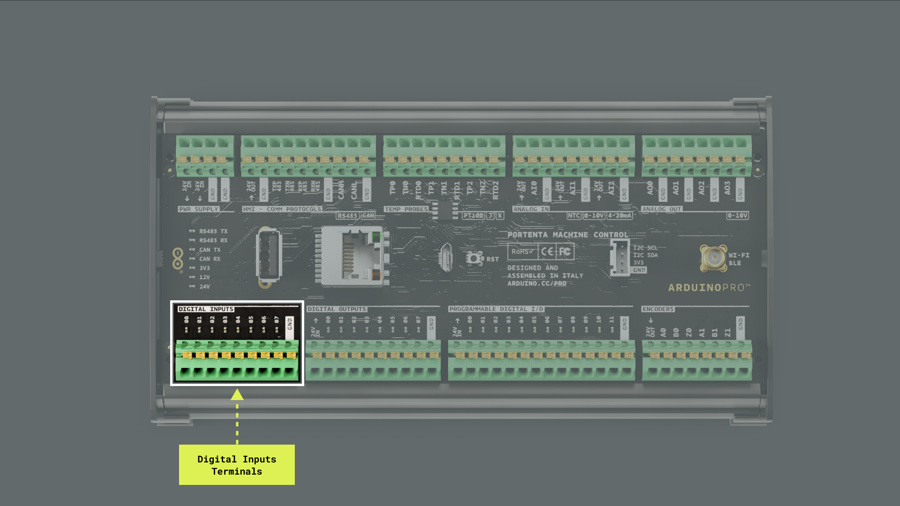

Below is an example sketch showcasing how to periodically read data from all the digital input channels.

```arduino
/*
  Portenta Machine Control Digital Input Example
  Name: portenta_machine_control_digital_input_example.ino
  Purpose: This sketch demonstrates how to periodically read 
  from all the digital input channels on the Portenta Machine Control.

  Author: Arduino PRO Content Team
  Version: 1.0 01/10/23
*/

#include <Arduino_PortentaMachineControl.h>

const int totalChannels = 8;
const int channelPins[totalChannels] = {DIN_READ_CH_PIN_00, DIN_READ_CH_PIN_01, DIN_READ_CH_PIN_02, DIN_READ_CH_PIN_03, DIN_READ_CH_PIN_04, DIN_READ_CH_PIN_05, DIN_READ_CH_PIN_06, DIN_READ_CH_PIN_07};

void setup() {
  // Initialize serial communication at 9600 bauds
  Serial.begin(9600);

  // Initialize Wire transmission
  Wire.begin();

  // Initialize the digital input channels
  // If initialization fails, notify via Serial Monitor
  if (!MachineControl_DigitalInputs.begin()) {
    Serial.println("- Failed to initialize the digital input GPIO expander!");
  }
}

void loop() {
  // Read the status of each digital input channel and display it
  for (int i = 0; i < totalChannels; i++) {
    uint16_t readings = MachineControl_DigitalInputs.read(channelPins[i]);
    Serial.print("- CH0" + String(i) + ": " + String(readings) + "\t");
  }

  // Print a new line for better readability
  Serial.println();
  delay(500);
}
```

Note that the example sketch uses a loop to individually read each digital input channel using the `MachineControl_DigitalInputs.read()` function from the `Arduino_PortentaMachineControl` library. This approach allows for the precise reading of each channel's status in a sequenced manner. The status of each channel is then printed on the IDE's Serial Monitor, ensuring accurate and orderly representation of the digital input states.

## Analog Inputs

The Portenta Machine Control has up to three independent analog input channels named `AI0`, `AI1`, and `AI2`, as shown in the image below. Each channel can have a range resolution varying from 12 to 16 bits, producing decimal values ranging from 0 to 65535, which is configurable through software.

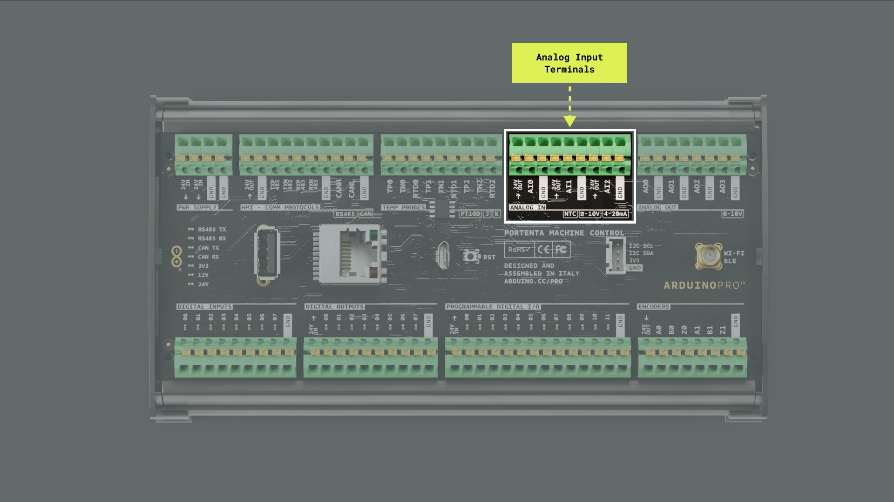

The configuration of Portenta's Machine Control analog input channels is determined by an analog switch (TS12A44514PWR), which allows switching between three different operational modes:

- **0-10V**: The analog input channel uses a resistor divider consisting of a 100 kΩ and a 39 kΩ resistor for this mode. This scales down an input voltage in the 0 VDC to 10 VDC range to a range of 0 VDC to 2.8 VDC. The resulting input impedance in this configuration is approximately 28 kΩ.
- **4-20 mA**: The analog input channel connects to a 120 Ω resistor for this mode. This configuration allows a 4 mA to 20 mA input current to be converted to a voltage in the 0.48 VDC to 2.4 VDC range.
- **NTC**: For this mode, the input is connected to a 3 VDC voltage reference (REF3330AIRSER). A 100 kΩ resistor is then placed in series, forming a part of the resistor divider powered by the voltage reference.

***Each analog input channel has an output voltage pin supplying +24 VDC for powering sensors. This pin has integrated protection through a 500 mA PTC resettable fuse.***

To use a specific operational mode with Portenta's Machine Control analog input channels, the `MachineControl_AnalogIn.begin(SensorType)` function from the `Arduino_PortentaMachineControl` library must be called before reading values from the analog input channels. Use the following constants in the `MachineControl_AnalogIn.begin(SensorType)` function to define a specific operational mode:

- `SensorType::V_0_10`: 0-10V mode
- `SensorType::MA_4_20`: 4-20mA mode
- `SensorType::NTC`: NTC mode

Below is an example sketch showcasing how to read voltages from the analog input channels set to the 0-10V mode.

```arduino
/*
  Portenta Machine Control's Analog Input 
  Name: portenta_machine_control_analog_input_simple_example.ino
  Purpose: This sketch demonstrates reading voltage values 
  from the analog input channels set in the 0-10V mode 
  of the Portenta Machine Control.

  @author Arduino PRO Content Team
  @version 1.0 01/10/23
*/

#include <Arduino_PortentaMachineControl.h>

// Define the resistor divider ratio for 0-10V input mode
const float RES_DIVIDER = 0.28057;

// Define the ADC reference voltage
const float REFERENCE   = 3.0;

void setup() {
  // Initialize serial communication at 9600 bauds
  Serial.begin(9600);

  // Initialize the analog input channels of the Portenta Machine Control in 0-10V mode
  MachineControl_AnalogIn.begin(SensorType::V_0_10);
}

void loop() {
  // Loop through each analog input channel
  // Read its current voltage
  // Print the current voltage value in the IDE's Serial Monitor
  for (int i = 0; i < 3; i++) {
    float voltage = readVoltage(i);
    Serial.print("- Voltage CH");
    Serial.print(i);
    Serial.print(": ");
    Serial.print(voltage, 3);
    Serial.println(" VDC");
  }
  
  // Add a delay for readability and a separator for the next set of readings
  Serial.println();
  delay(250);
}

/**
  Reads the raw ADC value from the specified channel, then
  calculates the actual voltage using the predefined resistor 
  divider ratio and the reference voltage
 
  @param channel (int)
  @return The calculated voltage value in volts
*/
float readVoltage(int channel) {
  // Read the raw ADC value from the specified channel
  float raw_voltage = MachineControl_AnalogIn.read(channel);
  
  // Convert the raw ADC value to the actual voltage 
  // Use the resistor divider ratio and reference voltage 
  // Return the calculated voltage
  return (raw_voltage * REFERENCE) / 65535 / RES_DIVIDER;
}
```

Note that the example sketch uses the `MachineControl_AnalogIn.read(channel)` function to acquire the raw voltage values from each channel. These raw values are then converted to the actual voltage values using the provided `RES_DIVIDER` and `REFERENCE` constants.

***For each analog input channel, there is a resistor divider **made by 100K and** 39K resistors, meaning that the input voltage is divided by a ratio of 0.28 approximately (`RES_DIVIDER` constant); the analog input channels voltage reference (`REFERENCE` constant) is 3V.*** 

## Programmable Digital I/O

The Portenta Machine Control has up to 12 programmable digital input/output channels, as shown in the image below. 

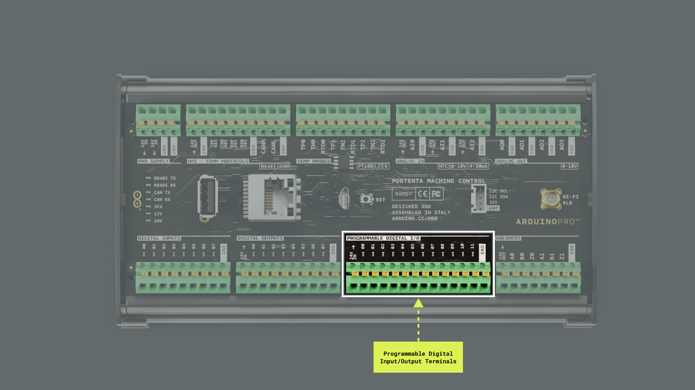

The programmable digital input/output channels are powered via three quad-channel high-side switches (TPS4H160AQPWPRQ1). Each channel comes with a nominal current value of 0.6 A. However, due to internal circuit tolerances of the high-side switches, this value can spike up to 0.9 A.

***The programmable digital input/output channels must be connected to an external +24 VDC power supply through pin `24V IN`. This power supply can be shared with the controller's +24 VDC power supply. Moreover, pin `24V IN` is not galvanically isolated, meaning the input power supply voltage must share the same `GND` as the controller.***


There are two modes of overcurrent protection in the programmable digital input/output channels:

1. **Latch mode**: The channel is deactivated once the current limit is hit. The respective channel enable pin must be toggled to reactivate the channel.
2. **Retry mode**: The channel is momentarily shut down upon reaching the current limit but reconnects briefly.

The programmable digital input/output channels integrate an internal mechanism to protect against kickback from inductive loads. Additionally, there is an external safeguard via a 60 VDC, 2 A Schottky diode (PMEG6020ER). Each of the 12 digital input channels uses a resistor divider setup consisting of a 680 kΩ and 100 kΩ resistor; this configuration scales down a 0 to 24 VDC input to a 0 to 3 VDC range. While the high-side switches function separately from the digital input channels, it is possible to read the status of the high-side switches via the digital input channels.

***Ensure each channel does not exceed a maximum current of 500 mA to avoid potential damage or malfunctions in the programmable digital input/output channels.***

The sketch below showcases using the programmable digital input/output channels of the Portenta Machine Control. This example shows how to transmit values on the programmable channels periodically and also read from them regularly.

```arduino
/*
  Portenta Machine Control's Programmable Digital I/Os
  Name: portenta_machine_control_programmable_digital_io_example.ino
  Purpose: Demonstrates the usage of the programmable digital input/output channels
  on the Portenta Machine Control. It includes initializing the channels, 
  setting digital outputs, reading digital inputs, and toggling the outputs.
  
  @author Arduino PRO Content Team
  @version 1.0 01/10/23
*/

#include <Arduino_PortentaMachineControl.h>

void setup() {
  // Initialize serial communication at 9600 bauds
  Serial.begin(9600);
  
  // Initialize I2C communication
  Wire.begin();
  
  // Wait for serial port to connect, needed for native USB port only
  while (!Serial) {
    ; 
  }

  // Attempt to initialize the programmable digital input/output channels
  if (!MachineControl_DigitalProgrammables.begin()) {
    Serial.println("- Failed to initialize the programmable digital I/Os!");
    return;
  }
  Serial.println("- Programmable digital I/Os initialized successfully!");
}

void loop() {
  // Turn ON the digital output channel 3 using the defined macro
  MachineControl_DigitalProgrammables.set(IO_WRITE_CH_PIN_03, SWITCH_ON); 
  delay(1000);

  // Read the status of digital input channel 3 using the defined macro
  int status = MachineControl_DigitalProgrammables.read(IO_READ_CH_PIN_03);
  Serial.println("- Channel 03 status: " + String(status));
  delay(1000);

  // Turn ON all digital output channels
  MachineControl_DigitalProgrammables.writeAll(SWITCH_ON_ALL);
  delay(1000);

  // Read and display the status of all digital input channels
  uint32_t inputs = MachineControl_DigitalProgrammables.readAll();
  for (int i = 0; i < 12; i++) {
    Serial.println("- CH" + formatChannel(i) + ": " + String((inputs & (1 << i)) >> i));
  }
  Serial.println();

  // Toggle the states of all digital output channels
  MachineControl_DigitalProgrammables.toggle();
  delay(1000);
  inputs = MachineControl_DigitalProgrammables.readAll();
  for (int i = 0; i < 12; i++) {
    Serial.println("- CH" + formatChannel(i) + ": " + String((inputs & (1 << i)) >> i));
  }
  Serial.println();
}

/**
  Formats the channel number with leading zeros to 
  achieve a consistent 2-digit format

  @param channel
  @return A string with the channel number in 2-digit format
*/
String formatChannel(int channel) {
  if(channel < 10) {
    return "0" + String(channel);
  }
  return String(channel);
}
```

The example sketch uses the following [Arduino_PortentaMachineControl](https://github.com/arduino-libraries/Arduino_PortentaMachineControl) functions:

- `MachineControl_DigitalProgrammables.begin()`: Utilized to initialize the programmable digital input/output channels, it returns a `FALSE` if the initialization fails. `MachineControl_DigitalProgrammables` is based on the I2C protocol. To work properly, it must be preceded by `Wire.begin()`, which initializes the I2C interface.
- `MachineControl_DigitalProgrammables.set(pin, state)`: Used to define a particular channel's state (ON/OFF).
- `MachineControl_DigitalProgrammables.read(pin)`: Used to discern the state of a specific channel.
- `MachineControl_DigitalProgrammables.writeAll(state)`: Used to configure the state (ON/OFF) for all available pins or channels simultaneously.
- `MachineControl_DigitalProgrammables.readAll()`: Used to read the states of all available channels collectively.
- `MachineControl_DigitalProgrammables.toggle()`: Used to invert the states of all the channels.

Open the Serial Monitor to watch the I/Os states. The sketch will showcase the reading and state control process of the I/Os of the channels.


## Communication

This user manual section covers the different communication interfaces and protocols the Portenta Machine Control supports, including the [Ethernet](#ethernet), [Wi-Fi®](#wi-fi®), [Bluetooth®](#bluetooth®), [RS-485](#rs-485-halffull-duplex), [Modbus](#modbus-rtutcp), and [CAN Bus](#can-bus).

### Ethernet

The Portenta Machine Control features an onboard low-power 10BASE-T/100BASE-TX Ethernet physical layer (PHY) transceiver. The transceiver complies with the IEEE 802.3 and 802.3u standards and supports communication with an Ethernet MAC through a standard RMII interface. The Ethernet transceiver is accessible through the onboard RJ45 connector.


The `Arduino Mbed OS Portenta Boards` core has a built-in library that lets you use the onboard Ethernet PHY transceiver right out of the box: the [`Ethernet` library](https://www.arduino.cc/reference/en/libraries/ethernet/). Let's use an example sketch demonstrating some of the transceiver's capabilities.

The sketch below enables a Portenta Machine Control to connect to the Internet via an Ethernet connection. Once connected, it performs a `GET` request to the `ip-api.com` service to fetch details about the device's IP address. It then parses the received JSON object using the [`Arduino_JSON` library](https://github.com/arduino-libraries/Arduino_JSON) to extract key IP details: IP address, city, region, and country. This data is then printed to the Arduino IDE's Serial Monitor.

```arduino
/**
  Portenta's Machine Control Web Client (Ethernet version)
  Name: portenta_machine_control_ethernet_web_client.ino
  Purpose: This sketch connects a Portenta Machine Control
  to ip-api.com via Ethernet and fetches IP details for 
  the controller

  @author Arduino PRO Content Team
  @version 1.0 01/10/23
*/

// Include the necessary libraries
#include <Ethernet.h>
#include <Arduino_JSON.h>

// Server address for ip-api.com
const char* server = "ip-api.com";

// API endpoint path to get IP details in JSON format
String path = "/json/";

// Static IP configuration for the Portenta Machine Control device
// Used only if DHCP IP configuration fails
IPAddress ip(10, 130, 22, 84);

// Ethernet client instance for the communication
EthernetClient client;

// JSON variable to store and process the fetched data
JSONVar doc;

// Variable to ensure we fetch data only once
bool dataFetched = false;

void setup() {
  // Initialize serial communication at 115200 bauds
  Serial.begin(115200);

  // Wait for the serial port to connect,
  // This is necessary for boards that have native USB
  while (!Serial);

  // Attempt to start Ethernet connection via DHCP
  // If DHCP failed, print a diagnostic message
  if (Ethernet.begin() == 0) {
    Serial.println("- Failed to configure Ethernet using DHCP!");

    // Try to configure Ethernet with the predefined static IP address
    Ethernet.begin(ip);
  }
  delay(2000);
}

void loop() {
  // Ensure we haven't fetched data already
  // ensure the Ethernet link is active
  // establish a connection to the server
  // compose and send the HTTP GET request
  if (!dataFetched) {
    if (Ethernet.linkStatus() == LinkON) {
      if (client.connect(server, 80)) {
        client.print("GET ");
        client.print(path);
        client.println(" HTTP/1.1");
        client.print("Host: ");
        client.println(server);
        client.println("Connection: close");
        client.println();

        // Wait and skip the HTTP headers to get to the JSON data
        char endOfHeaders[] = "\r\n\r\n";
        client.find(endOfHeaders);

        // Read and parse the JSON response
        String payload = client.readString();
        doc = JSON.parse(payload);

        // Check if the parsing was successful
        if (JSON.typeof(doc) == "undefined") {
          Serial.println("- Parsing failed!");
          return;
        }

        // Extract and print the IP details
        Serial.println("*** IP Details:");
        Serial.print("- IP Address: ");
        Serial.println((const char*)doc["query"]);
        Serial.print("- City: ");
        Serial.println((const char*)doc["city"]);
        Serial.print("- Region: ");
        Serial.println((const char*)doc["regionName"]);
        Serial.print("- Country: ");
        Serial.println((const char*)doc["country"]);
        Serial.println("");

        // Mark data as fetched
        dataFetched = true;
      }
      // Close the client connection once done
      client.stop();
    } else {
      Serial.println("- Ethernet link disconnected!");
    }
  }
}
```

The sketch includes the `Ethernet` and `Arduino_JSON` libraries, which are essential for Ethernet and JSON handling functionality. In the `setup()` function, serial communication is initiated for debugging and output. Instead of DHCP, the Ethernet connection uses a predefined static IP address.

Once the Ethernet connection runs, the sketch connects to the `ip-api.com` service, utilizing the HTTP protocol. Specifically, an `HTTP GET` request is crafted to retrieve details about the device's IP address, including its city, region, and country. If the connection to the server fails, the sketch will output an error message to the Arduino IDE's Serial Monitor for troubleshooting.

Within the `loop()` function, an `HTTP GET` request is sent to the `ip-api.com` service once. The sketch then waits for and skips the response's HTTP headers, parsing the following JSON payload.

Key IP details such as IP address, city, region, and country are extracted and then displayed in the IDE's Serial Monitor using the parsed data. If the Ethernet link happens to be disconnected, a corresponding message is printed to the Serial Monitor. Should the JSON parsing fail, an error message is showcased on the IDE's Serial Monitor, prompting the sketch to exit the current iteration of the `loop()` function immediately.

You should see the following output in the Arduino IDE's Serial Monitor:


### Wi-Fi®

The Portenta Machine Control features an onboard Wi-Fi® module that provides seamless wireless connectivity, allowing it to connect to Wi-Fi® networks and interact with other devices Over-The-Air (OTA).

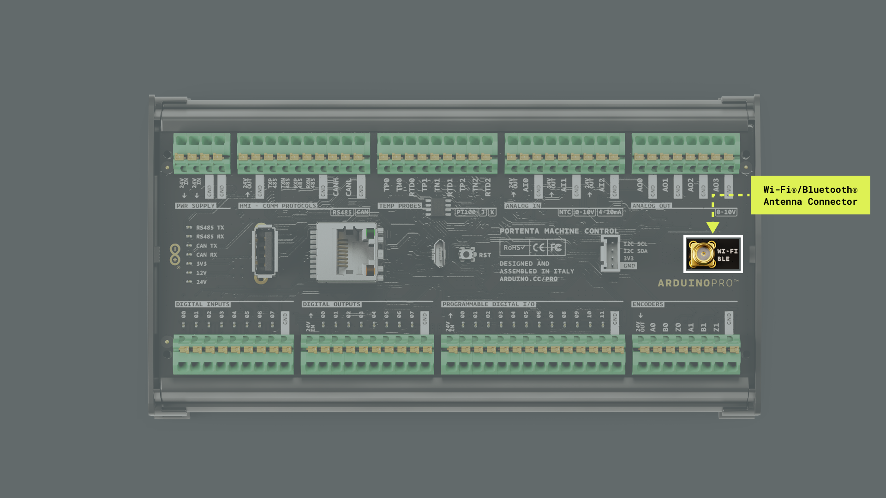

Some of the key capabilities of Portenta's Machine Control onboard Wi-Fi® module are the following:

- **Wireless connectivity**: The onboard Wi-Fi® module supports IEEE 802.11b/g/n Wi-Fi® standards, enabling devices to establish reliable and high-speed wireless connections to access the Internet and communicate with other devices.
- **Secure communication**: The onboard module incorporates various security protocols such as WEP, WPA, WPA2, and WPA3, ensuring robust data encryption and protection against unauthorized access during wireless communication.
- **Antenna connector**: Portenta Machine Control devices feature an onboard vertical SMA female antenna connector (5-1814832-2) specifically matched for the onboard Wi-Fi® module RF requirements. For external antenna testing, use a standard SMA male antenna.

The `Arduino Mbed OS Portenta Boards` core has a built-in library that lets you use the onboard Wi-Fi® module right out of the box: the [`WiFi` library](https://www.arduino.cc/reference/en/libraries/wifi/). Let's walk through an example sketch demonstrating some of the module's capabilities.

The sketch below enables a Portenta Machine Control device to connect to the Internet via Wi-Fi® (like the Ethernet example). Once connected, it performs a `GET` request to the [`ip-api.com`](https://ip-api.com/) server to fetch details related to its IP address. It then parses the received JSON object using the [`Arduino_JSON` library](https://github.com/arduino-libraries/Arduino_JSON) to extract key IP details: IP address, city, region, and country. This data is then printed to the Arduino IDE's Serial Monitor.

You need to create first a header file named `arduino_secrets.h` to store your Wi-Fi® network credentials. To do this, add a new tab by clicking the ellipsis (the three horizontal dots) button on the top right of the Arduino IDE 2.


Put `arduino_secrets.h` as the "Name for new file" and enter the following code on the header file:

```arduino
#define SECRET_SSID "YOUR_SSID"; // Your network SSID (name)
#define SECRET_PASS "YOUR_PASS"; // Your network password (use for WPA, or use as key for WEP)
```

Replace `YOUR_SSID` with the name of your Wi-Fi® network and `YOUR_PASS` with the password of it and save the project. The example sketch is as follows: 

```arduino
/**
  Portenta's Machine Control Web Client (Wi-Fi version)
  Name: portenta_machine_control_wifi_web_client.ino
  Purpose: This sketch connects a Portenta Machine Control 
  to ip-api.com via Wi-Fi and fetches IP details

  @author Arduino PRO Content Team
  @version 1.0 01/10/23
*/

#include <WiFi.h>
#include <Arduino_JSON.h>

// Wi-Fi network details
char ssid[] = SECRET_SSID;
char password[] = SECRET_PASS;

// Server address for ip-api.com
const char* server = "ip-api.com";

// API endpoint path to get IP details in JSON format
String path = "/json";

// Wi-Fi client instance for the communication
WiFiClient client;

// JSON variable to store and process the fetched data
JSONVar doc;

// Variable to ensure we fetch data only once
bool dataFetched = false;

void setup() {
  // Initialize serial communication at 115200 bauds
  Serial.begin(115200);

  // Wait for the serial port to connect,
  // this is necessary for boards that have native USB
  while (!Serial);

  // Start the Wi-Fi connection using the provided SSID and password
  Serial.print("- Connecting to ");
  Serial.println(ssid);
  WiFi.begin(ssid, password);

  while (WiFi.status() != WL_CONNECTED) {
    delay(1000);
    Serial.print(".");
  }

  Serial.println();
  Serial.println("- Wi-Fi connected!");
  Serial.print("- IP address: ");
  Serial.println(WiFi.localIP());
  Serial.println();
}

void loop() {
  // Check if the IP details have been fetched;
  // if not, call the function to fetch IP details,
  // set the flag to true after fetching
  if (!dataFetched) {
    fetchIPDetails();
    dataFetched = true;
  }
}

/**
  Fetch IP details from defined server

  @param none
  @return IP details
*/
void fetchIPDetails() {
  if (client.connect(server, 80)) {
    // Compose and send the HTTP GET request
    client.print("GET ");
    client.print(path);
    client.println(" HTTP/1.1");
    client.print("Host: ");
    client.println(server);
    client.println("Connection: close");
    client.println();

    // Wait and skip the HTTP headers to get to the JSON data
    char endOfHeaders[] = "\r\n\r\n";
    client.find(endOfHeaders);

    // Read and parse the JSON response
    String payload = client.readStringUntil('\n');
    doc = JSON.parse(payload);

    // Check if the parsing was successful
    if (JSON.typeof(doc) == "undefined") {
      Serial.println("- Parsing failed!");
      return;
    }

    // Extract and print the IP details
    Serial.println("*** IP Details:");
    String query = doc["query"];
    Serial.print("- IP Address: ");
    Serial.println(query);
    String city = doc["city"];
    Serial.print("- City: ");
    Serial.println(city);
    String region = doc["regionName"];
    Serial.print("- Region: ");
    Serial.println(region);
    String country = doc["country"];
    Serial.print("- Country: ");
    Serial.println(country);
    Serial.println("");
  } else {
    Serial.println("- Failed to connect to server!");
  }

  // Close the client connection once done
  client.stop();
}
```

The sketch includes the `WiFi` and `Arduino_JSON`, which provide the necessary Wi-Fi® and JSON handling functionality. The `setup()` function initiates serial communication for debugging purposes and attempts to connect to a specified Wi-Fi® network. If the connection is not established, the sketch will keep trying until a successful connection is made.

Once the Wi-Fi® connection is established, the sketch is ready to connect to the `ip-api.com` server using the HTTP protocol. Specifically, an `HTTP GET` request is constructed to query details related to its IP address. The `GET` request is sent only once after the Wi-Fi® connection is active.

The `loop()` function is the heart of the sketch. It checks whether the data has been fetched or not. If the data still needs to be fetched, it tries to establish a connection to the server. If the connection is successful, the sketch sends an `HTTP GET` request, skips the HTTP headers of the response, and uses the `JSON.parse()` function from the `Arduino_JSON` library to parse the JSON object from the response. The parsed data extracts key IP details like IP address, city, region, and country, which are then printed to the Arduino IDE's Serial Monitor. Once the data is published, the client is disconnected to free up resources. Suppose the JSON parsing fails for any reason. In that case, an error message is outputted to the Arduino IDE's Serial Monitor, and the sketch immediately exits the current iteration of the `loop()` function.

Since the data is fetched only once, there's no need to send `HTTP GET` requests repeatedly. After the initial fetch, you should see the details related to the IP address displayed in the Arduino IDE's Serial Monitor:


### Bluetooth®

The Portenta Machine Control features an onboard Bluetooth® module that provides seamless wireless connectivity, allowing it to connect to other Bluetooth® devices and networks.


To enable Bluetooth® communication on the Portenta Machine Control, you can use the [ArduinoBLE library](https://github.com/arduino-libraries/ArduinoBLE). Let's use an example code demonstrating some of the capabilities of Poternta's Machine Control Bluetooth® module. Here is an example of how to use the `ArduinoBLE` library to create a temperature monitor application:

```arduino
/**
  Portenta's Machine Control Bluetooth
  Name: portenta_machine_control_bluetooth.ino
  Purpose: Read temperature from a thermocouple input of 
  the Portenta Machine Control, then exposes the temperature 
  value using a Bluetooth standard service

  @author Arduino PRO Content Team
  @version 1.0 01/10/23
*/

#include <ArduinoBLE.h>
#include <Arduino_PortentaMachineControl.h>


// Define the environmental sensing service and its temperature characteristic
BLEService temperatureService("181A");
BLEIntCharacteristic temperatureIntChar("2A6E", BLERead | BLENotify);


void setup() {
  // Initialize the digital outputs terminals of the Portenta Machine Control 
  MachineControl_DigitalOutputs.begin();

  // Initialize serial communication at 9600 bauds
  Serial.begin(9600);

  // Initialize the Portenta's Machine Control BLE module
  if (!BLE.begin()) {
    Serial.println("- Starting BLE failed!");
    while (1)
      ;
  }
  
  // Initialize temperature probes
  MachineControl_TCTempProbe.begin();
  
  // Set the local name and advertised service for the BLE module
  BLE.setLocalName("Temperature Sensor");
  BLE.setAdvertisedService(temperatureService);
  temperatureService.addCharacteristic(temperatureIntChar);
  BLE.addService(temperatureService);

  // Start advertising the BLE service
  BLE.advertise();
  Serial.println("- Bluetooth device active, waiting for connections...");
}

void loop() {
  // Check for incoming BLE connections
  BLEDevice central = BLE.central();

  // If a central device is connected
  if (central) {
    Serial.print("- Connected to device: ");
    Serial.println(central.address());

    // Turn on a digital output channel of the Portenta Machine Control when connected
    MachineControl_DigitalOutputs.write(0, HIGH);

    // While the central device is connected
    while (central.connected()) {
      // Read the temperature from a type K thermocouple,
      // update the BLE characteristic with the temperature value
      MachineControl_TCTempProbe.selectChannel(0);
      float temp_ch0 = MachineControl_TCTempProbe.readTemperature();

      Serial.print("- Temperature is: ");
      Serial.println(temp_ch0);
      temperatureIntChar.writeValue(temp_ch0 * 100);

      delay(1000);
    }

    Serial.print("- BLE not connected: ");
    Serial.println(central.address());
  }

  // Digital output channel of the Portenta Machine Control
  // blinks when Bluetooth® is not connected to an external device
  MachineControl_DigitalOutputs.write(0, HIGH);
  delay(200);
  MachineControl_DigitalOutputs.write(0, LOW);
  delay(200);
}
```

The example sketch shown above uses a standard Bluetooth® Low Energy service and characteristic for transmitting temperature read by one of the thermocouple input terminals of the Portenta Machine Control to a central device.

- The sketch begins by importing all the necessary libraries and defining the Bluetooth® Low Energy service and characteristics.
- In the `setup()` function, the code initializes the Portenta Machine Control and sets up the Bluetooth® Low Energy service and characteristics. Then, it begins advertising the defined Bluetooth® Low Energy service.
- A Bluetooth® Low Energy connection is constantly verified in the `loop()` function; when a central device connects to the Portenta Machine Control, channel 0 of its digital output terminals is turned on. The sketch then enters into a loop that constantly reads the temperature from a thermocouple input terminal. The temperature is printed to the IDE's Serial Monitor and transmitted to the central device over the defined Bluetooth® Low Energy characteristic.


### RS-485 (Half/Full Duplex)

The Portenta Machine Control has a built-in RS-485 interface that enables the implementation of robust and reliable data transmission systems. RS-485 interface is a protocol widely used in industrial applications. The wide common-mode range enables data transmission over longer cable lengths and in noisy environments such as the floor of a factory. Also, the high input impedance of the receivers allows more devices to be attached to the communication lines.


The onboard RS-485 transceiver is the SP335 from MaxLinear. The SP335 is an advanced multiprotocol transceiver that supports RS-232, RS-485, and RS-422 serial standards. Integrated cable termination and multiple configuration modes allow all three protocols to be used interchangeably over a single cable or connector with no additional switching components.

***The Portenta Machine Control has onboard termination resistors; its RS-485 interface can be configured to be half-duplex or full-duplex.***

Some of the key capabilities of Portenta's Machine Control onboard RS-485 transceiver are the following:

- **High-speed operation**: The RS-485 transceiver can operate up to 20 Mbps.
- **EMI Reduction**: The slew rate is limited to 250 kbps to minimize electromagnetic interference (EMI), enhancing signal integrity.
- **ESD protection**: Transmitter outputs and receiver inputs are protected against electrostatic discharge (ESD) up to ±15 kV.
- **High impedance**: The transceiver inputs exhibit high impedance, allowing up to 256 devices on a single communication bus.
- **Communication mode**: The transceiver can be configured either half or full-duplex.
- **Termination resistors**: 120 Ω termination resistors are integrated and can be connected or disconnected through software. 

RS-485 data lines in the Portenta Machine Control are labeled as described in the following table:

| **Pin Name** | **RS-485 Full-duplex** | **RS-485 Half-duplex** |
|:------------:|:----------------------:|:---------------------:|
|  RS485 TX P  |          `TX+`         |        `Data+`        |
|  RS485 TX N  |          `TX-`         |        `Data-`        |
|  RS485 RX P  |          `RX+`         |           -           |
|  RS485 RX N  |          `RX-`         |           -           |

***RS-485 data line labels differ between manufacturers. Most manufacturers will use `+` and `–` to label the data lines or variations such as `D+` and `D-`. Some manufacturers will label inputs as `A` and `B` but get the polarity backward, so `A` is positive and `B` negative. Although predicting how other manufacturers will mark these lines is impossible, practical experience suggests that the `-` line should be connected to the `A` terminal. The `+` line should be connected to the `B` terminal. Reversing the polarity will not damage an RS-485 device, but the communication will not work as expected.***

The example sketch below shows how to use the RS-485 interface of the Portenta Machine Control for half-duplex communication.

```arduino
/*
  Portenta Machine Control's RS-485 Half-Duplex Communication
  Name: portenta_machine_control_rs485_example.ino
  Purpose: Demonstrates half-duplex RS-485 communication using
  the Portenta Machine Control.

  @author Arduino PRO Content Team
  @version 1.0 01/10/23
*/

// Include the necessary libraries
#include <Arduino_PortentaMachineControl.h>

// Define the interval for sending messages
constexpr unsigned long sendInterval { 1000 };
unsigned long sendNow { 0 };
unsigned long counter { 0 }; 

void setup() {
    // Initialize serial communication at 9600 bauds
    Serial.begin(9600);

    // Wait for the serial port to connect,
    //tThis is necessary for boards that have native USB
    while (!Serial);

    Serial.println("- Initializing RS-485 interface...");

    // Initialize the RS-485 interface with a baud rate of 115200 and specific timings,
    // the timings define the preamble and postamble durations for RS-485 communication
    MachineControl_RS485Comm.begin(115200, SERIAL_8N1, 0, 500);

    // Set the RS-485 interface in receive mode initially
    MachineControl_RS485Comm.receive();
    Serial.println("- RS-485 initialization complete!");
}

void loop() {
  // Check if there is incoming data and read it
  if (MachineControl_RS485Comm.available()) {
    Serial.write(MachineControl_RS485Comm.read());
  }

  // Send data at defined intervals
  if (millis() > sendNow) {
    // Disable receive mode before starting the transmission
    MachineControl_RS485Comm.noReceive();

    // Begin transmission and send a message with a counter
    MachineControl_RS485Comm.beginTransmission();
    MachineControl_RS485Comm.print("- Message: ");
    MachineControl_RS485Comm.println(counter++);

    // End the transmission and switch back to receive mode
    MachineControl_RS485Comm.endTransmission();
    MachineControl_RS485Comm.receive();

    // Update the time for the next transmission
    sendNow = millis() + sendInterval;
  }
}
```

In this example sketch, a message is periodically sent over the RS-485 interface of the Portenta Machine Control. The sketch initializes the RS-485 interface for half-duplex communication and sends a `String` message with a counter. After each transmission, it switches back to receive mode to listen for incoming data.

The example sketch uses the following functions from the `Arduino_PortentaMachineControl` library for RS-485 communication. Here is an explanation of the functions:

- `MachineControl_RS485Comm.begin(baud, config, pre, post)`: Initializes the RS-485 module with specified baud rate, serial_config and timing settings.
- `MachineControl_RS485Comm.receive()`: Puts the module in receive mode.
- `MachineControl_RS485Comm.noReceive()`: Disables receive mode for transmission.
- `MachineControl_RS485Comm.beginTransmission()`: Prepares the module to start transmitting data.
- `MachineControl_RS485Comm.endTransmission()`: Ends data transmission and prepares the module to receive data.
- `MachineControl_RS485Comm.available()`: Checks if data can be read.
- `MachineControl_RS485Comm.read()`: Reads incoming data.

***To receive and show the messages on your computer, you can use a USB to RS-485 converter, such as [the converter used by the Arduino Pro Content Team](https://www.waveshare.com/usb-to-rs485.htm). You can use the Arduino IDE's Serial Monitor to display the messages received in the converter or another serial terminal such as [CoolTerm](https://freeware.the-meiers.org/), a simple and cross-platform (Windows, Mac, and Linux) serial port terminal application (no terminal emulation) that is geared towards hobbyists and professionals.***

As a practical example, we will **establish a full duplex communication between two Portenta Machine Control devices**. Follow the wiring below for the RS-485 full-duplex communication.


For both **Portenta Machine Control** devices, use the example sketch shown below; this example sketch can also be found on the Arduino IDE by navigating to **File > Examples > Arduino_PortentaMachineControl > RS485_fullduplex**.

```arduino
/*
 * Portenta Machine Control's RS-485 Full Duplex Communication
 * Name: RS485_fullduplex.ino
 * Purpose: Demonstrates full duplex RS-485 communication using
 * the Portenta Machine Control; the sketch shows how to send 
 * and receive data periodically on the RS-485 interface
 *
 * @author Riccardo Rizzo, modified by Arduino PRO Content Team
 * @version 1.0 01/10/23
 */

// Include the necessary libraries
#include "Arduino_PortentaMachineControl.h"

// Define the interval for sending messages
constexpr unsigned long sendInterval { 1000 };
unsigned long sendNow { 0 };
unsigned long counter = 0;

void setup() {
  // Initialize serial communication at 9600 bauds
  // Wait for the serial port to connect
  Serial.begin(9600);
  while (!Serial);

  Serial.println("- Start RS485 initialization...");

  // Initialize the RS-485 interface with specific settings,
  // specify baud rate, preamble and postamble times for RS-485 communication
  MachineControl_RS485Comm.begin(115200, SERIAL_8N1, 0, 500);

  // Enable full duplex mode and 120 Ohm termination resistors
  MachineControl_RS485Comm.setFullDuplex(true);
    
  // Set the RS-485 interface in receive mode initially
  MachineControl_RS485Comm.receive();
    
  Serial.println("- Initialization done!");
}

void loop() {
  // Check if there is incoming data and read it
  if (MachineControl_RS485Comm.available())
    Serial.write(MachineControl_RS485Comm.read());

  // Send data at defined intervals
  if (millis() > sendNow) {
    // Disable receive mode before starting the transmission
    MachineControl_RS485Comm.noReceive();

    // Begin transmission and send a message with a counter
    MachineControl_RS485Comm.beginTransmission();
    MachineControl_RS485Comm.print("- Hello ");
    MachineControl_RS485Comm.println(counter++);

    // End the transmission and switch back to receive mode
    MachineControl_RS485Comm.endTransmission();
        
    // Re-enable receive mode after transmission
    MachineControl_RS485Comm.receive();

    // Update the time for the next transmission
    sendNow = millis() + sendInterval;
  }
}
```

Both devices will send and receive messages respectively through the RS-485 interface and will print them in the IDE's Serial Monitor, as shown in the animation below. 


### Modbus (RTU/TCP)

The Portenta Machine Control incorporates a built-in Modbus interface, enabling the implementation of robust and reliable data transmission systems. Modbus, in its RTU version that operates RS-485 serial transmission or in its TCP version that works over Ethernet, remains one of the most widely used protocols for industrial automation applications, building management systems, and process control, among others.

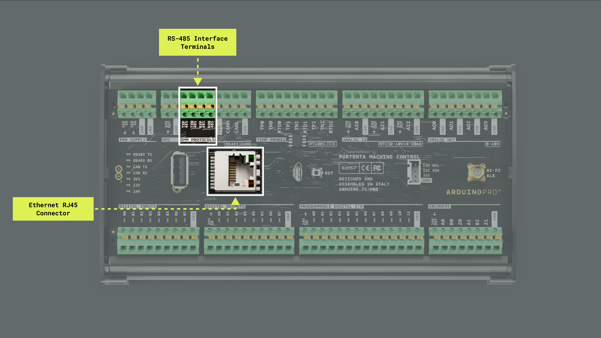

The many nodes connected in a Modbus network, whether RTU or TCP, allow high flexibility and scalability in constructing automation and control systems.

To use the Modbus protocol with your Portenta Machine Control, you will need the [`ArduinoRS485`](https://github.com/arduino-libraries/ArduinoRS485) and [`ArduinoModbus`](https://github.com/arduino-libraries/ArduinoModbus) libraries. You can install them via the Library Manager of the Arduino IDE.

#### Modbus RTU

Modbus RTU, generally operating in half-duplex mode, has the capability to handle noisy and long-distance transmission lines, which makes it an excellent choice for industrial environments. Modbus RTU communication is supported using Portenta Machine Control's RS-485 physical interface.

***The Portenta Machine Control has onboard termination resistors; its RS-485 interface can be configured as a half or full duplex.***

#### Using Two Portenta Machine Controls

The following example shows how to establish Modbus RTU communication between **two Portenta Machine Control devices**. We will use four LEDs from the Digital Output port of the Portenta Machine Control as the visual indicator to confirm the communication is working as intended. Since Portenta Machine Control supports half-duplex and full-duplex modes, each mode requires a different wiring setup.

We will begin showing the **Full-Duplex mode** example following the connection diagram below between two Portenta Machine Control devices:


The following script assigns a Portenta Machine Control as a Client device, which sends four coil values to the Portenta Machine Control assigned as a Server.

```arduino
// Include the necessary libraries
#include <Arduino_PortentaMachineControl.h>
#include <ArduinoRS485.h>
#include <ArduinoModbus.h>

// Define the baud rate for Modbus communication
constexpr auto baudrate{ 38400 };

// Calculate preDelay and postDelay in microseconds as per Modbus RTU Specification
// Modbus over serial line specification and implementation guide V1.02
// Paragraph 2.5.1.1 Modbus Message RTU Framing
// https://modbus.org/docs/Modbus_over_serial_line_V1_02.pdf
constexpr auto bitduration{ 1.f / baudrate };
constexpr auto preDelay{ bitduration * 9.6f * 3.5f * 1e6 };
constexpr auto postDelay{ bitduration * 9.6f * 3.5f * 1e6 };

// Counter variable to demonstrate coil control logic
int counter = 0;

void setup() {
  // Begin serial communication at 9600 baud for debug messages
  Serial.begin(9600);

  // Wait for serial port to connect (necessary for boards with native USB)
  //while (!Serial);
  // Initialize RS-485 communication with specified baud rate and delays
  MachineControl_RS485Comm.begin(baudrate, SERIAL_8N1, preDelay, postDelay);
  
  MachineControl_RS485Comm.setFullDuplex(true);

  // Short delay to ensure RS-485 communication is stable
  delay(2500);

  // Indicate start of Modbus RTU client operation
  Serial.println("- Modbus RTU Coils control");

  // Start the Modbus RTU client with the RS-485 communication settings
  if (!ModbusRTUClient.begin(MachineControl_RS485Comm, baudrate, SERIAL_8N1)) {
    Serial.println("- Failed to start Modbus RTU Client!");
    // Halt execution if unable to start
    while (1)
      ;  
  }
}
void loop() {
  // Increment counter to change coil values on each iteration
  counter++;

  // Determine coil value based on the counter's parity
  byte coilValue = ((counter % 2) == 0) ? 0x00 : 0x01;

  // Attempt to write coil values to a Modbus RTU server
  Serial.print("- Writing coil values ... ");

  // Begin transmission to Modbus server (slave ID 1) to write coil values at address 0x00
  ModbusRTUClient.beginTransmission(1, COILS, 0x00, 4);

  for (int i = 0; i < 4; i++) {
    // Write the same value to all 4 coils
    ModbusRTUClient.write(coilValue);  
  }

  // Check for successful transmission and report errors if any
  // Print error code if transmission failed
  // Or confirm successful coil value writing
  if (!ModbusRTUClient.endTransmission()) {
    Serial.print("- Failed! Error code: ");
    Serial.println(ModbusRTUClient.lastError());  
  } else {
    Serial.println("- Success!");  
  }

  // Delay before next operation to simulate periodic control
  delay(1000);
}
```

Because the Portenta Machine Control is operating in **Full-Duplex mode**, the following line of code is essential and must be included within the code to enable Full-Duplex mode:

```arduino
MachineControl_RS485Comm.setFullDuplex(true);
```

The Server Portenta Machine Control uses the script below, which translates received coil values into corresponding Digital Outputs. It will blink four Digital Outputs accordingly in a timely manner.

```arduino
// Include the necessary libraries 
#include <ArduinoRS485.h>
#include <ArduinoModbus.h>
#include <Arduino_PortentaMachineControl.h>

// Define the number of coils to control LEDs
const int numCoils = 4;

// Define the baud rate for Modbus communication
constexpr auto baudrate{ 38400 };

// Calculate preDelay and postDelay in microseconds as per Modbus RTU Specification
// Modbus over serial line specification and implementation guide V1.02
// Paragraph 2.5.1.1 Modbus Message RTU Framing
// https://modbus.org/docs/Modbus_over_serial_line_V1_02.pdf
constexpr auto bitduration{ 1.f / baudrate };
constexpr auto preDelay{ bitduration * 9.6f * 3.5f * 1e6 };
constexpr auto postDelay{ bitduration * 9.6f * 3.5f * 1e6 };

void setup() {
  // Begin serial communication at a baud rate of 9600 for debug messages
  Serial.begin(9600);

  // Print a startup message
  Serial.println("- Modbus RTU Server");

  // Set RS485 transmission delays as per Modbus specification
  MachineControl_RS485Comm.begin(baudrate, SERIAL_8N1, preDelay, postDelay);

  // Enable full duplex mode and 120 Ohm termination resistors
  MachineControl_RS485Comm.setFullDuplex(true);
    
  // Set the RS-485 interface in receive mode initially
  MachineControl_RS485Comm.receive();

  // Start the Modbus RTU server with a specific slave ID and baud rate
  // Halt execution if the server fails to start
  if (!ModbusRTUServer.begin(MachineControl_RS485Comm, 1, baudrate, SERIAL_8N1)) {
    Serial.println("- Failed to start Modbus RTU Server!");
    while (1)
      ;  
  }

  //Set over current behavior of all channels to latch mode (true)
  MachineControl_DigitalOutputs.begin(true);
  
  //At startup set all channels to OPEN
  MachineControl_DigitalOutputs.writeAll(0);

  // Set 7th Digital Output channel ON to show the port has been correctly configured
  MachineControl_DigitalOutputs.write(7, HIGH);

  // Configure coils for controlling the onboard LEDs
  ModbusRTUServer.configureCoils(0x00, numCoils);
}

void loop() {
  // Poll for Modbus RTU requests and process them
  int packetReceived = ModbusRTUServer.poll();
  Serial.println(packetReceived);
  if (packetReceived) {
    // Process each coil's state and control LEDs accordingly
    for (int i = 0; i < numCoils; i++) {
      // Read coil value
      // Update discrete input with the coil's state
      int coilValue = ModbusRTUServer.coilRead(i);       
      ModbusRTUServer.discreteInputWrite(i, coilValue);  

      // Debug output to the IDE's serial monitor
      Serial.print("LED ");
      Serial.print(i);
      Serial.print(" = ");
      Serial.println(coilValue);

      // Control the onboard LEDs based on the coil values
      switch (i) {
        case 0:
          MachineControl_DigitalOutputs.write(0, coilValue ? HIGH : LOW);
          break;
        case 1:
          MachineControl_DigitalOutputs.write(1, coilValue ? HIGH : LOW);
          break;
        case 2:
          MachineControl_DigitalOutputs.write(2, coilValue ? HIGH : LOW);
          break;
        case 3:
          MachineControl_DigitalOutputs.write(3, coilValue ? HIGH : LOW);
          // New line for better readability
          Serial.println();  
          break;
        default:
          // Error handling for unexpected coil addresses
          Serial.println("- Output out of scope!"); 
          break;
      }
    }
  }
}
```

With this, we have two Portenta Machine Control devices, each assigned as a Client and Server correspondingly, communicating with Modbus RTU in full-duplex mode.


Alternatively, to establish communication between two Portenta Machine Control with Modbus RTU in **Half-Duplex mode**, the following wiring setup is required:


The previous example can be used in half-duplex mode, but it will require one minor change in the following line of code:

```arduino
MachineControl_RS485Comm.setFullDuplex(false);
```

By modifying this line, *Full-Duplex mode* is deactivated. This minor code tweak, plus the appropriate wiring, enable the two units to communicate using Modbus RTU in half-duplex mode.


#### Using a Portenta Machine Control & Opta™

The example below shows how to enable Modbus RTU communication between a Portenta Machine Control device and an Opta™ device. For wiring both devices, follow the diagram below:


The following example sketch will let the Portenta Machine Control device toggle the four onboard Opta™ LEDs via **Modbus RTU**. The Portenta Machine Control will be the **client**, while the Opta™ device will be the **server**.

For the **Opta™** device, defined as the server, use the following example sketch below.

```arduino
/*
  Opta's Modbus RTU Server Example
  Name: opta_modbus_rtu_server_led_control.ino
  Purpose: Demonstrates controlling the onboard LEDs of an 
  Opta device using the Modbus RTU protocol

  @author Arduino PRO Content Team
  @version 1.0 01/10/23
*/

// Include the necessary libraries 
#include <ArduinoRS485.h>
#include <ArduinoModbus.h>

// Define the baud rate for Modbus communication
constexpr auto baudrate{ 38400 };

// Define the number of coils to control LEDs
const int numCoils = 4;

// Calculate preDelay and postDelay in microseconds as per Modbus RTU Specification
// Modbus over serial line specification and implementation guide V1.02
// Paragraph 2.5.1.1 Modbus Message RTU Framing
// https://modbus.org/docs/Modbus_over_serial_line_V1_02.pdf
constexpr auto bitduration{ 1.f / baudrate };
constexpr auto preDelayBR{ bitduration * 9.6f * 3.5f * 1e6 };
constexpr auto postDelayBR{ bitduration * 9.6f * 3.5f * 1e6 };

void setup() {
  // Initialize serial communication at 9600 bauds
  Serial.begin(9600);

  // Print a startup message
  Serial.println("- Modbus RTU Server");

  // Set RS485 transmission delays as per Modbus specification
  RS485.setDelays(preDelayBR, postDelayBR);

  // Start the Modbus RTU server with a specific slave ID and baud rate
  // Halt execution if the server fails to start
  if (!ModbusRTUServer.begin(1, baudrate, SERIAL_8N1)) {
    Serial.println("- Failed to start Modbus RTU Server!");
    while (1)
      ;  
  }

  // Initialize the onboard LEDs 
  pinMode(LED_D0, OUTPUT);
  pinMode(LED_D1, OUTPUT);
  pinMode(LED_D2, OUTPUT);
  pinMode(LED_D3, OUTPUT);

  // Configure coils for controlling the onboard LEDs
  ModbusRTUServer.configureCoils(0x00, numCoils);
}

void loop() {
  // Poll for Modbus RTU requests and process them
  int packetReceived = ModbusRTUServer.poll();

  if (packetReceived) {
    // Process each coil's state and control LEDs accordingly
    for (int i = 0; i < numCoils; i++) {
      // Read coil value
      // Update discrete input with the coil's state
      int coilValue = ModbusRTUServer.coilRead(i);       
      ModbusRTUServer.discreteInputWrite(i, coilValue);  

      // Debug output to the IDE's serial monitor
      Serial.print("- LED ");
      Serial.print(i);
      Serial.print(" : ");
      Serial.println(coilValue);

      // Control the onboard LEDs based on the coil values
      switch (i) {
        case 0:
          digitalWrite(LED_D0, coilValue);
          break;
        case 1:
          digitalWrite(LED_D1, coilValue);
          break;
        case 2:
          digitalWrite(LED_D2, coilValue);
          break;
        case 3:
          digitalWrite(LED_D3, coilValue);
          // New line for better readability
          Serial.println();  
          break;
        default:
          // Error handling for unexpected coil addresses
          Serial.println("- Output out of scope!"); 
          break;
      }
    }
  }
}
```

For the **Portenta Machine Control**, defined as the client, use the following example sketch.

```arduino
/*
  Portenta's Machine Control Modbus RTU Client Example
  Name: portenta_machine_control_modbus_rtu_client_led_control.ino
  Purpose: Demonstrates controlling Modbus RTU coils using a 
  Portenta Machine Control device

  @author Arduino PRO Content Team
  @version 1.0 01/10/23
*/

// Include the necessary libraries
#include <Arduino_PortentaMachineControl.h>
#include <ArduinoRS485.h>
#include <ArduinoModbus.h>

// Define the baud rate for Modbus communication
constexpr auto baudrate{ 38400 };

// Calculate preDelay and postDelay in microseconds as per Modbus RTU Specification
// Modbus over serial line specification and implementation guide V1.02
// Paragraph 2.5.1.1 Modbus Message RTU Framing
// https://modbus.org/docs/Modbus_over_serial_line_V1_02.pdf
constexpr auto bitduration{ 1.f / baudrate };
constexpr auto preDelay{ bitduration * 9.6f * 3.5f * 1e6 };
constexpr auto postDelay{ bitduration * 9.6f * 3.5f * 1e6 };

// Counter variable to demonstrate coil control logic
int counter = 0;

void setup() {
  // Initialize serial communication at 9600 bauds
  Serial.begin(9600);

  // Initialize RS-485 communication with specified baud rate and delays
  MachineControl_RS485Comm.begin(baudrate, SERIAL_8N1, preDelay, postDelay);

  // Short delay to ensure RS-485 communication is stable
  delay(2500);

  // Indicate start of Modbus RTU client operation
  Serial.println("- Modbus RTU Coils control");

  // Start the Modbus RTU client with the RS-485 communication settings
  if (!ModbusRTUClient.begin(MachineControl_RS485Comm, baudrate, SERIAL_8N1)) {
    Serial.println("- Failed to start Modbus RTU Client!");
    // Halt execution if unable to start
    while (1)
      ;  
  }
}

void loop() {
  // Increment counter to change coil values on each iteration
  counter++;

  // Determine coil value based on the counter's parity
  byte coilValue = ((counter % 2) == 0) ? 0x00 : 0x01;

  // Attempt to write coil values to a Modbus RTU server
  Serial.print("- Writing coil values ... ");

  // Begin transmission to Modbus server (slave ID 1) to write coil values at address 0x00
  ModbusRTUClient.beginTransmission(1, COILS, 0x00, 4);
  for (int i = 0; i < 4; i++) {
    // Write the same value to all 4 coils
    ModbusRTUClient.write(coilValue);  
  }

  // Check for successful transmission and report errors if any,
  // print error code if transmission failed or confirm successful coil value writing
  if (!ModbusRTUClient.endTransmission()) {
    Serial.print("- Failed! Error code: ");
    Serial.println(ModbusRTUClient.lastError());  
  } else {
    Serial.println("- Success!");  
  }

  // Delay before next operation to simulate periodic control
  delay(1000);
}
```

You should see the four onboard LEDs of the Opta™ device turn on and off, as shown below.


#### Modbus TCP

Modbus TCP, taking advantage of Ethernet connectivity, allows easy integration with existing computer networks and facilitates data communication over long distances using the existing network infrastructure. It operates in full-duplex mode, allowing simultaneous sending and receiving of data.

The example below shows how to enable Modbus TCP communication between two Portenta Machine Controls. For wiring both devices, we have two options:

1. A direct connection between the Portenta Machine Controls through an Ethernet cable.
2. Individually connect each device to an internet router via Ethernet cables.

We will use the second option since it will allow us to scale the application by adding more devices to the network.


The following example sketch will let one Portenta Machine Control toggle the digital output LEDs of a second Portenta Machine Control through the Modbus TCP protocol. One Portenta Machine Control will be the **client**, and the other will be the **server**; as they are both connected to an internet router, IP addresses are the way for them to route their messages. 

We can define a **Static** or **DHCP** IP address to them using the function `Ethernet.begin()` as follows:

```arduino
// DHCP (will assign an IP automatically)
Ethernet.begin();

// Static IP 
Ethernet.begin(<mac>, <IP>);
```

***The client must know the server IP to establish communication between them.***

Use the following example sketch for the **Portenta Machine Control** defined as the client. 

```arduino
/*
  Portenta Machine Control's Modbus TCP Communication
  Name: portenta_machine_control_modbus_tcp_example.ino
  Purpose: Demonstrates controlling an Opta™ device using 
  Modbus TCP protocol on the Portenta Machine Control

  @author Arduino PRO Content Team
  @version 1.0 01/10/23
*/

// Include necessary libraries for Ethernet and Modbus communication
#include <SPI.h>
#include <Ethernet.h>
#include <ArduinoRS485.h>
#include <ArduinoModbus.h>

EthernetClient ethClient;
ModbusTCPClient modbusTCPClient(ethClient);

// Define the IP address for the Portenta Machine Control
IPAddress ip(10, 0, 0, 157);

// Define the IP Address of the Modbus TCP server (Opta device)
IPAddress server(10, 0, 0, 227);

void setup() {
    // Initialize serial communication at 9600 bauds,
    // wait for the serial port to connect
    Serial.begin(9600);
    while (!Serial);

    // Initialize Ethernet connection with the specified IP address
    // Using NULL for MAC to auto-assign the device's MAC address
    Ethernet.begin(NULL, ip); 

    // Check Ethernet hardware presence
    if (Ethernet.hardwareStatus() == EthernetNoHardware) {
        Serial.println("- Ethernet interface was not found!");
        while (true);
    }

    // Check Ethernet cable connection
    if (Ethernet.linkStatus() == LinkOFF) {
        Serial.println("- Ethernet cable is not connected!");
    }
}

void loop() {
    // Attempt to connect to Modbus TCP server if not already connected
    if (!modbusTCPClient.connected()) {
        Serial.println("- Attempting to connect to Modbus TCP server...");

        // Start Modbus TCP client
        if (!modbusTCPClient.begin(server, 502)) {
            Serial.println("- Failed to connect to Modbus TCP server!");
        } else {
            Serial.println("- Connected to Modbus TCP server!");
        }
    } else {
        // Modbus TCP client is connected, perform communication;
        // write a value to a coil at address 0x00
        if (!modbusTCPClient.coilWrite(0x00, 0x01)) {
            Serial.print("- Failed to write coil: ");
            Serial.println(modbusTCPClient.lastError());
        }

        // Wait for a second
        delay(1000);

        // Reset the coil at address 0x00
        if (!modbusTCPClient.coilWrite(0x00, 0x00)) {
            Serial.print("- Failed to reset coil: ");
            Serial.println(modbusTCPClient.lastError());
        }

        // Wait for a second
        delay(1000); 
    }
}
```

For the second **Portenta Machine Control** defined as the server, use the following example sketch. 

```arduino
/*
  Portenta Machine Control's Modbus TCP Communication
  Name: pmc_modbus_tcp_server.ino
  Purpose: Demonstrates setting up a Modbus TCP server on an 
  Opta device to control an LED using Modbus TCP protocol

  @author Arduino PRO Content Team
  @version 1.0 01/10/23
*/

#include <SPI.h>
#include <Ethernet.h>
#include <ArduinoRS485.h>
#include <ArduinoModbus.h>
#include <Arduino_PortentaMachineControl.h>

// Define the IP address for the Modbus TCP server
IPAddress ip(10, 0, 0, 227);

// Server will listen on Modbus TCP standard port 502
EthernetServer ethServer(502); 

// Create a Modbus TCP server instance
ModbusTCPServer modbusTCPServer;

void setup() {
  // Initialize serial communication at 9600 bauds,
  // wait for the serial port to connect,
  // initialize Ethernet connection with the specified IP address
  Serial.begin(9600);
  while (!Serial);
  Ethernet.begin(NULL, ip); 

  // Check Ethernet hardware and cable connections
  if (Ethernet.hardwareStatus() == EthernetNoHardware) {
    Serial.println("- Ethernet interface not found!");
    while (true);
  }
  if (Ethernet.linkStatus() == LinkOFF) {
    Serial.println("- Ethernet cable not connected!");
  }

  // Start the Modbus TCP server
  ethServer.begin();
  if (!modbusTCPServer.begin()) {
    Serial.println("- Failed to start Modbus TCP Server!");
    while (1);
  }

  //Set over current behavior of all channels to latch mode (true)
  MachineControl_DigitalOutputs.begin(true);

  //At startup set all channels to OPEN
  MachineControl_DigitalOutputs.writeAll(0);

  // Configure a single coil at address 0x00 for Modbus communication
  modbusTCPServer.configureCoils(0x00, 1);
  
}

void loop() {
  // Handle incoming client connections and process Modbus requests
  EthernetClient client = ethServer.available();
  if (client) {
    Serial.println("- Client connected!");

    // Accept and handle the client connection for Modbus communication
    modbusTCPServer.accept(client);

    // Update the LED state based on Modbus coil value
    while (client.connected()) {
      // Process Modbus requests
      // Update the LED
      modbusTCPServer.poll(); 
      updateLED();
    }

    Serial.println("Client disconnected.");
  }
}

/**
  * Updates the LED state based on the Modbus coil value.
  * Reads the current value of the coil from the Modbus TCP 
  * server and sets the LED state. If the coil value is high, 
  * the LED is turned on. If it is low, the LED is turned off
  *
  * @param None
  */
void updateLED() {
  // Read the current value of the coil at address 0x00
  int coilValue = modbusTCPServer.coilRead(0x00);
  
  // Set the LED state; HIGH if coil value is 1, LOW if coil value is 0
  for (int i = 0; i < 8; i++){
    MachineControl_DigitalOutputs.write(i, coilValue ? HIGH : LOW);
  }
}
```
You should see the server digital output LEDs turning on and off, as shown below:


### CAN Bus

The Portenta Machine Control features a built-in CAN bus interface, enabling the implementation of robust and reliable data transmission systems in automotive and industrial automation applications. The CAN bus is widely used due to its ability to operate effectively in electrically noisy environments and its communication method that reduces errors.


The onboard CAN transceiver of the Portenta Machine Control is the TJA1049 from NXP®. The TJA1049 is a specialized high-speed CAN transceiver for various applications, especially in automotive and high-speed CAN networks. The third-generation device offers enhanced electromagnetic compatibility (EMC) and ESD protection. This transceiver also features a low-current standby mode with a wake-up function and is compatible with microcontrollers ranging from 3 to 5 VDC. Adhering to the ISO11898 standard, the TJA1049 ensures reliable communication at data rates up to 5 Mbps, making it an optimal choice for High-Speed (HS) CAN networks that require efficient low-power operation modes.

Some of the key capabilities of the onboard CAN transceiver in the Portenta Machine Control include:

- **High-speed operation**: The onboard transceiver can operate at bit rates up to 5 Mbps.
- **Noise tolerance**: The onboard transceiver is designed to function reliably in environments with high electromagnetic interference.
- **Low-current standby mode with wake-up functionality**: The onboard transceiver features a low-power standby mode, which includes efficient wake-up capabilities, crucial for energy-efficient applications.
- **Compliance with ISO11898 standard**: Adhering to the ISO11898 standard, the TJA1049 ensures reliable communication at data rates up to 5 Mbit/s, making it ideal for HS CAN networks operating in low-power modes.

The example sketch below shows how to use the CAN bus interface of the Portenta Machine Control to transmit data. You can also find it in **File > Examples > Arduino_PortentaMachineControl > CAN > WriteCan**.

```arduino
/*
  Portenta Machine Control's CAN Bus Communication
  Name: WriteCan.ino
  Purpose: Demonstrates data transmission using the CAN bus
  interface on the Portenta Machine Control.

  @author Arduino PRO Content Team
  @version 1.0 01/10/23
*/

// Include necessary libraries
#include <Arduino_PortentaMachineControl.h>

// Define the CAN message ID and message counter
static uint32_t const CAN_ID = 13ul;
static uint32_t msg_cnt = 0;

void setup() {
    // Initialize serial communication at 9600 bauds
    Serial.begin(9600);

    // Wait 2.5 seconds for the serial port availability, then start the transmission
    for (const auto timeout = millis() + 2500; !Serial && millis() < timeout; delay(250));

    // Initialize the CAN interface with a bit rate of 500 kbps
    if (!MachineControl_CANComm.begin(CanBitRate::BR_500k)) {
        Serial.println("- CAN init failed!");
        while(1);
    }
}

void loop() {
  // Assemble the CAN message
  uint8_t const msg_data[] = {0x01, 0x02, 0x03, 0x04, 0x05, 0x06, 0x07, 0x08};
  CanMsg msg(CAN_ID, sizeof(msg_data), msg_data);

  // Transmit the CAN message
  int const rc = MachineControl_CANComm.write(msg);
  if (rc <= 0) {
    Serial.print("- CAN write failed with error code: ");
    Serial.println(rc);
    while(1);
  }

  // CAN message sent
  Serial.println("- CAN write message!");

  // Increase the message counter
  msg_cnt++;

  // Send a message every second
  delay(1000);
}
```

The example sketch uses the `Arduino_PortentaMachineControl` library for CAN communication. Here is an explanation of these functions:

- `MachineControl_CANComm.begin(bitRate)`: Initializes the CAN module with a specified bit rate.
- `MachineControl_CANComm.write(msg)`: Transmits a data message over the CAN network. The `msg` parameter contains the data to be sent.
- `MachineControl_CANComm.available()`: Checks if data is available on the CAN bus to be read.
- `MachineControl_CANComm.read()`: Reads incoming data from the CAN bus. This function is used to retrieve data that has been received.
- `MachineControl_CANComm.end()`: This function can disable the CAN module when it's no longer needed, helping conserve power.

The example sketch below shows how to use the CAN bus interface of the Portenta Machine Control to read data. You can also find it in **File > Examples > Arduino_PortentaMachineControl > CAN > ReadCan**.

```arduino
#include <Arduino_PortentaMachineControl.h>

void setup() {
  // Initialize serial communication at 9600 bauds,
  // wait for serial port to connect
  Serial.begin(9600);
  while (!Serial) {
    ; 
  }

  if (!MachineControl_CANComm.begin(CanBitRate::BR_500k)) {
    Serial.println("- CAN init failed!");
    while(1) ;
  }
}

void loop() {
  if (MachineControl_CANComm.available()) {
    CanMsg const msg = MachineControl_CANComm.read();
    Serial.println(msg);
  }
}
```

As a practical example, we will establish a CAN communication between two Portenta Machine Control devices. Follow the wiring shown below for the CAN communication.


***The Portenta Machine Control has built-in 120 Ω termination resistors.***

For one of the devices, use the CAN writing example; for the other one, use the CAN reading example explained above. 

The Portenta Machine Control will send messages continuously to the other Machine Control through the CAN bus; you can see the received message using the Arduino's IDE Serial Monitor. 


***To receive and show the messages on your computer, you can use a USB to CAN bus converter as an [example](https://www.waveshare.com/usb-can-a.htm). You can use the Arduino IDE's Serial Monitor to display the messages received in the converter or another serial terminal such as [CoolTerm](https://freeware.the-meiers.org/), a simple and cross-platform (Windows, Mac, and Linux) serial port terminal application (no terminal emulation) that is geared towards hobbyists and professionals.***

## Real-Time Clock

The Portenta Machine Control features an onboard CMOS Real-Time Clock (RTC) and calendar, the PCF8563 from NXP®, optimized for low power consumption.

Some of the key capabilities of Portenta's Machine Control onboard RTC are the following:

- **Timekeeping accuracy**: Provides year, month, day, weekday, hours, minutes, and seconds based on a 32.768 kHz quartz crystal.
- **Alarm and timer functions**: Offers additional utility for time-based alerts and operations.
- **Integrated oscillator capacitor**: Enhances timekeeping reliability and stability.
- **Internal Power-On Reset (POR)**: Ensures consistent performance and reliable operation.
- **Open-drain interrupt pin**: Facilitates external notifications and system wake-up.

The `Arduino Mbed OS Portenta Boards` core and the `Arduino_PortentaMachineControl` are equipped with built-in libraries and functions that enable you to utilize the Portenta's Machine Control onboard Real-Time Clock (RTC), connect to Wi-Fi® networks and work with time functions using the `mbed_mktime library`. In the following example, we will explore some of these capabilities.

The following example sketch demonstrates how to connect a Portenta Machine Control device to a Wi-Fi® network, synchronize its onboard RTC with a Network Time Protocol (NTP) server using the `NTPClient` library, and display the current RTC time on the Arduino IDE's Serial Monitor every five seconds. To get started, you will need to install the `NTPClient` library, which can be easily added using the Arduino IDE's Library Manager.

Before running the sketch, create a header file named `arduino_secrets.h` to securely store your Wi-Fi network credentials. In the Arduino IDE 2, this can be done by adding a new tab. Click the ellipsis (the three horizontal dots) button at the top right of the IDE, and name the new file `arduino_secrets.h`. 


In this file, define your Wi-Fi network SSID and password as constants.

```arduino
char ssid[] = "SECRET_SSID"; // Your network SSID (name)
char password[] = "SECRET_PASS"; // Your network password (use for WPA, or use as key for WEP)
```

Replace `SECRET_SSID` with the name of your Wi-Fi® network and `SECRET_PASS` with the password of it and save the project. The example sketch is as follows:

```arduino
/*
  Portenta Machine Control's RTC
  Name: portenta_machine_control_enhanced_rtc.ino
  Purpose: Connects the Portenta Machine Control to a Wi-Fi network
  and synchronizes its onboard RTC with a NTP server. Displays 
  the current RTC time on the IDE's Serial Monitor every 5 seconds.
  
  @author Arduino PRO Content Team
  @version 1.0 23/07/23
*/

// Libraries used in the sketch
#include <WiFi.h>
#include "arduino_secrets.h" 
#include <NTPClient.h>
#include <mbed_mktime.h>
#include <Arduino_PortentaMachineControl.h>

// Wi-Fi network credentials
int status = WL_IDLE_STATUS;

// NTP client configuration and RTC update interval
WiFiUDP ntpUDP;
NTPClient timeClient(ntpUDP, "pool.ntp.org", -6*3600, 0);

// Display time every 5 seconds
unsigned long interval = 5000UL;
unsigned long lastTime = 0;

void setup() {
  // Initialize serial communication at 9600 bauds
  Serial.begin(9600);
  
  // Wait 2.5 seconds for the serial port availability, then start the transmission
  for (const auto timeout = millis() + 2500; !Serial && millis() < timeout; delay(250));
  delay(5000);

  // Attempt Wi-Fi connection
  while (status != WL_CONNECTED) {
    Serial.print("- Attempting to connect to WPA SSID: ");
    Serial.println(ssid);
    status = WiFi.begin(ssid, password);
    delay(500);
  }

  // Initialize NTP client and synchronize time
  timeClient.begin();
  timeClient.update();
  const unsigned long epoch = timeClient.getEpochTime();

  // Synchronize Portenta's Machine Control RTC with NTP time
  MachineControl_RTCController.begin();
  MachineControl_RTCController.setEpoch(epoch);

  // Display synchronized time
  displayRTC();
}

void loop() {
  // Periodically display RTC time
  unsigned long currentTime = millis();
  if (currentTime - lastTime >= interval) {
    displayRTC();
    lastTime = currentTime;
  }
}

/**
  Display Portenta's Machine Control internal RTC time 

  @param none
  @return none
*/
void displayRTC() {
  Serial.println();
  Serial.println("- TIME INFORMATION:");
  Serial.print("- RTC time: ");
  
  char buffer[32];
  tm t;
  _rtc_localtime(time(NULL), &t, RTC_FULL_LEAP_YEAR_SUPPORT);
  strftime(buffer, 32, "%Y-%m-%d %H:%M:%S", &t);
  Serial.println(buffer);
}
```

This sketch uses `WiFi.h`, `NTPClient.h`, and `mbed_mktime.h` libraries and methods to connect to a specific Wi-Fi® network using the provided credentials (network name and password). Once the internet connection has been established, the sketch synchronizes with an NTP server, using the `NTPClient.h` library, to obtain the current Coordinated Universal Time (UTC). This time is then converted to local time and used to set the device's internal RTC, thanks to the functionalities provided by `mbed_mktime.h` methods.

Once the RTC has been synchronized in the setup, the sketch enters an infinite loop. In this loop, every five seconds, it retrieves the current time from the RTC and prints it to the IDE's Serial Monitor in a more readable format, using the tm structure provided by `mbed_mktime.h`. This ensures that even if the internet connection is interrupted or the system restarts, accurate time tracking is maintained as long as the RTC's power supply is not interrupted. You should see the following output in the Arduino IDE's Serial Monitor:

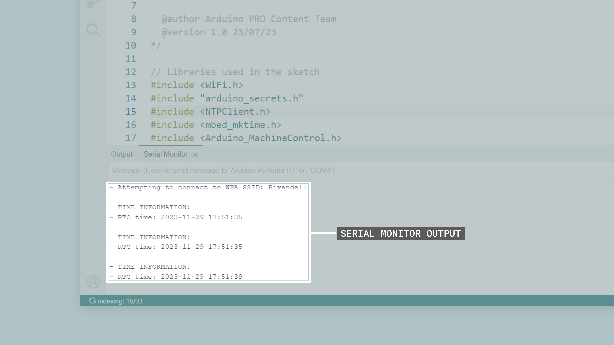

The sketch uses several key functions and methods:

- `WiFi.begin(ssid, password)`: Connects the device to a specified Wi-Fi network.
- `NTPClient`: A client object to communicate with an NTP server.
- `MachineControl_RTCController.begin()`: Initializes the onboard RTC.
- `MachineControl_RTCController.setEpoch(epoch)`: Sets the RTC time based on the epoch time obtained from the NTP server.
- `displayRTC()`: A custom function to format and display the current time from the RTC on the IDE's Serial Monitor.

## Temperature Measurements

The Portenta Machine Control is equipped with three independent temperature measurement channels, enhancing its capabilities for various industrial and environmental monitoring applications.

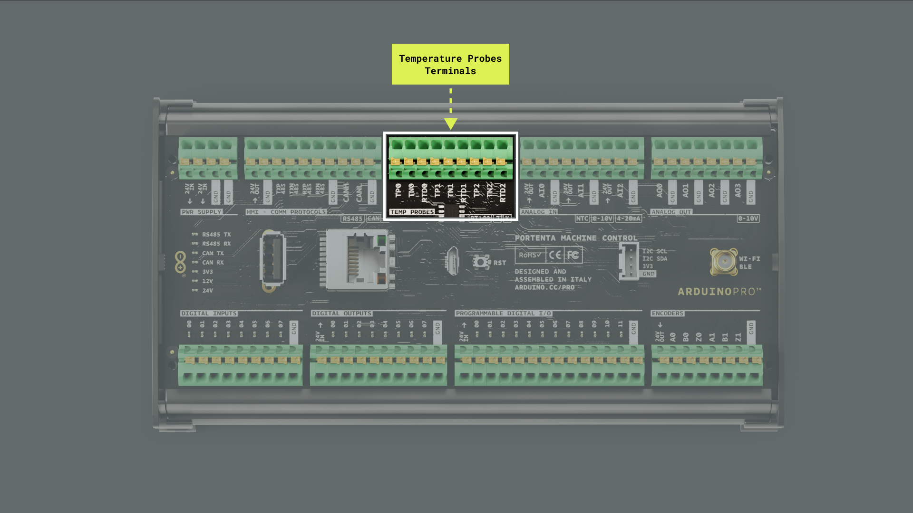

The Portenta Machine Control is compatible with the following temperature probes:

- **Type K Thermocouples**
- **Type J Thermocouples**
- **PT100 probes**

***Connect only **non-grounded** thermocouples. For more information about how to connect thermocouples to the Portenta Machine Control, please refer to the [complete pinout available here](#pinout).***

The Portenta Machine Control includes two onboard specialized front ends:

- **MAX31855**: This front end is dedicated to **thermocouples**, providing accurate temperature measurements for a wide range of thermocouple types.
- **MAX31865**: This front end is dedicated to **PT100 sensors**, ensuring precise temperature readings for these sensors.

The two onboard front ends are connected to the three temperature channels through a multiplexing system based on the following analog switches:

- **NX3L4053**: A single low-ohmic single-pole double-throw switch that selects between the two front ends.
- **TMUX1511**: Three quadruple single pole single throw switches that direct the active channel among the three available.
  
This multiplexing system allows for seamless switching between different sensor types and channels, enabling comprehensive temperature monitoring across multiple points.

### Thermocouples

The Portenta Machine Control is compatible with **non-grounded Type K and Type J Thermocouples**. Connect a thermocouple following the next steps:

- Connect the thermocouple to one of the three channels named `TEMP PROBES`.
- Connect the thermocouple positive pin to `TPCH`.
- Connect the thermocouple negative pin to `TNCH`.


***Thermocouples can have different cable color codes depending on the region and norm. Please check the meaning of each cable code before connecting them to the device. Do not connect the thermocouple negative pin to GND.***

The following example sketch demonstrates how to read temperatures from thermocouples connected to a Portenta Machine Control device. It uses the `Arduino_PortentaMachineControl` library to interface with the thermocouple probes and prints the temperature values to the Arduino IDE's Serial Monitor every second.

```arduino
/*
  Portenta Machine Control's Thermocouples Temperature Reading Example
  Name: portenta_machine_control_thermocouples_temp_read.ino
  Purpose: Reads temperatures from thermocouples connected to the 
  Portenta Machine Control. The temperature values are printed to the 
  Serial Monitor every second.

  @author Riccardo Rizzo, modified by Arduino PRO Content Team
  @version 1.0 01/10/23
*/

#include <Arduino_PortentaMachineControl.h>

void setup() {
  // Initialize serial communication
  Serial.begin(9600);
  
  // Wait 2.5 seconds for the serial port availability, then start the transmission
  for (const auto timeout = millis() + 2500; !Serial && millis() < timeout; delay(250));
  
  // Initialize temperature probes
  MachineControl_TCTempProbe.begin();
  Serial.println("- Temperature probes initialization done!");
}

void loop() {
  // Measure and display temperature from each channel
  for (int channel = 0; channel < 3; channel++) {
    // Select channel and read temperature
    MachineControl_TCTempProbe.selectChannel(channel);
    float temperature = MachineControl_TCTempProbe.readTemperature(); 
    Serial.print("- Temperature CH");
    Serial.print(channel);
    Serial.print(" °C: ");
    Serial.println(temperature);
  }
  Serial.println();

  // Wait one second before next reading
  delay(1000); 
}
```

This example sketch reads temperatures from thermocouples connected to its temperature probe inputs. It demonstrates the use of the `Arduino_PortentaMachineControl` library to interface with thermocouple sensors. The sketch initiates serial communication in the `setup()` function and then enters a loop where it reads and displays the temperature from each channel to the Serial Monitor every second.

Key functions used in the example sketch:

- `MachineControl_TCTempProbe.begin()`: Initializes the temperature probes.
- `MachineControl_TCTempProbe.selectChannel(channel)`: Selects the active channel for temperature measurement.
- `MachineControl_TCTempProbe.readTemperature()`: Reads the temperature from the selected channel.

### PT100

The Portenta Machine Control is compatible with two-wire RTD (PT100) and three-wire RTD (PT100) probes

#### Two Wire RTD Connection

The 2-wire RTD configuration is the simplest of the RTD circuit designs but is more prone to errors.

To connect a 2-wire RTD probe to one of the channels, like **channel 0**, connect one pin of the PT100 to the `TP0` input, the other pin to `TN0`, and connect a jumper between `TP0` and `RTD0` pins, as you can see in the following picture.

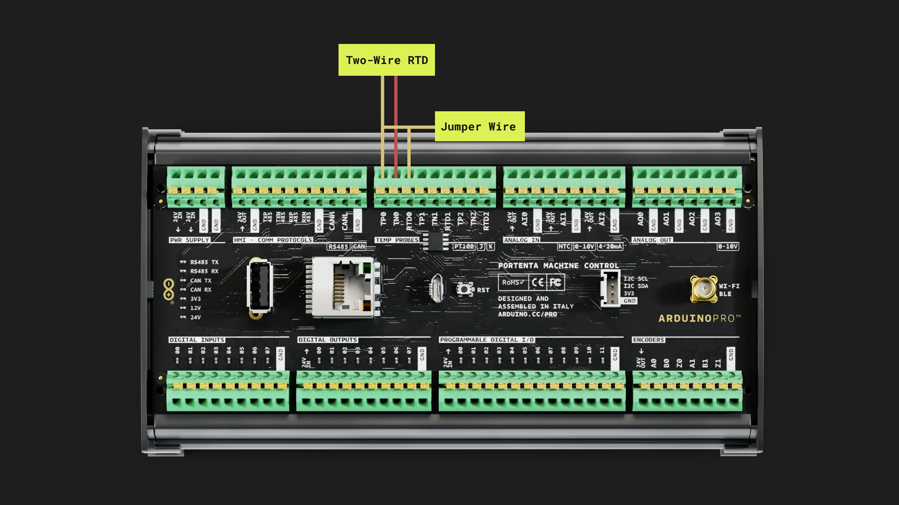

***Do not connect any pin of the PT100 to GND***

#### Three Wire RTD Connection

The 3-wire RTD configuration is the most commonly used RTD circuit. In this configuration, two wires link the sensing element to the monitoring device on one side of the sensing element, and one links it on the other side.

To connect a 3-wire RTD probe to one of the channels, like **channel 0**, connect one of the positive wires of the PT100 to the `TP0` input, the other positive wire to `RTD0`, and the negative one to `TN0`, as you can see in the following picture.

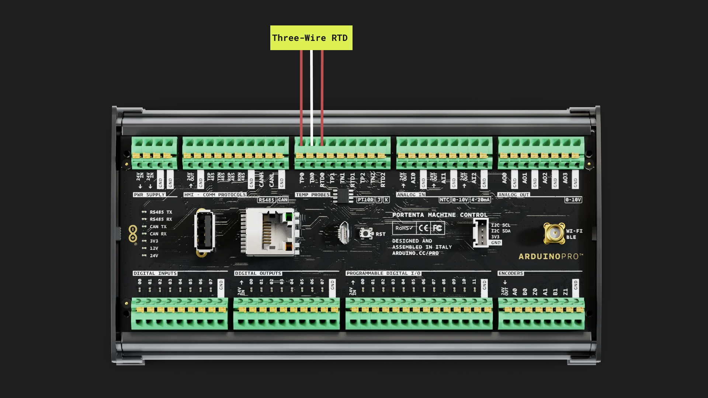

***Do not connect any pin of the PT100 to GND***

#### PT100 Example

The following example sketch demonstrates how to read temperatures from a 3-wire PT100 probe connected to a Portenta Machine Control device. It uses the `Arduino_PortentaMachineControl` library to interface with the PT100 probes and prints the temperature values and some additional PT100 constants of the probe to the Arduino IDE's Serial Monitor every second.

```arduino
/*
 * Portenta Machine Control - Temperature Probes RTD Example
 *
 * This example provides a method to test the 3-wire RTDs
 * on the Machine Control Carrier. It is also possible to
 * acquire 2-wire RTDs by shorting the RTDx pin to the TPx pin.
 * The Machine Control Carrier features a precise 400 ohm 0.1% reference resistor,
 * which serves as a reference for the MAX31865.
 *
 * Circuit:
 *  - Portenta H7
 *  - Portenta Machine Control
 *  - 3-wire RTD or 2-wire RTD
 *
 * This example code is in the public domain. 
 * Copyright (c) 2024 Arduino
 * SPDX-License-Identifier: MPL-2.0
 */

#include <Arduino_PortentaMachineControl.h>

// The value of the Rref resistor. Use 430.0 for PT100
#define RREF 400.0
// The 'nominal' 0-degrees-C resistance of the sensor
// 100.0 for PT100
#define RNOMINAL 100.0

void setup() {
  // Initialize serial communication
  Serial.begin(9600);
  
  // Wait 2.5 seconds for the serial port availability, then start the transmission
  for (const auto timeout = millis() + 2500; !Serial && millis() < timeout; delay(250));

  // Initialize temperature probes
  MachineControl_RTDTempProbe.begin(THREE_WIRE);
  Serial.println("- Temperature probes initialization done!");
}

void loop() {
  MachineControl_RTDTempProbe.selectChannel(0);
  Serial.println("CHANNEL 0 SELECTED");
  uint16_t rtd = MachineControl_RTDTempProbe.readRTD();
  float ratio = rtd;
  ratio /= 32768;

  // Check and print any faults
  uint8_t fault = MachineControl_RTDTempProbe.readFault();
  if (fault) {
    Serial.print("Fault 0x"); Serial.println(fault, HEX);
    if (MachineControl_RTDTempProbe.getHighThresholdFault(fault)) {
      Serial.println("RTD High Threshold");
    }
    if (MachineControl_RTDTempProbe.getLowThresholdFault(fault)) {
      Serial.println("RTD Low Threshold");
    }
    if (MachineControl_RTDTempProbe.getLowREFINFault(fault)) {
      Serial.println("REFIN- > 0.85 x Bias");
    }
    if (MachineControl_RTDTempProbe.getHighREFINFault(fault)) {
      Serial.println("REFIN- < 0.85 x Bias - FORCE- open");
    }
    if (MachineControl_RTDTempProbe.getLowRTDINFault(fault)) {
      Serial.println("RTDIN- < 0.85 x Bias - FORCE- open");
    }
    if (MachineControl_RTDTempProbe.getVoltageFault(fault)) {
      Serial.println("Under/Over voltage");
    }
    MachineControl_RTDTempProbe.clearFault();
  } else {
    Serial.print("RTD value: "); Serial.println(rtd);
    Serial.print("Ratio = "); Serial.println(ratio, 8);
    Serial.print("Resistance = "); Serial.println(RREF * ratio, 8);
    Serial.print("Temperature = "); Serial.println(MachineControl_RTDTempProbe.readTemperature(RNOMINAL, RREF));
  }
  Serial.println();
  delay(100);

  MachineControl_RTDTempProbe.selectChannel(1);
  Serial.println("CHANNEL 1 SELECTED");
  rtd = MachineControl_RTDTempProbe.readRTD();
  ratio = rtd;
  ratio /= 32768;

  // Check and print any faults
  fault = MachineControl_RTDTempProbe.readFault();
  if (fault) {
    Serial.print("Fault 0x"); Serial.println(fault, HEX);
    if (MachineControl_RTDTempProbe.getHighThresholdFault(fault)) {
      Serial.println("RTD High Threshold");
    }
    if (MachineControl_RTDTempProbe.getLowThresholdFault(fault)) {
      Serial.println("RTD Low Threshold");
    }
    if (MachineControl_RTDTempProbe.getLowREFINFault(fault)) {
      Serial.println("REFIN- > 0.85 x Bias");
    }
    if (MachineControl_RTDTempProbe.getHighREFINFault(fault)) {
      Serial.println("REFIN- < 0.85 x Bias - FORCE- open");
    }
    if (MachineControl_RTDTempProbe.getLowRTDINFault(fault)) {
      Serial.println("RTDIN- < 0.85 x Bias - FORCE- open");
    }
    if (MachineControl_RTDTempProbe.getVoltageFault(fault)) {
      Serial.println("Under/Over voltage");
    }
    MachineControl_RTDTempProbe.clearFault();
  } else {
    Serial.print("RTD value: "); Serial.println(rtd);
    Serial.print("Ratio = "); Serial.println(ratio, 8);
    Serial.print("Resistance = "); Serial.println(RREF * ratio, 8);
    Serial.print("Temperature = "); Serial.println(MachineControl_RTDTempProbe.readTemperature(RNOMINAL, RREF));
  }
  Serial.println();
  delay(100);

  MachineControl_RTDTempProbe.selectChannel(2);
  Serial.println("CHANNEL 2 SELECTED");
  rtd = MachineControl_RTDTempProbe.readRTD();
  ratio = rtd;
  ratio /= 32768;

  // Check and print any faults
  fault = MachineControl_RTDTempProbe.readFault();
  if (fault) {
    Serial.print("Fault 0x"); Serial.println(fault, HEX);
    if (MachineControl_RTDTempProbe.getHighThresholdFault(fault)) {
      Serial.println("RTD High Threshold");
    }
    if (MachineControl_RTDTempProbe.getLowThresholdFault(fault)) {
      Serial.println("RTD Low Threshold");
    }
    if (MachineControl_RTDTempProbe.getLowREFINFault(fault)) {
      Serial.println("REFIN- > 0.85 x Bias");
    }
    if (MachineControl_RTDTempProbe.getHighREFINFault(fault)) {
      Serial.println("REFIN- < 0.85 x Bias - FORCE- open");
    }
    if (MachineControl_RTDTempProbe.getLowRTDINFault(fault)) {
      Serial.println("RTDIN- < 0.85 x Bias - FORCE- open");
    }
    if (MachineControl_RTDTempProbe.getVoltageFault(fault)) {
      Serial.println("Under/Over voltage");
    }
    MachineControl_RTDTempProbe.clearFault();
  } else {
    Serial.print("RTD value: "); Serial.println(rtd);
    Serial.print("Ratio = "); Serial.println(ratio, 8);
    Serial.print("Resistance = "); Serial.println(RREF * ratio, 8);
    Serial.print("Temperature = "); Serial.println(MachineControl_RTDTempProbe.readTemperature(RNOMINAL, RREF));
  }
  Serial.println();
  delay(1000);
}
```

In case you want to use this example with a 2-wire RTD PT100 probe, change the function `MachineControl_RTDTempProbe.begin(THREE_WIRE);` to `MachineControl_RTDTempProbe.begin(TWO_WIRE);`.

This example sketch reads temperatures from the PT100 connected to its temperature probe inputs. It demonstrates the use of the `Arduino_PortentaMachineControl` library to interface with PT100 probes. The sketch initiates serial communication in the `setup()` function and then enters a loop where it reads and displays the temperature from each channel to the Serial Monitor every second.

Key functions used in the sketch:

- `MachineControl_RTDTempProbe.begin(THREE_WIRE)`: Initializes the temperature probes. In case you want to use this example with a 2-wire RTD PT100 probe, change the constant `THREE_WIRE` to `TWO_WIRE`.
- `MachineControl_RTDTempProbe.selectChannel(channel)`: Selects the active channel for temperature measurement.
- `MachineControl_RTDTempProbe.readRTD()`: Reads the raw value from the selected channel to calculate a `ratio`. The value needs to be converted to a valid temperature value in Celsius degrees using the function `MachineControl_RTDTempProbe.readTemperature(RNOMINAL, RREF)`, as can be seen in the lines that follow the calls of the function.
- `MachineControl_RTDTempProbe.readTemperature(RNOMINAL, RREF)`: Converts the values read from the `MachineControl_RTDTempProbe.readRTD()` function and the `RNOMINAL` constant to get the PT100 probe temperature reading in Celsius degrees.

## Encoders 

The Portenta Machine Control has two independent `ABZ` encoder channels, `0` and `1`, offering precise motion control and feedback for various applications.

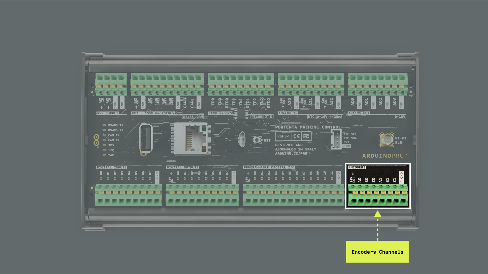

Some of the key capabilities of Portenta's Machine Control encoder channels are the following:

- **Independent operation**: Each `ABZ` encoder channel functions independently, providing motion measurement and control versatility.
- **Pull-up resistance**: The channels are equipped with 10 kΩ pull-up resistors connected to the board's 24 VDC supply, ensuring stable signal integrity and reduced noise interference.
- **24 VDC compatibility**: The connection to the 24 VDC supply makes these encoders suitable for industrial systems and applications that operate at this voltage level.

The `Arduino Mbed OS Portenta Boards` core and the `Arduino_PortentaMachineControl` have built-in libraries and functions that enable you to utilize the Portenta's Machine Control encoders. The following example shows how to read information from encoder channel 0 of a Portenta Machine Control device; for wiring an ABZ encoder to the Portenta Machine Control, follow the diagram below:


The example sketch is shown below.

```arduino
/*
  Portenta Machine Control's Single Encoder Read Example
  Name: portenta_machine_control_single_encoder_read.ino
  Purpose: Reads values from one of the encoder channels on the Portenta Machine Control,
  periodically displays the state, number of pulses, and revolutions of the encoder.
  
  @author Riccardo Rizzo, modified by Arduino PRO Content Team
  @version 1.0 01/10/23
*/

#include <Arduino_PortentaMachineControl.h>

void setup() {
  // Initialize serial communication
  Serial.begin(9600);´
  // Wait 2.5 seconds for the serial port availability, then start the transmission
  for (const auto timeout = millis() + 2500; !Serial && millis() < timeout; delay(250)); 
}

void loop() {
  // Read and print the current state of encoder channel 0 in binary format
  Serial.print("- Encoder 0 state: ");
  Serial.println(MachineControl_Encoders.getCurrentState(0), BIN);

  // Read and print the number of pulses recorded by encoder channel 0
  Serial.print("- Encoder 0 pulses: ");
  Serial.println(MachineControl_Encoders.getPulses(0));

  // Read and print the number of complete revolutions made by encoder channel 0
  Serial.print("- Encoder 0 revolutions: ");
  Serial.println(MachineControl_Encoders.getRevolutions(0));
  Serial.println();

  // Short delay before the next read
  delay(25); 
}
```

This sketch for the Portenta Machine Control reads and displays data from one of its encoder channels, primarily using the `Arduino_PortentaMachineControl` library. Serial communication is initiated in the `setup()` function for output to the Arduino IDE's Serial Monitor. In the main loop, the sketch reads and displays the encoder's state, total pulses, and revolutions on the Serial Monitor, updating the readings every 25 milliseconds. 

The sketch uses several key functions and methods:

- `MachineControl_Encoders.getCurrentState(channel)`: Retrieves the current binary state of the specified encoder channel.
- `MachineControl_Encoders.getPulses(channel)`: Obtains the total number of pulses recorded by the specified encoder channel.
- `MachineControl_Encoders.getRevolutions(channel)`: Calculates the total revolutions made by the specified encoder channel.

## Arduino Cloud

The Portenta Machine Control is fully compatible with [Arduino Cloud](https://cloud.arduino.cc/), simplifying how professional applications are developed and tracked. By using Arduino Cloud, you can, for example, monitor your Portenta's Machine Control input terminals, control your device's user LEDs and output relays remotely, and update your device's firmware OTA. 

In case it is the first time you are using Arduino Cloud:

- To use it, you need an account. If you do not have an account, create one for free [here](https://cloud.arduino.cc/).
- To use the Arduino Cloud Editor, the Arduino Create Agent must be running on your computer. You can install the Arduino Create Agent by downloading it [here](https://create.arduino.cc/getting-started/plugin/welcome).

Let's walk through a step-by-step demonstration of how to use a Portenta Machine Control device with Arduino Cloud. Log in to your Cloud account; provision your Portenta Machine Control on your Cloud space. To do this, navigate to **Devices** and then click on the **ADD DEVICE** button:


The Setup Device pop-up window will appear. Navigate into **AUTOMATIC** and select the **Arduino board** option:


After a while, your Portenta Machine Control should be discovered by Cloud, as shown below:


Click the **CONFIGURE** button, give your device a name, and select the type of network connection. In this example, we will use a Wi-Fi® connection; you can also use an Ethernet connection with your device. Your Portenta Machine Control will be configured to communicate securely with the Cloud; this process can take a while.


Once your Portenta Machine Control has been configured, let's create a "Thing" to test the connection between your board and Cloud. Navigate into **Things** and select the **CREATE THING** button; give your thing a name.


Navigate into **Associate Device** and click the **Select Device** button. Select your Portenta Machine Control device and associate it with your "Thing." Then, navigate into **Network** and click the **Configure** button; enter your network credentials.

The project is ready to add variables to your "Thing"; navigate into **Cloud Variables** and click the **ADD** button.


Add one variable with the following characteristics:

- **Name**: `led`
- **Variable type**: `boolean`
- **Variable permission**: `Read & Write`
- **Variable update policy**: `On change`


You should see the `led` variable in the Cloud Variables section. Navigate into **Dashboards** and select the **BUILD DASHBOARD** button; this will create a new dashboard and give your dashboard a name.


Add the following widgets to your dashboard:

- **Switch**:  Name the widget Switch and link it to the `led` variable you created before.
- **LED**: Name the widget **LED** and link it to the `led` variable you created before.

Your dashboard should look like the following:


Go back to your **Things** and open the "Thing" you created. In the "Thing" setup page, navigate into Sketch, where you should see the online editor.

In the generated sketch, include the `Arduino_PortentaMachineControl.h` library and initialize digital output at channel `0` in the `setup()` function:

```arduino
#include <Arduino_PortentaMachineControl.h>
#include "thingProperties.h"

void setup() {
  // Initialize serial and wait for port to open:
  Serial.begin(9600);
  // This delay gives the chance to wait for a Serial Monitor without blocking if none is found
  delay(1500);

  // Initialize the digital outputs terminals of the Arduino_PortentaMachineControl library
  MachineControl_DigitalOutputs.begin();

  // Defined in thingProperties.h
  initProperties();

  // Connect to Arduino Cloud
  ArduinoCloud.begin(ArduinoIoTPreferredConnection);

  /*
     The following function allows you to obtain more information
     related to the state of network and Cloud connection and errors
     the higher number the more granular information you’ll get.
     The default is 0 (only errors).
     Maximum is 4
 */
  setDebugMessageLevel(2);
  ArduinoCloud.printDebugInfo();
}
```

In the `onLedChange()` function, which was generated automatically by Cloud when the variable `led` was created, you must associate the digital output at channel `0` state with the `led` variable:

```arduino
/*
  Since Led is READ_WRITE variable, onLedChange() is
  executed every time a new value is received from Cloud.
*/
void onLedChange()  {
  // Change digital output state of channel 0 according to led variable state (true-HIGH, false-LOW)
  MachineControl_DigitalOutputs.write(0, led ? HIGH : LOW);
}
```

The complete example sketch can be found below:

```arduino
/*
  Sketch generated by the Arduino Cloud

  Arduino Cloud Variables description

  The following variables are automatically generated and updated when changes are made to the Thing

  bool led;

  Variables which are marked as READ/WRITE in the Cloud Thing will also have functions
  which are called when their values are changed from the Dashboard.
  These functions are generated with the Thing and added at the end of this sketch.
*/

#include <Arduino_PortentaMachineControl.h>
#include "thingProperties.h"

void setup() {
  // Initialize serial and wait for port to open:
  Serial.begin(9600);
  // This delay gives the chance to wait for a Serial Monitor without blocking if none is found
  delay(1500);

  // Initialize the digital outputs terminals of the Arduino_PortentaMachineControl library
  MachineControl_DigitalOutputs.begin();

  // Defined in thingProperties.h
  initProperties();

  // Connect to Arduino Cloud
  ArduinoCloud.begin(ArduinoIoTPreferredConnection);

  /*
     The following function allows you to obtain more information
     related to the state of network and Cloud connection and errors
     the higher number the more granular information you’ll get.
     The default is 0 (only errors).
     Maximum is 4
 */
  setDebugMessageLevel(2);
  ArduinoCloud.printDebugInfo();
}

void loop() {
  ArduinoCloud.update();
  // Your code here
}

/*
  Since Led is READ_WRITE variable, onLedChange() is
  executed every time a new value is received from Cloud.
*/
void onLedChange()  {
  // Change digital output state of channel 0 according to led variable state (true-HIGH, false-LOW)
  MachineControl_DigitalOutputs.write(0, led ? HIGH : LOW);
}
```

To upload the code to the Portenta Machine Control from the online editor, click the green **Verify** button to compile the sketch and check for errors, then click the green **Upload** button to program the board with the sketch.


Navigate into **Dashboards** again; your board should connect to the Wi-Fi® network you defined before (you can follow the connection process with the online editor-integrated Serial Monitor). Your Portenta's Machine Control digital output at channel `0` should light on or off when the position of the switch changes.

## Support

If you encounter any issues or have questions while working with the Portenta Machine Control, we provide various support resources to help you find answers and solutions.

### Help Center

Explore our Help Center, which offers a comprehensive collection of articles and guides for the Portenta Machine Control. The Help Center is designed to provide in-depth technical assistance and help you make the most of your device.

- [Portenta Machine Control help center page](https://support.arduino.cc/hc/en-us/sections/360004767859-Portenta-Family)

### Forum

Join our community forum to connect with other Portenta Machine Control users, share your experiences, and ask questions. The Forum is an excellent place to learn from others, discuss issues, and discover new ideas and projects related to the Portenta Machine Control.

- [Portenta Machine Control category in the Arduino Forum](https://forum.arduino.cc/c/hardware/portenta/portenta-machine-control/173)

### Contact Us

Please get in touch with our support team if you need personalized assistance or have questions not covered by the help and support resources described before. We are happy to help you with any issues or inquiries about the Portenta Machine Control.

- [Contact us page](https://www.arduino.cc/en/contact-us/)  