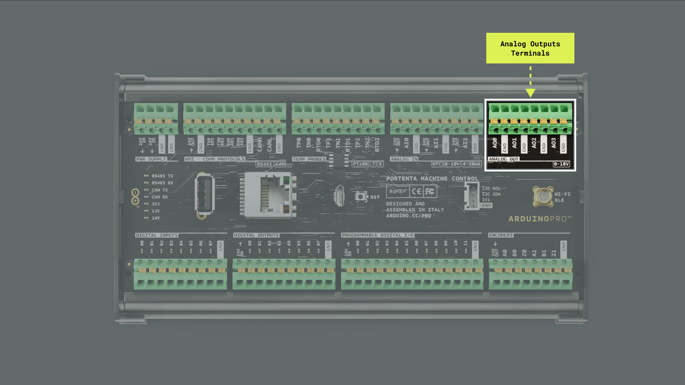

This user manual will provide a comprehensive overview of the Portenta Machine Control, covering its major hardware and software elements. With this user manual, you will learn how to set up, configure, and use all the main features of the Portenta Machine Control.

## Hardware and Software Requirements

### Hardware Requirements

- [Portenta Machine Control](https://store.arduino.cc/products/arduino-portenta-machine-control) (x1)
- [Micro-USB cable](https://store.arduino.cc/products/usb-2-0-cable-type-a-micro) (x1)
- +24 VDC/0.5 A power supply (x1)

### Software Requirements

- [Arduino IDE 2.0+](https://www.arduino.cc/en/software) or [Arduino Web Editor](https://create.arduino.cc/editor)
- [Arduino PLC IDE 1.0.3+](https://www.arduino.cc/en/software) (for IEC 61131-3 PLC programming languages)
- [Arduino PLC IDE 1.0.3+ Tools](https://www.arduino.cc/en/software#arduino-plc-ide) 
- [Arduino_MachineControl library](https://github.com/leonardocavagnis/Arduino_MachineControl/tree/lib_refactoring)

***To learn more about the PLC IDE, check out our tutorials [here](https://docs.arduino.cc/software/plc-ide).***

## Portenta Machine Control Overview

The Portenta Machine Control is designed for efficiency and adaptability in industrial environments. It is compatible with the Arduino framework and other embedded platforms and provides a flexible solution for controlling various equipment and machinery. The Portenta H7 board (included) is central to its operation, which ensures stable performance across a broad temperature spectrum, ranging from -40 °C to +85 °C, without external cooling requirements.


This controller offers many connectivity options, from USB and Ethernet to Wi-Fi®/Bluetooth® Low Energy, as well as industry-specific protocols. It can also connect with various external sensors, actuators, and different Human Machine Interfaces (HMI), such as displays and touch panels, showcasing its adaptability. It's designed for harsh industrial operations with features like DIN bar compatible housing, compact size, and an integrated Real Time Clock (RTC). For real-time control or predictive maintenance tasks, the Portenta Machine Control is a solid choice for businesses aiming to enhance their production and equipment management processes.

### Portenta Machine Control Main Components

The Portenta Machine Control features a secure, certified, and durable design that enables it for automation and industrial applications. 


Here's an overview of the controller's main components shown in the image above:

- **Microcontroller**: At the heart of the Portenta Machine Control is the STM32H747XI, a powerful, robust, and high-performance dual-core microcontroller from STMicroelectronics®. This microcontroller is built around an Arm® Cortex®-M7 and an Arm® Cortex®-M4 32-bit RISC cores. The Arm® Cortex®-M7 core operates at up to 480 MHz, while the Arm® Cortex®-M4 core operates at up to 240 MHz.
- **Memory and storage**: The Portenta Machine Control houses 2 MB of Flash Memory, 1 MB of RAM, and additional onboard memory of 8 MB SDRAM and 16 MB Flash QSPI.
- **Security**: The controller features an onboard ready-to-use secure element from NXP®, the SE0502. This secure element, specifically designed for Internet of Things (IoT) devices, provides advanced security features, perfect for Industrial IoT (IIoT) environments where security is critical.
- **Power architecture**: The controller's power system was designed to be resilient. It operates at an input voltage of +24 VDC, with reverse polarity protection, ensuring the controller remains safeguarded from power irregularities.
- **Digital and analog ports**: Equipped with a versatile set of input and output ports, the Portenta Machine Control supports eight digital input ports, eight digital output ports, three software-configurable analog input ports, and four analog output ports. It is also equipped with 12 digital programmable input/output ports. 
- **Temperature sensing**: With three software-configurable temperature channels, the Portenta Machine Control can measure a variety of temperature ranges using thermocouples (Type K or Type J) or PT100 sensors.
- **Communication interfaces**: Seamless connectivity is a hallmark of this controller. The Portenta Machine Control offers a high-speed CAN interface, software-configurable RS-232, RS-422, and RS-485 interfaces, and an I<sup>2</sup>C interface accessible via a Grove connector.
- **Ethernet and USB**: The Portenta Machine Control features onboard Ethernet connectivity and full-speed USB-A and half-speed micro-USB Type B connectors for wired communication.
- **Wireless connectivity**: The Portenta Machine Control supports 2.4 GHz Wi-Fi® (802.11 b/g/n) and Bluetooth® Low Energy (4.2 supported by firmware and 5.1 supported by hardware).
- **Additional features**: The Portenta Machine Control features an onboard RTC with at least 48 hours of memory retention and two encoder channels. Moreover, Electrostatic Discharge (ESD) protection on all inputs and output ports ensures the longevity and durability of the controller.
- **Form factor**: The Portenta Machine Control can be standalone on a DIN rail, a grid, or a panel, providing quick and easy access to all input/output ports and peripherals.

### Portenta Machine Control Core and Libraries

The `Arduino Mbed OS Portenta Boards` core contains the libraries and examples to work with Portenta's Machine Control peripherals and onboard components, such as its input ports, output ports, Wi-Fi® and Bluetooth® modules. To install the core for the Portenta Machine Control, navigate to **Tools > Board > Boards Manager** or click the **Boards Manager** icon in the left tab of the IDE. In the Boards Manager tab, search for `portenta` and install the latest `Arduino Mbed OS Portenta Boards` core version.


The `Arduino_MachineControl` library enables efficient management of the features of the Portenta Machine Control. To install the library, navigate to **Tools > Manage Libraries...** or click the **Library Manager** icon in the left tab of the IDE. In the Library Manager tab, search for `machinecontrol` and install the latest `Arduino_MachineControl` library version.


### Arduino PLC IDE

PLC IDE is the Arduino solution to program Portenta Machine Control devices using the five programming languages recognized by the IEC 61131-3 standard. 


The IEC 61131-3 programming languages include:

- Ladder Diagram (LD)
- Functional Block Diagram (FBD)
- Structured Text (ST)
- Sequential Function Chart (SFC)
- Instruction List (IL)

In the PLC IDE, you can mix PLC programming with standard Arduino sketches within the integrated sketch editor and share variables between the two environments. You can also automate tasks in your software applications; this gives you control over scheduling and repetition, enhancing the reliability and efficiency of your project. Moreover, communication protocols such as Modbus RTU and Modbus TCP can be managed effortlessly using integrated no-code fieldbus configurators.

Check out the following resources that will show you how to start with the Arduino PLC IDE and use IEC 61131-3 programming languages with the Portenta Machine Control:

- [Arduino PLC IDE download page](https://www.arduino.cc/pro/software-plc-ide)
- [Arduino PLC IDE and Portenta Machine Control tutorials](https://docs.arduino.cc/hardware/portenta-machine-control)

### Pinout


The complete pinout is available and downloadable as PDF from the link below:

- [Portenta Machine Control pinout](https://docs.arduino.cc/resources/pinouts/AKX00032-full-pinout.pdf)

### Datasheet

The complete datasheet is available and downloadable as PDF from the link below:

- [Portenta Machine Control datasheet](https://docs.arduino.cc/resources/datasheets/AKX00032-datasheet.pdf)

### STEP Files

The complete STEP files are available and downloadable from the link below:

- [Portenta Machine Control STEP files](https://docs.arduino.cc/static/142bd938b340c767b9343451485aa5d2/AKX00032-step.zip)

## First Use

### Powering the Portenta Machine Control

Portenta Machine Control can be powered in different ways:

- Using an **external +24 VDC/0.5 A power supply** connected to Portenta's Machine Control power supply terminals. Please refer to the [pinout section](#pinout) of the user manual.
- Using a **micro-USB cable** (not included) for programming purposes only.


### Hello World Example

Let's program the Portenta Machine Control with a modified version of the classic `hello world` example used in the Arduino ecosystem: the `Blink` sketch. We will use this example to verify the controller's connection to the Arduino IDE and that its core functionalities and the `Arduino_MachineControl` library are working as expected.

Copy and paste the code below into a new sketch in the Arduino IDE.

```arduino
// Include the Arduino_MachineControl library
#include <Arduino_MachineControl.h>

void setup() {
    // Initialize the digital outputs terminals of the Arduino_MachineControl library
    MachineControl_DigitalOutputs.begin();
}

void loop() {
    // Turn on the digital output at channel 0
    MachineControl_DigitalOutputs.write(0, HIGH);
    delay(1000);
    // Turn off the digital output at channel 0
    MachineControl_DigitalOutputs.write(0, LOW);
    delay(1000);
}
```
The sketch begins by including the `Arduino_MachineControl` library. The `setup()` function initializes the digital output terminals from this library. The `loop()` function, which continually runs after the `setup()` function is called, toggles a digital output at channel `0`.

To upload the code to your Portenta Machine Control, click the **Verify** button to compile the sketch and check for errors; once verification is successful, click the **Upload** button to program the controller with the sketch.


Upon successful upload, observe the red LED on top of your controller's digital output labeled `00`. It should turn on for one second, then off for one second, repeatedly.

## Digital Outputs

The Portenta Machine Control has up to eight digital output channels, as shown in the image below.


Some of the key features of the digital output channels of the Portenta Machine Control are the following:

- Digital outputs are **high-side switches** (TPS4H160AQPWPRQ1), handling up to 500 mA.
- All digital output terminals have **overcurrent protection**. If the current exceeds 700 mA (with a tolerance of ±20%), the channel opens to prevent damage.

***The digital output channels are connected to an external +24 VDC power supply (24V IN pin) through high-side switches, independent of the controller's +24 VDC power supply. 24V IN pin is not galvanically isolated, meaning the input power supply voltage must share the same GND as the controller.***

There are two modes of overcurrent protection in the digital outputs:

1. **Latch mode**: When overcurrent is detected, the digital output channel remains open and can only be closed manually via software. 
2. **Auto retry**: Upon detecting overcurrent, the channel opens. After a short duration (several tens of milliseconds), it attempts to close automatically. If the overcurrent condition persists in the channel, it will keep toggling.

***Ensure each channel does not exceed a maximum current of 500 mA to avoid potential damage or malfunctions in the digital output channels.***

The sketch below showcases a "scanning" effect using the digital output channels of the Portenta Machine Control. It sequentially activates each channel in sequence from the first to the last and then in the opposite direction. As each channel is activated, feedback is provided in the Arduino IDE's Serial Monitor, indicating the active channel at each step.

```arduino
/*
  Portenta Machine Control's Digital Outputs 
  Name: portenta_machine_control_digital_outputs_example.ino
  Purpose: This sketch demonstrates a "scanning" effect using 
  the digital output channels of the Portenta Machine Control.

  @author Arduino PRO Content Team
  @version 1.0 01/10/23
*/

#include <Arduino_MachineControl.h>

// Initialize the digital outputs and serial communication.
void setup() {
  Serial.begin(9600);

  // Set overcurrent behavior of all channels to latch mode (true)
  MachineControl_DigitalOutputs.begin(true);

  // At startup, set all channels to open state (OFF)
  MachineControl_DigitalOutputs.writeAll(0);
}

void loop() {
  // Create the "scanning" effect moving forward
  for (int i = 0; i < 8; i++) {
    toggleChannel(i);

    // Turn off the previous channel to maintain the "scanning" effect
    if (i < 7) {
      MachineControl_DigitalOutputs.write(i - 1, LOW);
    }
  }

  // Create the "scanning" effect moving backward
  for (int i = 6; i >= 0; i--) {
    toggleChannel(i);

    // Turn off the next channel to maintain the "scanning" effect
    if (i < 7) {  
      MachineControl_DigitalOutputs.write(i + 1, LOW);
    }
  }
}

/**
  Toggles a specific digital output channel, creating part of the "scanning" effect.
  
  @param channel (int)
*/
void toggleChannel(int channel) {
  // Activate the digital output channel
  MachineControl_DigitalOutputs.write(channel, HIGH); 
  Serial.println("- CH" + String(channel) + ": ON");
  // Delay to keep the channel activated, making the effect visible
  delay(200);

  // Deactivate the digital output channel
  MachineControl_DigitalOutputs.write(channel, LOW);
  // Delay to make the transition between channels smoother
  delay(200);
}
```
Notice that the sketch shown above utilizes the following functions from the `Arduino_MachineControl` library:

- `MachineControl_DigitalOutputs.begin(true)`: This function initializes the digital outputs channels with overcurrent behavior set to **latch mode**, meaning that upon overcurrent detection, channels remain open until manually toggled in software.
- `MachineControl_DigitalOutputs.writeAll(0)`: This function initially sets all digital output channels to an open state (off).
- `MachineControl_DigitalOutputs.write(channel, HIGH/LOW)`: This function controls individual channel states, turning them either on (`HIGH`) or off (`LOW`). In the example sketch, this function creates the "scanning" effect by activating one channel at a time.

## Analog Outputs

The Portenta Machine Control has up to four independent analog output channels, as shown in the image below. These analog output channels enable precise voltage control for various applications. 



Some of the key features of the analog output channels of the Portenta Machine Control are the following:

- Analog outputs can be configured with specific PWM periods, affecting the frequency and resolution of the voltage output.
- Each channel supports voltage outputs ranging from 0 VDC to 10.5 VDC and can source up to 20 mA.

Each analog output channel is designed with a double low-pass filter and a high-current operational amplifier (OPA2990IDSGR) set up in a non-inverting topology with a gain factor of 3.3. This design allows for an effective filtering and amplification of the signal provided.

***The output signal of the analog output channels of the Portenta Machine Control is a DC voltage whose amplitude is a function of the defined PWM duty cycle.***

Below is an example demonstrating using a single analog output channel to generate a sine wave voltage output.

```arduino
/*
  Portenta Machine Control's Analog Output 
  Name: portenta_machine_control_sine_wave_example.ino
  Purpose: This sketch demonstrates the generation of a sine wave 
  using an analog output channel of the Portenta Machine Control.

  @author Arduino PRO Content Team
  @version 1.0 01/10/23
*/

#include <math.h> 
#include <Arduino_MachineControl.h>

// PWM period set to 4 ms (or 250 Hz)
#define PERIOD_MS 4 

void setup() {
  // Initialize serial communication at 9600 bauds
  Serial.begin(9600);

  // Initialize the analog output channels
  MachineControl_AnalogOut.begin();
  
  // Set the PWM period for channel 0 to 4 ms (or 250 Hz)
  MachineControl_AnalogOut.setPeriod(0, PERIOD_MS);
}

void loop() {
  // Iterate through 360 degrees, generating a complete sine wave output
  for (int i = 0; i < 360; i += 5) {
    
    // Calculate the sine wave voltage output from 0 to 10 VDC
    float voltage = 5 + 5 * sin(i * (PI / 180)); 

    // Set the voltage for channel 0
    MachineControl_AnalogOut.write(0, voltage);

    // Print the current voltage to the IDE's serial monitor (with two decimal precision)
    Serial.println("Channel 0 set at " + String(voltage, 2) + "V");

    // Introduce a delay to adjust the frequency of the sine wave
    delay(15); 
  }
}
```

In the example sketch, the sine wave signal is generated by iterating through 360 degrees; the sine function is computed for each degree value. The sine function yields a value between -1 and 1; to convert this into a voltage value between 0 and 10 VDC, an offset of 5 VDC is added, and the result is then multiplied by 5. With this formula, the sine wave oscillates between 0 to 10 VDC. The delay introduced at the end of each iteration helps adjust the frequency of the sine wave signal, resulting in the desired waveform at the analog output.

Notice that the sketch shown above utilizes the following functions from the `Arduino_MachineControl` library:

- `MachineControl_AnalogOut.begin()`: This function initializes the analog output channels, preparing them for voltage output.
- `MachineControl_AnalogOut.setPeriod(channel, period)`: This function configures the PWM period for the specified analog output channel. In the example shown above, it's set to 4 ms or 250 Hz.
- `MachineControl_AnalogOut.write(channel, voltage)`: This function controls the voltage output for the specified channel. In the example above, a sine wave is generated for channel `0` ranging from 0 to 10 VDC.

The expected result of the generated sine wave measured with an oscilloscope in the analog output channel `0` is shown in the image below.


## Digital Inputs

The Portenta Machine Control has up to eight digital input channels, as shown in the image below. Each channel incorporates a voltage divider comprising a 680 kΩ and a 100 kΩ resistor, which scales an input from 0 to 24 VDC down to 0 to 3 VDC.


Below is an example sketch showcasing how to read data from all the digital input channels periodically.

```arduino
/*
  Portenta Machine Control's Digital Input Example 
  Name: portenta_machine_control_digital_input_example.ino
  Purpose: This sketch demonstrates how to periodically read from 
  all the digital input channels on the Portenta Machine Control.
  
  @author Arduino PRO Content Team
  @version 1.0 01/10/23
*/

#include <Arduino_MachineControl.h>

void setup() {
  // Initialize serial communication at 9600 bps
  Serial.begin(9600);

  // Initialize the digital input channels
  // If initialization fails, notify via Serial Monitor
  if (!MachineControl_DigitalInputs.begin()) {
    Serial.println("- Failed to initialize the digital input GPIO expander!");
  }
}

void loop() {
  // Read the status of all digital input channels
  uint32_t inputs = MachineControl_DigitalInputs.readAll();

  // Display the status of each channel on the IDE's Serial Monitor
  for (int i = 0; i < 8; i++) {
    Serial.print("- CH0" + String(i) + ": " + String((inputs & (1 << i)) >> i) + "\t");
  }

  // Print a new line for better readability
  Serial.println();
  delay(500);
}
```

Note that the example sketch employs the `MachineControl_DigitalInputs.readAll()` function from the `Arduino_MachineControl` library, which facilitates the reading of the status of all the digital input channels in a single operation. The sketch then prints the status of each channel on the Serial Monitor.

## Analog Inputs

The Portenta Machine Control has up to three independent analog input channels, as shown in the image below. Each channel can have a range resolution varying from 12 to 16 bits, producing decimal values ranging from 0 to 65,535, which is configurable through software.


The configuration of Portenta's Machine Control analog input channels is determined by an analog switch (TS12A44514PWR), which allows switching between three different operational modes:

- **0-10V**: The analog input channel uses a resistor divider consisting of a 100 kΩ and a 39 kΩ resistor for this mode. This scales down an input voltage in the 0 VDC to 10 VDC range to a range of 0 VDC to 2.8 VDC. The resulting input impedance in this configuration is approximately 28 kΩ.
- **4-20 mA**: The analog input channel connects to a 120 Ω resistor for this mode. This configuration allows a 4 mA to 20 mA input current to be converted to a voltage in the 0.48 VDC to 2.4 VDC range.
- **NTC**: For this mode, the input is connected to a 3 VDC voltage reference (REF3330AIRSER). A 100 kΩ resistor is then placed in series, forming a part of the resistor divider powered by the voltage reference.

***Each analog input channel has an output voltage pin supplying +24 VDC for powering sensors. This pin has integrated protection through a 500 mA PTC resettable fuse.***

To use a specific operational mode with Portenta's Machine Control analog input channels, the `MachineControl_AnalogIn.begin(SensorType)` function from the `Arduino_MachineControl` library must be called before reading values from the analog input channels. Use the following constants in the `MachineControl_AnalogIn.begin(SensorType)` function to define an specific operational mode:

- `SensorType::V_0_10`: 0-10V mode
- `SensorType::MA_4_20`: 4-20mA mode
- `SensorType::NTC`: NTC mode

Below is an example sketch showcasing how to read voltages from the analog input channels set to the 0-10V mode.

```arduino
/*
  Portenta Machine Control's Analog Input 
  Name: portenta_machine_control_analog_input_simple_example.ino
  Purpose: This sketch demonstrates reading voltage values 
  from the analog input channels set in the 0-10V mode 
  of the Portenta Machine Control.

  @author Arduino PRO Content Team
  @version 1.0 01/10/23
*/

#include <Arduino_MachineControl.h>

// Define the resistor divider ratio for 0-10V input mode
const float RES_DIVIDER = 0.28057;

// Define the ADC reference voltage
const float REFERENCE   = 3.0;

void setup() {
  // Initialize serial communication at 9600 baud
  Serial.begin(9600);

  // Initialize the analog input channels of the Portenta Machine Control in 0-10V mode
  MachineControl_AnalogIn.begin(SensorType::V_0_10);
}

void loop() {
  // Loop through each analog input channel
  // Read its current voltage
  // Print the current voltage value in the IDE's Serial Monitor
  for (int i = 0; i < 3; i++) {
    float voltage = readVoltage(i);
    Serial.print("- Voltage CH");
    Serial.print(i);
    Serial.print(": ");
    Serial.print(voltage, 3);
    Serial.println(" VDC");
  }
  
  // Add a delay for readability and a separator for the next set of readings
  Serial.println();
  delay(250);
}

/**
  Reads the raw ADC value from the specified channel, then
  calculates the actual voltage using the predefined resistor 
  divider ratio and the reference voltage.
 
  @param channel (int).
  @return The calculated voltage value in volts.
*/
float readVoltage(int channel) {
  // Read the raw ADC value from the specified channel
  float raw_voltage = MachineControl_AnalogIn.read(channel);
  
  // Convert the raw ADC value to the actual voltage 
  // Use the resistor divider ratio and reference voltage 
  // Return the calculated voltage
  return (raw_voltage * REFERENCE) / 65535 / RES_DIVIDER;
}
```

Note that the example sketch uses the `MachineControl_AnalogIn.read(channel)` function to acquire the raw voltage values from each channel. These raw values are then converted to the actual voltage values using the provided `RES_DIVIDER` and `REFERENCE` constants.