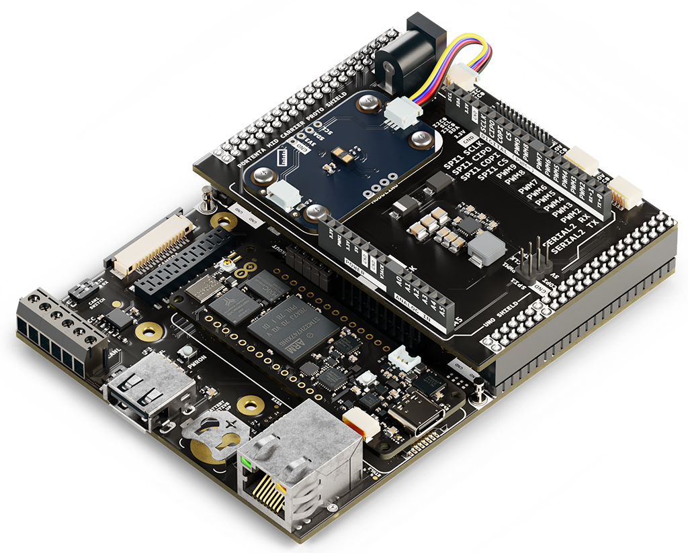

# Description

Expand your vision-based automation and industrial monitoring projects with the Arduino Portenta Proto Kit VE (Vision Environment). This kit integrates multiple Arduino Pro products, providing a comprehensive solution for developing functional prototypes that leverage advanced image processing and edge AI capabilities. Ideal for applications such as smart quality inspection, automated object detection and industrial vision systems, the kit enables real-time data collection and processing. With robust connectivity options, including seamless Cloud integration via the Arduino Pro 4G Module, the Portenta Proto Kit VE accelerates the transition from concept to deployment, enhancing efficiency and innovation in vision-based automation.

# Target Areas

Quality inspection, automated object detection, industrial automation, machine vision, research and development

# CONTENTS
## Application Examples

The Arduino Portenta Proto Kit VE (Vision Environment) is not just a prototyping platform; it is a powerful toolkit for developing real-time vision-based applications in industrial automation, quality inspection and machine vision. With onboard AI processing capabilities and seamless Cloud connectivity, the kit enables efficient image recognition, object detection and automation workflows. Discover how the Portenta Proto Kit VE can accelerate innovation through the following application examples:

- **Industrial automation**: Optimize manufacturing and automation processes with the Portenta Proto Kit VE, offering solutions for:
  - 
<strong>Smart quality inspection</strong>: Use the Nicla Vision board to capture high-resolution images and detect defects in products during manufacturing. Process data with the Portenta H7 board and leverage edge AI to classify objects, ensuring real-time quality control.

  - 
<strong>Automated object detection</strong>: Implement AI-powered vision models to recognize and track objects in production lines. The Portenta Proto Kit VE enables edge processing for immediate detection, reducing latency and enhancing operational efficiency.

  - 
<strong>Machine vision-based sorting</strong>: Design an automated sorting system using the Nicla Vision board and AI models to classify items based on color, shape or defects. Send real-time insights to the Cloud for analytics and process optimization.

- **Smart logistics and tracking**: Improve asset monitoring and tracking with vision-based automation:
  - 
<strong>Autonomous package scanning</strong>: Use the Nicla Vision board to scan and read barcodes or QR codes on packages, enabling automated inventory management and real-time logistics tracking.

  - 
<strong>Workplace safety monitoring</strong>: Deploy AI-driven vision models to detect safety hazards in industrial environments, ensuring compliance with occupational safety standards.

  - 
<strong>Object recognition in supply chains</strong>: Leverage real-time image analysis to identify missing or misplaced items in warehouses, improving logistics efficiency.

- **Smart mobility**: Enhance transportation and mobility solutions with vision-based intelligence:
  - 
<strong>Traffic monitoring and vehicle recognition</strong>: Use AI-powered vision to analyze traffic patterns, recognize vehicle types and enhance smart city infrastructure.

  - 
<strong>Driver assistance and safety</strong>: Integrate object detection models to monitor driver behavior, detect obstacles and improve road safety through real-time alerts.

## Features
### Kit Contents

The Arduino Portenta Proto Kit VE includes all the hardware components necessary to prototype vision-based applications effectively. Below is the list of included items and its main features and specifications:

- Portenta H7 (SKU: ABX00042) (x1)
- Nicla Vision (SKU: ABX00051) (x1)
- Nicla Sense Env (SKU: ABX00089) (x1)
- Portenta Mid Carrier (SKU: ASX00055) (x1)
- Portenta Mid Carrier Proto Shield (SKU: ASX00072) (x1)
- Arduino Pro 4G GNSS Module Global (SKU: TPX00200) (x1)
- Modulino® nodes (x7):
  - Knob (encoder with push button) (x1)
  - Pixels (8x RGB LEDs) (x1)
  - Distance (Time-of-Flight sensor) (x1)
  - Movement (6-axis IMU) (x1)
  - Buttons (3x push buttons and LEDs) (x1)
  - Buzzer (x1)
  - Thermo (temperature and humidity sensor) (x1)

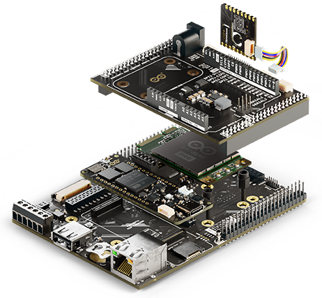</img>

#### Portenta H7 (SKU: ABX00042)

The Portenta H7 is a dual-core microcontroller board powered by the STMicroelectronics® STM32H747XI, featuring a 32-bit Arm® Cortex®-M7 running at 480 MHz and a Cortex®-M4 at 240 MHz. It includes advanced graphics capabilities and operates within an industrial temperature range (-40 °C to 85 °C).

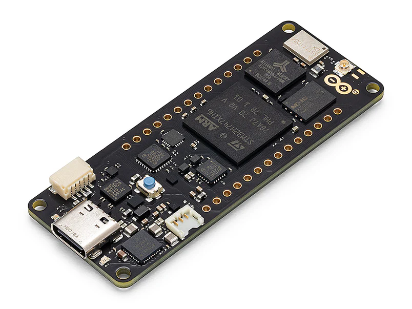</img>

Below is a summary of the most important specifications of the Portenta H7 board:

| **Feature**                | **Specification**                                                                         |
|----------------------------|-------------------------------------------------------------------------------------------|
| **Microcontroller**        | STMicroelectronics® STM32H747XI Dual 32-bit Arm® Cortex®-M7 and Cortex®-M4                |
| **USB Connector**          | USB-C®                                                                                    |
| **Digital I/O Pins**       | 78 (High-Density Pins)                                                                    |
| **Analog Input Pins**      | 8 (High-Density Pins)                                                                     |
| **PWM Pins**               | 10 (High-Density Pins)                                                                    |
| **Wireless Connectivity**  | Wi-Fi® 2.4 GHz 802.11 b/g/n, Bluetooth® 4.1 (Murata® LBEE5KL1DX)                          |
| **Ethernet Connectivity**  | RMII 10/100 Mbps (LAN8742AI)                                                              |
| **Secure Element**         | NXP® SE050C2 and Microchip® ATECC608                                                      |
| **Clock Speed**            | 480 MHz (M7 core), 240 MHz (M4 core)                                                      |
| **Memory**                 | 2 MB Flash, 1 MB RAM (internal); 16 MB NOR Flash, 8 MB SDRAM (external)                   |
| **Board Dimensions**       | 66.04 mm x 25.40 mm                                                                       |

  

    For detailed information about the Portenta H7 board, please refer to its corresponding documentation available on Arduino Docs:
    <a href="https://docs.arduino.cc/hardware/portenta-h7/" target="_blank" style="color: #0056b3; text-decoration: underline;">
      Portenta H7 Official Documentation [8]
    </a>
  

#### Nicla Vision (SKU: ABX00051)

The Nicla Vision is a compact and powerful microcontroller board designed for edge AI and vision-based applications. It combines a high-performance dual-core STM32H747AII6 microcontroller with an onboard 2MP color camera, making it ideal for projects involving image processing, object recognition and machine vision at the edge.
 

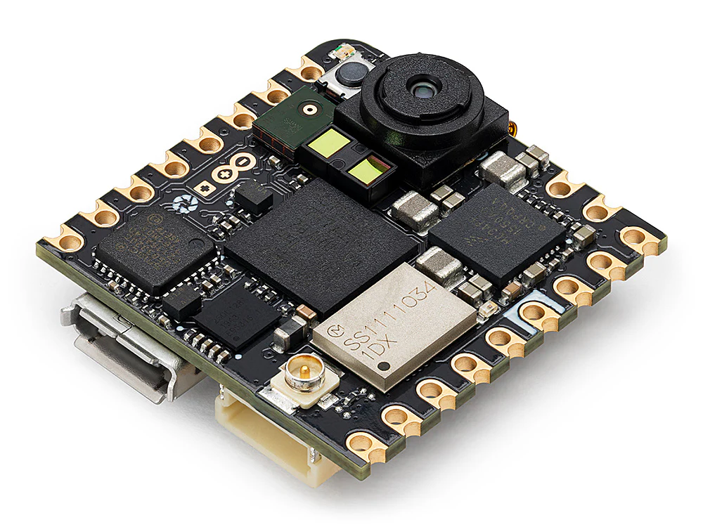</img>

Below is a summary of the most important specifications of the Nicla Vision board:

| **Feature**               | **Specification**                                                                                |
|---------------------------|--------------------------------------------------------------------------------------------------|
| **Microcontroller**       | STMicroelectronics® STM32H747AII6 Dual Arm® Cortex® M7/M4                                        |
| **USB Connector**         | Micro-USB                                                                                        |
| **Digital I/O Pins**      | 10                                                                                               |
| **Analog Input Pins**     | 3                                                                                                |
| **PWM Pins**              | 10                                                                                               |
| **Wireless Connectivity** | Wi-Fi®/Bluetooth® Low Energy 4.2 (Murata 1DX - LBEE5KL1DX-883)                                   |
| **Onboard Sensors**       | 2 MP Color Camera, LSM6DSOX (IMU), VL53L1CBV0FY/1 (Time-Of-Flight sensor), MP34DT05 (microphone) |
| **Clock Speed**           | M7 core up to 480 MHz, M4 core up to 240 MHz                                                     |
| **Memory**                | 2 MB Flash, 1 MB RAM (internal); 16 MB QSPI Flash (external)                                     |
| **Onboard Interfaces**    | SPI (x1), I2C (x1), UART (x1)                                                                    |
| **Dimensions**            | 22.86 mm x 22.86 mm                                                                              |

  

    For detailed information about the Nicla Vision board, please refer to its corresponding documentation available on Arduino Docs:
    <a href="https://docs.arduino.cc/hardware/nicla-vision/" target="_blank" style="color: #0056b3; text-decoration: underline;">
      Nicla Vision Official Documentation [9]
    </a>
  

#### Nicla Sense Env (SKU: ABX00089)

The Nicla Sense Env is a compact and efficient board designed to integrate advanced environmental sensing capabilities into your projects. It combines three state-of-the-art sensors from Renesas®, providing precise measurements of temperature, humidity and air quality for both indoor and outdoor environments. This board is ideal for applications in climate control systems, air quality monitoring and environmental data collection.

 

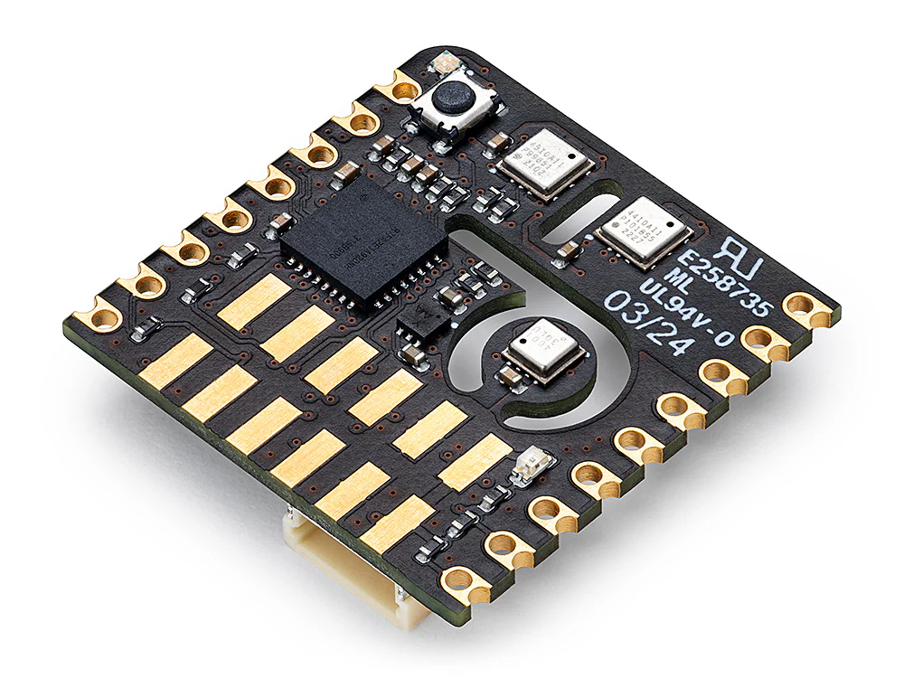</img>

Below is a summary of the most important specifications of the Nicla Sense Env board:

| **Feature**               | **Specification**                                                                                                     |
|---------------------------|-----------------------------------------------------------------------------------------------------------------------|
| **Dimensions**            | 22.86 mm x 22.86 mm                                                                                                   |
| **Weight**                | 2 g                                                                                                                   |
| **Operating Voltage**     | +3.3 VDC                                                                                                               |
| **Microcontroller**       | Renesas® RA2E1, 48 MHz Arm® Cortex®-M23 (not user-accessible)                                                         |
| **Onboard Sensors**       | HS4001 (temperature and humidity sensor), ZMOD4410 (indoor air quality sensor), ZMOD4510 (outdoor air quality sensor) |
| **Connectivity**          | Onboard ESLOV connector                                                                                               |
| **Operating Temperature** | -40 °C to +85 °C                                                                                                      |

  

    For detailed information about the Nicla Sense Env board, please refer to its corresponding documentation available on Arduino Docs:
    <a href="https://docs.arduino.cc/hardware/nicla-sense-env/" target="_blank" style="color: #0056b3; text-decoration: underline;">
      Nicla Sense Env Official Documentation [10]
    </a>
  

#### Portenta Mid Carrier (SKU: ASX00055)

The Portenta Mid Carrier expands connectivity options for Portenta family boards, including Ethernet, USB-A, mPCIe, CAN, MicroSD and 4G. It also features JTAG pins for debugging and supports I2C, SPI, PWM, digital and analog I/Os.
 

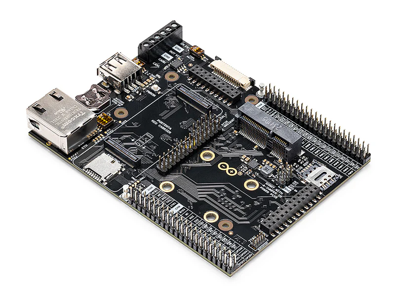</img>

Below is a summary of the most important specifications of the Portenta Mid Carrier:

| **Feature**                  | **Specification**                                                                                                                            |
|------------------------------|----------------------------------------------------------------------------------------------------------------------------------------------|
| **Compatible Boards**        | Portenta X8, Portenta H7 (except MIPI Camera), Portenta C33 (except MIPI Camera)                                                             |
| **Camera Interfaces**        | MIPI Connector (x1), Arducam Connector (x1), USB-A (x1)                                                                                      |
| **Display Interface**        | DSI (x1)                                                                                                                                     |
| **Communication Interfaces** | 4G (mPCIe, x1), Ethernet (x1), SPI (x2), I2C (x3), UART (x4), CAN FD (x2, one without transceiver), I2S (x1), SAI (x1), PDM (x1), SPDIF (x1) |
| **User Interface**           | Power On Push Button (x1)                                                                                                                    |
| **Storage**                  | MicroSD card slot (x1)                                                                                                                       |
| **Hardware Debugging**       | JTAG/SWD                                                                                                                                     |
| **Power Supply**             | Board operating voltage (VIN): +5 VDC; Maximum current provided: 2 A                                                                         |
| **Dimensions**               | 114 mm x 86.5 mm                                                                                                                             |

  

    For detailed information about the Portenta Mid Carrier, please refer to its corresponding documentation available on Arduino Docs:
    <a href="https://docs.arduino.cc/hardware/portenta-mid-carrier/" target="_blank" style="color: #0056b3; text-decoration: underline;">
      Portenta Mid Carrier Official Documentation [11]
    </a>
  

#### Portenta Mid Carrier Proto Shield (SKU: ASX00072)

The Portenta Mid Carrier Proto Shield is a versatile expansion board designed to enhance prototyping capabilities within the Arduino ecosystem. It seamlessly integrates with Portenta family boards, Nicla modules, Modulino® devices and Arduino UNO shields, providing a robust and accessible development experience for both beginners and advanced users.

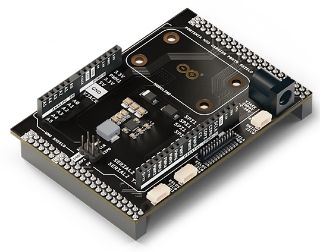</img>

Below is a summary of the most important specifications of the Portenta Mid Carrier Proto Shield:

| **Feature**               | **Specification**                                                                                                                                                                                                 |
|---------------------------|-------------------------------------------------------------------------------------------------------------------------------------------------------------------------------------------------------------------|
| **Compatibility**         | Portenta family boards, Nicla modules, Modulino® nodes and Arduino UNO shields                                                                                                                                          |
| **Connectors**            | 44-pin headers for the Portenta Mid Carrier interface (x2), ESLOV connectors (x2), QWIIC connector (x1), Arduino UNO shields headers (x2), dedicated mechanical interfaces for Nicla boards and Modulino® modules |
| **Operating Voltage**     | +7-30 VDC (via dedicated power jack)                                                                                                                                                                              |
| **Operating Temperature** | -40 °C to +85 °C                                                                                                                                                                                                  |
| **Dimensions**            | 61.28 mm x 86.5 mm                                                                                                                                                                                                |

  

    For detailed information about the Portenta Mid Carrier Proto Shield, please refer to its official documentation available on Arduino Docs:
    <a href="https://docs.arduino.cc/hardware/portenta-mid-carrier-proto-shield/" target="_blank" style="color: #0056b3; text-decoration: underline;">
      Portenta Mid Carrier Proto Shield Official Documentation [12]
    </a>
  

#### Arduino Pro 4G GNSS Module Global (SKU: TPX00200)

Designed in the widely used Mini PCI Express (mPCIe) format, this module provides global LTE Cat.4 connectivity, 4G support and GNSS capabilities.

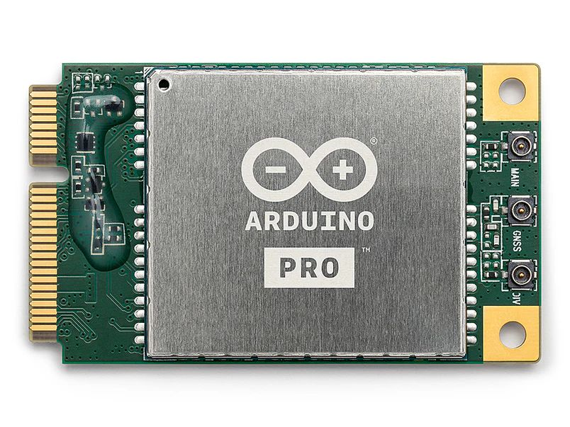</img>

Below is a summary of the most important specifications of the Arduino Pro 4G GNSS Module Global:

| **Feature**               | **Specification**                                                                             |
|---------------------------|-----------------------------------------------------------------------------------------------|
| **Module Format**         | Mini PCI Express (mPCIe), PCI Express Mini Card 1.2 Standard Interface                        |
| **Cellular Connectivity** | LTE Cat.4 with 2G/3G fallback                                                                 |
| **GNSS**                  | GPS, GLONASS, BeiDou, Galileo, QZSS (Protocol: NMEA 0180, Update Rate: 1 Hz)                  |
| **LTE Characteristics**   | RF Bandwidth: 1.4, 3, 5, 10, 15, 20 MHz; Download: 150 Mbps; Upload: 50 Mbps                  |
| **UMTS Characteristics**  | DC-HSDPA: 42 Mbps (Download); HSUPA: 5.76 Mbps (Upload); WCDMA: 384 kbps                      |
| **GSM Characteristics**   | EDGE: 296 kbps (Download), 236.8 kbps (Upload); GPRS: 107 kbps (Download), 85.6 kbps (Upload) |
| **Antenna Connectors**    | Main, diversity and GNSS antenna receptacles                                                  |
| **Power Supply**          | +3.3 VDC                                                                                      |
| **Interfaces**            | USB, UART, PCM/I2C                                                                            |
| **Certifications**        | CE, ROHS, REACH, UKCA, FCC, IC                                                                |
| **Dimensions**            | 30 mm x 51 mm                                                                                 |
| **Temperature Range**     | Operating: -35 °C to +75 °C; Extended: -40 °C to +80 °C; Storage: -40 °C to +90 °C            |

  

    For detailed information about the Arduino Pro 4G GNSS Module Global, please refer to its corresponding documentation available on Arduino Docs:
    <a href="https://docs.arduino.cc/hardware/pro-4g-module/" target="_blank" style="color: #0056b3; text-decoration: underline;">
      Arduino Pro 4G GNSS Module Official Documentation [13]
    </a>
  

### Kit Included Accessories

- +24 VDC/1A power supply (x1) 
- M2.5 nut (x2)
- M2.5 screw (x2)
- M2.5 washer (x2)
- M2.5 x 7 spacer (x2)
- QWIIC cable (x7)
- USB-A to USB-C® cable (x1)
- USB-A to Micro USB cable (x1)
- Arduino Pro 4G Module antennas kit (SKU: TPX00219) (x1)

### Kit Related Products

- Arduino X8 (SKU:ABX00074)
- Arduino Nicla Voice (SKU:ABX00061)
- Arduino Nicla Sense ME (SKU: ABX00050)
- Arduino Portenta C33 (SKU: ABX00049)

## Ratings

### Recommended Operating Conditions

The table below provides a comprehensive guideline for the optimal use of the Arduino Portenta Proto Kit VE, outlining typical operating conditions and design limits. The operating conditions of the Portenta Proto Kit VE are largely a function based on its component's specifications.

|                **Parameter**               |    **Symbol**   | **Min** | **Typ** | **Max** | **Unit** |
|:------------------------------------------:|:---------------:|:-------:|:-------:|:-------:|:--------:|
| Input Voltage of the Power Jack Connector¹ | VPJC |   7.0   |    -    |    30   |     V    |
|           Operating Temperature²           |  TO  |   -40   |    -    |    85   |    °C    |

1 Onboard power jack connector of the Portenta Mid Carrier Proto Shield.
2 The operating temperature represents the range for the entire kit and not just an individual component.

<strong>Note:</strong> While the kit can be powered through different pins and connectors, the recommended method is to use the power jack connector of the Portenta Mid Carrier Proto Shield. Any alternative power options should be carefully evaluated by consulting the individual power specifications of each component to avoid potential damage.

## Kit Power Supply

The Arduino Portenta Proto Kit VE can be powered through one of the following recommended methods:

- 
<strong>Portenta Mid Carrier Proto Shield onboard power jack</strong>: Provides a dedicated connection to power the kit using a +7 to 30 VDC input. The kit includes a compatible +24 VDC/1A power supply intended to be used with this power jack.

- 
<strong>USB-C® connector on the Portenta H7 board</strong>: Allows powering the kit with +5 VDC through the Portenta H7's USB-C® port or the terminal pins on the Portenta Mid Carrier.

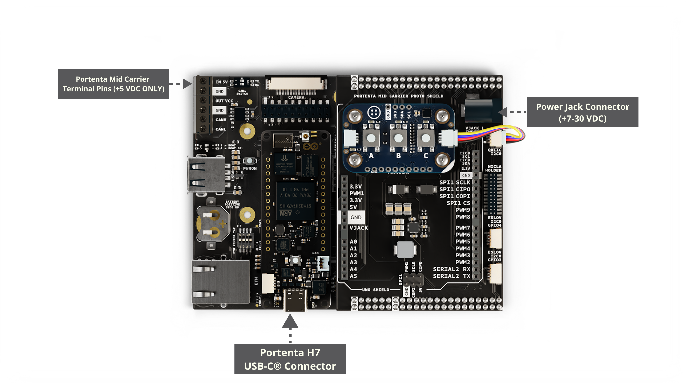

<strong>Tip:</strong> To ensure reliable performance, always prioritize using the dedicated power jack on the Portenta Mid Carrier Proto Shield and the kit's provided power supply for configurations requiring higher power stability.

<strong>Safety Note:</strong> Always disconnect power before making hardware changes to the kit. Ensure that power specifications are within the recommended limits to avoid damage to components.

## Device Operation

### Getting Started - IDE

If you want to program your Arduino Portenta Proto Kit VE offline, install the Arduino Desktop IDE <strong>[1]</strong>. To connect the Portenta H7 board to your computer, you will need a USB-C® cable. Additionally, to program or interact with the Nicla Vision board, ensure you have a Micro USB cable compatible with the board.

### Getting Started - Arduino Cloud Editor

All components of the Portenta Proto Kit VE work seamlessly on the Arduino Cloud Editor <strong>[2]</strong> by installing a simple plugin. The Arduino Cloud Editor is hosted online, ensuring it is always up-to-date with the latest features and support for all boards and devices. Follow <strong>[3]</strong> to start coding in the browser and upload your sketches onto the Portenta H7 board or other components.

### Getting Started - Arduino Cloud

The Portenta Proto Kit VE is fully supported on Arduino Cloud, enabling you to log, graph, and analyze sensor data, trigger events and automate processes for industrial, business, or smart home applications via the Portenta H7 board. Take a look at the official documentation <strong>[3]</strong> to learn more about how to integrate the kit into your IoT projects.

### Sample Sketches

Sample sketches for the Portenta Proto Kit VE can be found either in the “Examples” menu in the Arduino IDE or the “Portenta Proto Kit VE Documentation” section of Arduino documentation <strong>[4]</strong>. These examples include basic and advanced applications showcasing motion and environmental monitoring capabilities.

### Online Resources

Now that you have gone through the basics of what you can do with the Portenta Proto Kit VE, you can explore the endless possibilities it provides by checking exciting projects on Arduino Project Hub <strong>[5]</strong>, the Arduino Library Reference <strong>[6]</strong> and the ACE-220 online course <strong>[7]</strong>. The Enterprise Prototyping with Portenta Proto Kit ME (ACE-220) course is a resource designed to help you master prototyping in embedded electronics and IoT. Gain hands-on experience with the kit and accelerate your journey from concept to innovation by building functional prototypes tailored for industrial and IoT applications.

## Mechanical Information

The Arduino Portenta Proto Kit VE offers significant mechanical flexibility, supporting multiple configurations based on the combination of components used. This section provides the main dimensions of one possible configuration for reference. For detailed mechanical specifications of each individual component, please consult the corresponding documentation available on Arduino Docs.

### Kit Dimensions

The figures below show the main dimensions of the kit in a stacked configuration that includes the Portenta H7 board, the Portenta Mid Carrier, the Portenta Mid Carrier Proto Shield, the Arduino Pro 4G Module, one Modulino® node (Pixels) and the Nicla Vision board. While the Nicla Sense Env is part of the kit, it is not physically stacked with these components. Instead, it connects to the system via an ESLOV cable, whose length may vary depending on the user's setup. As a result, the Nicla Sense Env and its connection are not represented in this stacked configuration. All dimensions are in millimeters (mm).

- 
<strong>Top View</strong>: Displays the width and length of the stacked components configuration of the kit.

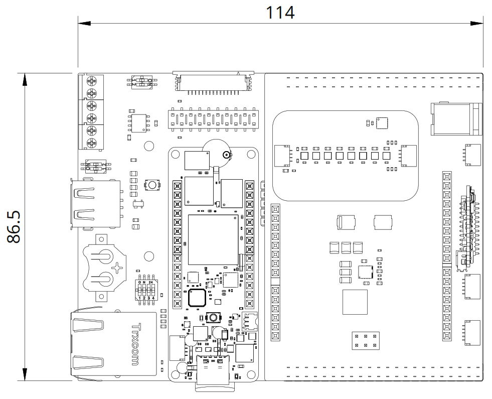

- 
<strong>Side View</strong>: Displays the height of the stacked components configuration of the kit.

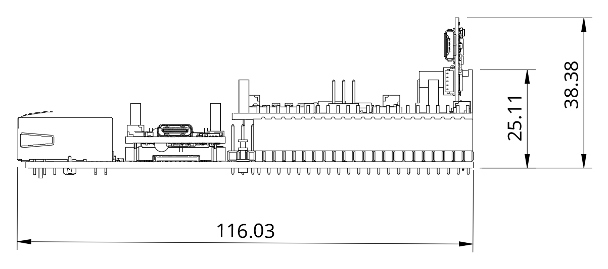

## Product Compliance

The Arduino Portenta Proto Kit VE consists of multiple individual Arduino products, each of which complies with specific regulations and certifications. For detailed product compliance information, please refer to the corresponding datasheets of each component included in the kit:

- [Portenta H7 Documentation](https://docs.arduino.cc/hardware/portenta-h7/) **[8]**
- [Nicla Vision Documentation](https://docs.arduino.cc/hardware/nicla-vision/) **[9]**
- [Nicla Sense Env Documentation](https://docs.arduino.cc/hardware/nicla-sense-env/) **[10]**
- [Portenta Mid Carrier Documentation](https://docs.arduino.cc/hardware/portenta-mid-carrier/) **[11]**
- [Portenta Mid Carrier Proto Shield Documentation](https://docs.arduino.cc/hardware/portenta-mid-carrier-proto-shield/) **[12]**
- [Arduino Pro 4G Module Documentation](https://docs.arduino.cc/hardware/pro-4g-module/) **[13]**

## FCC Caution

The components of the Arduino Portenta Proto Kit ME are subject to individual FCC regulations. Please refer to the FCC documentation linked in each Arduino component's datasheet for specific compliance details:

- [Portenta H7 Documentation](https://docs.arduino.cc/hardware/portenta-h7/) **[8]**
- [Nicla Vision Documentation](https://docs.arduino.cc/hardware/nicla-vision/) **[9]**
- [Portenta Mid Carrier Documentation](https://docs.arduino.cc/hardware/portenta-mid-carrier/) **[11]**
- [Arduino Pro 4G Module Documentation](https://docs.arduino.cc/hardware/pro-4g-module/) **[13]**

## Company Information

| **Company name** |              **Arduino S.r.l.**              |
|:----------------:|:--------------------------------------------:|
| Company address  | Via Andrea Appiani, 25 - 20900 Monza (Italy) |

## Reference Documentation

| **No.** |                  **Reference**                  | **Link**                                                            |
|:-------:|:-----------------------------------------------:|---------------------------------------------------------------------|
|    1    | Arduino IDE (Desktop)                           | https://www.arduino.cc/en/software                                  |
|    2    | Arduino Cloud Editor                            | https://create.arduino.cc/editor                                    |
|    3    | Arduino Cloud - Getting Started                 | https://docs.arduino.cc/arduino-cloud/guides/overview/              |
|    4    | Portenta Proto Kit ME Documentation             | https://docs.arduino.cc/hardware/portenta-proto-kit-me/             |
|    5    | Arduino Project Hub                             | https://create.arduino.cc/projecthub                                |
|    6    | Arduino Library Reference                       | https://docs.arduino.cc/language-reference/                         |
|    7    | ACE-220 Online Course                           | https://academy.arduino.cc/courses/ace-220                          |
|    8    | Portenta H7 Documentation                       | https://docs.arduino.cc/hardware/portenta-h7/                       |
|    9    | Nicla Vision Documentation                      | https://docs.arduino.cc/hardware/nicla-vision/                      |
|    10   | Nicla Sense Env Documentation                   | https://docs.arduino.cc/hardware/nicla-sense-env/                   |
|    11   | Portenta Mid Carrier Documentation              | https://docs.arduino.cc/hardware/portenta-mid-carrier/              |
|    12   | Portenta Mid Carrier Proto Shield Documentation | https://docs.arduino.cc/hardware/portenta-mid-carrier-proto-shield/ |
|    13   | Arduino Pro 4G Module Documentation             | https://docs.arduino.cc/hardware/pro-4g-module/                     |

## Document Revision History

|  **Date**  | **Revision** |                      **Changes**                     |
|:----------:|:------------:|:----------------------------------------------------:|
| 25/02/2025 |       2      | Portenta Mid Carrier Proto Shield information update |
| 12/02/2025 |       1      |                     First release                    |
