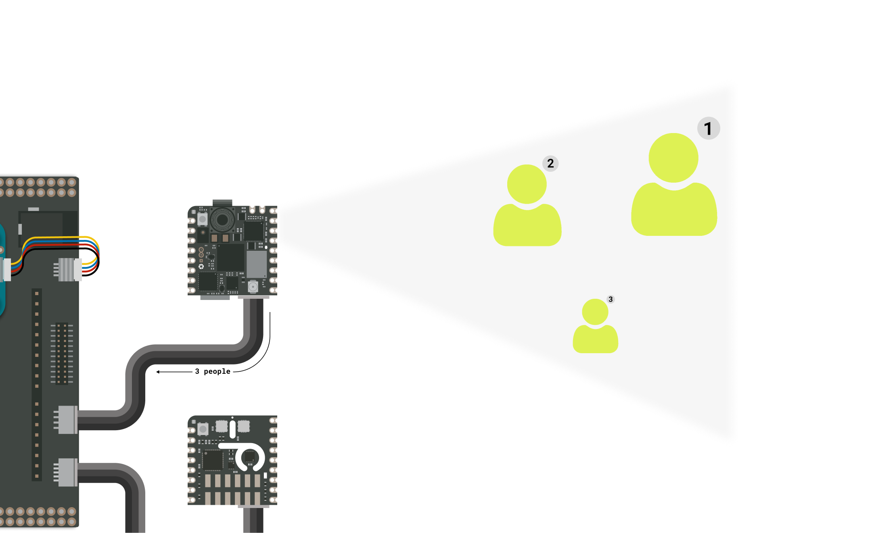

## Introduction

Air pollution is an often overlooked threat that exists even in the places we feel safest, from our homes to our workplaces. Pollutants like CO₂ and volatile organic compounds (TVOC) silently threaten our health, representing a determining factor for our quality of life. 

This application note describes building an air quality monitor and occupancy tracking system using machine vision for indoor environments designed for use in an elevator.


The monitoring system will measure the elevator's temperature, relative humidity, indoor air quality (IAQ), estimated CO₂ and total volatile organic compounds (TVOC) while counting the people inside the elevator. All this information will be forwarded to the Arduino Cloud for further visualization and ongoing monitoring. The system will provide real-time visual feedback of the condition inside the elevator to warn people of harmful air quality.

## Goals

The project showcased in this application note has the following objectives:

- Monitor the air quality and environmental conditions within the elevator.
- Count people inside the elevator using Machine Vision.
- Provide real-time visual feedback on the elevator conditions using Modulino® Pixels.
- Share all collected data to the Arduino Cloud for remote monitoring.

## Hardware and Software Requirements


### Hardware Requirements

This project is meant to be developed with the **Portenta Proto Kit** that includes the following products among others:

- [Nicla Sense Env](https://store.arduino.cc/products/nicla-sense-env) (x1)
- [Nicla Vision](https://store.arduino.cc/products/nicla-vision) (x1)
- [Portenta Mid Carrier](https://store.arduino.cc/products/portenta-mid-carrier) (x1)
- [Portenta H7](https://store.arduino.cc/products/portenta-h7) (x1)
- Modulino Pixels (x1)
- Portenta Mid Carrier Proto Shield (x1)
- [USB-C® cable](https://store.arduino.cc/products/usb-cable2in1-type-c) (x1)
- Wi-Fi® W.FL antenna (x1)
- ESLOV cable (x2)
- Qwiic cable (x1)

### Software Requirements

- [Arduino IDE 2.0+](https://www.arduino.cc/en/software) or [Arduino Web Editor](https://create.arduino.cc/editor)
- [OpenMV IDE](https://openmv.io/pages/download)
- [Arduino_NiclaSenseEnv library](https://github.com/arduino-libraries/Arduino_NiclaSenseEnv)
- [Arduino Portenta Boards core](https://github.com/arduino/ArduinoCore-mbed) (required to work with the Portenta H7 board)
- [Arduino Cloud](https://create.arduino.cc/iot/things). If you do not have an account, create one for free [here](https://cloud.arduino.cc/).

### Complete Project Sketch


The complete project sketches can be downloaded here:

- [Portenta H7 code](assets/Smart_elevator_Portenta_h7.zip)
- [Nicla Vision code](assets/People_Count_Nicla_Vision.zip)

## Smart Elevator Monitoring System Setup

The electrical connections for the project are outlined in the diagram below:


This diagram shows how the components are connected. 

- The Portenta H7 is attached to the Portenta Mid Carrier using the High-Density connectors.
- The Mid Carrier Proto Shield is stacked onto the Portenta Mid Carrier via breakout connectors.
- The Modulino Pixels is wired to the Portenta Mid Carrier using the Qwiic cable and secured with the included screws and nuts.
- The Nicla Vision and the Nicla Sense Env are connected to the Mid Carrier Proto Shield using ESLOV cables.

### Powering Options

The project can be powered using the terminal block on the Portenta Mid Carrier, the USB-C connector on the Portenta H7 or the barrel jack on the Mid Carrier Proto Shield.


## Smart Elevator Monitoring System Overview

The elevator monitoring system integrates sensor data collection, machine vision, live user feedback and cloud connectivity via the Portenta H7’s Wi-Fi® connection.

The **Portenta H7** is responsible for the Nicla Sense Env sensor readings, receiving occupant counts from the Nicla Vision through I2C, showing air quality status on the Modulino Pixels and communicating with the Cloud.

The **Nicla Vision** is the project's second system-on-module (SoM) dedicated exclusively to detecting faces in the elevator, counting them and reporting the count to the Portenta H7.

The **Nicla Sense Env** is a sensor shield that must be controlled by a host, in this case by the Portenta H7, and houses several environment sensors.

### Indoor Air Quality Sensor

A key feature of this project is monitoring environmental variables, which is made possible by the **ZMOD4410** indoor air quality sensor featured within the **Nicla Sense Env**.

The **ZMOD4410** is a gas sensor module designed to detect total volatile organic compounds (TVOC), estimate CO₂ and monitor indoor air quality (IAQ) with ease of implementation.

The sensor can provide air quality data in three ways:

- **Renesas IAQ Rating**: 0 - 5 (being 0 the cleaner and healthier air)
- **Interpreted Air Quality**: Qualitative ratings, as "Very Good", "Good", "Medium", "Poor" and "Bad"
- **Relative Air Quality**: 0 - 500 (being 0 the cleaner and healthier air)
  
For this project, we will use the **Relative Air Quality** scale, as it offers an accurate and sensitive range to measure variations in air quality. Refer to the table below for reference:


To complement the environment monitoring, we will also use the **HS4001** temperature and humidity sensor of the Nicla Sense Env.

### Visual Air Quality Feedback

The system features real-time visual feedback to warn the occupants of the elevator so they know the current air quality status at any time and take the right preventive measures.

Using the Modulino Pixels, the system will display the colors corresponding to the Air Quality Index levels shown in the table above.


### Machine Vision for People Counting

The Nicla Vision will use a built-in FOMO (Faster Objects, More Objects) model for face detection. With a simple Python script, it can report the face count within a single frame covering the entire elevator via I2C.


### Portenta H7 Code

Let's go through some important code sections to make this application fully operational, starting with the required libraries:

- `Arduino_NiclaSenseEnv.h` provides support for collecting data from the Nicla Sense Env sensor.
- `Wire.h` enables I2C communication with the Nicla Sense Env and Nicla Vision boards.
- `modulino.h` provides support for controlling the Modulino Pixels.
  
There is a header included in the project code for the Arduino Cloud configuration:

- `thingProperties.h` includes the Wi-Fi® credentials and Arduino Cloud configuration.
  
This header includes two other libraries necessary for cloud communication, which are:

- `ArduinoIoTCloud.h` enables Arduino Cloud integration. Search for *ArduinoIoTCloud* in the Library Manager to install it.
- `Arduino_ConnectionHandler.h` manages the board's internet connectivity. Search for *Arduino_ConnectionHandler* in the Library Manager to install it.
  
```arduino
// Include necessary libraries for Nicla Sense Env sensors and Arduino Cloud
#include "Arduino_NiclaSenseEnv.h"

// Automatically generated by Arduino Cloud for property synchronization
#include "thingProperties.h"

// Include support for the Modulino Pixels 
#include <Modulino.h>

// Include Wire library for I2C communication
#include <Wire.h>

// Set time interval (in milliseconds) for sensor readings (10 seconds)
static const uint32_t READ_INTERVAL = 10000;
uint32_t lastReadTime = 0;

// Global Parameters
byte people = 0;  // people count variable.

// Sensor object for Nicla Sense Env data collection
NiclaSenseEnv device;

// Modulino Pixels object
ModulinoPixels leds;

// The Nicla Vision I2C address
#define I2C_ADDR 0x35
```
In the `setup()` function, a variety of peripherals are initialized, including:

- Serial communication
- I2C communication
- Arduino Cloud properties
- Nicla Sense Env communication and sensor objects
- Modulino Pixels

```arduino
void setup() {
  // Initialize serial communication at 9600 baud rate
  Serial.begin(9600);

  // Short delay to wait for Serial Monitor to be ready
  delay(1500);

  Wire.begin();

  // Initialize Cloud properties and connect to Arduino IoT Cloud
  initProperties();
  ArduinoCloud.begin(ArduinoIoTPreferredConnection);

  // Debug information
  setDebugMessageLevel(2);
  ArduinoCloud.printDebugInfo();

  // Initialize Nicla Sense Env sensors
  if (device.begin()) {
    Serial.println("- Nicla Sense Env board connected!");

    auto temperatureSensor = device.temperatureHumiditySensor();
    auto airQualitySensor = device.indoorAirQualitySensor();

    // Set the sensor mode to indoor air quality
    airQualitySensor.setMode(IndoorAirQualitySensorMode::indoorAirQuality);

    // The ZMOD4410 can take a sample every 3 seconds in IAQ mode and requires 60 warm-up samples,
    // meaning the sensor will take about 3 minutes to fully warm-up before accurate readings can
    // be obtained. In this example, we allow 5 seconds for the sensor to start delivering data.

  } else {
    Serial.println("- ERROR: Nicla Sense Env device not found!");
  }

  Modulino.begin();
  leds.begin();
}
```

In the `loop()` function, the Nicla Sense Env sensors are read every 10 seconds, the people count is requested to the Nicla Vision and the Cloud connection is updated.

```arduino
void loop() {

  // Get the current time
  uint32_t currentTime = millis();

  // Read sensors every 10 seconds
  if (currentTime - lastReadTime >= READ_INTERVAL) {
    lastReadTime = currentTime;
    auto temperatureSensor = device.temperatureHumiditySensor();
    auto airQualitySensor = device.indoorAirQualitySensor();
    readSensors(temperatureSensor, airQualitySensor);
  }
  getPeopleCount(); // retrieve the people count from the Nicla Vision
  delay(100);
  // Update Arduino Cloud connection
  ArduinoCloud.update();
}
```

One of the main functions in the `loop()` is `readSensors()`, which uses the Nicla Sense Env API to read the following variables:

- Temperature (°C)
- Relative Humidity (%)
- CO₂ (ppm)
- Ethanol (ppm)
- TVOC (mg/m3)
- Relative Air Quality (IAQ)

We also control the Modulino Pixels color based on the IAQ and update the cloud variables.

The `getPeopleCount()` function creates an I2C request asking for the count of people detected by the Nicla Vision.

***You can download the complete example code for the Portenta H7 [here](assets/Smart_elevator_Portenta_h7.zip)***

### Nicla Vision Code

The people counting feature of the project is achieved by the Nicla Vision running a FOMO face detection model. 

For this feature, we are using the [OpenMV IDE](https://openmv.io/pages/download) for running MicroPython sketches that you can download from [here](https://openmv.io/pages/download).

Here’s a brief overview of how the code works, starting with the main loop of the script:

```python
if __name__ == "__main__":

    clock = time.clock()
    while True:
        clock.tick()

        img = sensor.snapshot()
        faces = analyze_image(img)

        green_led.on() if faces > 0 else green_led.off() # Turn on green LED when face is detected

        if(faces > 0):
            i2c.init(I2C.PERIPHERAL, addr=0x35) 
            print("Faces detected:", faces)
            buf[0] = faces
            i2c.send(buf)
        else:
            i2c.deinit() 
           
        now = ticks_ms()
```

In simple words, we are on an infinite loop taking pictures with the `sensor.snapshot()` function, which is then used as inputs for the face detection model using the `analyze_image()` function.

If faces are detected, the onboard green LED will light up and the count will be sent via I2C to the Portenta H7.

During the face detection process, several auxiliary functions filter unwanted results, including false positives. A brief explanation of these functions is listed below:

- `calculate_distance()`: it returns the distance between two rectangles bounding a possible face to avoid duplicates.
- `merge_rectangles()` and `merge_close_rectangles()`: Merges two or more close bounding rectangles into a single one if they are in proximity.
- `fomo_post_process()`: it returns the list of bounding boxes to be analyzed by the previously explained functions.

***You can download the complete example code for the Nicla Vision [here](assets/People_Count_Nicla_Vision.zip)***

If you want to test the Nicla Vision example code **standalone**, you must comment out the `i2c.send(buf)` line in the sketch, this is because it will show an error if it can't find the Portenta H7 on the I2C bus.

***For the Nicla Vision to run the sketch once is powered up you must put the code inside the `main.py` file in the file system.***

### Arduino Cloud Dashboard

By leveraging the Arduino Cloud, we can seamlessly integrate a simple yet powerful dashboard to monitor and visualize the system status in real-time:


Within the Arduino Cloud's dashboard, the system variables can be monitored with the following widgets:

- System variable gauge showing relative humidity.
- Numeric state widgets to show IAQ, temperature, CO₂, ethanol and TVOC readings.
- Advanced charts showing historical CO₂, ethanol, temperature and humidity records.
- A people occupancy chart displaying both historical data and the current count.

### Complete Project Sketch


The complete project sketches can be downloaded here:

- [Portenta H7 code](assets/Smart_elevator_Portenta_h7.zip)
- [Nicla Vision code](assets/People_Count_Nicla_Vision.zip)

## Conclusions

In this application note, we have learned how to implement an indoor air quality and occupancy monitoring system by transforming a conventional elevator into a smart, monitored space.

This application shows how Arduino's ecosystem simplifies the workflow for developing smart solutions to address real industrial needs. The Arduino PRO product line is a perfect fit for developing robust and reliable projects for the industry. We covered on-site sensor data sampling, machine vision, and real-time Cloud monitoring.

## Next Steps

Now that you know how to develop an indoor air quality and people counting system with the Portenta Proto Kit, it is time to continue exploring all the capabilities of the Arduino Pro environment. Integrate it with your professional setup and enhance it with powerful solutions.

You can take this solution even further by:

- Creating your own FOMO model using Edge Impulse to detect people particularly, rather than just faces.
- Adding a Modulino Buzzer to provide an alert if the elevator occupancy exceeds the limit or if air quality deteriorates.
- Integrating the Arduino 4G Module for deployments without Wi-Fi or Ethernet connectivity.