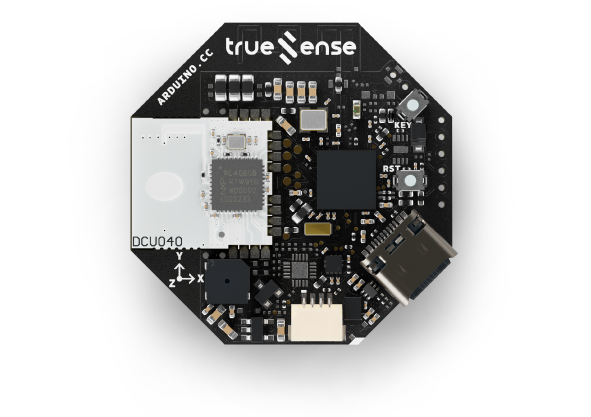
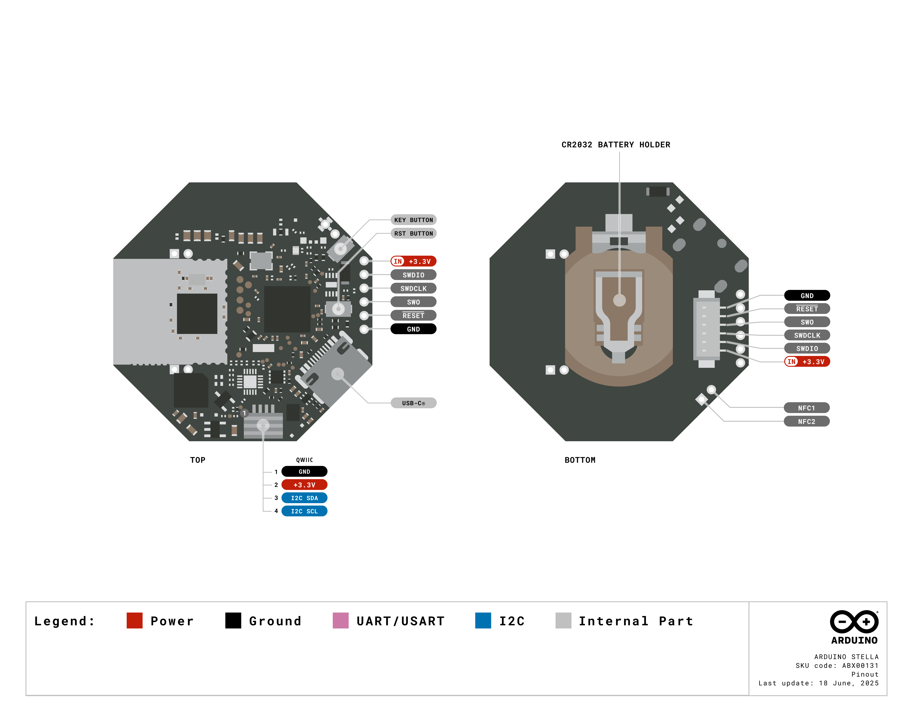
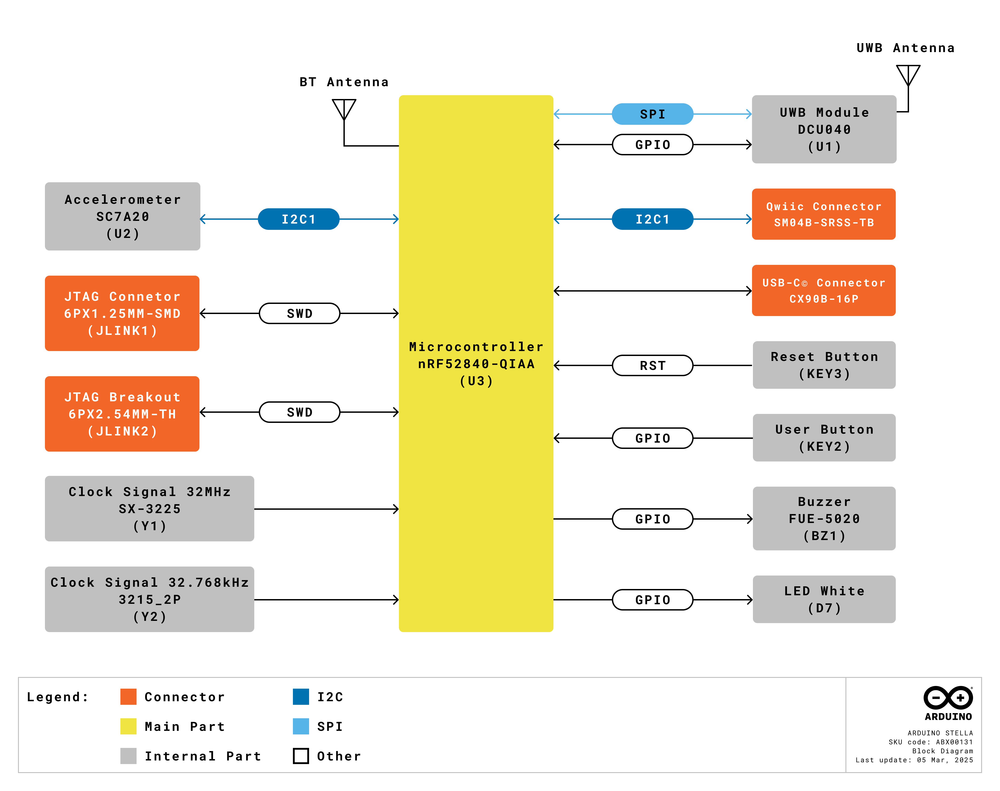
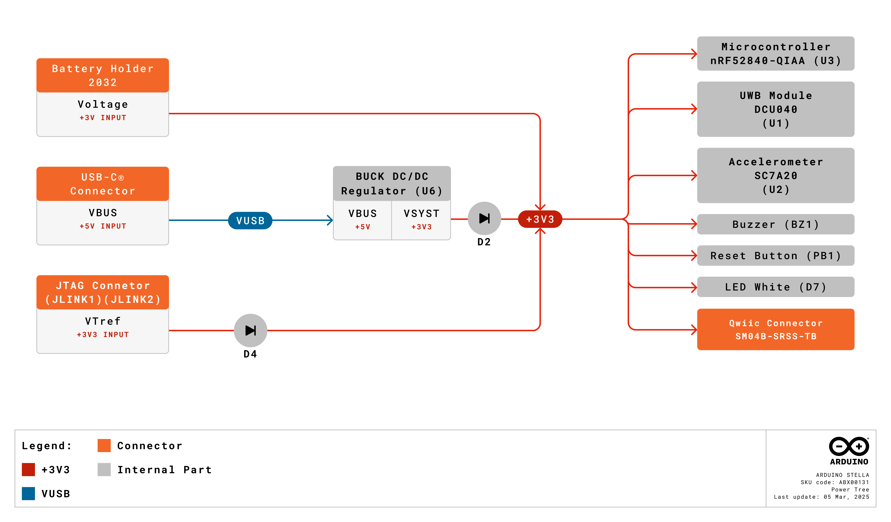
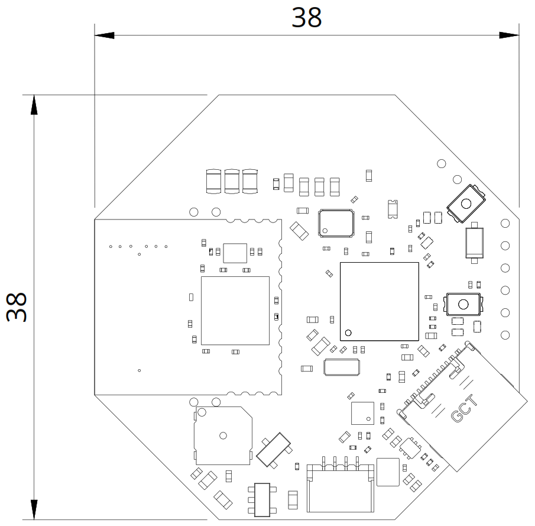
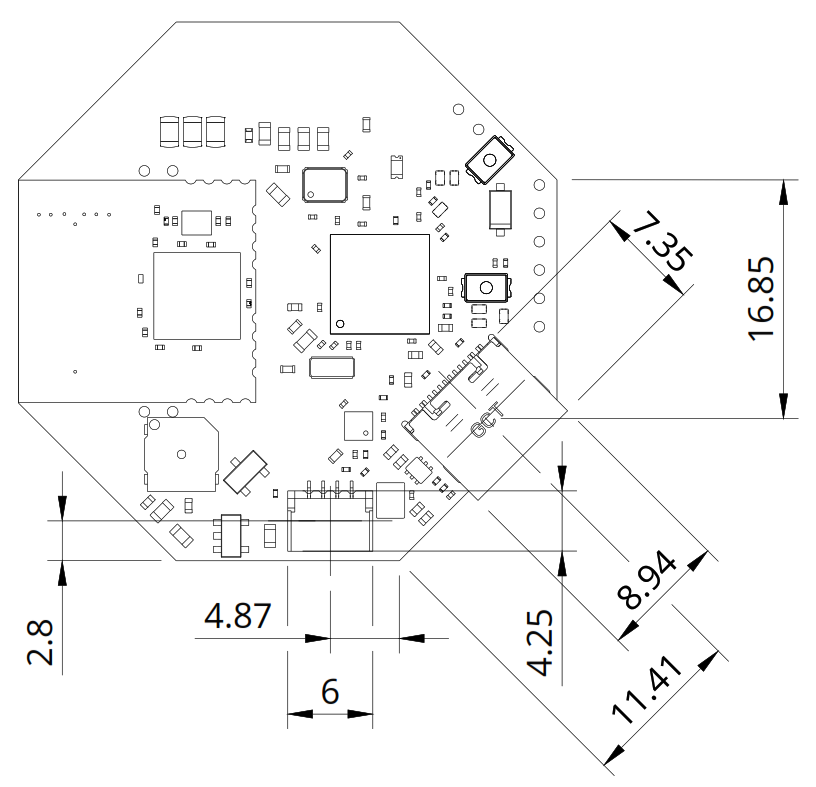
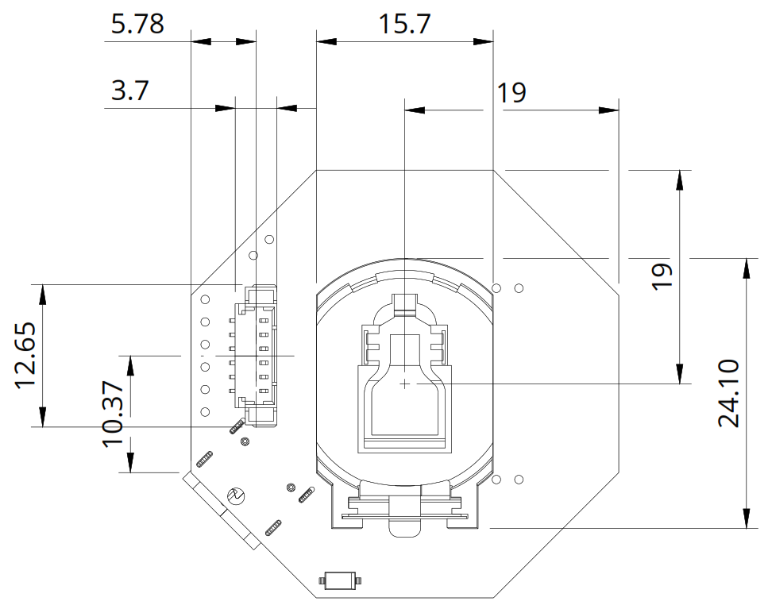

# Description

The Arduino Stella redefines location tracking with its advanced microcontroller, the nRF52840 from Nordic Semiconductor, and the DCU040 Ultra-Wide Band (UWB) module from Truesense. Tailored for modern tracking needs, the Stella excels in pinpointing warehouse assets, ensuring healthcare safety and automating smart buildings. Seamlessly integrating with the Portenta UWB Shield and UWB-enabled smartphones through the dedicated NXP® Trimension App, Apple's Nearby Interaction APIs or Android's UWB Jetpack library, the Stella delivers robust finder functionality, precise point-to-point triggering and comprehensive tracking capabilities for applications demanding reliable, real-time location data.

# Target Areas

High precision RTLS, industrial applications, finder for IoT, consumer applications, smart home applications

# CONTENTS

## Application Examples

The Arduino Stella is a versatile tool for implementing high-precision location tracking and monitoring solutions across various industries. Explore the possibilities of integrating Ultra-Wide Band (UWB) technology into your projects with the following application examples:

- **Asset tracking and management:** Optimize your inventory and resource tracking with the Stella, enabling real-time location monitoring for:
  - 
<strong>Warehouse management:</strong> Deploy the Stella tags throughout your warehouse to track high-value inventory, equipment and assets with centimeter-level precision, dramatically improving inventory accuracy and reducing search times.

  - 
<strong>Equipment monitoring:</strong> Attach the Stella to critical equipment in manufacturing environments to track location, monitor usage patterns and ensure proper utilization across facilities.

  - 
<strong>Retail inventory:</strong> Implement a real-time inventory system that provides accurate stock location data, reducing out-of-stock situations and improving customer satisfaction.

- **Healthcare applications:** Enhance patient safety and medical asset tracking with the Stella's precise location capabilities:
  - 
<strong>Medical equipment tracking:</strong> Monitor the real-time location of critical medical devices and equipment across hospital facilities, ensuring rapid access during emergencies and optimizing its use.

  - 
<strong>Patient monitoring:</strong> Create wearable tags for patients that provide precise location data within healthcare facilities, improving safety for vulnerable individuals and enabling rapid response to emergencies.

  - 
<strong>Staff workflow optimization:</strong> Analyze movement patterns of healthcare providers to identify inefficiencies and improve response times to patient needs.

- **Smart building automation:** Transform your building management systems with the Stella, providing location-aware functionality for:
  - 
<strong>Personalized environment control:</strong> Automatically adjust lighting, temperature and other environmental factors based on occupant location and preferences, improving comfort and energy efficiency.

  - 
<strong>Occupancy analytics:</strong> Gather precise data about space use, dwell times and movement patterns to optimize building layout and resource allocation.

  - 
<strong>Contactless access:</strong> Enable seamless, proximity-based access control that automatically unlocks doors or activates elevators as authorized personnel approach.

- **Consumer applications:** Create innovative user experiences with the Stella's UWB capabilities:
  - 
<strong>Item finding:</strong> Develop tag-based systems that allow users to precisely locate misplaced items through smartphone interactions, providing both distance and directional guidance.

  - 
<strong>Proximity-based triggers:</strong> Implement context-aware applications that automatically execute actions when specific tags come within a defined range, such as unlocking vehicles, activating smart home scenes or triggering notifications.

  - 
<strong>Interactive entertainment:</strong> Create location-based gaming experiences, augmented reality applications or interactive exhibits that respond to user movement with centimeter-level accuracy.

## Features

### General Specifications Overview

The Arduino Stella is a powerful microcontroller and Ultra-Wide Band (UWB) technology board designed for RTLS, tag and tracker applications. Based on the advanced nRF52840 microcontroller from Nordic Semiconductor, it meets the challenges of sophisticated applications that need protocol concurrency and a rich and varied set of peripherals and features.

Below is a summary of the board's key features.

| **Feature**      | **Description**                                                                                                       |
|------------------|-----------------------------------------------------------------------------------------------------------------------|
| Microcontroller  | Nordic Semiconductor nRF52840 Arm® Cortex®-M4 32-bit processor running at 64MHz                                       |
| Internal Memory  | 1 MB Flash and 256 kB RAM                                                                                             |
| Connectivity     | UWB CH5, CH9 and Bluetooth® 5.0                                                                                        |
| USB Connectivity | USB-C® port for power and data                                                                                        |
| Power Supply     | Various options: USB-C® port, single-cell CR2032 battery and external power supply connected through J-Link connector |
| Peripherals      | Buzzer x1, I2C (x1) on QWIIC connector, reset button (x1), user-programmable button (x1), user-programmable LED (x1)  |
| Debugging        | JTAG/SWD debug port                                                                                                   |
| Dimensions       | 38 mm x 38 mm                                                                                                         |

Below is a summary of the board's microcontroller features.

| **Feature**                | **Description**                                                                                     |
|----------------------------|-----------------------------------------------------------------------------------------------------|
| Microcontroller            | Nordic Semiconductor nRF52840 32-bit Arm® Cortex®-M4 CPU with floating point unit running at 64 MHz |
| Wireless Protocol          | Bluetooth® 5, IEEE 802.15.4-2006, 2.4 GHz transceiver                                               |
| Memory                     | 1 MB Flash, 256 kB RAM                                                                              |
| Security Features          | ARM TrustZone® CryptoCell cryptographic unit                                                        |
| Interfaces and Peripherals | UART, SPI, TWI, PDM, I2S, QSPI, PWM, 12-bit ADC, NFC-A, USB 2.0                                     |

Below is a summary of the board's UWB module's (DCU040) key features.

| **Feature**             | **Description**                                                                                                                       |
| ----------------------- | ------------------------------------------------------------------------------------------------------------------------------------- |
| Module                  | Truesense DCU040 (based on the NXP Trimension™ SR040 UWB IC, with power management, clock control, filters and peripheral components) |
| Ranging                 | 2-way ranging, achieving an accuracy of <±10 cm                                                                                       |
| Frequency Range         | 6.24–8.24 GHz                                                                                                                         |
| Max Output Power (EIRP) | 14.7 dBm                                                                                                                              |

Below is a summary of the board's accelerometer features.

| **Feature**        | **Description**                                                        |
| ------------------ | ---------------------------------------------------------------------- |
| Accelerometer      | 3-axis MEMS digital output accelerometer (SC7A20)                      |
| Scale Range        | ±2 G / ±4 G / ±8 G / ±16 G (user-selectable)                           |
| Detection Features | 6D/4D orientation, free-fall, single/double click and motion detection |
| Interrupt          | Programmable interrupt generator                                       |
| Self Test          | Embedded self test                                                     |
| Memory             | Embedded FIFO                                                          |
| Durability         | 10000 G (high shock survivability)                                     |
| Power              | Low power mode consumption (down to 2 µA)                              |

Below is a summary of the board's buzzer features.

| **Feature** | **Description**          |
|-------------|--------------------------|
| Model       | FUET-5020                |
| Frequency   | 4 kHz                    |
| Sound Level | 75 dB at 10 cm            |
| Dimensions  | 5.0 mm x 5.0 mm x 2.0 mm |

### Included Accessories

- No accessories are included

### Related Products

- Arduino® Portenta C33 (SKU: ABX00074)
- Arduino® Portenta UWB Shield (SKU: ASX00074)
- Arduino USB Type-C® Cable 2-in-1 (SKU: TPX00094)

## Ratings

### Recommended Operating Conditions

The table below provides a comprehensive guideline for the optimal use of the Arduino Stella, outlining typical operating conditions and design limits. The operating conditions of the Stella are largely a function based on its component's specifications.

|         **Parameter**        |     **Symbol**    | **Min** | **Typ** | **Max** | **Unit** |
|:----------------------------:|:-----------------:|:-------:|:-------:|:-------:|:--------:|
|   USB Supply Input Voltage   |  VUSB  |    -    |   5.0   |    -    |     V    |
| Battery Supply Input Voltage |  VBAT  |   2.0   |   3.0   |   3.3   |     V    |
|  J-link Supply Input Voltage | VJLINK |   3.0   |   3.3   |   3.6   |     V    |
|     Operating Temperature    |   TOP  |   -20   |    -    |    70   |    °C    |

### Current Consumption

The table below summarizes the power consumption of the Stella on different test cases. Notice that the operating current of the board will depend greatly on the application.

|           **Parameter**           |    **Symbol**   | **Min** | **Typ** | **Max** | **Unit** |
|:---------------------------------:|:---------------:|:-------:|:-------:|:-------:|:--------:|
| Normal Mode with BLE Advertising¹ | INM1 |    -    |    7    |    -    |    mA    |
|   Normal Mode with UWB Ranging²   | INM2 |    -    |   10.6  |    -    |    mA    |

1 BLE advertising, frequency is 10 Hz (100 ms). 2 UWB ranging, frequency is 5 Hz (200 ms). 

## Functional Overview

The core of the Arduino Stella is the nRF52840 microcontroller from Nordic Semiconductor. The board also contains several peripherals connected to its microcontroller.

### Pinout

The Stella connectors pinput is shown in the figure below.

### Block Diagram

An overview of the Arduino Stella high-level architecture is illustrated in the figure below.

### Power Supply

The Arduino Stella can be powered through one of these interfaces:

- **USB-C® port:** The Stella can be powered through the onboard USB-C® port.
- **+3 VDC battery:** Using the onboard CR2032 battery holder.
- **Onboard J-Link connector:** The Stella can also be powered through the board's J-Link connector.

The figure below shows the power options available on the Stella and illustrates the main system power architecture.

### I2C Ports

System integrators can use the Arduino Stella's QWIIC connectors to expand signals of the board to a custom-designed daughter or carrier board. The table below summarizes the I2C pins mapping on the QWIIC connector and the shared peripherals/resources. Please refer to the board's pinout for the board's QWIIC connector pinout.

| **Connector** | **Interface** |         **Pins**         | **Status¹** | **Shared Peripherals** |
|:-------------:|:-------------:|:------------------------:|:-----------:|:----------------------:|
|     QWIIC     |      I2C1     | P1.09 (SDA), P0.11 (SCL) |     Free    |            -           |

1Status column indicates the current status of the pins. "Free" means the pins are not in use by another resource or peripheral of the board and are available for usage, while "Shared" means the pins are used by one or several resources or peripherals of the board.

## Device Operation

### Getting Started - IDE

If you want to program your Arduino Stella while offline you need to install the Arduino® Desktop IDE <strong>[1]</strong>. To connect the Stella to your computer, you will need a USB-C® cable.

### Getting Started - Arduino Cloud Editor

All Arduino devices work out of the box on the Arduino Cloud Editor <strong>[2]</strong> by installing a simple plugin. The Arduino Cloud Editor is hosted online. Therefore, it will always be up-to-date with all the latest features and support for all boards and devices. Follow <strong>[3]</strong> to start coding on the browser and upload your sketches onto your device.

### Getting Started - Arduino Cloud

All Arduino IoT-enabled products are supported on Arduino Cloud, which allows you to log, graph, and analyze sensor data, trigger events, and automate your home or business. Take a look at the official documentation <strong>[3]</strong> to know more.

### Sample Sketches

Sample sketches for the Stella can be found either in the "Examples" menu in the Arduino IDE or the "Arduino Stella Documentation" section of Arduino documentation <strong>[4]</strong>.

### Online Resources

Now that you have gone through the basics of what you can do with the device, you can explore the endless possibilities it provides by checking exciting projects on Arduino Project Hub <strong>[5]</strong>, the Arduino Library Reference <strong>[6]</strong> and the Arduino online store <strong>[7]</strong>, where you will be able to complement your project with additional extensions, sensors and actuators.

## Mechanical Information

The Arduino Stella is a double-sided 38.0 mm x 38.0 mm board with a USB-C® port overhanging the top edge, a QWIIC connector on the top side of the board, a CR2032 battery connector and a J-Link connector on the bottom side of the board.

### Board Dimensions

The Stella board outline dimensions can be seen in the figure below.

### Board Connectors

The connectors of the Stella are placed on the top and bottom side of the board. The placement of the connectors in the top side of the board can be seen in the figure below.

The placement of the connectors in the bottom side of the board can be seen in the figure below.

## Certifications

### Certifications Summary

| **Certification** | **Status** |
|:-----------------:|:----------:|
|  CE/RED (Europe)  |     Yes    |
|     UKCA (UK)     |     Yes    |
|     FCC (USA)     |     Yes    |
|        RoHS       |     Yes    |
|       REACH       |     Yes    |
|        WEEE       |     Yes    |

### Declaration of Conformity CE DoC (EU)

We declare under our sole responsibility that the products above are in conformity with the essential requirements of the following EU Directives and therefore qualify for free movement within markets comprising the European Union (EU) and European Economic Area (EEA).

### Declaration of Conformity to EU RoHS & REACH 191 11/26/2018

Arduino boards are in compliance with Directive 2011/65/EU of the European Parliament and Directive 2015/863/EU of the Council of 4 June 2015 on the restriction of the use of certain hazardous substances in electrical and electronic equipment.

| **Substance**                          | **Maximum Limit (ppm)** |
| -------------------------------------- | ----------------------- |
| Lead (Pb)                              | 1000                    |
| Cadmium (Cd)                           | 100                     |
| Mercury (Hg)                           | 1000                    |
| Hexavalent Chromium (Cr6+)             | 1000                    |
| Poly Brominated Biphenyls (PBB)        | 1000                    |
| Poly Brominated Diphenyl ethers (PBDE) | 1000                    |
| Bis(2-Ethylhexyl) phthalate (DEHP)     | 1000                    |
| Benzyl butyl phthalate (BBP)           | 1000                    |
| Dibutyl phthalate (DBP)                | 1000                    |
| Diisobutyl phthalate (DIBP)            | 1000                    |

Exemptions: No exemptions are claimed.

Arduino boards are fully compliant with the related requirements of European Union Regulation (EC) 1907 /2006 concerning the Registration, Evaluation, Authorization and Restriction of Chemicals (REACH). We declare none of the SVHCs (https://echa.europa.eu/web/guest/candidate-list-table), the Candidate List of Substances of Very High Concern for authorization currently released by ECHA, is present in all products (and also package) in quantities totaling in a concentration equal or above 0.1%. To the best of our knowledge, we also declare that our products do not contain any of the substances listed on the "Authorization List" (Annex XIV of the REACH regulations) and Substances of Very High Concern (SVHC) in any significant amounts as specified by the Annex XVII of Candidate list published by ECHA (European Chemical Agency) 1907 /2006/EC.

### Conflict Minerals Declaration

As a global supplier of electronic and electrical components, Arduino is aware of our obligations with regards to laws and regulations regarding Conflict Minerals, specifically the Dodd-Frank Wall Street Reform and Consumer Protection Act, Section 1502. Arduino does not directly source or process conflict minerals such as Tin, Tantalum, Tungsten, or Gold. Conflict minerals are contained in our products in the form of solder, or as a component in metal alloys. As part of our reasonable due diligence Arduino has contacted component suppliers within our supply chain to verify their continued compliance with the regulations. Based on the information received thus far we declare that our products contain Conflict Minerals sourced from conflict-free areas.

## FCC Caution

Any changes or modifications not expressly approved by the party responsible for compliance could void the user's authority to operate the equipment.

This device complies with part 15 of the FCC Rules. Operation is subject to the following two conditions:

1. This device may not cause harmful interference.
2. This device must accept any interference received, including interference that may cause undesired operation.

**FCC RF Radiation Exposure Statement:**

1. This Transmitter must not be co-located or operating in conjunction with any other antenna or transmitter.
2. This equipment complies with RF radiation exposure limits set forth for an uncontrolled environment.
3. This equipment should be installed and operated with a minimum distance of 20 cm between the radiator and your body.

<strong>Note:</strong> This equipment has been tested and found to comply with the limits for a Class B digital device, pursuant to part 15 of the FCC Rules. These limits are designed to provide reasonable protection against harmful interference in a residential installation. This equipment generates, uses and can radiate radio frequency energy and, if not installed and used in accordance with the instructions, may cause harmful interference to radio communications. However, there is no guarantee that interference will not occur in a particular installation. If this equipment does cause harmful interference to radio or television reception, which can be determined by turning the equipment off and on, the user is encouraged to try to correct the interference by one or more of the following measures:

- Reorient or relocate the receiving antenna.
- Increase the separation between the equipment and receiver.
- Connect the equipment into an outlet on a circuit different from that to which the receiver is connected.
- Consult the dealer or an experienced radio/TV technician for help.

English: User manuals for license-exempt radio apparatus shall contain the following or equivalent notice in a conspicuous location in the user manual or alternatively on the device or both. This device complies with Industry Canada license-exempt RSS standard(s). Operation is subject to the following two conditions:

1. This device may not cause interference
2. This device must accept any interference, including interference that may cause undesired operation of the device.

French: Le présent appareil est conforme aux CNR d'Industrie Canada applicables aux appareils radio exempts de licence. L'exploitation est autorisée aux deux conditions suivantes:

1. L'appareil ne doit pas produire de brouillage
2. L'utilisateur de l'appareil doit accepter tout brouillage radioélectrique subi, même si le brouillage est susceptible d'en compromettre le fonctionnement.

**IC SAR Warning:**

English: This equipment should be installed and operated with a minimum distance of 20 cm between the radiator and your body.

French: Lors de l'installation et de l'exploitation de ce dispositif, la distance entre le radiateur et le corps est d'au moins 20 cm.

<strong>Important:</strong> The operating temperature of the EUT can't exceed 70 °C and shouldn't be lower than -20 °C.

Hereby, Arduino S.r.l. declares that this product is in compliance with essential requirements and other relevant provisions of Directive 2014/53/EU. This product is allowed to be used in all EU member states.

## Company Information

| **Company name** | **Arduino S.r.l.**                           |
|------------------|----------------------------------------------|
| Company address  | Via Andrea Appiani, 25 - 20900 Monza (Italy) |

## Reference Documentation

| **No.** |         **Reference**        | **Link**                                              |
|:-------:|:----------------------------:|-------------------------------------------------------|
|    1    |     Arduino IDE (Desktop)    | https://www.arduino.cc/en/software                    |
|    2    |      Arduino IDE (Cloud)     | https://create.arduino.cc/editor                      |
|    3    |   Cloud IDE Getting Started  | https://docs.arduino.cc/arduino-cloud/guides/overview |
|    4    | Arduino Stella Documentation | https://docs.arduino.cc/hardware/stella               |
|    5    |          Project Hub         | https://projecthub.arduino.cc/                        |
|    6    |       Library Reference      | https://www.arduino.cc/reference/en/                  |
|    7    |         Arduino Store        | https://store.arduino.cc/                             |

## Document Revision History

|  **Date**  | **Revision** | **Changes**                            |
|:----------:|:------------:|----------------------------------------|
| 24/03/2025 |       1      | First release                          |