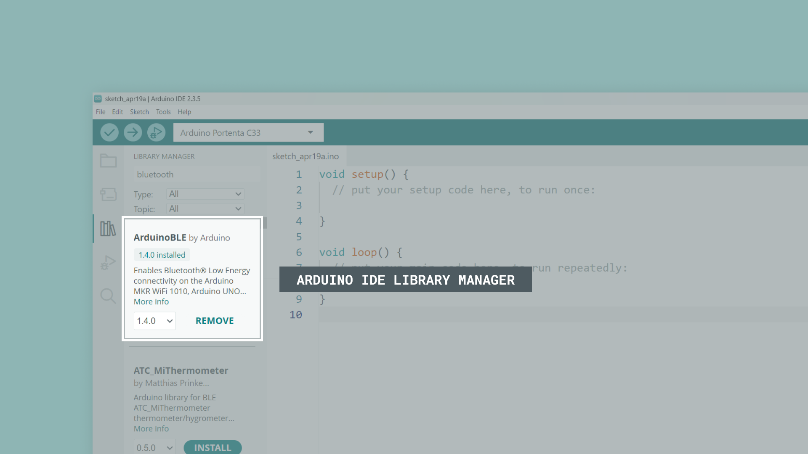
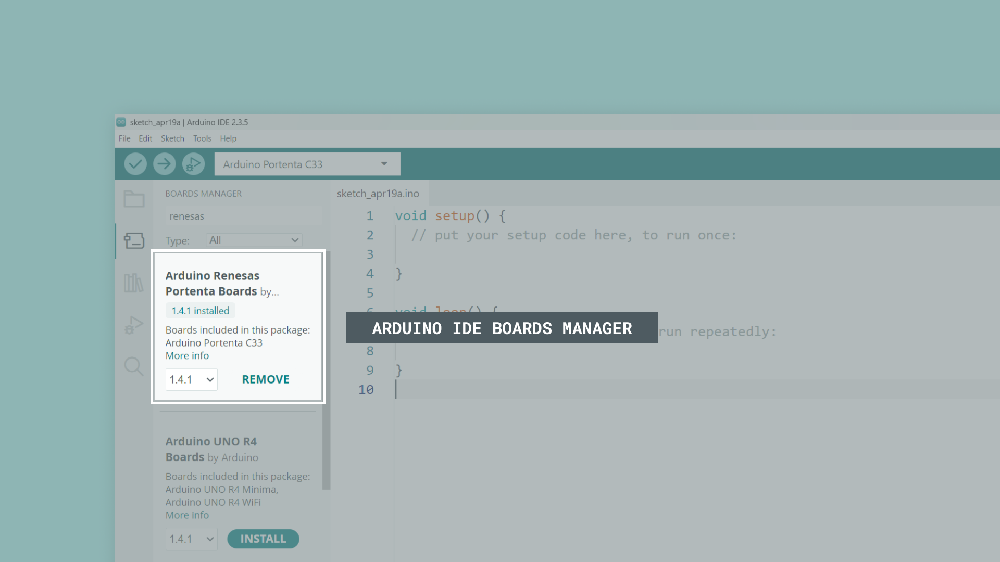

This user manual provides a comprehensive overview of the Arduino Stella, highlighting its hardware and software elements. With it, you will learn how to set up, configure and use all the main features of the Arduino Stella.


## Hardware and Software Requirements

### Hardware Requirements

- [Arduino Stella (SKU: ABX00131)](https://store.arduino.cc/products/stella) (x1)
- [Portenta UWB Shield (SKU: ASX00074)](https://store.arduino.cc/products/portenta-uwb-shield) (x1)
- [Portenta C33 (SKU: ABX00074)](https://store.arduino.cc/products/portenta-c33) (x1)
- [USB-C® cable (SKU: TPX00094)](https://store.arduino.cc/products/usb-cable2in1-type-c) (x2)
- CR2032 battery (x1) (optional)

### Software Requirements

- [Arduino IDE 2.0+](https://www.arduino.cc/en/software)
- [`StellaUWB` library](https://github.com/Truesense-it/StellaUWB) (designed for the Arduino Stella)
- [`PortentaUWBShield` library](https://github.com/Truesense-it/PortentaUWBShield) (designed for the Portenta UWB Shield)
- [`ArduinoBLE` library](https://github.com/arduino/ArduinoBLE) 
- [Arduino mbed OS Boards core](https://github.com/arduino/ArduinoCore-mbed) (required for the nRF52840 microcontroller of the Arduino Stella)

## Arduino Stella Overview

The Arduino Stella redefines location tracking with its advanced microcontroller, the nRF52840 from Nordic Semiconductor, and the DCU040 Ultra-Wide Band (UWB) module from Truesense. Tailored for modern tracking needs, the Arduino Stella excels in pinpointing warehouse assets, ensuring healthcare safety and automating smart buildings.


Seamlessly integrating with the Portenta UWB Shield and UWB-enabled smartphones through the dedicated NXP® Trimension™ App, Apple's Nearby Interaction APIs or Android's UWB Jetpack library, the Arduino Stella delivers robust finder functionality, precise point-to-point triggering and comprehensive tracking capabilities for applications demanding reliable, real-time location data.

### Understanding UWB Technology

Ultra-Wideband (UWB) is a radio technology that uses very low energy levels for short-range, high-bandwidth communications over a large portion of the radio spectrum. Unlike traditional narrowband radio systems like Bluetooth® or Wi-Fi®, which operate in specific frequency bands, UWB transmits across a wide range of frequency bands (typically 500 MHz or more), allowing for greater precision in location tracking and higher data throughput.

#### UWB vs. Traditional Narrowband Technologies

The fundamental difference between UWB and traditional wireless technologies (Wi-Fi, Bluetooth®, Zigbee® and Cellular) lies in their transmission methods:

|   **Feature**  |   **Traditional Narrowband Radio**   |  **Ultra-Wideband Impulse Radio**  |
|:--------------:|:------------------------------------:|:----------------------------------:|
| Transmit Power |         Higher transmit power        |        Lower transmit power        |
| Initialization |      Slow startup/initialization     |     Fast startup/initialization    |
|     Latency    |             High latency             |          Very low latency          |
|     Ranging    | Poor ranging (signal strength based) | Excellent ranging (time of flight) |
|    Multipath   |       Poor multipath robustness      |   Very good multipath robustness   |

Traditional narrowband systems use frequency or amplitude modulation to send data, requiring a reference carrier frequency between the transmitter and the receiver. This slows down the initialization process and restricts data transmission speed. UWB, in contrast, uses impulse radio technology. This technology consists of short pulses of energy (typically less than 5 nanoseconds) spread across a wide frequency band, allowing quick link initialization and extremely fast data transmission.

#### Key Characteristics of UWB

- **High precision**: UWB can determine the relative position of devices with centimeter-level accuracy (typically 5-10 cm), far more precise than GPS (meters), Bluetooth® (1-3 meters) or Wi-Fi (2-15 meters).
- **Low-power consumption**: Despite its high data rates, UWB consumes very little power, making it suitable for battery-operated devices like the Arduino Stella, which is optimized for energy efficiency.
- **Short range**: Typically effective within 10-30 meters, making it ideal for indoor positioning applications where GPS signals are weak or unavailable.
- **Strong security**: The unique physical layer characteristics of UWB, including its wide bandwidth and low power spectral density, make it more resistant to jamming, eavesdropping, and relay attacks compared to other wireless technologies.
- **Immunity to multipath fading**: The wide bandwidth of UWB signals makes them highly resistant to multipath interference, where signals bounce off surfaces and create echoes.
- **Coexistence with other standards**: Due to its low output spectral power, UWB can operate alongside other wireless technologies without causing interference—other radio systems interpret UWB signals simply as background noise.

#### Spectrum and Frequencies

UWB operates in specific frequency bands regulated by telecommunications authorities worldwide. The Arduino Stella's UWB module (DCU040) uses channels in the 6.0 to 8.5 GHz range, allowing for high bandwidth communication while minimizing interference with other wireless technologies. In general, UWB can operate in the 3.1-10.6 GHz range, with channel widths of 500 MHz or greater.

#### How UWB Technology Works

UWB primarily uses a technique called "Time of Flight" (ToF) or "Time Difference of Arrival" (TDoA) to determine the distance between UWB-enabled devices with extraordinary precision. In a nutshell, this technique consists of the following steps:

1. An UWB transmitter sends a signal with a precise timestamp.
2. An UWB receiver detects the signal and calculates the time it took to arrive.
3. Since radio waves travel at the speed of light (approximately 30 cm per nanosecond), the system can calculate the distance with high precision.

For even greater accuracy, UWB can use the "Two-Way Ranging" (TWR) technique, where devices exchange several messages to account for clock synchronization issues. In a nutshell, this technique consists of the following steps:

1. Device A sends a message to device B and records the time (T1).
2. Device B receives the message and sends a response after a known delay.
3. Device A receives the response and records the time (T2).
4. The round-trip time, minus processing delays, determines the distance.

The Arduino Stella is typically configured as a Controller/Initiator in Two-Way Ranging scenarios, initiating the ranging process with other UWB devices like the Portenta UWB Shield. This mobile tag functionality makes it perfect for applications where tracking the position of moving objects is required.

#### Low Latency Advantage

The impulse radio technology of UWB provides an inherent advantage in terms of latency. The data latency is very low since each pulse is extremely short (5 nanoseconds or less). Narrowband systems must modulate their carrier signals more slowly to maintain their frequency allocation, resulting in longer data latency and startup times.

In UWB systems, there's no need to establish a stable carrier signal for the receiver to lock onto, allowing data transmission to start immediately, representing a significant advantage for time-sensitive applications.

#### UWB System Components

In an UWB positioning system, devices typically operate in one of two roles:

- **Anchors**: Fixed-position devices (like the Portenta UWB Shield with a Portenta C33) that provide reference points for the positioning system. A minimum of three anchors is typically needed for 2D positioning and four for 3D positioning.
- **Tags**: Mobile devices that communicate with anchors to determine their position in space. The Arduino Stella is designed to function as a tag, with its compact form factor, battery operation and optimized power management, making it ideal for this role. Tags can also be integrated into smartphones, wearables or other IoT devices.

#### Applications of Arduino Stella with UWB Technology

The Arduino Stella's combination of UWB technology, compact form factor, and battery operation makes it ideal for numerous applications:

- **Asset tracking**: Attach Stella tags to valuable items in warehouses, hospitals, or construction sites to monitor their location with centimeter-level accuracy.
- **Wearable positioning**: Incorporate Arduino Stella into wearable devices for personnel tracking in industrial environments, healthcare settings, or event venues.
- **Robot and drone navigation**: Enable precise indoor navigation for autonomous systems where GPS is unavailable.
- **Social distancing solutions**: Create personal tags that can alert wearers when they come too close to others.
- **Interactive installations**: Power location-aware exhibits in museums or public spaces that respond to visitors' precise positions.
- **Sports performance analysis**: Track athletes' movements with high precision for training analysis and performance optimization.
- **Security applications**: Create authorized personnel tags that can trigger secure access systems only when physically present (resistant to relay attacks).
- **IoT sensor networks**: Deploy Arduino Stella devices as mobile sensor nodes that can report both environmental data and precise location information.

The Arduino Stella's programmability, combined with its UWB capabilities, accelerometer, and Bluetooth® connectivity, makes it an extremely versatile platform for developing innovative positioning solutions.

### Arduino Stella Architecture Overview

The Arduino Stella features a secure, certified and durable design that suits various applications, such as asset tracking, healthcare monitoring, smart building automation and consumer applications.

The top view of the Arduino Stella is shown in the image below:


The bottom view of the Arduino Stella is shown in the image below:


Here's an overview of the board's main components shown in the images:

- **Microcontroller**: At the heart of the Arduino Stella is the nRF52840 microcontroller from Nordic Semiconductor. This powerful 32-bit Arm® Cortex®-M4 processor runs at 64 MHz and features 1 MB Flash and 256 kB RAM, providing ample processing power and memory for sophisticated applications.
- **UWB Module**: The Truesense DCU040 module (based on the NXP Trimension SR040 UWB IC) enables precise distance measurement with accuracy better than ±10 cm using two-way ranging techniques.
- **Connectivity**: Besides UWB, the Arduino Stella includes Bluetooth® 5.0 connectivity through the nRF52840's integrated radio, supporting IEEE 802.15.4-2006 and 2.4 GHz transceiver capabilities.
- **Accelerometer**: A 3-axis MEMS digital output accelerometer (SC7A20) enhances the board's motion detection capabilities, with programmable sensitivity ranges of ±2G/±4G/±8G/±16G and features like orientation detection, free-fall detection, and click detection.
- **User interfaces**: The board includes a user-programmable button, a user-programmable LED and a buzzer (FUET-5020) that can be used for audible alerts.
- **Connectors**: The Arduino Stella features a USB-C port for power and data, a QWIIC connector for I²C expansion, a CR2032 battery holder and a J-Link connector for debugging and alternative power input.

### Board Libraries

The Arduino Stella and Portenta UWB Shield use different libraries and board cores due to their different microcontrollers and UWB modules:

#### Arduino Stella Library

The [`StellaUWB` library](https://github.com/Truesense-it/StellaUWB) contains an application programming interface (API) to read data from the Arduino Stella and control its parameters and behavior. This library is designed to work with the DCU040 module on the Arduino Stella and supports the following:

- One-way ranging (Time Difference of Arrival - TDoA) and two-way ranging (TWR).
- Power management for battery-efficient operation.
- Accelerometer control for motion detection.
- Bluetooth® Low Energy connectivity for configuration and communication.

***The [Arduino mbed OS Boards core](https://github.com/arduino/ArduinoCore-mbed) is required to work with the Arduino Stella's nRF52840 microcontroller.***

#### Portenta UWB Shield Library

If you plan to use the Arduino Stella with a Portenta UWB Shield for two-way ranging, you'll also need the [`PortentaUWBShield` library](https://github.com/Truesense-it/PortentaUWBShield) for the Portenta UWB Shield. This library is specifically designed for the DCU150 module used in the shield.

***The [Arduino Renesas Portenta Boards core](https://github.com/arduino/ArduinoCore-renesas) is required to work with the Portenta C33 board that hosts the UWB Shield.***

#### Bluetooth® Communication

For examples that use Bluetooth® Low Energy communication, you'll also need the [`ArduinoBLE` library](https://github.com/arduino/ArduinoBLE). This library enables Bluetooth® Low Energy functionality for device discovery and initial connection setup before UWB ranging begins.

#### Installing the Libraries and Board Cores

To install the required libraries:

1. Navigate to `Tools > Manage libraries...` or click the **Library Manager** icon in the left tab of the Arduino IDE.
2. In the Library Manager tab, search for the library name (`StellaUWB`, `PortentaUWBShield`, or `ArduinoBLE`).
3. Click "Install" to install the latest version of each library.



To install the required board cores:

1. Navigate to `Tools > Board > Boards Manager...`
2. For the Arduino Stella: Search for "Arduino mbed OS Boards" and install the latest version.
3. For the Portenta C33: Search for "Arduino Renesas Boards" and install the latest version.



***<strong>Important note:</strong> Make sure to install both the appropriate library and board core for your specific hardware. The Arduino Stella requires the `StellaUWB` library and Arduino mbed OS Boards core, while the Portenta UWB Shield with Portenta C33 requires the `PortentaUWBShield` library and Arduino Renesas Boards core. For examples involving Bluetooth® Low Energy communication, both devices will need the `ArduinoBLE` library installed.***

### Pinout

The full pinout is available and downloadable as PDF from the link below:

- [Arduino Stella pinout](https://docs.arduino.cc/resources/pinouts/ABX00131-full-pinout.pdf)

### Datasheet

The complete datasheet is available and downloadable as PDF from the link below:

- [Arduino Stella datasheet](https://docs.arduino.cc/resources/datasheets/ABX00131-datasheet.pdf)

### Schematics

The complete schematics are available and downloadable as PDF from the link below:

- [Arduino Stella schematics](https://docs.arduino.cc/resources/schematics/ABX00131-schematics.pdf)

### STEP Files 

The complete STEP files are available and downloadable from the link below:

- [Arduino Stella STEP files](../../downloads/ABX00131-step.zip)

## First Use

### Unboxing the Product

When you open the box of the Arduino Stella, you will find the board itself with its distinctive octagonal shape, featuring a USB-C port on one edge. The Arduino Stella is a compact board with dimensions of 38 mm x 38 mm, designed to be easily integrated into various tracking applications.

The Arduino Stella comes ready to use, but you may want to add a CR2032 battery if you plan to use it in portable applications that require battery power.

### Powering the Board

The Arduino Stella can be powered through one of these interfaces:

The Arduino Stella can be powered through its USB-C port or Qwiic connector for stationary applications. The USB-C port is the simplest and most common method, providing a stable +5 VDC power source when connected to a computer or wall adapter. The Qwiic connector can also supply power when connecting the board to a system that provides power through the Qwiic bus, enabling integration with other Qwiic-compatible components.


For portable and wireless applications, the Arduino Stella offers two additional power options: the onboard CR2032 battery holder. The CR2032 battery holder allows you to install a +3 VDC coin cell battery, making the board completely wireless for mobile projects. The J-Link connector, while primarily used for debugging purposes, can also serve as a power input when needed.


***<strong>Important note:</strong> When using battery power, ensure the correct polarity when inserting the CR2032 battery into the holder. The positive (+) side should face up, away from the PCB, as shown in the image below.***


***<strong>Warning:</strong> When using Arduino Stella with USB-C power, remove the CR2032 battery; never power the Arduino Stella from both battery and USB simultaneously. The board is designed to prioritize USB power when connected. Removing the battery when working with USB will extend its life, ensure the most reliable operation and maximize battery lifespan.***

### Connecting to Your Computer

To program the Arduino Stella, connect it to your computer using a USB-C cable:

1. Insert the USB-C connector into the port on the Arduino Stella.
2. Connect the other end to an available USB port on your computer.

Once connected, you should see a power indicator light up on the board, indicating it's receiving power from the USB port.

### Nearby World Example

Let's use the Arduino Stella to create a real-time distance measurement system using UWB technology. We will implement what we call the `Nearby World` example, which serves as our `Hello World` sketch for UWB technology. This example will verify the Arduino Stella's UWB capabilities and its ability to communicate with UWB-enabled smartphones.

***This example sketch leverages Apple's Nearby Interaction protocol and similar UWB implementations on Android devices to establish a communication channel between the Arduino Stella and a UWB-enabled smartphone, allowing precise distance and angle measurements.***

#### How It Works

The `Nearby World` example demonstrates the core functionality of UWB technology through a simple example sketch that can be described in the following key steps:

1. **Bluetooth® Low Energy connection setup**: The Arduino Stella broadcasts using Bluetooth Low Energy to make itself discoverable to compatible smartphone apps.
2. **Configuration exchange**: The Bluetooth Low Energy connection is used to exchange necessary UWB configuration parameters between the Arduino Stella and the smartphone.
3. **UWB ranging**: Once configured, the actual UWB ranging session begins, providing precise distance measurements.
4. **Real-time feedback**: Distance data is continuously updated and can be viewed both on the IDE's Serial Monitor and on the smartphone app. The Arduino Stella's buzzer and LED can also provide feedback based on distance.

This process demonstrates the working principle of many UWB applications, where Bluetooth Low Energy is used primarily for discovery and configuration, while UWB handles the precise ranging.

#### Uploading the Sketch

First, connect the Arduino Stella to your computer using a USB-C cable, open the Arduino IDE and connect the board to it.

***If you are new to the Arduino Stella, ensure you have installed the required board support package by going to Tools > Board > Boards Manager and searching for "mbed OS Boards".***

Copy and paste the example sketch below into a new sketch in the Arduino IDE:

```arduino 
/**
  Nearby World Example for Arduino Stella
  Name: arduino_stella_nearby.ino
  Purpose: This sketch demonstrates how to use the Arduino Stella
  to measure distance between the board and a UWB-enabled smartphone.
  
  Compatible with:
  - NXP Trimensions AR (https://apps.apple.com/us/app/nxp-trimensions-ar/id1606143205)
  - Qorvo Nearby Interaction (https://apps.apple.com/us/app/qorvo-nearby-interaction/id1615369084)
  - NXP android demo (source code https://github.com/nxp-uwb/UWBJetpackExample)
  - Truesense Android demo (source code https://github.com/Truesense-it/TSUwbDemo-Android)
  
  @author Arduino Product Experience Team
  @version 1.0 15/04/25
*/

// Include required libraries
#include <ArduinoBLE.h>
#include <StellaUWB.h>

// Track the number of connected Bluetooth® Low Energy clients
uint16_t numConnected = 0;

// Buzzer activation thresholds (in mm)
#define PROXIMITY_CLOSE 500     // 50cm
#define PROXIMITY_MEDIUM 1500   // 1.5m
#define PROXIMITY_FAR 3000      // 3m

/**
  @brief Processes ranging data received from UWB communication.
  @param rangingData Reference to UWB ranging data object.
*/
void rangingHandler(UWBRangingData &rangingData) {
  Serial.print("- GOT RANGING DATA - Type: ");
  Serial.println(rangingData.measureType());
  
  // Nearby interaction uses Double-sided Two-way Ranging method
  if(rangingData.measureType()==(uint8_t)uwb::MeasurementType::TWO_WAY) {
    // Get the TWR (Two-Way Ranging) measurements
    RangingMeasures twr = rangingData.twoWayRangingMeasure();
    
    // Loop through all available measurements
    for(int j=0; j<rangingData.available(); j++) {
      // Only process valid measurements
      if(twr[j].status==0 && twr[j].distance!=0xFFFF) {
        // Display the distance measurement in millimeters
        Serial.print("- Distance: ");
        Serial.println(twr[j].distance);
        
        // Provide feedback based on distance
        provideFeedback(twr[j].distance);
      }
    }
  }
}

/**
  Provides audio and visual feedback based on distance.
  @param distance The measured distance in millimeters.
*/
void provideFeedback(uint32_t distance) {
  // LED pattern based on distance
  if (distance < PROXIMITY_CLOSE) {
    // Fast blinking for close proximity
    digitalWrite(LED_BUILTIN, HIGH);
    // Short beep for close proximity
    buzzer.beep(50);
    delay(50);
    digitalWrite(LED_BUILTIN, LOW);
  } 
  else if (distance < PROXIMITY_MEDIUM) {
    // Medium pace blinking for medium proximity
    digitalWrite(LED_BUILTIN, HIGH);
    delay(200);
    digitalWrite(LED_BUILTIN, LOW);
  }
  else if (distance < PROXIMITY_FAR) {
    // Slow blinking for far proximity
    digitalWrite(LED_BUILTIN, HIGH);
    delay(500);
    digitalWrite(LED_BUILTIN, LOW);
  }
  else {
    // Very slow pulsing for very distant objects
    digitalWrite(LED_BUILTIN, HIGH);
    delay(1000);
    digitalWrite(LED_BUILTIN, LOW);
  }
  
  // Ensure delay between feedback cycles
  delay(100);
}

/**
  @brief Handles new Bluetooth® Low Energy client connection events.
  @param dev The connecting Bluetooth Low Energy device.
*/
void clientConnected(BLEDevice dev) {
  // Initialize UWB stack on first connection
  if (numConnected == 0) {
    // Start the UWB engine
    UWB.begin(); 
  }
  // Increment connected clients counter
  numConnected++;
  Serial.println("- Client connected!");
}

/**
  @brief Handles Bluetooth® Low Energy client disconnection events.
  @param dev The disconnecting Bluetooth Low Energy device.
*/
void clientDisconnected(BLEDevice dev) {
  // Decrement connected clients counter
  numConnected--;
  // Shut down UWB when no clients are connected
  if(numConnected==0) {
    UWB.end();
  }
  Serial.println("- Client disconnected!");
}

/**
  @brief Handles UWB session start events.
  @param dev The Bluetooth® Low Energy device starting the session.
*/
void sessionStarted(BLEDevice dev) {
  Serial.println("- Session started!");
  // Beep once to indicate session start
  buzzer.beep(200);
}

/**
  @brief Handles UWB session termination events.
  @param dev The Bluetooth® Low Energy device ending the session.
*/
void sessionStopped(BLEDevice dev) {
  Serial.println("- Session stopped!");
  // Beep twice to indicate session end
  buzzer.beep(100);
  delay(100);
  buzzer.beep(100);
}

void setup() {
  // Initialize serial communication at 115200 bits per second
  Serial.begin(115200);
  
  // Initialize the onboard LED
  pinMode(LED_BUILTIN, OUTPUT);
  digitalWrite(LED_BUILTIN, LOW);
  
  // Initialize the accelerometer
  if (!accelerometer.begin()) {
    Serial.println("- Failed to initialize accelerometer!");
  }
  
  // Initialize the buzzer
  buzzer.begin();

  Serial.println("- Nearby interaction app start...");
  
  // Register callback handlers
  UWB.registerRangingCallback(rangingHandler);
  UWBNearbySessionManager.onConnect(clientConnected);
  UWBNearbySessionManager.onDisconnect(clientDisconnected);
  UWBNearbySessionManager.onSessionStart(sessionStarted);
  UWBNearbySessionManager.onSessionStop(sessionStopped);
  
  // Initialize Bluetooth® Low Energy services and start advertising as "Arduino Stella"
  UWBNearbySessionManager.begin("Arduino Stella");
  
  // Beep three times to indicate setup complete
  for (int i = 0; i < 3; i++) {
    buzzer.beep(50);
    delay(50);
  }
}

void loop() {
  // Small delay to prevent CPU overload
  delay(100);
  
  // Process Bluetooth® Low Energy events
  UWBNearbySessionManager.poll();
}
```

To upload the sketch to the Arduino Stella, click the **Verify** button to compile the sketch and check for errors, then click the **Upload** button to program the device with the sketch.

Once the sketch is uploaded, open the Serial Monitor by clicking on the icon in the top right corner of the Arduino IDE. You should see the message `- Nearby interaction app start...` in the IDE's Serial Monitor, followed by three short beeps from the Arduino Stella's buzzer.

#### Try It Yourself

To complete the test, you will need a UWB-enabled smartphone with one of the compatible applications installed:

**For iPhone (iPhone 11 or newer with UWB capability):**

- [NXP Trimensions AR](https://apps.apple.com/us/app/nxp-trimensions-ar/id1606143205)
- [Qorvo Nearby Interaction](https://apps.apple.com/us/app/qorvo-nearby-interaction/id1615369084)

**For Android (UWB-enabled Android devices):**

- [Truesense Android demo](https://github.com/Truesense-it/TSUwbDemo-Android)
- [NXP Android demo](https://github.com/nxp-uwb/UWBJetpackExample)

***<strong>Important note for Android devices:</strong> If Developer Options is currently enabled on your Android device, please ensure all radio-related options remain at their default settings. We recommend keeping Developer Options disabled for optimal UWB functionality. If you previously enabled it, consider disabling it for the most stable device operation.***

Install one of these apps on your smartphone and follow these steps:

1. Open the app on your smartphone.
2. Look for a device named `Arduino Stella` in the app's device list.
3. Connect to the device.
4. Once connected, the app will initiate a UWB ranging session, and you'll hear a single beep from the Arduino Stella.
5. Move your phone closer to and further from the Arduino Stella.

You should see the distance measurements updating in real-time both on your smartphone app and in the IDE's Serial Monitor. The distances are shown in millimeters, providing centimeter-level accuracy characteristic of UWB technology. Additionally, the Arduino Stella's LED and buzzer will provide feedback based on the measured distance, with more frequent responses as you get closer to the device.

## NearbyDemo Example

### About the NearbyDemo Example

The `NearbyDemo` example sketch is a fundamental demonstration of the Arduino Stella's core capabilities. This example showcases how to implement a direct distance measurement system between the Arduino Stella (acting as a UWB tag) and a UWB-enabled smartphone (acting as a UWB anchor).

This example sketch demonstrates the following:

- **Hybrid communication protocol:** It shows the integration of Bluetooth® Low Energy for device discovery and configuration with UWB for precise distance measurements, a common pattern in production UWB applications.
- **Standards compatibility:** The implementation is compatible with Apple's Nearby Interaction API and similar Android standards, demonstrating how the Arduino ecosystem can interact with mainstream consumer devices.
- **Foundation for advanced applications:** The ranging capability demonstrated is the building block for more sophisticated applications such as indoor positioning systems, geofencing, secure access and proximity-based automation.

Some of the real-life applications for this example sketch are the following:

- **Asset tracking:** Creating systems where Arduino Stella boards attached to valuable items can be precisely located within warehouses or facilities.
- **Smart building automation:** Implementing room-level presence detection that can adjust lighting, temperature, and other environmental factors based on the location of people wearing or carrying Arduino Stella devices.
- **Healthcare:** Tracking the movement of patients, staff, and medical equipment with high accuracy within hospital environments.
- **Retail analytics:** Analyzing customer movement patterns in stores to optimize layout and product placement.
- **Consumer item finding:** Creating tag-based systems that allow users to precisely locate misplaced items through smartphone interactions.

Now, let's take a closer look at the sketch:

```arduino
/**
  NearbyDemo Example for Arduino Stella
  Name: arduino_stella_nearbydemo.ino
  Purpose: This sketch demonstrates how to use the Arduino Stella
  to measure distance between the board and a UWB-enabled device.
  
  @author Pierpaolo Lento from Truesense, modified by the Arduino Product Experience Team
  @version 1.0 15/04/25
*/

// Include required libraries
#include <ArduinoBLE.h>
#include <StellaUWB.h>

// Track the number of connected Bluetooth® Low Energy clients
uint16_t numConnected = 0;

/**
  Processes ranging data received from UWB communication.
  @param rangingData Reference to UWB ranging data object.
*/
void rangingHandler(UWBRangingData &rangingData) {
  Serial.print("- GOT RANGING DATA - Type: ");
  Serial.println(rangingData.measureType());
  
  // Nearby interaction uses Double-sided Two-way Ranging method
  if(rangingData.measureType()==(uint8_t)uwb::MeasurementType::TWO_WAY) {
    // Get the TWR (Two-Way Ranging) measurements
    RangingMeasures twr = rangingData.twoWayRangingMeasure();
    
    // Loop through all available measurements
    for(int j=0; j<rangingData.available(); j++) {
      // Only process valid measurements
      if(twr[j].status==0 && twr[j].distance!=0xFFFF) {
        // Display the distance measurement in millimeters
        Serial.print("- Distance: ");
        Serial.println(twr[j].distance);
      }
    }
  }
}

/**
  Handles new Bluetooth® Low Energy client connection events.
  @param dev The connecting Bluetooth Low Energy device.
*/
void clientConnected(BLEDevice dev) {
  // Initialize UWB stack on first connection
  if (numConnected == 0) {
    // Start the UWB engine
    UWB.begin(); 
  }
  // Increment connected clients counter
  numConnected++;
}

/**
  Handles Bluetooth® Low Energy client disconnection events.
  @param dev The disconnecting Bluetooth Low Energy device.
*/
void clientDisconnected(BLEDevice dev) {
  // Decrement connected clients counter
  numConnected--;
  // Shut down UWB when no clients are connected
  if(numConnected==0) {
    UWB.end();
  }
}

/**
  Handles UWB session start events.
  @param dev The Bluetooth® Low Energy device starting the session.
*/
void sessionStarted(BLEDevice dev) {
  Serial.println("- Session started!");
}

/**
  Handles UWB session termination events.
  @param dev The Bluetooth® Low Energy device ending the session.
*/
void sessionStopped(BLEDevice dev) {
  Serial.println("- Session stopped!");
}

void setup() {
  // Initialize serial communication at 115200 bits per second
  Serial.begin(115200);
  
  // Initialize the onboard LED
  pinMode(LED_BUILTIN, OUTPUT);
  digitalWrite(LED_BUILTIN, LOW);

  Serial.println("- Nearby interaction app start...");
  
  // Register callback handlers
  UWB.registerRangingCallback(rangingHandler);
  UWBNearbySessionManager.onConnect(clientConnected);
  UWBNearbySessionManager.onDisconnect(clientDisconnected);
  UWBNearbySessionManager.onSessionStart(sessionStarted);
  UWBNearbySessionManager.onSessionStop(sessionStopped);
  
  // Initialize Bluetooth® Low Energy services and start advertising as "Arduino Stella"
  UWBNearbySessionManager.begin("Arduino Stella");
}

void loop() {
  // Small delay to prevent CPU overload
  delay(100);
  
  // Process Bluetooth® Low Energy events
  UWBNearbySessionManager.poll();
}
```

### Key Components of the Example Sketch

The `NearbyDemo` code follows an event-driven architecture that employs callback functions to handle various events in the UWB communication process. Here is an explanation of the most important parts of the example sketch:

1. **Libraries and Global Variables**
   
```arduino
#include <ArduinoBLE.h>
#include <StellaUWB.h>

uint16_t numConnected = 0;
```

The code includes two essential libraries:

- `ArduinoBLE`: Provides Bluetooth® Low Energy functionality for device discovery and initial connection.
- `StellaUWB`: The core library that enables interaction with the UWB hardware on the Arduino Stella.

The `numConnected` variable tracks how many Bluetooth Low Energy clients are currently connected to the Arduino Stella.

2. **Ranging Data Handler**

```arduino
void rangingHandler(UWBRangingData &rangingData) {
  // ...
  if(rangingData.measureType()==(uint8_t)uwb::MeasurementType::TWO_WAY) {
    RangingMeasures twr = rangingData.twoWayRangingMeasure();
    // ...
    if(twr[j].status==0 && twr[j].distance!=0xFFFF) {
      Serial.print("- Distance: ");
      Serial.println(twr[j].distance);
    }
  }
}
```

This callback function is the heart of the UWB functionality:

- It's triggered whenever new ranging data is received from the UWB subsystem.
- It checks if the measurement type is *Two-Way Ranging (TWR)*, which is the method used by Apple's Nearby Interaction protocol.
- It extracts the distance measurements in millimeters and prints them to the IDE's Serial Monitor.
- It validates the measurement (`status = 0` indicates a valid measurement, while `distance = 0xFFFF` is a reserved value indicating an invalid distance).

3. **Connection Management**

```arduino
void clientConnected(BLEDevice dev) {
  if (numConnected == 0) {
    UWB.begin(); 
  }
  numConnected++;
}

void clientDisconnected(BLEDevice dev) {
  numConnected--;
  if(numConnected==0) {
    UWB.end();
  }
}
```

These functions handle Bluetooth® Low Energy connection events:

- `clientConnected` initializes the UWB subsystem when the first client connects.
- `clientDisconnected` shuts down the UWB subsystem when no clients are connected.

This approach saves power by only running the board's UWB hardware when it's needed, which is crucial for battery-powered applications.

1. **Session Management**

```arduino
void sessionStarted(BLEDevice dev) {
  Serial.println("- Session started!");
}

void sessionStopped(BLEDevice dev) {
  Serial.println("- Session stopped!");
}
```

These callbacks track the UWB session state:

- A session begins after the Bluetooth® Low Energy connection is established and the UWB configuration is exchanged.
- A session ends when the UWB communication is terminated, either by the client disconnecting or other factors.

5. **Setup and Initialization**

```arduino
void setup() {
  // ...
  UWB.registerRangingCallback(rangingHandler);
  UWBNearbySessionManager.onConnect(clientConnected);
  UWBNearbySessionManager.onDisconnect(clientDisconnected);
  UWBNearbySessionManager.onSessionStart(sessionStarted);
  UWBNearbySessionManager.onSessionStop(sessionStopped);
  
  UWBNearbySessionManager.begin("Arduino Stella");
}
```

The setup function:

- Registers all the callback functions with the UWB subsystem.
- Initializes the Bluetooth® Low Energy advertising with the name `Arduino Stella`. This name is what will appear in the smartphone app's device list.

6. **Main Loop**

```arduino
void loop() {
  delay(100);
  UWBNearbySessionManager.poll();
}
```

The main loop is quite simple:

- It calls the `UWBNearbySessionManager.poll()` function to process Bluetooth® Low Energy events.
- The actual UWB ranging happens asynchronously through the callback system.
  
This event-driven architecture allows the system to respond quickly to UWB and Bluetooth Low Energy events without blocking the main program flow.

### Extending the Example Sketch

The `NearbyDemo` example sketch provides a great foundation that you can build upon for more complex projects. Some possible extensions of this sketch include the following:

- **Adding visual feedback:** Using the onboard LED to indicate distance ranges.
- **Implementing audio feedback:** Using the onboard buzzer to create proximity alerts or distance-based tones.
- **Incorporating accelerometer data:** Combining motion detection with UWB ranging for smarter tracking applications.
- **Power optimization:** Implementing sleep modes and wake-on-motion features for extended battery life.
- **Data logging:** Recording distance measurements over time for analysis and visualization.

***<strong>Note:</strong> If you want to try this example yourself, please follow the same steps described in the [Nearby World Example](#nearby-world-example) section. The process for uploading the sketch and testing it with a smartphone is the same.***

## Two-Way Ranging Example

### About the Two-Way Ranging Example

The Two-Way Ranging example demonstrates direct UWB communication between two Arduino devices: the Portenta UWB Shield (acting as a Controlee/Responder) and the Arduino Stella (acting as a Controller/Initiator). This example showcases the fundamental distance measurement capabilities of UWB technology in a dedicated device-to-device setup without requiring external UWB-enabled consumer devices such as smartphones.

***<strong>Note:</strong> In UWB communication, the terms "Controller" and "Controlee" refer to specific roles within a ranging session. A __Controller__ (also called an Initiator) is the device that initiates and controls the ranging process, sending the initial signal and managing the timing of exchanges. A __Controlee__ (also called a Responder) is the device that responds to the Controller's signals. These terms are used interchangeably in UWB documentation: Controller/Initiator and Controlee/Responder refer to the same roles. In positioning systems, Controllers/Initiators often correspond to mobile "tags" while Controlees/Responders often serve as stationary "anchors".***

This example demonstrates the following:

- **Direct device-to-device communication:** Unlike the `NearbyDemo` example, which requires a smartphone, this example establishes direct UWB communication between two UWB-enabled Arduino devices.
- **Controller-Controlee architecture:** It shows how to configure one device as a Controller (initiator of the ranging) and another as a Controlee (responder).
- **Double-Sided Two-Way Ranging (DS-TWR):** This technique provides higher accuracy in distance measurements by accounting for clock drift between devices.
- **Simple MAC addressing:** The implementation shows how to use short MAC addresses for device identification in UWB networks.

Some of the real-life applications for this example include:

- **Multi-node positioning systems:** Creating networks of UWB nodes for advanced indoor positioning.
- **Robot navigation:** Enabling precise distance measurements between robots or between robots and fixed stations.
- **Asset tracking:** Building custom tracking solutions with multiple Arduino-based UWB anchors.
- **Proximity detection systems:** Creating safety systems that can detect precise distances between industrial equipment and personnel.
- **Interactive installations:** Enabling position-based interactive exhibits in museums or public spaces.

Here's the code for the Portenta UWB Shield, which acts as the Controlee (Responder) in this Two-Way Ranging scenario:

```arduino
/**
  Two-Way Ranging Controlee Example for Portenta UWB Shield
  Name: portenta_uwb_twr_controlee.ino
  Purpose: This sketch configures the Portenta UWB Shield as a Controlee (Responder)
  for Two-Way Ranging with an Arduino Stella configured as Controller.
  
  @author Pierpaolo Lento from Truesense, modified by the Arduino Product Experience Team
  @version 1.0 15/04/25
*/
// Include required UWB library
#include <PortentaUWBShield.h>
/**
  Processes ranging data received from UWB communication.
  @param rangingData Reference to UWB ranging data object.
*/
void rangingHandler(UWBRangingData &rangingData) {
  Serial.print("- GOT RANGING DATA - Type: ");
  Serial.println(rangingData.measureType());
  if(rangingData.measureType()==(uint8_t)uwb::MeasurementType::TWO_WAY) {
    // Get the TWR (Two-Way Ranging) measurements
    RangingMeasures twr=rangingData.twoWayRangingMeasure();
    
    // Loop through all available measurements
    for(int j=0;j<rangingData.available();j++) {
      // Only process valid measurements
      if(twr[j].status==0 && twr[j].distance!=0xFFFF) {
        // Display the distance measurement in millimeters
        Serial.print("- Distance: ");
        Serial.println(twr[j].distance);  
      }
    }
  }
}
void setup() {
  // Initialize serial communication at 115200 bits per second
  Serial.begin(115200);
  #if defined(ARDUINO_PORTENTA_C33)
    // Only the Portenta C33 has an RGB LED
    pinMode(LEDR, OUTPUT);
    digitalWrite(LEDR, LOW);
  #endif
  // Define MAC addresses for this device and the target
  // This device (Controlee) has address 0x2222
  // Target device (Controller) has address 0x1111
  uint8_t devAddr[]={0x22,0x22};
  uint8_t destination[]={0x11,0x11};
  UWBMacAddress srcAddr(UWBMacAddress::Size::SHORT,devAddr);
  UWBMacAddress dstAddr(UWBMacAddress::Size::SHORT,destination);
  
  // Register the callback and start UWB
  UWB.registerRangingCallback(rangingHandler);
  UWB.begin();
  Serial.println("- Starting UWB ...");
  // Wait until UWB stack is initialized
  while(UWB.state()!=0)
    delay(10);
  // Configure the UWB session
  Serial.println("- Starting session ...");
  UWBSession session1;
  session1.sessionID(0x11223344);
  session1.sessionType(uwb::SessionType::RANGING);
    
  // Set application parameters
  if(!session1.appParams.addOrUpdateParam(AppConfigId::NO_OF_CONTROLEES,1))
    Serial.println("- Could not add to app params!");
  if(!session1.appParams.destinationMacAddr(dstAddr))
    Serial.println("- Could not add to app params!");
    
  // Apply default values for measurement repetition rate and antenna config
  session1.applyDefaults();
  // Configure ranging parameters
  session1.rangingParams.deviceMacAddr(srcAddr);
  session1.rangingParams.deviceRole(uwb::DeviceRole::RESPONDER);
  session1.rangingParams.deviceType(uwb::DeviceType::Controlee);
  session1.rangingParams.multiNodeMode(uwb::MultiNodeMode::UNICAST);
  session1.rangingParams.rangingRoundUsage(uwb::RangingMethod::DS_TWR);
  session1.rangingParams.scheduledMode(uwb::ScheduledMode::TIME_SCHEDULED);
  
  // Add the session to the manager and start it
  UWBSessionManager.addSession(session1);
  session1.init();
  session1.start();
}
void loop() {
  // Toggle the LED to show the system is running
  #if defined(ARDUINO_PORTENTA_C33)
    // Only the Portenta C33 has an RGB LED
    digitalWrite(LEDR, !digitalRead(LEDR));
  #else
    Serial.println(millis());
  #endif
  
  // Small delay using FreeRTOS scheduler
  vTaskDelay(configTICK_RATE_HZ/4);
}
```

Here's the code for the Arduino Stella, which acts as the Controller (Initiator) in this Two-Way Ranging scenario:

```arduino
/**
  Two-Way Ranging Controller Example for Arduino Stella
  Name: stella_uwb_twr_controller.ino
  Purpose: This sketch configures the Arduino Stella as a Controller (Initiator)
  for Two-Way Ranging with a Portenta UWB Shield configured as Controlee.
  
  @author Pierpaolo Lento from Truesense, modified by the Arduino Product Experience Team
  @version 1.0 15/04/25
*/
// Include required UWB library
#include <StellaUWB.h>
/**
  Processes ranging data received from UWB communication.
  @param rangingData Reference to UWB ranging data object.
*/
void rangingHandler(UWBRangingData &rangingData) {
  Serial.print("- GOT RANGING DATA - Type: ");
  Serial.println(rangingData.measureType());
  if(rangingData.measureType()==(uint8_t)uwb::MeasurementType::TWO_WAY) {
    // Get the TWR (Two-Way Ranging) measurements
    RangingMeasures twr=rangingData.twoWayRangingMeasure();
    
    // Loop through all available measurements
    for(int j=0;j<rangingData.available();j++) {
      // Only process valid measurements
      if(twr[j].status==0 && twr[j].distance!=0xFFFF) {
        // Display the distance measurement in millimeters
        Serial.print("- Distance: ");
        Serial.println(twr[j].distance);
      }
    }
  }
}
void setup() {
  // Initialize serial communication at 115200 bits per second
  Serial.begin(115200);
  
  // Define MAC addresses for this device and the target
  // This device (Controller) has address 0x1111
  // Target device (Controlee) has address 0x2222
  uint8_t devAddr[]={0x11,0x11};
  uint8_t destination[]={0x22,0x22};
  UWBMacAddress srcAddr(UWBMacAddress::Size::SHORT,devAddr);
  UWBMacAddress dstAddr(UWBMacAddress::Size::SHORT,destination);
  
  // Register the ranging notification handler before starting
  UWB.registerRangingCallback(rangingHandler);
  
  // Start the UWB stack
  UWB.begin();
  Serial.println("- Starting UWB ...");
  
  // Wait until the stack is initialized
  while(UWB.state()!=0)
    delay(10);
  
  // Setup and start the UWB session
  Serial.println("- Starting session ...");
  
  // Configure the UWB session
  UWBSession session1;
  session1.sessionID(0x11223344);
  session1.sessionType(UWBD_RANGING_SESSION);
    
  // Set application parameters
  if(!session1.appParams.addOrUpdateParam(UWB_SET_APP_PARAM_VALUE(NO_OF_CONTROLEES,1)))
    Serial.println("- Could not add to app params!");
  if(!session1.appParams.destinationMacAddr(dstAddr))
    Serial.println("- Could not add to app params!");
    
  // Apply default values for measurement repetition rate and antenna config
  session1.applyDefaults();
  // Configure ranging parameters
  session1.rangingParams.deviceMacAddr(srcAddr);
  session1.rangingParams.deviceRole(kUWB_DeviceRole_Initiator);
  session1.rangingParams.deviceType(kUWB_DeviceType_Controller);
  session1.rangingParams.multiNodeMode(kUWB_MultiNodeMode_UniCast);
  session1.rangingParams.rangingRoundUsage(kUWB_RangingRoundUsage_DS_TWR);
  session1.rangingParams.scheduledMode(kUWB_ScheduledMode_TimeScheduled);
  
  // Add the session to the manager and start it
  UWBSessionManager.addSession(session1);
  session1.init();
  session1.start();
}
void loop() {
  // Simple delay, the ranging happens asynchronously via callbacks
  delay(1000);
}
```

### Key Components of the Example Sketch

The Two-Way Ranging example demonstrates a more direct approach to UWB communication compared to the `NearbyDemo`. Let's analyze the key components of both example sketches:

1. **Libraries and MAC Addressing**

Both devices use their respective UWB libraries:

- The Portenta UWB Shield uses `PortentaUWBShield.h` (for the DCU150 module)
- The Stella uses `StellaUWB.h` (for the DCU040 module)

Both sketches configure MAC addresses for identification:

```arduino
// On Portenta UWB Shield
uint8_t devAddr[]={0x22,0x22};
uint8_t destination[]={0x11,0x11};
// On Arduino Stella
uint8_t devAddr[]={0x11,0x11};
uint8_t destination[]={0x22,0x22};
```

***<strong>Important note:</strong> Notice how the MAC addresses are reversed between the two devices; this is critical for proper communication. In UWB communication, each device must know both its own address (`devAddr`) and the address of the device it is communicating with (`destination`). The Portenta UWB Shield identifies itself as `0x2222` and expects to communicate with `0x1111`, while the Arduino Stella identifies itself as `0x1111` and expects to communicate with `0x2222`. If these addresses don't match correctly, the devices won't be able to establish a ranging session. The prefix `0x` indicates these are hexadecimal values, which is a common notation in programming for representing memory addresses and identifiers.***

The MAC addresses used in this example are short (2-byte) addresses for simplicity, but UWB also supports extended (8-byte) addresses for larger networks where unique identification is required. For basic two-device setups, these short addresses are enough, but for multi-node positioning systems, you may want to use extended addressing to avoid conflicts.

2. **Setup and Initialization**

The setup process for UWB communication differs between the two devices due to their different roles in the ranging session:

**Portenta UWB Shield (Controlee/Responder):**

```arduino
// Configure the UWB session
UWBSession session1;
session1.sessionID(0x11223344);  // Unique identifier for this session
session1.sessionType(uwb::SessionType::RANGING);
    
// Set application parameters
if(!session1.appParams.addOrUpdateParam(AppConfigId::NO_OF_CONTROLEES,1))
  Serial.println("could not add to app params");
if(!session1.appParams.destinationMacAddr(dstAddr))
  Serial.println("could not add to app params");
    
// Apply default values for measurement repetition rate and antenna config
session1.applyDefaults();
// Configure ranging parameters
session1.rangingParams.deviceMacAddr(srcAddr);
session1.rangingParams.deviceRole(uwb::DeviceRole::RESPONDER);
session1.rangingParams.deviceType(uwb::DeviceType::Controlee);
session1.rangingParams.multiNodeMode(uwb::MultiNodeMode::UNICAST);
session1.rangingParams.rangingRoundUsage(uwb::RangingMethod::DS_TWR);
session1.rangingParams.scheduledMode(uwb::ScheduledMode::TIME_SCHEDULED);
  
// Add the session to the manager and start it
UWBSessionManager.addSession(session1);
session1.init();
session1.start();
```

**Arduino Stella (Controller/Initiator):**

```arduino
// Configure the UWB session
UWBSession session1;
session1.sessionID(0x11223344);
session1.sessionType(UWBD_RANGING_SESSION);
    
// Set application parameters
if(!session1.appParams.addOrUpdateParam(UWB_SET_APP_PARAM_VALUE(NO_OF_CONTROLEES,1)))
  Serial.println("could not add to app params");
if(!session1.appParams.destinationMacAddr(dstAddr))
  Serial.println("could not add to app params");
    
// Apply default values for measurement repetition rate and antenna config
session1.applyDefaults();
// Configure ranging parameters
session1.rangingParams.deviceMacAddr(srcAddr);
session1.rangingParams.deviceRole(kUWB_DeviceRole_Initiator);
session1.rangingParams.deviceType(kUWB_DeviceType_Controller);
session1.rangingParams.multiNodeMode(kUWB_MultiNodeMode_UniCast);
session1.rangingParams.rangingRoundUsage(kUWB_RangingRoundUsage_DS_TWR);
session1.rangingParams.scheduledMode(kUWB_ScheduledMode_TimeScheduled);
  
// Add the session to the manager and start it
UWBSessionManager.addSession(session1);
session1.init();
session1.start();
```

***<strong>Important note:</strong> The session configuration is more detailed for the Portenta UWB Shield because it explicitly defines all the ranging parameters. The Arduino Stella uses the simplified `UWBTracker` class, which automatically sets up the device as a Controller/Initiator with appropriate defaults. However, both devices must use the same session ID (`0x11223344` in this example) to communicate with each other. This session ID is a shared identifier for the ranging session between these devices.***

Let's examine some of the key configuration parameters:

- `sessionID`: A unique 32-bit identifier (`0x11223344`) must match between devices in the same session.
- `deviceRole`: Defines whether the device is a Responder (Controlee) or Initiator (Controller).
- `multiNodeMode`: Set to UniCast for direct device-to-device communication.
- `rangingRoundUsage`: Set to DS_TWR (Double-Sided Two-Way Ranging) for the highest accuracy.
- `scheduledMode`: `TimeScheduled` mode allows the Controller to manage the timing of ranging exchanges.

The initialization follows a specific sequence on both devices:

- Register the ranging callback.
- Start the UWB subsystem.
- Configure the session parameters.
- Initialize the session (apply the configuration).
- Start the session (begin the ranging process).

This process ensures both devices are properly configured before ranging begins, establishing a synchronized communication channel for precise distance measurements.

1. **Ranging Data Handler**

Both devices use nearly identical callback functions to process ranging data:

```arduino
void rangingHandler(UWBRangingData &rangingData) {
  // ...
  if(rangingData.measureType()==(uint8_t)uwb::MeasurementType::TWO_WAY) {
    RangingMeasures twr=rangingData.twoWayRangingMeasure();
    for(int j=0;j<rangingData.available();j++) {
      if(twr[j].status==0 && twr[j].distance!=0xFFFF) {
        Serial.print("Distance: ");
        Serial.println(twr[j].distance);
      }
    }
  }
}
```

This function:

- Is triggered whenever new ranging data is available.
- Checks if the measurement type is *Two-Way Ranging (TWR)*.
- Validates the data (`status = 0` indicates a valid measurement, while `distance = 0xFFFF` is a reserved value indicating an invalid distance).
- Outputs the distance measurements in millimeters and prints them to the IDE's Serial Monitor.

4. **Main Loop**

The main loops of the two devices have different behaviors:

**Portenta UWB Shield (Controlee/Responder):**

```arduino
void loop() {
  digitalWrite(LEDR, !digitalRead(LEDR)); // Toggle LED
  vTaskDelay(configTICK_RATE_HZ/4);       // Delay using FreeRTOS scheduler
}
```

**Arduino Stella (Controller/Initiator):**

```arduino
void loop() {
  delay(1000); // Simple 1-second delay
}
```

The actual ranging operations happen asynchronously through the callback system, so the main loop primarily handles visual feedback and timing.

### Try It Yourself

To test this two-device ranging setup:

1. Connect the Portenta UWB Shield to your Portenta C33.
2. Upload the Controlee/Responder example sketch to the Portenta C33.
3. Connect the Arduino Stella to your computer.
4. Upload the Controller/Initiator example sketch to the Arduino Stella.
5. Open two separate Serial Monitor windows (one for each device) set to 115200 baud.

You should see distance measurements on both Serial Monitors. Try moving the devices closer together and further apart to see the distance values change in real time.

**Tips for optimal performance:**

- For best results, position the devices so their antennas have a clear line-of-sight to each other.
- Keep the devices at least 20 cm away from large metal objects, as these can reflect UWB signals and interfere with measurements.
- Maintain the devices in a similar orientation (parallel to each other) for more consistent results, as antenna positioning affects signal strength.
- Start testing at distances between 0.5 to 3 meters, as extremely close or far distances might produce less reliable measurements.

The distances are reported in millimeters, providing centimeter-level accuracy. For example, a reading of `- Distance: 1234` indicates the devices are approximately 1.234 meters apart.

### Extending the Two-Way Ranging Example

This basic example can be extended in several ways for more advanced applications:

- **Adding multiple nodes:** Modify the example sketch to support multiple anchors or tags for triangulation and full positioning.
- **Integrating additional sensors:** Combine UWB ranging with IMU data for more robust positioning.
- **Implementing position calculation:** Add algorithms to convert distance measurements to coordinates.
- **Creating a visualization interface:** Develop a graphical interface to display the relative positions of devices.
- **Adding data communication:** Use UWB not just for ranging but also for data exchange between devices.

## Support

If you encounter any issues or have questions while working with your Arduino Stella, we provide various support resources to help you find answers and solutions.

### Help Center

Explore our Help Center, which offers a comprehensive collection of articles and guides for Arduino boards and shields. The Help Center is designed to provide in-depth technical assistance and help you make the most of your device.

- [Arduino Help Center](https://support.arduino.cc/hc/en-us)

### Forum

Join our community forum to connect with other Arduino Stella users, share your experiences, and ask questions. The Forum is an excellent place to learn from others, discuss issues, and discover new ideas and projects related to the Arduino Stella.

- [Arduino Stella in the Arduino Forum](https://forum.arduino.cc/c/hardware/stella/91)

### Contact Us

Please get in touch with our support team if you need personalized assistance or have questions not covered by the help and support resources described before. We're happy to help you with any issues or inquiries about the Arduino Stella.

- [Contact us page](https://www.arduino.cc/en/contact-us/)