This user manual provides a comprehensive overview of the Arduino Stella, highlighting its hardware and software elements. With it, you will learn how to set up, configure and use all the main features of the Arduino Stella.

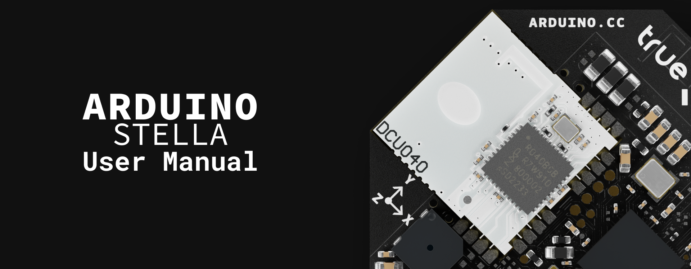

## Hardware and Software Requirements

### Hardware Requirements

- [Arduino Stella (SKU: ABX00131)](https://store.arduino.cc/products/stella) (x1)
- [Portenta UWB Shield (SKU: ASX00074)](https://store.arduino.cc/products/portenta-uwb-shield) (x1)
- [Portenta C33 (SKU: ABX00074)](https://store.arduino.cc/products/portenta-c33) (x1)
- [USB-C® cable (SKU: TPX00094)](https://store.arduino.cc/products/usb-cable2in1-type-c) (x2)
- CR2032 battery (x1) (optional)

### Software Requirements

- [Arduino IDE 2.0+](https://www.arduino.cc/en/software)
- [`StellaUWB` library](https://github.com/Truesense-it/StellaUWB) (designed for the Arduino Stella)
- [`PortentaUWBShield` library](https://github.com/Truesense-it/PortentaUWBShield) (designed for the Portenta UWB Shield)
- [`ArduinoBLE` library](https://github.com/arduino-libraries/ArduinoBLE) 
- [Arduino Mbed OS Stella Boards core](https://github.com/arduino/ArduinoCore-mbed) (required for the nRF52840 microcontroller of the Arduino Stella)

## Arduino Stella Overview

The Arduino Stella redefines location tracking with its advanced microcontroller, the nRF52840 from Nordic Semiconductor, and the [DCU040](https://ultrawideband.truesense.it/wp-content/uploads/2023/08/TRUESENSE-DCU040_Datasheet_DRAFT-V1.7.pdf) Ultra-Wide Band (UWB) module from Truesense. Tailored for modern tracking needs, the Arduino Stella excels in pinpointing warehouse assets, ensuring healthcare safety and automating smart buildings.

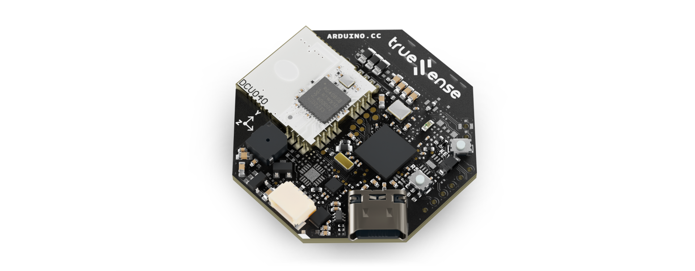

Seamlessly integrating with the Portenta UWB Shield and UWB-enabled smartphones through the dedicated NXP® Trimension™ App, Apple's Nearby Interaction APIs or Android's UWB Jetpack library, the Arduino Stella delivers robust finder functionality, precise point-to-point triggering and comprehensive tracking capabilities for applications demanding reliable, real-time location data.

### Understanding UWB Technology

Ultra-Wideband (UWB) is a radio technology that uses very low energy levels for short-range, high-bandwidth communications over a large portion of the radio spectrum. Unlike traditional narrowband radio systems like Bluetooth® or Wi-Fi®, which operate in specific frequency bands, UWB transmits across a wide range of frequency bands (typically 500 MHz or more), allowing for greater precision in location tracking and higher data throughput.

#### UWB vs. Traditional Narrowband Technologies

The fundamental difference between UWB and traditional wireless technologies (Wi-Fi®, Bluetooth®, Zigbee® and Cellular) lies in their transmission methods:

|   **Feature**  |   **Traditional Narrowband Radio**   |  **Ultra-Wideband Impulse Radio**  |
|:--------------:|:------------------------------------:|:----------------------------------:|
| Transmit Power |         Higher transmit power        |        Lower transmit power        |
| Initialization |      Slow startup/initialization     |     Fast startup/initialization    |
|     Latency    |             High latency             |          Very low latency          |
|     Ranging    | Poor ranging (signal strength based) | Excellent ranging (time of flight) |
|    Multipath   |       Poor multipath robustness      |   Very good multipath robustness   |

Traditional narrowband systems use frequency or amplitude modulation to send data, requiring a reference carrier frequency between the transmitter and the receiver. This slows down the initialization process and restricts data transmission speed. UWB, in contrast, uses impulse radio technology. This technology consists of short pulses of energy (typically less than 5 nanoseconds) spread across a wide frequency band, allowing quick link initialization and extremely fast data transmission.

#### Key Characteristics of UWB

- **High precision**: UWB can determine the relative position of devices with centimeter-level accuracy (typically 5-10 cm), far more precise than GPS (meters), Bluetooth® (1-3 meters) or Wi-Fi® (2-15 meters).
- **Low-power consumption**: Despite its high data rates, UWB consumes very little power, making it suitable for battery-operated devices like the Arduino Stella, which is optimized for energy efficiency.
- **Short range**: Typically effective within 10-30 meters, making it ideal for indoor positioning applications where GPS signals are weak or unavailable.
- **Strong security**: The unique physical layer characteristics of UWB, including its wide bandwidth and low power spectral density, make it more resistant to jamming, eavesdropping, and relay attacks compared to other wireless technologies.
- **Immunity to multipath fading**: The wide bandwidth of UWB signals makes them highly resistant to multipath interference, where signals bounce off surfaces and create echoes.
- **Coexistence with other standards**: Due to its low output spectral power, UWB can operate alongside other wireless technologies without causing interference—other radio systems interpret UWB signals simply as background noise.

#### Spectrum and Frequencies

UWB operates in specific frequency bands regulated by telecommunications authorities worldwide. The Arduino Stella's UWB module (DCU040) uses channels in the 6.0 to 8.5 GHz range, allowing for high bandwidth communication while minimizing interference with other wireless technologies. In general, UWB can operate in the 3.1-10.6 GHz range, with channel widths of 500 MHz or greater.

#### How UWB Technology Works

UWB primarily uses a technique called "Time of Flight" (ToF) or "Time Difference of Arrival" (TDoA) to determine the distance between UWB-enabled devices with extraordinary precision. In a nutshell, this technique consists of the following steps:

1. An UWB transmitter sends a signal with a precise timestamp.
2. An UWB receiver detects the signal and calculates the time it took to arrive.
3. Since radio waves travel at the speed of light (approximately 30 cm per nanosecond), the system can calculate the distance with high precision.

For even greater accuracy, UWB can use the "Two-Way Ranging" (TWR) technique, where devices exchange several messages to account for clock synchronization issues. In a nutshell, this technique consists of the following steps:

1. Device A sends a message to device B and records the time (T1).
2. Device B receives the message and sends a response after a known delay.
3. Device A receives the response and records the time (T2).
4. The round-trip time, minus processing delays, determines the distance.

The Arduino Stella is typically configured as a Controller/Initiator in Two-Way Ranging scenarios, initiating the ranging process with other UWB devices like the Portenta UWB Shield. This mobile tag functionality makes it perfect for applications where tracking the position of moving objects is required.

#### Low Latency Advantage

The impulse radio technology of UWB provides an inherent advantage in terms of latency. The data latency is very low since each pulse is extremely short (5 nanoseconds or less). Narrowband systems must modulate their carrier signals more slowly to maintain their frequency allocation, resulting in longer data latency and startup times.

In UWB systems, there's no need to establish a stable carrier signal for the receiver to lock onto, allowing data transmission to start immediately, representing a significant advantage for time-sensitive applications.

#### UWB System Components

In an UWB positioning system, devices typically operate in one of two roles:

- **Anchors**: Fixed-position devices (like the Portenta UWB Shield with a Portenta C33) that provide reference points for the positioning system. A minimum of three anchors is typically needed for 2D positioning and four for 3D positioning.
- **Tags**: Mobile devices that communicate with anchors to determine their position in space. The Arduino Stella is designed to function as a tag, with its compact form factor, battery operation and optimized power management, making it ideal for this role. Tags can also be integrated into smartphones, wearables or other IoT devices.

#### Applications of Arduino Stella with UWB Technology

The Arduino Stella's combination of UWB technology, compact form factor, and battery operation makes it ideal for numerous applications:

- **Asset tracking**: Attach Stella tags to valuable items in warehouses, hospitals, or construction sites to monitor their location with centimeter-level accuracy.
- **Wearable positioning**: Incorporate Arduino Stella into wearable devices for personnel tracking in industrial environments, healthcare settings, or event venues.
- **Robot and drone navigation**: Enable precise indoor navigation for autonomous systems where GPS is unavailable.
- **Social distancing solutions**: Create personal tags that can alert wearers when they come too close to others.
- **Interactive installations**: Power location-aware exhibits in museums or public spaces that respond to visitors' precise positions.
- **Sports performance analysis**: Track athletes' movements with high precision for training analysis and performance optimization.
- **Security applications**: Create authorized personnel tags that can trigger secure access systems only when physically present (resistant to relay attacks).
- **IoT sensor networks**: Deploy Arduino Stella devices as mobile sensor nodes that can report both environmental data and precise location information.

The Arduino Stella's programmability, combined with its UWB capabilities, accelerometer, and Bluetooth® connectivity, makes it an extremely versatile platform for developing innovative positioning solutions.

### Arduino Stella Architecture Overview

The Arduino Stella features a secure, certified and durable design that suits various applications, such as asset tracking, healthcare monitoring, smart building automation and consumer applications.

The top view of the Arduino Stella is shown in the image below:

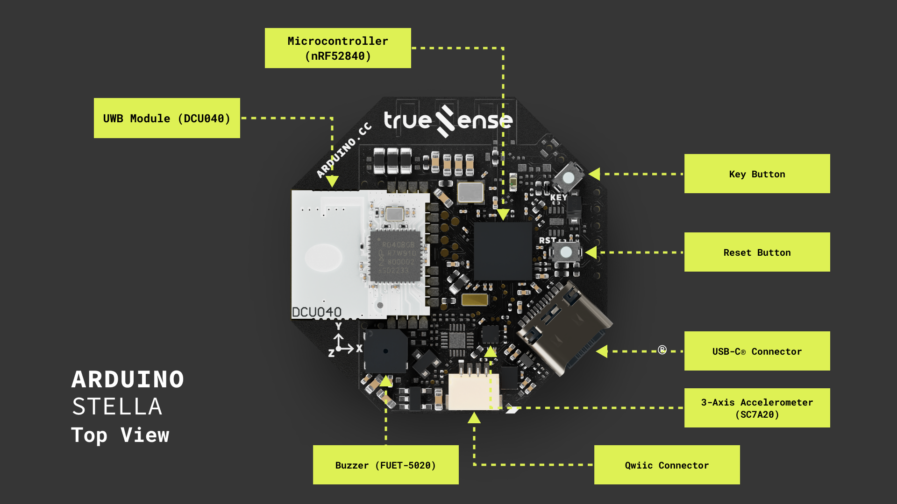

The bottom view of the Arduino Stella is shown in the image below:

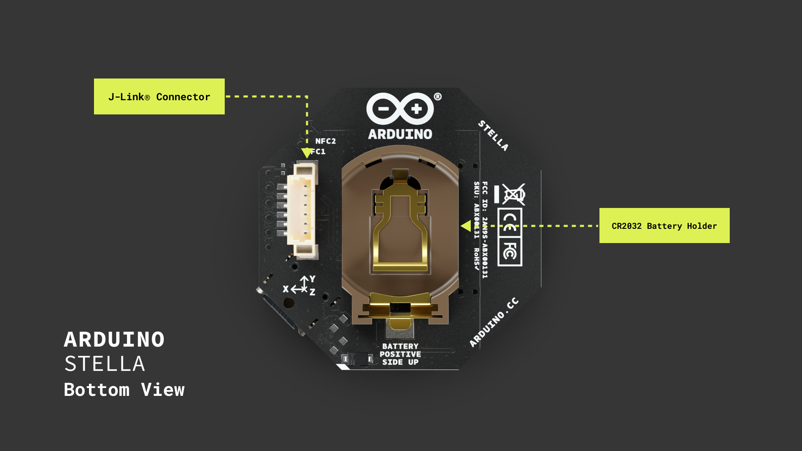

Here's an overview of the board's main components shown in the images:

- **Microcontroller**: At the heart of the Arduino Stella is the nRF52840 microcontroller from Nordic Semiconductor. This powerful 32-bit Arm® Cortex®-M4 processor runs at 64 MHz and features 1 MB Flash and 256 kB RAM, providing ample processing power and memory for sophisticated applications.
- **UWB Module**: The Truesense DCU040 module (based on the NXP® Trimension SR040 UWB IC) enables precise distance measurement with accuracy better than ±10 cm using two-way ranging techniques.
- **Connectivity**: Besides UWB, the Arduino Stella includes Bluetooth® 5.0 connectivity through the nRF52840's integrated radio, supporting IEEE 802.15.4-2006 and 2.4 GHz transceiver capabilities.
- **Accelerometer**: A 3-axis MEMS digital output accelerometer (SC7A20) enhances the board's motion detection capabilities, with programmable sensitivity ranges of ±2G/±4G/±8G/±16G and features like orientation detection, free-fall detection, and click detection.
- **User interfaces**: The board includes a user-programmable button, a user-programmable LED and a buzzer (FUET-5020) that can be used for audible alerts.
- **Connectors**: The Arduino Stella features a USB-C port for power and data, a QWIIC connector for I²C expansion, a CR2032 battery holder and a J-Link connector for debugging and alternative power input.

### Board Libraries

The Arduino Stella and Portenta UWB Shield use different libraries and board cores due to their different microcontrollers and onboard UWB modules:

#### Arduino Stella Library

The [`StellaUWB` library](https://github.com/Truesense-it/StellaUWB) contains an application programming interface (API) to read data from the Arduino Stella and control its parameters and behavior. This library is designed to work with the DCU040 module on the Arduino Stella and supports the following:

- One-way ranging (Time Difference of Arrival - TDoA) and two-way ranging (TWR).
- Power management for battery-efficient operation.
- Accelerometer control for motion detection.
- Bluetooth® Low Energy connectivity for configuration and communication.

***The [Arduino Mbed OS Stella Boards core](https://github.com/arduino/ArduinoCore-mbed) is required to work with the Arduino Stella's nRF52840 microcontroller.***

#### Portenta UWB Shield Library

If you plan to use the Arduino Stella with a Portenta UWB Shield for two-way ranging, you'll also need the [`PortentaUWBShield` library](https://github.com/Truesense-it/PortentaUWBShield) for the Portenta UWB Shield. This library is specifically designed for the DCU150 module used in the shield.

***The [Arduino Renesas Portenta Boards core](https://github.com/arduino/ArduinoCore-renesas) is required to work with the Portenta C33 board that hosts the UWB Shield.***

#### Bluetooth® Communication

For examples that use Bluetooth® Low Energy communication, you'll also need the [`ArduinoBLE` library](https://github.com/arduino/ArduinoBLE). This library enables Bluetooth® Low Energy functionality for device discovery and initial connection setup before UWB ranging begins.

#### Installing the Libraries

To install the required libraries, follow these steps:

**Step 1: Download the library ZIP file**

- Visit the library's GitHub repository using the links provided above
- Click the green Code button
- Select Download ZIP from the dropdown menu
- Save the ZIP file to your computer

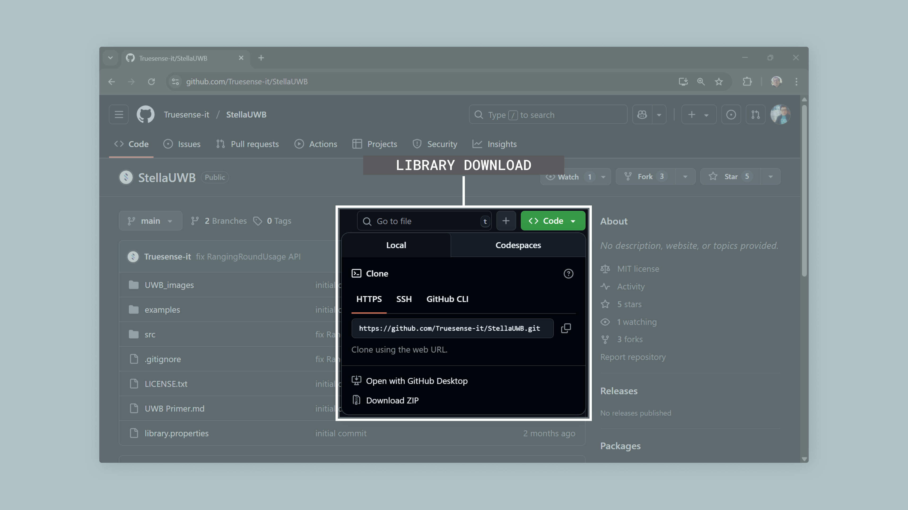

**Step 2: Install the library in Arduino IDE**

- Open the Arduino IDE
- Navigate to `Sketch > Include Library > Add .ZIP Library...`
- Browse to the location where you saved the ZIP file
- Select the ZIP file and click Open
- The library will be automatically installed and ready to use

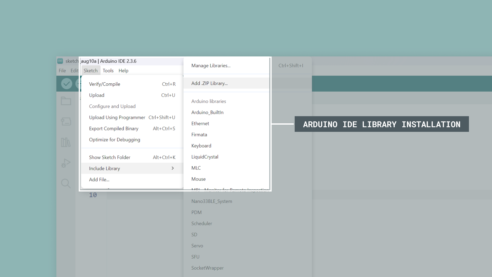

**Step 3: Verify the library installation**

- Go to `Sketch > Include Library`
- Scroll down to see if the library appears in the `Contributed libraries` list
- You can also check `File > Examples` to see if example sketches from the library are available

#### Installing the Board Cores

To install the required board cores:

- Navigate to Tools > Board > Boards Manager...
- For the Arduino Stella, search for `Arduino Mbed OS Stella Boards` and install the latest version
- For the Portenta C33 board, search for `Arduino Renesas Portenta Boards` and install the latest version

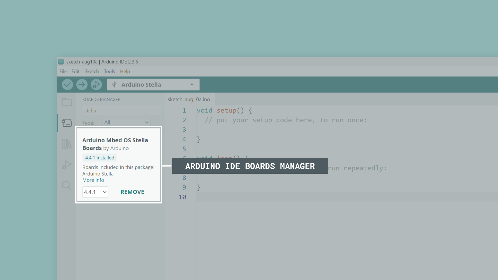

***<strong>Important note:</strong> Make sure to install both the appropriate library and board core for your specific hardware. The Arduino Stella requires the `StellaUWB` library and `Arduino Mbed OS Stella Boards` core, while the Portenta UWB Shield with the Portenta C33 board requires the `PortentaUWBShield` library and the `Arduino Renesas Portenta Boards` core.***

### Pinout

The full pinout is available and downloadable as PDF from the link below:

- [Arduino Stella pinout](https://docs.arduino.cc/resources/pinouts/ABX00131-full-pinout.pdf)

### Datasheet

The complete datasheet is available and downloadable as PDF from the link below:

- [Arduino Stella datasheet](https://docs.arduino.cc/resources/datasheets/ABX00131-datasheet.pdf)

### Schematics

The complete schematics are available and downloadable as PDF from the link below:

- [Arduino Stella schematics](https://docs.arduino.cc/resources/schematics/ABX00131-schematics.pdf)

### STEP Files 

The complete STEP files are available and downloadable from the link below:

- [Arduino Stella STEP files](../../downloads/ABX00131-step.zip)

## First Use

### Unboxing the Product

When you open the box of the Arduino Stella, you will find the board itself with its distinctive octagonal shape, featuring a USB-C port on one edge. The Arduino Stella is a compact board with dimensions of 38 mm x 38 mm, designed to be easily integrated into various tracking applications.

The Arduino Stella comes ready to use, but you may want to add a CR2032 battery if you plan to use it in portable applications that require battery power.

### Powering the Board

The Arduino Stella can be powered through one of these interfaces:

The Arduino Stella can be powered through its USB-C port or Qwiic connector for stationary applications. The USB-C port is the simplest and most common method, providing a stable +5 VDC power source when connected to a computer or wall adapter. The Qwiic connector can also supply power when connecting the board to a system that provides power through the Qwiic bus, enabling integration with other Qwiic-compatible components.

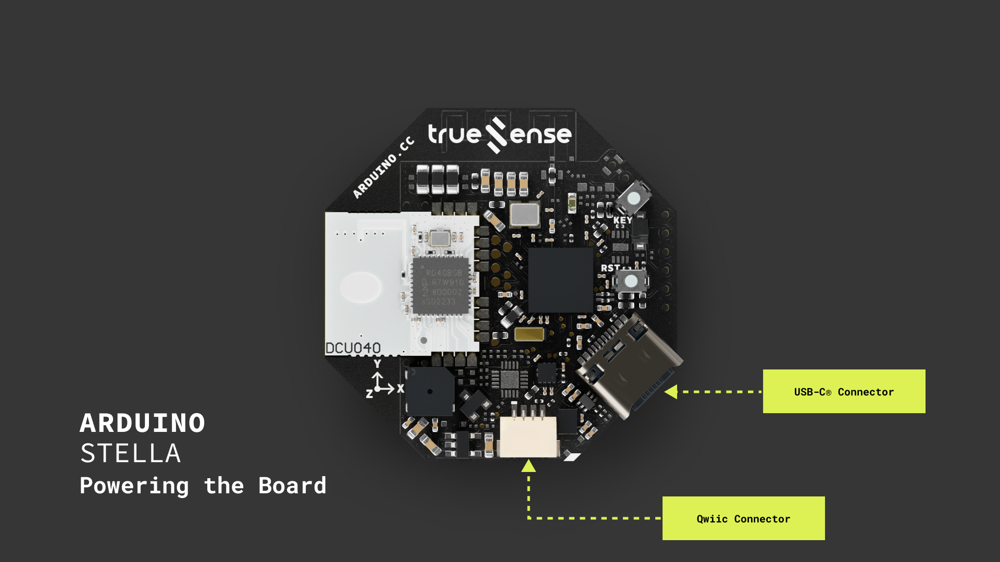

For portable and wireless applications, the Arduino Stella offers two additional power options: the onboard CR2032 battery holder. The CR2032 battery holder allows you to install a +3 VDC coin cell battery, making the board completely wireless for mobile projects. The J-Link connector, while primarily used for debugging purposes, can also serve as a power input when needed.

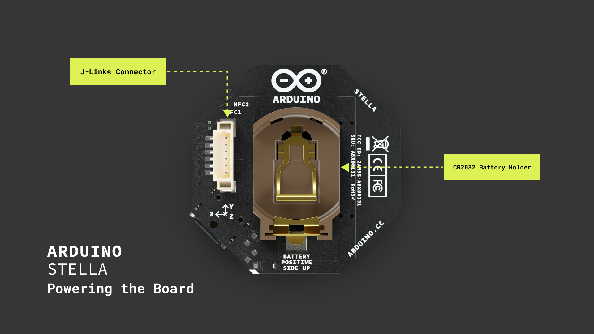

***__Important note__: When using battery power, ensure the correct polarity when inserting the CR2032 battery into the holder. The positive (+) side should face up, away from the PCB, as shown in the image below.***

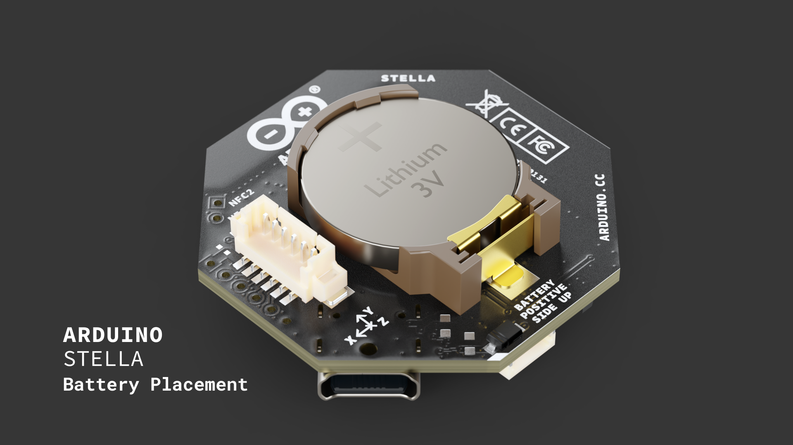

***__Warning:__ When using Arduino Stella with USB-C power, remove the CR2032 battery; never power the Arduino Stella from both battery and USB simultaneously. The board is designed to prioritize USB power when connected. Removing the battery when working with USB will extend its life, ensure the most reliable operation and maximize battery lifespan.***

### Connecting to Your Computer

To program the Arduino Stella, connect it to your computer using a USB-C cable:

1. Insert the USB-C connector into the port on the Arduino Stella.
2. Connect the other end to an available USB port on your computer.

Once connected, you should see a power indicator light up on the board, indicating it's receiving power from the USB port.

### Nearby World Example

Let's use the Arduino Stella to create a real-time distance measurement system using UWB technology. We will implement what we call the `Nearby World` example, which serves as our `Hello World` sketch for UWB technology. This example will verify the Arduino Stella's UWB capabilities and its ability to communicate with UWB-enabled smartphones.

***This example sketch leverages Apple's Nearby Interaction protocol and similar UWB implementations on Android devices to establish a communication channel between the Arduino Stella and a UWB-enabled smartphone, allowing precise distance and angle measurements.***

#### How It Works

The `Nearby World` example demonstrates the core functionality of UWB technology through a simple example sketch that can be described in the following key steps:

1. **Bluetooth® Low Energy connection setup**: The Arduino Stella broadcasts using Bluetooth® Low Energy to make itself discoverable to compatible smartphone apps.
2. **Configuration exchange**: The Bluetooth® Low Energy connection is used to exchange necessary UWB configuration parameters between the Arduino Stella and the smartphone.
3. **UWB ranging**: Once configured, the actual UWB ranging session begins, providing precise distance measurements.
4. **Real-time feedback**: Distance data is continuously updated and can be viewed both on the IDE's Serial Monitor and on the smartphone app.

This process demonstrates the working principle of many UWB applications, where Bluetooth® Low Energy is used primarily for discovery and configuration, while UWB handles the precise ranging.

#### Uploading the Sketch

**Step 1: Verify Board Selection**

Before uploading any code to the Arduino Stella, ensure you have selected the correct board:

1. Connect the Arduino Stella to your computer using a USB-C cable
2. Open the Arduino IDE
3. **Critical:** Navigate to `Tools > Board > Arduino Mbed OS Stella Boards > Arduino Stella`
4. Verify the correct port is selected in `Tools > Port`

***__Important note__: Do not select `Arduino BLE Sense 33`, `Portenta C33` or any other board when programming the Arduino Stella. This will cause compilation errors.***

**Step 2: Upload the Sketch**

Copy and paste the example sketch below into a new sketch in the Arduino IDE:

```arduino 
/**
  Nearby World Example for Arduino Stella
  Name: arduino_stella_nearby_world.ino
  Purpose: This sketch demonstrates how to use the Arduino Stella
  to measure distance between the board and a UWB-enabled smartphone.
  
  Compatible with:
  - NXP Trimensions AR (iOS)
  - Qorvo Nearby Interaction (iOS)
  - NXP Android demo
  - Truesense Android demo
  
  @author Arduino Product Experience Team
  @version 1.0 15/04/25
*/

// Include required libraries
#include <ArduinoBLE.h>
#include <StellaUWB.h>

// Track the number of connected Bluetooth Low Energy clients
uint16_t numConnected = 0;

/**
  Processes ranging data received from UWB communication.
  @param rangingData Reference to UWB ranging data object.
*/
void rangingHandler(UWBRangingData &rangingData) {
  Serial.print("- GOT RANGING DATA - Type: ");
  Serial.println(rangingData.measureType());

  // Nearby interaction uses Double-sided Two-way Ranging method
  if(rangingData.measureType() == (uint8_t)uwb::MeasurementType::TWO_WAY) {
    // Get the TWR (Two-Way Ranging) measurements
    RangingMeasures twr = rangingData.twoWayRangingMeasure();
    
    // Loop through all available measurements
    for(int j = 0; j < rangingData.available(); j++) {
      // Only process valid measurements
      if(twr[j].status == 0 && twr[j].distance != 0xFFFF) {
        // Display the distance measurement in millimeters
        Serial.print("- Distance: ");
        Serial.println(twr[j].distance);  
      }
    }
  }
}

/**
  Handles new Bluetooth Low Energy client connection events.
  @param dev The connecting Bluetooth Low Energy device.
*/
void clientConnected(BLEDevice dev) {
  // Initialize UWB stack on first connection
  if (numConnected == 0) {
    UWB.begin();  // Start the UWB engine
  }
  // Increment connected clients counter
  numConnected++;
  Serial.println("- Client connected!");
}

/**
  Handles Bluetooth Low Energy client disconnection events.
  @param dev The disconnecting Bluetooth Low Energy device.
*/
void clientDisconnected(BLEDevice dev) {
  // Decrement connected clients counter
  numConnected--;
  // Shut down UWB when no clients are connected
  if(numConnected == 0) {
    UWB.end();
  }
  Serial.println("- Client disconnected!");
}

/**
  Handles UWB session start events.
  @param dev The Bluetooth Low Energy device starting the session.
*/
void sessionStarted(BLEDevice dev) {
  Serial.println("- Session started!");
}

/**
  Handles UWB session termination events.
  @param dev The Bluetooth Low Energy device ending the session.
*/
void sessionStopped(BLEDevice dev) {
  Serial.println("- Session stopped!");
}

void setup() {
  // Initialize serial communication at 115200 bits per second
  Serial.begin(115200);
  
  // Initialize the onboard LED
  pinMode(LED_BUILTIN, OUTPUT);
  digitalWrite(LED_BUILTIN, LOW);

  Serial.println("- Nearby interaction app start...");
  
  // Register callback handlers
  UWB.registerRangingCallback(rangingHandler);
  UWBNearbySessionManager.onConnect(clientConnected);
  UWBNearbySessionManager.onDisconnect(clientDisconnected);
  UWBNearbySessionManager.onSessionStart(sessionStarted);
  UWBNearbySessionManager.onSessionStop(sessionStopped);
  
  // Initialize Bluetooth Low Energy services and start advertising
  UWBNearbySessionManager.begin("Arduino Stella");
}

void loop() {
  // Small delay to prevent CPU overload
  delay(100);
  
  // Process Bluetooth Low Energy events
  UWBNearbySessionManager.poll();
}
```

To upload the sketch to the Arduino Stella, click the **Verify** button to compile the sketch and check for errors, then click the **Upload** button to program the device with the example sketch.

Once the sketch is uploaded, open the Serial Monitor by clicking on the icon in the top right corner of the Arduino IDE. You should see the message `- Nearby interaction app start...` in the IDE's Serial Monitor. When a smartphone connects, you'll see `Client connected!` followed by `Session started!` and then real-time distance measurements in millimeters. If no device connects, only the initialization message will be displayed.

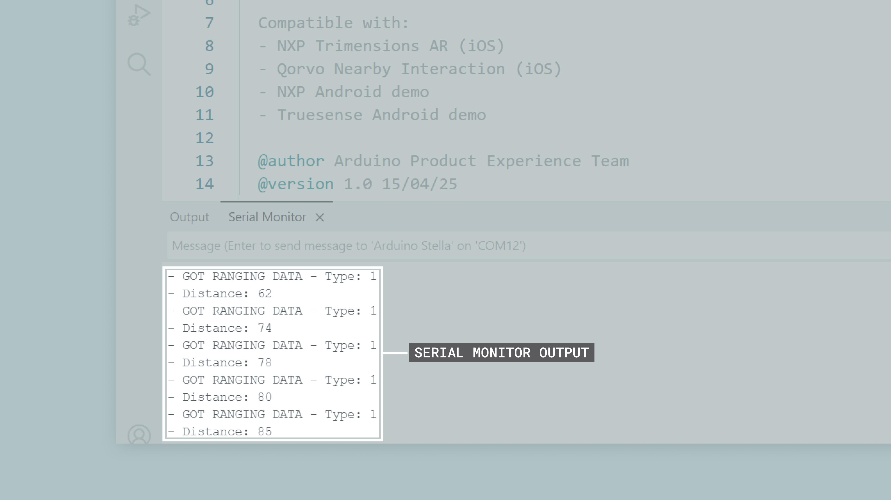


#### Try It Yourself

To complete the test, you will need a UWB-enabled smartphone with one of the compatible applications installed:

**For iPhone (iPhone 11 or newer with UWB capability):**

- [NXP® Trimensions AR](https://apps.apple.com/us/app/nxp-trimensions-ar/id1606143205)
- [Qorvo Nearby Interaction](https://apps.apple.com/us/app/qorvo-nearby-interaction/id1615369084)

**For Android (UWB-enabled Android devices):**

- [Truesense Android demo](https://github.com/Truesense-it/TSUwbDemo-Android)
- [NXP® Android demo](https://github.com/nxp-uwb/UWBJetpackExample)

***__Important note for Android devices:__ If Developer Options is currently enabled on your Android device, please ensure all radio-related options remain at their default settings. We recommend keeping Developer Options disabled for optimal UWB functionality. If you previously enabled it, consider disabling it for the most stable device operation.***

Install one of these apps on your smartphone and follow these steps:

1. Open the app on your smartphone
2. Look for a device named `Arduino Stella` in the app's device list
3. Connect to the device
4. Once connected, the app will initiate a UWB ranging session
5. Move your phone closer to and further from the Arduino Stella

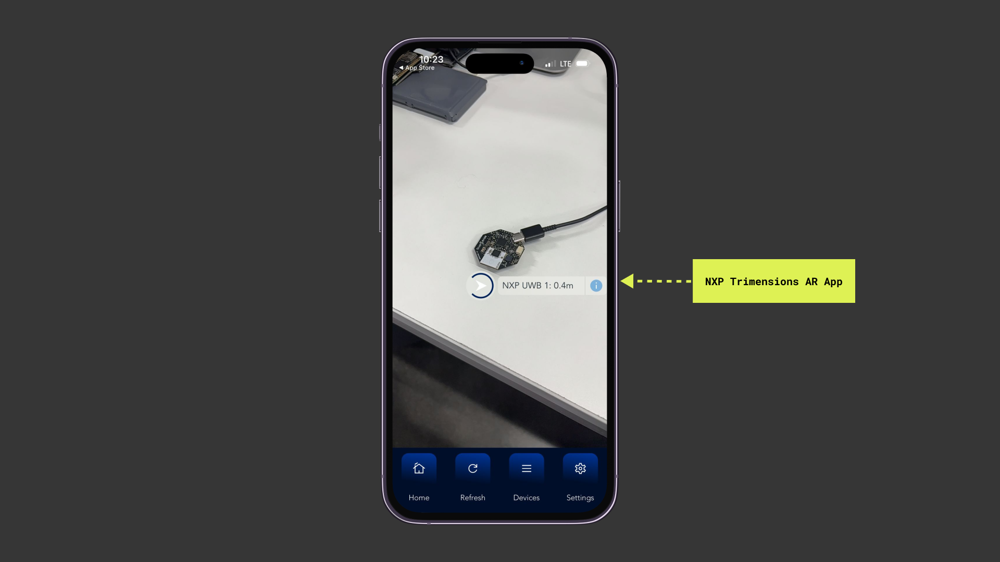

The smartphone app shows the connection status and continuously updates the distance measurement as you move the phone. Both the app and the Serial Monitor display synchronized measurements in millimeters. 

You should see the distance measurements updating in real-time both on your smartphone app and in the IDE's Serial Monitor. The distances are shown in millimeters, providing centimeter-level accuracy characteristic of UWB technology.

## NearbyDemo Example

### About the NearbyDemo Example

***__Before you begin__: Ensure you have selected `Tools > Board > Arduino Mbed OS Stella Boards > Arduino Stella` in the Arduino IDE. Selecting the wrong board (like `Arduino BLE Sense 33` or the `Portenta C33`) will prevent this code from compiling.***

The `NearbyDemo` example sketch demonstrates how to implement distance measurement between the Arduino Stella and UWB-enabled smartphones using Apple's Nearby Interaction protocol or compatible Android implementations. This example showcases how Bluetooth® Low Energy is used for initial device discovery and configuration exchange, while UWB handles the precise distance measurements.

This example demonstrates the following:

- **Hybrid communication protocol**: Integration of Bluetooth® Low Energy for device discovery and configuration with UWB for precise distance measurements
- **Standards compatibility**: Compatible with Apple's Nearby Interaction API and Android UWB implementations
- **Power-efficient design**: UWB subsystem only activates when a client connects, conserving battery life
- **Multi-client support**: Can handle connections from multiple smartphones simultaneously

Real-world applications for this example include:

- **Asset tracking**: Precisely locate Arduino Stella devices attached to valuable items using smartphones
- **Smart building automation**: Implement room-level presence detection for environmental control
- **Healthcare**: Track movement of equipment and personnel with smartphone-based monitoring
- **Retail analytics**: Analyze customer movement patterns using their smartphones
- **Consumer item finding**: Create smartphone-compatible tags for locating misplaced items

Here's the complete code for the `NearbyDemo` example sketch:

```arduino
/**
  NearbyDemo Example for Arduino Stella
  Name: arduino_stella_nearbydemo.ino
  Purpose: This sketch demonstrates how to use the Arduino Stella
  to measure distance between the board and UWB-enabled smartphones.
  
  Compatible with:
  - NXP Trimensions AR (iOS)
  - Qorvo Nearby Interaction (iOS)
  - NXP Android demo
  - Truesense Android demo
  
  @author Arduino Product Experience Team
  @version 1.0 15/04/25
*/

// Include required libraries
#include <ArduinoBLE.h>
#include <StellaUWB.h>

// Track the number of connected Bluetooth Low Energy clients
uint16_t numConnected = 0;

/**
  Processes ranging data received from UWB communication.
  @param rangingData Reference to UWB ranging data object.
*/
void rangingHandler(UWBRangingData &rangingData) {
  Serial.print("- GOT RANGING DATA - Type: ");
  Serial.println(rangingData.measureType());

  // Nearby interaction uses Double-sided Two-way Ranging method
  if(rangingData.measureType() == (uint8_t)uwb::MeasurementType::TWO_WAY) {
    // Get the TWR (Two-Way Ranging) measurements
    RangingMeasures twr = rangingData.twoWayRangingMeasure();
    
    // Loop through all available measurements
    for(int j = 0; j < rangingData.available(); j++) {
      // Only process valid measurements
      if(twr[j].status == 0 && twr[j].distance != 0xFFFF) {
        // Display the distance measurement in millimeters
        Serial.print("- Distance: ");
        Serial.println(twr[j].distance);  
      }
    }
  }
}

/**
  Handles new Bluetooth Low Energy client connection events.
  @param dev The connecting Bluetooth Low Energy device.
*/
void clientConnected(BLEDevice dev) {
  // Initialize UWB stack on first connection
  if (numConnected == 0) {
    UWB.begin();  // Start the UWB engine
  }
  // Increment connected clients counter
  numConnected++;
  Serial.println("- Client connected!");
}

/**
  Handles Bluetooth Low Energy client disconnection events.
  @param dev The disconnecting Bluetooth Low Energy device.
*/
void clientDisconnected(BLEDevice dev) {
  // Decrement connected clients counter
  numConnected--;
  // Shut down UWB when no clients are connected
  if(numConnected == 0) {
    UWB.end();
  }
  Serial.println("- Client disconnected!");
}

/**
  Handles UWB session start events.
  @param dev The Bluetooth Low Energy device starting the session.
*/
void sessionStarted(BLEDevice dev) {
  Serial.println("- Session started!");
}

/**
  Handles UWB session termination events.
  @param dev The Bluetooth Low Energy device ending the session.
*/
void sessionStopped(BLEDevice dev) {
  Serial.println("- Session stopped!");
}

void setup() {
  // Initialize serial communication at 115200 bits per second
  Serial.begin(115200);

  #if defined(ARDUINO_PORTENTA_C33)
    // Only the Portenta C33 has an RGB LED
    pinMode(LEDR, OUTPUT);
    digitalWrite(LEDR, LOW);
  #endif

  Serial.println("- Nearby interaction app start...");

  // Register callback handlers
  UWB.registerRangingCallback(rangingHandler);
  UWBNearbySessionManager.onConnect(clientConnected);
  UWBNearbySessionManager.onDisconnect(clientDisconnected);
  UWBNearbySessionManager.onSessionStart(sessionStarted);
  UWBNearbySessionManager.onSessionStop(sessionStopped);

  // Initialize Bluetooth Low Energy services and start advertising
  UWBNearbySessionManager.begin("TS_DCU040");
}

void loop() {
  // Small delay to prevent CPU overload
  delay(100);
  
  // Process Bluetooth Low Energy events
  UWBNearbySessionManager.poll();
}
```

Once the example sketch is uploaded and a smartphone connects to the Arduino Stella, the IDE's Serial Monitor will display the connection and ranging information:


The Serial Monitor shows the initialization message, followed by `- Client connected!` when a smartphone establishes a Bluetooth® Low Energy connection. Only after the connection is established will you see session status and real-time distance measurements in millimeters. If no device connects, you will only see the initial "Nearby interaction app start..." message waiting for a connection.

***__Important note__: Distance measurements only appear __after__ a successful connection with a UWB-enabled smartphone. Without a connection, the Serial Monitor will only show the initialization message.***

### Key Components of the Example Sketch

The `NearbyDemo` code implements an event-driven architecture using callback functions to handle various stages of the UWB communication process. Let's examine the main components:

- **Libraries and Global Variables**
   
```arduino
#include <ArduinoBLE.h>
#include <StellaUWB.h>

uint16_t numConnected = 0;
```

The example sketch uses two important libraries for its operation:

- `ArduinoBLE`: Provides Bluetooth® Low Energy functionality for device discovery and initial connection.
- `StellaUWB`: The core library that enables interaction with the onboard UWB module of the Arduino Stella.

The `numConnected` variable tracks how many Bluetooth® Low Energy clients are currently connected to the Arduino Stella.

- **Ranging Data Handler**

The heart of the UWB functionality resides in the ranging callback:

```arduino
void rangingHandler(UWBRangingData &rangingData) {
  if(rangingData.measureType() == (uint8_t)uwb::MeasurementType::TWO_WAY) {
    RangingMeasures twr = rangingData.twoWayRangingMeasure();
    // Process measurements...
  }
}
```

This function processes incoming distance measurements, validates the data integrity, and outputs results to the IDE's Serial Monitor. The validation checks ensure only valid measurements are displayed (`status = 0` and `distance ≠ 0xFFFF`).

- **Connection Management**

The connection callbacks manage the UWB subsystem lifecycle efficiently:

```arduino
void clientConnected(BLEDevice dev) {
  if (numConnected == 0) {
    UWB.begin(); 
  }
  numConnected++;
}
```

This power-saving approach ensures the UWB hardware only activates when needed, extending battery life in portable applications.

- **Session Management**

```arduino
void sessionStarted(BLEDevice dev) {
  Serial.println("- Session started!");
}
```

These functions provide feedback about the session lifecycle, helping developers understand the connection state during debugging.

- **Setup and Initialization**

The setup function registers all callbacks and starts Bluetooth® Low Energy advertising:

```arduino
void setup() {
  // Register all callbacks
  UWB.registerRangingCallback(rangingHandler);
  UWBNearbySessionManager.onConnect(clientConnected);
  // ... other callbacks
  
  // Start advertising with device name
  UWBNearbySessionManager.begin("Arduino Stella");
}
```

The device name "Arduino Stella" appears in smartphone apps when scanning for available UWB devices.

- **Main Loop**

The main loop maintains the Bluetooth® Low Energy connection:


```arduino
void loop() {
  delay(100);
  UWBNearbySessionManager.poll();
}
```

The `poll()` function processes Bluetooth® Low Energy events while the actual UWB ranging occurs asynchronously through callbacks.

### Testing with Smartphones

To test this example with a UWB-enabled smartphone:

1. Upload the sketch to your Arduino Stella
2. Open the IDE's Serial Monitor at 115200 baud
3. Install a compatible app on your smartphone:

- **For iOS**: NXP® Trimensions AR or Qorvo Nearby Interaction
- **For Android**: Truesense or NXP® UWB demo apps

4. Connect to the device named "Arduino Stella" in the app
5. Move your phone to see distance measurements update in real-time


The smartphone app displays the connection status and real-time distance to the Arduino Stella. Once connected, both the app and the IDE's Serial Monitor will show synchronized distance measurements as you move the phone. The distance measurements are displayed in millimeters, providing centimeter-level accuracy. For example, a reading of "Distance: 80" indicates approximately 8 cm between devices.

***__Important note__: If the connection fails or no measurements appear, verify that your smartphone has UWB enabled and that the Arduino Stella is powered on and running the sketch.***

### Extending the Example Sketch

The `NearbyDemo` example sketch provides a great foundation that you can build upon for more complex projects. Some possible extensions of this example sketch include the following:

- **Visual feedback**: Add LED patterns based on distance thresholds
- **Audio alerts**: Implement buzzer feedback for proximity warnings
- **Motion detection**: Combine accelerometer data with ranging for activity monitoring
- **Data logging**: Record distance measurements for analysis
- **Custom device names**: Modify the advertising name for multiple device deployments

The event-driven architecture makes it easy to add features without disrupting the core ranging functionality.

## Two-Way Ranging Example


### About the Two-Way Ranging Example

**📋 Hardware Setup Reminder:**

- **For the Arduino Stella:** Select `Tools > Board > Arduino Mbed OS Stella Boards > Arduino Stella` on the Arduino IDE
- **For the Portenta C33 board and the UWB Shield:** Select `Tools > Board > Arduino Renesas Portenta Boards > Portenta C33` on the Arduino IDE

The Two-Way Ranging example demonstrates direct UWB communication between two Arduino devices: the Arduino Stella (acting as a Controller/Initiator) and the Portenta UWB Shield (acting as a Controlee/Responder). This example showcases the fundamental distance measurement capabilities of UWB technology in a dedicated device-to-device setup without requiring external UWB-enabled consumer devices such as smartphones.

***__Important note__: In UWB communication, the terms "Controller" and "Controlee" refer to specific roles within a ranging session. A __Controller__ (also called an Initiator) is the device that initiates and controls the ranging process, sending the initial signal and managing the timing of exchanges. A __Controlee__ (also called a Responder) is the device that responds to the Controller's signals. These terms are used interchangeably in UWB documentation: Controller/Initiator and Controlee/Responder refer to the same roles. In positioning systems, Controllers/Initiators often correspond to mobile "tags" while Controlees/Responders often serve as stationary "anchors".***

This example demonstrates the following:

- **Direct device-to-device communication:** Unlike the `NearbyDemo` example, which requires a smartphone, this example establishes direct UWB communication between two UWB-enabled Arduino devices.
- **Controller-Controlee architecture:** It shows how to configure one device as a Controller (initiator of the ranging) and another as a Controlee (responder).
- **Double-Sided Two-Way Ranging (DS-TWR):** This technique provides higher accuracy in distance measurements by accounting for clock drift between devices.
- **Visual feedback system**: Both devices provide LED feedback to indicate connection status and distance measurements.
- **Real-time distance visualization**: The Portenta displays both raw measurements and smoothed moving average for analysis.

Some of the real-life applications for this example include:

- **Multi-node positioning systems**: Creating networks of UWB nodes for advanced indoor positioning.
- **Robot navigation**: Enabling precise distance measurements between robots or between robots and fixed stations.
- **Asset tracking**: Building custom tracking solutions with multiple Arduino-based UWB anchors.
- **Proximity detection systems**: Creating safety systems that can detect precise distances between industrial equipment and personnel.
- **Access control systems**: Implementing secure entry systems based on precise proximity detection.
- **Interactive installations**: Enabling position-based interactive exhibits in museums or public spaces

Here's the code for the Arduino Stella, which acts as the Controller (Initiator) in this Two-Way Ranging scenario.

**📋 Board Selection Check:** Ensure `Arduino Stella` is selected in the Arduino IDE before uploading this code.

```arduino
/**
  Two-Way Ranging Controller Example for Arduino Stella
  Name: stella_uwb_twr_controller.ino
  Purpose: This sketch configures the Arduino Stella as a Controller (Initiator)
  for Two-Way Ranging with a Portenta UWB Shield configured as Controlee.
  The LED provides visual feedback based on measured distance.
  
  @author Arduino Product Experience Team
  @version 1.0 15/04/25
*/

// Include required UWB library
#include <StellaUWB.h>

// Pin definitions
#define LED_PIN p37  // Stella's built-in LED for status indication

// Distance and timing parameters
#define MAX_DISTANCE 300     // Maximum distance to consider (cm)
#define MIN_BLINK_TIME 50    // Fastest blink rate (ms)
#define MAX_BLINK_TIME 1000  // Slowest blink rate (ms)
#define TIMEOUT_MS 2000      // Connection timeout (ms)

// System state variables
unsigned long lastBlink = 0;
unsigned long lastMeasurement = 0;
bool ledState = false;
int currentBlinkInterval = MAX_BLINK_TIME;
long lastDistance = MAX_DISTANCE;

/**
  Processes ranging data received from UWB communication.
  Updates LED feedback based on measured distance.
  @param rangingData Reference to UWB ranging data object.
*/
void rangingHandler(UWBRangingData &rangingData) {
  if (rangingData.measureType() == (uint8_t)uwb::MeasurementType::TWO_WAY) {
    // Get the TWR (Two-Way Ranging) measurements
    RangingMeasures twr = rangingData.twoWayRangingMeasure();

    // Loop through all available measurements
    for (int j = 0; j < rangingData.available(); j++) {
      // Only process valid measurements
      if (twr[j].status == 0 && twr[j].distance != 0xFFFF) {
        // Update timing and distance tracking
        lastMeasurement = millis();
        lastDistance = twr[j].distance;

        // Calculate blink interval based on distance
        // Closer distance = faster blink
        if (lastDistance > MAX_DISTANCE) {
          currentBlinkInterval = MAX_BLINK_TIME;
        } else {
          // Map distance to blink interval
          currentBlinkInterval = map(lastDistance,
                                    0, MAX_DISTANCE,
                                    MIN_BLINK_TIME, MAX_BLINK_TIME);
        }

        // Display the distance measurement in centimeters
        Serial.print("- Distance (cm): ");
        Serial.println(lastDistance);
      }
    }
  }
}

void setup() {
  // Initialize serial communication at 115200 bits per second
  Serial.begin(115200);

  // Configure LED pin
  pinMode(LED_PIN, OUTPUT);
  digitalWrite(LED_PIN, HIGH);  // Start with LED off

  Serial.println("- Arduino Stella - Two-Way Ranging Controller started...");
  
  // Define MAC addresses for this device and the target
  // This device (Controller) has address 0x2222
  // Target device (Controlee) has address 0x1111
  uint8_t devAddr[] = {0x22, 0x22};
  uint8_t destination[] = {0x11, 0x11};
  UWBMacAddress srcAddr(UWBMacAddress::Size::SHORT, devAddr);
  UWBMacAddress dstAddr(UWBMacAddress::Size::SHORT, destination);

  // Register the callback and start UWB
  UWB.registerRangingCallback(rangingHandler);
  UWB.begin();
  
  Serial.println("- Starting UWB...");
  
  // Wait until UWB stack is initialized
  while (UWB.state() != 0) {
    delay(10);
  }

  // Setup and start the UWB session using simplified UWBTracker
  Serial.println("- Starting session...");
  UWBTracker myTracker(0x11223344, srcAddr, dstAddr);
  UWBSessionManager.addSession(myTracker);
  myTracker.init();
  myTracker.start();

  // Signal initialization complete with triple LED flash
  Serial.println("- Initialization complete!");
  for (int i = 0; i < 3; i++) {
    digitalWrite(LED_PIN, LOW);   // LED ON
    delay(100);
    digitalWrite(LED_PIN, HIGH);  // LED OFF
    delay(100);
  }
}

void loop() {
  unsigned long currentTime = millis();

  // Handle LED feedback based on connection status and distance
  if (currentTime - lastMeasurement > TIMEOUT_MS) {
    // No connection detected - rapid blink warning
    if (currentTime - lastBlink >= 100) {
      lastBlink = currentTime;
      ledState = !ledState;
      digitalWrite(LED_PIN, ledState ? LOW : HIGH);
    }
  } else {
    // Normal operation - distance-based blink rate
    if (currentTime - lastBlink >= currentBlinkInterval) {
      lastBlink = currentTime;
      ledState = !ledState;
      digitalWrite(LED_PIN, ledState ? LOW : HIGH);
    }
  }

  // Small delay to prevent CPU overload
  delay(10);
}
```

Here's the code for the Portenta UWB Shield, which acts as the Controlee (Responder) in this Two-Way Ranging scenario:

**📋 Board Selection Check:** Ensure `Portenta C33` is selected in the Arduino IDE before uploading this code.

```arduino
/**
  Two-Way Ranging Controlee Example for Portenta UWB Shield
  Name: portenta_uwb_twr_controlee.ino
  Purpose: This sketch configures the Portenta UWB Shield as a Controlee (Responder)
  for Two-Way Ranging with an Arduino Stella configured as Controller.
  Includes distance visualization and moving average calculation.
  
  @author Arduino Product Experience Team
  @version 1.0 15/04/25
*/

// Include required UWB library
#include <PortentaUWBShield.h>

// Moving average configuration
#define SAMPLES 10                // Number of samples for moving average
long distances[SAMPLES] = {0};    // Circular buffer for distance measurements
int sample_index = 0;              // Current position in circular buffer

// LED and status configuration
#define NEARBY_THRESHOLD 300       // Distance threshold for green LED (cm)
#define CONNECTION_TIMEOUT 2000    // Time before considering tag lost (ms)
#define LED_BLINK_INTERVAL 500     // Red LED blink interval (ms)

// System state variables
unsigned long lastMeasurement = 0;
unsigned long lastLedBlink = 0;
bool ledState = false;

/**
  Processes ranging data received from UWB communication.
  Calculates moving average and provides visual feedback.
  @param rangingData Reference to UWB ranging data object.
*/
void rangingHandler(UWBRangingData &rangingData) {
  if (rangingData.measureType() == (uint8_t)uwb::MeasurementType::TWO_WAY) {
    // Get the TWR (Two-Way Ranging) measurements
    RangingMeasures twr = rangingData.twoWayRangingMeasure();

    // Loop through all available measurements
    for (int j = 0; j < rangingData.available(); j++) {
      // Only process valid measurements
      if (twr[j].status == 0 && twr[j].distance != 0xFFFF) {
        // Update connection tracking
        lastMeasurement = millis();

        // Store new distance measurement in circular buffer
        distances[sample_index] = twr[j].distance;

        // Calculate moving average
        long avg = 0;
        for (int i = 0; i < SAMPLES; i++) {
          avg += distances[i];
        }
        avg = avg / SAMPLES;

        // Update distance indicator LED (Green LED)
        // LED ON when tag is nearby, OFF when far away
        digitalWrite(LEDG, (twr[j].distance <= NEARBY_THRESHOLD) ? LOW : HIGH);

        // Output formatted data for Serial Plotter
        Serial.print("Distance(cm):");
        Serial.print(twr[j].distance);
        Serial.print(",");
        Serial.print("Average (cm):");
        Serial.println(avg);

        // Update circular buffer index
        sample_index = (sample_index + 1) % SAMPLES;
      }
    }
  }
}

void setup() {
  // Initialize serial communication at 115200 bits per second
  Serial.begin(115200);
  
  #if defined(ARDUINO_PORTENTA_C33)
    // Initialize RGB LEDs (only Portenta C33 has RGB LED)
    pinMode(LEDR, OUTPUT);
    pinMode(LEDG, OUTPUT);
    pinMode(LEDB, OUTPUT);
    digitalWrite(LEDR, LOW);   // Red ON during initialization
    digitalWrite(LEDG, HIGH);  // Green OFF
    digitalWrite(LEDB, HIGH);  // Blue OFF
  #endif

  Serial.println("- Portenta UWB Shield - Two-Way Ranging Controlee started...");

  // Define MAC addresses for this device and the target
  // This device (Controlee) has address 0x1111
  // Target device (Controller) has address 0x2222
  uint8_t devAddr[] = {0x11, 0x11};
  uint8_t destination[] = {0x22, 0x22};
  UWBMacAddress srcAddr(UWBMacAddress::Size::SHORT, devAddr);
  UWBMacAddress dstAddr(UWBMacAddress::Size::SHORT, destination);

  // Register the callback and start UWB
  UWB.registerRangingCallback(rangingHandler);
  UWB.begin();
  
  Serial.println("- Starting UWB...");
  
  // Wait until UWB stack is initialized
  while (UWB.state() != 0) {
    delay(10);
  }

  // Setup and start the UWB session using simplified UWBRangingControlee
  Serial.println("- Starting session...");
  UWBRangingControlee myControlee(0x11223344, srcAddr, dstAddr);
  UWBSessionManager.addSession(myControlee);
  myControlee.init();
  myControlee.start();

  // Signal initialization complete
  Serial.println("- Initialization complete!");
  
  #if defined(ARDUINO_PORTENTA_C33)
    digitalWrite(LEDR, HIGH);  // Red OFF when initialized
  #endif
}

void loop() {
  unsigned long currentTime = millis();

  #if defined(ARDUINO_PORTENTA_C33)
    // Update connection status LED (Blue LED)
    // LED ON when no connection, OFF when connected
    digitalWrite(LEDB, (currentTime - lastMeasurement > CONNECTION_TIMEOUT) ? LOW : HIGH);

    // Blink red LED to show system is running
    if (currentTime - lastLedBlink >= LED_BLINK_INTERVAL) {
      lastLedBlink = currentTime;
      ledState = !ledState;
      digitalWrite(LEDR, ledState ? HIGH : LOW);
    }
  #else
    // For boards without RGB LED, print heartbeat
    if (currentTime - lastLedBlink >= LED_BLINK_INTERVAL) {
      lastLedBlink = currentTime;
      Serial.println("- System running...");
    }
  #endif

  // Small delay to prevent CPU overload
  delay(10);
}
```

***__Important note:__ Both devices must be programmed and powered on before you will see any distance measurements. The ranging session only begins when both the Controller (Arduino Stella) and Controlee (Portenta UWB Shield) are running their respective sketches.***

Once both devices are running, the Arduino Stella's Serial Monitor will display the distance measurements:

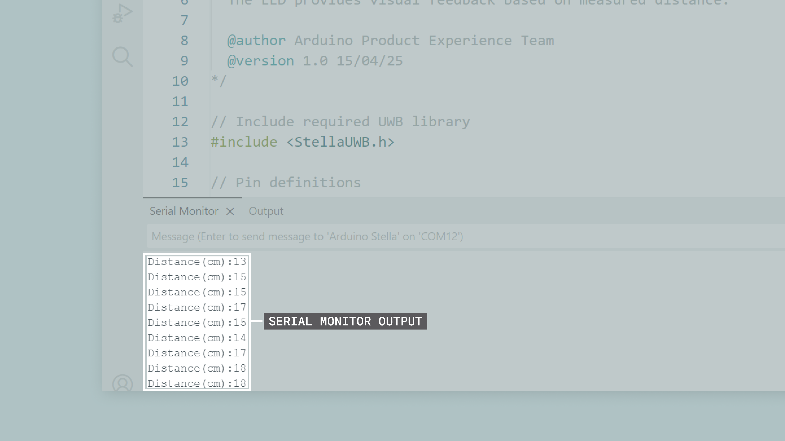

Similarly, the Portenta UWB Shield's Serial Monitor will show both raw and averaged distance measurements:

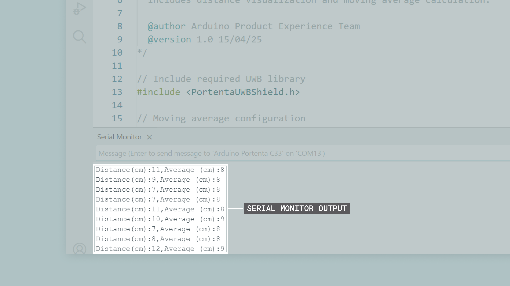

The output format from the Portenta C33 board is optimized for visualization, showing both the immediate distance readings and the calculated moving average.

### Key Components of the Example Sketch

The Two-Way Ranging example uses simplified helper classes (`UWBTracker` and `UWBRangingControlee`) that make device configuration easier while maintaining the same functionality. Let's analyze the key components:

- **Libraries and MAC Addressing**

Both devices use their respective UWB libraries:

- The Arduino Stella uses `StellaUWB.h` (for the DCU040 module)
- The Portenta UWB Shield uses `PortentaUWBShield.h` (for the DCU150 module)

MAC address configuration remains critical for communication:

```arduino
// On Arduino Stella (Controller)
uint8_t devAddr[] = {0x22, 0x22};      // This device
uint8_t destination[] = {0x11, 0x11};  // Target device

// On Portenta UWB Shield (Controlee)
uint8_t devAddr[] = {0x11, 0x11};      // This device
uint8_t destination[] = {0x22, 0x22};  // Target device
```

***__Important note:__ The MAC addresses are reversed between the two devices. The Arduino Stella identifies itself as `0x2222`and expects to communicate with `0x1111`, while the Portenta UWB Shield identifies itself as `0x1111` and expects to communicate with `0x2222`. Both devices must use the same session ID (`0x11223344`) to establish communication.***

- **Simplified Session Setup**

The new code uses helper classes that simplify the UWB session configuration:

**Arduino Stella (Controller/Initiator):**

```arduino
UWBTracker myTracker(0x11223344, srcAddr, dstAddr);
UWBSessionManager.addSession(myTracker);
myTracker.init();
myTracker.start();
```

**Portenta UWB Shield (Controlee/Responder):**

```arduino
UWBRangingControlee myControlee(0x11223344, srcAddr, dstAddr);
UWBSessionManager.addSession(myControlee);
myControlee.init();
myControlee.start();
```

These helper classes automatically configure the appropriate ranging parameters for their respective roles, making the setup process more straightforward.

- **Enhanced Visual Feedback**

Both devices in this example provide visual feedback to help users understand the system status and distance measurements at a glance. Each device uses its LED capabilities to indicate different operational states.

**Arduino Stella LED Behavior:**

The Arduino Stella uses its built-in LED to provide distance-based feedback through variable blink rates:

- **Close range (0 to 50 cm)**: Very fast blinking for immediate proximity alert
- **Medium range (50 to 150 cm)**: Medium blinking for moderate distances
- **Far range (150 to 300 cm)**: Slow blinking indicating increasing distance
- **Very far (>300 cm)**: Very slow blinking for maximum range
- **No connection**: Rapid blinking (100 ms intervals) as a warning signal
- **Startup**: Triple flash to indicate successful initialization

This variable blink rate creates an intuitive feedback system where users can gauge distance without looking at the serial output.

**Portenta C33 RGB LED Behavior:**

The Portenta C33 uses its RGB LED to provide feedback about different aspects of the system operation:

- **Red LED**: System heartbeat (continuous blinking shows the system is running)
- **Blue LED**: Connection status (ON = no connection, OFF = connected to tag)
- **Green LED**: Proximity indicator (ON = tag within 300 cm threshold, OFF = tag beyond threshold)

This three-color system provides immediate visual feedback about connection status, system operation, and proximity all at once, making it useful for debugging and demonstration purposes where checking serial output isn't practical.

- **Data Processing and Visualization**

The Portenta UWB Shield implements a moving average filter to smooth distance measurements:

```arduino
// Store measurements in circular buffer
distances[sample_index] = twr[j].distance;

// Calculate moving average
long avg = 0;
for (int i = 0; i < SAMPLES; i++) {
  avg += distances[i];
}
avg = avg / SAMPLES;
```

This provides two data streams for visualization:

- **Raw distance**: Immediate measurements showing real-time variations
- **Averaged distance**: Smoothed values for trend analysis

The output format is optimized for the Arduino IDE Serial Plotter:

```arduino
Serial.print("- Distance (cm):");
Serial.print(twr[j].distance);
Serial.print(",");
Serial.print("- Average (cm):");
Serial.println(avg);
```

### Try It Yourself

To test this two-device ranging setup, you will need to prepare both the hardware connections and software configuration before running the example.

**Hardware Setup:**

First, prepare your devices by following these steps:

1. Connect the Portenta UWB Shield to your Portenta C33 board
2. Power the Arduino Stella (using a USB-C cable or a CR2032 battery)

**Software Setup:**

Next, upload the appropriate sketches to each device if it was not done before:

1. **For the Portenta C33 board and the Portent UWB Shield:**

- Select `Tools > Board > Arduino Renesas Portenta Boards > Portenta C33`
- Upload the Controlee/Responder sketch to the Portenta C33 board

2. **For the Arduino Stella:**

- Select `Tools > Board > Arduino Mbed OS Stella Boards > Arduino Stella`  
- Upload the Controller/Initiator sketch to the Arduino Stella

***__Important note__: If you encounter compilation errors, verify that you have selected the correct board for each device before uploading.***

**Testing:**

Once both devices are programmed, you can begin testing the ranging system:

1. Open the IDE's Serial Monitor for the Portenta C33 board at 115200 baud
2. For best visualization, use `Tools > Serial Plotter` instead of the `Serial Monitor`
3. Move the devices closer and further apart
4. Observe the LED feedback on both devices

***If you don't see any measurements, verify that both devices are powered on and running their respective sketches. The system requires both the Controller and Controlee to be active for ranging to occur.***

**Visual Feedback During Operation:**

When the system is working correctly, both devices provide LED feedback:

- **Arduino Stella LED:** Blinks faster as devices get closer (fast at 50 cm, slow at 300 cm)
- **Portenta C33 Red LED:** Blinks continuously to show system is active
- **Portenta C33 Blue LED:** OFF when connected, ON when connection is lost
- **Portenta C33 Green LED:** ON when Stella is within 300 cm, OFF when further away

**Serial Output Visualization:**

The Serial Plotter provides real-time visualization of the distance measurements:

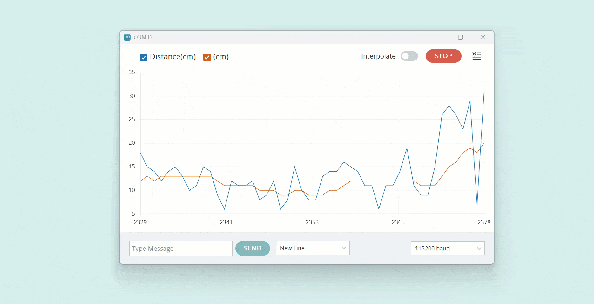

The graph shows two lines:

- **Blue line:** Raw distance measurements in centimeters
- **Red line:** Smoothed moving average for trend analysis

Example readings: `Distance(cm):125,Average(cm):123` indicates the devices are approximately 1.25 meters apart.

### Extending the Two-Way Ranging Example

This enhanced example provides a foundation for more advanced applications:

- **Access control systems**: Use the distance threshold to trigger door locks or security systems
- **Safety zones**: Create multiple distance thresholds for industrial safety applications
- **Data logging**: Add SD card storage to record distance measurements over time
- **Multi-node networks**: Extend to support multiple tags communicating with one base station
- **Position calculation**: Combine multiple base stations for 2D/3D positioning through triangulation
- **Alert systems**: Add buzzer or additional LEDs for specific distance-based alerts

The visual feedback and data processing capabilities demonstrated in this example can be adapted to various real-world applications requiring precise distance measurement and proximity detection.

## Support

If you encounter any issues or have questions while working with your Arduino Stella, we provide various support resources to help you find answers and solutions.

### Help Center

Explore our Help Center, which offers a comprehensive collection of articles and guides for Arduino boards and shields. The Help Center is designed to provide in-depth technical assistance and help you make the most of your device.

- [Arduino Help Center](https://support.arduino.cc/hc/en-us)

### Forum

Join our community forum to connect with other Arduino Stella users, share your experiences, and ask questions. The Forum is an excellent place to learn from others, discuss issues, and discover new ideas and projects related to the Arduino Stella.

- [Arduino Stella in the Arduino Forum](https://forum.arduino.cc/c/hardware/stella/91)

### Contact Us

Please get in touch with our support team if you need personalized assistance or have questions not covered by the help and support resources described before. We're happy to help you with any issues or inquiries about the Arduino Stella.

- [Contact us page](https://www.arduino.cc/en/contact-us/)