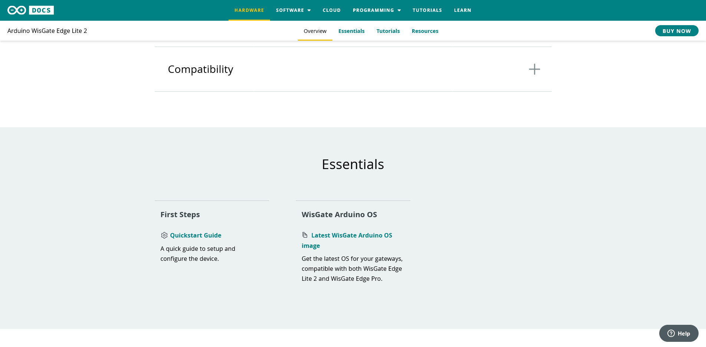
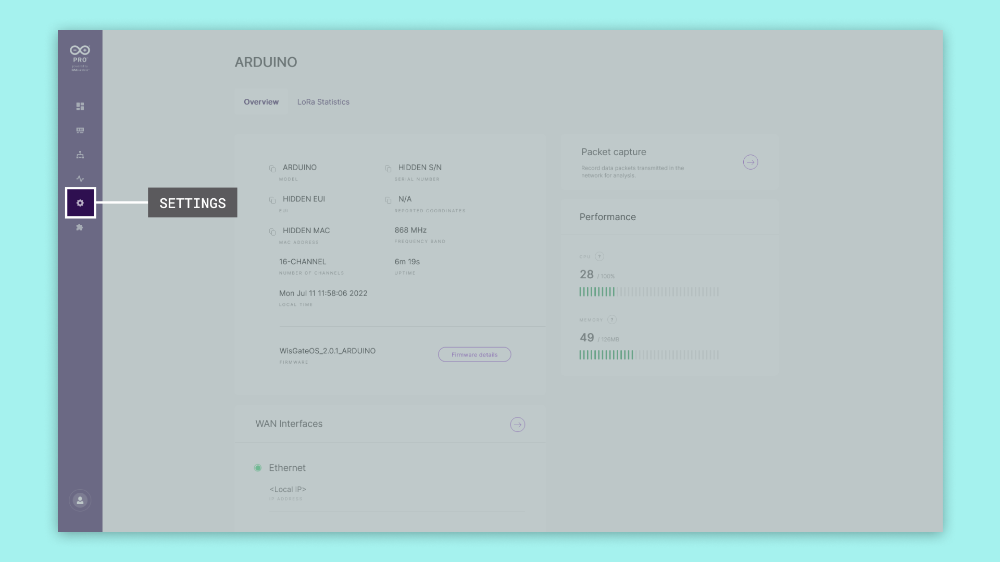
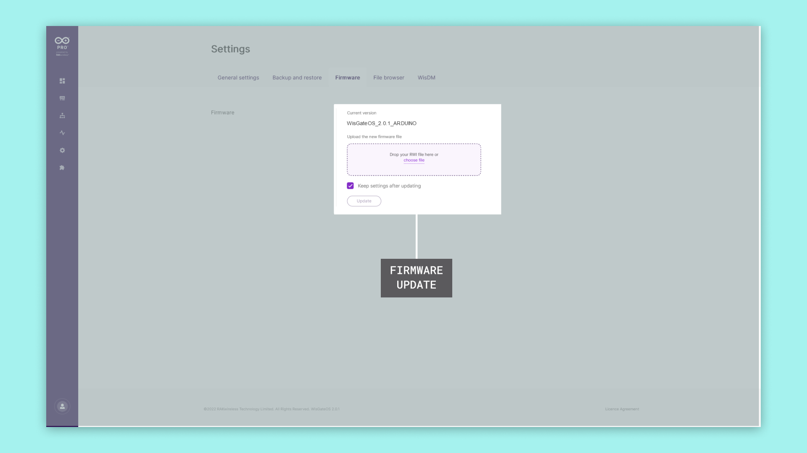
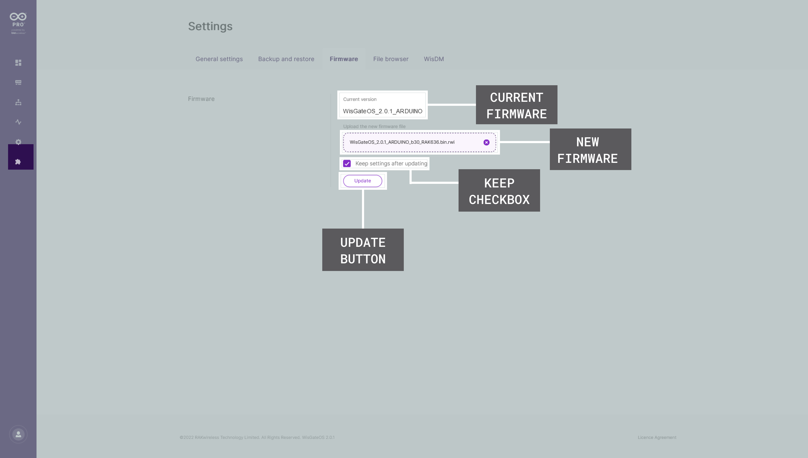

## Introduction 

This tutorial will show you how to update the firmware of your **WisGate Edge** gateway.

## Goals

The goals of this article are:

- Download the latest Firmware version.
- Connect to the Gateway
- Open the dashboard panel
- Upload the new version

## Hardware & Software Needed

- [WisGate Edge Pro or WisGate Edge Lite 2](https://store.arduino.cc/pages/wisgate-lora-gateways)

## Requirements

We assume that you already connected the gateway to your local network, and you can connect to it using your favourite method.   

You can check out the needed steps on the [Getting Started tutorial](./getting-started).

## Instructions

### Download the Latest Firmware Version

Go to your gateway's ([WisGate Edge Lite 2](../../hardware/wisgate-edge-lite-2#essentials) or [WisGate Edge Pro](../../hardware/wisgate-edge-pro#essentials)) Arduino Docs Product Page. On the page go to the Essentials section and click the **Latest Firmware Version** link.

You will get a zip file called `WisGateOS_<version>_ARDUINO_RAK.zip`. Unzip it and you will have the required firmware files.

### Connect to the WisGate Dashboard

There are different ways to access the WisGate (default values):
* Connecting to its Wi-Fi Access Point (dashboard IP: `192.168.230.1`)
* Ethernet cable from your Computer to the Gateway (dashboard IP: `192.168.230.1`)
* Connecting your Gateway to your LAN, getting its DHCP IP (You will need to discover the device's IP)

### Upload the Firmware

On the WisGate Dashboard, open the Settings page and click on the "Firmware" tab.

Now drag and drop or open the browse file option to select the firmware file downloaded in the previous step, it is the file with the `.bin.rwi` format, as you can see in the screenshot we uploaded the file called `WisGateOS_2.1.4_ARDUINO_b87_RAK636.bin.rwi`

### Flash the Firmware

Click update and you will flash the gateway with the new firmware version.

***To not erase the settings remember to check the box "Keep settings after updating"***

After flashing the new firmware the gateway will reboot itself, it may be unavailable for some minutes.

## Next Step

Make sure to check periodically if your device is up-to-date to avoid bugs and security issues.