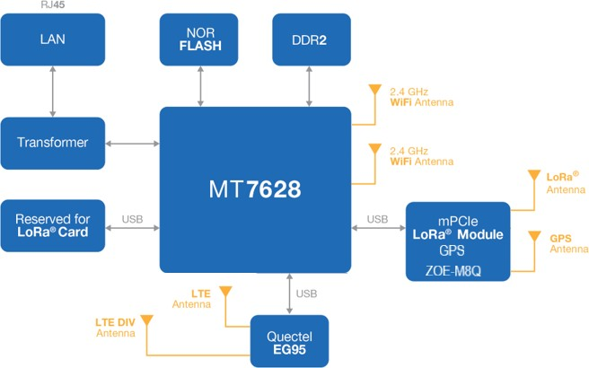
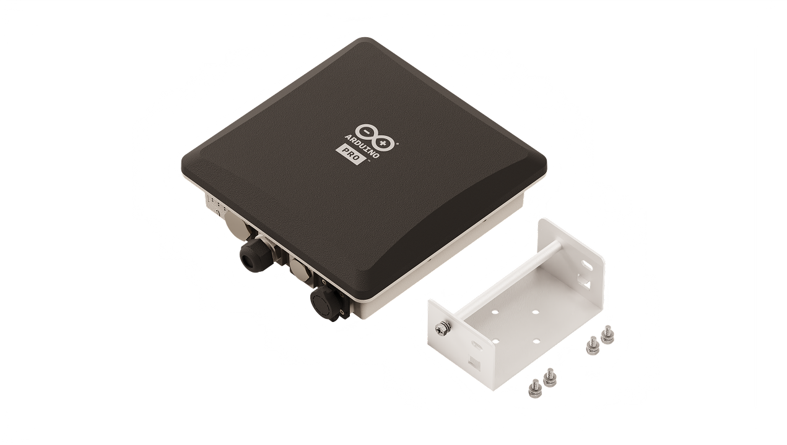
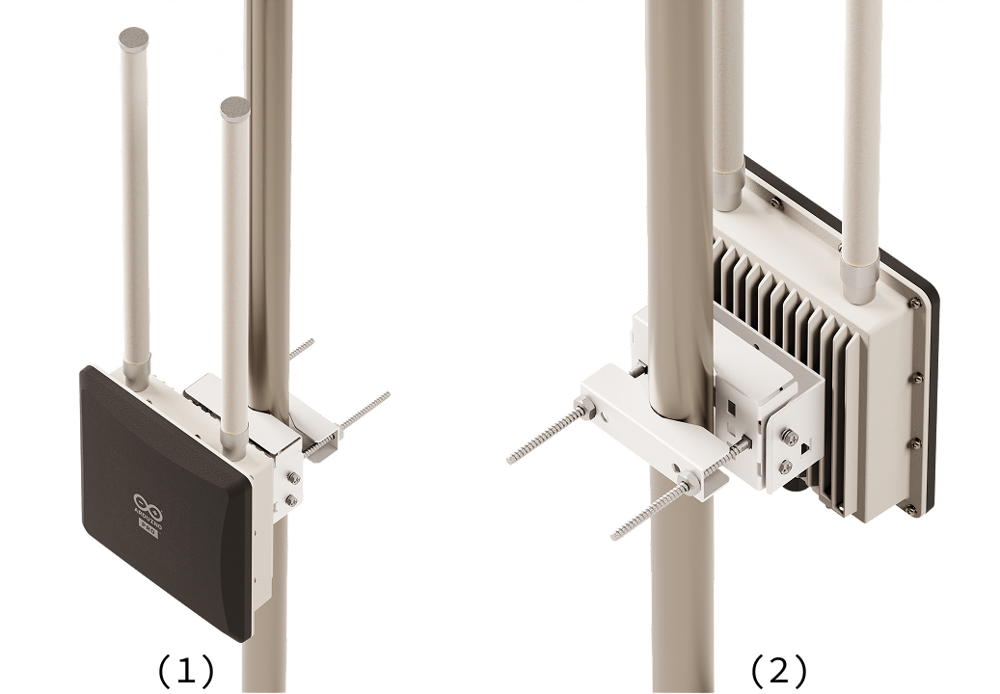
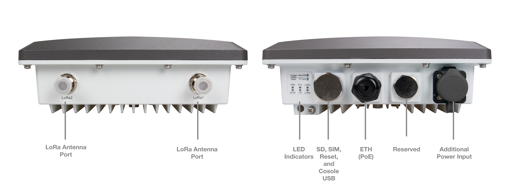

# Description

The WisGate Edge Pro gateway, powered by RAKWirelessTM technology, is an industrial-grade outdoor gateway optimized for robust, professional IoT deployments using LoRa® technology. It supports EU868, US915 and AU915 frequency bands and provides seamless connectivity for smart cities, agriculture, industrial IoT and global remote monitoring.

# Target Areas

LoRa® applications, Industrial, Agriculture, Professional IoT

# Contents

## Application Examples

The WisGate Edge Pro gateway is designed for professional IoT applications requiring robust outdoor performance and reliable connectivity through LoRa®, Wi-Fi® and LTE networks. Its versatility allows seamless integration into different environments including agriculture, industrial automation, smart cities and remote monitoring scenarios. Below are some examples showing the gateway's potential:

- **Smart Agriculture**: Deploy WisGate Edge Pro gateways to collect sensor data from distributed environmental sensors across extensive agricultural sites. Monitor soil conditions, weather and crop health to optimize resource use and boost yields.

- **Smart Cities**: Integrate WisGate Edge Pro gateways into city infrastructure for smart lighting, environmental monitoring, waste management and security solutions. Enable efficient management of city resources through real-time LoRa® based network data transmission.

- **Industrial IoT (IIoT)**: Use WisGate Edge Pro to remotely monitor industrial assets, machinery or equipment conditions in challenging environments. Ensure reliable data transmission and continuous system monitoring, minimizing downtime and maintenance costs.

- **Smart Farming**: Provide long range connectivity to manage livestock tracking, irrigation systems and automated equipment. Implement WisGate Edge Pro in agricultural settings to enable smart farming applications and improved productivity.

- **Environmental Monitoring**: Deploy WisGate Edge Pro for air quality monitoring, water management and disaster prevention systems in remote areas. Ensure constant and reliable data transmission in challenging conditions thanks to its IP67-rated enclosure and cellular connectivity.

## Features

### General Specifications Overview

The WisGate Edge Pro (RAK7289CV2) is a high performance industrial grade gateway designed specifically for demanding outdoor IoT deployments. It supports multiple global frequency bands, it features robust LoRa® communications through SX1303 concentrators, dual-channel Wi-Fi® connectivity and LTE cellular communication. Its rugged, IP67 rating, aluminum and plastic enclosure provides reliability under extreme environmental conditions, making it ideal for smart city, agriculture, industrial and remote monitoring applications.

The following table summarizes the main features of the WisGate Edge Pro:

| **Feature**                     | **Description**                                                                                                                                                                                                                                                                                                                                                                |
|---------------------------------|--------------------------------------------------------------------------------------------------------------------------------------------------------------------------------------------------------------------------------------------------------------------------------------------------------------------------------------------------------------------------------|
| Computing Unit                  | MT7628, DDR2 RAM 128 MB                                                                                                                                                                                                                                                                                                                                                        |
| Wi-Fi® Connectivity             | IEEE 802.11b/g/n, 2.4 GHz (2x2 MIMO)   RX Sensitivity: −95 dBm (Min)   TX Power: 20 dBm (Max)   Operation Channels: 1-13 (2.4 GHz)                                                                                                                                                                                                                              |
| LoRa® Module                    | SX1303 mPCIe card (up to two modules)   8 Channels (standard), 16 channels (optional)   RX Sensitivity: −139 dBm (Min)   TX Power: 27 dBm (Max)   Listen Before Talk (LBT)                                                                                                                                                                                 |
| Supported LoRa® Frequency Bands | EU868, IN865, US915, AU915, KR920, AS923-1/2/3/4, EU433, CN470                                                                                                                                                                                                                                                                                                                 |
| Cellular Connectivity           | Supports Quectel EG95-E / EG95-NA / EC25-J / EC25-AU LTE Cat 4 Modules (with RAK7289CV2 variant)   SIM Card: Nano SIM (12.30 mm x 8.80 mm x 0.67 mm)                                                                                                                                                                                                                      |
| LTE Regional Support            | EG95-E (EMEA): LTE FDD (B1/B3/B7/B8/B20/B28A), WCDMA (B1/B8), GSM/EDGE (B3/B8)   EG95-NA (North America): LTE FDD (B2/B4/B5/B12/B13), WCDMA (B2/B4/B5)   EC25-J (Japan): LTE FDD (B1/B3/B8/B18/B19/B26), LTE TDD (B41), WCDMA (B1/B6/B8/B19)   EC25-AU (Brazil): LTE-FDD (B1/B2/B3/B4/B5/B7/B8/B28), LTE-TDD (B40), WCDMA (B1/B2/B5/B8), GSM/EDGE (B2/B3/B5/B8) |
| Ethernet Interface              | RJ45 (10/100BASE-T), supports TCP/IP, MODBUS TCP                                                                                                                                                                                                                                                                                                                               |
| Additional Interfaces           | SD card slot (not removable, used for logs/data), RS-485 half-duplex, supports MODBUS RTU                                                                                                                                                                                                                                                                                      |
| Power Supply                    | PoE (IEEE 802.3af, 37~57 VDC)   12 VDC input (compatible with RAK Battery Plus)                                                                                                                                                                                                                                                                                           |
| Antennas                        | LoRa®: External N-Type connector (one for 8-channel variant, two for 16-channel variant)   Wi-Fi®, GPS, LTE: Internal antennas                                                                                                                                                                                                                                            |
| Ingress Protection              | IP67 (waterproof and dustproof)                                                                                                                                                                                                                                                                                                                                                |
| Enclosure Material              | Aluminum and plastic                                                                                                                                                                                                                                                                                                                                                           |
| Dimensions                      | 240 mm x 240 mm x 89.5 mm                                                                                                                                                                                                                                                                                                                                                      |
| Weight                          | 4.6 kg (gateway only)                                                                                                                                                                                                                                                                                                                                                          |
| Operating Temperature           | −30 °C to +55 °C                                                                                                                                                                                                                                                                                                                                                               |
| Storage Temperature             | −40 °C to +85 °C                                                                                                                                                                                                                                                                                                                                                               |
| Operating Humidity              | 0% to 95% (non-condensing)                                                                                                                                                                                                                                                                                                                                                     |
| Storage Humidity                | 0% to 95% (non-condensing)                                                                                                                                                                                                                                                                                                                                                     |
| Installation Method             | Pole or wall mounting                                                                                                                                                                                                                                                                                                                                                          |
| Certifications                  | CE, FCC, IC, RoHS, REACH, UKCA, WEEE, RCM                                                                                                                                                                                                                                                                                                                                      |

### Module Variant SKU

The WisGate Edge Pro gateway is available in three variants, each specifically tuned to different regional frequency bands for different global regions:

| **SKU**  | **Description**                | **Region** | **Gateway Type**                                                                                           | **Certified Regions** |
|----------|--------------------------------|------------|------------------------------------------------------------------------------------------------------------|-----------------------|
| TPX00095 | WisGate Edge Pro EU868         | EU         | WisGate Edge Pro RAK7289CV2, 16 Channels, LTE (EG95-E), Half Duplex, 32M Flash, Arduino customized, EU868  | EU, UK, TR            |
| TPX00096 | WisGate Edge Pro AU915 & AS923 | ANZ        | WisGate Edge Pro RAK7289CV2, 16 Channels, LTE (EG95-E), Half Duplex, 32M Flash, Arduino customized, AU915  | AU, NZ                |
| TPX00097 | WisGate Edge Pro US915         | US         | WisGate Edge Pro RAK7289CV2, 16 Channels, LTE (EG95-NA), Half Duplex, 32M Flash, Arduino customized, US915 | US                    |

This table shows the WisGate Edge Pro gateway variants that meet your regional frequency regulations and respective requirements.

## Accessories

- LoRa® antenna (Included)
- GPS/Wi-Fi® internal antennas (Included)
- Mounting kit for pole/wall installation (Included)
- Ethernet cable (Not included)

## Related Products

- Arduino MKR WAN 1300 (SKU: ABX00017)
- Arduino MKR WAN 1310 (SKU: ABX00029)
- Portenta Vision Shield w/ LoRa® technology (SKU: ASX00026)
- Portenta Max Carrier (SKU: ABX00043)

## Functional Overview

### Block Diagram

The block diagram with the main parts of the gateway can be checked in the following image:

### Hardware Interfaces and Controls

The following table shows the physical interfaces and control elements available on the WisGate Edge Pro gateway, which allows connectivity, diagnostics and maintenance:

| **Interface / Control** | **Description**                                                                                      |
|-------------------------|------------------------------------------------------------------------------------------------------|
| Ethernet                | RJ45 (10/100BASE-T) port for network connectivity, status indicated by LED (Link/Activity)           |
| LoRa® Antennas          | External N-Type connectors (one for the 8-channel variant, two for the 16-channel variant)           |
| SIM Card Slot           | Nano SIM card slot for cellular connectivity (available on RAK7289CV2 cellular variant only)         |
| DC Input Connector      | DC jack for external power supply (12 VDC)                                                           |
| SD Card Slot            | MicroSD card (used internally for storing system logs and data)                                      |
| Reset Button            | Short press to restart, long press (≥5 sec) restores factory defaults                                |
| LED Indicators          | Indicate operational status for power, Ethernet, LoRa®, Wi-Fi® and optional cellular LTE connections |

<strong>Warning:</strong> The microSD card should not be ejected during operation, as doing so may affect the gateway's performance or lead to data loss. The card is reserved for system logs and operational data management.

The WisGate Edge Pro gateway features multiple LED indicators on the enclosure to display operational status and allow for quick diagnostics:

**LED 1 (PWR)**  
  - **ON:** Gateway is powered.

**LED 2 (ETH)**  
  - **ON:** Ethernet link is active.
  - **OFF:** Ethernet link is inactive.
  - **Flickering:** Data transmission/reception activity.

**LED 3 (LoRa 1)**  
  - **ON:** LoRa channel 1 operational.
  - **OFF:** LoRa channel 1 inactive or disabled.
  - **Flickering:** LoRa channel 1 transmitting/receiving packets.

**LED 4 (WLAN): Access Point (AP) Mode:**
  - **ON:** Wi-Fi® Access Point is active.
  - **Flickering:** Data being transmitted or received in AP mode.

**LED 4 (WLAN): Station (STA) Mode:**
  - **Slow Flicker (1 Hz):** Wi-Fi® disconnected.
  - **ON:** Wi-Fi® connected.
  - **Flickering:** Data being transmitted or received in STA mode.

**LED 5 (LTE)** *(RAK7289CV2 cellular version only)*  
  - **Slow Flicker (1800 ms ON / 200 ms OFF):** Searching for cellular network.
  - **Slow Flicker (200 ms OFF / 1800 ms ON):** Cellular network idle (connected but no active data transfer).
  - **Fast Flicker (125 ms ON / 125 ms OFF):** Active data transmission/reception over cellular network.

**LED 6 (LoRa 2)** *(16-channel variant only)*  
  - **ON:** LoRa channel 2 operational.
  - **OFF:** LoRa channel 2 inactive or disabled.
  - **Flickering:** LoRa channel 2 transmitting/receiving packets.

#### RF Specifications

The WisGate Edge Pro provides robust radio frequency performance, optimized for extended coverage and reliable communications.

#### Wi-Fi® Radio Specifications

The gateway supports high-performance Wi-Fi® connectivity with the following specifications:

| **Specification**              | **Description**                                                                                                                                                                                      |
|--------------------------------|------------------------------------------------------------------------------------------------------------------------------------------------------------------------------------------------------|
| Wireless Standard              | IEEE 802.11b/g/n                                                                                                                                                                                     |
| Operating Frequency            | ISM band: 2.412~2.472 GHz                                                                                                                                                                            |
| Operation Channels             | 2.4 GHz: Channels 1-13                                                                                                                                                                               |
| Antenna Configuration          | 2x2 MIMO (internal antenna)                                                                                                                                                                          |
| Transmit Power (Max)           | 802.11b: 19 dBm @1 Mbps, 19 dBm @11 Mbps   802.11g: 18 dBm @6 Mbps, 16 dBm @54 Mbps   802.11n (HT20): 18 dBm @MCS0, 16 dBm @MCS7   802.11n (HT40): 17 dBm @MCS0, 15 dBm @MCS7         |
| Receiver Sensitivity (Typical) | 802.11b: −95 dBm @1 Mbps, −88 dBm @11 Mbps   802.11g: −90 dBm @6 Mbps, −75 dBm @54 Mbps   802.11n (HT20): −89 dBm @MCS0, −72 dBm @MCS7   802.11n (HT40): −86 dBm @MCS0, −68 dBm @MCS7 |

#### LoRa® Radio Specifications

The LoRa® functionality is provided by **SX1303** (RAK5146) based concentrator modules, offering great performance for long range communication. The gateway can support either 8x or optionally 16x LoRa channels, allowing flexible scalability.

| **Specification**          | **Details**                                                    |
|----------------------------|----------------------------------------------------------------|
| LoRa® Module               | SX1303 (RAK5146) mPCIe (up to 2x modules)                      |
| Channel Configuration      | 8x channels standard, 16x channels optional                    |
| Operating Frequency Bands  | EU868, IN865, US915, AU915, KR920, AS923-1/2/3/4, EU433, CN470 |
| Transmit Power (Max)       | 27 dBm                                                         |
| Receiver Sensitivity (Min) | -139 dBm                                                       |
| FCC ID (LoRa® Module)      | 2AF6B-RAK5146 (RAK5146 SX1303 mPCIe concentrator)              |
| Additional Features        | Listen Before Talk (LBT) support, Fine Timestamping            |

<strong>Note:</strong> No IMEI number or Type Allocation Code (TAC) is provided since this module does not operate on cellular networks.

### Cellular Module

The LTE cellular module enhances remote deployment capability, providing robust cellular connectivity for IoT and M2M communications:

| **Component**              | **Details**                                     |
|----------------------------|-------------------------------------------------|
| GSM Module Part Number     | Quectel EG95 (EG95-E for EMEA, EG95-NA for NA)  |
| SIM Card Type              | Nano SIM (12.30 mm x 8.80 mm x 0.67 mm)         |
| FCC ID                     | 2AF6B-RAK7289CV2H (WisGate Edge Pro RAK7289CV2) |
| Modem FCC ID               | XMR201807EG95NA (EG95-NA)                       |
| TAC (Type Allocation Code) | 86939403 (EG95-NA)                              |

#### Cellular Radio Specifications (RAK7289CV2 Variant)

The cellular variant (RAK7289CV2) integrates a robust LTE module to ensure reliable connectivity in IoT and M2M applications, supporting multiple regional LTE standards.

| **Specification**              | **Description**                                                                                              |
|--------------------------------|--------------------------------------------------------------------------------------------------------------|
| SIM Card                       | Nano SIM (12.30 mm x 8.80 mm x 0.67 mm)                                                                      |
| Cellular Module                | Supports Quectel EG95-E / EG95-NA / EC25-J / EC25-AU LTE Cat 4 modules (IoT/M2M optimized)                   |
| EG95-E (EMEA Region)           | LTE FDD: B1/B3/B7/B8/B20/B28A   WCDMA: B1/B8   GSM/EDGE: B3/B8                                     |
| EG95-NA (North America Region) | LTE FDD: B2/B4/B5/B12/B13   WCDMA: B2/B4/B5                                                             |
| EC25-J (Japan Region)          | LTE FDD: B1/B3/B8/B18/B19/B26   LTE TDD: B41   WCDMA: B1/B6/B8/B19                                 |
| EC25-AU (Brazil Region)        | LTE-FDD: B1/B2/B3/B4/B5/B7/B8/B28   LTE-TDD: B40   WCDMA: B1/B2/B5/B8   GSM/EDGE: B2/B3/B5/B8 |

## Rating

The following section provides electrical and environmental parameters for the safe and reliable operation of the WisGate Edge Pro. Always use the device within these specified conditions to ensure longevity and optimal performance.

### Recommended Operating Conditions

| **Description**           | **Value**                     |
|---------------------------|-------------------------------|
| Operating Temperature     | -30 °C to +55 °C              |
| Storage Temperature       | -40 °C to +85 °C              |
| Operating Humidity        | 0% to 95% (non-condensing)    |
| Storage Humidity          | 0% to 95% (non-condensing)    |
| Ingress Protection Rating | IP67 (dust-tight, waterproof) |
| Pollution Degree          | 2 (IEC 61010 compliant)       |

<strong>Note:</strong> The device's IP67 rating ensures it is fully dust-protected and can withstand immersion up to defined limits, suitable for harsh outdoor environments.

### Power Specification

The WisGate Edge Pro gateway supports multiple power supply options suitable for various installation scenarios:

- **Power over Ethernet (PoE)**: Supports IEEE 802.3af standard (37 to 57 VDC input voltage). Use an IEEE 802.3af compliant PoE injector or switch for proper operation. The PoE port provides 10/100 Mbps Ethernet connectivity.
- **External DC Power Supply**: Supports a dedicated external 12 VDC power source via the DC barrel jack. Use the 12V/1A power adapter or a regulated 12 VDC supply with at least 2 A capacity to ensure stable operation.

| **Property**                | **Min** | **Typical** | **Max** | **Unit** |
|-----------------------------|---------|-------------|---------|----------|
| PoE Input Voltage (802.3af) | 37      | -           | 57      | VDC      |
| DC Input Voltage            | 11      | 12          | 13      | VDC      |
| Power Consumption           | -       | 12          | 17      | W        |

<strong>Warning:</strong> Always use IEEE 802.3af compliant PoE injectors or switches to prevent potential damage or malfunction. If using a DC power supply, ensure it is a regulated 12 VDC source capable of supplying at least 2 A to accommodate peak power consumption.

### Current Consumption

The table below provides the typical current consumption values under different normal operating conditions:

| **Condition**           | **Min** | **Typical** | **Max** | **Unit** |
|-------------------------|---------|-------------|---------|----------|
| PoE powered (at 48 VDC) | -       | 0.3 - 0.35  | 0.5     | A        |
| DC Powered (12 V input) | -       | 1.0         | 1.5     | A        |

<strong>Note:</strong> Current consumption may vary depending on the operational load (LoRa® traffic, Wi-Fi®, LTE usage), environmental conditions and peripheral device connections. If operating at maximum load, use DC power instead of PoE, as 802.3af PoE may not supply sufficient power under peak conditions.

## Device Operation

The WisGate Edge Pro gateway is designed for professional IoT environments requiring reliable LoRa®, Wi-Fi® and cellular connectivity. The gateway provides easy setup and deployment, supporting various connectivity options including Ethernet, Wi-Fi and cellular LTE (with an optional module). The device includes dedicated interfaces for ease of configuration, operation and monitoring.

The WisGate Edge Pro gateway can easily be configured and managed through a built-in web interface accessible via Ethernet or Wi-Fi®. For step-by-step instructions, please refer to [the WisGate Edge Pro Getting Started documentation](https://docs.arduino.cc/tutorials/wisgate-edge-pro/getting-started/).

### Online Resources

Now that you have gone through the basics of what you can do with the board, you can explore the endless possibilities it provides by checking exciting projects on ProjectHub **[1]**, the Arduino Library Reference **[2]**, and the online store **[3]**; where you will be able to complement your board with sensors, actuators and more.

### Device Recovery

In the event the WisGate Edge Pro gateway becomes unresponsive or requires resetting to factory defaults:

- **Short press** the reset button to restart the gateway (soft reset).
- **Long press** (≥ 5 seconds): Restores gateway to factory default settings, erasing user configured parameters and resetting network settings. Use this option cautiously, as all user configurations and data will be permanently lost.

## Mechanical Information

This section details the mechanical characteristics of the WisGate Edge Pro gateway, covering dimensions, enclosure build and installation methods. All dimensions provided are in millimeters (mm) and tolerances are ±0.15 mm unless otherwise noted.

The WisGate Edge Pro gateway features a robust, IP67-rated enclosure for industrial outdoor installations. Built from a durable aluminum body and reinforced plastic components, it ensures maximum protection against harsh environmental conditions, including dust and water ingress.

| **Specification**  | **Details**                  |
|--------------------|------------------------------|
| Dimensions         | 240 mm x 240 mm x 89.5 mm    |
| Weight             | 4.6 kg (gateway only)        |
| Ingress Protection | IP67 (waterproof, dustproof) |
| Enclosure Material | Aluminum alloy and plastic   |
| Mounting Method    | Pole or wall mounting        |

### Installation Method

The WisGate Edge Pro gateway is designed for flexible installation options including pole or wall mounting. Use the provided mounting brackets and hardware for secure installation in outdoor environments.

**Installation Recommendations:**
- Ensure the gateway is vertically oriented.
- Install the device at a suitable height for optimal antenna coverage.
- Keep sufficient clearance around the device to maintain optimal antenna performance and airflow for cooling.

For comprehensive instructions on gateway installation, please refer to [the installation documentation](https://docs.arduino.cc/tutorials/wisgate-edge-pro/pole-mounting/).

### Connectors and Interfaces Layout

The following table provides an overview of the connectors and interfaces available on the WisGate Edge Pro gateway.

| **Connectors / Interfaces**             | **Remarks**                                |
|-----------------------------------------|--------------------------------------------|
| Ethernet RJ45 Connector                 | 10/100BASE-T, PoE input                    |
| N-Type Antenna Connector (LoRa® 1)      | LoRa® antenna                              |
| N-Type Antenna Connector (optional)     | Second antenna for 16-channel gateway only |
| SIM Card Slot (Nano SIM)                | Cellular connectivity variant only         |
| DC Power Input Connector                | 12 VDC input                               |
| Reset Button                            | Gateway reset and restore factory defaults |
| Power LED                               | Indicates gateway power status             |
| Ethernet Status LED                     | Indicates Ethernet link/activity           |
| LoRa® 1 Status LED                      | LoRa® Channel 1 status/activity            |
| WLAN LED                                | Wi-Fi® connection status/activity          |
| LTE Status LED (optional)               | Cellular connectivity variant only         |
| LoRa® 2 Status LED (16-ch version only) | Indicates status/activity of LoRa® 2       |

## Certifications

### Certifications Summary

| **Certification** | **Status** |
|:-----------------:|:----------:|
|        CE         |    Yes     |
|        FCC        |    Yes     |
|       RoHS        |    Yes     |
|       REACH       |    Yes     |
|       UKCA        |    Yes     |
|        RCM        |    Yes     |

### Declaration of Conformity CE DoC (EU)

We declare under our sole responsibility that the products above are in conformity with the essential requirements of the following EU Directives and therefore qualify for free movement within markets comprising the European Union (EU) and European Economic Area (EEA).

### Declaration of Conformity to EU RoHS & REACH 211 01/19/2021

Arduino boards are in compliance with RoHS 2 Directive 2011/65/EU of the European Parliament and RoHS 3 Directive 2015/863/EU of the Council of 4 June 2015 on the restriction of the use of certain hazardous substances in electrical and electronic equipment.

| **Substance**                          | **Maximum Limit (ppm)** |
|----------------------------------------|-------------------------|
| Lead (Pb)                              | 1000                    |
| Cadmium (Cd)                           | 100                     |
| Mercury (Hg)                           | 1000                    |
| Hexavalent Chromium (Cr6+)             | 1000                    |
| Poly Brominated Biphenyls (PBB)        | 1000                    |
| Poly Brominated Diphenyl ethers (PBDE) | 1000                    |
| Bis(2-Ethylhexyl) phthalate (DEHP)     | 1000                    |
| Benzyl butyl phthalate (BBP)           | 1000                    |
| Dibutyl phthalate (DBP)                | 1000                    |
| Diisobutyl phthalate (DIBP)            | 1000                    |

Exemptions: No exemptions are claimed.

Arduino Boards are fully compliant with the related requirements of European Union Regulation (EC) 1907 /2006 concerning the Registration, Evaluation, Authorization and Restriction of Chemicals (REACH). We declare none of the SVHCs (https://echa.europa.eu/web/guest/candidate-list-table), the Candidate List of Substances of Very High Concern for authorization currently released by ECHA, is present in all products (and also package) in quantities totaling in a concentration equal or above 0.1%. To the best of our knowledge, we also declare that our products do not contain any of the substances listed on the "Authorization List" (Annex XIV of the REACH regulations) and Substances of Very High Concern (SVHC) in any significant amounts as specified by the Annex XVII of Candidate list published by ECHA (European Chemical Agency) 1907 /2006/EC.

### Conflict Minerals Declaration

As a global supplier of electronic and electrical components, Arduino is aware of our obligations concerning laws and regulations regarding Conflict Minerals, specifically the Dodd-Frank Wall Street Reform and Consumer Protection Act, Section 1502. Arduino does not directly source or process conflict minerals such as Tin, Tantalum, Tungsten, or Gold. Conflict minerals are contained in our products in the form of solder, or as a component in metal alloys. As part of our reasonable due diligence, Arduino has contacted component suppliers within our supply chain to verify their continued compliance with the regulations. Based on the information received thus far we declare that our products contain Conflict Minerals sourced from conflict-free areas.

## FCC Caution

Any Changes or modifications not expressly approved by the party responsible for compliance could void the user’s authority to operate the equipment.

This device complies with part 15 of the FCC Rules. Operation is subject to the following two conditions:

1. This device may not cause harmful interference

2. This device must accept any interference received, including interference that may cause undesired operation.

**FCC RF Radiation Exposure Statement:**

1. This Transmitter must not be co-located or operating in conjunction with any other antenna or transmitter

2. This equipment complies with RF radiation exposure limits set forth for an uncontrolled environment

3. This equipment should be installed and operated with a minimum distance of 20 cm between the radiator and your body.

**Note:** This equipment has been tested and found to comply with the limits for a Class B digital
device, pursuant to part 15 of the FCC Rules. These limits are designed to provide
reasonable protection against harmful interference in a residential installation. This equipment
generates, uses and can radiate radio frequency energy and, if not installed and used in
accordance with the instructions, may cause harmful interference to radio communications.
However, there is no guarantee that interference will not occur in a particular installation. If
this equipment does cause harmful interference to radio or television reception, which can be
determined by turning the equipment off and on, the user is encouraged to try to correct the
interference by one or more of the following measures:
- Reorient or relocate the receiving antenna.
- Increase the separation between the equipment and receiver.
- Connect the equipment into an outlet on a circuit different from that to which the
receiver is connected.
- Consult the dealer or an experienced radio/TV technician for help.

English:
User manuals for license-exempt radio apparatus shall contain the following or equivalent notice in a conspicuous location in the user manual or alternatively on the device or both. This device complies with Industry Canada license-exempt RSS standard(s). Operation is subject to the following two conditions:

1. This device may not cause interference

2. This device must accept any interference, including interference that may cause undesired operation of the device.

French:
Le présent appareil est conforme aux CNR d’Industrie Canada applicables aux appareils radio exempts de licence. L’exploitation est autorisée aux deux conditions suivantes:

1. L’ appareil nedoit pas produire de brouillage

2. L’utilisateur de l’appareil doit accepter tout brouillage radioélectrique subi, même si le brouillage est susceptible d’en compromettre le fonctionnement.

**IC SAR Warning:**

English:
This equipment should be installed and operated with a minimum distance of 20 cm between the radiator and your body.

French:
Lors de l’ installation et de l’ exploitation de ce dispositif, la distance entre le radiateur et le corps est d ’au moins 20 cm.

**Important:** The operating temperature of the EUT can’t exceed 85 °C and shouldn’t be lower than -40 °C.

Hereby, Arduino S.r.l. declares that this product is in compliance with essential requirements and other relevant provisions of Directive 2014/53/EU. This product is allowed to be used in all EU member states.

## Company Information

<!---
Company information: Make sure is updated and always the same.
-->

| **Company name** |              **Arduino S.r.l.**              |
| :--------------: | :------------------------------------------: |
| Company address  | Via Andrea Appiani, 25 - 20900 Monza (Italy) |

## Reference Documentation

|        **Ref**        | **Link**                                                                 |
|:---------------------:|--------------------------------------------------------------------------|
|      Project Hub      | https://create.arduino.cc/projecthub?by=part&part_id=11332&sort=trending |
|   Library Reference   | https://www.arduino.cc/reference/en/                                     |
|     Online Store      | https://store.arduino.cc/                                                |
| WisGate Edge Pro Docs | https://docs.arduino.cc/hardware/wisgate-edge-pro/                       |

## Revision History

|  **Date**  | **Revision** |     **Changes**     |
|:----------:|:------------:|:-------------------:|
| 14/03/2025 |      2       | Format improvements |
| 12/03/2025 |      1       |    First release    |
