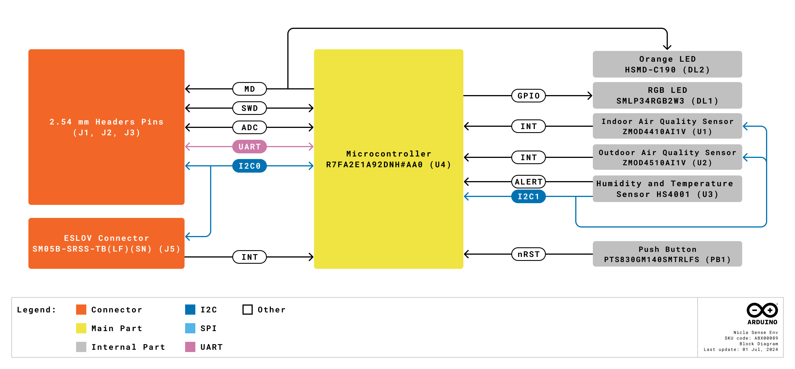

# Description

Start sensing the world around you with Nicla Sense Env. The board combines three state-of-the-art sensors from Renesas® with the simplicity of integration and scalability of the Arduino ecosystem. Expand your Portenta, MKR, or Nano projects by adding a Nicla Sense Env. In addition to its ultra-low power temperature and humidity sensor, it integrates two state-of-the-art, industrial-grade gas sensors, able to evaluate air quality in indoor and outdoor environments.

# Target Areas:
Industrial automation, building automation, prototyping

# CONTENTS

## Application Examples

The Arduino Nicla Sense Env, when combined with Portenta, MKR, or Nano family boards, provides a versatile solution for various sectors. Below are some application examples that demonstrate its transformative potential:

- **Industrial automation**: The Nicla Sense Env enhances industrial automation by providing precise monitoring and control capabilities, ensuring safety, efficiency, and environmental compliance in various processes.
  - **Heat pump machines**: When combined with a Portenta family board, the Nicla Sense Env can be easily installed into any heat pump to properly monitor air quality, temperature, and humidity, both indoors and outdoors. This allows users to adjust the thermostat, set temperature schedules, and review energy consumption and air quality at any time.
  - **Industrial processes toxic substances detection**: The Nicla Sense Env can be easily implemented in multiple industrial processes to detect the presence of poisonous substances or gas leakages, such as volatile organic compounds (VOCs), hydrocarbons, CO2, and hydrogen. The data can then be transmitted to the connected Portenta, MKR, or Nano family board to provide real-time alarms.
- **Prototyping**: The Nicla Sense Env offers a ready-to-use solution for developers working on prototypes, integrating various environmental sensors to expedite development.
  - **Ready-to-use environmental monitoring prototyping solution**: The Nicla Sense Env is a valuable tool for Portenta, MKR, and Nano family board developers working on prototypes, integrating ready-to-use sensors such as temperature, humidity, and gas sensors.
- **Building automation**: In building automation, the Nicla Sense Env facilitates the creation of intelligent systems that improve comfort, safety, and energy efficiency.
  - **Climate control systems**: Integrate a Nicla Sense Env into your HVAC, air conditioning, or ventilation system to accurately measure air quality, humidity, and temperature. This ensures compliance with environmental regulations inside your smart building and increases tenant comfort.
  - **Automated air purifier**: With its embedded sensing capabilities, the Nicla Sense Env provides a comprehensive solution for air purifier systems in smart buildings and offices, saving energy and helping to maintain user health and wellness.
  - **Fumes and fire detection**: The effects of fire, smoke, and fumes can be catastrophic in various environments. By incorporating intelligent gas sensors with onboard Artificial Intelligence (AI), the Nicla Sense Env can detect the presence of indoor and outdoor carbon dioxide, notifying authorities for timely intervention.

## Features
### General Specifications Overview

The Nicla Sense Env is a compact, powerful board for environmental sensing applications. It integrates two advanced state-of-the-art, industrial-grade gas sensors, and the Renesas R7FA2E1A92DNH microcontroller, making it ideal for monitoring air quality, temperature, and humidity in various environments.

The main features are highlighted in the table shown below.

| **Feature**                             | **Description**                                                                                                                                                                                                       |
|-----------------------------------------|-----------------------------------------------------------------------------------------------------------------------------------------------------------------------------------------------------------------------|
| Microcontroller                         | 48 MHz, Arm® Cortex® M23 (not accessible or programmable by the user)                                                                                                                                                 |
| Internal Memory                         | 128 kB Flash and 16 kB SRAM                                                                                                                                                                                           |
| Power Supply                            | Various options for easily powering the board: Using the power supply of the connected Portenta, MKR, or Nano board and using an external power supply connected through the board's header connector pins (VCC pin) |
| Analog Peripherals                      | 12-bit ADC (x2)                                                                                                                                                                                                       |
| Digital Peripherals                     | UART (x1), I2C (x1), SPI (x1)                                                                                                                                                                                         |
| Onboard Humidity and Temperature Sensor | Renesas HS4001                                                                                                                                                                                                        |
| Onboard Indoor Air Quality Sensor       | Renesas ZMOD4410AI1V (total volatile organic compounds, CO2, and indoor air quality)                                                                                                                       |
| Onboard Outdoor Air Quality Sensor      | Renesas ZMOD4510AI1V (nitrogen dioxide, ozone, and outdoor air quality)                                                                                                                                               |
| Dimensions                              | 22.86 mm x 22.86 mm                                                                                                                                                                                                   |
| Weight                                  | 2 g                                                                                                                                                                                                                   |
| Pinout features                         | Castellated pins allow the board to be SMD soldered on a custom board or carrier                                                                                                                                      |

### Accessories

- ESLOV cable (included)
- 12-pin P-MOD header connector (not included, P/N: TSM-106-01-L-DH-TR)

### Related Products

- Arduino Portenta C33 (SKU: ABX00074)
- Arduino Portenta H7 (SKU: ABX00042)
- Arduino Portenta H7 Lite (SKU: ABX00045)
- Arduino Portenta H7 Lite Connected (SKU: ABX00046)
- Arduino MKR WiFi 1010 (SKU: ABX00023)
- Arduino MKR WAN 1310 (SKU: ABX00029)
- Arduino MKR Zero (SKU: ABX00012)
- Arduino MKR NB 1500 (SKU: ABX00019)
- Arduino Nano 33 BLE (SKU: ABX00030)
- Arduino Nano 33 BLE Rev2 (SKU: ABX00071)
- Arduino Nano 33 BLE Sense (SKU: ABX00031)
- Arduino Nano 33 BLE Sense Rev2 (SKU: ABX00069)
- Arduino Nano 33 IoT (SKU: ABX00027)
- Arduino Nano ESP32 (SKU: ABX00092)
- Arduino Nano Every (SKU: ABX00028)
- Arduino Nano RP2040 Connect (SKU: ABX00052)
- Arduino UNO R4 Minima (SKU: ABX00080)
- Arduino UNO R4 WiFi (SKU: ABX00087)
- Arduino Zero (SKU: ABX00003)

## Ratings

### Recommended Operating Conditions

The table below provides a comprehensive guideline for the optimal use of the Nicla Sense Env, outlining typical operating conditions and design limits. The operating conditions of the Nicla Sense Env are largely based on the specifications of its components.

|            **Parameter**            |    **Symbol**   | **Min** | **Typ** | **Max** | **Unit** |
|:-----------------------------------:|:---------------:|:-------:|:-------:|:-------:|:--------:|
|  `IN` Pin Input Voltage1 |  VIN |   2.3   |   5.0   |   6.5   |     V    |
| `OUT` Pin Input Voltage2 | VOUT |    -    |   3.3   |   3.3   |     V    |
|         ESLOV Input Voltage         |      VESLOV     |    -    |   5.0   |    -    |     V    |
|        Operating Temperature        |  TOP |   -40   |    -    |    85   |    °C    |

1 Power input through the <code>IN</code> pin, regulated to +3.3 VDC by the onboard voltage regulator.

2 Direct +3.3 VDC power input through the <code>OUT</code> pin, bypassing the onboard voltage regulator.

<strong>Power Tip:</strong> To put the Nicla Sense Env in <strong>deep sleep mode</strong>, use the API provided by the <strong>Nicla Sense Env Arduino library</strong>.

<strong>Safety Note:</strong> The Nicla Sense Env board operates at +3.3 VDC, and while its pins are +5 VDC tolerant, we recommend using a level translator when connecting it to +5 VDC-compatible Arduino boards to ensure safe communication and prevent potential damage to the components. This connection can be made either through the Nicla Sense Env's ESLOV connector or its dedicated I2C pins (I2C0).

## Functional Overview

The core of the Nicla Sense Env is the R7FA2E1A92DNH microcontroller from Renesas. The board also contains several sensors and user-programmable LEDs connected to its microcontroller, such as a relative humidity and temperature sensor, indoor and outdoor air quality sensors, and two LEDs, one orange and one RGB LED, available for the user. 

### Pinout

The Nicla Sense Env connectors pinout is shown in the figure below.

### Block Diagram

An overview of the high-level architecture of the Nicla Sense Env is illustrated in the figure below.

### Power Supply

The Nicla Sense Env can be powered through one of the following interfaces:

- **ESLOV connector**: The Nicla Sense Env can be powered through the power supply of a connected Portenta or MKR family board by using the ESLOV connector.
- **External +2.3 to +6.5 VDC power supply**: This can be connected to the `IN` pin (pin 9) of the board's header connector. The onboard voltage regulator converts this input to +3.3 VDC for the internal circuitry.
- **External +3.3 VDC power supply**: This can be connected to the `OUT` pin (pin 7) of the board's header connector, **bypassing the onboard voltage regulator**.
- **Onboard P-MOD connector**: The Nicla Sense Env can also be powered through the `+3V3` power pin of the onboard P-MOD connector using an external +3.3 VDC power supply.

A detailed figure below illustrates the power options available on the Nicla Sense Env and the main system power architecture.

<strong>Low-Power Tip:</strong> Use the API provided by the <strong>Nicla Sense Env Arduino library</strong> to put the board into low-power and deep sleep mode. 

<strong>Safety Note:</strong> Do not exceed the voltage limits specified for each power pin: +2.3 to +6.5 VDC for the <code>IN</code> pin and +3.3 VDC for the <code>OUT</code> pin. Voltages outside these ranges will permanently damage the board. <strong>Neither pin has reverse polarity protection</strong>; always verify all connections before applying power.

## Device Operation

### Getting Started - IDE

If you want to program your Nicla Sense Env offline with a Portenta, MKR, or Nano family board, install the Arduino Desktop IDE **[1]**. You will need a USB cable to connect the Portenta, MKR, or Nano board to your computer.

### Getting Started - Arduino Web Editor

All Arduino devices work out of the box on the Arduino Cloud Editor **[2]** by installing a simple plugin. The Arduino Cloud Editor is hosted online. Therefore, it will always be up-to-date with all the latest features and support for all boards and devices. Follow **[3]** to start coding on the browser and upload your sketches onto your device.

### Getting Started - Arduino Cloud

All Arduino IoT-enabled products are supported on Arduino Cloud, which allows you to log, graph, and analyze sensor data, trigger events, and automate your home or business. Take a look at the official documentation to know more.

### Nicla Sense Env Arduino and MicroPython Library

The Arduino_NiclaSenseEnv library **[4]** offers an Arduino API to read data from the Nicla Sense Env's onboard sensors (ZMOD4410, ZMOD4510 and HS4001) and control the board's functionality. This library is also available for MicroPython **[5]**.

### Sample Sketches

Sample sketches for the Nicla Sense Env can be found either in the “Examples” menu in the Arduino IDE or the “Nicla Sense Env Documentation” section of Arduino documentation **[6]**.

### Online Resources

Now that you have gone through the basics of what you can do with the device, you can explore the endless possibilities it provides by checking exciting projects on Arduino Project Hub **[7]**, the Arduino Library Reference **[8]**, and the online store **[9]** where you will be able to complement your Nicla Sense Env board with additional extensions, sensors, and actuators.

## Mechanical Information

The Nicla Sense Env is a double-sided 28.86 mm x 28.86 mm board with an ESLOV connector overhanging the bottom edge and dual castellated/through-hole pins around two of the four edges of the board.

### Board Dimensions

The Nicla Sense Env board outline is shown in the figure below; all the dimensions are in mm. 

The Nicla Sense Env does not have mounting holes for mechanical fixing. The slots found in the board were placed because of the board's sensor requirements and specifications. 

### Board Connectors

The ESLOV connector of the Nicla Sense Env is placed on the bottom side of the board; its placement is shown in the figure below; all the dimensions are in mm. 

The Nicla Sense Env was designed to be usable as a surface-mount module and presents a dual inline package (DIP) format with the MKR-styled header connectors on a 2.54 mm pitch grid with 1 mm holes.

### Board Peripherals and Actuators 

The Nicla Sense Env has one reset button and two LEDs, an orange and an RGB LED, available for the user; the reset button, the orange LED, and the RGB LED are placed on the top side of the board.  The placement of these components is shown in the figure below; all the dimensions are in mm.

## Product Compliance

### Product Compliance Summary

| **Product Compliance** |
|:----------------------:|
|  CE (European Union)   |
|          RoHS          |
|         REACH          |
|          WEEE          |
|      VCCI (Japan)      |

### Japan VCCI Statement

This is a VCCI Class B compliant product.

### Declaration of Conformity CE DoC (EU)

We declare under our sole responsibility that the products above are in conformity with the essential requirements of the following EU Directives and therefore qualify for free movement within markets comprising the European Union (EU) and European Economic Area (EEA).

### Declaration of Conformity to EU RoHS & REACH 211 01/19/2021

Arduino boards are in compliance with RoHS 2 Directive 2011/65/EU of the European Parliament and RoHS 3 Directive 2015/863/EU of the Council of 4 June 2015 on the restriction of the use of certain hazardous substances in electrical and electronic equipment.

| **Substance**                          | **Maximum Limit (ppm)** |
|----------------------------------------|-------------------------|
| Lead (Pb)                              | 1000                    |
| Cadmium (Cd)                           | 100                     |
| Mercury (Hg)                           | 1000                    |
| Hexavalent Chromium (Cr6+)             | 1000                    |
| Poly Brominated Biphenyls (PBB)        | 1000                    |
| Poly Brominated Diphenyl ethers (PBDE) | 1000                    |
| Bis(2-Ethylhexyl) phthalate (DEHP)     | 1000                    |
| Benzyl butyl phthalate (BBP)           | 1000                    |
| Dibutyl phthalate (DBP)                | 1000                    |
| Diisobutyl phthalate (DIBP)            | 1000                    |

Exemptions: No exemptions are claimed.

Arduino Boards are fully compliant with the related requirements of European Union Regulation (EC) 1907 /2006 concerning the Registration, Evaluation, Authorization and Restriction of Chemicals (REACH). We declare none of the SVHCs (https://echa.europa.eu/web/guest/candidate-list-table), the Candidate List of Substances of Very High Concern for authorization currently released by ECHA, is present in all products (and also package) in quantities totaling in a concentration equal or above 0.1%. To the best of our knowledge, we also declare that our products do not contain any of the substances listed on the "Authorization List" (Annex XIV of the REACH regulations) and Substances of Very High Concern (SVHC) in any significant amounts as specified by the Annex XVII of Candidate list published by ECHA (European Chemical Agency) 1907 /2006/EC.

### Conflict Minerals Declaration

As a global supplier of electronic and electrical components, Arduino is aware of our obligations concerning laws and regulations regarding Conflict Minerals, specifically the Dodd-Frank Wall Street Reform and Consumer Protection Act, Section 1502. Arduino does not directly source or process conflict minerals such as Tin, Tantalum, Tungsten, or Gold. Conflict minerals are contained in our products in the form of solder, or as a component in metal alloys. As part of our reasonable due diligence, Arduino has contacted component suppliers within our supply chain to verify their continued compliance with the regulations. Based on the information received thus far we declare that our products contain Conflict Minerals sourced from conflict-free areas.

## Company Information

| **Company Information** | **Details**                                |
|-------------------------|--------------------------------------------|
| **Company Name**        | Arduino S.r.l.                             |
| **Company Address**     | Via Andrea Appiani, 25-20900 Monza (Italy) |

## Reference Documentation

| **No.** | **Reference**                             | **Link**                                                   |
|:-------:|-------------------------------------------|------------------------------------------------------------|
|    1    | Arduino IDE (Desktop)                     | https://www.arduino.cc/en/Main/Software                    |
|    2    | Arduino IDE (Cloud)                       | https://create.arduino.cc/editor                           |
|    3    | Arduino Cloud - Getting Started           | https://docs.arduino.cc/arduino-cloud/guides/overview/     |
|    4    | Arduino_NiclaSenseEnv Library             | https://github.com/arduino-libraries/Arduino_NiclaSenseEnv |
|    5    | Arduino_NiclaSenseEnv MicroPython Library | https://github.com/arduino/arduino-nicla-sense-env-mpy/    |
|    6    | Nicla Sense Env Documentation             | https://docs.arduino.cc/hardware/nicla-sense-env/          |
|    7    | Project Hub                               | https://create.arduino.cc/projecthub                       |
|    8    | Library Reference                         | https://www.arduino.cc/reference/en/                       |
|    9    | Online Store                              | https://store.arduino.cc/                                  |

## Document Revision History

|  **Date**  | **Revision** |                      **Changes**                       |
|:----------:|:------------:|:------------------------------------------------------:|
| 14/01/2025 |      2       | Update on Product Compliance with Japan VCCI Statement |
| 10/10/2024 |      1       |                     First release                      |