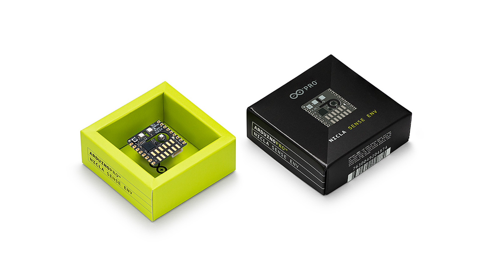

This user manual provides a comprehensive overview of the Nicla Sense Env board, highlighting its hardware and software elements. With it, you will learn how to set up, configure, and use all the main features of a Nicla Sense Env board.


## Hardware and Software Requirements

### Hardware Requirements

- [Nicla Sense Env](https://store.arduino.cc/products/nicla-sense-env) (x1)
- [Portenta C33](https://store.arduino.cc/products/portenta-c33) (x1)
- [USB-C® cable](https://store.arduino.cc/products/usb-cable2in1-type-c) (x1)

### Software Requirements

- [Arduino IDE 2.0+](https://www.arduino.cc/en/software) or [Arduino Web Editor](https://create.arduino.cc/editor)
- [Arduino_NiclaSenseEnv library](https://github.com/arduino-libraries/Arduino_NiclaSenseEnv)
- [Arduino Renesas Portenta Boards core](https://github.com/arduino/ArduinoCore-renesas) (required to work with the Portenta C33 board)

***The Nicla Sense Env board is not intended as a standalone device but as a shield to work alongside a Portenta, MKR, or Nano family board. In this user manual, we will use the Portenta C33 as the main board and show how to use the Nicla Sense Env board as a shield.***

## Nicla Sense Env Overview

Enhance your environmental sensing capabilities with the Nicla Sense Env board. This board combines three cutting-edge sensors from Renesas® with the Arduino ecosystem's ease of integration and scalability. This board is well-suited for augmenting your Portenta or MKR-based projects with environmental sensing capabilities.


The Nicla Sense Env includes an ultra-low power temperature and humidity sensor, complemented by two sophisticated industrial-grade gas sensors capable of assessing air quality in indoor and outdoor settings. Its compact dimensions (22.86 x 22.86 mm) and sturdy build make the Nicla Sense Env an excellent choice for projects that demand sensor fusion and the computational capabilities of Arduino boards.

### Nicla Sense Env Architecture Overview

The Nicla Sense Env features a secure, certified, and durable design that suits various applications, such as industrial automation, building automation, and prototyping. 

The top view of the Nicla Sense Env board is shown in the image below:


The bottom view of the Nicla Sense Env board is shown in the image below:


Here's an overview of the board's main components shown in the images above:

- **Microcontroller**: At the heart of the Nicla Sense Env is a [Renesas RA2E1 microcontroller](https://www.renesas.com/us/en/products/microcontrollers-microprocessors/ra-cortex-m-mcus/ra2e1-48mhz-arm-cortex-m23-entry-level-general-purpose-microcontroller). This entry-level single-chip microcontroller, known as one of the industry's most energy-efficient ultra-low-power microcontroller, is based on a 48 MHz Arm® Cortex®-M23 core with up to 128 KB code flash and 16 KB SRAM memory.
- **Onboard humidity and temperature sensor**: The Nicla Sense Env features an onboard humidity and temperature sensor, the [HS4001 from Renesas](https://www.renesas.com/us/en/products/sensor-products/environmental-sensors/humidity-temperature-sensors/hs4001-relative-humidity-and-temperature-sensor-digital-output-15-rh). This highly accurate, ultra-low power, fully calibrated relative humidity and temperature sensor features proprietary sensor-level protection, ensuring high reliability and long-term stability.
- **Onboard indoor air quality sensor**: The Nicla Sense Env features an onboard gas sensor, the [ZMOD4410 from Renesas](https://www.renesas.com/us/en/document/dst/zmod4410-datasheet). This sophisticated sensor was designed to detect total volatile organic compounds (TVOC), estimate CO<sub>2</sub>, and monitor and report indoor air quality (IAQ). 
- **Onboard outdoor air quality sensor**: The Nicla Sense Env features an onboard gas sensor, the [ZMOD4510 from Renesas](https://www.renesas.com/us/en/document/dst/zmod4410-datasheet). This sophisticated sensor was designed to monitor and report outdoor air quality (OAQ) based on nitrogen dioxide (NO<sub>2</sub>) and ozone (O<sub>3</sub>) measurements. 
- **Onboard user LEDs**: The Nicla Sense Env has two onboard user-programmable LEDs; one is an orange LED, and the other one is an RGB LED.
- **ESLOV connector**: The Nicla Sense Env has an onboard ESLOV connector to extend the board communication capabilities via I<sup>2</sup>C. 
- **Surface mount**: The castellated pins of the board allow it to be positioned as a surface-mountable module.

### Board Libraries

The [`Arduino_NiclaSenseEnv` library](https://github.com/arduino-libraries/Arduino_NiclaSenseEnv) contains an application programming interface (API) to read data from the board and control its parameters and behavior over I²C. This library supports the following: 

- Board control (sleep, reset, and factory reset)
- Board configuration (I²C address configuration)
- Onboard RGB LED control
- Onboard orange LED control
- Onboard indoor air quality sensor control (sulfur detection, odor intensity, ethanol level, TVOC, CO₂, IAQ measurements)
- Onboard outdoor air quality sensor control (NO₂, O<sub>3</sub>, OAQ measurements)
- Temperature and humidity sensor control
- UART comma-separated values (CSV) output

***The Portenta, MKR, Nano and UNO (R4) family boards support the `Arduino_NiclaSenseEnv` library.***

To install the `Arduino_NiclaSenseEnv` library, navigate to `Tools > Manage libraries...` or click the **Library Manager** icon in the left tab of the Arduino IDE. In the Library Manager tab, search for `Arduino_NiclaSenseEnv` and install the latest version of the library.


### Pinout

The full pinout is available and downloadable as PDF from the link below:

- [Nicla Sense Env pinout](https://docs.arduino.cc/resources/pinouts/ABX00089-full-pinout.pdf)

### Datasheet

The complete datasheet is available and downloadable as PDF from the link below:

- [Nicla Sense Env datasheet](https://docs.arduino.cc/resources/datasheets/ABX00089-datasheet.pdf)

### Schematics

The complete schematics are available and downloadable as PDF from the link below:

- [Nicla Sense Env schematics](https://docs.arduino.cc/resources/schematics/ABX00089-schematics.pdf)

### STEP Files 

The complete STEP files are available and downloadable from the link below:

- [Nicla Sense Env STEP files](../../downloads/ABX00089-step.zip)

## First Use

### Unboxing the Product

Let's check out what is inside the box of the Nicla Sense Env board. Besides the board, you will find an ESLOV cable inside the box, which can connect the Nicla Sense Env with other supported Arduino boards with an onboard ESLOV connector (Portenta or MKR family boards). The board's MKR-styled pins can also connect the Nicla Sense Env to other supported Arduino boards (Nano family), but 2.54 mm header pins (not included) must be soldered to the MKR-styled board pins. 



**The Nicla Sense Env is not a standalone device but a shield for an Arduino-supported board from the Portenta, MKR, or Nano board families**. This user manual will use a Portenta C33 as the main or host board and the Nicla Sense Env as a shield or client board connected through the included ESLOV cable.

### Connecting the Board

As shown in the image below, the Nicla Sense Env can be connected to a Portenta or MKR family board using the onboard ESLOV connector and the included ESLOV cable. Alternatively, you can connect the Nicla Sense Env as a shield by using the MKR-style pins on the Portenta or MKR family boards.


For other compatible boards, such as those from the Nano family, the Nicla Sense Env can also be connected using the 2.54 mm pins of the Nicla Sense Env board.

***<strong>Important note:</strong> The Nicla Sense Env board operates at 3.3 VDC, and while its pins are 5 VDC tolerant, we recommend using a level translator when connecting it to 5 VDC-compatible Arduino boards to ensure safe communication and prevent potential damage to the components. This connection can be made either through the Nicla Sense Env’s ESLOV connector or its dedicated I2C pins (`I2C0`), as illustrated in the image below.***


As shown in the image above, the use of a dedicated level translator between the Nicla Sense Env board and the 5 VDC-compatible Arduino board, in this example an Arduino UNO R4 WiFi, is recommended.

### Powering the Board

The Nicla Sense Env can be powered by:

- Via **ESLOV connector**: Using the onboard ESLOV connector, which provides a dedicated +5 VDC power line. This voltage is internally regulated to +3.3 VDC by the onboard voltage regulator.
- Via **`IN` pin**: Using an external +2.3 to +6.5 VDC power supply connected to the `IN` pin (pin 9). This method uses the same internal regulation circuit as the ESLOV connector.
- Via **`OUT` pin**: Using an external regulated +3.3 VDC power supply connected to the `OUT` pin (pin 7). **This method bypasses the onboard voltage regulator**.


The board's power architecture includes a voltage regulator (ISL9008A) that converts the input voltage to +3.3 VDC for the internal circuitry. When powering via ESLOV or the `IN` pin, the onboard regulator handles this conversion automatically and can supply up to 150 mA of current through the `OUT` pin.

#### Power Pins Reference

The following table summarizes the power-related pins on the Nicla Sense Env board:

| **Pin** | **Name** |    **Voltage**   |                     **Description**                     |
|:-------:|:--------:|:----------------:|:-------------------------------------------------------:|
|    9    |   `IN`   | +2.3 to +6.5 VDC |  Power input connected to the onboard voltage regulator |
|    7    |   `OUT`  |     +3.3 VDC     | Regulated +3.3 VDC output/External +3.3 VDC power input |
|    6    |   `GND`  |       0 VDC      |                     Ground reference                    |

***__Important note:__ Do not exceed the voltage limits specified for each power pin: +2.3 to +6.5 VDC for the `IN` pin and +3.3 VDC for the `OUT` pin. Voltages outside these ranges will permanently damage the board. Neither pin has reverse polarity protection; always verify all connections before applying power.***

In this user manual, we will use the board's ESLOV connector to power it.

### Hello World Example

Let's control the Nicla Sense Env board to reproduce the classic `hello world` example used in the Arduino ecosystem: the `Blink`. We will use this example to verify the Nicla Sense Env's connection to the host board (a Portenta C33) via ESLOV, the host board's connection to the Arduino IDE, and that the `Arduino_NiclaSenseEnv` library and both boards, the shield and the host, are working as expected. This section will refer to the Nicla Sense Env as a shield or client. 

***We are using the API of the `Arduino_NiclaSenseEnv` library with the host board (Portenta C33) to control the Nicla Sense Env (shield).***

First, connect the shield to the host board via ESLOV, as shown in the image below, using an ESLOV cable (included with your Nicla Sense Env):


Now, connect the host board to your computer using a USB-C® cable, open the Arduino IDE, and connect the host board to it. 

***If you are new to the Portenta C33, please refer to the board's [user manual](https://docs.arduino.cc/tutorials/portenta-c33/user-manual/) for more detailed information.***

Copy and paste the example sketch below into a new sketch in the Arduino IDE: 

```arduino
/**
  Blink Example on Nicla Sense Env
  Name: nicla_sense_env_blink.ino
  Purpose: This sketch demonstrates how to blink the onboard 
  orange LED of the Nicla Sense Env board.
  
  @author Arduino Product Experience Team
  @version 1.0 31/05/24
*/

// Include the NiclaSenseEnv library
#include "NiclaSenseEnv.h"

// Global device object for the Nicla Sense Env board
NiclaSenseEnv device; 

/**
  Toggles the onboard orange LED between on and off states.
  @param led Reference to OrangeLED object controlling the LED.
*/
void toggleLED(OrangeLED& led) {
    // Turn on the LED to full brightness for one second
    led.setBrightness(63);
    delay(1000);  

    // Turn off the LED for one second
    led.setBrightness(0);
    delay(1000);
}

void setup() {
    // Initialize serial communication at 115200 bits per second.
    Serial.begin(115200);
    
    // Wait for Serial to be ready with a timeout of 5 seconds
    for(auto start = millis(); !Serial && millis() - start < 5000;);

    if (device.begin()) {
        // Initialize the onboard orange LED
        auto orangeLED = device.orangeLED();
    } 
}

void loop() {
    // Retrieve the orange LED object
    OrangeLED orangeLED = device.orangeLED();

    // Continuously toggle the orange LED on and off
    toggleLED(orangeLED);
}
```

To upload the sketch to the host board, click the **Verify** button to compile the sketch and check for errors, then click the **Upload** button to program the device with the sketch.


You should see the onboard orange LED of your Nicla Sense Env board turn on for one second, then off for one second, repeatedly.


## Board Management

This section of the user manual outlines how to manage the onboard sensors and main features of the Nicla Sense Env board using the `Arduino_NiclaSenseEnv` library API. It also explains how to perform essential tasks such as retrieving the board's information, managing sensor states, resetting the board, and putting it into deep sleep mode.

### Board Information

Detailed information from the board, such as its I<sup>2</sup>C address, serial number, product ID, software revision, and UART communication settings, can be retrieved using the `Arduino_NiclaSenseEnv` library API. The example sketch shown below retrieves that information using a dedicated function called `printDeviceInfo()`:

```arduino
/**
  Board Information Retrieval Example for Nicla Sense Env
  Name: nicla_sense_env_board_info_example.ino
  Purpose: This sketch demonstrates how to retrieve detailed board information from the Nicla Sense Env using the Arduino_NiclaSenseEnv library API.
  
  @author Sebastián Romero, modified by the Arduino Product Experience Team
  @version 1.0 31/05/24
*/

// Include the NiclaSenseEnv library
#include "NiclaSenseEnv.h"

// Global device object for Nicla Sense Env
NiclaSenseEnv device;

/**
  Prints detailed device information to the Serial Monitor.
  This function outputs all critical system parameters including 
  the device I2C address, serial number, and other configuration settings.
*/
void printDeviceInfo() {
    Serial.println("- Device Information:");
    Serial.print("- Device (0x");
    Serial.print(device.deviceAddress(), HEX);
    Serial.println(") connected.");
    Serial.print("- Serial number: ");
    Serial.println(device.serialNumber());
    Serial.print("- Product ID: ");
    Serial.println(device.productID());
    Serial.print("- Software revision: ");
    Serial.println(device.softwareRevision());
    Serial.print("- Baud rate: ");
    Serial.println(device.UARTBaudRate());
    Serial.print("- CSV delimiter: ");
    Serial.println(device.CSVDelimiter());

    Serial.print("- Debugging enabled: ");
    if (device.isDebuggingEnabled()) {
        Serial.println("true");
    } else {
        Serial.println("false");
    }

    Serial.print("- CSV output enabled: ");
    if (device.isUARTCSVOutputEnabled()) {
        Serial.println("true");
    } else {
        Serial.println("false");
    }
}

void setup() {  
    // Initialize serial communication and wait up to 2.5 seconds for a connection
    Serial.begin(115200);
    for (auto startNow = millis() + 2500; !Serial && millis() < startNow; delay(500));

    if (device.begin()) {
        Serial.println("- Device successfully initialized!");
        // Print device information once after initialization
        printDeviceInfo();  
    } else {
        Serial.println("- Failed to initialize the device. Please check the connection!");
    }
}

void loop() {
    // Nothing to do here. All information is printed once in setup().
}
```

Here is a detailed breakdown of the `printDeviceInfo()` function and the `Arduino_NiclaSenseEnv` library API functions used in the `printDeviceInfo()` function:

- `deviceAddress()`: Retrieves the I<sup>2</sup>C address of the board. This is useful for identifying the board when multiple devices are connected to the same I<sup>2</sup>C bus.
- `serialNumber()`: Outputs the board's unique serial number. Each board's serial number is unique and can be used for tracking, inventory management, or validating its authenticity.
- `productID()`: Provides the product ID, which specifies the exact model or version of the board.
- `softwareRevision()`: This displays the current firmware version installed on the board. Keeping the firmware updated is critical for security, performance, and access to new features, making this information valuable for maintenance and support.
- `UARTBaudRate()`: Shows the baud rate used for UART communications.
- `CSVDelimiter()`: Reveals the delimiter used in CSV outputs. This detail is vital for developers who process or log data, as it affects how data is parsed and stored.
- `isDebuggingEnabled()`: Indicates whether the debugging mode is active. Debugging can provide additional output that helps diagnose issues or for development purposes.
- `isUARTCSVOutputEnabled()`: Shows whether CSV output through UART is enabled. This setting is important for applications that require data logging for analysis or reporting, as it impacts how data is exported from the board.

After uploading the example sketch to the host board, you should see the following output in the Arduino IDE's Serial Monitor:


You can download the example sketch [here](assets/nicla_sense_env_board_info_example.zip).

### Onboard Sensors Management 

Efficient management of the Nicla Sense Env's onboard sensors is important for optimizing its performance and power usage. The sketch shown below demonstrates how to manage (turn on or off) the onboard sensors (temperature, relative humidity, and air quality) of the Nicla Sense Env and check their status using the `Arduino_NiclaSenseEnv` library API:

```arduino
/**
  Onboard Sensors Management Example for Nicla Sense Env
  Name: nicla_sense_env_sensors_management_example.ino
  Purpose: This sketch demonstrates how to manage the onboard sensors of the Nicla Sense Env using the Arduino_NiclaSenseEnv library API.
  
  @author Arduino Product Experience Team
  @version 1.0 31/05/24
*/

// Include the NiclaSenseEnv library
#include "NiclaSenseEnv.h"

// Global device object for Nicla Sense Env
NiclaSenseEnv device;

void setup() {
    // Initialize serial communication and wait up to 2.5 seconds for a connection
    Serial.begin(115200);
    for (auto startNow = millis() + 2500; !Serial && millis() < startNow; delay(500));

    if (device.begin()) {
        // Disable all the onboard sensors
        Serial.println("- Disabling all sensors...");
        device.temperatureHumiditySensor().setEnabled(false);
        device.indoorAirQualitySensor().setEnabled(false);
        device.outdoorAirQualitySensor().setEnabled(false);

        // Check the onboard sensor states
        Serial.println("- Checking the sensor states...");
        Serial.print("- Temperature sensor enabled: ");
        if (device.temperatureHumiditySensor().enabled()) {
            Serial.println("true");
        } else {
            Serial.println("false");
        }

        Serial.print("- Indoor air quality sensor enabled: ");
        if (device.indoorAirQualitySensor().enabled()) {
            Serial.println("true");
        } else {
            Serial.println("false");
        }

        Serial.print("- Outdoor air quality sensor enabled: ");
        if (device.outdoorAirQualitySensor().enabled()) {
            Serial.println("true");
        } else {
            Serial.println("false");
        }
    } else {
        Serial.println("- Device could not be found. Please double-check the wiring!");
    }
}

void loop() {
    // Nothing to do here. All information is printed once in setup().
}
```

This example sketch initializes the Nicla Sense Env board, disables all onboard sensors and then checks and prints the status of each sensor on the Arduino IDE's Serial Monitor. Here is a detailed breakdown of the example sketch shown before and the `Arduino_NiclaSenseEnv` library API functions used in the sketch:

- `temperatureHumiditySensor().setEnabled(false)`: Disables the onboard temperature and humidity sensor.
- `indoorAirQualitySensor().setEnabled(false)`: Turns off the onboard indoor air quality sensor. 
- `outdoorAirQualitySensor().setEnabled(false)`: Deactivates the onboard outdoor air quality sensor.
- `temperatureHumiditySensor().enabled()`: Checks if the onboard temperature and humidity sensor is active.
- `indoorAirQualitySensor().enabled()`: Indicates whether the onboard indoor air quality sensor is currently enabled. 
- `outdoorAirQualitySensor().enabled()`: Confirms if the onboard outdoor air quality sensor is operational. 

After uploading the example sketch to the host board, you should see the following output in the Arduino IDE's Serial Monitor:


You can download the example sketch [here](assets/nicla_sense_env_sensors_management_example.zip).

### Board Reset

Resetting the Nicla Sense Env is important for troubleshooting and ensuring the device operates cleanly. It is handy after making significant changes to the configuration or when an unexpected behavior occurs.

The example sketch below demonstrates how to reset the Nicla Sense Env using the `Arduino_NiclaSenseEnv` library API. It also shows how to verify that the board has been reset by turning off the temperature sensor before the reset and checking its status after the reset.

```arduino
/**
  Board Reset Example for Nicla Sense Env
  Name: nicla_sense_env_board_reset_example.ino
  Purpose: This sketch demonstrates how to reset the Nicla Sense Env 
  using the Arduino_NiclaSenseEnv library API and verifies the reset
  by disabling and then re-enabling the temperature sensor.
  
  @author Arduino Product Experience Team
  @version 1.0 31/05/24
*/

// Include the NiclaSenseEnv library
#include "NiclaSenseEnv.h"

// Global device object for Nicla Sense Env
NiclaSenseEnv device;

void setup() {
    // Initialize serial communication and wait up to 2.5 seconds for a connection
    Serial.begin(115200);
    for (auto startNow = millis() + 2500; !Serial && millis() < startNow; delay(500));

    if (device.begin()) {
        // Disable the temperature sensor
        Serial.println("- Disabling temperature sensor...");
        device.temperatureHumiditySensor().setEnabled(false);

        // Check the temperature sensor state before reset
        Serial.print("- Temperature sensor enabled before reset: ");
        if (device.temperatureHumiditySensor().enabled()) {
            Serial.println("true");
        } else {
            Serial.println("false");
        }

        // Resetting the device
        Serial.println("- Resetting the device...");
        device.reset();
        delay(2000);  // Ensure the device has enough time to reset properly

        // Check the temperature sensor state after reset
        Serial.print("- Temperature sensor enabled after reset: ");
        if (device.temperatureHumiditySensor().enabled()) {
            Serial.println("true");
        } else {
            Serial.println("false");
        }
    } else {
        Serial.println("- Device could not be found. Please double-check the wiring!");
    }
}

void loop() {
    // Nothing to do here. The device resets in setup().
}
```

This example shows that the temperature sensor, disabled before the reset, is re-enabled after the reset, confirming that the board has restarted and all settings have been reset to their defaults. Here is a detailed breakdown of the example sketch shown before and the `Arduino_NiclaSenseEnv` library API functions used in the sketch:

- `device.temperatureHumiditySensor().setEnabled(false)`: Disables the onboard temperature and humidity sensor.
- `device.reset()`: This function reboots the Nicla Sense Env, clearing all temporary settings.

After uploading the example sketch to the host board, you should see the following output in the Arduino IDE's Serial Monitor:


You can download the example sketch [here](assets/nicla_sense_env_board_reset_example.zip).

### Low Power Mode Management

Saving energy is vital for many projects, particularly those deployed in remote areas or with a limited power supply. The Nicla Sense Env supports a deep sleep mode that can help to minimize the board's power consumption.

***Deep sleep is essential for extending battery life and minimizing energy consumption when the board is not collecting data or performing tasks. It is necessary for battery-powered or power-constrained applications.***

The example sketch shown below demonstrates how to put the Nicla Sense Env board into deep sleep mode using the `Arduino_NiclaSenseEnv` library API: 

```arduino
/**
  Low Power Mode Management Example for Nicla Sense Env
  Name: nicla_sense_env_low_power_mode_example.ino
  Purpose: This sketch demonstrates how to put the Nicla Sense Env 
  into deep sleep mode using the Arduino_NiclaSenseEnv library API.
  
  @author Arduino Product Experience Team
  @version 1.0 31/05/24
*/

// Include the NiclaSenseEnv library
#include "NiclaSenseEnv.h"

// Global device object for Nicla Sense Env
NiclaSenseEnv device;

void setup() {
    // Initialize serial communication and wait up to 2.5 seconds for a connection
    Serial.begin(115200);
    for (auto startNow = millis() + 2500; !Serial && millis() < startNow; delay(500));

    if (device.begin()) {
        // Putting the device to sleep
        Serial.println("- Going to deep sleep mode...");
        device.deepSleep();
    } else {
        Serial.println("- Device could not be found. Please double-check the wiring!");
    }
}

void loop() {
    // Nothing to do here. The device is in deep sleep mode.
}
```

Here is a detailed breakdown of the example sketch shown before and the `Arduino_NiclaSenseEnv` library API functions used in the sketch:

- `device.deepSleep()`: This function puts the Nicla Sense Env board into a deep sleep state, minimizing power consumption to the lowest possible level.

After uploading the example sketch to the host board, you should see the following output in the Arduino IDE's Serial Monitor:


***Waking up a Nicla Sense Env board from deep sleep mode can only be done by a hardware reset.***

You can download the example sketch [here](assets/nicla_sense_env_low_power_mode_example.zip).

## LEDs

This section of the user manual explains how to control both the onboard orange and RGB and LEDs of the Nicla Sense Env board using the `Arduino_NiclaSenseEnv` library API. The LEDs can be used to provide visual feedback for various operations, such as indicating status, warnings, or sensor errors. This section covers the basic usage of both LEDs, including turning them on, changing colors, and adjusting its brightness.


### Orange LED

The onboard orange LED on the Nicla Sense Env board can be controlled using the `Arduino_NiclaSenseEnv` library. The example sketch shown below shows how to smoothly increase and decrease the brightness of the onboard orange LED. The LED pulses continuously in the `loop()` function.

```arduino
/**
  Orange LED Control Example for Nicla Sense Env
  Name: nicla_sense_env_orange_led_control_example_smooth_brightness.ino
  Purpose: This sketch demonstrates how to smoothly control the orange LED 
  by increasing and decreasing its brightness using the Arduino_NiclaSenseEnv library.
  
  @author Arduino Product Experience Team
  @version 1.0 31/05/24
*/

// Include the NiclaSenseEnv library
#include "Arduino_NiclaSenseEnv.h"

// Global device object for Nicla Sense Env
NiclaSenseEnv device;

// Initial brightness level
int brightness = 0;  

// Amount to increase/decrease the brightness by each loop
int fadeAmount = 5;  

void setup() {  
    // Initialize serial communication and wait up to 2.5 seconds for a connection
    Serial.begin(115200);
    for (auto startNow = millis() + 2500; !Serial && millis() < startNow; delay(500));

    if (device.begin()) {
        Serial.println("- Device successfully initialized!");
    } else {
        Serial.println("- Failed to initialize the device. Please check the connection!");
    }
}

void loop() {
    // Get the orange LED object
    auto orangeLED = device.orangeLED();

    // Set the brightness level
    orangeLED.setBrightness(brightness);

    // Change the brightness for next time through the loop
    brightness += fadeAmount;

    // Reverse the direction of the fading at the ends of the fade (0 and 255)
    if (brightness <= 0 || brightness >= 255) {
        // Change the direction of the fade
        fadeAmount = -fadeAmount;  
    }

    // Wait for a short time before updating the brightness again
    delay(30);
}
```

Here is a detailed breakdown of the example sketch shown before and the `Arduino_NiclaSenseEnv` library API functions used in the sketch:

- `device.begin()`: Initializes the Nicla Sense Env board, setting up communication with all onboard sensors and components, including the orange LED.
- `orangeLED.setBrightness(uint8_t brightness)`: Adjusts the brightness of the orange LED. The brightness ranges from `0` (off) to `255` (full brightness). In this sketch, the brightness gradually increases from `0` to `255` and then decreases back to 0, creating a smooth pulsing effect.
- `fadeAmount`: Controls the rate of change of brightness. When the brightness reaches either 0 or 255, the direction of change is reversed, making the LED brightness smoothly cycle up and down.

After uploading the example sketch to the Nicla Sense Env board, you should see the orange LED smoothly increase and decrease in brightness, creating a continuous pulsing effect.


You can download the example sketch [here](assets/nicla_sense_env_orange_led_control_example.zip).

### RGB LED

The onboard RGB LED on the Nicla Sense Env board can be controlled using the `Arduino_NiclaSenseEnv` library. The example sketch shown below shows how to turn on the LED with different colors and then turn it off using the `setColor()` and `setBrightness()` functions. The LED colors cycle continuously in the `loop()` function.

```arduino
/**
  RGB LED Control Example for Nicla Sense Env
  Name: nicla_sense_env_rgb_led_control_example_brightness.ino
  Purpose: This sketch demonstrates how to control the RGB LED by setting 
  different colors and ensuring brightness control using the Arduino_NiclaSenseEnv library.
  
  @author Arduino Product Experience Team
  @version 1.0 31/05/24
*/

// Include the NiclaSenseEnv library
#include "Arduino_NiclaSenseEnv.h"

// Global device object for Nicla Sense Env
NiclaSenseEnv device;

void setup() {  
    // Initialize serial communication and wait up to 2.5 seconds for a connection
    Serial.begin(115200);
    for (auto startNow = millis() + 2500; !Serial && millis() < startNow; delay(500));

    if (device.begin()) {
        Serial.println("- Device successfully initialized!");
    } else {
        Serial.println("- Failed to initialize the device. Please check the connection!");
    }
}

void loop() {
    // Get the RGB LED object
    auto rgbLED = device.rgbLED();

    // Turn on the LED with red color
    rgbLED.setColor(255, 0, 0);  
    // Ensure maximum brightness, wait for one second
    rgbLED.setBrightness(255);   
    Serial.println("- RGB LED is now red!");
    delay(1000);

    // Turn on the LED with green color
    rgbLED.setColor(0, 255, 0);  
    // Ensure maximum brightness, wait for one second
    rgbLED.setBrightness(255);   
    Serial.println("- RGB LED is now green!");
    delay(1000); 

    // Turn on the LED with blue color
    rgbLED.setColor(0, 0, 255); 
    // Ensure maximum brightness, wait for one second
    rgbLED.setBrightness(255);  
    Serial.println("- RGB LED is now blue!");
    delay(1000);

    // Set the LED color to black and brightness to 0 to turn it off
    rgbLED.setColor(0, 0, 0);    
    // Ensure minimum brightness, wait for one second
    rgbLED.setBrightness(0);
    Serial.println("- RGB LED is now off!");
    delay(1000); 
}
```

Here is a detailed breakdown of the example sketch shown before and the `Arduino_NiclaSenseEnv` library API functions used in the sketch:

- `device.begin()`: Initializes the Nicla Sense Env board, setting up communication with all onboard sensors and components, including the RGB LED.
- `rgbLED.setColor(uint8_t red, uint8_t green, uint8_t blue)`: This function sets the RGB LED to a specific color by specifying the intensity of the red, green, and blue components. Each value can range from `0` (off) to `255` (full brightness). In the example, the RGB LED cycles through red (255, 0, 0), green (0, 255, 0), and blue (0, 0, 255).
- `rgbLED.setBrightness(uint8_t brightness)`: Adjusts the brightness of the RGB LED. The value ranges from `0` (off) to `255` (full brightness). In the sketch, the brightness is set to 255 (maximum) when the LED is on, and to 0 (off) when the LED is turned off.

After uploading the example sketch to the Nicla Sense Env board, you should see the following output in the Arduino IDE's Serial Monitor:


You should also see the onboard RGB LED of your Nicla Sense Env board turn on red for one second, then green for one second, then blue for one second, and finally turn off, repeating this cycle.


You can download the example sketch [here](assets/nicla_sense_env_rgb_led_control_example_brightness.zip).

## Temperature and Humidity Sensor

The Nicla Sense Env board has an onboard temperature and humidity sensor, the HS4001 from Renesas. The HS4001 is a highly accurate, ultra-low power, fully calibrated automotive-grade relative humidity and temperature sensor. Its high accuracy, fast measurement response time, and long-term stability make the HS4001 sensor ideal for many applications ranging from portable devices to products designed for harsh environments.


The example sketch below demonstrates how to read temperature and humidity data from the HS4001 sensor using the `Arduino_NiclaSenseEnv` library API. The sketch will report the temperature and humidity values to the Arduino IDE's Serial Monitor every 2.5 seconds.

```arduino
/**
  Temperature and Humidity Sensor Example for Nicla Sense Env
  Name: nicla_sense_env_temp_humidity_example.ino
  Purpose: This sketch demonstrates how to read temperature and humidity from 
  the HS4001 sensor on the Nicla Sense Env using the Arduino_NiclaSenseEnv library API.
  
  @author Arduino Product Experience Team
  @version 1.0 31/05/24
*/

// Include the NiclaSenseEnv library
#include "NiclaSenseEnv.h"  

// Global device object for Nicla Sense Env
NiclaSenseEnv device;  

/**
  Displays temperature and humidity data from the HS4001 sensor.
  @param sensor Reference to TemperatureHumiditySensor object controlling the sensor.
*/
void displaySensorData(TemperatureHumiditySensor& sensor) {
    if (sensor.enabled()) {
        float temperature = sensor.temperature();
        if (isnan(temperature)) {
            Serial.println("- Temperature: N/A");
        } else {
            Serial.print("- Temperature: ");
            Serial.print(temperature, 2);
            Serial.println(" °C");
        }
        Serial.print("- Relative humidity: ");
        Serial.print(sensor.humidity(), 2);
        Serial.println(" %");
        Serial.println("");
    } else {
        Serial.println("- Temperature sensor is disabled!");
    }
}

void setup() {    
    // Initialize serial communication and wait up to 2.5 seconds for a connection
    Serial.begin(115200);
    for (auto startNow = millis() + 2500; !Serial && millis() < startNow; delay(500));

    if (device.begin()) {
        Serial.println("- Device is connected!");
    } else {
        Serial.println("- Device could not be found. Please double check the wiring!");
    }
}

void loop() {
    // Read data from the HS4001 sensor 
    // Wait for 2.5 seconds before reading again
    auto temperatureSensor = device.temperatureHumiditySensor();
    displaySensorData(temperatureSensor);
    delay(2500);
}
```

Here is a detailed breakdown of the example sketch shown before and the `Arduino_NiclaSenseEnv` library API functions used in the sketch:

- `temperatureHumiditySensor()`: Retrieves the temperature and humidity sensor object from the Nicla Sense Env.
- `sensor.enabled()`: Checks if the sensor is currently enabled.
- `sensor.temperature()`: Reads the current temperature value from the sensor. The reading is unavailable if the value is not a number (NaN).
- `sensor.humidity()`: Reads the current relative humidity value from the sensor.

After uploading the example sketch to the host board, you should see the following output in the Arduino IDE's Serial Monitor:


You can download the example sketch [here](assets/nicla_sense_env_temp_humidity_example.zip).

## Indoor Air Quality Sensor 

The Nicla Sense Env board features an onboard air quality sensor, the ZMOD4410 from Renesas. The ZMOD4410 is a highly integrated digital gas sensor module for indoor air quality monitoring. It provides measurements of total volatile organic compounds (TVOCs), estimates CO₂ levels, and monitors indoor air quality (IAQ), making it suitable for applications such as smart home devices, air purifiers, and HVAC systems. Its compact size, low power consumption, and high sensitivity make this sensor an excellent choice for various air quality monitoring applications.


***Every ZMOD sensor is electrically and chemically calibrated during Renesas production. The calibration data is stored in the non-volatile memory (NVM) of the sensor module and is used by the firmware routines during sensor initialization. ZMOD sensors are qualified for a 10-year lifetime (following the JEDEC JESD47 standard) without the need for recalibration.***

The example sketch below demonstrates how to read air quality data from the ZMOD4410 sensor using the `Arduino_NiclaSenseEnv` library API. The sketch reports indoor air quality values to the Arduino IDE's Serial Monitor every 5 seconds.

**Important**: The ZMOD4410 supports several operation modes, each with specific sample rates and warm-up requirements. For IAQ measurements, the sensor can take a sample every three seconds but requires 60 warm-up samples, meaning a total warm-up time of 3 minutes. In ultra-low-power mode, the sensor can take samples every 90 seconds but requires only 10 warm-up samples, meaning it takes 15 minutes to fully warm-up.

```arduino
/**
  Indoor Air Quality Sensor Example for Nicla Sense Env
  Name: nicla_sense_env_indoor_air_quality_example.ino
  Purpose: This sketch demonstrates how to read air quality data from the
  ZMOD4410 sensor on the Nicla Sense Env using the Arduino_NiclaSenseEnv library API.

  @author Arduino Product Experience Team
  @version 1.0 31/05/24
*/

// Include the NiclaSenseEnv library
#include "NiclaSenseEnv.h"

// Global device object for Nicla Sense Env
NiclaSenseEnv device;

/**
  Displays air quality data from the ZMOD4410 sensor.
  @param sensor Reference to IndoorAirQualitySensor object controlling the sensor.
*/
void displaySensorData(IndoorAirQualitySensor& sensor) {
    if (sensor.enabled()) {
        Serial.print("- Indoor air quality value: ");
        Serial.println(sensor.airQuality());
        Serial.print("- CO2 (ppm): ");
        Serial.println(sensor.CO2());
        Serial.print("- TVOC (mg/m3): ");
        Serial.println(sensor.TVOC());
        Serial.print("- Ethanol (ppm): ");
        Serial.println(sensor.ethanol());
        Serial.println("");
    } else {
        Serial.println("- Indoor air quality sensor is disabled!");
    }
}

void setup() {
    // Initialize serial communication and wait up to 2.5 seconds for a connection
    Serial.begin(115200);
    for (auto startNow = millis() + 2500; !Serial && millis() < startNow; delay(500));

    if (device.begin()) {
        Serial.println("- Device is connected!");
        auto airQualitySensor = device.indoorAirQualitySensor();

        // Set the sensor mode to indoor air quality
        airQualitySensor.setMode(IndoorAirQualitySensorMode::indoorAirQuality);

        // The ZMOD4410 can take a sample every 3 seconds in IAQ mode and requires 60 warm-up samples,
        // meaning the sensor will take about 3 minutes to fully warm-up before accurate readings can 
        // be obtained. In this example, we allow 5 seconds for the sensor to start delivering data.
        delay(5000);
    } else {
        Serial.println("- Device could not be found. Please double-check the wiring!");
    }
}

void loop() {
    // Read data from the ZMOD4410 sensor every 5 seconds
    auto airQualitySensor = device.indoorAirQualitySensor();
    displaySensorData(airQualitySensor);
    delay(5000);
}
```

Here is a detailed breakdown of the example sketch shown before and the `Arduino_NiclaSenseEnv` library API functions used in the sketch:

- `indoorAirQualitySensor()`: Retrieves the air quality sensor object from the Nicla Sense Env.
- `sensor.enabled()`: Checks if the sensor is currently enabled.
- `sensor.airQuality()`: Reads the current air quality value from the sensor.
- `sensor.CO2()`: Reads the estimated CO₂ concentration from the sensor.
- `sensor.TVOC()`: Reads the sensor's total concentration of volatile organic compounds.
- `sensor.ethanol()`: Reads the ethanol concentration from the sensor.

After uploading the example sketch to the host board, you should see the following output in the Arduino IDE's Serial Monitor:


You can download the example sketch [here](assets/nicla_sense_env_indoor_air_quality_example.zip).

## Outdoor Air Quality Sensor

The Nicla Sense Env board features an onboard outdoor air quality sensor, the ZMOD4510 from Renesas. The ZMOD4510 is a digital gas sensor module for outdoor air quality monitoring. It measures nitrogen dioxide (NO₂) and ozone (O₃) levels. It calculates an outdoor air quality index (AQI), making it suitable for air quality monitoring stations, wearable devices, and smart city infrastructure applications. Its robustness, low power consumption, and high sensitivity make this sensor an excellent choice for outdoor air quality monitoring applications.


***Every ZMOD sensor is electrically and chemically calibrated during Renesas production. The calibration data is stored in the non-volatile memory (NVM) of the sensor module and is used by the firmware routines during sensor initialization. ZMOD sensors are qualified for a 10-year lifetime (following the JEDEC JESD47 standard) without the need for recalibration.***

The example sketch below demonstrates how to read air quality data from the ZMOD4510 sensor using the `Arduino_NiclaSenseEnv` library API. The sketch reports outdoor air quality values to the Arduino IDE's Serial Monitor every 5 seconds.

**Important**: The ZMOD4510 supports several operation modes, each with specific sample rates and warm-up requirements. For NO₂/O₃ measurements, the sensor can take a sample every 6 seconds but requires 50 warm-up samples, meaning a total warm-up time of 5 minutes. In ultra-low-power O₃ mode, the sensor can take samples every two seconds, but it requires 900 warm-up samples before it is fully operational, meaning it takes 30 minutes to warm-up completely.

```arduino
/**
  Outdoor Air Quality Sensor Example for Nicla Sense Env
  Name: nicla_sense_env_outdoor_air_quality_example.ino
  Purpose: This sketch demonstrates how to read air quality data from the
  ZMOD4510 sensor on the Nicla Sense Env using the Arduino_NiclaSenseEnv library API.
  
  @author Arduino Product Experience Team
  @version 1.0 31/05/24
*/

// Include the NiclaSenseEnv library
#include "NiclaSenseEnv.h"  

// Global device object for Nicla Sense Env
NiclaSenseEnv device;  

/**
  Displays air quality data from the ZMOD4510 sensor.
  @param sensor Reference to OutdoorAirQualitySensor object controlling the sensor.
*/
void displaySensorData(OutdoorAirQualitySensor& sensor) {
    if (sensor.enabled()) {
        Serial.print("- Outdoor air quality value: ");
        Serial.println(sensor.airQualityIndex());
        Serial.print("- NO2 (ppb): ");
        Serial.println(sensor.NO2());
        Serial.print("- O3 (ppb): ");
        Serial.println(sensor.O3());
        Serial.println("");
    } else {
        Serial.println("- Outdoor air quality sensor is disabled!");
    }
}

void setup() {    
    // Initialize serial communication and wait up to 2.5 seconds for a connection
    Serial.begin(115200);
    for (auto startNow = millis() + 2500; !Serial && millis() < startNow; delay(500));

    if (device.begin()) {
        Serial.println("- Device is connected!");
        auto outdoorAirQualitySensor = device.outdoorAirQualitySensor();

        // Enable the outdoor air quality sensor
        outdoorAirQualitySensor.setMode(OutdoorAirQualitySensorMode::outdoorAirQuality);
        outdoorAirQualitySensor.setEnabled(true);

        // The ZMOD4510 takes a sample every 6 seconds in NO2/O3 mode and requires 50 warm-up samples,
        // meaning the sensor will take about 5 minutes to fully warm-up before accurate readings 
        // can be obtained. In this example, we allow 6 seconds for the sensor to start delivering data.
        delay(6000);
    } else {
        Serial.println("- Device could not be found. Please double-check the wiring!");
    }
}

void loop() {
    // Read data from the ZMOD4510 sensor every 5 seconds
    auto outdoorAirQualitySensor = device.outdoorAirQualitySensor();
    displaySensorData(outdoorAirQualitySensor);
    delay(6000);
}
```

Here is a detailed breakdown of the example sketch shown before and the `Arduino_NiclaSenseEnv` library API functions used in the sketch:

- `outdoorAirQualitySensor()`: Retrieves the outdoor air quality sensor object from the Nicla Sense Env.
- `sensor.enabled()`: Checks if the sensor is currently enabled.
- `sensor.airQualityIndex()`: Reads the current outdoor air quality index value.
- `sensor.NO2()`: Reads the nitrogen dioxide concentration from the sensor.
- `sensor.O3()`: Reads the ozone concentration from the sensor.

After uploading the example sketch to the host board, you should see the following output in the Arduino IDE's Serial Monitor:


You can download the example sketch [here](assets/nicla_sense_env_outdoor_air_quality_example.zip).

## Communication

The Nicla Sense Env board features a UART interface for data logging purposes. This allows the board to output sensor data in `CSV` format over UART, enabling easy data logging and monitoring in various applications. The UART interface is handy for scenarios where the board needs to communicate with other microcontrollers or systems without relying on USB connections.

The example sketch below demonstrates how to read data from the UART port on the Nicla Sense Env board. The sketch assumes the Nicla Sense Env is powered through the board's `VCC` pin or the ESLOV connector of a host board and connected to another board through the UART pins. The example also requires enabling the UART output on the Nicla Sense Env.

```arduino
/**
  UART Communication Example for Nicla Sense Env
  Name: nicla_sense_env_uart_communication_example.ino
  Purpose: This sketch demonstrates how to read data from the UART port on the Nicla Sense Env board 
  and process the data in CSV format for logging and monitoring purposes.
  
  @author Sebastián Romero, modified by the Arduino Product Experience Team
  @version 1.0 31/05/24
*/

// Include necessary libraries
#include <map>
#include <vector>
#include <tuple>

// Define the default delimiter for CSV
constexpr char DEFAULT_DELIMITER = ',';

// Define a mapping of CSV fields
std::map<u_int8_t, std::tuple<String, String>> csvFieldMapping = {
    {0, {"HS4001 sample counter", "uint32"}},
    {1, {"HS4001 temperature (degC)", "float"}},
    {2, {"HS4001 humidity (%RH)", "float"}},
    {3, {"ZMOD4510 status", "uint8"}},
    {4, {"ZMOD4510 sample counter", "uint32"}},
    {5, {"ZMOD4510 EPA AQI", "uint16"}},
    {6, {"ZMOD4510 Fast AQI", "uint16"}},
    {7, {"ZMOD4510 O3 (ppb)", "float"}},
    {8, {"ZMOD4510 NO2 (ppb)", "float"}},
    {9, {"ZMOD4510 Rmox[0]", "float"}},
    // ... more fields as needed ...
};

// Define a map to store parsed values
std::map<String, String> parsedValuesMap;

/**
  Converts a string to a float, handling exponents
  @param str The string to convert
  @return The float value
*/
float parseFloatWithExponent(const String &str) {
    double value = str.toDouble();
    return static_cast<float>(value);
}

/**
  Processes a CSV line and maps the fields to their corresponding names
  @param data The CSV line as a string
  @param delimiter The character used to separate fields in the CSV line
  @param targetMap The map to store parsed values
*/
void processCSVLine(String data, char delimiter, std::map<String, String> &targetMap) {
    if (data.startsWith("INFO:") || data.startsWith("WARNING:")) {
        return;
    }

    if (data.startsWith("ERROR:")) {
        Serial.println(data);
        return;
    }

    std::vector<String> fields;
    size_t pos = 0;
    while ((pos = data.indexOf(delimiter)) != -1) {
        fields.push_back(data.substring(0, pos));
        data = data.substring(pos + 1);
    }
    fields.push_back(data);  // Last field

    for (size_t i = 0; i < fields.size(); ++i) {
        auto [name, type] = csvFieldMapping[i];
        String fieldValue = fields[i];

        if (fieldValue == "") {
            continue;
        }

        if (type == "float") {
            float floatValue = parseFloatWithExponent(fieldValue);
            targetMap[name] = String(floatValue);
        } else {
            targetMap[name] = fieldValue;
        }
    }
}

void setup(){
    Serial.begin(115200);
    Serial1.begin(38400, SERIAL_8N1);

    while (!Serial || !Serial1) {
        delay(100);
    }

    Serial.println("Serial ports initialized");
}

void loop() {
    if (!Serial1.available()) {
        delay(100);
        return;
    }

    String csvLine = Serial1.readStringUntil('\n');
    processCSVLine(csvLine, DEFAULT_DELIMITER, parsedValuesMap);

    if (parsedValuesMap.empty()) {
        Serial.println("No data to parse.");
        return;
    }

    for (const auto &entry : parsedValuesMap) {
        Serial.print(entry.first + ": ");
        Serial.println(entry.second);
    }

    Serial.println();
    parsedValuesMap.clear();
}
```

Here is a detailed breakdown of the example sketch shown before and the main functionalities of the UART communication on the Nicla Sense Env:

- First, the Nicla Sense Env needs to have its UART output enabled. This can be done by connecting to the board over I²C to a host board and running `device.begin()` and `device.setUARTCSVOutputEnabled(true, true)`.
- `Serial1.begin(38400, SERIAL_8N1)`: Initializes the `Serial1` port for UART communication with the specified baud rate and configuration.
- `processCSVLine()`: A function that processes a CSV line, maps the fields to their corresponding names and stores them in a map for easy access.
- The `loop()` function reads data from the UART port, processes the CSV data, and prints the parsed values to the Serial Monitor.

You can download the example sketch [here](assets/nicla_sense_env_uart_communication_example.zip).

## Support

If you encounter any issues or have questions while working with your Nicla Sense Env board, we provide various support resources to help you find answers and solutions.

### Help Center

Explore our Help Center, which offers a comprehensive collection of articles and guides for Nicla family boards. The Help Center is designed to provide in-depth technical assistance and help you make the most of your device.

- [Nicla family help center page](https://support.arduino.cc/hc/en-us/sections/4410176504978-Nicla-Family)

### Forum

Join our community forum to connect with other Nicla family board users, share your experiences, and ask questions. The Forum is an excellent place to learn from others, discuss issues, and discover new ideas and projects related to the Nicla Sense Env.

- [Nicla Sense Env category in the Arduino Forum](https://forum.arduino.cc/c/hardware/nicla-family/nicla-family/169)

### Contact Us

Please get in touch with our support team if you need personalized assistance or have questions not covered by the help and support resources described before. We're happy to help you with any issues or inquiries about the Nicla family boards.

- [Contact us page](https://www.arduino.cc/en/contact-us/)