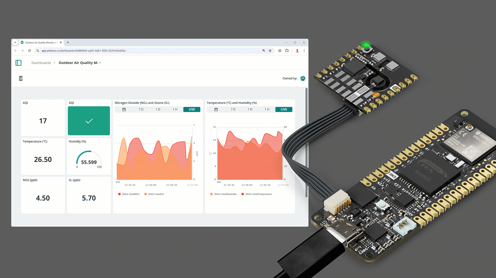
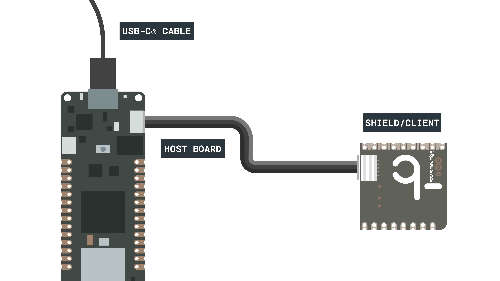
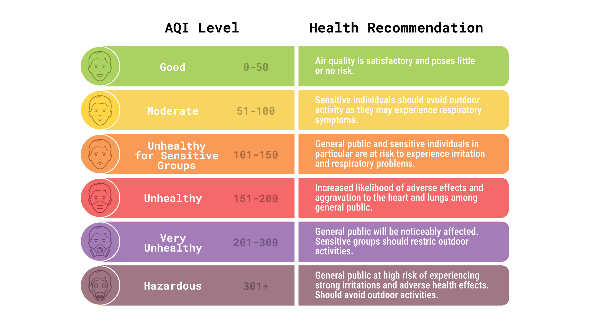
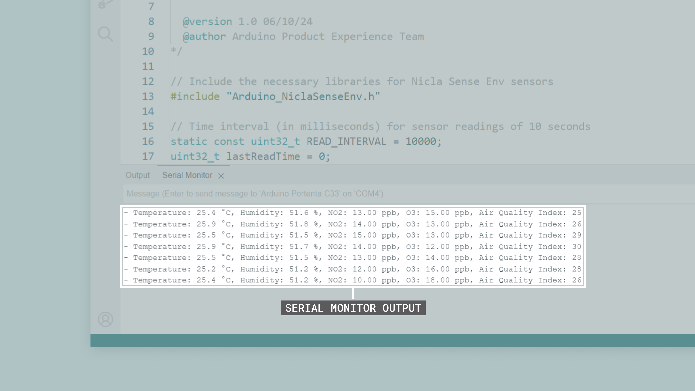
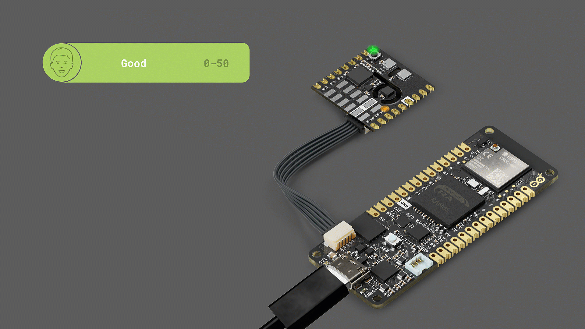
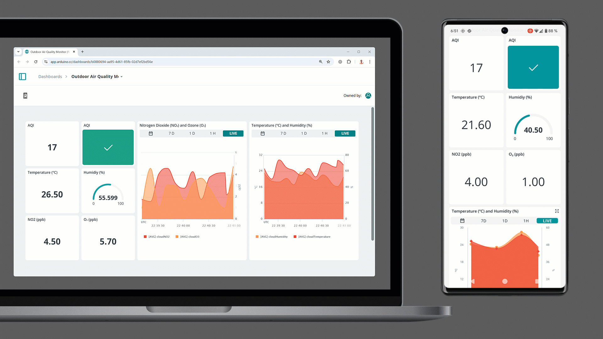

## Introduction

Air pollution is a growing concern in urban and industrial areas due to the harmful effects of airborne pollutants such as nitrogen dioxide (NO₂) and ozone (O₃) on human health and the environment. This application note describes building a basic outdoor air quality monitor using the Arduino® Portenta C33 and the Nicla Sense Env board.



The outdoor air quality monitor provides real-time data on temperature (°C), humidity (%), concentrations of NO₂ (ppb) and O₃ (ppb) and the outdoor Air Quality Index (AQI). It is suitable for deployment in urban areas, industrial zones or environmental research.

## Goals

The main goals of this application note are the following:

- Develop and implement a simple outdoor air quality monitor that provides real-time data on temperature, humidity, and pollutants such as nitrogen dioxide (NO₂) and ozone (O₃).
- Collect real-time data on NO₂, O₃ and the outdoor Air Quality Index (AQI) to evaluate outdoor air conditions.
- Display live readings from the Nicla Sense Env board using the Arduino IDE Serial Monitor for immediate analysis.
- Use the RGB LED on the Nicla Sense Env board to provide visual feedback based on the AQI, indicating air quality levels with different colors.
- Enable remote monitoring and analysis by connecting the outdoor air quality monitor to the Arduino Cloud.

## Hardware and Software Requirements

### Hardware Requirements

- [Nicla Sense Env](https://store.arduino.cc/products/nicla-sense-env) (x1)
- [Portenta C33](https://store.arduino.cc/products/portenta-c33) (x1)
- [USB-C® cable](https://store.arduino.cc/products/usb-cable2in1-type-c) (x1)
- Wi-Fi® W.FL antenna (x1)

### Software Requirements

- [Arduino IDE 2.0+](https://www.arduino.cc/en/software) or [Arduino Web Editor](https://create.arduino.cc/editor)
- [Arduino_NiclaSenseEnv library](https://github.com/arduino-libraries/Arduino_NiclaSenseEnv)
- [Arduino Renesas Portenta Boards core](https://github.com/arduino/ArduinoCore-renesas) (required to work with the Portenta C33 board)
- For the Wi-Fi® connectivity feature of Portenta C33, we will use the [Arduino Cloud](https://create.arduino.cc/iot/things). If you do not have an account, create one for free [here](https://cloud.arduino.cc/).

***The Nicla Sense Env board is not intended as a standalone device but as a shield of another Portenta, MKR, or Nano family board. In this application note, we will use the Portenta C33 as the main board and the Nicla Sense Env board as a shield.***

## Hardware Setup Overview

The electrical connections for the outdoor air quality monitor are outlined in the diagram below:



This diagram shows how the components are connected. The **Portenta C33** is the **host board** or primary controller, while the **Nicla Sense Env** board (the **client board** or shield) collects temperature, humidity, and outdoor air quality data.

The Nicla Sense Env board connects to the Portenta C33 board using the **ESLOV interface**. The outdoor air quality monitor operates with a single power supply bus (`+5 VDC` from the Portenta C33), which powers the Nicla Sense Env. The Portenta C33 is powered via its onboard USB-C port for testing purposes.

## Understanding Outdoor Air Quality

Air pollution is not just a problem in urban areas; rural environments also face significant risks from pollutants like nitrogen dioxide (NO₂) and ozone (O₃). These gases pose serious health risks, especially for vulnerable populations. NO₂, produced by combustion engines and industrial processes, can travel far beyond urban centers. O₃, formed by atmospheric chemical reactions, affects urban and rural regions, especially during warmer seasons of the year.

Real-time monitoring is critical in urban and rural settings to properly manage exposure to these pollutants. Air quality tracking and monitoring help individuals and communities proactively reduce health risks.

### The Role of Sensors in Air Quality Monitoring

This application note uses advanced sensors to provide accurate, real-time measurements of various pollutants. The Nicla Sense Env board offers a versatile outdoor air quality monitoring solution.

- **NO₂ Sensor**: Detects nitrogen dioxide, a harmful gas released by vehicles and industrial activities.
- **O₃ Sensor**: Measures ozone, a gas that forms in the atmosphere through reactions between pollutants and sunlight and contributes to respiratory problems.
- **Outdoor Air Quality Index (AQI)**: The outdoor AQI simplifies the interpretation of air quality by combining data from multiple pollutants (NO₂ and O₃) into a single value. 
  
The AQI scale ranges from 0 to 500, with the following classifications:



The AQI makes it easy to understand how outdoor air quality affects public health, particularly when pollutant levels reach unhealthy or hazardous thresholds.

Monitoring NO₂, O₃, and AQI in real-time allows for immediate responses when air quality worsens. This is especially important in rural areas with less visible air quality issues. The data collected can be sent to platforms like Arduino Cloud, enabling remote monitoring and long-term trend analysis, improving public awareness and policy decisions.

## Simple Environmental Monitor Example Sketch

Now that we have covered the hardware components of our environmental monitor and how they are interconnected, let's study the software that brings this monitor to life. The example sketch in the following section manages data collection from the Nicla Sense Env board connected to the Portenta C33 board, allowing us to monitor real-time environmental data such as temperature, humidity and outdoor air quality.

This section breaks down the provided example sketch, guiding you through its functionality. We will explore how the sensors are initialized, how the data is collected every 10 seconds and how the results are displayed in the Arduino IDE's Serial Monitor. 

The complete example sketch is shown below.

```arduino
/**
  Outdoor Air Quality Monitoring with Arduino
  Name: outdoor_air_quality_monitor.ino
  Purpose: This sketch reads temperature, humidity, and outdoor air quality
  from a Nicla Sense Env board connected to a Portenta C33 board. The data is 
  reported to the Arduino IDE's Serial Monitor every 10 seconds.
  
  @version 1.0 06/10/24
  @author Arduino Product Experience Team
*/

// Include the necessary libraries for Nicla Sense Env sensors
#include "Arduino_NiclaSenseEnv.h"

// Time interval (in milliseconds) for sensor readings of 10 seconds
static const uint32_t READ_INTERVAL = 10000; 
uint32_t lastReadTime = 0;

// Sensor object for Nicla Sense Env data
NiclaSenseEnv device;

/**
  Initializes the sensors and serial communication.
  Configures the Nicla Sense Env board to enable the onboard
  temperature/humidity sensor and the onboard outdoor air 
  quality sensor.
*/
void setup() {
    // Initialize serial communication at 115200 bits per second.
    Serial.begin(115200);
    
    // Wait for Serial to be ready with a timeout of 5 seconds
    for(uint32_t start = millis(); !Serial && millis() - start < 5000;); 

    // Initialize NiclaSenseEnv sensors
    if (device.begin()) {
        Serial.println("- Nicla Sense Env is connected!");

        // Enable the outdoor air quality sensor
        device.outdoorAirQualitySensor().setEnabled(true);  
    } else {
        // Error message if the Nicla Sense Env is not found
        Serial.println("- ERROR: Nicla Sense Env device not found!");
    }
}

/**
  Main loop that reads sensor data every 10 seconds.
  This function continuously checks the time interval and calls
  the displayAllData() function to print sensor readings.
*/
void loop() {
    // Get the current time (in milliseconds)
    uint32_t currentTime = millis();

    // Read sensors every 10 seconds and update the last read time
    if (currentTime - lastReadTime >= READ_INTERVAL) {
        lastReadTime = currentTime;  

        // Read and display all sensor data in a single line
        displayAllData();
    }
}

/**
  Displays temperature, humidity, and air quality data.
  Reads data from the Nicla Sense Env board and prints it 
  in a single line format.
*/
void displayAllData() {
    // Get the temperature/humidity and air quality sensors
    TemperatureHumiditySensor& tempHumSensor = device.temperatureHumiditySensor();
    OutdoorAirQualitySensor& airQualitySensor = device.outdoorAirQualitySensor();

    // Check if both temperature/humidity and air quality sensors are enabled
    if (tempHumSensor.enabled() && airQualitySensor.enabled()) {
        // Read data from the Nicla Sense Env sensors
        float temperature = tempHumSensor.temperature();
        float humidity = tempHumSensor.humidity();
        float NO2 = airQualitySensor.NO2();
        float O3 = airQualitySensor.O3();
        int airQualityIndex = airQualitySensor.airQualityIndex();

        // Print all sensor data in a single line, with AQI at the end
        Serial.print("- Temperature: ");
        Serial.print(temperature, 2);
        Serial.print(" °C, Humidity: ");
        Serial.print(humidity, 2);
        Serial.print(" %, NO2: ");
        Serial.print(NO2, 2);
        Serial.print(" ppb, O3: ");
        Serial.print(O3, 2);
        Serial.print(" ppb, Air Quality Index: ");
        Serial.println(airQualityIndex);
    } else {
        // Error message if one or more sensors are disabled
        Serial.println("- ERROR: One or more sensors are disabled!");
    }
}
```

The following sections will help you to understand the main parts of the example sketch shown before, which can be divided into the following:

- Library imports
- Sensors initialization
- Data collection
- Data display

### Library Imports

The first step is to ensure that all necessary libraries are included to control the Nicla Sense Env board. These libraries provide all the functionality to communicate with and extract sensor data.

```arduino
// Include the necessary libraries for Nicla Sense Env sensors
#include "Arduino_NiclaSenseEnv.h"

// Time interval (in milliseconds) for sensor readings of 10 seconds
static const uint32_t READ_INTERVAL = 10000; 
uint32_t lastReadTime = 0;

// Sensor object for Nicla Sense Env data
NiclaSenseEnv device;
```

In the code snippet shown above:

- The `Arduino_NiclaSenseEnv` library is included to provide access to the onboard sensors.
- The constant `READ_INTERVAL` defines the time between each sensor reading (10 seconds in this example).
- An instance of the `NiclaSenseEnv` class is created to manage the onboard sensors.
  
### Sensors Initialization

The `setup()` function initializes the monitor sensors and prepares them to start collecting data. This is where the sensors "wake up" and prepare to make measurements.

```arduino
void setup() {
    // Initialize serial communication at 115200 bits per second.
    Serial.begin(115200);
    
    // Wait for Serial to be ready with a timeout of 5 seconds
    for(uint32_t start = millis(); !Serial && millis() - start < 5000;); 

    // Initialize NiclaSenseEnv sensors
    if (device.begin()) {
        Serial.println("- Nicla Sense Env is connected!");

        // Enable the outdoor air quality sensor
        device.outdoorAirQualitySensor().setEnabled(true);  
    } else {
        // Error message if the Nicla Sense Env is not found
        Serial.println("- ERROR: Nicla Sense Env device not found!");
    }
}
```

In the code snippet shown above:

- Serial communication is initialized at a `115200` baud rate, allowing data to be sent to the IDE's Serial Monitor.
- The Nicla Sense Env board is initialized to read temperature, humidity and the outdoor Air Quality Index (AQI).

### Data Collection

Once the sensors are ready, the example sketch must continuously collect data. The `loop()` function ensures that data is captured every 10 seconds and sent to the IDE's Serial Monitor.

```arduino
void loop() {
    // Get the current time (in milliseconds)
    uint32_t currentTime = millis();

    // Read sensors every 10 seconds and update the last read time
    if (currentTime - lastReadTime >= READ_INTERVAL) {
        lastReadTime = currentTime;  

        // Read and display all sensor data
        displayAllData();
    }
}
```

In the code snippet shown above:

- The `loop()` function continuously checks if the interval (10 seconds) has passed since the last reading.
- Once the interval is reached, the `displayAllData()` function is called to read sensor data.

### Data Display

The `displayAllData()` function pulls together the data from each sensor and displays it in a single line on the IDE's Serial Monitor. This is the most dynamic part of the example sketch, where the sensors provide real-time readings.

```arduino
void displayAllData() {
    // Get the temperature/humidity and air quality sensors
    TemperatureHumiditySensor& tempHumSensor = device.temperatureHumiditySensor();
    OutdoorAirQualitySensor& airQualitySensor = device.outdoorAirQualitySensor();

    // Check if both temperature/humidity and air quality sensors are enabled
    if (tempHumSensor.enabled() && airQualitySensor.enabled()) {
        // Read data from the Nicla Sense Env sensors
        float temperature = tempHumSensor.temperature();
        float humidity = tempHumSensor.humidity();
        float NO2 = airQualitySensor.NO2();
        float O3 = airQualitySensor.O3();
        int airQualityIndex = airQualitySensor.airQualityIndex();

        // Print all sensor data in a single line, with AQI at the end
        Serial.print("- Temperature: ");
        Serial.print(temperature, 2);
        Serial.print(" °C, Humidity: ");
        Serial.print(humidity, 2);
        Serial.print(" %, NO2: ");
        Serial.print(NO2, 2);
        Serial.print(" ppb, O3: ");
        Serial.print(O3, 2);
        Serial.print(" ppb, Air Quality Index: ");
        Serial.println(airQualityIndex);
    } else {
        // Error message if one or more sensors are disabled
        Serial.println("- ERROR: One or more sensors are disabled!");
    }
}
```

In the code snippet shown before:

- The function first checks that the temperature/humidity sensor and the outdoor air quality sensor are enabled.
- The function retrieves temperature, humidity, gas concentrations (NO₂ and O₃), and the outdoor Air Quality Index (AQI).
- Finally, the data is printed in a single line on the IDE's Serial Monitor, with the AQI displayed at the end.

After uploading the example sketch to the host board, you should see the following output in the Arduino IDE's Serial Monitor:


  
### Complete Example Sketch

The complete improved example sketch can be downloaded [here](assets/outdoor_air_quality_monitor.zip).

## Improving the Simple Environmental Monitor Example Sketch

The previous section explored setting up a simple environmental monitor using the Nicla Sense Env and the Portenta C33 board. While the example sketch provided detailed readings on temperature, humidity and air quality, we can improve the example sketch by incorporating a visual indicator for the outdoor Air Quality Index (AQI).

In this section, we will improve the example sketch by adding control of the onboard RGB LED on the Nicla Sense Env board. The RGB LED will visually represent the outdoor AQI, changing colors based on its value.



The complete example sketch is shown below. The RGB LED will change color based on the following:

- Green 🟢 for **good air quality**.
- Yellow 🟡 for **moderate air quality**.
- Red 🔴 for **bad air quality**.

```arduino
/**
  Outdoor Air Quality Monitoring with RGB LED
  Name: outdoor_air_quality_monitor_rgb.ino
  Purpose: This sketch reads temperature, humidity, and outdoor air quality
  from a Nicla Sense Env board connected to a Portenta C33 board. The 
  onboard RGB LED of the Nicla Sense Env changes color based on the AQI status.
  
  @version 1.0 06/10/24
  @modified by: Arduino Product Experience Team
*/

// Include the necessary libraries for Nicla Sense Env sensors and RGB LED control
#include "Arduino_NiclaSenseEnv.h"

// Time interval (in milliseconds) for sensor readings of 10 seconds
static const uint32_t READ_INTERVAL = 10000; 
uint32_t lastReadTime = 0;

// Sensor object for Nicla Sense Env data
NiclaSenseEnv device;

/**
  Initializes the sensors and serial communication.
  Configures the Nicla Sense Env board to enable the onboard
  temperature/humidity sensor, the outdoor air quality sensor,
  and the RGB LED.
*/
void setup() {
    // Initialize serial communication at 115200 bits per second.
    Serial.begin(115200);
    
    // Wait for Serial to be ready with a timeout of 5 seconds
    for(uint32_t start = millis(); !Serial && millis() - start < 5000;); 

    // Initialize NiclaSenseEnv sensors and RGB LED
    if (device.begin()) {
        Serial.println("- Nicla Sense Env is connected");

        // Enable the outdoor air quality sensor
        device.outdoorAirQualitySensor().setEnabled(true);  

        // Enable the RGB LED
        Serial.println("- RGB LED is enabled");
    } else {
        // Error message if the Nicla Sense Env is not found
        Serial.println("- ERROR: Nicla Sense Env device not found!");
    }
}

/**
  Main loop that reads sensor data every 10 seconds and updates the RGB LED.
  This function continuously checks the time interval, calls the displayAllData()
  function to print sensor readings, and updates the RGB LED color based on the AQI.
*/
void loop() {
    // Get the current time (in milliseconds)
    uint32_t currentTime = millis();

    // Read sensors every 10 seconds and update the last read time
    if (currentTime - lastReadTime >= READ_INTERVAL) {
        lastReadTime = currentTime;  

        // Read and display all sensor data
        displayAllData();
    }
}

/**
  Displays temperature, humidity, and air quality data.
  Additionally, controls the onboard RGB LED color based 
  on the outdoor Air Quality Index (AQI).
*/
void displayAllData() {
    // Get the temperature/humidity and air quality sensors
    TemperatureHumiditySensor& tempHumSensor = device.temperatureHumiditySensor();
    OutdoorAirQualitySensor& airQualitySensor = device.outdoorAirQualitySensor();
    RGBLED& rgbLED = device.rgbLED();

    // Check if both temperature/humidity and air quality sensors are enabled
    if (tempHumSensor.enabled() && airQualitySensor.enabled()) {
        // Read data from the Nicla Sense Env sensors
        float temperature = tempHumSensor.temperature();
        float humidity = tempHumSensor.humidity();
        float NO2 = airQualitySensor.NO2();
        float O3 = airQualitySensor.O3();
        int airQualityIndex = airQualitySensor.airQualityIndex();

        // Print all sensor data in a single line, with AQI at the end
        Serial.print("- Temperature: ");
        Serial.print(temperature, 2);
        Serial.print(" °C, Humidity: ");
        Serial.print(humidity, 2);
        Serial.print(" %, NO2: ");
        Serial.print(NO2, 2);
        Serial.print(" ppb, O3: ");
        Serial.print(O3, 2);
        Serial.print(" ppb, Air Quality Index: ");
        Serial.println(airQualityIndex);

        // Update the onboard RGB LED color based on AQI
        if (airQualityIndex <= 50) {
            // Good air quality: Green LED
            rgbLED.setColor(0, 255, 0);  
            rgbLED.setBrightness(255);   
        } else if (airQualityIndex <= 150) {
            // Moderate air quality: Yellow LED
            rgbLED.setColor(255, 255, 0);
            rgbLED.setBrightness(255);
        } else {
            // Unhealthy air quality: Red LED
            rgbLED.setColor(255, 0, 0);
            rgbLED.setBrightness(100);
        }
    } else {
        // Error message if one or more sensors are disabled
        Serial.println("- ERROR: One or more sensors are disabled!");
    }
}
```

The following sections will help you to understand the main parts of the example sketch shown before, which can be divided into the following:

- Library imports
- Sensors initialization
- Data collection
- Data display

### Library Imports

As in the original example sketch, we include the necessary libraries for interacting with the Nicla Sense Env onboard sensors. The RGB LED control functionality is also managed through the `Arduino_NiclaSenseEnv` library.

```arduino
// Include the necessary libraries for Nicla Sense Env sensors and LED control
#include "Arduino_NiclaSenseEnv.h"

// Time interval (in milliseconds) for sensor readings of 10 seconds
static const uint32_t READ_INTERVAL = 10000; 
uint32_t lastReadTime = 0;

// Sensor object for Nicla Sense Env data
NiclaSenseEnv device;
```

In the code snippet shown before:

- The `Arduino_NiclaSenseEnv` library is included to provide access to the onboard sensors and the RGB LED.
- The constant `READ_INTERVAL` defines the time between each sensor reading (10 seconds in this example).
- An instance of the `NiclaSenseEnv` class is created to manage the onboard sensors and the RGB LED.

### Sensors Initialization

In the `setup()` function, we initialize the Nicla Sense Env's onboard sensors and RGB LED. The outdoor air quality sensor is activated, and the onboard RGB LED is prepared to display the outdoor AQI visually based on the sensor readings.

```arduino
void setup() {
    // Initialize serial communication at 115200 bits per second.
    Serial.begin(115200);
    
    // Wait for Serial to be ready with a timeout of 5 seconds
    for(uint32_t start = millis(); !Serial && millis() - start < 5000;); 

    // Initialize NiclaSenseEnv sensors and RGB LED
    if (device.begin()) {
        Serial.println("- Nicla Sense Env is connected!");

        // Enable the outdoor air quality sensor
        device.outdoorAirQualitySensor().setEnabled(true);  

        // Enable the RGB LED
        Serial.println("- RGB LED is enabled!");
    } else {
        Serial.println("- ERROR: Nicla Sense Env device not found!");
    }
}
```

In the code snippet shown before:

- Serial communication is initialized at a `115200` baud rate, allowing data to be sent to the IDE's Serial Monitor.
- The Nicla Sense Env board is initialized to read temperature, humidity and the outdoor Air Quality Index (AQI).
- The onboard RGB LED is also initialized and prepared to be controlled based on the outdoor AQI.

### Data Collection

Once the sensors are ready, the example sketch must continuously collect data. The `loop()` function ensures that data is captured every 10 seconds and sent to the IDE's Serial Monitor.

```arduino
void loop() {
    uint32_t currentTime = millis();

    if (currentTime - lastReadTime >= READ_INTERVAL) {
        lastReadTime = currentTime;  
        displayAllData();  // Collect sensor data and update RGB LED
    }
}
```

In the code snippet shown before:

- The `loop()` function continuously checks if the interval (10 seconds) has passed since the last reading.
- Once the interval is reached, the `displayAllData()` function is called to read sensor data and update the RGB LED accordingly.

### Data Display

The `displayAllData()` function collects temperature, humidity, NO₂, O₃, and outdoor AQI values. Based on the outdoor AQI, it updates the RGB LED color to reflect air quality conditions: green 🟢 for good, yellow 🟡 for moderate, and red 🔴 for unhealthy.

```arduino
void displayAllData() {
    // Get the temperature/humidity and air quality sensors
    TemperatureHumiditySensor& tempHumSensor = device.temperatureHumiditySensor();
    OutdoorAirQualitySensor& airQualitySensor = device.outdoorAirQualitySensor();
    auto rgbLED = device.rgbLED();

    // Check if both temperature/humidity and air quality sensors are enabled
    if (tempHumSensor.enabled() && airQualitySensor.enabled()) {
        // Read data from the Nicla Sense Env sensors
        float temperature = tempHumSensor.temperature();
        float humidity = tempHumSensor.humidity();
        float NO2 = airQualitySensor.NO2();
        float O3 = airQualitySensor.O3();
        int airQualityIndex = airQualitySensor.airQualityIndex();

        // Print all sensor data in a single line, with AQI at the end
        Serial.print("- Temperature: ");
        Serial.print(temperature, 2);
        Serial.print(" °C, Humidity: ");
        Serial.print(humidity, 2);
        Serial.print(" %, NO2: ");
        Serial.print(NO2, 2);
        Serial.print(" ppb, O3: ");
        Serial.print(O3, 2);
        Serial.print(" ppb, Air Quality Index: ");
        Serial.println(airQualityIndex);

        // Update the onboard RGB LED color based on AQI
        if (airQualityIndex <= 50) {
            // Good air quality: Green LED
            rgbLED.setColor(0, 255, 0);  
            rgbLED.setBrightness(255);   
        } else if (airQualityIndex <= 150) {
            // Moderate air quality: Yellow LED
            rgbLED.setColor(255, 255, 0);
            rgbLED.setBrightness(255);
        } else {
            // Unhealthy air quality: Red LED
            rgbLED.setColor(255, 0, 0);
            rgbLED.setBrightness(100);
        }
    } else {
        // Error message if one or more sensors are disabled
        Serial.println("- ERROR: One or more sensors are disabled!");
    }
}
```

In the code snippet shown before:

- The function first checks that the temperature/humidity sensor and the outdoor air quality sensor are enabled.
- The function retrieves temperature, humidity, gas concentrations (NO₂ and O₃), and the outdoor Air Quality Index (AQI).
- Finally, the data is printed in a single line on the IDE's Serial Monitor, with the outdoor AQI displayed at the end.
- Based on the outdoor AQI, the RGB LED color is set to green, yellow, or red to indicate good, moderate, or unhealthy air quality.
- The function ensures that the RGB LED brightness is 100% for visibility.

After uploading the example sketch to the host board, you should see the following output in the Arduino IDE's Serial Monitor:


### Complete Example Sketch

The complete improved example sketch can be downloaded [here](assets/outdoor_air_quality_monitor_rgb.zip).

## Connecting the Environmental Monitor to Arduino Cloud

As environmental monitoring continues to grow in importance, connecting devices to the Internet enables real-time, remote data monitoring, allowing for easier tracking and response to changing conditions. Connecting our environmental monitor with the [Arduino Cloud](https://cloud.arduino.cc/) allows us access to live sensor data from anywhere. This connection turns the monitor into an Internet of Things (IoT) device, offering timely insights into air quality, temperature, and humidity through a centralized dashboard.

In this section, we will connect the environmental monitor to Arduino Cloud. The data collected from the monitor's sensors (temperature, humidity, NO₂, O₃, and AQI) will be transmitted to the Arduino Cloud, which can be monitored via a web-based dashboard or a mobile app. The onboard RGB LED of the Portenta C33 will continue to provide visual feedback based on the current AQI level.

***If you are new to Arduino Cloud, please check out [this tutorial](https://docs.arduino.cc/arduino-cloud/guides/overview/).***

Please begin by creating a new **Thing** in your Arduino Cloud with the following variables: 

- cloudTemperature
- cloudHumidity 
- cloudNO2 
- cloudO3 
- cloudAQI
- cloudAQIAlert

All variables must be **`float`** type except for the `cloudAQIAlert` (**`boolean`**), have **`Read Only`** permission and a **`On Change`** update policy. On the `thingProperties.h` header file, automatically generated by the Arduino Cloud, remember to update your Wi-Fi® credentials (SSID and password).

The complete example sketch is shown below and can be downloaded from [here](assets/cloud_air_quality_monitor.zip).

```arduino
/**
  Outdoor Air Quality Monitoring with Arduino Cloud and RGB LED
  Name: outdoor_air_quality_monitor_rgb_cloud.ino
  Purpose: This sketch reads temperature, humidity, and outdoor air quality
  (NO2, O3, AQI) from a Nicla Sense Env board connected to a Portenta C33 board.
  The data is sent to Arduino Cloud, where it can be monitored remotely via a 
  web interface or mobile app. The onboard RGB LED of the Nicla Sense Env changes 
  color based on the AQI status (green for good, yellow for moderate and red for unhealthy).
  
  @version 1.1 06/10/24
  @modified by: Arduino Product Experience Team
*/

// Include necessary libraries for Nicla Sense Env sensors and Arduino Cloud
#include "Arduino_NiclaSenseEnv.h"

// Automatically generated by Arduino Cloud for property synchronization
#include "thingProperties.h"  

// Set time interval (in milliseconds) for sensor readings (10 seconds)
static const uint32_t READ_INTERVAL = 10000; 
uint32_t lastReadTime = 0;

// Sensor object for Nicla Sense Env data collection
NiclaSenseEnv device;

/**
  Initializes the sensors, serial communication, and Arduino Cloud connection.
  This function prepares the system to begin collecting environmental data and
  transmitting it to Arduino Cloud.
*/
void setup() {
  // Initialize serial communication at 9600 baud rate
  Serial.begin(9600);

  // Short delay to wait for Serial Monitor to be ready
  delay(1500);

  // Initialize Cloud properties and connect to Arduino IoT Cloud
  initProperties();
  ArduinoCloud.begin(ArduinoIoTPreferredConnection);

  // Debug information
  setDebugMessageLevel(2);
  ArduinoCloud.printDebugInfo();

  // Initialize Nicla Sense Env sensors
  if (device.begin()) {
    Serial.println("- Nicla Sense Env board connected!");

    // Enable the outdoor air quality sensor
    device.outdoorAirQualitySensor().setEnabled(true);
  } else {
    Serial.println("- ERROR: Nicla Sense Env device not found!");
  }
}

/**
  Main loop that reads sensor data every 10 seconds and sends updates to Arduino Cloud.
  This function also controls the RGB LED to provide local feedback on air quality levels.
*/
void loop() {
  // Update Arduino Cloud connection
  ArduinoCloud.update();

  // Get the current time
  uint32_t currentTime = millis();

  // Read sensors every 10 seconds
  if (currentTime - lastReadTime >= READ_INTERVAL) {
    lastReadTime = currentTime;
    readSensors();
  }
}

/**
  Reads sensor data and updates Cloud variables.
  Provides real-time feedback via the RGB LED based on AQI levels.
*/
void readSensors() {
  // Get temperature/humidity and air quality sensors
  TemperatureHumiditySensor& tempHumSensor = device.temperatureHumiditySensor();
  OutdoorAirQualitySensor& airQualitySensor = device.outdoorAirQualitySensor();
  RGBLED& rgbLED = device.rgbLED();

  // Check if sensors are enabled
  if (tempHumSensor.enabled() && airQualitySensor.enabled()) {
    // Read sensor data
    float temperature = tempHumSensor.temperature();
    float humidity = tempHumSensor.humidity();
    float NO2 = airQualitySensor.NO2();
    float O3 = airQualitySensor.O3();
    int airQualityIndex = airQualitySensor.airQualityIndex();

    // Print sensor data to Serial Monitor
    Serial.print("- Temperature: ");
    Serial.print(temperature, 2);
    Serial.print(" °C, Humidity: ");
    Serial.print(humidity, 2);
    Serial.print(" %, NO2: ");
    Serial.print(NO2, 2);
    Serial.print(" ppb, O3: ");
    Serial.print(O3, 2);
    Serial.print(" ppb, Air Quality Index: ");
    Serial.println(airQualityIndex);

    // Update the onboard RGB LED color based on AQI
    if (airQualityIndex <= 50) {
      // Good air quality: Green LED
      rgbLED.setColor(0, 255, 0);
      rgbLED.setBrightness(255);
      // Set alert to 1 for good air quality
      cloudAQIAlert = 1;
      Serial.println("RGB LED: Green (Good)");
    } else if (airQualityIndex <= 100) {
      // Moderate air quality: Yellow LED
      rgbLED.setColor(255, 255, 0);
      rgbLED.setBrightness(255);
      // Set alert to 0 for moderate air quality
      cloudAQIAlert = 0;
      Serial.println("RGB LED: Yellow (Moderate)");
    } else {
      // Unhealthy air quality: Red LED
      rgbLED.setColor(255, 0, 0);
      rgbLED.setBrightness(100);
      // Set alert to 0 for moderate air quality
      cloudAQIAlert = 0;
      Serial.println("RGB LED: Red (Unhealthy)"); 
    }

    // Update Arduino Cloud variables
    cloudTemperature = temperature;
    cloudHumidity = humidity;
    cloudNO2 = NO2;
    cloudO3 = O3;
    cloudAQI = airQualityIndex;

  } else {
    Serial.println("- ERROR: One or more sensors are disabled!");
  }
}
```

The following sections will help you to understand the main parts of the example sketch shown before, which can be divided into the following:

- Library imports
- Cloud and sensor initialization
- Data collection and Cloud Updates
- Cloud variables update

### Library Imports

The necessary libraries for interacting with Nicla Sense Env board sensors and integrating with Arduino Cloud are included at the start.

```arduino
// Include necessary libraries for Nicla Sense Env sensors and Arduino Cloud
#include "Arduino_NiclaSenseEnv.h"

// Automatically generated by Arduino Cloud for property synchronization
#include "thingProperties.h"
```

In the code snippet shown before:

- The `thingProperties.h` header file is included. Arduino Cloud generates this file to handle the synchronization of cloud variables. This allows sensor data (e.g., temperature, humidity, etc.) to be synchronized automatically with the Arduino Cloud dashboard for remote monitoring.

### Cloud and Sensors Initialization

In the `setup()` function, we initialize the Nicla Sense Env onboard sensors and establish the connection to Arduino Cloud.

```arduino
void setup() {
  // Initialize serial communication at 9600 baud rate
  Serial.begin(9600);

  // Short delay to wait for Serial Monitor to be ready
  delay(1500);

  // Initialize Cloud properties and connect to Arduino IoT Cloud
  initProperties();
  ArduinoCloud.begin(ArduinoIoTPreferredConnection);

  // Debug information
  setDebugMessageLevel(2);
  ArduinoCloud.printDebugInfo();

  // Initialize Nicla Sense Env sensors
  if (device.begin()) {
    Serial.println("- Nicla Sense Env board connected!");

    // Enable the outdoor air quality sensor
    device.outdoorAirQualitySensor().setEnabled(true);
  } else {
    Serial.println("- ERROR: Nicla Sense Env device not found!");
  }
}
```
In the code snippet shown before:

- The Arduino Cloud connection is initialized using `initProperties()` and `ArduinoCloud.begin()`. These functions manage the link between local sensor variables and the cloud.
- Debugging is enabled with `setDebugMessageLevel(2)`, providing feedback on the connection status.
- The Nicla Sense Env sensors are also initialized and the outdoor air quality sensor is enabled.

### Data Collection and Cloud Updates

In the `loop()` function, sensor data is collected every 10 seconds and synchronized with the Arduino Cloud.

```arduino
void loop() {
  // Update Arduino Cloud connection
  ArduinoCloud.update();

  // Get the current time
  uint32_t currentTime = millis();

  // Read sensors every 10 seconds
  if (currentTime - lastReadTime >= READ_INTERVAL) {
    lastReadTime = currentTime;
    readSensors();
  }
}
```

In the code snippet shown before:

- The `ArduinoCloud.update()` function ensures that the Cloud connection is maintained and any updates to the sensor data are sent to the Arduino Cloud.
- The `readSensors()` function is called every 10 seconds to read sensor data and update the Cloud variables.

### Cloud Variables Update

The `readSensors()` function reads data from the sensors and updates the Arduino Cloud variables. It also changes the RGB LED color of the Portenta C33 board based on AQI levels.

```arduino
void readSensors() {
  // Get temperature/humidity and air quality sensors
  TemperatureHumiditySensor& tempHumSensor = device.temperatureHumiditySensor();
  OutdoorAirQualitySensor& airQualitySensor = device.outdoorAirQualitySensor();
  RGBLED& rgbLED = device.rgbLED();

  // Check if sensors are enabled
  if (tempHumSensor.enabled() && airQualitySensor.enabled()) {
    // Read sensor data
    float temperature = tempHumSensor.temperature();
    float humidity = tempHumSensor.humidity();
    float NO2 = airQualitySensor.NO2();
    float O3 = airQualitySensor.O3();
    int airQualityIndex = airQualitySensor.airQualityIndex();

    // Print sensor data to Serial Monitor
    Serial.print("- Temperature: ");
    Serial.print(temperature, 2);
    Serial.print(" °C, Humidity: ");
    Serial.print(humidity, 2);
    Serial.print(" %, NO2: ");
    Serial.print(NO2, 2);
    Serial.print(" ppb, O3: ");
    Serial.print(O3, 2);
    Serial.print(" ppb, Air Quality Index: ");
    Serial.println(airQualityIndex);

    // Update the onboard RGB LED color based on AQI
    if (airQualityIndex <= 50) {
      // Good air quality: Green LED
      rgbLED.setColor(0, 255, 0);
      rgbLED.setBrightness(255);
      // Set alert to 1 for good air quality
      cloudAQIAlert = 1;
      Serial.println("RGB LED: Green (Good)");
    } else if (airQualityIndex <= 100) {
      // Moderate air quality: Yellow LED
      rgbLED.setColor(255, 255, 0);
      rgbLED.setBrightness(255);
      // Set alert to 0 for moderate air quality
      cloudAQIAlert = 0;
      Serial.println("RGB LED: Yellow (Moderate)");
    } else {
      // Unhealthy air quality: Red LED
      rgbLED.setColor(255, 0, 0);
      rgbLED.setBrightness(100);
      // Set alert to 0 for moderate air quality
      cloudAQIAlert = 0;
      Serial.println("RGB LED: Red (Unhealthy)");
    }

    // Update Arduino Cloud variables
    cloudTemperature = temperature;
    cloudHumidity = humidity;
    cloudNO2 = NO2;
    cloudO3 = O3;
    cloudAQI = airQualityIndex;

  } else {
    Serial.println("- ERROR: One or more sensors are disabled!");
  }
}
```

In the code snippet shown before:

- The RGB LED changes color based on the AQI value. Green 🟢 for good, yellow 🟡 for moderate, and red 🔴 for unhealthy.
- The cloud variables (`cloudTemperature`, `cloudHumidity`, `cloudNO2`, `cloudO3`, and `cloudAQI`) are updated with the latest sensor readings and sent to Arduino Cloud for remote monitoring. The `cloudAQIAlert` variable indicates whether the air quality is good or unhealthy.

The complete cloud example sketch can be downloaded [here](assets/cloud_air_quality_monitor.zip).

### Arduino Cloud Dashboard

The Arduino Cloud allows us to create a dashboard with professional real-time Human-Computer Interaction (HCI) elements, as seen in the following animation shows an active outdoor air quality monitor. **The animation has been sped up for illustrative purposes**.



## Conclusions

In this application note, we explored how to integrate a Portenta C33 board with a Nicla Sense Env board to monitor environmental data such as temperature, humidity, NO₂, O₃, and AQI. We also demonstrated how Arduino Cloud allows for easy remote monitoring and real-time visualization of this data.

By using the Portenta C33, the Nicla Sense Env, and the Arduino Cloud, we can turn sensor readings into useful information. This setup makes it possible to monitor outdoor air quality, provide real-time feedback with the onboard RGB LED of the Portenta C33, and view the data remotely through a web dashboard or mobile app.

The main takeaway from this application is its potential for real-world use. By integrating IoT and Cloud technology, we can monitor air quality remotely, respond to environmental changes more quickly, and contribute to improving living conditions and sustainability efforts.

## Next Steps

There are several opportunities to enhance the functionality of the outdoor air quality monitor:

- Integrate additional sensors to measure specific pollutants such as carbon monoxide (CO) or sulfur dioxide (SO₂).
- Optimize the monitor’s energy efficiency to support long-term use in remote or outdoor locations.
- Create a custom dashboard on Arduino Cloud to track data trends over time and enable more in-depth air quality analysis.
- Develop an alert system that notifies users when pollutant levels exceed safe limits.
- Expand the system’s use to different geographical areas to gather comparative air quality data.