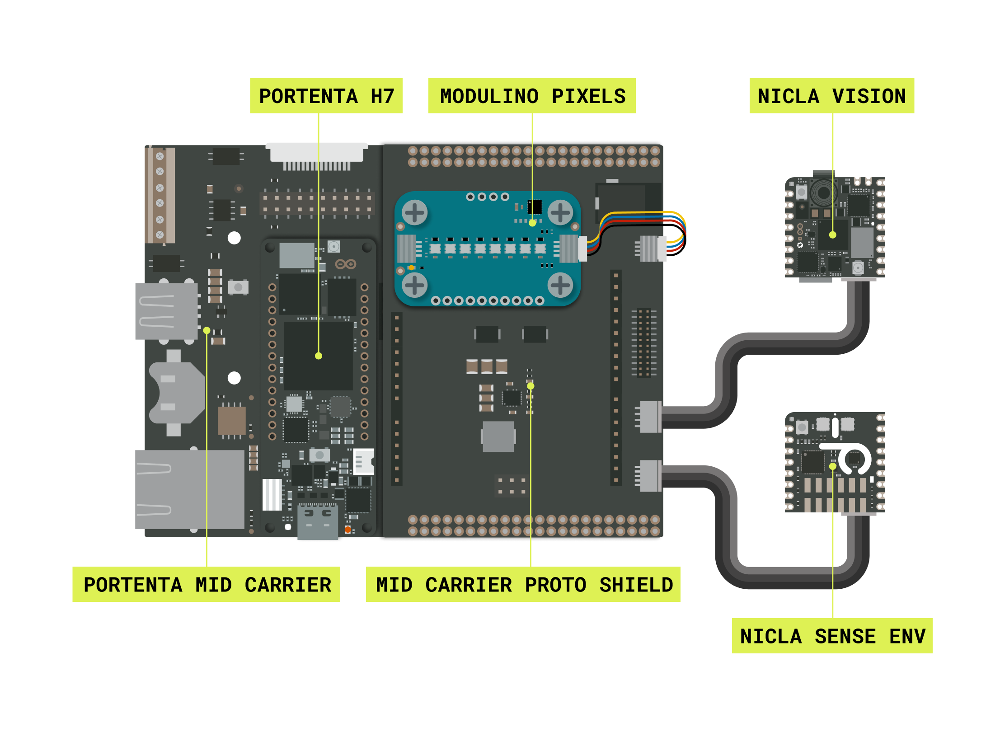
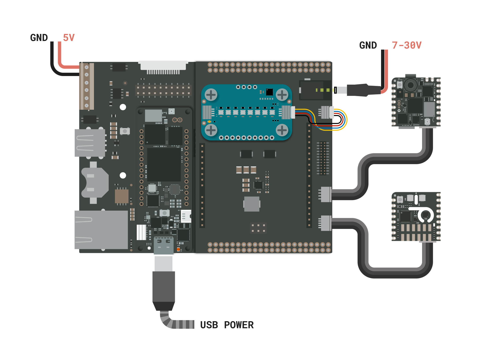

## Introduction

Air pollution is a threat that lurks even where we least expect it, from the comfort of our homes to our workplaces. Pollutants like CO₂ and volatile organic compounds (TVOC) silently threaten our health, representing a determining factor for our quality of life. This application note describes the building of an air quality monitor and occupancy machine vision tracker for indoor environments, in this case an elevator.

The monitoring system will measure the elevator's temperature, relative humidity, indoor air quality (IAQ), estimated CO₂ and total volatile organic compounds (TVOC) while counting the people inside the elevator. All this information will be forwarded to the Arduino Cloud for further visualization and tracking. The system will give a real-time visual feedback of the condition inside the elevator to warn people of harmful air quality.

## Goals

The project showcased in this application note has the following objectives:

- Monitoring the air quality and environmental variables inside the elevator.
- Counting the people inside the elevator using Machine Vision.
- Giving real-time visual feedback of the conditions of the elevator using Modulino® Pixels:.
- Sharing all the gathered data to the Arduino Cloud for remote monitoring.

## Hardware and Software Requirements

### Hardware Requirements

This project is meant to be developed with the **Portenta Proto Kit** that includes the following products among others:

- [Nicla Sense Env](https://store.arduino.cc/products/nicla-sense-env) (x1)
- [Nicla Vision](https://store.arduino.cc/products/nicla-vision) (x1)
- [Portenta Mid Carrier](https://store.arduino.cc/products/portenta-mid-carrier) (x1)
- [Portenta H7](https://store.arduino.cc/products/portenta-h7) (x1)
- Modulino Pixels (x1)
- Portenta Mid Carrier Proto Shield (x1)
- [USB-C® cable](https://store.arduino.cc/products/usb-cable2in1-type-c) (x1)
- Wi-Fi® W.FL antenna (x1)
- ESLOV cable (x2)
- Qwiic cable (x1)
- Custom 3D printed parts

### Software Requirements

- [Arduino IDE 2.0+](https://www.arduino.cc/en/software) or [Arduino Web Editor](https://create.arduino.cc/editor)
- [OpenMV IDE](https://openmv.io/pages/download)
- [Arduino_NiclaSenseEnv library](https://github.com/arduino-libraries/Arduino_NiclaSenseEnv)
- [Arduino Portenta Boards core](https://github.com/arduino/ArduinoCore-mbed) (required to work with the Portenta H7 board)
- [Arduino Cloud](https://create.arduino.cc/iot/things). If you do not have an account, create one for free [here](https://cloud.arduino.cc/).

## Smart Elevator Monitoring System Setup

The electrical connections for the project are outlined in the diagram below:

This diagram shows how the components are connected. 

- The Portenta H7 is attached to the Portenta Mid Carrier using the High-Density connectors.
- The Mid Carrier Proto Shield is stacked to the Portenta Mid Carrier using the breakout connectors.
- The Modulino Pixels is wired to the Portenta Mid Carrier using the Qwiic cable and fixed with the included screws and nuts.
- The Nicla Vision and the Nicla Sense Env are wired to the Mid Carrier Proto Shield using ESLOV cables.

To power the project you can use the terminal block of the Portenta Mid Carrier, the USB-C connector of the Portenta H7 or the barrel jack of the Mid Carrier Proto Shield.

## Smart Elevator Monitoring System Overview

### Complete Example Sketch

The complete improved example sketch can be downloaded [here]().

## Connecting the Environmental Monitor to Arduino Cloud

### Arduino Cloud Dashboard

The Arduino Cloud allows us to create a dashboard with professional real-time Human-Computer Interaction (HCI) elements, as seen in the following animation shows an active outdoor air quality monitor. **The animation has been sped up for illustrative purposes**.

## Conclusions

In this application note, we explored how to integrate a Portenta C33 board with a Nicla Sense Env board to monitor environmental data such as temperature, humidity, NO₂, O₃, and AQI. We also demonstrated how Arduino Cloud allows for easy remote monitoring and real-time visualization of this data.

By using the Portenta C33, the Nicla Sense Env, and the Arduino Cloud, we can turn sensor readings into useful information. This setup makes it possible to monitor outdoor air quality, provide real-time feedback with the onboard RGB LED of the Portenta C33, and view the data remotely through a web dashboard or mobile app.

The main takeaway from this application is its potential for real-world use. By integrating IoT and Cloud technology, we can monitor air quality remotely, respond to environmental changes more quickly, and contribute to improving living conditions and sustainability efforts.

## Next Steps

There are several opportunities to enhance the functionality of the outdoor air quality monitor:

- Integrate additional sensors to measure specific pollutants such as carbon monoxide (CO) or sulfur dioxide (SO₂).
- Optimize the monitor’s energy efficiency to support long-term use in remote or outdoor locations.
- Create a custom dashboard on Arduino Cloud to track data trends over time and enable more in-depth air quality analysis.
- Develop an alert system that notifies users when pollutant levels exceed safe limits.
- Expand the system’s use to different geographical areas to gather comparative air quality data.