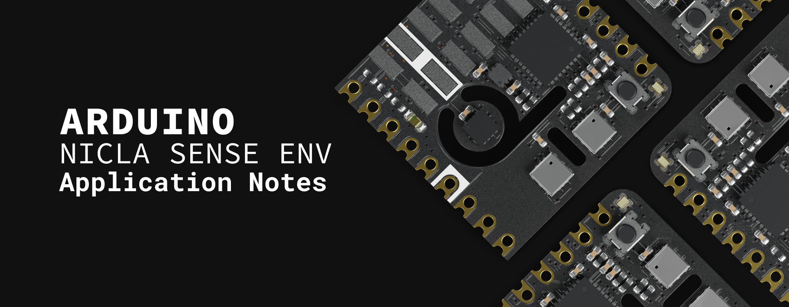

## Introduction

Air pollution is a growing concern in urban and industrial areas due to the harmful effects of airborne pollutants such as nitrogen dioxide (NO₂) and ozone (O₃) on human health and the environment. This application note describes how to build a basic outdoor air quality monitor using the Arduino® Portenta C33 and the Nicla Sense Env board.

The outdoor air quality monitor provides real-time data on temperature (°C), humidity (%), concentrations of NO₂ (ppb) and O₃ (ppb), as well as the outdoor air quality index (AQI). It is suitable for deployment in urban areas, industrial zones or environmental research.

## Goals

The main goals of this application note are as follows:

- Develop and implement a simple outdoor air quality monitor that provides real-time data on temperature, humidity, and pollutants such as nitrogen dioxide (NO₂) and ozone (O₃).
- Collect real-time data on NO₂, O₃ and the outdoor air quality index (AQI) to evaluate outdoor air conditions.
- Display live readings from the Nicla Sense Env board using the Arduino IDE Serial Monitor for immediate analysis.
- Enable remote monitoring and analysis by connecting the monitor to the Arduino Cloud.

## Hardware and Software Requirements

### Hardware Requirements

- [Nicla Sense Env](https://store.arduino.cc/products/nicla-sense-env) (x1)
- [Portenta C33](https://store.arduino.cc/products/portenta-c33) (x1)
- [USB-C® cable](https://store.arduino.cc/products/usb-cable2in1-type-c) (x1)
- Wi-Fi® W.FL antenna (x1)

### Software Requirements

- [Arduino IDE 2.0+](https://www.arduino.cc/en/software) or [Arduino Web Editor](https://create.arduino.cc/editor)
- [Arduino_NiclaSenseEnv library](https://github.com/arduino-libraries/Arduino_NiclaSenseEnv)
- [Arduino Renesas Portenta Boards core](https://github.com/arduino/ArduinoCore-renesas) (required to work with the Portenta C33 board)

***The Nicla Sense Env board is not intended as a standalone device but as a shield of another Portenta, MKR, or Nano family board. In this application note, we will use the Portenta C33 as the main board and the Nicla Sense Env board as a shield.***

## Hardware Setup Overview

The electrical connections for the outdoor air quality monitor are outlined in the diagram below:

This diagram shows how the components are connected. The Portenta C33 serves as the host board or primary controller, while the Nicla Sense Env board (the host board or shield) collects temperature, humidity, and outdoor air quality data.


The Nicla Sense Env board connects to the Portenta C33 using the ESLOV interface. The monitor operates with a single power supply bus (+5 VDC from the Portenta C33), which powers the Nicla Sense Env. For testing purposes, the Portenta C33 is powered via its onboard USB-C port.

## Understanding Outdoor Air Quality

Air pollution is not just a problem in urban areas; rural environments also face significant risks from pollutants like nitrogen dioxide (NO₂) and ozone (O₃). These gases pose serious health risks, especially for vulnerable populations. NO₂, produced by combustion engines and industrial processes, can travel far beyond urban centers. O₃, formed by atmospheric chemical reactions, affects urban and rural regions, especially during warmer seasons of the year.

Real-time monitoring is critical in urban and rural settings to manage exposure to these pollutants properly. Air quality tracking and monitoring helps individuals and communities to proactively reduce health risks.

### The Role of Sensors in Air Quality Monitoring

This application note uses advanced sensors to provide accurate, real-time measurements of various pollutants. The Nicla Sense Env board offers a versatile solution for outdoor air quality monitoring.

- **NO₂ Sensor**: Detects nitrogen dioxide, a harmful gas released by vehicles and industrial activities.
- **O₃ Sensor**: Measures ozone, a gas that forms in the atmosphere through reactions between pollutants and sunlight, contributing to respiratory problems.
- **Outdoor Air Quality Index (AQI)**: The outdoor AQI simplifies the interpretation of air quality by combining data from multiple pollutants (NO₂ and O₃) into a single value. 
  
The AQI scale ranges from 0 to 500, with the following classifications:

- 0-50: Good air quality.
- 51-100: Moderate air quality.
- 101-150: Unhealthy for sensitive groups.
- 151-200: Unhealthy for everyone.
- 201-300: Very unhealthy.
- 301-500: Hazardous conditions.

The AQI makes it easy to understand how outdoor air quality affects public health, particularly when pollutant levels reach unhealthy or hazardous thresholds.

Monitoring NO₂, O₃, and AQI in real-time allows for immediate responses when air quality worsens. This is especially important in rural areas with less visible air quality issues. The data collected can be sent to platforms like Arduino Cloud, enabling remote monitoring and long-term trend analysis, improving public awareness and policy decisions.

## Simple Environmental Monitor Example Sketch

Now that we have covered the hardware components of our environmental monitor and how they are interconnected, let's study the software that brings this monitor to life. The example sketch in the following section manages data collection from the Nicla Sense Env board and the PMS7003 sensor connected to the Portenta C33 board, allowing us to monitor real-time environmental data such as temperature, humidity, outdoor air quality, and particulate matter concentrations.

This section breaks down the provided example sketch, guiding you through its functionality. We will explore how the sensors are initialized, how the data is collected every 10 seconds, and how the results are displayed in the Arduino IDE's Serial Monitor. 

The complete example sketch is shown below.

```arduino
/**
  Outdoor Air Quality Monitoring with Arduino
  Name: outdoor_air_quality_monitor.ino
  Purpose: This sketch reads temperature, humidity, and outdoor air quality
  from the Nicla Sense Env connected to the Portenta C33 board.
  The data is reported to the Arduino IDE's Serial Monitor every 10 seconds.
  
  @version 1.1 06/10/24
  @author Arduino Product Experience Team
*/

// Include the necessary libraries for Nicla Sense Env sensors
#include "Arduino_NiclaSenseEnv.h"

// Time interval (in milliseconds) for sensor readings of 10 seconds
static const uint32_t READ_INTERVAL = 10000; 
uint32_t lastReadTime = 0;

// Sensor object for Nicla Sense Env data
NiclaSenseEnv device;

/**
  Initializes the sensors and serial communication.
  Configures the Nicla Sense Env board to enable the onboard
  temperature/humidity sensor and the onboard outdoor air 
  quality sensor.
*/
void setup() {
    // Initialize serial communication at 115200 bits per second.
    Serial.begin(115200);
    
    // Wait for Serial to be ready with a timeout of 5 seconds
    for(uint32_t start = millis(); !Serial && millis() - start < 5000;); 

    // Initialize NiclaSenseEnv sensors
    if (device.begin()) {
        Serial.println("- Nicla Sense Env is connected");

        // Enable the outdoor air quality sensor
        device.outdoorAirQualitySensor().setEnabled(true);  
    } else {
        // Error message if the Nicla Sense Env is not found
        Serial.println("- ERROR: Nicla Sense Env device not found!");
    }
}

/**
  Main loop that reads sensor data every 10 seconds.
  This function continuously checks the time interval and calls
  the displayAllData() function to print sensor readings.
*/
void loop() {
    // Get the current time (in milliseconds)
    uint32_t currentTime = millis();

    // Read sensors every 10 seconds and update the last read time
    if (currentTime - lastReadTime >= READ_INTERVAL) {
        lastReadTime = currentTime;  

        // Read and display all sensor data in a single line
        displayAllData();
    }
}

/**
  Displays temperature, humidity, and air quality data.
  Reads data from the Nicla Sense Env and prints it in a single line format.
*/
void displayAllData() {
    // Get the temperature/humidity and air quality sensors
    TemperatureHumiditySensor& tempHumSensor = device.temperatureHumiditySensor();
    OutdoorAirQualitySensor& airQualitySensor = device.outdoorAirQualitySensor();

    // Check if both temperature/humidity and air quality sensors are enabled
    if (tempHumSensor.enabled() && airQualitySensor.enabled()) {
        // Read data from the Nicla Sense Env sensors
        float temperature = tempHumSensor.temperature();
        float humidity = tempHumSensor.humidity();
        float NO2 = airQualitySensor.NO2();
        float O3 = airQualitySensor.O3();
        int airQualityIndex = airQualitySensor.airQualityIndex();

        // Print all sensor data in a single line, with AQI at the end
        Serial.print("- Temperature: ");
        Serial.print(temperature, 2);
        Serial.print(" °C, Humidity: ");
        Serial.print(humidity, 2);
        Serial.print(" %, NO2: ");
        Serial.print(NO2, 2);
        Serial.print(" ppb, O3: ");
        Serial.print(O3, 2);
        Serial.print(" ppb, Air Quality Index: ");
        Serial.println(airQualityIndex);
    } else {
        // Error message if one or more sensors are disabled
        Serial.println("- ERROR: One or more sensors are disabled!");
    }
}
```

The following sections will help you to understand the main parts of the example sketch shown before, which can be divided into the following:

- Library imports
- Sensors initialization
- Data collection
- Data display

### Library Imports

The first step is to ensure that all necessary libraries are included to control the Nicla Sense Env board. These libraries provide all the functionality to communicate with and extract sensor data.

```arduino
// Include the necessary libraries for Nicla Sense Env sensors
#include "Arduino_NiclaSenseEnv.h"

// Time interval (in milliseconds) for sensor readings of 10 seconds
static const uint32_t READ_INTERVAL = 10000; 
uint32_t lastReadTime = 0;

// Sensor object for Nicla Sense Env data
NiclaSenseEnv device;
```

The `Arduino_NiclaSenseEnv` library handles data such as temperature, humidity, and outdoor air quality, including NO, and O₃ gas concentrations.

### Sensors Initialization

The `setup()` function initializes the monitor sensors and prepares them to start collecting data. This is where the sensors "wake up" and prepare to make measurements.

```arduino
void setup() {
    // Initialize serial communication at 115200 bits per second.
    Serial.begin(115200);
    
    // Wait for Serial to be ready with a timeout of 5 seconds
    for(uint32_t start = millis(); !Serial && millis() - start < 5000;); 

    // Initialize NiclaSenseEnv sensors
    if (device.begin()) {
        Serial.println("- Nicla Sense Env is connected!");

        // Enable the outdoor air quality sensor
        device.outdoorAirQualitySensor().setEnabled(true);  
    } else {
        // Error message if the Nicla Sense Env is not found
        Serial.println("- ERROR: Nicla Sense Env device not found!");
    }
}
```

In the code snippet shown before:

- Serial communication is initialized to allow data transmission.
- The Nicla Sense Env board is initialized to read temperature, humidity and the outdoor air quality index (AQI).

### Data Collection

Once the sensors are ready, the example sketch must continuously collect data. The `loop()` function ensures that data is captured every 10 seconds and sent to the IDE's Serial Monitor.

```arduino
void loop() {
    // Get the current time (in milliseconds)
    uint32_t currentTime = millis();

    // Read sensors every 10 seconds and update the last read time
    if (currentTime - lastReadTime >= READ_INTERVAL) {
        lastReadTime = currentTime;  

        // Read and display all sensor data in a single line
        displayAllData();
    }
}
```

In the code snippet shown before:

- A time-based condition ensures that readings are taken every 10 seconds.
- Calls the `displayAllData()` function every 10 seconds to gather and print sensor data to the IDE's Serial Monitor.

### Data Display

The `displayAllData()` function pulls together the data from each sensor and displays it in a single line on the IDE's Serial Monitor. This is the most dynamic part of the example sketch, where the sensors provide real-time readings.

```arduino
void displayAllData() {
    // Get the temperature/humidity and air quality sensors
    TemperatureHumiditySensor& tempHumSensor = device.temperatureHumiditySensor();
    OutdoorAirQualitySensor& airQualitySensor = device.outdoorAirQualitySensor();

    // Check if both temperature/humidity and air quality sensors are enabled
    if (tempHumSensor.enabled() && airQualitySensor.enabled()) {
        // Read data from the Nicla Sense Env sensors
        float temperature = tempHumSensor.temperature();
        float humidity = tempHumSensor.humidity();
        float NO2 = airQualitySensor.NO2();
        float O3 = airQualitySensor.O3();
        int airQualityIndex = airQualitySensor.airQualityIndex();

        // Print all sensor data in a single line, with AQI at the end
        Serial.print("- Temperature: ");
        Serial.print(temperature, 2);
        Serial.print(" °C, Humidity: ");
        Serial.print(humidity, 2);
        Serial.print(" %, NO2: ");
        Serial.print(NO2, 2);
        Serial.print(" ppb, O3: ");
        Serial.print(O3, 2);
        Serial.print(" ppb, Air Quality Index: ");
        Serial.println(airQualityIndex);
    } else {
        // Error message if one or more sensors are disabled
        Serial.println("- ERROR: One or more sensors are disabled!");
    }
}
```

In the code snippet shown before:

- The function first checks that the temperature/humidity sensor and the air quality sensor are enabled.
- The function retrieves temperature, humidity, gas concentrations (NO₂ and O₃), and the air quality index (AQI) from the Nicla Sense Env board.
- Finally, the data is printed in a single line on the IDE's Serial Monitor, with the AQI displayed at the end.
  
### Complete Example Sketch

The complete example sketch can be downloaded here.

## Conclusions

The development of this outdoor air quality monitor demonstrates the effectiveness of using affordable and accessible sensors to measure key environmental parameters in real-time. Integrating the Nicla Sense Env with the Portenta C33 allows the system to track temperature, humidity, NO₂, and O3 levels. The ability to monitor these pollutants, combined with the outdoor AQI, provides valuable insights for understanding air quality in urban and rural areas. Furthermore, the system's connection to the Arduino Cloud allows for remote monitoring and analysis, making it versatile for various applications, from personal use to environmental research.

## Next Steps

Several improvements can be considered to extend the functionality of the outdoor air quality monitor:

- Add more sensors to the monitor to measure pollutants such as carbon monoxide (CO) or sulfur dioxide (SO₂).
- Improve the monitor's energy efficiency for long-term deployment in remote or outdoor environments.
- Build a custom dashboard on Arduino Cloud to visualize trends over time and allow for more detailed analysis of air quality data.
- Implement an alert system that notifies users when pollutant levels exceed safe thresholds.
- Scale the system for use in different geographical regions to collect comparative data on air quality.