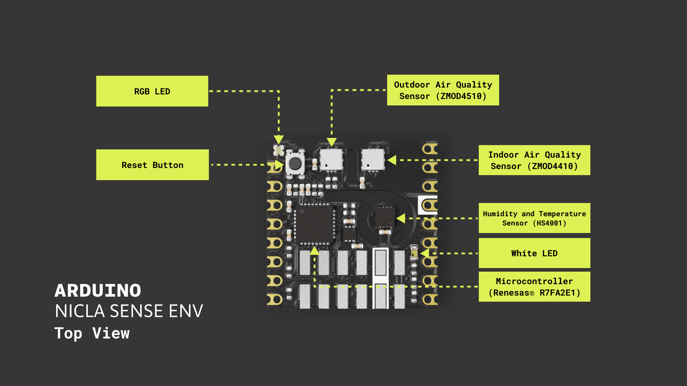
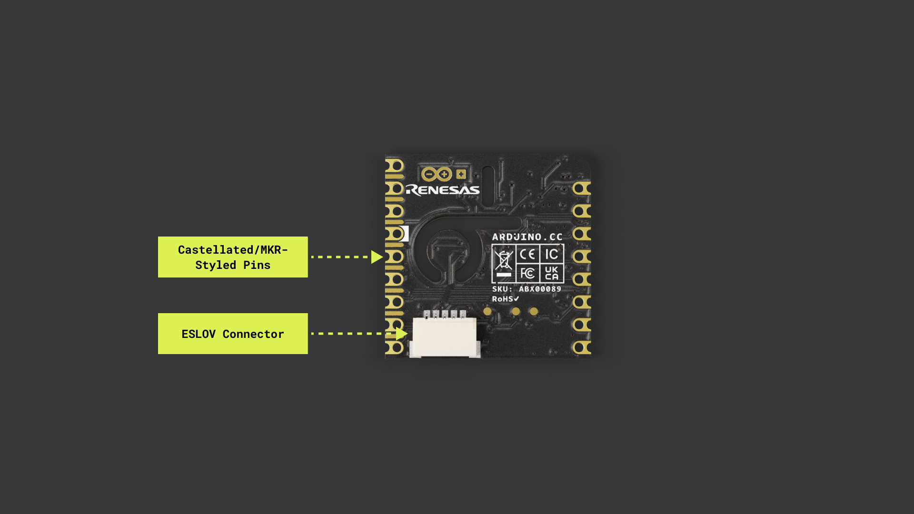
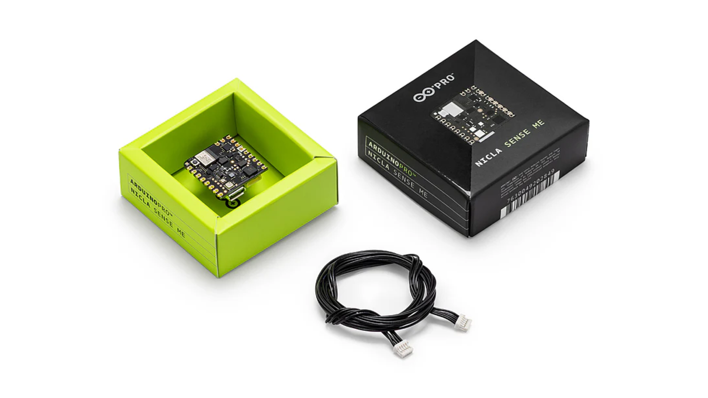
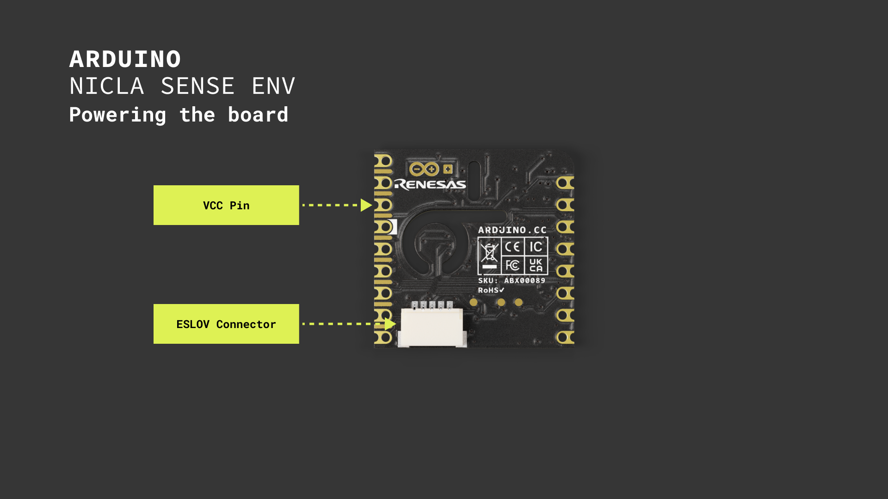
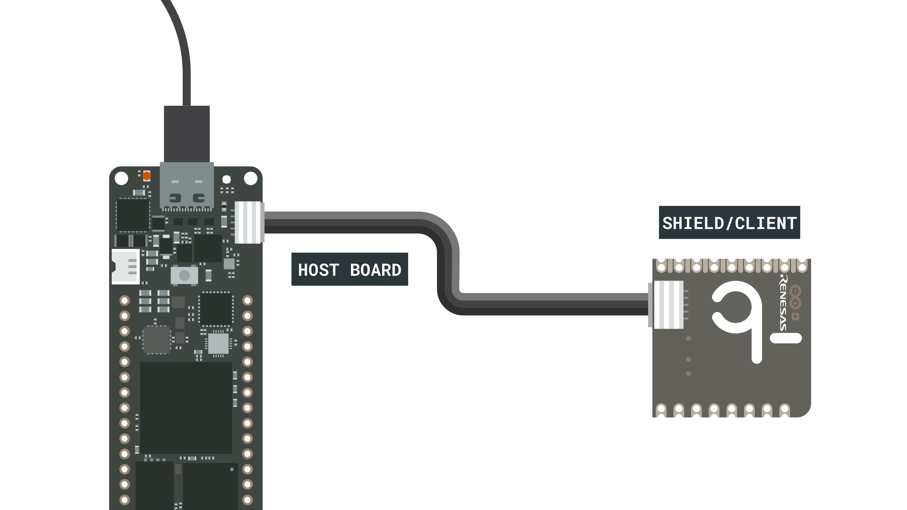

This user manual provides a comprehensive Nicla Sense Env board overview, highlighting its hardware and software elements. With it, you will confidently learn how to set up, configure, and use all the main features of a Nicla Sense Env board.


## Hardware and Software Requirements

### Hardware Requirements

- [Nicla Sense Env](https://store.arduino.cc/products/nicla-sense-me) (x1)
- [Portenta C33](https://store.arduino.cc/products/portenta-c33) (x1)
- [USB-C® cable](https://store.arduino.cc/products/usb-cable2in1-type-c) (x1)

### Software Requirements

- [Arduino IDE 2.0+](https://www.arduino.cc/en/software) or [Arduino Web Editor](https://create.arduino.cc/editor)
- [Arduino_NiclaSenseEnv library](https://github.com/sebromero/Arduino_NiclaSenseEnv)
- [Arduino Renesas Portenta Boards core](https://github.com/arduino/ArduinoCore-renesas) (required to work with the Portenta C33 board)

***The Nicla Sense Env board is not intended as a standalone device but as a shield of another Portenta, MKR, or Nano family board. In this user manual, we will use the Portenta C33 as the main board and show how to use the Nicla Sense Env board as a shield.***

## Nicla Sense Env Overview

Enhance your environmental sensing capabilities with the Nicla Sense Env board. This board combines three cutting-edge sensors from Renesas® with the Arduino ecosystem's ease of integration and scalability. This board is well-suited for augmenting your Portenta or MKR-based projects with environmental sensing capabilities.

The Nicla Sense Env includes an ultra-low power temperature and humidity sensor, complemented by two sophisticated, industrial-grade gas sensors capable of assessing air quality in both indoor and outdoor settings. Its compact dimensions (22.86 x 22.86 mm) and sturdy construction make the Nicla Sense Env an excellent choice for projects that demand sensor fusion and the computational capabilities of Arduino boards.

### Nicla Sense Env Architecture Overview

The Nicla Sense Env features a secure, certified, and durable design that enables it for several applications, such as industrial automation, building automation, and prototyping. 

The Nicla Sense Env board top view is shown in the image below:



The Nicla Sense Env board bottom view is shown in the image below:



Here's an overview of the board's main components shown in the images above:

- **Microcontroller**: At the heart of the Nicla Sense Env is a [Renesas R7FA2E1 microcontroller](https://www.renesas.com/us/en/products/microcontrollers-microprocessors/ra-cortex-m-mcus/ra2e1-48mhz-arm-cortex-m23-entry-level-general-purpose-microcontroller). This entry-level single-chip microcontroller, known as the industry's most energy-efficient ultra-low-power microcontroller, is based on a 48 MHz Arm® Cortex®-M23 core with up to 128 KB code flash and 16 KB SRAM memory.
- **Onboard humidity and temperature sensor**: The Nicla Sense Env features an onboard humidity and temperature sensor, the [HS4001 from Renesas](https://www.renesas.com/us/en/products/sensor-products/environmental-sensors/humidity-temperature-sensors/hs4001-relative-humidity-and-temperature-sensor-digital-output-15-rh). This highly accurate, ultra-low power, fully calibrated relative humidity and temperature sensor features proprietary sensor-level protection, ensuring high reliability and long-term stability.
- **Onboard indoor air quality sensor**: The Nicla Sense Env features an onboard gas sensor, the [ZMOD4410 from Renesas](https://www.renesas.com/us/en/document/dst/zmod4410-datasheet). This sophisticated sensor was designed to detect total volatile organic compounds (TVOC), estimate CO<sub>2</sub>, and monitor and report indoor air quality (IAQ). 
- **Onboard outdoor air quality sensor**: The Nicla Sense Env features an onboard gas sensor, the [ZMOD4510 from Renesas](https://www.renesas.com/us/en/document/dst/zmod4410-datasheet). This sophisticated sensor was designed to monitor and report outdoor air quality (OAQ) based on nitrogen dioxide (NO<sub>2</sub>) and ozone (O<sub>3</sub>) measurements. 
- **Onboard user LEDs**: The Nicla Sense Env has two onboard user-programmable LEDs; one is a white LED, and the other one is an RGB LED.
- **ESLOV connector**: The Niclas Sense Env has an onboard ESLOV connector to extend the board communication capabilities via I<sup>2</sup>C. 
- **Surface mount**: The castellated pins of the board allow it to be positioned as a surface-mountable module.

### Board Libraries 

The [`Arduino_NiclaSenseEnv` library](https://github.com/sebromero/Arduino_NiclaSenseEnv) contains an application programming interface (API) to read data from the board and control its parameters and behavior over I<sup>2</sup>C. This library supports the following: 

- Board control (sleep, reset, and factory reset)
- Board configuration (I<sup>2</sup>C address configuration)
- Onboard RGB LED control
- Onboard white LED control
- Onboard indoor air quality sensor control (sulfur detection, odor intensity, ethanol level, TVOC, CO<sub>2</sub>, IAQ measurements)
- Onboard outdoor air quality sensor control (NO<sub>2</sub>, O<sub>3</sub>, OAQ measurements)
- Temperature and humidity sensor control
- UART comma-separated values (CSV) output

***The Portenta, MKR, and Nano family boards support the `Arduino_NiclaSenseEnv` library.***

To install the `Arduino_NiclaSenseEnv` library, navigate to `Tools > Manage libraries...` or click the **Library Manager** icon in the left tab of the Arduino IDE. In the Library Manager tab, search for `Arduino_NiclaSenseEnv` and install the latest version of the library.



### Pinout

The full pinout is available and downloadable as PDF from the link below:

- Nicla Sense Env pinout

### Datasheet

The complete datasheet is available and downloadable as PDF from the link below:

- Nicla Sense Env datasheet

### Schematics

The complete schematics are available and downloadable as PDF from the link below:

- Nicla Sense Env schematics

### STEP Files 

The complete STEP files are available and downloadable from the link below:

- Nicla Sense Env STEP files

## First Use

### Unboxing the Product

Let's check out what's inside the box of the Nicla Sense Env board. Besides the board, you will also find an ESLOV cable inside the box, which can connect the Nicla Sense Env with other supported Arduino boards with an onboard ESLOV connector (Portenta, Nano, or MKR family boards). The board's MKR-styled pins can also connect the Nicla Sense Env to other supported Arduino boards, but 2.54 mm header pins (not included) must be soldered to the MKR-styled board pins. 



As mentioned, **the Nicla Sense Env is not a standalone device but a shield for an Arduino-supported board from the Portenta, MKR, or Nano board families**. This user manual will use a Portenta C33 as the main or host board and the Nicla Sense Env as a shield or client board connected through the included ESLOV cable.

### Powering the Board

The Nicla Sense Env can be powered by:

- Using the onboard **ESLOV connector**, which has a dedicated  +5 VDC power line regulated onboard to +3.3 VDC.
- Using an **external +3.3 VDC power supply** connected to `VCC` pin (please refer to the [board pinout section](#pinout) of the user manual).



***The Nicla Sense Env's `VCC` pin can be connected only to a +3.3 VDC power supply; any other voltage will permanently damage the board. Furthermore, the `VCC` pin does not have reverse polarity protection. Double-check your connections to avoid damaging the board.***

In this user manual, we will use the board's ESLOV connector to power it.

### Hello World Example

Let's control the Nicla Sense Env board to reproduce the classic `hello world` example used in the Arduino ecosystem: the `Blink`. We will use this example to verify the Nicla Sense Env's connection to the host board (a Portenta C33) via ESLOV, the host board's connection to the Arduino IDE, and that the `Arduino_NiclaSenseEnv` library and both boards, the shield and the host, are working as expected. This section will refer to the Nicla Sense Env as a shield or client. 

***We are using the API of the `Arduino_NiclaSenseEnv` library with the host board (Portenta C33) to control the Nicla Sense Env (shield).***

First, connect the shield to the host board via ESLOV, as shown in the image below, using an ESLOV cable (included with your Nicla Sense Env):


Now, connect the host board to your computer using a USB-C® cable, open the Arduino IDE, and connect the host board to it. 

***If you are new to the Portenta C33, please refer to the board's [user manual](https://docs.arduino.cc/tutorials/portenta-c33/user-manual/) for more detailed information.***

Copy and paste the example sketch below into a new sketch in the Arduino IDE: 

```arduino
/**
  Blink LED on Nicla Sense Env
  Name: nicla_sense_env_blink.ino
  Purpose: This sketch demonstrates how to blink the onboard 
  orange LED of the Nicla Sense Env board.
  
  @author Arduino Product Experience Team
  @version 1.0 31/05/24
*/

#include "NiclaSenseEnv.h"

// Global device object for the Nicla Sense Env board
NiclaSenseEnv device; 

/**
  Toggles the onboard white LED between on and off states.
  @param led Reference to WhiteLED object controlling the LED.
*/
void toggleLED(WhiteLED& led) {
    // Turn on the LED to full brightness for one second
    led.setBrightness(63);
    delay(1000);  

    // Turn off the LED for one second
    led.setBrightness(0);
    delay(1000);
}

void setup() {
    // Initialize serial communication at 115200 bits per second.
    Serial.begin(115200);
    
    // Wait for Serial to be ready with a timeout of 5 seconds
    for(auto start = millis(); !Serial && millis() - start < 5000;);

    if (device.begin()) {
        // Initialize the onboard orange LED
        auto orangeLED = device.whiteLED();
    } 
}

void loop() {
    // Retrieve the orange LED object
    WhiteLED orangeLED = device.whiteLED();

    // Continuously toggle the orange LED on and off
    toggleLED(orangeLED);
}
```

To upload the code to the host board, click the **Verify** button to compile the sketch and check for errors, then click the **Upload** button to program the device with the sketch.


You should see the onboard orange LED of your Nicla Sense Env board turn on for one second, then off for one second, repeatedly.


## Board Management

This section of the user manual outlines how to manage the onboard sensors and main features of the Nicla Sense Env board using the `Arduino_NiclaSenseEnv` library API. It also explains how to perform essential tasks such as retrieving the board's information, managing sensor states, resetting the board, and putting it into deep sleep mode.

### Board Information

Detailed information from the board, such as its I<sup>2</sup>C address, serial number, product ID, software revision, and UART communication settings, can be retrieved using the `Arduino_NiclaSenseEnv` library API. The example sketch shown below retrieves that information using a dedicated function called `printDeviceInfo()`:

```arduino
/**
  Board Information Retrieval for Nicla Sense Env
  Name: nicla_board_info_example.ino
  Purpose: This sketch demonstrates how to retrieve detailed board information from the Nicla Sense Env using the Arduino_NiclaSenseEnv library API.
  
  @author Sebastián Romero, modified by the Arduino Product Experience Team
  @version 1.0 31/05/24
*/

#include "NiclaSenseEnv.h"

// Global device object for Nicla Sense Env
NiclaSenseEnv device;

/**
  Prints detailed device information to the serial monitor.
  This function outputs all critical system parameters including 
  the device I2C address, serial number, and other configuration settings.
*/
void printDeviceInfo() {
    Serial.println("Device Information:");
    Serial.print("- Device (0x");
    Serial.print(device.deviceAddress(), HEX);
    Serial.println(") connected.");
    Serial.print("- Serial number: ");
    Serial.println(device.serialNumber());
    Serial.print("- Product ID: ");
    Serial.println(device.productID());
    Serial.print("- Software revision: ");
    Serial.println(device.softwareRevision());
    Serial.print("- Baud rate: ");
    Serial.println(device.UARTBaudRate());
    Serial.print("- CSV delimiter: ");
    Serial.println(device.CSVDelimiter());

    Serial.print("- Debugging enabled: ");
    if (device.isDebuggingEnabled()) {
        Serial.println("true");
    } else {
        Serial.println("false");
    }

    Serial.print("- CSV output enabled: ");
    if (device.isUARTCSVOutputEnabled()) {
        Serial.println("true");
    } else {
        Serial.println("false");
    }
}

void setup() {  
    // Initialize serial communication and wait up to 2.5 seconds for a connection
    Serial.begin(115200);
    for (auto startNow = millis() + 2500; !Serial && millis() < startNow; delay(500));

    if (device.begin()) {
        Serial.println("Device successfully initialized!");
        // Print device information once after initialization
        printDeviceInfo();  
    } else {
        Serial.println("Failed to initialize the device. Please check the connection!");
    }
}

void loop() {
    // Nothing to do here. All information is printed once in setup().
}
```

Here is a detailed breakdown of the `printDeviceInfo()` function and the `Arduino_NiclaSenseEnv` library API functions used in the `printDeviceInfo()` function:

- `deviceAddress()`: Retrieves the I<sup>2</sup>C address of the board. This is useful for identifying the board when multiple devices are connected to the same I<sup>2</sup>C bus.
- `serialNumber()`: Outputs the board's unique serial number. Each board's serial number is unique and can be used for tracking, inventory management, or validating its authenticity.
- `productID()`: Provides the product ID, which specifies the exact model or version of the board.
- `softwareRevision()`: This displays the current firmware version installed on the board. Keeping the firmware updated is critical for security, performance, and access to new features, making this information valuable for maintenance and support.
- `UARTBaudRate()`: Shows the baud rate used for UART communications.
- `CSVDelimiter()`: Reveals the delimiter used in CSV outputs. This detail is vital for developers who process or log data, as it affects how data is parsed and stored.
- `isDebuggingEnabled()`: Indicates whether the debugging mode is active. Debugging can provide additional output that helps diagnose issues or for development purposes.
- `isUARTCSVOutputEnabled()`: Shows whether CSV output through UART is enabled. This setting is important for applications that require data logging for analysis or reporting, as it impacts how data is exported from the board.

After uploading the example sketch to the host board, you should see the following output in the Arduino IDE's Serial Monitor:


You can download the example code [here](assets/nicla_board_info_example.zip).

### Onboard Sensors Management 

Efficient management of the Nicla Sense Env's onboard sensors is important for optimizing its performance and power usage. The sketch shown below demonstrates how to manage (turn on or off) the onboard sensors (temperature, relative humidity, and air quality) of the Nicla Sense Env and check their statuses using the `Arduino_NiclaSenseEnv` library API: 

```arduino
/**
  Onboard Sensors Management for Nicla Sense Env
  Name: nicla_sensors_management_example.ino
  Purpose: This sketch demonstrates how to manage the onboard sensors of the Nicla Sense Env using the Arduino_NiclaSenseEnv library API.
  
  @author Arduino PRO Content Team
  @version 1.0 31/05/24
*/

#include "NiclaSenseEnv.h"

// Global device object for Nicla Sense Env
NiclaSenseEnv device;

void setup() {
    // Initialize serial communication and wait up to 2.5 seconds for a connection
    Serial.begin(115200);
    for (auto startNow = millis() + 2500; !Serial && millis() < startNow; delay(500));

    if (device.begin()) {
        // Disable all the onboard sensors
        Serial.println("- Disabling all sensors...");
        device.temperatureHumiditySensor().setEnabled(false);
        device.indoorAirQualitySensor().setEnabled(false);
        device.outdoorAirQualitySensor().setEnabled(false);

        // Check the onboard sensor states
        Serial.println("- Checking the sensor states...");
        Serial.print("- Temperature sensor enabled: ");
        if (device.temperatureHumiditySensor().enabled()) {
            Serial.println("true");
        } else {
            Serial.println("false");
        }

        Serial.print("- Indoor air quality sensor enabled: ");
        if (device.indoorAirQualitySensor().enabled()) {
            Serial.println("true");
        } else {
            Serial.println("false");
        }

        Serial.print("- Outdoor air quality sensor enabled: ");
        if (device.outdoorAirQualitySensor().enabled()) {
            Serial.println("true");
        } else {
            Serial.println("false");
        }
    } else {
        Serial.println("- Device could not be found. Please double-check the wiring!");
    }
}

void loop() {
    // Nothing to do here. All information is printed once in setup().
}
```

This example sketch initializes the Nicla Sense Env board disables all onboard sensors and then checks and prints the status of each sensor on the Arduino IDE's Serial Monitor. Here is a detailed breakdown of the example sketch shown before and the `Arduino_NiclaSenseEnv` library API functions used in the sketch:

- `temperatureHumiditySensor().setEnabled(false)`: Disables the onboard temperature and humidity sensor.
- `indoorAirQualitySensor().setEnabled(false)`: Turns off the onboard indoor air quality sensor. 
- `outdoorAirQualitySensor().setEnabled(false)`: Deactivates the onboard outdoor air quality sensor.
- `temperatureHumiditySensor().enabled()`: Checks if the onboard temperature and humidity sensor is active.
- `indoorAirQualitySensor().enabled()`: Indicates whether the onboard indoor air quality sensor is currently enabled. 
- `outdoorAirQualitySensor().enabled()`: Confirms if the onboard outdoor air quality sensor is operational. 

After uploading the example sketch to the host board, you should see the following output in the Arduino IDE's Serial Monitor:


You can download the example code [here](assets/nicla_sensors_management_example.zip).

### Board Reset

Resetting the Nicla Sense Env is important for troubleshooting and ensuring the device operates cleanly. It is handy after making significant changes to the configuration or when an unexpected behavior occurs.

The sketch shown below demonstrates how to reset the Nicla Sense Env using the `Arduino_NiclaSenseEnv` library API: 

```arduino
void setup() {
    // Initialize serial communication
    Serial.begin(115200);
    while (!Serial) {
        // Wait for Serial to be ready
    }

    NiclaSenseEnv device;

    if (device.begin()) {
        // Resetting the device
        Serial.println("- Resetting the device...");
        device.reset();
        delay(2000);  // Ensure the device has enough time to reset properly
    } else {
        Serial.println("- Device could not be found. Please double-check the wiring.");
    }
}
```

Here is a detailed breakdown of the example sketch shown before and the `Arduino_NiclaSenseEnv` library API functions used in the sketch:

- `device.reset()`: This function reboots the Nicla Sense Env, clearing all temporary settings. 

### Low Power Mode Management

Saving energy is vital for many projects, particularly those deployed in remote areas or with a limited power supply. The Nicla Sense Env supports a deep sleep mode that can help to minimize the board's power consumption.

***Deep sleep is essential for extending battery life and reducing energy use when the board is not actively collecting data or performing any tasks. It is especially important for battery-powered or power-constrained applications.***

The sketch shown below demonstrates how to put the Nicla Sense Env into deep sleep mode using the `Arduino_NiclaSenseEnv` library API: 

```arduino
void setup() {
    // Initialize serial communication
    Serial.begin(115200);
    while (!Serial) {
        // Wait for Serial to be ready
    }

    NiclaSenseEnv device;

    if (device.begin()) {
        // Putting the device to sleep
        Serial.println("- Going to deep sleep mode...");
        device.deepSleep();
    } else {
        Serial.println("- Device could not be found. Please double-check the wiring.");
    }
}
```

Here is a detailed breakdown of the example sketch shown before and the `Arduino_NiclaSenseEnv` library API functions used in the sketch:

- `device.deepSleep()`: This function puts the Nicla Sense Env board into a deep sleep state where power consumption is minimized to the lowest possible level.

***Waking up a board from deep sleep mode can only be made by a hardware reset.*** 

## LEDs

## Temperature and Humidity Sensor

## Indoor Air Quality Sensor 

## Outdoor Air Quality Sensor

## Communication

## Support

If you encounter any issues or have questions while working with your Nicla Sense Env board, we provide various support resources to help you find answers and solutions.

### Help Center

Explore our Help Center, which offers a comprehensive collection of articles and guides for Nicla family boards. The Help Center is designed to provide in-depth technical assistance and help you make the most of your device.

- [Nicla family help center page](https://support.arduino.cc/hc/en-us/sections/4410176504978-Nicla-Family)

### Forum

Join our community forum to connect with other Nicla family board users, share your experiences, and ask questions. The Forum is an excellent place to learn from others, discuss issues, and discover new ideas and projects related to the Nicla Sense Env.

- Nicla Sense Env category in the Arduino Forum

### Contact Us

Please get in touch with our support team if you need personalized assistance or have questions not covered by the help and support resources described before. We're happy to help you with any issues or inquiries about the Nicla family boards.

- [Contact us page](https://www.arduino.cc/en/contact-us/)


