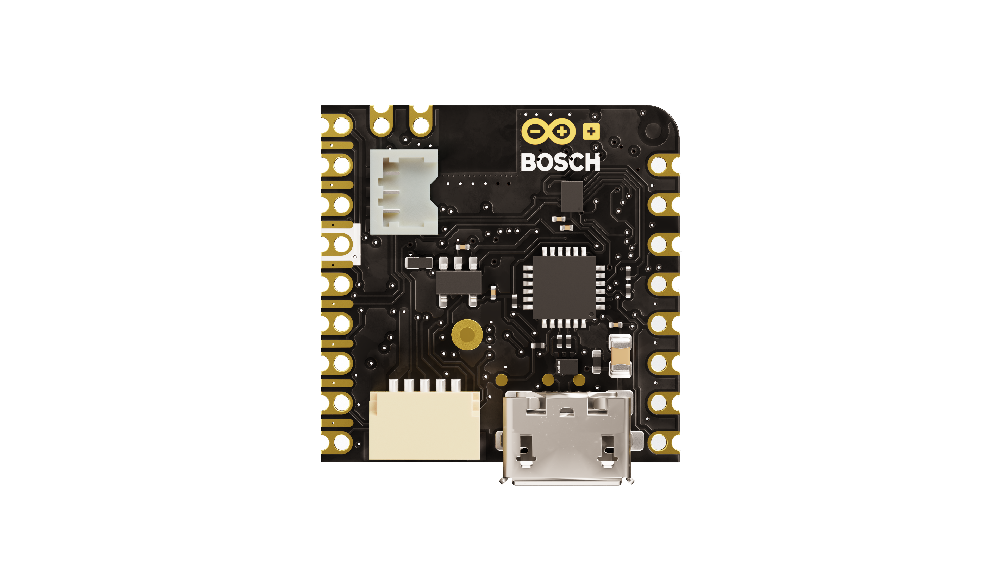
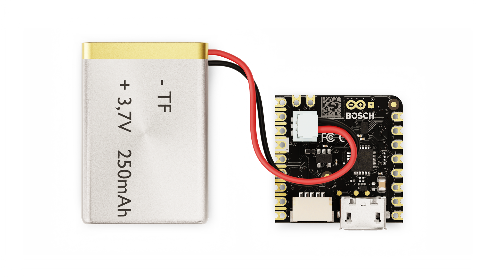
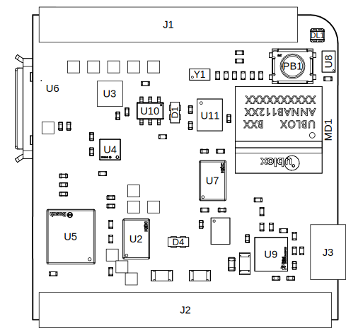
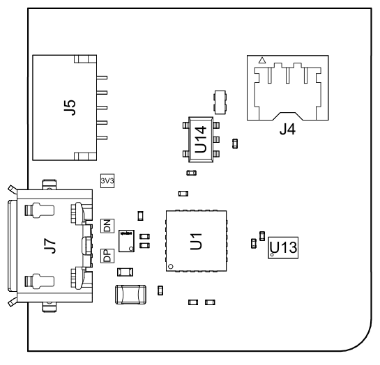
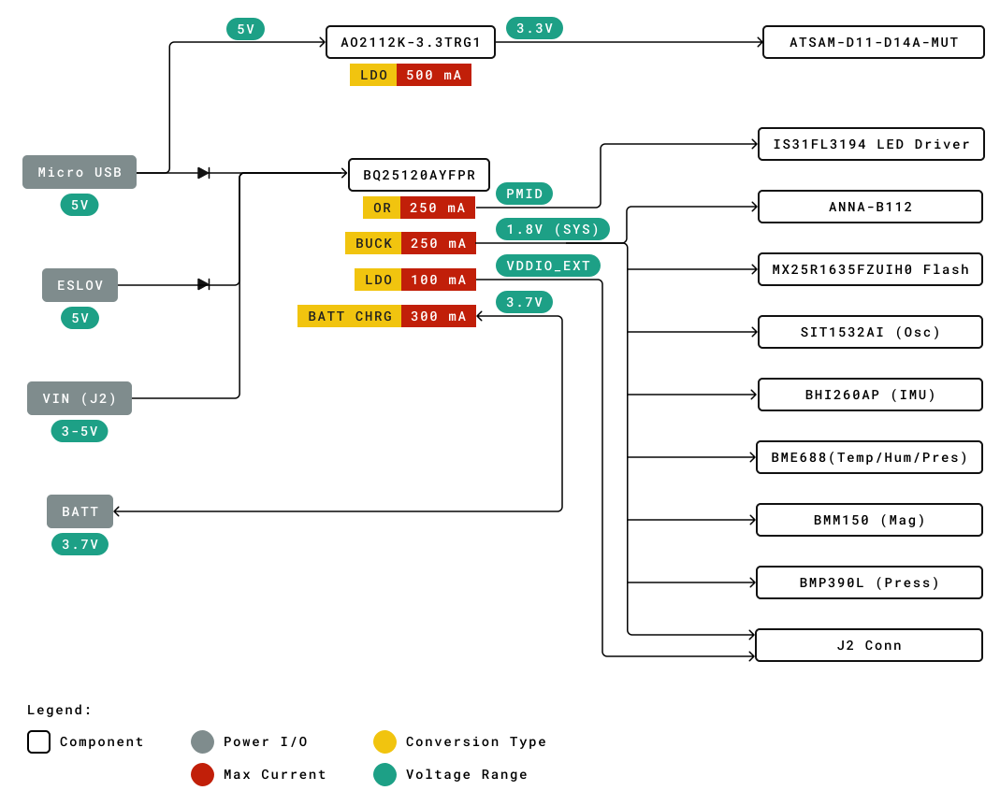
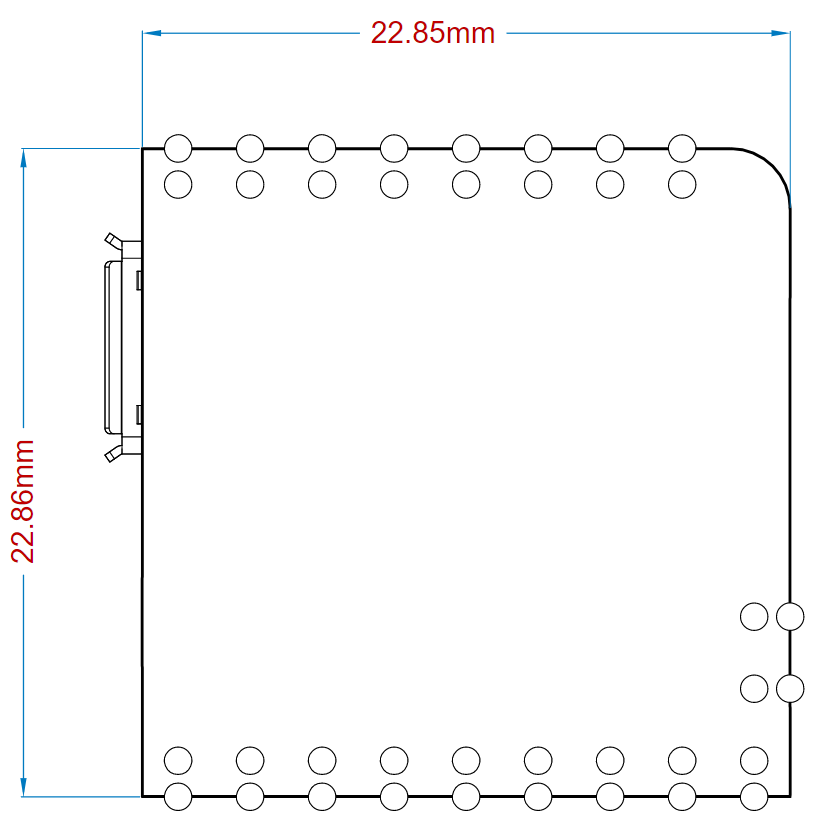

# Description 
The **Arduino® Nicla Sense ME** is our smallest form factor yet, with a range of industrial-grade sensors packed into a tiny footprint. Measure process parameters such as temperature, humidity and movement. Dive into edge computing with powerful data fusion capabilities. Make your own industrial-grade wireless sensing network with the onboard BHI260AP, BMP390, BMM150 and BME688 Bosch sensors.

# Target areas:
wireless sensor networks, data fusion, artificial intelligence, gas detection

# Features
- **ANNA-B112** Bluetooth®  Module
  - **nRF52832** System-on-chip
    - 64 MHz ARM® Cortex-M4F microcontroller 
    - 64 KB SRAM
    - 512 KB Flash
    - RAM mapped FIFOs using EasyDMA
    - 2x SPI (one is accessible via pin header)
    - 2x I2C (one is accessible via pin header)
    - 12-bit/200 ksps ADC
    - 2.400 - 2.4835 GHz Bluetooth®  (5.0 via cordio stack, 4.2 via ArduinoBLE)
  - Internal antenna
  - Internal 32 MHz oscillator
  - 1.8V Operating Voltage
- **Bosch BHI260AP** - AI smart sensor hub with integrated IMU
  - Fuser 2 CPU Core
    - 32 Bit Synopsys DesignWare ARC™ EM4™ CPU
    - floating point RISC Processor
    - 4-channel micro DMA controller/ 2-way associative cache controller
  - 6-axis IMU
    - 16-bit 3-axis accelerometer
    - 16-bit 3-axis gyroscope
  - Pro Features
    - Self-learning AI software for fitness tracking
    - Swim analytics
    - Pedestrian dead reckoning
    - Relative and absolute orientation
  - External 2MB FLASH connected via QSPI
  
- **Bosch BMP390** High-performance pressure sensor
  - Operation range: 300-1250 hPa
  - Absolute accuracy pressure (typ.): ± 0.5 hPa
  - Relative accuracy pressure (typ.): ± 3.33 hPa (equivalent to ±25 cm)
  - RMS noise in pressure @ highest resolution: 0.02 Pa
  - Temperature coefficient offset: ± 0.6 Pa/K
  - Long-term stability (12 months): ± 0.016 hPa
  - Max sampling rate: 200 Hz
  - Integrated 512 byte FIFO buffer
- **Bosch BMM150** 3-axis Magnetometer
  - Magnetic range typ.
    - X,Y axis: ±1300μT
    - Z axis: ±2500μT
  - Resolution: 0.3μT
  - Non-linearity: <1% FS
- **Bosch BME688** Environmental sensing with Artificial Intelligence
  - Operating range
    - Pressure: 300-1100 hPa
    - Humidity: 0-100%
    - Temperature: -40 - +85°C
  - eNose Gas sensor
    - Sensor-to-sensor deviation (IAQ): ± 15% ± 15 IAQ
    - Standard scan speed: 10.8 s/scan
    - Electric charge for standard scan: 0.18 mAh (5 scans - 1 min)
    - Major Sensor outputs
      - Index for air quality (IAQ)
      - bVOC- & CO2-equivalents (ppm)
      - Gas scan result (%)
      - Intensity level

- **ATSAMD11D14A-MUT** Microcontroller
  - Serial to USB Bridge
  - Debugger interface

# Contents

## The Board

### Application Examples
The Arduino® Nicla Sense ME is your gateway to develop wireless networking solutions with rapid development and high robustness. Get real-time insight into the operational characteristics of your processes. Take advantage of the high-quality sensors and networking capabilities to evaluate novel WSN architectures. Ultra-low power consumption and integrated battery management allow for deployment in various capabilities. WebBLE allows for easy OTA updates of the firmware as well as remote monitoring.

- **Warehouse & Inventory Management**: 
The environmental sensor of the Arduino® Nicla Sense ME can detect the ripening state of fruits, vegetables and meat allowing for intelligent management of perishable assets alongside the Arduino Cloud.

- **Distributed Industrial Sensing**:
Identify operating conditions within your machine, factory or greenhouse remotely and even in hard-to-access or hazardous areas. Detect natural gas, toxic gases or other hazardous fumes using the AI capabilities on the **Arduino® Nicla Sense ME**. Improve safety levels with remote analysis. Mesh capabilities allow for simple deployment of WSN with minimal infrastructure requirements.

- **Wireless Sensor Network Reference Design**:
The Nicla form factor has been specifically developed at Arduino® as a standard for wireless sensor networks which can be adapted by partners to develop custom-designed industrial solutions. Get a head start by developing custom end-user solutions including Cloud-connected smart wearables and autonomous robotics. Researchers and educators can use this platform to work on an industrially-recognized standard for wireless sensor research and development that can shorten the time from concept to market.

### Accessories (Not Included)
- Single-cell Li-ion/Li-Po battery

### Related Products
- ESLOV connector
- Arduino® Portenta H7 (SKU: ABX00042)

### Assembly Overview

**Note** : The NTC pin on the battery connector is optional. This feature allows safer use and thermal shutoff of the PMIC. 

## Ratings
### Recommended Operating Conditions
| Symbol               | Description                      | Min                                 | Typ | Max                                 | Unit |
|----------------------|----------------------------------|-------------------------------------|-----|-------------------------------------|------|
| VIN       | Input voltage from VIN pad       | 3.5                                 | 5.0 | 5.5                                 | V    |
| VUSB      | Input voltage from USB connector | 4.8                                 | 5.0 | 5.5                                 | V    |
| VDDIO_EXT | Level Translator Voltage         | 1.8                                 | 3.3 | 3.3                                 | V    |
| VIH       | Input high-level voltage         | 0.7VDDIO_EXT1 |     | VDDIO_EXT                | V    |
| VIL       | Input low-level voltage          | 0                                   |     | 0.3VDDIO_EXT2 | V    |
| TOP       | Operating Temperature            | -40                                 | 25  | 85                                  | °C   |

**Note** : VDDIO_EXT is software programmable.  While the ADC inputs can accept up to 3.3V, the maximum value is at the ANNA B112 operating voltage.

**1** : All I/O pins operate at VDDIO_EXT apart from the following:
- ADC1 and ADC2 - 1V8
- JTAG_SAMD11 - 3V3
- JTAG_ANNA - 1V8
- JTAG_BHI - 1V8

**2** : If the internal VDDIO_EXT is disabled, it is possible to supply it externally.

## Functional Overview

### Block Diagram

### Board Topology
**Top View**

| **Ref.** | **Description**                                  | **Ref.** | **Description**                  |
|----------|--------------------------------------------------|----------|----------------------------------|
| MD1      | ANNA B112 Bluetooth®  Module                     | U2, U7   | MX25R1635FZUIH0 2 MB FLASH IC    |
| U3       | BMP390 Pressure Sensor IC                        | U4       | BMM150 3-axis Magnetic Sensor IC |
| U5       | BHI260AP 6 axis IMU and AI core IC               | U6       | BME688 Environmental Sensor IC   |
| U8       | IS31FL3194-CLS2-TR 3-channel LED IC              | U9       | BQ25120AYFPR Battery Charger IC  |
| U10      | SN74LVC1T45 1Channel voltage level translator IC | U11      | TXB0108YZPR Bidirectional IC     |
| U12      | NTS0304EUKZ 4-bit translating transceiver        | J1       | ADC, SPI and LPIO Pin headers    |
| J2       | I2C, JTAG, Power and LPIO pin headers            | J3       | Battery pin headers              |
| Y1       | SIT1532AI-J4-DCC MEMS 32.7680 kHz Oscillator     | DL1      | SMLP34RGB2W3 RGB SMD LED         |
| PB1      | Reset button                                     |

**Back View**

| **Ref.** | **Description**                             | **Ref.** | **Description**                                        |
|----------|---------------------------------------------|----------|--------------------------------------------------------|
| U1       | ATSAMD11D14A-MUT USB Bridge                 | U13      | NTS0304EUKZ 4-bit translating transceiver IC           |
| U14      | AP2112K-3.3TRG1 0.6 A 3.3 V LDO IC          | J4       | 3-pin 1.2mm ACH Battery Connector (BM03B-ACHSS-GAN-TF) |
| J5       | SM05B-SRSS-TB(LF)(SN) 5-pin Eslov connector | J7       | microUSB connector                                     |

### Microcontroller
The Arduino® Nicla Sense ME is powered by a nRF52832 SoC within the ANNA-B112 module (MD1). The nRF52832 SoC is built around an ARM® Cortex-M4 microcontroller with a floating point unit running at 64 MHz. Sketches are stored inside the nRF52832 internal 512 KB FLASH which is shared with the bootloader. 64 KB SRAM is available to the user. The ANNA-B112 acts as an SPI host for the data logging 2MB flash (U7) and the BHI260 6-axis IMU (U5). It is also the secondary for the BHI260 (U5) I2C and SPI connection. While the module itself runs at 1.8V, a level shifter can adjust the logic level between 1.8V and 3.3V depending on the LDO set in BQ25120 (U9). An external oscillator (Y1) provides a 32 KHz signal. 
### Bosch BHI260 Smart Sensor System with Built-in 6-Axis IMU
The Bosch BHI260 is an ultra-low power programmable sensor, combining a Fuser2 core processor, 6-axis IMU (gyroscope and accelerometer) together with a sensor fusion software framework. The BHI260 is a smart sensor core (hosting a programmable recognition system), that handles communication with other sensors on the **Arduino Nicla Sense ME** via I2C and SPI connections. There is also a dedicated 2MB Flash (U2) used to store execute-in-place (XiP) code as well as data storage, such as Bosch sensor fusion algorithm (BSX) calibration data. The BHI 260 is capable of loading custom algorithms that can be trained on a PC. The generated smart algorithm then operates on this chip.
### Bosch BME688 Environmental Sensor
The **Arduino Nicla Sense ME** is able to perform environmental monitoring via the Bosch BME688 sensor (U6). This provides capabilities for pressure, humidity, temperature as well as Volatile Organic Compound (VOC) detection. The Bosch BME688 performs gas detection via an eNose metal oxide semiconductor array with a typical gas scan cycle of 10.8 seconds.
### Bosch BMP390 Pressure Sensor
Industrial grade accuracy and stability in pressure measurements are provided by the BMP390 (U3) designed for prolonged use, with a relative accuracy of ±0.03 hPa and an RMS of 0.02 Pa in high-resolution mode. The Bosch BMP390 is suitable for rapid measurements with a sampling rate of 200 Hz, or for low-power use with a sampling rate of 1 Hz, consuming less than 3.2 µA. U3 is controlled via an SPI interface to the BHI260 (U2), on the same bus as the BME688 (U6).
### Bosch BMM150 3-Axis Magnetometer
The Bosch BMM150 (U4) provides accurate 3-axis measurements of the magnetic field with compass-level accuracy. Combined with the BHI260 IMU (U2), Bosch sensor fusion can be used to obtain high-accuracy spatial orientation and motion vectors for the detection of heading in autonomous robots as well as predictive maintenance. There is a dedicated I2C connection to the BHI260 (U2), acting as the host.
### RGB LED
An I2C LED driver (U8) drives the RGB LED (DL1) and is capable of a maximum output of 40 mA. It is driven by the ANN-B112 (U5) microcontroller. 

### USB Bridge
The SAMD11 microcontroller (U1) is dedicated to act as both the USB bridge as well as the JTAG controller for the ANNA-B112. A logic level translator (U13) acts as an in-between to translate 3.3V logic to 1.8V for the ANNA-B112. The 3.3V voltage is generated from the USB voltage by an LDO (U14).

### Power Tree

The **Arduino Nicla Sense ME** can be powered via micro USB (J7), ESLOV (J5) or VIN. This is converted into the relevant voltages via the BQ2512BAYFPR IC (U9). A Schottky diode provides reverse polarity protection to the USB and ESLOV voltages. When voltage is supplied via the micro USB, a linear 3.3V regulator also provides power to the SAMD11 microcontroller used for programming the board as well as for JTAG and SWD. The LED driver (U8) and RGB LEDs (DL1) are driven by a boost voltage of 5V. All other components operate off the 1.8V rail regulated by a buck converter. PMID acts as an OR switch between VIN and BATT and operates the LED driver. All I/O broken out to the pins are fed through a bi-direction voltage translator running at VDDIO_EXT. 

Additionally, the BQ25120AYFPR (U9) also provides support for a single cell 3.7V LiPo/Li-ion battery pack connected to J4, allowing the use of the board as a wireless sensor network. The battery charging current is set to 40mA with a termination current of 4mA (10%).

## Board Operation
### Getting Started - IDE
If you want to program your Arduino® Nicla Sense ME while offline you need to install the Arduino® Desktop IDE **[1]** To connect the Arduino® Nicla Sense ME to your computer, you’ll need a micro USB cable. This also provides power to the board, as indicated by the LED. The Arduino core is operated on the ANNA-B112 while the Bosch Smart Sensor framework operates on the BHI260.

### Getting Started - Arduino Web Editor
All Arduino® boards, including this one, work out-of-the-box on the Arduino® Web Editor **[2]**, by just installing a simple plugin. 

The Arduino® Web Editor is hosted online, therefore it will always be up-to-date with the latest features and support for all boards. Follow **[3]** to start coding on the browser and upload your sketches onto your board.

### Getting Started - Arduino Cloud
All Arduino® IoT enabled products are supported on Arduino® Cloud which allows you to log, graph and analyze sensor data, trigger events, and automate your home or business.

### Getting Started - WebBLE
The Arduino Nicla Sense ME provides the capability for OTA updates to the NINA-B112 and BHI260 firmware using WebBLE.

### Getting Started - ESLOV
This board can act as a secondary to an ESLOV controller and have the firmware updated through this method.
### Sample Sketches
Sample sketches for the Arduino® Nicla Sense ME can be found either in the “Examples” menu in the Arduino® IDE or in the “Documentation” section of the Arduino® Pro website **[4]**

### Online Resources
Now that you have gone through the basics of what you can do with the board you can explore the endless possibilities it provides by checking exciting projects on ProjectHub **[5]**, the Arduino® Library Reference **[6]** and the online store **[7]** where you will be able to complement your board with sensors, actuators and more.

### Board Recovery
All Arduino® boards have a built-in bootloader that allows flashing the board via USB. In case a sketch locks up the processor and the board is not reachable anymore via USB, it is possible to enter bootloader mode by double-tapping the reset button right after the power-up.

## Connector Pinouts
**Note:** All the pins on J1 and J2 (excluding fins) are referenced to the VDDIO_EXT voltage which can be generated internally or supplied externally.

### J1 Nicla Header A

| Pin | **Function** | **Type** | **Description**                    |
|-----|--------------|----------|------------------------------------|
| 1   | LPIO0_EXT    | Digital  | Low Power IO Pin 0                 |
| 2   | NC           | N/A      | N/A                                |
| 3   | CS           | Digital  | SPI Cable Select                   |
| 4   | COPI         | Digital  | SPI Controller Out / Peripheral In |
| 5   | CIPO         | Digital  | SPI Controller In / Peripheral Out |
| 6   | SCLK         | Digital  | SPI Clock                          |
| 7   | ADC2         | Analog   | Analog Input 2                     |
| 8   | ADC1         | Analog   | Analog Input 1                     |

### J2 Nicla Header B

| Pin | **Function** | **Type** | **Description**       |
|-----|--------------|----------|-----------------------|
| 1   | SDA          | Digital  | I2C Data Line         |
| 2   | SCL          | Digital  | I2C Clock             |
| 3   | LPIO1_EXT    | Digital  | Low Power IO Pin 1    |
| 4   | LPIO2_EXT    | Digital  | Low Power IO Pin 2    |
| 5   | LPIO3_EXT    | Digital  | Low Power IO Pin 3    |
| 6   | GND          | Power    | Ground                |
| 7   | VDDIO_EXT    | Digital  | Logic Level Reference |
| 8   | N/C          | N/A      | N/A                   |
| 9   | VIN          | Digital  | Input Voltage         |

**Note:** For further information on how Low Power I/Os work, check [Nicla Family Form Factor](https://docs.arduino.cc/learn/hardware/nicla-form-factor) documentation.

### J2 Fins

| Pin | **Function**  | **Type** | **Description**                     |
|-----|---------------|----------|-------------------------------------|
| P1  | BHI_SWDIO     | Digital  | BHI260 JTAG Serial Wire Debug Data  |
| P2  | BHI_SWDCLK    | Digital  | BHI260 JTAG Serial Wire Debug Clock |
| P3  | ANNA_SWDIO    | Digital  | ANNA JTAG Serial Wire Debug Data    |
| P4  | ANNA_SWDCLK   | Digital  | ANNA JTAG Serial Wire Debug Clock   |
| P5  | RESET         | Digital  | Reset Pin                           |
| P6  | SAMD11_SWDIO  | Digital  | SAMD11 JTAG Serial Wire Debug Data  |
| P7  | +1V8          | Power    | +1.8V Voltage Rail                  |
| P8  | SAMD11_SWDCLK | Digital  | SAMD11 JTAG Serial Wire Debug Clock |

**Note:** These test points can easily be accessed by inserting the board in a double row 1.27 mm/50 mil pitch male header.
**Note 2:** All JTAG logic levels operate at 1.8V apart from the SAMD11 pins (P6 and P8) which are 3.3V. All these JTAG pins are 1.8V only and don't scale with VDDIO.

### J3 Battery Pads

| Pin | **Function** | **Type** | **Description** |
|-----|--------------|----------|-----------------|
| 1   | VBAT         | Power    | Battery input   |
| 2   | NTC          | Analog   | NTC Thermistor  |

### J4 Battery Connector

| Pin | **Function** | **Type** | **Description** |
|-----|--------------|----------|-----------------|
| 1   | VBAT         | Power    | Battery input   |
| 2   | NTC          | Analog   | NTC Thermistor  |
| 3   | GND          | Power    | Ground          |

### J5 ESLOV

| Pin | **Function** | **Type** | **Description** |
|-----|--------------|----------|-----------------|
| 1   | 5V           | Power    | 5V Power Rail   |
| 2   | INT          | Digital  | Digital IO      |
| 3   | SCL          | Digital  | I2C Clock Line  |
| 4   | SDA          | Digital  | I2C Data Line   |
| 5   | GND          | Power    | Ground          |

## Mechanical Information

### Power Consumption
| Description                                                     | Min | Typ  | Max | Unit |
|-----------------------------------------------------------------|-----|------|-----|------|
| Power consumption in standby                                    |     | 460  |     | uA   |
| Power consumption with blink sketch                             |     | 960  |     | uA   |
| Power consumption advertising with sensor polling at 1Hz        |     | 2.5  |     | mA   |
| Power consumption advertising with sensor polling once per hour |     | 1.15 |     | mA   |

**Note:** The measurements have been performed by activating the temperature sensor, accelerometer and gyroscope, which have been configured with a 1Hz sample rate and 1ms latency.

## Certifications
### Declaration of Conformity CE DoC (EU)
We declare under our sole responsibility that the products above are in conformity with the essential requirements of the following EU Directives and therefore qualify for free movement within markets comprising the European Union (EU) and European Economic Area (EEA). 

### Declaration of Conformity to EU RoHS & REACH 211 01/19/2021
Arduino boards are in compliance with RoHS 2 Directive 2011/65/EU of the European Parliament and RoHS 3 Directive 2015/863/EU of the Council of 4 June 2015 on the restriction of the use of certain hazardous substances in electrical and electronic equipment. 

| Substance                              | **Maximum limit (ppm)** |
|----------------------------------------|-------------------------|
| Lead (Pb)                              | 1000                    |
| Cadmium (Cd)                           | 100                     |
| Mercury (Hg)                           | 1000                    |
| Hexavalent Chromium (Cr6+)             | 1000                    |
| Poly Brominated Biphenyls (PBB)        | 1000                    |
| Poly Brominated Diphenyl ethers (PBDE) | 1000                    |
| Bis(2-Ethylhexyl} phthalate (DEHP)     | 1000                    |
| Benzyl butyl phthalate (BBP)           | 1000                    |
| Dibutyl phthalate (DBP)                | 1000                    |
| Diisobutyl phthalate (DIBP)            | 1000                    |

Exemptions: No exemptions are claimed. 

Arduino Boards are fully compliant with the related requirements of European Union Regulation (EC) 1907 /2006 concerning the Registration, Evaluation, Authorization and Restriction of Chemicals (REACH). We declare none of the SVHCs (https://echa.europa.eu/web/guest/candidate-list-table), the Candidate List of Substances of Very High Concern for authorization currently released by ECHA, is present in all products (and also package) in quantities totaling in a concentration equal or above 0.1%. To the best of our knowledge, we also declare that our products do not contain any of the substances listed on the "Authorization List" (Annex XIV of the REACH regulations) and Substances of Very High Concern (SVHC) in any significant amounts as specified by the Annex XVII of Candidate list published by ECHA (European Chemical Agency) 1907 /2006/EC.

### Conflict Minerals Declaration 
As a global supplier of electronic and electrical components, Arduino is aware of our obligations with regards to laws and regulations regarding Conflict Minerals, specifically the Dodd-Frank Wall Street Reform and Consumer Protection Act, Section 1502. Arduino does not directly source or process conflict minerals such as Tin, Tantalum, Tungsten, or Gold. Conflict minerals are contained in our products in the form of solder, or as a component in metal alloys. As part of our reasonable due diligence Arduino has contacted component suppliers within our supply chain to verify their continued compliance with the regulations. Based on the information received thus far we declare that our products contain Conflict Minerals sourced from conflict-free areas. 

## FCC Caution
Any Changes or modifications not expressly approved by the party responsible for compliance could void the user’s authority to operate the equipment.

This device complies with part 15 of the FCC Rules. Operation is subject to the following two conditions: 

(1) This device may not cause harmful interference

(2) this device must accept any interference received, including interference that may cause undesired operation.

**FCC RF Radiation Exposure Statement:**

1. This Transmitter must not be co-located or operating in conjunction with any other antenna or transmitter.

2. This equipment complies with RF radiation exposure limits set forth for an uncontrolled environment.

3. This equipment should be installed and operated with a minimum distance of 20cm between the radiator & your body.

English: 
User manuals for license-exempt radio apparatus shall contain the following or equivalent notice in a conspicuous location in the user manual or alternatively on the device or both. This device complies with Industry Canada license-exempt RSS standard(s). Operation is subject to the following two conditions:

(1) this device may not cause interference

(2) this device must accept any interference, including interference that may cause undesired operation of the device.

French: 
Le présent appareil est conforme aux CNR d’Industrie Canada applicables aux appareils radio exempts de licence. L’exploitation est autorisée aux deux conditions suivantes:

(1) l’appareil nedoit pas produire de brouillage

(2) l’utilisateur de l’appareil doit accepter tout brouillage radioélectrique subi, même si le brouillage est susceptible d’en compromettre le fonctionnement.

**IC SAR Warning:**

English 
This equipment should be installed and operated with a minimum distance of 20 cm between the radiator and your body.  

French: 
Lors de l’ installation et de l’ exploitation de ce dispositif, la distance entre le radiateur et le corps est d ’au moins 20 cm.

**Important:** The operating temperature of the EUT can’t exceed 85℃ and shouldn’t be lower than -40℃.

Hereby, Arduino S.r.l. declares that this product is in compliance with essential requirements and other relevant provisions of Directive 201453/EU. This product is allowed to be used in all EU member states. 

| Frequency bands      | Typical Output Power |
|----------------------|----------------------|
| 2.4 GHz, 40 channels | +6dBm                |

## Company Information

| Company name    | Arduino SRL                                  |
|-----------------|----------------------------------------------|
| Company Address | Via Andrea Appiani 25, 20900 Monza MB, Italy |

## Reference Documentation

| Ref                                | Link                                                                                                |
|------------------------------------|-----------------------------------------------------------------------------------------------------|
| Arduino® IDE (Desktop)             | https://www.arduino.cc/en/Main/Software                                                             |
| Arduino® IDE (Cloud)               | https://create.arduino.cc/editor                                                                    |
| Arduino® Cloud IDE Getting Started | https://create.arduino.cc/projecthub/Arduino_Genuino/getting-started-with-arduino-web-editor-4b3e4a |
| Arduino® Pro Website               | https://www.arduino.cc/pro                                                                          |
| Project Hub                        | https://create.arduino.cc/projecthub?by=part&part_id=11332&sort=trending                            |
| Library Reference                  | https://github.com/bcmi-labs/Arduino_EdgeControl/tree/4dad0d95e93327841046c1ef80bd8b882614eac8      |
| Online Store                       | https://store.arduino.cc/                                                                           |

## Revision History

| **Date**   | **Revision** | **Changes**                        |
|------------|--------------|------------------------------------|
| 22/12/2022 | 4           | Add NTC Image & addition pins info |
| 13/12/2022 | 3           | Change Solution Overview Image     |
| 20/07/2021 | 2           | Technical Revisions                |
| 27/05/2021 | 1           | Initial Version                    |

## Product Warnings and Disclaimers

THESE PRODUCTS ARE INTENDED FOR SALE TO AND INSTALLATION BY QUALIFIED PROFESSIONALS. ARDUINO CANNOT PROVIDE ANY ASSURANCE THAT ANY PERSON OR ENTITY BUYING ITS PRODUCTS, INCLUDING ANY “AUTHORIZED DEALER” OR “AUTHORIZED RESELLER”, IS PROPERLY TRAINED OR EXPERIENCED TO CORRECTLY INSTALL RELATED PRODUCTS.

A PROPERLY INSTALLED AND MAINTAINED SYSTEM MAY ONLY REDUCE THE RISK OF EVENTS SUCH AS LOSS OF FUNCTIONALITY; IT IS NOT INSURANCE OR A GUARANTEE THAT SUCH EVENTS WILL NOT OCCUR, THAT ADEQUATE WARNING OR PROTECTION WILL BE PROVIDED, OR THAT THERE WILL BE NO DEATH, PERSONAL INJURY, AND/OR PROPERTY DAMAGE AS A RESULT.

BEFORE INSTALLING THE PRODUCTS, ENSURE THAT ITS FIRMWARE IS UPGRADED TO THE LATEST VERSION, AVAILABLE FOR DOWNLOAD FROM OUR WEBSITE. DURING THE LIFESPAN OF PRODUCTS, IT IS IMPORTANT TO CHECK ABOUT THE APPLICABILITY OF FIRMWARE UPDATES.

USERS SHOULD, WHERE APPLICABLE, CHANGE PASSWORDS FREQUENTLY AND ENSURE A HIGH-QUALITY PASSWORD (PASSWORDS SHOULD BE LONG AND COMPLEX ENOUGH, NEVER SHARED, AND ALWAYS UNIQUE). FURTHERMORE, IT IS THE USERS’ RESPONSIBILITY TO KEEP ITS ANTI-VIRUS SYSTEM UP TO DATE.

WHILE ARDUINO MAKES REASONABLE EFFORTS TO REDUCE THE PROBABILITY THAT A THIRD PARTY MAY HACK, COMPROMISE OR CIRCUMVENT ITS SECURITY PRODUCTS, RELATED SOFTWARE OR CLOUD SERVERS, ANY SECURITY PRODUCT, SOFTWARE OR CLOUD SERVER MANUFACTURED, SOLD AND/OR LICENSED BY ARDUINO, MAY STILL BE HACKED, COMPROMISED AND/OR CIRCUMVENTED.

CERTAIN PRODUCTS OR SOFTWARE MANUFACTURED, SOLD OR LICENSED BY ARDUINO CONNECT TO THE INTERNET TO SEND AND/OR RECEIVE DATA (“INTERNET OF THINGS” OR “IOT” PRODUCTS). ANY CONTINUED USE OF AN IOT PRODUCT AFTER ARDUINO HAS CEASED SUPPORTING THAT IOT PRODUCT (E.G., THROUGH NOTICE THAT ARDUINO NO LONGER PROVIDES FIRMWARE UPDATES OR BUG FIXES) MAY RESULT IN REDUCED PERFORMANCE, MALFUNCTION, AND/OR INCREASED VULNERABILITY TO HACKING, COMPROMISE AND/OR CIRCUMVENTION.

ARDUINO DOES NOT ALWAYS ENCRYPT COMMUNICATIONS BETWEEN PRODUCTS AND THEIR PERIPHERAL DEVICES INCLUDING, BUT NOT LIMITED TO, SENSORS OR DETECTORS UNLESS REQUIRED BY APPLICABLE LAW. AS A RESULT THESE COMMUNICATIONS MAY BE INTERCEPTED AND COULD BE USED TO CIRCUMVENT YOUR SYSTEM.

THE ABILITY OF ARDUINO PRODUCTS AND SOFTWARE TO WORK PROPERLY DEPENDS ON A NUMBER OF PRODUCTS AND SERVICES MADE AVAILABLE BY THIRD PARTIES OVER WHICH ARDUINO HAS NO CONTROL INCLUDING, BUT NOT LIMITED TO, INTERNET, CELLULAR AND LANDLINE CONNECTIVITY; MOBILE DEVICE AND OPERATING SYSTEM COMPATIBILITY; AND PROPER INSTALLATION AND MAINTENANCE. ARDUINO SHALL NOT BE LIABLE FOR ANY DAMAGES CAUSED BY ACTIONS OR OMISSIONS OF THIRD PARTIES.

BATTERY OPERATED SENSORS, DETECTORS, KEYFOBS, DEVICES AND OTHER PANEL ACCESSORIES HAVE A LIMITED BATTERY LIFE.  WHILE THESE PRODUCTS MAY BE DESIGNED TO PROVIDE SOME WARNING OF IMMINENT BATTERY DEPLETION, THE ABILITY TO DELIVER SUCH WARNINGS IS LIMITED AND SUCH WARNINGS MAY NOT BE PROVIDED IN ALL CIRCUMSTANCES.  PERIODIC TESTING OF THE SYSTEM IN ACCORDANCE WITH PRODUCT DOCUMENTATION IS THE ONLY WAY TO DETERMINE IF ALL SENSORS, DETECTORS, KEYFOBS, DEVICES AND OTHER PANEL ACCESSORIES ARE FUNCTIONING PROPERLY. 

CERTAIN SENSORS, DEVICES AND OTHER PANEL ACCESSORIES MAY BE PROGRAMMED INTO PANEL AS “SUPERVISORY” SO THAT THE PANEL WILL INDICATE IF IT DOES NOT RECEIVE A REGULAR SIGNAL FROM THE DEVICE WITHIN A CERTAIN PERIOD OF TIME.  CERTAIN DEVICES CANNOT BE PROGRAMMED AS SUPERVISORY. DEVICES CAPABLE OF BEING PROGRAMMED AS SUPERVISORY MAY NOT BE PROPERLY PROGRAMMED AT INSTALLATION, RESULTING IN A FAILURE TO REPORT TROUBLE WHICH COULD RESULT IN DEATH, SERIOUS INJURY AND/OR PROPERTY DAMAGE.

PURCHASED PRODUCTS CONTAIN SMALL PARTS THAT COULD BE A CHOKING HAZARD TO CHILDREN OR PETS. KEEP ALL SMALL PARTS AWAY FROM CHILDREN AND PETS.

BUYER SHALL PASS ON THE FOREGOING INFORMATION ON PRODUCT RISKS, WARNINGS AND DISCLAIMERS TO ITS CUSTOMERS AND END USERS.

**WARRANTY DISCLAIMERS AND OTHER DISCLAIMERS**

ARDUINO HEREBY DISCLAIMS ALL WARRANTIES AND REPRESENTATIONS, WHETHER EXPRESS, IMPLIED, STATUTORY OR OTHERWISE INCLUDING (BUT NOT LIMITED TO) ANY WARRANTIES OF MERCHANTABILITY OR FITNESS FOR A PARTICULAR PURPOSE WITH RESPECT TO ITS PRODUCTS AND RELATED SOFTWARE.   

ARDUINO MAKES NO REPRESENTATION, WARRANTY, COVENANT OR PROMISE THAT  ITS PRODUCTS AND/OR RELATED SOFTWARE (I) WILL NOT BE HACKED, COMPROMISED AND/OR CIRCUMVENTED; (II) WILL PREVENT, OR PROVIDE ADEQUATE WARNING OR PROTECTION FROM, BREAK-INS, BURGLARY, ROBBERY, FIRE; OR (III) WILL WORK PROPERLY IN ALL ENVIRONMENTS AND APPLICATIONS.

ARDUINO WILL NOT BE LIABLE FOR UNAUTHORIZED ACCESS (I.E. HACKING) INTO THE CLOUD SERVERS OR TRANSMISSION FACILITIES, PREMISES OR EQUIPMENT, OR FOR UNAUTHORIZED ACCESS TO DATA FILES, PROGRAMS, PROCEDURES OR INFORMATION THEREON, UNLESS AND ONLY TO THE EXTENT THAT THIS DISCLAIMER IS PROHIBITED BY APPLICABLE LAW.

SYSTEMS SHOULD BE CHECKED BY A QUALIFIED TECHNICIAN AT LEAST EVERY TWO YEARS UNLESS OTHERWISE INSTRUCTED IN THE PRODUCT DOCUMENTATION AND, IF APPLICABLE, THE BACKUP BATTERY REPLACED AS REQUIRED.

ARDUINO MAY MAKE CERTAIN BIOMETRIC CAPABILITIES (E.G., FINGERPRINT, VOICE PRINT, FACIAL RECOGNITION, ETC.) AND/OR DATA RECORDING CAPABILITIES (E.G., VOICE RECORDING), AND/OR DATA/INFORMATION RECOGNITION AND/OR TRANSLATION CAPABILITIES AVAILABLE IN PRODUCTS ARDUINO MANUFACTURES AND/OR RESELLS. ARDUINO DOES NOT CONTROL THE CONDITIONS AND METHODS OF USE OF PRODUCTS IT MANUFACTURES AND/OR RESELLS. THE END-USER AND/OR INSTALLER AND/OR DISTRIBUTOR ACT AS CONTROLLER OF THE DATA RESULTING FROM USE OF THESE PRODUCTS, INCLUDING ANY RESULTING PERSONALLY IDENTIFIABLE INFORMATION OR PRIVATE DATA, AND ARE SOLELY RESPONSIBLE TO ENSURE THAT ANY PARTICULAR INSTALLATION AND USE OF ARDUINO’S PRODUCTS COMPLY WITH ALL APPLICABLE PRIVACY AND OTHER LAWS, INCLUDING ANY REQUIREMENT TO OBTAIN CONSENT FROM OR PROVIDE NOTICE TO INDIVIDUALS AND ANY OTHER OBLIGATIONS END-USER AND/OR INSTALLER MAY HAVE AS CONTROLLERS OR OTHERWISE UNDER LAW. THE CAPABILITY OR USE OF ANY PRODUCTS MANUFACTURED OR SOLD BY ARDUINO TO RECORD CONSENT SHALL NOT BE SUBSTITUTED FOR THE CONTROLLER’S OBLIGATION TO INDEPENDENTLY DETERMINE WHETHER CONSENT OR NOTICE IS REQUIRED, NOR SHALL SUCH CAPABILITY OR USE SHIFT ANY OBLIGATION TO OBTAIN ANY REQUIRED CONSENT OR NOTICE TO ARDUINO.

THE INFORMATION IN THIS DOCUMENT IS SUBJECT TO CHANGE WITHOUT NOTICE. UPDATED INFORMATION CAN BE FOUND ON OUR WEB PRODUCT PAGE. ARDUINO ASSUMES NO RESPONSIBILITY FOR INACCURACIES OR OMISSIONS AND SPECIFICALLY DISCLAIMS ANY LIABILITIES, LOSSES, OR RISKS, PERSONAL OR OTHERWISE, INCURRED AS A CONSEQUENCE, DIRECTLY OR INDIRECTLY, OF THE USE OR APPLICATION OF ANY OF THE CONTENTS OF THIS DOCUMENT.

THIS PUBLICATION MAY CONTAIN EXAMPLES OF SCREEN CAPTURES AND REPORTS USED IN DAILY OPERATIONS. EXAMPLES MAY INCLUDE FICTITIOUS NAMES OF INDIVIDUALS AND COMPANIES. ANY SIMILARITY TO NAMES AND ADDRESSES OF ACTUAL BUSINESSES OR PERSONS IS ENTIRELY COINCIDENTAL.

REFER TO THE DATA SHEET AND USER DOCUMENTATION FOR INFORMATION ON USE. FOR THE LATEST PRODUCT INFORMATION, CONTACT YOUR SUPPLIER OR VISIT THE PRODUCT PAGES ON THIS SITE.
