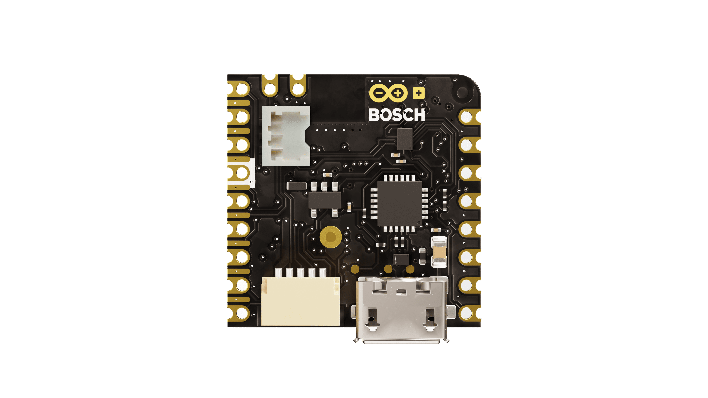

# Description

The Arduino Nicla Sense ME is our smallest form factor yet, with a range of industrial-grade sensors packed into a tiny footprint. Measure process parameters such as temperature, humidity, and movement. Dive into edge computing with powerful data fusion capabilities. Make your own industrial-grade wireless sensing network with the onboard BHI260AP, BMP390, BMM150, and BME688 sensors from Bosch®.

# Target Areas
Wireless sensor networks, data fusion, artificial intelligence, and gas detection

# Contents

## Features

### Bluetooth® Module

| **Feature**               | **Description**                                     |
| ------------------------- | --------------------------------------------------- |
| **Model**                 | ANNA-B112 Bluetooth® Module                         |
| **Microcontroller**       | nRF52832 System-on-chip                             |
| **CPU Core**              | 64 MHz Arm® Cortex®-M4F                             |
| **Internal SRAM Memory**  | 64 KB                                               |
| **Internal Flash Memory** | 512 KB                                              |
| **External Flash Memory** | 2 MB                                                |
| **Interfaces**            | 2x SPI, 2x I2C (one accessible via pin header each) |
| **ADC**                   | 12-bit/200 ksps                                     |
| **Bluetooth® Frequency**  | 2400–2483.5 MHz                                     |
| **Antenna**               | Internal                                            |
| **Oscillator**            | Internal 32 MHz                                     |
| **Operating Voltage**     | 1.8 VDC                                             |

### Smart Sensor with Integrated IMU

| **Feature**           | **Description**                                                          |
|-----------------------|--------------------------------------------------------------------------|
| **Model**             | Bosch® BHI260AP                                                          |
| **CPU Core**          | Fuser 2, 32 Bit Synopsys DesignWare ARC™ EM4™ CPU                        |
| **IMU**               | 6-axis: 16-bit 3-axis accelerometer & gyroscope                          |
| **Advanced Features** | Self-learning AI, swim analytics, pedestrian dead reckoning, orientation |
| **External Memory**   | 2MB Flash connected via QSPI                                             |

### High-Performance Pressure Sensor

| **Feature**               | **Description**                   |
|---------------------------|-----------------------------------|
| **Model**                 | Bosch® BMP390                     |
| **Operating Range**       | 300-1250 hPa                      |
| **Absolute Accuracy**     | ± 0.5 hPa                         |
| **Relative Accuracy**     | ± 0.03 hPa (equivalent to ±25 cm) |
| **RMS Noise**             | 0.02 Pa                           |
| **FIFO Buffer**           | Integrated 512 byte               |
| **Maximum Sampling Rate** | 200 Hz                            |

### 3-Axis Magnetometer

| **Feature**        | **Description**                       |
| ------------------ | ------------------------------------- |
| **Model**          | Bosch® BMM150                         |
| **Magnetic Range** | X, Y axis: ±1300 μT, Z axis: ±2500 μT |
| **Resolution**     | 0.3 μT                                |
| **Non-linearity**  | <1% FS                                |

### Environmental Sensor

| **Feature**         | **Description**                                                            |
|---------------------|----------------------------------------------------------------------------|
| **Model**           | Bosch® BME688                                                              |
| **Operating Range** | Pressure: 300-1100 hPa, Humidity: 0-100%, Temperature: -40 - +85°C         |
| **eNose Sensor**    | Sensor-to-sensor deviation (IAQ): ± 15% ± 15 IAQ                           |
| **Sensor Outputs**  | IAQ, bVOC- and CO2-equivalents (ppm), gas scan result (%), intensity level |

### Onboard Microcontroller

| **Feature**   | **Description**                          |
|---------------|------------------------------------------|
| **Model**     | ATSAMD11D14A-MUT                         |
| **Functions** | Serial to USB bridge, debugger interface |

## The Board

### Application Examples
The Arduino® Nicla Sense ME is your gateway to develop wireless networking solutions with rapid development and high robustness. Get real-time insight into the operational characteristics of your processes. Take advantage of the high-quality sensors and networking capabilities to evaluate novel WSN architectures. Ultra-low power consumption and integrated battery management allow for deployment in various capabilities. WebBLE allows for easy OTA updates of the firmware as well as remote monitoring.

- **Warehouse & Inventory Management**:
The environmental sensor of the Arduino® Nicla Sense ME can detect the ripening state of fruits, vegetables and meat allowing for intelligent management of perishable assets alongside the Arduino Cloud.

- **Distributed Industrial Sensing**:
Identify operating conditions within your machine, factory or greenhouse remotely and even in hard-to-access or hazardous areas. Detect natural gas, toxic gases or other hazardous fumes using the AI capabilities on the **Arduino® Nicla Sense ME**. Improve safety levels with remote analysis. Mesh capabilities allow for simple deployment of WSN with minimal infrastructure requirements.

- **Wireless Sensor Network Reference Design**:
The Nicla form factor has been specifically developed at Arduino® as a standard for wireless sensor networks which can be adapted by partners to develop custom-designed industrial solutions. Get a head start by developing custom end-user solutions including Cloud-connected battery-powered IoT devices and autonomous robotics. Researchers and educators can use this platform to work on an industrially-recognized standard for wireless sensor research and development that can shorten the time from concept to market.

### Accessories (Not Included)
- Single-cell Li-ion/Li-Po battery

### Related Products
- ESLOV connector
- Arduino® Portenta H7 (SKU: ABX00042)

### Assembly Overview

**Note**: The NTC pin on the battery connector is optional. This feature allows safer use and thermal shutoff. 

## Ratings
### Recommended Operating Conditions
| Symbol               | Description                      | Min                                 | Typ | Max                                 | Unit |
|----------------------|----------------------------------|-------------------------------------|-----|-------------------------------------|------|
| VIN       | Input voltage from VIN pad       | 3.5                                 | 5.0 | 5.5                                 | V    |
| VUSB      | Input voltage from USB connector | 4.8                                 | 5.0 | 5.5                                 | V    |
| VDDIO_EXT | Level Translator Voltage         | 1.8                                 | 3.3 | 3.3                                 | V    |
| VIH       | Input high-level voltage         | 0.7VDDIO_EXT1 |     | VDDIO_EXT                | V    |
| VIL       | Input low-level voltage          | 0                                   |     | 0.3VDDIO_EXT2 | V    |
| TOP       | Operating Temperature            | -40                                 | 25  | 85                                  | °C   |

**Note**: VDDIO_EXT is software programmable.  While the ADC inputs can accept up to 3.3V, the maximum value is at the ANNA B112 operating voltage.

**1** : All I/O pins operate at VDDIO_EXT apart from the following:
- ADC1 and ADC2 - 1V8
- JTAG_SAMD11 - 3V3
- JTAG_ANNA - 1V8
- JTAG_BHI - 1V8

**2** : If the internal VDDIO_EXT is disabled, it is possible to supply it externally.

## Functional Overview

### Block Diagram

### Board Topology
**Top View**

| **Ref.** | **Description**                                  | **Ref.** | **Description**                  |
| -------- | ------------------------------------------------ | -------- | -------------------------------- |
| MD1      | ANNA B112 Bluetooth® Module                      | U2, U7   | MX25R1635FZUIH0 2 MB FLASH IC    |
| U3       | BMP390 Pressure Sensor IC                        | U4       | BMM150 3-axis Magnetic Sensor IC |
| U5       | BHI260AP 6 axis IMU and AI core IC               | U6       | BME688 Environmental Sensor IC   |
| U8       | IS31FL3194-CLS2-TR 3-channel LED IC              | U9       | BQ25120AYFPR Battery Charger IC  |
| U10      | SN74LVC1T45 1Channel voltage level translator IC | U11      | TXB0108YZPR Bidirectional IC     |
| U12      | NTS0304EUKZ 4-bit translating transceiver        | J1       | ADC, SPI and LPIO Pin headers    |
| J2       | I2C, JTAG, Power and LPIO pin headers            | J3       | Battery pin headers              |
| Y1       | SIT1532AI-J4-DCC MEMS 32.7680 kHz Oscillator     | DL1      | SMLP34RGB2W3 RGB SMD LED         |
| PB1      | Reset button                                     |          |                                  |

**Back View**

| **Ref.** | **Description**                             | **Ref.** | **Description**                                        |
|----------|---------------------------------------------|----------|--------------------------------------------------------|
| U1       | ATSAMD11D14A-MUT USB Bridge                 | U13      | NTS0304EUKZ 4-bit translating transceiver IC           |
| U14      | AP2112K-3.3TRG1 0.6 A 3.3 V LDO IC          | J4       | 3-pin 1.2mm ACH Battery Connector (BM03B-ACHSS-GAN-TF) |
| J5       | SM05B-SRSS-TB(LF)(SN) 5-pin Eslov connector | J7       | microUSB connector                                     |

### Microcontroller
The Arduino® Nicla Sense ME is powered by a nRF52832 SoC within the ANNA-B112 module (MD1). The nRF52832 SoC is built around an Arm® Cortex®-M4 microcontroller with a floating point unit running at 64 MHz. Sketches are stored inside the nRF52832 internal 512 KB FLASH which is shared with the bootloader. 64 KB SRAM is available to the user. The ANNA-B112 acts as an SPI host for the data logging 2MB flash (U7) and the BHI260 6-axis IMU (U5). It is also the secondary for the BHI260 (U5) I2C and SPI connection. While the module itself runs at 1.8V, a level shifter can adjust the logic level between 1.8V and 3.3V depending on the LDO set in BQ25120 (U9). An external oscillator (Y1) provides a 32 KHz signal. 

### Bosch® BHI260 Smart Sensor System with Built-in 6-Axis IMU
The Bosch® BHI260 is an ultra-low power programmable sensor, combining a Fuser2 core processor, 6-axis IMU (gyroscope and accelerometer) together with a sensor fusion software framework. The BHI260 is a smart sensor core (hosting a programmable recognition system), that handles communication with other sensors on the **Arduino Nicla Sense ME** via I2C and SPI connections. There is also a dedicated 2MB Flash (U2) used to store execute-in-place (XiP) code as well as data storage, such as Bosch® sensor fusion algorithm (BSX) calibration data. The BHI 260 is capable of loading custom algorithms that can be trained on a PC. The generated smart algorithm then operates on this chip.

### Bosch® BME688 Environmental Sensor
The **Arduino Nicla Sense ME** is able to perform environmental monitoring via the Bosch® BME688 sensor (U6). This provides capabilities for pressure, humidity, temperature as well as Volatile Organic Compound (VOC) detection. The Bosch® BME688 performs gas detection via an eNose metal oxide semiconductor array with a typical gas scan cycle of 10.8 seconds.

### Bosch® BMP390 Pressure Sensor
Industrial grade accuracy and stability in pressure measurements are provided by the BMP390 (U3) designed for prolonged use, with a relative accuracy of ±0.03 hPa and an RMS of 0.02 Pa in high-resolution mode. The Bosch® BMP390 is suitable for rapid measurements with a sampling rate of 200 Hz, or for low-power use with a sampling rate of 1 Hz, consuming less than 3.2 µA. U3 is controlled via an SPI interface to the BHI260 (U2), on the same bus as the BME688 (U6).

### Bosch® BMM150 3-Axis Magnetometer
The Bosch® BMM150 (U4) provides accurate 3-axis measurements of the magnetic field with compass-level accuracy. Combined with the BHI260 IMU (U2), Bosch® sensor fusion can be used to obtain high-accuracy spatial orientation and motion vectors for the detection of heading in autonomous robots as well as predictive maintenance. There is a dedicated I2C connection to the BHI260 (U2), acting as the host.
### RGB LED

An I2C LED driver (U8) drives the RGB LED (DL1) and is capable of a maximum output of 40 mA. It is driven by the ANN-B112 (U5) microcontroller. 

### USB Bridge
The SAMD11 microcontroller (U1) is dedicated to act as both the USB bridge as well as the JTAG controller for the ANNA-B112. A logic level translator (U13) acts as an in-between to translate 3.3V logic to 1.8V for the ANNA-B112. The 3.3V voltage is generated from the USB voltage by an LDO (U14).

### Power Tree

The **Arduino Nicla Sense ME** can be powered via micro USB (J7), ESLOV (J5) or VIN. This is converted into the relevant voltages via the BQ2512BAYFPR IC (U9). A Schottky diode provides reverse polarity protection to the USB and ESLOV voltages. When voltage is supplied via the micro USB, a linear 3.3V regulator also provides power to the SAMD11 microcontroller used for programming the board as well as for JTAG and SWD. The LED driver (U8) and RGB LEDs (DL1) are driven by a boost voltage of 5V. All other components operate off the 1.8V rail regulated by a buck converter. PMID acts as an OR switch between VIN and BATT and operates the LED driver. All I/O broken out to the pins are fed through a bidirectional voltage translator running at VDDIO_EXT. 

Additionally, the BQ25120AYFPR (U9) also provides support for a single cell 3.7V LiPo/Li-ion battery pack connected to J4, allowing the use of the board as a wireless sensor network. The battery charging current is set to 40mA with a termination current of 4mA (10%).

## Board Operation
### Getting Started - IDE
If you want to program your Arduino® Nicla Sense ME while offline you need to install the Arduino® Desktop IDE **[1]** To connect the Arduino® Nicla Sense ME to your computer, you’ll need a micro USB cable. This also provides power to the board, as indicated by the LED. The Arduino core is operated on the ANNA-B112 while the Bosch® Smart Sensor framework operates on the BHI260.

### Getting Started - Arduino Cloud Editor
All Arduino® boards, including this one, work out-of-the-box on the Arduino® Cloud Editor **[2]**, by just installing a simple plugin. 

The Arduino® Cloud Editor is hosted online, therefore it will always be up-to-date with the latest features and support for all boards. Follow **[3]** to start coding on the browser and upload your sketches onto your board.

### Getting Started - Arduino Cloud
All Arduino® IoT enabled products are supported on Arduino® Cloud which allows you to log, graph and analyze sensor data, trigger events, and automate your home or business.

### Getting Started - WebBLE
The Arduino Nicla Sense ME provides the capability for OTA updates to the NINA-B112 and BHI260 firmware using WebBLE.

### Getting Started - ESLOV
This board can act as a secondary to an ESLOV controller and have the firmware updated through this method.
### Sample Sketches
Sample sketches for the Arduino® Nicla Sense ME can be found either in the “Examples” menu in the Arduino® IDE or in the “Documentation” section of the Arduino® Pro website **[4]**

### Online Resources
Now that you have gone through the basics of what you can do with the board you can explore the endless possibilities it provides by checking exciting projects on ProjectHub **[5]**, the Arduino® Library Reference **[6]** and the online store **[7]** where you will be able to complement your board with sensors, actuators and more.

### Board Recovery
All Arduino® boards have a built-in bootloader that allows flashing the board via USB. In case a sketch locks up the processor and the board is not reachable anymore via USB, it is possible to enter bootloader mode by double-tapping the reset button right after the power-up.

## Connector Pinouts
**Note:** All the pins on J1 and J2 (excluding fins) are referenced to the VDDIO_EXT voltage which can be generated internally or supplied externally.

### J1 Nicla Header A

| Pin | **Function** | **Type** | **Description**                    |
|-----|--------------|----------|------------------------------------|
| 1   | LPIO0_EXT    | Digital  | Low Power IO Pin 0                 |
| 2   | NC           | N/A      | N/A                                |
| 3   | CS           | Digital  | SPI Cable Select                   |
| 4   | COPI         | Digital  | SPI Controller Out / Peripheral In |
| 5   | CIPO         | Digital  | SPI Controller In / Peripheral Out |
| 6   | SCLK         | Digital  | SPI Clock                          |
| 7   | ADC2         | Analog   | Analog Input 2                     |
| 8   | ADC1         | Analog   | Analog Input 1                     |

### J2 Nicla Header B

| Pin | **Function** | **Type** | **Description**       |
|-----|--------------|----------|-----------------------|
| 1   | SDA          | Digital  | I2C Data Line         |
| 2   | SCL          | Digital  | I2C Clock             |
| 3   | LPIO1_EXT    | Digital  | Low Power IO Pin 1    |
| 4   | LPIO2_EXT    | Digital  | Low Power IO Pin 2    |
| 5   | LPIO3_EXT    | Digital  | Low Power IO Pin 3    |
| 6   | GND          | Power    | Ground                |
| 7   | VDDIO_EXT    | Digital  | Logic Level Reference |
| 8   | N/C          | N/A      | N/A                   |
| 9   | VIN          | Digital  | Input Voltage         |

**Note:** For further information on how Low Power I/Os work, check [Nicla Family Form Factor](https://docs.arduino.cc/learn/hardware/nicla-form-factor) documentation.

### J2 Fins

| Pin | **Function**  | **Type** | **Description**                     |
|-----|---------------|----------|-------------------------------------|
| P1  | BHI_SWDIO     | Digital  | BHI260 JTAG Serial Wire Debug Data  |
| P2  | BHI_SWDCLK    | Digital  | BHI260 JTAG Serial Wire Debug Clock |
| P3  | ANNA_SWDIO    | Digital  | ANNA JTAG Serial Wire Debug Data    |
| P4  | ANNA_SWDCLK   | Digital  | ANNA JTAG Serial Wire Debug Clock   |
| P5  | RESET         | Digital  | Reset Pin                           |
| P6  | SAMD11_SWDIO  | Digital  | SAMD11 JTAG Serial Wire Debug Data  |
| P7  | +1V8          | Power    | +1.8V Voltage Rail                  |
| P8  | SAMD11_SWDCLK | Digital  | SAMD11 JTAG Serial Wire Debug Clock |

**Note:** These test points can easily be accessed by inserting the board in a double row 1.27 mm/50 mil pitch male header.
**Note 2:** All JTAG logic levels operate at 1.8V apart from the SAMD11 pins (P6 and P8) which are 3.3V. All these JTAG pins are 1.8V only and don't scale with VDDIO.

### J3 Battery Pads

| Pin | **Function** | **Type** | **Description** |
|-----|--------------|----------|-----------------|
| 1   | VBAT         | Power    | Battery input   |
| 2   | NTC          | Analog   | NTC Thermistor  |

### J4 Battery Connector

| Pin | **Function** | **Type** | **Description** |
|-----|--------------|----------|-----------------|
| 1   | VBAT         | Power    | Battery input   |
| 2   | NTC          | Analog   | NTC Thermistor  |
| 3   | GND          | Power    | Ground          |

### J5 ESLOV

| Pin | **Function** | **Type** | **Description** |
|-----|--------------|----------|-----------------|
| 1   | 5V           | Power    | 5V Power Rail   |
| 2   | INT          | Digital  | Digital IO      |
| 3   | SCL          | Digital  | I2C Clock Line  |
| 4   | SDA          | Digital  | I2C Data Line   |
| 5   | GND          | Power    | Ground          |

## Mechanical Information

### Power Consumption
| Description                                                     | Min | Typ  | Max | Unit |
|-----------------------------------------------------------------|-----|------|-----|------|
| Power consumption in standby                                    |     | 460  |     | uA   |
| Power consumption with blink sketch                             |     | 960  |     | uA   |
| Power consumption advertising with sensor polling at 1Hz        |     | 2.5  |     | mA   |
| Power consumption advertising with sensor polling once per hour |     | 1.15 |     | mA   |

**Note:** The measurements have been performed by activating the temperature sensor, accelerometer and gyroscope, which have been configured with a 1Hz sample rate and 1ms latency.

## Certifications

### Certifications Summary

<table>
   <thead>
      <tr>
         <th style="width: 16%;vertical-align: middle;text-align: center;"><strong>Certification</strong></th>
         <th style="width: 28%;vertical-align: middle;text-align: center;"><strong>Status</strong></th>
      </tr>
      <tr></tr>
   </thead>
   <tbody>
      <tr>
         <td style="vertical-align: middle;text-align: center;"><strong>CE (EU)</strong></td>
         <td style="vertical-align: middle;text-align: center;">
            
EN IEC 62311:2020

            
EN 62368-1:2014+A11+2017

            
ETSI EN 301 489-1 V2.2.3 (2019-11)

            
ETSI EN 301 489-17 V3.2.4 (2020-09)

            
ETSI EN 300 328 V2.2.2: 2019-07

        </td>
      </tr>
      <tr>
         <td style="vertical-align: middle;text-align: center;"><strong>RoHS (EU)</strong></td>
         <td style="vertical-align: middle;text-align: center;">
              
IEC 62321-3-1-2013

              
IEC 62321-5-2013

              
IEC 62321-7-1-2015

              
IEC 62321-7-2-2017

              
IEC 62321-6-2015

              
IEC 62321-8-2017

         </td>
      </tr>
      <tr>
         <td style="vertical-align: middle;text-align: center;"><strong>REACH (EU)</strong></td>
         <td style="vertical-align: middle;text-align: center;">Yes</td>
      </tr>
      <tr>
         <td style="vertical-align: middle;text-align: center;"><strong>WEEE (EU)</strong></td>
         <td style="vertical-align: middle;text-align: center;">Yes</td>
      </tr>
      <tr>
         <td style="vertical-align: middle;text-align: center;"><strong>UKCA (UK)</strong></td>
         <td style="vertical-align: middle;text-align: center;">
                
EN IEC 62311:2020

                
EN 62368-1-2014+A11+2017

                
ETSI EN 301 489-1 V2.2.3 (2019-11)

                
ETSI EN 301 489-17 V3.2.4 (2020-09)

                
ETSI EN 300 328 V2.2.2: 2019-07

         </td>
      </tr>
      <tr>
         <td style="vertical-align: middle;text-align: center;"><strong>FCC (US)</strong></td>
         <td style="vertical-align: middle;text-align: center;">
            
Yes

         </td>
      </tr>
      <tr>
         <td style="vertical-align: middle;text-align: center;"><strong>IC (CA)</strong></td>
         <td style="vertical-align: middle;text-align: center;">
            
RSS-247 Issue 2

         </td>
      </tr>
      <tr>
         <td style="vertical-align: middle;text-align: center;"><strong>MIC</strong></td>
         <td style="vertical-align: middle;text-align: center;">
            
Yes

         </td>
      </tr>
      <tr>
         <td style="vertical-align: middle;text-align: center;"><strong>SRRC</strong></td>
         <td style="vertical-align: middle;text-align: center;">
            
Yes

         </td>
      </tr>
      <tr>
         <td style="vertical-align: middle;text-align: center;"><strong>CCC</strong></td>
         <td style="vertical-align: middle;text-align: center;">
            
Yes

         </td>
      </tr>
      <tr>
         <td style="vertical-align: middle;text-align: center;"><strong>GB4943</strong></td>
         <td style="vertical-align: middle;text-align: center;">
            
Yes

         </td>
      </tr>
   </tbody>
</table>

### Declaration of Conformity CE DoC (EU)
We declare under our sole responsibility that the products above are in conformity with the essential requirements of the following EU Directives and therefore qualify for free movement within markets comprising the European Union (EU) and European Economic Area (EEA). 

### Declaration of Conformity to EU RoHS & REACH 211 01/19/2021
Arduino boards are in compliance with RoHS 2 Directive 2011/65/EU of the European Parliament and RoHS 3 Directive 2015/863/EU of the Council of 4 June 2015 on the restriction of the use of certain hazardous substances in electrical and electronic equipment. 

| Substance                              | **Maximum limit (ppm)** |
|----------------------------------------|-------------------------|
| Lead (Pb)                              | 1000                    |
| Cadmium (Cd)                           | 100                     |
| Mercury (Hg)                           | 1000                    |
| Hexavalent Chromium (Cr6+)             | 1000                    |
| Poly Brominated Biphenyls (PBB)        | 1000                    |
| Poly Brominated Diphenyl ethers (PBDE) | 1000                    |
| Bis(2-Ethylhexyl) phthalate (DEHP)     | 1000                    |
| Benzyl butyl phthalate (BBP)           | 1000                    |
| Dibutyl phthalate (DBP)                | 1000                    |
| Diisobutyl phthalate (DIBP)            | 1000                    |

Exemptions: No exemptions are claimed. 

Arduino Boards are fully compliant with the related requirements of European Union Regulation (EC) 1907 /2006 concerning the Registration, Evaluation, Authorization and Restriction of Chemicals (REACH). We declare none of the SVHCs (https://echa.europa.eu/web/guest/candidate-list-table), the Candidate List of Substances of Very High Concern for authorization currently released by ECHA, is present in all products (and also package) in quantities totaling in a concentration equal or above 0.1%. To the best of our knowledge, we also declare that our products do not contain any of the substances listed on the "Authorization List" (Annex XIV of the REACH regulations) and Substances of Very High Concern (SVHC) in any significant amounts as specified by the Annex XVII of Candidate list published by ECHA (European Chemical Agency) 1907 /2006/EC.

### Conflict Minerals Declaration 

As a global supplier of electronic and electrical components, Arduino is aware of our obligations with regards to laws and regulations regarding Conflict Minerals, specifically the Dodd-Frank Wall Street Reform and Consumer Protection Act, Section 1502. Arduino does not directly source or process conflict minerals such as Tin, Tantalum, Tungsten, or Gold. Conflict minerals are contained in our products in the form of solder, or as a component in metal alloys. As part of our reasonable due diligence Arduino has contacted component suppliers within our supply chain to verify their continued compliance with the regulations. Based on the information received thus far we declare that our products contain Conflict Minerals sourced from conflict-free areas. 

## FCC Caution
Any Changes or modifications not expressly approved by the party responsible for compliance could void the user’s authority to operate the equipment.

This device complies with part 15 of the FCC Rules. Operation is subject to the following two conditions: 

(1) This device may not cause harmful interference

(2) this device must accept any interference received, including interference that may cause undesired operation.

**FCC RF Radiation Exposure Statement:**

1. This Transmitter must not be co-located or operating in conjunction with any other antenna or transmitter.

2. This equipment complies with RF radiation exposure limits set forth for an uncontrolled environment.

3. This equipment should be installed and operated with a minimum distance of 20cm between the radiator & your body.

English: 
User manuals for license-exempt radio apparatus shall contain the following or equivalent notice in a conspicuous location in the user manual or alternatively on the device or both. This device complies with Industry Canada license-exempt RSS standard(s). Operation is subject to the following two conditions:

(1) this device may not cause interference

(2) this device must accept any interference, including interference that may cause undesired operation of the device.

French: 
Le présent appareil est conforme aux CNR d’Industrie Canada applicables aux appareils radio exempts de licence. L’exploitation est autorisée aux deux conditions suivantes:

(1) l’appareil nedoit pas produire de brouillage

(2) l’utilisateur de l’appareil doit accepter tout brouillage radioélectrique subi, même si le brouillage est susceptible d’en compromettre le fonctionnement.

**IC SAR Warning:**

English 
This equipment should be installed and operated with a minimum distance of 20 cm between the radiator and your body.  

French: 
Lors de l’ installation et de l’ exploitation de ce dispositif, la distance entre le radiateur et le corps est d ’au moins 20 cm.

**Important:** The operating temperature of the EUT can’t exceed 85℃ and shouldn’t be lower than -40℃.

Hereby, Arduino S.r.l. declares that this product is in compliance with essential requirements and other relevant provisions of Directive 201453/EU. This product is allowed to be used in all EU member states. 

| Frequency bands             | Typical Output Power |
| --------------------------- | -------------------- |
| 2.402-2480 MHz, 40 channels | +6dBm                |

## NCC Low Power Warning

**警語:**

取得審驗證明之低功率射頻器材，非經核准，公司、商號或使用者均不得擅自變更頻率、加大功率或變更原設計之特性及功能。

低功率射頻器材之使用不得影響飛航安全及干擾合法通信；經發現有干擾現象時，應立即停用，並改善至無干擾時方得繼續使用。

前述合法通信，指依電信管理法規定作業之無線電通信。

低功率射頻器材須忍受合法通信或工業、科學及醫療用電波輻射性電機設備之干擾。

## SRRC

This equipment contains a radio transmitter module with model approval code: CMIIT ID: 25J996Q00001.

## Company Information

| Company name    | Arduino SRL                                  |
|-----------------|----------------------------------------------|
| Company Address | Via Andrea Appiani, 25 - 20900 MONZA (Italy) |

## Reference Documentation

| Ref                                | Link                                                                                                |
|------------------------------------|-----------------------------------------------------------------------------------------------------|
| Arduino® IDE (Desktop)             | https://www.arduino.cc/en/Main/Software                                                             |
| Arduino® IDE (Cloud)               | https://create.arduino.cc/editor                                                                    |
| Arduino® Cloud IDE Getting Started | https://create.arduino.cc/projecthub/Arduino_Genuino/getting-started-with-arduino-web-editor-4b3e4a |
| Arduino® Pro Website               | https://www.arduino.cc/pro                                                                          |
| Project Hub                        | https://create.arduino.cc/projecthub?by=part&part_id=11332&sort=trending                            |
| Library Reference                  | https://github.com/bcmi-labs/Arduino_EdgeControl/tree/4dad0d95e93327841046c1ef80bd8b882614eac8      |
| Online Store                       | https://store.arduino.cc/                                                                           |

## Revision History

| **Date**   | **Revision** | **Changes**                                          |
| ---------- | ------------ | ---------------------------------------------------- |
| 05/02/2025 | 8            | Description updates                                  |
| 03/09/2024 | 7            | Cloud Editor updated from Web Editor                 |
| 09/01/2024 | 6            | High-Performance Pressure Sensor information updated |
| 03/07/2023 | 5            | Certification Summary Table Updated                  |
| 22/12/2022 | 4            | Add NTC Image & addition pins info                   |
| 13/12/2022 | 3            | Change Solution Overview Image                       |
| 20/07/2021 | 2            | Technical Revisions                                  |
| 27/05/2021 | 1            | Initial Version                                      |

## Product Warnings and Disclaimers

THESE PRODUCTS ARE INTENDED FOR SALE TO AND INSTALLATION BY QUALIFIED PROFESSIONALS. ARDUINO CANNOT PROVIDE ANY ASSURANCE THAT ANY PERSON OR ENTITY BUYING ITS PRODUCTS, INCLUDING ANY “AUTHORIZED DEALER” OR “AUTHORIZED RESELLER”, IS PROPERLY TRAINED OR EXPERIENCED TO CORRECTLY INSTALL RELATED PRODUCTS.

A PROPERLY INSTALLED AND MAINTAINED SYSTEM MAY ONLY REDUCE THE RISK OF EVENTS SUCH AS LOSS OF FUNCTIONALITY; IT IS NOT INSURANCE OR A GUARANTEE THAT SUCH EVENTS WILL NOT OCCUR, THAT ADEQUATE WARNING OR PROTECTION WILL BE PROVIDED, OR THAT THERE WILL BE NO DEATH, PERSONAL INJURY, AND/OR PROPERTY DAMAGE AS A RESULT.

BEFORE INSTALLING THE PRODUCTS, ENSURE THAT ITS FIRMWARE IS UPGRADED TO THE LATEST VERSION, AVAILABLE FOR DOWNLOAD FROM OUR WEBSITE. DURING THE LIFESPAN OF PRODUCTS, IT IS IMPORTANT TO CHECK ABOUT THE APPLICABILITY OF FIRMWARE UPDATES.

USERS SHOULD, WHERE APPLICABLE, CHANGE PASSWORDS FREQUENTLY AND ENSURE A HIGH-QUALITY PASSWORD (PASSWORDS SHOULD BE LONG AND COMPLEX ENOUGH, NEVER SHARED, AND ALWAYS UNIQUE). FURTHERMORE, IT IS THE USERS’ RESPONSIBILITY TO KEEP ITS ANTI-VIRUS SYSTEM UP TO DATE.

WHILE ARDUINO MAKES REASONABLE EFFORTS TO REDUCE THE PROBABILITY THAT A THIRD PARTY MAY HACK, COMPROMISE OR CIRCUMVENT ITS SECURITY PRODUCTS, RELATED SOFTWARE OR CLOUD SERVERS, ANY SECURITY PRODUCT, SOFTWARE OR CLOUD SERVER MANUFACTURED, SOLD AND/OR LICENSED BY ARDUINO, MAY STILL BE HACKED, COMPROMISED AND/OR CIRCUMVENTED.

CERTAIN PRODUCTS OR SOFTWARE MANUFACTURED, SOLD OR LICENSED BY ARDUINO CONNECT TO THE INTERNET TO SEND AND/OR RECEIVE DATA (“INTERNET OF THINGS” OR “IOT” PRODUCTS). ANY CONTINUED USE OF AN IOT PRODUCT AFTER ARDUINO HAS CEASED SUPPORTING THAT IOT PRODUCT (E.G., THROUGH NOTICE THAT ARDUINO NO LONGER PROVIDES FIRMWARE UPDATES OR BUG FIXES) MAY RESULT IN REDUCED PERFORMANCE, MALFUNCTION, AND/OR INCREASED VULNERABILITY TO HACKING, COMPROMISE AND/OR CIRCUMVENTION.

ARDUINO DOES NOT ALWAYS ENCRYPT COMMUNICATIONS BETWEEN PRODUCTS AND THEIR PERIPHERAL DEVICES INCLUDING, BUT NOT LIMITED TO, SENSORS OR DETECTORS UNLESS REQUIRED BY APPLICABLE LAW. AS A RESULT THESE COMMUNICATIONS MAY BE INTERCEPTED AND COULD BE USED TO CIRCUMVENT YOUR SYSTEM.

THE ABILITY OF ARDUINO PRODUCTS AND SOFTWARE TO WORK PROPERLY DEPENDS ON A NUMBER OF PRODUCTS AND SERVICES MADE AVAILABLE BY THIRD PARTIES OVER WHICH ARDUINO HAS NO CONTROL INCLUDING, BUT NOT LIMITED TO, INTERNET, CELLULAR AND LANDLINE CONNECTIVITY; MOBILE DEVICE AND OPERATING SYSTEM COMPATIBILITY; AND PROPER INSTALLATION AND MAINTENANCE. ARDUINO SHALL NOT BE LIABLE FOR ANY DAMAGES CAUSED BY ACTIONS OR OMISSIONS OF THIRD PARTIES.

BATTERY OPERATED SENSORS, DETECTORS, KEYFOBS, DEVICES AND OTHER PANEL ACCESSORIES HAVE A LIMITED BATTERY LIFE.  WHILE THESE PRODUCTS MAY BE DESIGNED TO PROVIDE SOME WARNING OF IMMINENT BATTERY DEPLETION, THE ABILITY TO DELIVER SUCH WARNINGS IS LIMITED AND SUCH WARNINGS MAY NOT BE PROVIDED IN ALL CIRCUMSTANCES.  PERIODIC TESTING OF THE SYSTEM IN ACCORDANCE WITH PRODUCT DOCUMENTATION IS THE ONLY WAY TO DETERMINE IF ALL SENSORS, DETECTORS, KEYFOBS, DEVICES AND OTHER PANEL ACCESSORIES ARE FUNCTIONING PROPERLY.

CERTAIN SENSORS, DEVICES AND OTHER PANEL ACCESSORIES MAY BE PROGRAMMED INTO PANEL AS “SUPERVISORY” SO THAT THE PANEL WILL INDICATE IF IT DOES NOT RECEIVE A REGULAR SIGNAL FROM THE DEVICE WITHIN A CERTAIN PERIOD OF TIME.  CERTAIN DEVICES CANNOT BE PROGRAMMED AS SUPERVISORY. DEVICES CAPABLE OF BEING PROGRAMMED AS SUPERVISORY MAY NOT BE PROPERLY PROGRAMMED AT INSTALLATION, RESULTING IN A FAILURE TO REPORT TROUBLE WHICH COULD RESULT IN DEATH, SERIOUS INJURY AND/OR PROPERTY DAMAGE.

PURCHASED PRODUCTS CONTAIN SMALL PARTS THAT COULD BE A CHOKING HAZARD TO CHILDREN OR PETS. KEEP ALL SMALL PARTS AWAY FROM CHILDREN AND PETS.

BUYER SHALL PASS ON THE FOREGOING INFORMATION ON PRODUCT RISKS, WARNINGS AND DISCLAIMERS TO ITS CUSTOMERS AND END USERS.

**WARRANTY DISCLAIMERS AND OTHER DISCLAIMERS**

ARDUINO HEREBY DISCLAIMS ALL WARRANTIES AND REPRESENTATIONS, WHETHER EXPRESS, IMPLIED, STATUTORY OR OTHERWISE INCLUDING (BUT NOT LIMITED TO) ANY WARRANTIES OF MERCHANTABILITY OR FITNESS FOR A PARTICULAR PURPOSE WITH RESPECT TO ITS PRODUCTS AND RELATED SOFTWARE.

ARDUINO MAKES NO REPRESENTATION, WARRANTY, COVENANT OR PROMISE THAT  ITS PRODUCTS AND/OR RELATED SOFTWARE (I) WILL NOT BE HACKED, COMPROMISED AND/OR CIRCUMVENTED; (II) WILL PREVENT, OR PROVIDE ADEQUATE WARNING OR PROTECTION FROM, BREAK-INS, BURGLARY, ROBBERY, FIRE; OR (III) WILL WORK PROPERLY IN ALL ENVIRONMENTS AND APPLICATIONS.

ARDUINO WILL NOT BE LIABLE FOR UNAUTHORIZED ACCESS (I.E. HACKING) INTO THE CLOUD SERVERS OR TRANSMISSION FACILITIES, PREMISES OR EQUIPMENT, OR FOR UNAUTHORIZED ACCESS TO DATA FILES, PROGRAMS, PROCEDURES OR INFORMATION THEREON, UNLESS AND ONLY TO THE EXTENT THAT THIS DISCLAIMER IS PROHIBITED BY APPLICABLE LAW.

SYSTEMS SHOULD BE CHECKED BY A QUALIFIED TECHNICIAN AT LEAST EVERY TWO YEARS UNLESS OTHERWISE INSTRUCTED IN THE PRODUCT DOCUMENTATION AND, IF APPLICABLE, THE BACKUP BATTERY REPLACED AS REQUIRED.

ARDUINO MAY MAKE CERTAIN BIOMETRIC CAPABILITIES (E.G., FINGERPRINT, VOICE PRINT, FACIAL RECOGNITION, ETC.) AND/OR DATA RECORDING CAPABILITIES (E.G., VOICE RECORDING), AND/OR DATA/INFORMATION RECOGNITION AND/OR TRANSLATION CAPABILITIES AVAILABLE IN PRODUCTS ARDUINO MANUFACTURES AND/OR RESELLS. ARDUINO DOES NOT CONTROL THE CONDITIONS AND METHODS OF USE OF PRODUCTS IT MANUFACTURES AND/OR RESELLS. THE END-USER AND/OR INSTALLER AND/OR DISTRIBUTOR ACT AS CONTROLLER OF THE DATA RESULTING FROM USE OF THESE PRODUCTS, INCLUDING ANY RESULTING PERSONALLY IDENTIFIABLE INFORMATION OR PRIVATE DATA, AND ARE SOLELY RESPONSIBLE TO ENSURE THAT ANY PARTICULAR INSTALLATION AND USE OF ARDUINO’S PRODUCTS COMPLY WITH ALL APPLICABLE PRIVACY AND OTHER LAWS, INCLUDING ANY REQUIREMENT TO OBTAIN CONSENT FROM OR PROVIDE NOTICE TO INDIVIDUALS AND ANY OTHER OBLIGATIONS END-USER AND/OR INSTALLER MAY HAVE AS CONTROLLERS OR OTHERWISE UNDER LAW. THE CAPABILITY OR USE OF ANY PRODUCTS MANUFACTURED OR SOLD BY ARDUINO TO RECORD CONSENT SHALL NOT BE SUBSTITUTED FOR THE CONTROLLER’S OBLIGATION TO INDEPENDENTLY DETERMINE WHETHER CONSENT OR NOTICE IS REQUIRED, NOR SHALL SUCH CAPABILITY OR USE SHIFT ANY OBLIGATION TO OBTAIN ANY REQUIRED CONSENT OR NOTICE TO ARDUINO.

THE INFORMATION IN THIS DOCUMENT IS SUBJECT TO CHANGE WITHOUT NOTICE. UPDATED INFORMATION CAN BE FOUND ON OUR WEB PRODUCT PAGE. ARDUINO ASSUMES NO RESPONSIBILITY FOR INACCURACIES OR OMISSIONS AND SPECIFICALLY DISCLAIMS ANY LIABILITIES, LOSSES, OR RISKS, PERSONAL OR OTHERWISE, INCURRED AS A CONSEQUENCE, DIRECTLY OR INDIRECTLY, OF THE USE OR APPLICATION OF ANY OF THE CONTENTS OF THIS DOCUMENT.

THIS PUBLICATION MAY CONTAIN EXAMPLES OF SCREEN CAPTURES AND REPORTS USED IN DAILY OPERATIONS. EXAMPLES MAY INCLUDE FICTITIOUS NAMES OF INDIVIDUALS AND COMPANIES. ANY SIMILARITY TO NAMES AND ADDRESSES OF ACTUAL BUSINESSES OR PERSONS IS ENTIRELY COINCIDENTAL.

REFER TO THE DATA SHEET AND USER DOCUMENTATION FOR INFORMATION ON USE. FOR THE LATEST PRODUCT INFORMATION, CONTACT YOUR SUPPLIER OR VISIT THE PRODUCT PAGES ON THIS SITE.

# 中⽂ (ZH)

# 描述

Arduino Nicla Sense ME 是我们迄今为止体积最小的产品，将一系列工业级传感器集成于极小巧的机身内。可测量温度、湿度、运动等工艺参数。借助强大的数据融合能力，深入探索边缘计算。通过内置的 Bosch® BHI260AP、BMP390、BMM150 和 BME688 传感器，构建专属的工业级无线传感网络。

# 目标领域
无线传感器网络、数据融合、人工智能与气体检测

# 目录

## 特点

### Bluetooth® 蓝牙模块

| **特点**                    | **描述**                                               |
| --------------------------- | ------------------------------------------------------ |
| **型号**                    | ANNA-B112 Bluetooth® 蓝牙模块                          |
| **微控制器**                | nRF52832 系统级芯片                                    |
| **CPU 内核**                | 64 MHz Arm® Cortex®-M4F                                |
| **内部SRAM**                | 64 KB                                                  |
| **内部闪存**                | 512 KB                                                 |
| **外部闪存**                | 2 MB                                                   |
| **接口**                    | 2 路 SPI，2 路 I2C（每种接口各通过一个引脚排针可访问） |
| **ADC**                     | 12-bit/200 ksps                                        |
| **Bluetooth® 蓝牙模块频率** | 2400–2483.5 MHz                                        |
| **天线规格**                | 内部                                                   |
| **振荡器**                  | 内部 32 MHz                                            |
| **工作电压**                | 1.8 VDC                                                |

### 集成 IMU 的智能传感器

| **特点**     | **描述**                                               |
| ------------ | ------------------------------------------------------ |
| **型号**     | Bosch® BHI260AP                                        |
| **CPU 内核** | Fuser 2, 32 Bit Synopsys DesignWare ARCTM EM4TM 处理器 |
| **IMU**      | 6 轴：16 位3轴加速度计和陀螺仪                         |
| **高级特点** | 自学习人工智能、游泳分析、行人航迹推算、方向感测       |
| **外部内存** | 通过 QSPI 连接的 2MB 闪存                              |

### 高性能压力传感器

| **特点**        | **描述**                      |
| --------------- | ----------------------------- |
| **型号**        | Bosch® BMP390                 |
| **允许范围**    | 300-1250 hPa                  |
| **绝对精度**    | ± 0.5 hPa                     |
| **相对精度**    | ± 0.03 hPa（相当于 ±25 厘米） |
| **RMS 降噪**    | 0.02 Pa                       |
| **FIFO 缓冲区** | 集成 512 字节                 |
| **最大采样率**  | 200 Hz                        |

### 3轴磁力计

| **特点**       | **描述**                              |
| -------------- | ------------------------------------- |
| **型号**       | Bosch® BMM150                         |
| **磁场范围**   | X, Y axis: ±1300 μT, Z axis: ±2500 μT |
| **分辨率**     | 0.3 μT                                |
| **非线性误差** | <1% FS                                |

### 环境传感器

| **特点**         | **描述**                                                     |
| ---------------- | ------------------------------------------------------------ |
| **型号**         | Bosch® BME688                                                |
| **允许范围**     | 压力：300-1100 hPa，湿度：0-100%，温度：-40 至 - +85°C       |
| **eNose 传感器** | 传感器间偏差（IAQ）：±15% ±15 IAQ                            |
| **传感器输出**   | IAQ、bVOC 和 CO2 等效浓度（ppm）、气体扫描结果（%）、强度等级 |

### 微控制器

| **特点** | **描述**                  |
| -------- | ------------------------- |
| **型号** | ATSAMD11D14A-MUT          |
| **功能** | 串口转USB桥接器，调试接口 |

## 电路板简介

### 应用示例
Arduino® Nicla Sense ME 是您开发无线网络解决方案的理想选择，具备快速开发和高可靠性。实时监控您的生产流程的运行特性。利用高质量传感器和网络功能，评估新型无线传感器网络（WSN）架构。超低功耗和集成电池管理功能，支持在各种应用场景中部署。WebBLE 支持固件的远程固件升级（OTA）以及远程监控。

- **仓库和库存管理**：
Arduino® Nicla Sense ME 的环境传感器可检测水果、蔬菜和肉类的成熟状态，与 Arduino Cloud 一起实现易腐资产的智能管理。

- **分布式工业传感**：
即使在难以到达或具有危险性的区域，也可远程识别机器、工厂或温室内的运行状态。借助 **Arduino® Nicla Sense ME** 的 AI 能力，检测天然气、有毒气体或其他危险气体。通过远程分析提升安全等级。Mesh 网络功能使无线传感网络（WSN）的部署更加简便，几乎不需基础设施支持。

- **无线传感网络参考设计:**
Nicla 封装规格是 Arduino® 专为无线传感网络开发的一种标准，可由合作伙伴适配用于定制化工业解决方案。通过开发包括连接云端的电池供电 IoT 设备和自主机器人在内的定制终端用户解决方案，让您的项目领先一步。研究人员和教育工作者也可利用该平台，在一个获得工业认可的无线传感器研究开发标准上开展工作，从而缩短从概念到市场的时间。

### 配件（不包含在内）
- 单节锂离子/锂聚合物电池

### 相关产品
- ESLOV 连接器
- Arduino® Portenta H7 (SKU: ABX00042)

### 功能概述

**注意:** 电池连接器上的 NTC 引脚为可选项。此特点有助于更安全地使用，并支持过热保护功能。

## 额定值
### 建议运行条件
| 符号                 | 描述                      | 最小值                              | 典型值 | 最大值                              | 单位 |
| -------------------- | ------------------------- | ----------------------------------- | ------ | ----------------------------------- | ---- |
| VIN       | 来自 VIN 焊盘的输入电压   | 3.5                                 | 5.0    | 5.5                                 | V    |
| VUSB      | 来自 USB 连接器的输入电压 | 4.8                                 | 5.0    | 5.5                                 | V    |
| VDDIO_EXT | 电平转换电压              | 1.8                                 | 3.3    | 3.3                                 | V    |
| VIH       | 输入高电平电压            | 0.7VDDIO_EXT1 |        | VDDIO_EXT                | V    |
| VIL       | 输入低电平电压            | 0                                   |        | 0.3VDDIO_EXT2 | V    |
| TOP       | 工作温度                  | -40                                 | 25     | 85                                  | °C   |

**注意**：VDDIO_EXT 可通过软件编程。虽然 ADC 输入可接受高达 3.3V 的电压，但最大值取决于 ANNA B112 的工作电压。

**1**：除以下引脚外，所有 I/O 引脚均工作在 VDDIO_EXT 电压下：
- ADC1 和 ADC2 - 1V8
- JTAG_SAMD11 - 3V3
- JTAG_ANNA - 1V8
- JTAG_BHI - 1V8

**2**：如果内部 VDDIO_EXT 被禁用，则可以通过外部供电。

## 功能概述

### 方框图

### 电路板拓扑结构
**俯视图**

| **编号** | **描述**                                 | **编号** | **描述**                      |
| -------- | ---------------------------------------- | -------- | ----------------------------- |
| MD1      | ANNA B112 Bluetooth® 蓝牙模块            | U2, U7   | MX25R1635FZUIH0 2MB 闪存芯片  |
| U3       | BMP390 压力传感器芯片                    | U4       | BMM150 3轴磁传感器芯片        |
| U5       | BHI260AP  六轴 IMU 与 AI 核心芯片        | U6       | BME688 环境传感器芯片         |
| U8       | IS31FL3194-CLS2-TR 三通道 LED 驱动芯片   | U9       | BQ25120AYFPR 电池充电管理芯片 |
| U10      | SN74LVC1T45 1通道电压电平转换器集成电路  | U11      | TXB0108YZPR 双向集成电路      |
| U12      | NTS0304EUKZ 4位转换收发器                | J1       | ADC、SPI和LPIO引脚接头        |
| J2       | I2C, JTAG, 电源, LPIO引脚接头            | J3       | 电池引脚接头                  |
| Y1       | SIT1532AI-J4-DCC MEMS 32.7680 kHz 振荡器 | DL1      | SMLP34RGB2W3 RGB SMD LED      |
| PB1      | 复位按钮                                 |          |                               |

**电路板背面视图**

| **编号** | **描述**                                 | **编号** | **描述**                                        |
| -------- | ---------------------------------------- | -------- | ----------------------------------------------- |
| U1       | ATSAMD11D14A-MUT USB桥接器               | U13      | NTS0304EUKZ 4位转换收发器 IC                    |
| U14      | AP2112K-3.3TRG1 0.6 A 3.3 V LDO IC       | J4       | 3针 1.2mm ACH 电池连接器 （BM03B-ACHSS-GAN-TF） |
| J5       | SM05B-SRSS-TB（LF)（SN) 5针 Eslov 连接器 | J7       | microUSB 连接器                                 |

### 微控制器
Arduino® Nicla Sense ME 由 ANNA-B112 模块（MD1）内的 nRF52832 SoC 提供动力。nRF52832 SoC 基于 Arm® Cortex®-M4 微控制器构建，配备浮点运算单元，运行频率为 64 MHz。草图程序存储在 nRF52832 的内部 512 KB 闪存中（与引导程序共享）。用户可使用 64 KB 的 SRAM。ANNA-B112 模块作为数据记录用的 2MB 闪存（U7）和 BHI260 六轴 IMU（U5）的 SPI 主机。同时，它也是 BHI260（U5）I2C 和 SPI 连接的从设备。虽然该模块本身运行在 1.8V 电压下，但可通过电平转换器根据 BQ25120（U9）中设置的 LDO，在 1.8V 和 3.3V 之间调整逻辑电平。一个外部振荡器（Y1）提供 32 KHz 信号。

### Bosch® BHI260 内置六轴 IMU 的智能传感器系统
Bosch® BHI260 是一款超低功耗可编程传感器，集成了 Fuser2 核心处理器、六轴 IMU（陀螺仪和加速度计）以及传感器融合软件框架。BHI260 是一个智能传感器核心（可运行可编程识别系统），负责通过 I2C 和 SPI 接口与 **Arduino Nicla Sense ME** 上的其他传感器进行通信。芯片还配备一个专用的 2MB 闪存（U2），用于存储可直接执行的代码（XiP）以及数据，如 Bosch® 传感器融合算法（BSX）的校准数据。BHI260 支持加载在 PC 上训练好的自定义算法，生成的智能算法可直接在芯片上运行。

### Bosch® BME688 环境传感器
**Arduino Nicla Sense ME** 能够通过 Bosch® BME688 传感器（U6）进行环境监测。该传感器具备检测气压、湿度、温度以及挥发性有机化合物（VOC）的功能。Bosch® BME688 通过 eNose 金属氧化物半导体阵列进行气体检测，典型气体扫描周期为 10.8 秒。 

### Bosch® BMP390 压力传感器
在气压测量方面，BMP390（U3）提供工业级的精度与稳定性，适用于长期使用，在高分辨率模式下具有 ±0.03 hPa 的相对精度和 0.02 Pa 的 RMS 噪声。Bosch® BMP390 既适用于 200 Hz 采样率的快速测量，也可在 1 Hz 低功耗模式下运行，电流消耗低于 3.2 μA。U3 通过 SPI 接口由 BHI260（U2）控制，与 BME688（U6）共用同一总线。

### Bosch® BMM150 3轴磁力计
Bosch® BMM150（U4）可实现对磁场的高精度3轴测量，具备指南针级别的准确性。与 BHI260 IMU（U2）结合后，可通过 Bosch® 传感器融合算法获得高精度的空间姿态和运动矢量，用于自主机器人中的航向检测以及预测性维护。该传感器通过专用 I2C 接口与 BHI260（U2）相连，BHI260 作为主机。
### RGB LED

一个 I2C 接口的 LED 驱动芯片（U8）驱动 RGB LED（DL1），其最大输出电流为 40 mA，由微控制器 ANN-B112（U5）控制。

### USB 转接桥
SAMD11 微控制器（U1）专用于作为 USB 转接桥和 ANNA-B112 的 JTAG 控制器。逻辑电平转换器（U13）用于将 3.3V 逻辑电平转换为 ANNA-B112 所需的 1.8V 电平。3.3V 电压由 LDO 稳压器（U14）通过 USB 电压生成。

### 电源树

**Arduino Nicla Sense ME** 可通过 Micro USB（J7）、ESLOV（J5）或 VIN 接口供电。这些输入电压通过 BQ2512BAYFPR 芯片（U9）转换为各个所需电压。一个肖特基二极管为 USB 和 ESLOV 电压提供反向极性保护。当通过 Micro USB 供电时，一个线性 3.3V 稳压器为用于编程、JTAG 和 SWD 的 SAMD11 微控制器供电。LED 驱动芯片（U8）及 RGB LED（DL1）则由 5V 升压电压驱动。其余所有组件均由降压稳压器提供的 1.8V 电压轨供电。PMID 引脚作为 VIN 和 BATT 之间的“或门”开关，用于驱动 LED 驱动器。所有引出至引脚的 I/O 信号均通过工作在 V DDIO_EXT 电压下的双向电平转换器处理。

此外，BQ25120AYFPR（U9）还支持通过 J4 接口连接单节 3.7V 锂聚合物（LiPo）/锂离子（Li-ion）电池组，使该板卡能够作为无线传感网络使用。电池充电电流设定为 40mA，终止电流为 4mA（10%）。

## 电路板操作
### 入门指南 - IDE
如果您希望在离线状态下为 Arduino® Nicla Sense ME 编程，您需要安装 Arduino® 桌面版 IDE **[1]**。要将 Arduino® Nicla Sense ME 连接至计算机，您需要一根 Micro USB 数据线。该数据线也为开发板供电，供电状态通过 LED 指示灯显示。Arduino 核心运行在 ANNA-B112 上，而 Bosch® 智能传感器框架则运行在 BHI260 上。

### 入门指南 - Arduino Cloud Editor
包括本电路板在内的所有 Arduino®  电路板，都可以在 Arduino® Cloud Editor **[2]**上开箱即用，只需安装一个简单的插件即可。

Arduino® Cloud Editor 是在线托管的，因此它将始终提供最新功能并支持所有电路板。接下来**[3]**开始在浏览器上编码并将程序上传到您的电路板上。

### 入门指南 - Arduino Cloud
Arduino®  Cloud 支持所有 Arduino®  支持 IoT 功能的产品，让您可以记录、绘制和分析传感器数据，触发事件，实现家庭或企业自动化。

### 入门指南 - WebBLE
Arduino Nicla Sense ME 支持使用 WebBLE 对 NINA-B112 和 BHI260 固件进行 OTA 更新。

### 入门指南 - ESLOV
该开发板可以作为 ESLOV 控制器的从设备，并可通过该方式更新固件。
### 示例程序
Arduino® Nicla Sense ME 的示例程序可以在 Arduino IDE 的“示例”菜单或 Arduino® Pro  网站 **[4]** 的“文档”部分找到。

### 在线资源
现在，您已经了解该电路板的基本功能，就可以通过查看 Project Hub **[5]**、Arduino® Library Reference **[6]** 和在线商店 **[7]** 上的精彩项目来探索它所提供的无限可能性；在这些项目中，您可以为电路板配备传感器、执行器等。

### 电路板恢复
所有 Arduino®  电路板都配置有内置的引导加载程序，可以通过 USB 对电路板进行刷新。如果某一程序锁定了处理器，且无法通过 USB 再次访问电路板，则可以在上电后立即双击复位按钮进入引导加载程序模式。

## 连接器引脚布局
**注意:** J1 和 J2 上的所有引脚（不包括散热片）均参考 V DDIO_EXT 电压，该电压可以由内部生成或由外部供电。

### J1 Nicla 头A

| 引脚 | **功能**  | **类型** | **描述**               |
| ---- | --------- | -------- | ---------------------- |
| 1    | LPIO0_EXT | 数字     | 低功耗 IO 引脚 0       |
| 2    | NC        | N/A      | N/A                    |
| 3    | CS        | 数字     | SPI 电缆选择           |
| 4    | COPI      | 数字     | SPI 控制器输出外设输入 |
| 5    | CIPO      | 数字     | SPI 控制器输入外设输出 |
| 6    | SCLK      | 数字     | SPI 时钟               |
| 7    | ADC2      | 模拟     | 模拟输入 2             |
| 8    | ADC1      | 模拟     | 模拟输入 1             |

### J2 Nicla 头B

| 引脚 | **功能**  | **类型** | **描述**         |
| ---- | --------- | -------- | ---------------- |
| 1    | SDA       | 数字     | I2C 数据线       |
| 2    | SCL       | 数字     | I2C 时钟         |
| 3    | LPIO1_EXT | 数字     | 低功耗 IO 引脚 1 |
| 4    | LPIO2_EXT | 数字     | 低功耗 IO 引脚 2 |
| 5    | LPIO3_EXT | 数字     | 低功耗 IO 引脚 3 |
| 6    | GND       | 电源     | 接地             |
| 7    | VDDIO_EXT | 数字     | 逻辑电平参考值   |
| 8    | N/C       | N/A      | N/A              |
| 9    | VIN       | 数字     | 输入电压         |

**注意:** 有关低功耗 I/O 工作原理的更多信息，请查阅 [Nicla 系列封装规格文档](https://docs.arduino.cc/learn/hardware/nicla-form-factor)。

### J2 Fins

| 引脚 | **功能**      | **类型** | **描述**                   |
| ---- | ------------- | -------- | -------------------------- |
| P1   | BHI_SWDIO     | 数字     | BHI260 JTAG 串行线调试数据 |
| P2   | BHI_SWDCLK    | 数字     | BHI260 JTAG 串行线调试时钟 |
| P3   | ANNA_SWDIO    | 数字     | ANNA JTAG 串行线调试数据   |
| P4   | ANNA_SWDCLK   | 数字     | ANNA JTAG 串行线调试时钟   |
| P5   | RESET         | 数字     | 复位引脚                   |
| P6   | SAMD11_SWDIO  | 数字     | SAMD11 JTAG 串行线调试数据 |
| P7   | +1V8          | 电源     | +1.8V 电压轨               |
| P8   | SAMD11_SWDCLK | 数字     | SAMD11 JTAG 串行线调试时钟 |

**注意:** 这些测试点可以通过将板子插入双排 1.27 mm / 50 mil 间距的排针轻松访问。
**注意 2:** 除 SAMD11 引脚（P6 和 P8）为 3.3V 外，所有 JTAG 逻辑电平均为 1.8V。这些 JTAG 引脚仅支持 1.8V，不会随 VDDIO 电压变化而调整。

### J3 电池焊盘

| 引脚 | **功能** | **类型** | **描述**     |
| ---- | -------- | -------- | ------------ |
| 1    | VBAT     | 电源     | 电池输入     |
| 2    | NTC      | 模拟     | NTC 热敏电阻 |

### J4 电池连接器

| 引脚 | **功能** | **类型** | **描述**     |
| ---- | -------- | -------- | ------------ |
| 1    | VBAT     | 电源     | 电池输入     |
| 2    | NTC      | 模拟     | NTC 热敏电阻 |
| 3    | GND      | 电源     | 接地         |

### J5 ESLOV

| 引脚 | **功能** | **类型** | **描述**   |
| ---- | -------- | -------- | ---------- |
| 1    | 5V       | 电源     | 5V 电源轨  |
| 2    | INT      | 数字     | 数字 IO    |
| 3    | SCL      | 数字     | I2C 时钟线 |
| 4    | SDA      | 数字     | I2C 数据线 |
| 5    | GND      | 电源     | 接地       |

## 机械层信息

### 功耗
| 描述                              | 最小值 | 典型值 | 最大值 | 单位 |
| --------------------------------- | ------ | ------ | ------ | ---- |
| 待机功耗                          |        | 460    |        | uA   |
| 运行 Blink 程序时的电源功耗       |        | 960    |        | uA   |
| 以 1Hz 频率轮询传感器时的广播功耗 |        | 2.5    |        | mA   |
| 每小时轮询一次传感器时的广播功耗  |        | 1.15   |        | mA   |

**注意:** 测量是在启用温度传感器、加速度计和陀螺仪的前提下进行的，这些传感器配置为 1Hz 采样率和 1ms 延迟。

## 认证

### 认证摘要

<table>
   <thead>
      <tr>
         <th style="width: 16%;vertical-align: middle;text-align: center;"><strong>认证</strong></th>
         <th style="width: 28%;vertical-align: middle;text-align: center;"><strong>状态</strong></th>
      </tr>
      <tr></tr>
   </thead>
   <tbody>
      <tr>
         <td style="vertical-align: middle;text-align: center;"><strong>CE (EU)</strong></td>
         <td style="vertical-align: middle;text-align: center;">
            
EN IEC 62311:2020

            
EN 62368-1:2014+A11+2017

            
ETSI EN 301 489-1 V2.2.3 (2019-11)

            
ETSI EN 301 489-17 V3.2.4 (2020-09)

            
ETSI EN 300 328 V2.2.2: 2019-07

        </td>
      </tr>
      <tr>
         <td style="vertical-align: middle;text-align: center;"><strong>RoHS (EU)</strong></td>
         <td style="vertical-align: middle;text-align: center;">
              
IEC 62321-3-1-2013

              
IEC 62321-5-2013

              
IEC 62321-7-1-2015

              
IEC 62321-7-2-2017

              
IEC 62321-6-2015

              
IEC 62321-8-2017

         </td>
      </tr>
      <tr>
         <td style="vertical-align: middle;text-align: center;"><strong>REACH (EU)</strong></td>
         <td style="vertical-align: middle;text-align: center;">是</td>
      </tr>
      <tr>
         <td style="vertical-align: middle;text-align: center;"><strong>WEEE (EU)</strong></td>
         <td style="vertical-align: middle;text-align: center;">是</td>
      </tr>
      <tr>
         <td style="vertical-align: middle;text-align: center;"><strong>UKCA (UK)</strong></td>
         <td style="vertical-align: middle;text-align: center;">
                
EN IEC 62311:2020

                
EN 62368-1-2014+A11+2017

                
ETSI EN 301 489-1 V2.2.3 (2019-11)

                
ETSI EN 301 489-17 V3.2.4 (2020-09)

                
ETSI EN 300 328 V2.2.2: 2019-07

         </td>
      </tr>
      <tr>
         <td style="vertical-align: middle;text-align: center;"><strong>FCC (US)</strong></td>
         <td style="vertical-align: middle;text-align: center;">
            
是

         </td>
      </tr>
      <tr>
         <td style="vertical-align: middle;text-align: center;"><strong>IC (CA)</strong></td>
         <td style="vertical-align: middle;text-align: center;">
            
RSS-247 Issue 2

         </td>
      </tr>
      <tr>
         <td style="vertical-align: middle;text-align: center;"><strong>RCM</strong></td>
         <td style="vertical-align: middle;text-align: center;">
            
是

         </td>
      </tr>
      <tr>
         <td style="vertical-align: middle;text-align: center;"><strong>MIC</strong></td>
         <td style="vertical-align: middle;text-align: center;">
            
是

         </td>
      </tr>
      <tr>
         <td style="vertical-align: middle;text-align: center;"><strong>SRRC</strong></td>
         <td style="vertical-align: middle;text-align: center;">
            
是

         </td>
      </tr>
      <tr>
         <td style="vertical-align: middle;text-align: center;"><strong>CCC</strong></td>
         <td style="vertical-align: middle;text-align: center;">
            
是

         </td>
      </tr>
      <tr>
         <td style="vertical-align: middle;text-align: center;"><strong>GB4943</strong></td>
         <td style="vertical-align: middle;text-align: center;">
            
是

         </td>
      </tr>
   </tbody>
</table>

### 符合性声明 CE DoC（欧盟）
我们在此郑重声明，上述产品符合以下欧盟指令的基本要求，因此有资格在包括欧盟（EU）和欧洲经济区（EEA）在内的市场内自由流通。

### 声明符合欧盟 RoHS 和 REACH 211 01/19/2021
Arduino 电路板符合欧洲议会关于限制在电子电气设备中使用某些有害物质的 RoHS 2 指令 2011/65/EU 和欧盟理事会于 2015 年 6 月 4 日颁布的关于限制在电子电气设备中使用某些有害物质的 RoHS 3 指令 2015/863/EU。

| 物质                            | **最大限值 (ppm)** |
| ------------------------------- | ------------------ |
| 铅 (Pb)                         | 1000               |
| 镉 (Cd)                         | 100                |
| 汞 (Hg)                         | 1000               |
| 六价铬（Cr6+）                  | 1000               |
| 多溴联苯（PBB）                 | 1000               |
| 多溴联苯醚（PBDE）              | 1000               |
| 邻苯二甲酸二(2-乙基己)酯 (DEHP) | 1000               |
| 邻苯二甲酸丁苄酯 (BBP)          | 1000               |
| 邻苯二甲酸二丁酯（DBP）         | 1000               |
| 邻苯二甲酸二异丁酯（DIBP）      | 1000               |

豁免：未申请任何豁免。

Arduino 电路板完全符合欧盟法规 (EC) 1907/2006 中关于化学品注册、评估、许可和限制 (REACH) 的相关要求。我们声明，所有产品（包括包装）中的 SVHC (https://echa.europa.eu/web/guest/candidate-list-table), （欧洲化学品管理局目前发布的《高度关注物质候选授权清单》）含量总浓度均未超过 0.1%。据我们所知，我们还声明，我们的产品不含 ECHA（欧洲化学品管理局）1907/2006/EC 公布的候选清单附件 XVII 中规定的“授权清单”（REACH 法规附件 XIV）和高度关注物质 (SVHC) 所列的任何物质。

### 冲突矿产声明

作为电子和电气元件的全球供应商，Arduino 意识到我们有义务遵守有关冲突矿产的法律法规，特别是《多德-弗兰克华尔街改革与消费者保护法案》第 1502 条。Arduino 不直接采购或加工锡、钽、钨或金等冲突矿物。冲突矿物以焊料的形式或作为金属合金的组成部分存在于我们的产品中。作为我们合理尽职调查的一部分，Arduino 已联系供应链中的元件供应商，以核实他们是否始终遵守法规的相关规定。根据迄今收到的信息，我们声明我们的产品中含有来自非冲突地区的冲突矿物。

## FCC 警告
任何未经合规性负责方明确批准的更改或修改都可能导致用户无权操作设备。

本设备符合 FCC 规则第 15 部分的规定。操作须满足以下两个条件：

(1) 此设备不会造成有害干扰。

(2) 此设备必须接受接收到的任何干扰，包括可能导致不良操作的干扰。

**FCC 射频辐射暴露声明：**

1. 此发射器不得与任何其他天线或发射器放置在同一位置或同时运行。

2. 此设备符合为非受控环境规定的射频辐射暴露限值。

3. 本设备在安装和使用时，应确保天线与人体之间的最小距离为 20 厘米。

English: 
User manuals for license-exempt radio apparatus shall contain the following or equivalent notice in a conspicuous location in the user manual or alternatively on the device or both. This device complies with Industry Canada license-exempt RSS standard(s). Operation is subject to the following two conditions:

(1) this device may not cause interference

(2) this device must accept any interference, including interference that may cause undesired operation of the device.

French: 
Le présent appareil est conforme aux CNR d’Industrie Canada applicables aux appareils radio exempts de licence. L’exploitation est autorisée aux deux conditions suivantes:

(1) l’appareil nedoit pas produire de brouillage

(2) l’utilisateur de l’appareil doit accepter tout brouillage radioélectrique subi, même si le brouillage est susceptible d’en compromettre le fonctionnement.

**IC SAR警告：**

English 
This equipment should be installed and operated with a minimum distance of 20 cm between the radiator and your body.  

French:
Lors de l’ installation et de l’ exploitation de ce dispositif, la distance entre le radiateur et le corps est d ’au moins 20 cm.

**重要提示：** EUT 的工作温度不能超过 85°C，也不能低于 -40°C。

Arduino S.r.l. 特此声明，本产品符合 201453/EU 指令的基本要求和其他相关规定。本产品允许在所有欧盟成员国使用。

| 频段信息                | 输出功率典型值 |
| ----------------------- | -------------- |
| 2.402-2480 MHz, 40 通道 | +6dBm          |

## NCC 低功率警告

**警語:**

取得審驗證明之低功率射頻器材,非經核准,公司、商號或使用者均不得擅自變更頻率、加大功率或變更原設計之特性及功能。

低功率射頻器材之使用不得影響飛航安全及干擾合法通信;經發現有干擾現象時,應立即停用,並改善至無干擾時方得繼續使用。

前述合法通信,指依電信管理法規定作業之無線電通信。

低功率射頻器材須忍受合法通信或工業、科學及醫療用電波輻射性電機設備之干擾。

## SRRC

本设备包含一个射频发射模块，型号核准代码为：CMIIT ID: 25J996Q00001

## 公司信息

| 公司名称 | Arduino SRL                                    |
| -------- | ---------------------------------------------- |
| 公司地址 | Via Andrea Appiani, 25 - 20900 MONZA（意大利） |

## 参考资料

| 参考资料                     | 链接                                                         |
| ---------------------------- | ------------------------------------------------------------ |
| Arduino® IDE (Desktop)       | https://www.arduino.cc/en/Main/Software                      |
| Arduino® IDE (Cloud)         | https://create.arduino.cc/editor                             |
| Arduino Cloud IDE - 入门指南 | https://create.arduino.cc/projecthub/Arduino_Genuino/getting-started-with-arduino-web-editor-4b3e4a |
| Arduino® Pro Website         | https://www.arduino.cc/pro                                   |
| Arduino Project Hub          | https://create.arduino.cc/projecthub?by=part&part_id=11332&sort=trending |
| 库参考                       | https://github.com/bcmi-labs/Arduino_EdgeControl/tree/4dad0d95e93327841046c1ef80bd8b882614eac8 |
| 在线商店                     | https://store.arduino.cc/                                    |

## 修订记录

| **日期**   | **版次** | **变更**                      |
| ---------- | -------- | ----------------------------- |
| 05/02/2025 | 8        | 描述                          |
| 03/09/2024 | 7        | Cloud 编辑已从网页编辑器更新  |
| 09/01/2024 | 6        | 高性能压力传感器信息已更新    |
| 03/07/2023 | 5        | 认证汇总表已更新              |
| 22/12/2022 | 4        | 添加了 NTC 图像及额外引脚信息 |
| 13/12/2022 | 3        | 更换解决方案概览图像          |
| 20/07/2021 | 2        | 版次                          |
| 27/05/2021 | 1        | 首次发布                      |

## 产品警告和免责声明

这些产品仅供合格专业人员销售和安装。Arduino 无法确保购买其产品的任何个人或实体，包括任何“授权经销商”或“授权转售商”，是否具备正确安装相关产品所需的培训或经验。

正确安装和维护的系统只能降低某些事件（如功能丧失）发生的风险；该系统并非保险或保证，无法确保此类事件不会发生，无法确保会提供充分的警告或保护，也无法防止死亡、人身伤害和/或财产损失的发生。

在安装产品之前，请确保其固件已升级至最新版本，可从我们的网站下载。在产品的整个生命周期内，务必定期检查固件更新的适用性。

用户在适用情况下应频繁更改密码，并确保使用高强度密码（密码应足够长且复杂、不得共享，并且必须唯一）。此外，用户有责任确保其防病毒系统为最新版本。

尽管 Arduino 在合理范围内努力减少第三方入侵、破坏或绕过其安全产品、相关软件或云服务器的可能性，但 Arduino 制造、销售和/或许可的任何安全产品、软件或云服务器仍可能被入侵、破坏和/或绕过。

Arduino 制造、销售或许可的某些产品或软件会连接互联网以发送和/或接收数据（即“物联网”或“IoT”产品）。若在 Arduino 停止支持某 IoT 产品后仍继续使用（例如通知 Arduino 不再提供固件更新或漏洞修复），可能导致性能下降、故障和/或遭受入侵、破坏和/或绕过的风险增加。

除非适用法律要求，Arduino 并不总是对产品与其外围设备（包括但不限于传感器或探测器）之间的通信进行加密。因此，这些通信可能会被拦截，并可能被用来绕过您的系统。

Arduino 产品和软件的正常运行依赖于多个第三方产品和服务，包括但不限于：互联网、蜂窝网络和固定电话连接；移动设备和操作系统兼容性；以及正确的安装和维护。Arduino 不对第三方行为或疏忽造成的任何损害承担责任。

电池供电的传感器、探测器、遥控器、设备及其他面板配件的电池寿命有限。尽管这些产品可能设计为在电量即将耗尽时提供某些警告，但提供该类警告的能力有限，并且并非在所有情况下都能提供。根据产品文档定期测试系统是唯一能确认所有传感器、探测器、遥控器、设备及其他面板配件是否正常运行的方法。

某些传感器、设备和其他面板配件可以被编程为“监管设备”，以便在一定时间内未接收到来自设备的信号时面板会发出指示。但有些设备无法被编程为监管设备。即使可以设置为监管设备的产品，也可能在安装时未被正确编程，可能导致故障未被报告，从而可能造成死亡、严重伤害和/或财产损失。

所购买的产品含有小部件，可能对儿童或宠物构成窒息危险。请将所有小部件远离儿童和宠物。

买方应将上述产品风险、警告和免责声明信息传达给其客户和最终用户。

**质保免责声明及其他免责声明**

Arduino 在此免责声明包括所有明示、暗示、法定或其他形式的质保与陈述，包括（但不限于）对其产品和相关软件的适销性或特定用途适用性的任何质保。

Arduino 不保证其产品和/或相关软件：
(I) 不会被入侵、破坏和/或绕过；
(II) 能够预防或充分警告、保护免遭入侵、盗窃、抢劫或火灾；
(III) 能够在所有环境和应用中正常工作。

除非适用法律禁止此免责声明，否则 Arduino 对云服务器或传输设施、场所或设备的未经授权访问（即黑客行为），或对数据文件、程序、程序流程或信息的未经授权访问不承担责任。

除非产品文档另有说明，系统应每两年至少由合格技术人员检查一次，并在需要时更换备用电池（如适用）。

Arduino 可能在其制造和/或销售的产品中提供某些生物识别功能（如指纹、声纹、面部识别等）和/或数据记录功能（如语音录音），以及数据/信息识别或翻译功能。Arduino 不控制其制造和/或销售产品的使用条件和方式。最终用户和/或安装人员和/或分销商作为这些产品所生成数据（包括任何可识别个人身份的信息或私人数据）的控制者，有责任确保任何 Arduino 产品的安装和使用符合所有适用的隐私及其他法律，包括是否需要取得个人同意、提供通知以及作为数据控制者在法律下的其他义务。Arduino 所提供的任何记录同意的功能，不能替代数据控制者独立判断是否需要取得同意或提供通知的责任，也不能将该义务转移至 Arduino。

本文档中的信息如有变更，恕不另行通知。更新信息可在我们的网站产品页面上查阅。Arduino 不承担因本文档内容的任何错误或遗漏而直接或间接引起的任何人身或其他方面的责任、损失或风险。

本出版物可能包含日常操作中使用的屏幕截图和报告示例。示例中可能包含虚构的个人或公司名称。如与真实企业或个人的名称和地址有任何相似，纯属巧合。

请参考数据手册和用户文档以获取使用信息。
如需最新产品信息，请联系您的供应商或访问本网站上的产品页面。

