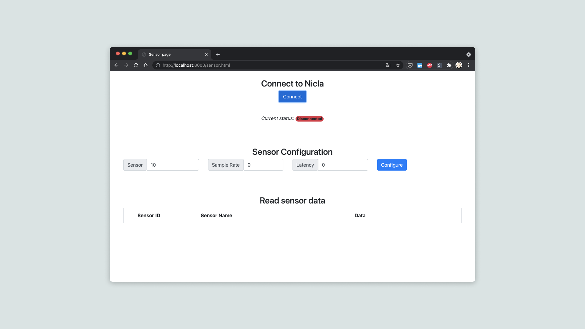

## Overview
It is possible to configure the Nicla Sense ME to communicate via Serial over USB or Bluetooth® Low Energy using a tool called **bhy-controller**. This is a CLI tool that can configure the sensors, get their readings and provide this information via a local webserver or display it in the command line interface.

## Goals

- How to install Go Lang
- How to set up the Nicla Sense ME
- How to use the bhy-controller tool to: configure and read the sensors through the terminal (CLI commands)
- How to use the bhy-controller tool to: run the webserver, configure and read the sensors on your internet browser

### Required Hardware and Software

- [Nicla Sense ME](https://store.arduino.cc/nicla-sense-me)
- Nicla Sense ME library (Arduino_BHY2)
- Micro USB-A cable (USB-A to Micro USB-A)
- Arduino IDE 1.8.10+  or Arduino Pro IDE 0.0.4+
- [Go Lang](https://golang.org/)
- BHY-CONTROLLER tool
- MKR Board (Only required for DFU)

***The bhy-controller tool can be downloaded from https://github.com/arduino/nicla-sense-me-fw, while the libraries can be obtained via library manager in the Arduino IDE / CLI.***

## Instructions

### Building the Bhy-Controller Tool Manually

Bhy-Controller is a tool which allows you to configure the Nicla Sense ME sensors through the terminal console and read their values. You will use the "Go" compiler to create the **bhy-controller** CLI tool.

First, please go to [Go's download page](https://golang.org/dl/) and follow the instructions depending on your OS. Then check that you have "go" in your environment variable **PATH**.You need the bhy-controller folder for the next step, it can be found [here](https://github.com/arduino/nicla-sense-me-fw). Remember where you extract this folder, you will need to navigate to it in the next step. Now open a terminal console and open the directory **tools/bhy-controller/src** and type `go build bhy.go`. After that you will see a new file called **bhy** (.exe if you are on Windows).


### Set up the Board

First, you need to download the library **Arduino_BHY2** in the Arduino IDE. Next, you need to upload the **App.ino** example sketch inside the library. This sketch can be found in: **Examples > Arduino_BHY2 > App**. Select the sketch and upload it to your board.

### Use the Bhy-Controller

Open your terminal console and open the directory **tools/bhy-controller/src** where you already built the bhy program tool(bhy.exe on windows).

Now, to use the tool, the basic **syntax** is introducing the name of the program, `bhy`, followed by the command you want to use, plus its arguments.

Once the board is set up and connected, you can verify it by using the command:

```arduino
bhy list
```

Where `bhy` is the program and `list` is the command. This command will print the list of devices connected to the serial ports. After checking that the program works and the Nicla is connected, you need to configure and start reading the sensors data. You have 2 options: using a Web App or the CLI.

### Running the Web App

When you run the Web application, you are going to connect through Bluetooth® to the Nicla Sense ME and you will configure the sensors inside the browser. This application is going to use WebBLE from your browser.

***For this feature to work, make sure that WebBLE is both supported and enabled! In Google Chrome go to [chrome://flags](chrome://flags) and enable "Experimental Web Platform features". [Check the browser list](https://developer.mozilla.org/en-US/docs/Web/API/Web_Bluetooth_API#browser_compatibility) to confirm that your browser has this feature.***

So let's run the app by going to the directory of the **bhy-controller** app and enter the next command:

```arduino
bhy webserver
```

This will start a local server hosted at [localhost:8000](localhost:8000)

Click the button "Open sensor page" and you will see:


To pair your Nicla Sense ME, first make sure you have uploaded the **App.ino** from the examples. Then click on the **connect** button; if the WebBLE is configured, a window will open that will ask you to allow/block the access to Bluetooth®. Now select the Nicla Sense ME device on the list; if the connection succeeded, the current status will change to **connected** and it will turn green.

Now you need to configure the sensors you want to get data from. Check the [Nicla Sense ME Cheat sheet sensor IDs](https://docs.arduino.cc/tutorials/nicla-sense-me/cheat-sheet#sensor-ids) for the ID number of the desired sensor.

To configure the sensor and get the data, enter the sensor ID, e.g Gyroscope is #10. Entering a sample rate that is greater than 0 will enable the sensor. Now press the **configure** button, it will be visible in the table below, as shown in the image.


### Configure a Sensor with CLI Commands

### Enable
You can set the rate and the latency of each sensor, please check the [Nicla Sense ME Cheat sheet sensor IDs](https://docs.arduino.cc/tutorials/nicla-sense-me/cheat-sheet#sensor-ids) to configure the right one.

The syntax for configuring a sensor is:

```bash
bhy sensor config -p <YourCOMPort> -sensor <SENSORID> -rate <RATE> -latency <LATENCY>
```

For example, if you want to configure the **Gyroscope passthrough** which has the sensor ID #**10** connected on the port `COM01` with a rate of 1Hz and a latency of 0ms, you will enter:

```bash
bhy sensor config -p /dev/ttyACM2 -sensor 10 -rate 1 -latency 0
```

Now it is configured to output the reading every second (1Hz).

### Disable
If you set the latency and rate to **0**, the sensor will be disabled and it will not output any data.

```bash
bhy sensor config -p <YourCOMPort> -sensor <SENSORID> -rate 0 -latency 0
```

### Read Data From a Sensor
If you want to read data from a sensor and print it once, you can use:

```bash
bhy sensor read -p <YourCOMPort>
```

To do it continuously, you can add the parameter `-live`

```bash
bhy sensor read -live -p <YourCOMPort>
```

## Using a Passthrough Board with CLI
When you have a firmware for the BHI module or a sketch for the MCU already compiled in a **.bin** file, you can upload them through a MKR or Portenta board directly using the terminal. You need to upload a passthrough sketch to the MKR or Portenta board, allowing the Nicla to communicate with the computer through the host board. The sketch can be found at **Examples > Arduino_BHY2Host > Passthrough**.

You then need to connect the Nicla board to the desired passthrough board either with an Eslov cable or you can mount the Nicla onto the board as a shield. If you wish to mount the Nicla as a shield, take a look at this [tutorial](./use-as-mkr-shield). Now that you have everything set up, you can use the commands below to upload the firmware or a sketch if they are in the right format.

### Upload a Sketch
Syntax for uploading a sketch:

```bash
bhy dfu -t nicla -bin <CompiledSketch.bin> -p <MKRBoardCOMPort>
```

### Updating the Firmware
Syntax for uploading the firmware:

```bash
bhy dfu -t bhi -bin <CompiledFirmware.bin> -p <MKRBoardCOMPort>
```


## Conclusion

This tutorial shows how to set up the board to communicate with both the **Web Application** and the **CLI**.

You also learned the commands to configure and get data from the board with the Web Application and the CLI. You also went through how to launch the Web Application from your terminal.
