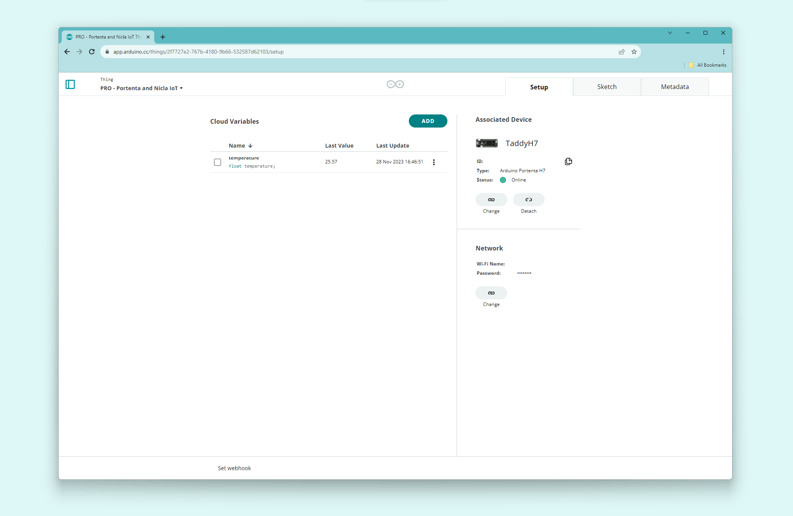
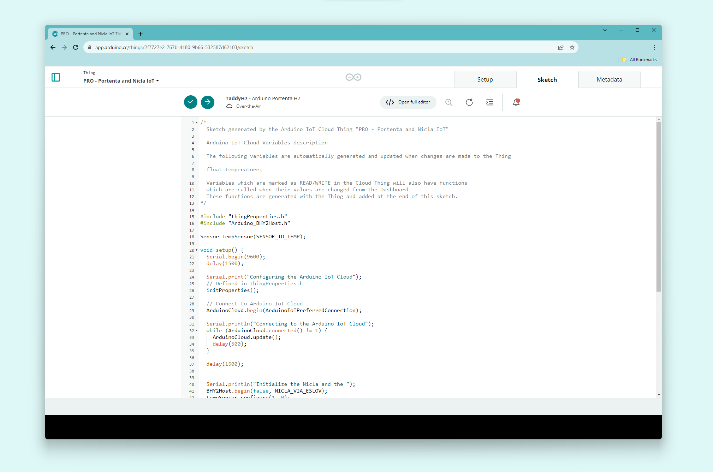

## Overview

In this tutorial you will learn how to upload data from the Nicla module to the IoT Cloud. You will use the **Portenta H7** to interface with the **Nicla Sense ME** using the ESLOV connector and upload the data using the Portenta Wireless capabilities.

## Goals

- How to configure the Portenta H7 to read temperature values from the Nicla Sense ME using the ESLOV connector.
- How to Connect the Portenta H7 to the Arduino Cloud
- Publish the temperature values that you obtained from the Nicla board to the Arduino Cloud.

### Required Hardware and Software

- [Portenta H7](https://store.arduino.cc/products/portenta-h7)
- [Nicla Sense ME](https://store.arduino.cc/products/nicla-sense-me)
- ESLOV cable (included with the Nicla Sense ME)
- USB-C® to USB-A / C depending on your hardware (Portenta H7)
- USB-A to micro USB-A (Nicla Sense ME)
- Wi-Fi Access point with access to the internet
- [Arduino Cloud](https://create.arduino.cc/) account

## Instructions

### Hardware Connection

For the hardware setup, just connect the Nicla board to the Portenta H7 using the ESLOV cable like in the illustration below. Then connect the Portenta H7 to your computer using an USB-C® cable.


### Setup Eslov Communication with the NICLA Board

There are three ways to read from the on-board sensors:

1. Read the sensors directly from Nicla Sense ME in standalone mode.
2. Read sensor values through Bluetooth® Low Energy
3. Read sensor values through UART by connecting an ESLOV cable.

For further tips on how to operate the Nicla module check the [cheat sheet](https://docs.arduino.cc/tutorials/nicla-sense-me/cheat-sheet#sensor-data-over-eslov).

### Client Board (Nicla Sense ME)

The **Nicla Sense ME** will be listening to the Host board to send back the required data, this is all automated via the libraries **Arduino_BHY2** and **Arduino_BHY2Host**

The code is available inside the examples provided with the **Arduino_BHY2** Library. Open it by going to **Examples > Arduino_BHY2 > App**.

This is the code, which initialize the sensors, and maintain the communication:

```cpp
/*
 * Use this sketch if you want to control nicla from
 * an external device acting as a host.
 * Here, nicla just reacts to external stimuli coming from
 * the eslov port or through Bluetooth® Low Energy
*/

#include "Arduino.h"
#include "Arduino_BHY2.h"

void setup(){
    BHY2.begin(NICLA_I2C, NICLA_VIA_ESLOV);
}

void loop(){
    // Update and then sleep X ms
    BHY2.update(100);
}
```

### Set up the Arduino Cloud

To configure the Arduino Cloud you can follow the tutorial [Getting Started with the Arduino Cloud](/arduino-cloud/getting-started/iot-cloud-getting-started).

Create a new Thing at <https://create.arduino.cc/iot/things>, you can call it "PRO - Portenta and Nicla". You will need to attach the Portenta H7 as a new device to your **Thing setup.** After that, go to **Variables**, click the **add** button and select a float variable called **temperature** to store the temperature readings.



***Remember to add your Wi-Fi SSID name and its password (you can do that inside the Thing setup tab) to be able to connect to the Arduino Cloud.***

### Host Board: Edit the Cloud Sketch

You can edit the sketch by clicking the **sketch tab** inside your **Thing page**. The sketch is automatically generated with enough code to upload it and connect it to the Cloud.

Before uploading, you should add the following code:

First include the headers that you need and declare the temperature sensor by adding the **temperature sensor ID**.

```cpp
#include "thingProperties.h"
#include "Arduino.h"
#include "Arduino_BHY2Host.h"

Sensor tempSensor(SENSOR_ID_TEMP);
```

***You can find all the Sensor IDs at <https://docs.arduino.cc/tutorials/nicla-sense-me/cheat-sheet#sensor-ids>.***

Inside `void setup()` initialize the `Serial` communication, set up the variables and configuration for the Arduino Cloud (properties) and wait until the **Portenta H7** is connected to the Wi-Fi and IoT Cloud. At this point, the communication with the **Nicla Sense ME** will be set up and you can start configuring the temperature sensor.

***Note: Now we are using "NICLA_VIA_ESLOV". In case you mount it as a shield use "NICLA_AS_SHIELD" as the second parameter of the `begin()` function, or "NICLA_VIA_BLE" if you use Bluetooth® Low Energy.***

```cpp
  void setup(){
    Serial.begin(9600);
    delay(1500);

    Serial.print("Configuring the Arduino Cloud");
    // Defined in thingProperties.h
    initProperties();

    // Connect to Arduino Cloud
    ArduinoCloud.begin(ArduinoIoTPreferredConnection);

    // Wait to be connected before initialize the communication with the Nicla Sense ME
    Serial.println("Connecting to the Arduino Cloud");
    while (ArduinoCloud.connected() != 1) {
      ArduinoCloud.update();
      delay(500);
    }

    delay(1500);

    Serial.println("Initialize the Nicla communication")
    BHY2Host.begin(false, NICLA_VIA_ESLOV);

    //If you want to connect the NICLA through Bluetooth® Low Energy use the following line instead of the above
    //while(!BHY2Host.begin(false, NICLA_VIA_BLE)) {}

    tempSensor.configure(1, 0);
    temperature = tempSensor.value();
  }
```

***If you use `yourSensor.begin()`, it will be configured the same as with `yourSensor.configure(1,0)`.***

If the Nicla Sense ME communicates through Bluetooth® Low Energy, we recommend wrapping `BHY2Host.begin(false, NICLA_VIA_BLE)` in a `while` clause to make sure the connection is established before the sketch continues.

Inside the `void loop()` function you will make the **Portenta H7**  get all the needed data from the **Nicla Sense ME**, store and print the temperature sensor value and update the data to the Arduino Cloud.

```cpp
void loop(){
  BHY2Host.update();
  temperature = tempSensor.value();

  Serial.print("Temperature: ");
  Serial.println(temperature);

  ArduinoCloud.update();
}
```

Upload the sketch from the **sketch tab** by clicking the second button at the top left side of the sketch bar.

Once it has been uploaded, you can see the temperature value just uploaded by going to your **Thing Setup** tab and looking at the last value of the **temperature** variable. You can also open the Serial Monitor to see your data live.



The Sketch:

```arduino
/*
  Sketch generated by the Arduino Cloud Thing "PRO - Portenta and Nicla IoT"

  Arduino Cloud Variables description

  The following variables are automatically generated and updated when changes are made to the Thing

  float temperature;

  Variables which are marked as READ/WRITE in the Cloud Thing will also have functions
  which are called when their values are changed from the Dashboard.
  These functions are generated with the Thing and added at the end of this sketch.
*/

#include "thingProperties.h"
#include "Arduino_BHY2Host.h"

Sensor tempSensor(SENSOR_ID_TEMP);

void setup() {
  Serial.begin(9600);
  delay(1500);

  Serial.print("Configuring the Arduino Cloud");
  // Defined in thingProperties.h
  initProperties();

  // Connect to Arduino Cloud
  ArduinoCloud.begin(ArduinoIoTPreferredConnection);

  Serial.println("Connecting to the Arduino Cloud");
  while (ArduinoCloud.connected() != 1) {
    ArduinoCloud.update();
    delay(500);
  }

  delay(1500);


  Serial.println("Initialize the Nicla and the ");
  BHY2Host.begin(false, NICLA_VIA_ESLOV);
  tempSensor.configure(1, 0);
  temperature = tempSensor.value();
}

void loop() {
  // Your code here
  BHY2Host.update();
  temperature = tempSensor.value();
  Serial.print("Value: ");
  Serial.println(temperature);
  ArduinoCloud.update();

}

/*
  Since temperature is READ_WRITE variable, onTemperatureChange() is
  executed every time a new value is received from IoT Cloud.
*/
void onTemperatureChange()  {
  // Add your code here to act upon temperature change
}

```

## Conclusion

In this tutorial you learned how to upload the temperature values from the Nicla Sense ME to the Arduino Cloud. You followed the process to set up the Nicla board in order to send data via ESLOV connection and you configured the Arduino Cloud to receive the temperature data.

### Next Steps

- Try to upload other sensor data from he Nicla Sense ME. You can see the available sensors in the [cheat sheet](https://docs.arduino.cc/tutorials/nicla-sense-me/cheat-sheet#sensor-data-over-eslov).
- Experiment with the dashboard to add more data for a more sophisticated project.

## Troubleshooting

### Arduino Cloud
If you encounter any issue in the process of using the Arduino Cloud, please visit the [Getting Started with Arduino Cloud](/arduino-cloud/getting-started/iot-cloud-getting-started)
