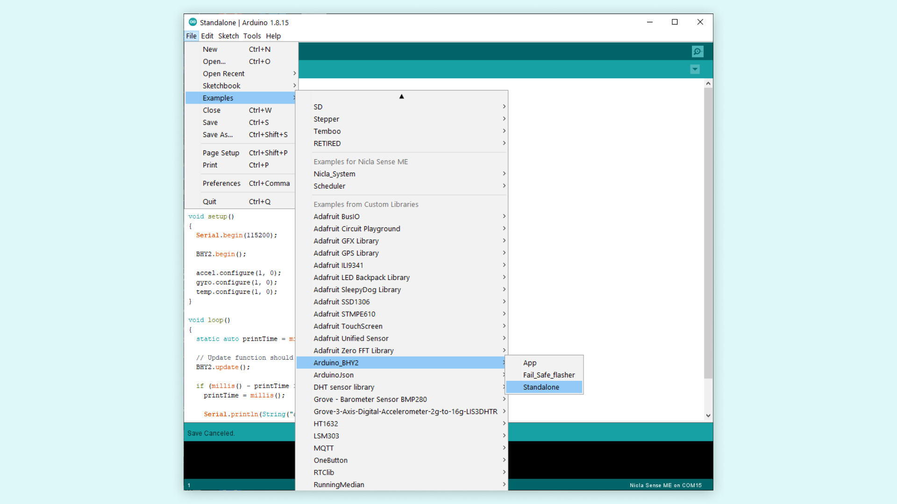
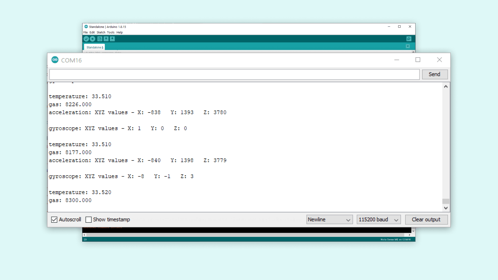

## Introduction 

This tutorial will show you how to get started with your Nicla Sense ME board and how it can be utilized by itself. It will showcase the board's IMU and other sensors to get readings which we can be easily displayed. We will go through a basic sketch for the Nicla Sense ME and see the potential of the board.

## Goals

The goals of this project are:

- Learn about the Nicla Sense ME
- Learn how to use the IMU on the Nicla Sense ME
- Learn how to set up the Nicla Sense ME with Arduino IDE

## Hardware & Software Needed

- [Nicla Sense ME](https://store.arduino.cc/products/nicla-sense-me)
- [Arduino IDE](https://create.arduino.cc/)
- Micro USB cable

## Sensors on the Nicla Sense ME

The Nicla Sense ME's BHI260AP sensor includes a 6-axis IMU, that we will use to give us accelerometer and gyroscope readings. An accelerometer is an electromechanical device used to measure acceleration forces. Such forces may be static, like the continuous force of gravity or, as is the case with many mobile devices, dynamic to sense movements or vibrations. On the other hand, a gyroscope sensor can measure and maintain the orientation and angular velocity of an object. Gyroscopes are more advanced than accelerometers, as they can measure the tilt and lateral orientation of an object, whereas an accelerometer can only measure its linear motion.

You can see the full list with all the needed information about the sensors [here](https://docs.arduino.cc/tutorials/nicla-sense-me/cheat-sheet#sensor-ids).

### Sensor Types

To access the Arduino Nicla Sense ME sensor's data, you will need to declare the type of sensor you want to use (they are called constructors), since they have different data functions that return data (e.g Accelerometer will have X, Y and Z values).

The **Arduino_BHY2** library contains these sensors:

#### Sensor

`value()` - Returns the data. For example, if you use the Temperature sensor, it will give you the Temperature reading.  
`toString()` - Prints the value(s) in a String. You can use it to print all the data into the Serial Monitor.  

**Syntax example**
```arduino
  #include "Arduino_BHY2.h"

  Sensor temperature(SENSOR_ID_TEMP);
  float temperatureValue = 0;

  void setup(){
    Serial.begin(115200);
    BHY2.begin();
    temperature.begin();
  }

  void loop(){
    BHY2.update();
    temperatureValue = temperature.value();

    Serial.print("Temperature :");
    Serial.println(temperatureValue);
  }
```
  
***All of the following Sensor types also have the Sensor functions `value()` and `toString()`.***

#### SensorXYZ

`x()` - gives X-axis  
`y()` - gives Y-axis  
`z()` - gives Z-axis  

**Syntax example**
```arduino
  #include "Arduino_BHY2.h"

  SensorXYZ gyroscope(SENSOR_ID_GYRO);
  int16_t valueX;
  int16_t valueY;
  int16_t valueZ;

  void setup(){
    Serial.begin(115200);
    BHY2.begin();
    gyroscope.begin();
  }

  void loop(){
    BHY2.update();
    valueX = gyroscope.x();
    valueY = gyroscope.y();
    valueZ = gyroscope.z();

    Serial.println(gyroscope.toString()); //Prints all the data "automatically"

    //Print the individual values
    Serial.println(valueX);
  }
```

#### SensorOrientation

`heading()` - returns Z-axis rotation  
`pitch()` - returns X-axis rotation  
`roll()` - returns Y-axies rotation  

**Syntax example**
```arduino
  #include "Arduino_BHY2.h"

  Sensor device_orientation(SENSOR_ID_DEVICE_ORI);
  SensorOrientation orientation(SENSOR_ID_ORI);  
  
  void setup(){
    Serial.begin(115200);
    BHY2.begin();
    orientation.begin();
  }

  void loop(){
    BHY2.update();
    
    Serial.print("orientation pitch :");
    Serial.println(orientation.pitch());
    delay(500);
  }
```

#### SensorQuaternion

`x()` - gives X quaternion (0-1 signed float)  
`y()` - gives Y quaternion (0-1 signed float)  
`z()` - gives Z quaternion (0-1 signed float)  
`w()` - gives W quaternion (0-1 signed float)  

**Syntax example**
```arduino
  #include "Arduino_BHY2.h"

  SensorQuaternion quaternion(SENSOR_ID_RV);

  void setup(){
    Serial.begin(115200);
    BHY2.begin();
    quaternion.begin();
  }

  void loop(){
    BHY2.update();
    
    Serial.print("quaternion w :");
    Serial.println(quaternion.w());
    delay(500);
  }
```

#### SensorActivity

`getActivity()` - gives you a string with the current activity.

This are the activities:

* 0: "Still activity ended"
* 1: "Walking activity ended"
* 2: "Running activity ended"
* 3: "On bicycle activity ended"
* 4: "In vehicle activity ended"
* 5: "Tilting activity ended"
* 6: "In vehicle still ended"
* 7: **blank**
* 8: "Still activity started"
* 9: "Walking activity started"
* 10: "Running activity started"
* 11: "On bicycle activity started"
* 12: "IN vehicle activity started"
* 13: "Tilting activity started"
* 14: "In vehicle still started"
* 15: **blank**

**Syntax example**

```arduino
  #include "Arduino_BHY2.h"

  SensorActivity activity(SENSOR_ID_AR);

  void setup(){
    Serial.begin(115200);
    BHY2.begin();
    activity.begin();
  }

  void loop(){
    BHY2.update();

    Serial.print("Activity status: ");
    Serial.println(activity.getActivity());
    delay(500);
  }
```

The Nicla Sense ME also has an environmental sensor (i.e. BME688). We will use this in the sketch to get temperature and gas readings. This sensor is also capable of reading humidity, pressure and volatile organic compound, making this board ideal for environmental monitoring especially in and around sensitive electronic equipment.

Next, we will go through a sketch that allows us to see the readings from the sensors.

## Instructions

### Arduino IDE and Nicla Core

Start the Arduino IDE and install the **nicla_mbed** core. If you need help with installing the core for the Nicla Sense ME, please refer to this [guide](/software/ide-v1/tutorials/getting-started/cores/arduino-mbed_nicla).

Now you need to add the **Arduino_BHY2** library that contains the example sketch that you want. You can do this through the library manager in the Arduino IDE. After the library is installed, you can access the example sketch directly through the IDE. You can find the sketch in **File > Examples > Arduino_BHY2 > Standalone**. At this point you can plug in your Nicla Sense ME and upload the sketch.



Next we will go through parts of the sketch and explain them.

### Programming the Board

With this sketch you can get readings from the Nicla Sense ME's sensors. It includes accelerometer, gyroscope and temperature readings. This simple sketch will show how to get these readings.

In the setup part of the sketch you first use:

```arduino
  #include "Arduino_BHY2.h"
  
  SensorXYZ accel(SENSOR_ID_ACC);
  SensorXYZ gyro(SENSOR_ID_GYRO);
  Sensor temp(SENSOR_ID_TEMP);
  Sensor gas(SENSOR_ID_GAS);
```
This defines the sensors that you will use later in the sketch. Give your sensors the `accel`, `gyro`, `temp` and `gas` sensor class names.

You can then use these variable names when needed in the sketch. The next thing to do is to enable the sensors. You can do that with this code that sets the sensors rate and a latency:

```arduino
  accel.begin();
  gyro.begin();
  temp.begin();
  gas.begin();
```

The library lets you activate the sensors with a simple call of the `begin()` function, automatically setting the rate and latency of the sensor.

To print the readings in the Serial Monitor, you can use the following code, converting the readings into strings. You can limit the output of temperature and gas values to 4 digits so that they do not clutter the Serial Monitor.

```arduino
  Serial.println(String("acceleration: ") + accel.toString());
  Serial.println(String("gyroscope: ") + gyro.toString());
  Serial.println(String("temperature: ") + String(temp.value(),3));
  Serial.println(String("gas: ") + String(gas.value(),3));
```

### Running the Sketch

After you have uploaded the sketch to the board, open the Serial Monitor in the Arduino IDE. You should see similar outputs to the ones shown in the image below. Make sure that the baud rate on your serial monitor is set to **115200**.




## Next Step
In this sketch you only get the readings of the sensor. A good next step could be to use these readings as parameters to trigger different reactions on the board, for example on the board LED. Please take a look at our [cheat sheet](/tutorials/nicla-sense-me/cheat-sheet) if you want quick references for the boards features. Test other tutorials we have for the [Nicla Sense ME](https://docs.arduino.cc/hardware/nicla-sense-me#tutorials) to discover more about this board.

## Conclusion

In this tutorial you learned how to use the Nicla Sense ME on its own, getting multiple readings from its sensors, and how to print the readings in the Serial Monitor for easy viewing.
