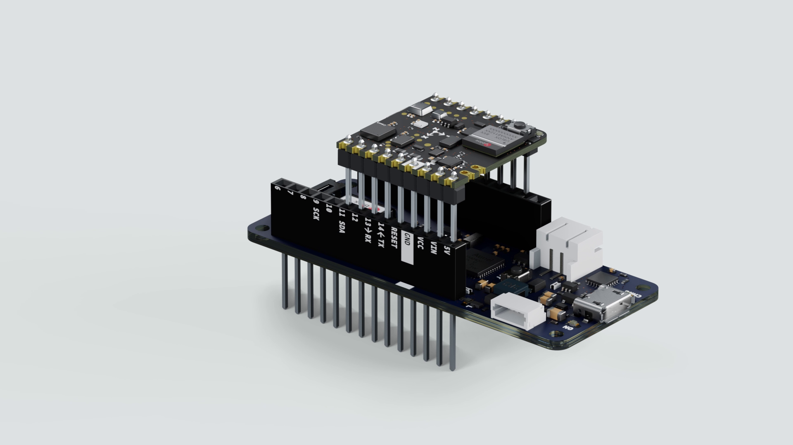

## Overview



The form factor of the Nicla Sense allows the board to be used as a MKR shield. In this tutorial, we will walk you through converting the Nicla Sense Board into a shield to extend some of the functionalities of the MKR boards, using the I<sup>2</sup>C communications, and explain how this communication functions through an example sketch. 

## Goals.

-   How to solder the headers on the Nicla Sense ME
-   How to establish an I<sup>2</sup>C communication between the MKR WiFi 1010 and the Nicla Sense  

### Required Hardware and Software

- Arduino IDE 1.8.10+  or Arduino Pro IDE 0.0.4+
- [MKR WiFi 1010](https://store.arduino.cc/arduino-mkr-wifi-1010)
- [Nicla Sense ME](https://store.arduino.cc/products/nicla-sense-me)
- 1x USB A Cable to Micro USB
- 2x row of Male Headers (1x9 1x8)
- Soldering tool and Stain.
- Libraries to be downloaded from the Library Manager


***The following sketches can be found inside the Arduino_BHY2 and Arduino_BHY2Host libraries, available in the Library Manager. You will need to add the changes shown in this tutorial***

## Instructions

### 1. The Setup
You will need the latest version of the mbed_portenta core to be able to install the needed drivers for the Nicla Sense ME (minimum v2.5.2). Install the **Arduino_BHY2** and **Arduino_BHY2Host** libraries from the Library Manager.

To convert the Nicla Sense ME into a Shield, you will have to **solder** 2 rows of **headers**: one side has 9 pins and the other 8 pins, the long side of the headers needs to be on the **battery connectors side**.

<iframe width="100%" height="415" src="https://www.youtube.com/embed/3XwwYb5yFLk" title="YouTube video player" frameborder="0" allow="accelerometer; autoplay; clipboard-write; encrypted-media; gyroscope; picture-in-picture" allowfullscreen></iframe>

Once the headers are soldered, you can plug the Nicla on top of the MKR, having the Nicla Sense ME LED and Reset button pointing upwards. Additionally, to further confirm the correct positioning, the white silk outline in the GND pin of the Nicla Sense ME needs to be aligned with the MKR GND pin. Have a look at the video to figure out the correct orientation of the board.


***This set-up works with the ESLOV cable as well. Keep in mind female headers or raw cables can be used as well, but make sure the connections of the pinout match with the MKR pinout (3V3, GND, SCL and SDA).***

### 2. Structure of the Communication
The host (MKR WiFi 1010) will communicate through the **BHY2Host** library with the **Nicla Sense ME** (both devices communicate over I<sup>2</sup>C).

### 3. Host Communication of the MKR WiFi 1010

To make the host communicate with the Nicla Sense ME mounted as a shield, you can modify one of the existing examples. Open the sketch under **Examples > Arduino_BHY2Host > Accelerometer** and modify the `setup` function.

Add the following parameters to `BHY2Host.begin()`: `BHY2Host.begin(false, NICLA_AS_SHIELD);`

The first parameter defines if the data should be passed through the Serial connection. This allows to control the Nicla Sense ME from a PC when connected through a host board. You can use the `arduino-bhy` tool to control the Nicla Sense ME from either the PC command line or from a webpage.

Full sketch:

```arduino
#include "Arduino.h"
#include "Arduino_BHY2Host.h"

SensorXYZ accel(SENSOR_ID_ACC);

void setup()
{
  // debug port
  Serial.begin(115200);
  while(!Serial);

  BHY2Host.begin(false, NICLA_AS_SHIELD);

  accel.begin();
}

void loop()
{
  static auto printTime = millis();
  BHY2Host.update();

  if (millis() - printTime >= 1000) {
    printTime = millis();
    Serial.println(String("Acceleration values: ") + accel.toString());
  }
}
```

### 4. Program the Nicla Sense ME

Program the Nicla Sense ME with the **App.ino** sketch from the **BHY2** library. You can find it under **Examples > Arduino_BHY2 > App** . Modify it as follows:


Navigate to the `setup` function and add two parameters to `BHY2.begin()`


```arduino
  BHY2.begin(NICLA_I2C, NICLA_AS_SHIELD);
```

***You may use `NICLA_I2C`, `NICLA_BLE`, `NICLA_BLE_AND_I2C` as first parameter, and as second one `NICLA_VIA_ESLOV` or `NICLA_AS_SHIELD`. Remember to use the corresponding settings on the HOST board.***


These settings will internally adjust the communication parameters, so it can communicate through the headers.


***We suggest to unplug the Nicla Sense ME from the host Arduino board while connecting the USB to the computer.***

Full sketch:

```arduino
#include "Arduino.h"
#include "Arduino_BHY2.h"

// Set DEBUG to true in order to enable debug print
#define DEBUG false

void setup(){
#if DEBUG
  Serial.begin(115200);
  BHY2.debug(Serial);
#endif

  BHY2.begin(NICLA_I2C, NICLA_AS_SHIELD);
}

void loop(){
  // Update and then sleep
  BHY2.update(100);
}
```


## Conclusion
This tutorial shows how easy is to access the Nicla Sense ME sensors data and pins if it is plugged as a shield.

The BHY2 Library encapsulates the I2C communication and therefore reduces the complexity of your sketch.


## Troubleshooting
Make sure you have installed the latest version of both libraries Arduino_BHY2 and Arduino_BHY2Host.


If you do not see any output on the Serial Monitor, make sure you have set the correct baud rate. In this example sketch we use 115200.


Make sure the pins are soldered on the correct side and the Nicla Sense ME is mounted with the correct orientation on the host board.


### Next Steps

Leverage the Arduino Cloud dashboard to select which sensor you want to use and initialize, so you can remotely control your application.
