## Overview

This user manual will guide you through a practical journey covering the most interesting features of the Arduino Nicla Sense ME. With this user manual, you will learn how to set up, configure and use this Arduino board.

## Hardware and Software Requirements
### Hardware Requirements

- [Nicla Sense ME](https://store.arduino.cc/products/nicla-sense-me) (x1)
- Micro USB cable (x1)

### Software Requirements

- [Arduino IDE 1.8.10+](https://www.arduino.cc/en/software), [Arduino IDE 2.0+](https://www.arduino.cc/en/software), or [Arduino Cloud Editor](https://create.arduino.cc/editor)
- To create custom Machine Learning models, the Machine Learning Tools add-on integrated into the [Arduino Cloud](https://create.arduino.cc/iot/) is needed. In case you do not have an Arduino Cloud account, you will need to create one first.

## Product Overview

The Arduino® Nicla Sense ME is one of the most compact designs of the Arduino portfolio, housing an array of high-quality industrial-grade sensors in a remarkably small package. This versatile device allows you to accurately monitor essential process parameters like temperature, humidity, and motion, and share data through Bluetooth® Low Energy connectivity, enabling endless low-power smart sensing applications.

### Board Architecture Overview

The Nicla Sense ME features a robust and efficient architecture that integrates a range of sensors packed into a tiny footprint. It features four industrial grade Bosch sensors that can accurately measure rotation, acceleration, pressure, humidity, temperature, air quality and CO2 levels.


Here is an overview of main components of the board, as shown in the images above:

- **Microcontroller**: at the heart of the Nicla Sense ME is the nRF52832, a powerful and versatile System-on-Chip (SoC) from Nordic® Semiconductor. The nRF52832 is built around a 32-bit Arm® Cortex®-M4 processor running at 64 MHz.
- **Onboard advanced motion sensors**: the board features the BHI260AP, a smart IMU that includes a 3-axis accelerometer and a 3-axis gyroscope. It is trained with Machine Learning algorithms able to perform step counting, position tracking, and activity recognition. The board also features the BMM150, a compact geomagnetic sensor from Bosch® Sensortec including a 3-axis magnetometer.
- **Onboard environment sensors**: the Nicla Sense ME is equipped with the BME688, this is the first gas sensor with Artificial Intelligence (AI) and integrated high-linearity and high-accuracy pressure, humidity and temperature sensors. The gas sensor can detect Volatile Organic Compounds (VOCs), volatile sulfur compounds (VSCs) and other gases, such as carbon monoxide and hydrogen, in the part per billion (ppb) range.
- **Wireless connectivity**: the board supports Bluetooth® Low Energy connectivity, provided by the ANNA-B112 module developed by u-blox®. This compact, high-performance Bluetooth® Low Energy module allows the Nicla Sense ME to communicate wirelessly with other devices and systems.
- **Power management**: the Nicla Sense ME is designed for ultra-low power operations, with efficient power management features that ensure minimal energy consumption even when using always-on motion recognition and environment analysis sensors. The Nicla Sense ME features the BQ25120 from Texas Instruments®, a highly integrated battery charge management integrated circuit (IC) designed for wearables and Internet of Things (IoT) devices.

### Board Core and Libraries

The **Arduino Mbed OS Nicla Boards** core contains the libraries and examples you need to work with the board's components, such as its IMU, magnetometer, and environment sensor. To install the Nicla boards core, navigate to **Tools > Board > Boards Manager** or click the Boards Manager icon in the left tab of the IDE. In the Boards Manager tab, search for `Nicla Sense ME` and install the latest `Arduino Mbed OS Nicla Boards` version.


### Pinout


The full pinout is available and downloadable as PDF from the link below:

- [Nicla Sense ME pinout](https://docs.arduino.cc/resources/pinouts/ABX00050-full-pinout.pdf)

### Datasheet

The complete datasheet is available and downloadable as PDF from the link below:

- [Nicla Sense ME datasheet](https://docs.arduino.cc/resources/datasheets/ABX00050-datasheet.pdf)

### Schematics

The complete schematics are available and downloadable as PDF from the link below:

- [Nicla Sense ME schematics](https://docs.arduino.cc/resources/schematics/ABX00050-schematics.pdf)

### STEP Files

The complete STEP files are available and downloadable from the link below:

- [Nicla Sense ME STEP files](../../downloads/ABX00050-step.zip)


## First Use
### Powering the Board

The Nicla Sense ME can be powered by:

- A Micro USB cable (not included).
- An external **5V power supply** connected to `VIN_BQ25120` pin (please, refer to the [board pinout section](#pinout) of the user manual).
- A **3.7V Lithium Polymer (Li-Po) battery** connected to the board through the onboard battery connector; the manufacturer part number of the battery connector is BM03B-ACHSS and its matching receptacle manufacturer part number is ACHR-03V-S. The **recommended minimum battery capacity for the Nicla Sense ME is 200 mAh**. A Li-Po battery with an integrated NTC thermistor is also recommended for thermal protection.
- The onboard **ESLOV connector**, which has a dedicated 5V power line.


### Hello World Example

Let's program the Nicla Sense ME with the classic `hello world` example typical of the Arduino ecosystem: the `Blink` sketch. We will use this example to verify that the board is correctly connected to the Arduino IDE and that the Nicla Sense ME core and the board itself are working as expected.

Copy and paste the code below into a new sketch in the Arduino IDE.

```arduino
#include "Nicla_System.h"

void setup() {
  // Initialize LED_BUILTIN as an output (this will turn on the LED)
  pinMode(LED_BUILTIN, OUTPUT);
}

void loop() {
  // Turn the built-in LED off
  digitalWrite(LED_BUILTIN, HIGH);
  delay(1000);
  // Turn the built-in LED on
  digitalWrite(LED_BUILTIN, LOW);
  delay(1000);
}
```

For the Nicla Sense ME, the `LED_BUILTIN` macro represents **all the LEDs** of the built-in RGB LED of the board, shining in **white**.

To upload the code to the Nicla Sense ME, click the **Verify** button to compile the sketch and check for errors; then click the **Upload** button to program the board with the sketch.

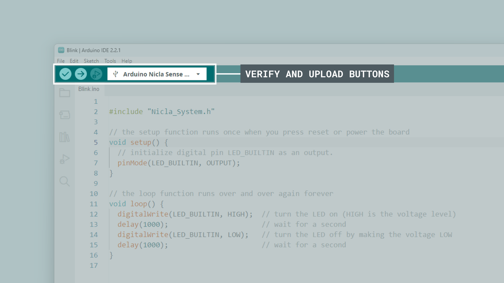

You should now see all the LEDs of the built-in RGB LED turn on for one second, then off for one second, repeatedly.


### Battery Charging

One of the characteristic features of the Nicla Sense ME is power management, the BQ25120 battery charger IC is configurable by the user, which means that its charging parameters can be customized by software. We listed the main ones below:

- **Enable charging:** If you are powering the board with a rechargeable battery, you may want it to be recharged, the IC lets you enable the charging function by calling `nicla::enableCharging()`.

- **Battery charging current:** A safe default charging current value that works for most common LiPo batteries is 0.5C, which means charging at a rate equal to half of the battery's capacity. For example, a 200mAh battery could be charged at 100mA (0.1A).

  The desired current must be set as the parameter of the enabling function:
    `nicla::enableCharging(100)`.

  When the function parameter is left blank, the default current is 20mA.

- **Battery NTC:** If your battery has an NTC to measure its temperature, you can enable it by calling this function: `nicla::setBatteryNTCEnabled(true)`, if not, set the argument to *false*.

- **Battery maximum charging time:** To get an estimation of the charging time, you can use the following formula:

  `Charging time (in hours) = (Battery capacity in mAh) / (0.8 * Charging current in mA)`

  This formula takes into account that the charging process is approximately 80% efficient (hence the 0.8 factor). This is just a rough estimate, and actual charging time may vary depending on factors like the charger, battery quality, and charging conditions.

  To set a charging time of nine hours, define it as follows:

  `nicla::configureChargingSafetyTimer (ChargingSafetyTimerOption::NineHours)`

- **Get the battery voltage:** To monitor the battery voltage you just need to store the returned value of the following function in a *float* variable:

  `float currentVoltage = nicla::getCurrentBatteryVoltage();`

- **Get the power IC operating status:** In order to know if the battery is fully charged, charging, or presents any error, you can check its status using this code block:

```arduino
auto operatingStatus = nicla::getOperatingStatus();

    switch(operatingStatus) {
      case OperatingStatus::Charging:
      nicla::leds.setColor(255,100,0); // Yellow
        break;
      case OperatingStatus::ChargingComplete:
        nicla::leds.setColor(green);

        // This will stop further charging until enableCharging() is called again.
        nicla::disableCharging();
        break;
      case OperatingStatus::Error:
        nicla::leds.setColor(red);
        break;
      case OperatingStatus::Ready:
        nicla::leds.setColor(blue);
        break;
      default:
        nicla::leds.setColor(off);
        break;
    }
```

To extend your knowledge on this topic, refer to the board examples by navigating to "**File > Examples > Nicla_Sense_System**", and choose between both examples:

- `NiclaSenseME_BatteryStatus`
- `NiclaSenseME_BatteryChargingSimple`

## Pins
### Analog Pins

The Nicla Sense ME has **two analog input pins**, mapped as follows:

| **Microcontroller Pin** | **Arduino Pin Mapping** |
|:-----------------------:|:-----------------------:|
|      ADC1/P0_02     |           A0          |
|      ADC2/P0_30     |           A1          |

Both pins can be used through the built-in functions of the Arduino programming language.

Nicla boards ADC can be configured to 8, 10 or 12 bits defining the argument of the following function respectively (default is 10 bits):

```arduino
analogReadResolution(12);  // ADC resolution set to 12 bits (0-4095)
```

***The Nicla boards ADC reference voltage is fixed to 1.8V, this means that it will map the ADC range from 0 to 1.8 volts.***

The example code shown below reads the analog input value from a potentiometer connected to `A0` and displays it on the IDE Serial Monitor. To understand how to properly connect a potentiometer to the Nicla Sense ME pins, take the following image as a reference:


```arduino
#include "Nicla_System.h"

int sensorPin = A0;   // select the input pin for the potentiometer
int sensorValue = 0;  // variable to store the value coming from the sensor

void setup() {

  analogReadResolution(12); // ADC bits configuration
  nicla::begin();           // Nicla peripherals initialization, this enables the VDDIO_EXT 3.3V output.
  Serial.begin(115200);     // Serial initialization
}

void loop() {
  // read the value from the sensor:
  sensorValue = analogRead(sensorPin);
  // print the value
  Serial.println(sensorValue);
  delay(1000);
}
```

***The ADC inputs support 3.3V even when the ADC reference is 1.8V. In this perspective, the ADC will not sense any change from 1.8V and above.***

### Digital Pins

The Nicla Sense ME has **twelve digital pins**, mapped as follows:

| **Microcontroller Pin** | **Arduino Pin Mapping** |
|:-----------------------:|:-----------------------:|
|         P0_10         |           0           |
|         P0_09         |           1           |
|         P0_20         |           2           |
|         P0_23         |           3           |
|         P0_22         |           4           |
|         P0_24         |           5           |
|         P0_29         |           6           |
|         P0_27         |           7           |
|         P0_28         |           8           |
|         P0_11         |           9           |
|         P0_02         |           A0          |
|         P0_30         |           A1          |

Notice that analog pins `A0` and `A1` (`P0_02` and `P0_30`) can also be used as digital pins. Please, refer to the [board pinout section](#pinout) of the user manual to check their location.

The digital pins of the Nicla Sense ME can be used as inputs or outputs through the built-in functions of the Arduino programming language.

***The Nicla Sense ME digital I/O's are low power, so to drive output devices like LEDs, resistive loads, buzzers, etc, it is recommended to use a MOSFET driver or a buffer to guarantee the required current flow. Learn more about the Nicla I/O's considerations [here](https://docs.arduino.cc/learn/hardware/nicla-form-factor).***

The configuration of a digital pin is done in the `setup()` function with the built-in function `pinMode()` as shown below:

```arduino
// Pin configured as an input
pinMode(pin, INPUT);

// Pin configured as an output
pinMode(pin, OUTPUT);

// Pin configured as an input, internal pull-up resistor enabled
pinMode(pin, INPUT_PULLUP);
```

The state of a digital pin, configured as an input, can be read using the built-in function `digitalRead()` as shown below:

```arduino
// Read pin state, store value in a state variable
state = digitalRead(pin);
```

The state of a digital pin, configured as an output, can be changed using the built-in function `digitalWrite()` as shown below:

```arduino
// Set pin on
digitalWrite(pin, HIGH);

// Set pin off
digitalWrite(pin, LOW);
```

The example code shown below uses digital pin `3` to control an LED and reads the state of a button connected to digital pin `2`:

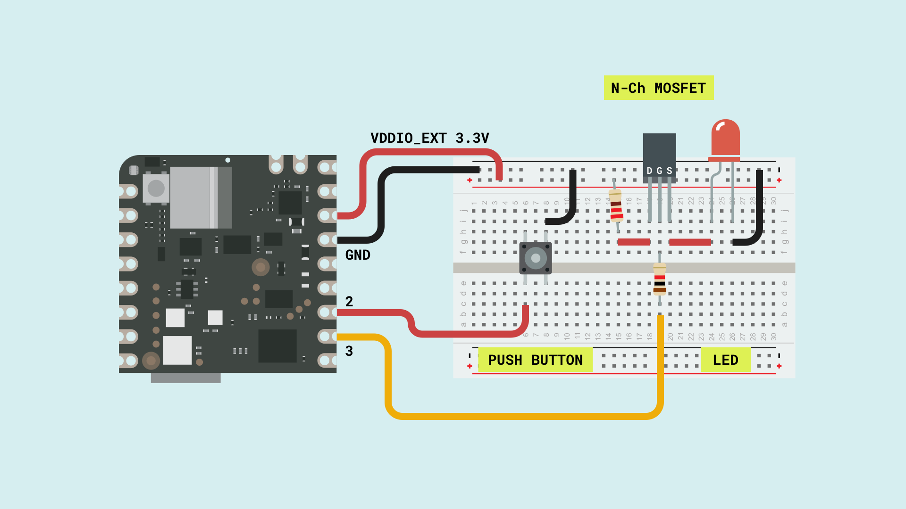

```arduino
// Define button and LED pin
int buttonPin = 2;
int ledPin = 3;

// Variable to store the button state
int buttonState = 0;

void setup() {
  // Configure button and LED pins
  pinMode(buttonPin, INPUT_PULLUP);
  pinMode(ledPin, OUTPUT);

  // Initialize Serial communication
  Serial.begin(115200);
}

void loop() {
  // Read the state of the button
  buttonState = digitalRead(buttonPin);

  // If the button is pressed, turn on the LED and print its state to the Serial Monitor
  if (buttonState == LOW) {
    digitalWrite(ledPin, HIGH);
    Serial.println("- Button is pressed. LED is on.");
  } else {
    // If the button is not pressed, turn off the LED and print to the Serial Monitor
    digitalWrite(ledPin, LOW);
    Serial.println("- Button is not pressed. LED is off.");
  }

  // Wait for 1000 milliseconds
  delay(1000);
}
```

### PWM Pins

Most digital and analog pins of the Nicla Sense ME can be used as PWM (Pulse Width Modulation) pins. This functionality can be used with the built-in function `analogWrite()` as shown below:

```arduino
analogWrite(pin, value);
```
By default, the output resolution is 8 bits, so the output value should be between 0 and 255. To set a greater resolution, do it using the built-in function `analogWriteResolution` as shown below:

```arduino
analogWriteResolution(bits);
```

Using this function has some limitations, for example, the PWM signal frequency is fixed at 500 Hz, and this could not be ideal for every application.


If you need to work with a higher frequency PWM signal, you must do it by working with the PWM peripheral at a lower level as shown in the example code below:

```arduino
#include "nrfx_pwm.h"

static nrfx_pwm_t pwm1 = NRFX_PWM_INSTANCE(0);

static uint16_t /*const*/ seq1_values[] = {0};

static nrf_pwm_sequence_t seq1 = {
  .values = { .p_common = seq1_values },
  .length = NRF_PWM_VALUES_LENGTH(seq1_values),
  .repeats = 0,
  .end_delay = 0
};

void setup() {

  nrfx_pwm_config_t config1 = {
    .output_pins = {
      32 + 23,  // Nicla Sense ME pin 3  = pin P0_23 in the ANNAB112 MCU
    },
    .irq_priority = APP_IRQ_PRIORITY_LOWEST,
    .base_clock = NRF_PWM_CLK_1MHz,   // 1 us period
    .count_mode = NRF_PWM_MODE_UP,
    .top_value = 1000,                //  PWM counter limit, this will set the final output frequency 1MHz / 1000 = 1KHz
    .load_mode = NRF_PWM_LOAD_COMMON,
    .step_mode = NRF_PWM_STEP_AUTO,
  };

  nrfx_pwm_init(&pwm1, &config1, NULL);

  (*seq1_values) = 500;   // this variable sets the signal duty cycle, for a 50% we are using 500. (1000 / 500  = 1/2)
  (void)nrfx_pwm_simple_playback(&pwm1, &seq1, 1, NRFX_PWM_FLAG_LOOP);
}

void loop() {

}

```

The code above results in a 1KHz square waveform with a 50% duty cycle as in the image below. The frequency is defined by the `.base_clock` and `.top_value` variables, and the duty cycle by the `seq1_values` variable.


## Onboard Sensors

The Nicla Sense ME boards come with various onboard sensors that allow you to capture and process environmental and motion data via a 6-axis IMU, a 3-axis magnetometer and a gas, temperature, humidity and pressure sensor. The onboard sensors can be used for developing various applications, such as activity recognition, and environmental monitoring.

To read from any of these sensors you need to install the Arduino_BHY2 and Arduino_BHY2Host libraries. These can be found in the Arduino IDE library manager. To do so in the IDE, select it from the left side menu, now search for Arduino_BHY and click on the install button.


### IMU

The Nicla Sense ME features an advanced IMU, which allows the board to sense motion. The IMU on the board is the BHI260AP from Bosch®. It consists of a 3-axis accelerometer and a 3-axis gyroscope. They can provide information about the board's motion, orientation, and rotation in a 3D space. The BHI260AP, apart from being able to do raw movement measurements, is equipped with pre-trained machine-learning models that recognize activities right out of the box.


The example code below shows how to get acceleration and angular velocity data from the onboard IMU and stream it to the Arduino IDE Serial Monitor and Serial Plotter.

```arduino

#include "Arduino.h"
#include "Arduino_BHY2.h"

SensorXYZ accel(SENSOR_ID_ACC);
SensorXYZ gyro(SENSOR_ID_GYRO);


void setup() {
  Serial.begin(115200);
  while (!Serial)
    ;

  BHY2.begin();

  accel.begin();
  gyro.begin();
}

void loop() {
  static auto printTime = millis();

  // Update function should be continuously polled
  BHY2.update();

  if (millis() - printTime >= 50) {
    printTime = millis();

    // Accelerometer values
    Serial.print("acc_X:");
    Serial.print(accel.x());
    Serial.print(",");
    Serial.print("acc_Y:");
    Serial.print(accel.y());
    Serial.print(",");
    Serial.print("acc_Z:");
    Serial.print(accel.z());
    Serial.print(",");

    // Gyroscope values
    Serial.print("gyro_X:");
    Serial.print(gyro.x());
    Serial.print(",");
    Serial.print("gyro_Y:");
    Serial.print(gyro.y());
    Serial.print(",");
    Serial.print("gyro_Z:");
    Serial.println(gyro.z());
  }
}
```


To take advantage of the IMU pre-trained ML capabilities, we can use the *Activity Recognition* class. The following example code enables your Nicla Sense ME to classify movements from different daily activities:

- Standing still
- Walking
- Running
- On bicycle
- In vehicle
- Tilting
- In vehicle still


```arduino
#include "Nicla_System.h"
#include "Arduino_BHY2.h"

SensorActivity active(SENSOR_ID_AR);

unsigned long previousMillis = 0;  // will store last time the sensor was updated

const long interval = 1000;

void setup() {

  Serial.begin(115200);
  nicla::begin();
  BHY2.begin(NICLA_I2C);
  active.begin();
}

void loop() {

  BHY2.update();

  unsigned long currentMillis = millis();

  if (currentMillis - previousMillis >= interval) {

    previousMillis = currentMillis;
    Serial.println(String("Activity info: ") + active.toString());

  }

}
```

### Magnetometer

The Nicla Sense ME is equipped with an onboard magnetometer, which allows the board to sense orientation and magnetic fields. The BMM150 enables measurements of the magnetic field in three perpendicular axes. Based on Bosch’s proprietary FlipCore technology, the performance and features of BMM150 are carefully tuned to perfectly match the demanding requirements of 3-axis mobile applications such as electronic compass, navigation, or augmented reality.


In the example code below, the magnetometer is used as a compass measuring the heading orientation in degrees.

```arduino

#include "Nicla_System.h"
#include "Arduino_BHY2.h"
#include "Math.h"

SensorXYZ magnetometer(SENSOR_ID_MAG);

float heading = 0;

unsigned long previousMillis = 0;  // will store last time the sensor was updated

const long interval = 1000;

void setup() {

  Serial.begin(115200);
  nicla::begin();
  BHY2.begin(NICLA_I2C);
  magnetometer.begin();

}

void loop() {
  BHY2.update();

  unsigned long currentMillis = millis();

  if (currentMillis - previousMillis >= interval) {

    previousMillis = currentMillis;

    heading = round(atan2(magnetometer.x(), magnetometer.y()) * 180.0 / PI);
    Serial.println(String(heading) + "º");
  }
}

```


### Environmental Sensor

The Arduino Nicla Sense ME can perform environmental monitoring via the Bosch BME688 sensor. This enables pressure, humidity, temperature as well as gas detection. The gas sensor can detect Volatile Organic Compounds (VOCs), volatile sulfur compounds (VSCs), and other gases, such as carbon monoxide and hydrogen, in the part per billion (ppb) range.


The BME688 lets you measure pressure, humidity, temperature, and gas sensor resistance, thanks to a proprietary solution from Bosch called BSEC. In addition, the system is capable of providing numerous useful outputs such as:

- Index for Air Quality (IAQ)
- CO<sub>2</sub> equivalents
- b-VOC equivalents
- Gas %

To extract these measurements from the sensor use the below example code:

```arduino

#include "Nicla_System.h"
#include "Arduino_BHY2.h"


unsigned long previousMillis = 0;  // will store last time the sensor was updated

const long interval = 1000;

SensorBSEC bsec(SENSOR_ID_BSEC);    // 4-in-1 sensor.

void setup() {

  Serial.begin(115200);
  nicla::begin();
  BHY2.begin(NICLA_I2C);
  bsec.begin();
}

void loop() {

  BHY2.update();

  unsigned long currentMillis = millis();

  if (currentMillis - previousMillis >= interval) {

    previousMillis = currentMillis;

    Serial.println(bsec.toString());
  }
}

```

***When using the BSEC sensor class, be aware that the system will need several minutes to start providing IAQ and CO<sub>2</sub> measurements due to some mandatory internal calibrations.***

### Pressure Sensor

The Nicla Sense ME can accurately measure pressure thanks to its digital pressure sensor (BMP390). Its operating range is from 300 to 1250 hPa, which makes it perfect for a variety of applications, including:

- Weather forecast
- Outdoor navigation
- Vertical velocity indication
- Portable health care devices
- Fitness applications

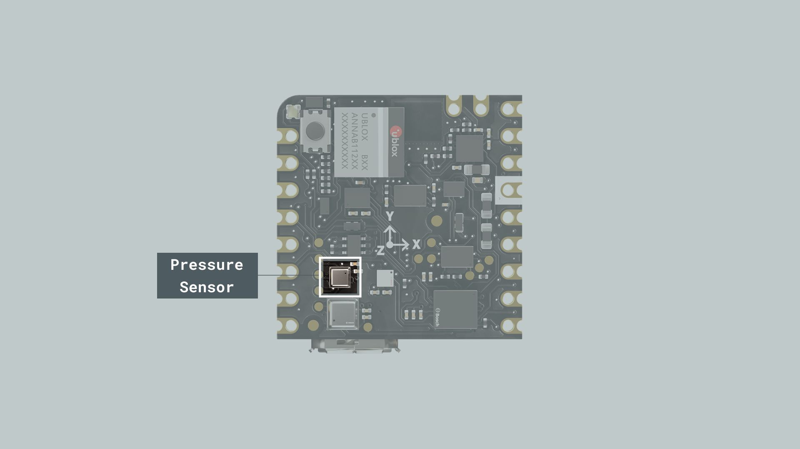

To use this sensor in standalone mode, you can leverage the example code below:

```arduino

#include "Nicla_System.h"
#include "Arduino_BHY2.h"


unsigned long previousMillis = 0;  // will store last time the sensor was updated

const long interval = 1000;

Sensor pressure(SENSOR_ID_BARO);

void setup() {

  Serial.begin(115200);
  nicla::begin();
  BHY2.begin(NICLA_I2C);
  pressure.begin();
}

void loop() {

  BHY2.update();

  unsigned long currentMillis = millis();

  if (currentMillis - previousMillis >= interval) {

    previousMillis = currentMillis;

    Serial.println(String(pressure.value()) + " hPa");
  }
}

```

***To learn how to work with every sensor class and predefined objects to get all the needed readings, go to our [Nicla Sense ME Cheat Sheet](https://docs.arduino.cc/tutorials/nicla-sense-me/cheat-sheet#sensor-classes).***


### On-Board Sensors WebBLE Dashboard

A very interesting way to test the Nicla Sense ME onboard sensors all at once is through the WebBLE dashboard demo.

- Enable your PC Bluetooth connection and go to the [dashboard link](https://arduino.github.io/ArduinoAI/NiclaSenseME-dashboard/), add this [firmware](https://create.arduino.cc/editor/FT-CONTENT/333e2e07-ecc4-414c-bf08-005b611ddd75/preview) to your sketchbook in the Arduino Cloud or download it to use it locally.

- Upload the code to your Nicla Sense ME and now you are ready to start monitoring the variables through the WebBLE dashboard.

- Click on "CONNECT", search for your board and pair it.


Follow this [dedicated guide](https://docs.arduino.cc/tutorials/nicla-sense-me/web-ble-dashboard) to get more details.

## Actuators

### RGB LED

The Nicla Sense ME features a built-in I2C RGB LED that can be a visual feedback indicator for the user. The LED is connected through the boards' I2C port; therefore, specific functions must be used to operate the LED colors.

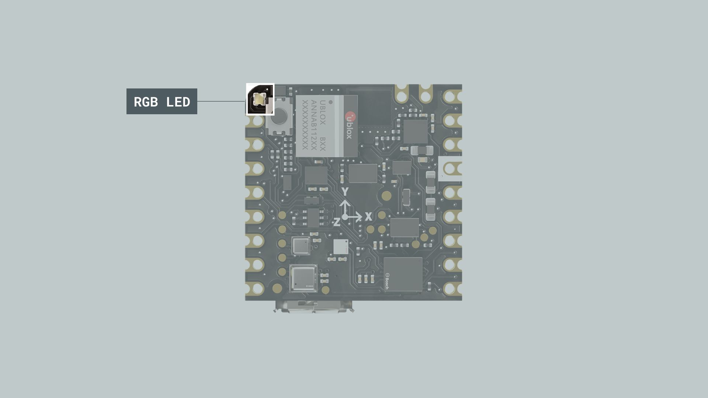

To use the RGB LED, include the `Nicla System` header:

```arduino
// Include the Nicla System header to access the built-in RGB LED functions
#include "Nicla_System.h"
```

Since the functions are scoped under a class name called `nicla`, you must explicitly write it before each statement. To initialize the board's built-in RGB LED along with the Nicla system inside the void `setup()` function:

```arduino
void setup() {
  // Initialize the Nicla system and the built-in RGB LED
  nicla::begin();
  nicla::leds.begin();
}
```
The LED can be set to the desired RGB value using red, green and blue components or by using one of the following predefined colors:

- off
- red
- green
- blue
- yellow
- magenta
- cyan

To set the LED to a predefined color (e.g. green or blue):

```arduino
// Set the LED color to green, wait for 1000 milliseconds
nicla::leds.setColor(green);
delay(1000);

// Set the LED color to blue, wait for 1000 milliseconds
nicla::leds.setColor(blue);
delay(1000);
```

To turn off the built-in RGB LED:

```arduino
// Turn off the LED
nicla::leds.setColor(off);
```

You can also choose a value between 0 and 255 for each color component (red, green, or blue) to set a custom color:


```arduino
// Define custom color values for red, green, and blue components
int red = 234;
int green = 72;
int blue = 122;

// Set the LED to the custom color, wait for 1000 milliseconds
nicla::leds.setColor(red, green, blue);
delay(1000);

// Turn off the LED and wait, wait for 1000 milliseconds
nicla::leds.setColor(off);
delay(1000);
```
Here you can find a complete example code to blink the built-in I2C RGB LED of the Nicla Sense ME:

```arduino
// Include the Nicla System header to access the built-in RGB LED functions
#include "Nicla_System.h"

void setup() {
  // Initialize the Nicla system and the built-in RGB LED
  nicla::begin();
  nicla::leds.begin();
}

void loop() {
  // Set the LED color to red, wait for 1000 milliseconds
  nicla::leds.setColor(green);
  delay(1000);

  // Turn off the LED and wait, wait for 1000 milliseconds
  nicla::leds.setColor(off);
  delay(1000);
}
```


## Communication

This section of the user manual covers the different communication protocols that are supported by the Nicla Sense ME board, including the Serial Peripheral Interface (SPI), Inter-Integrated Circuit (I2C), Universal Asynchronous Receiver-Transmitter (UART), and Bluetooth® Low Energy; communication via the onboard ESLOV connector is also explained in this section. The Nicla Sense ME features dedicated pins for each communication protocol, simplifying the connection and communication with different components, peripherals, and sensors.

### SPI

The Nicla Sense ME supports SPI communication, which allows data transmission between the board and other SPI-compatible devices. The pins used in the Nicla Sense ME for the SPI communication protocol are the following:

| **Microcontroller Pin** | **Arduino Pin Mapping** |
|:-----------------------:|:-----------------------:|
|       CS/P0_29      |       SS or 6       |
|      COPI/P0_27     |       MOSI or 7     |
|      CIPO/P0_28     |       MISO or 9     |
|      SCLK/P0_11     |       SCK or 8      |

Please, refer to the [board pinout section](#pinout) of the user manual to localize them on the board.

Include the `SPI` library at the top of your sketch to use the SPI communication protocol. The SPI library provides functions for SPI communication:

```arduino
#include <SPI.h>
```

In the `setup()` function, initialize the SPI library, define and configure the chip select (`CS`) pin:

```arduino
void setup() {
  // Set the chip select pin as output
  pinMode(SS, OUTPUT);

  // Pull the CS pin HIGH to unselect the device
  digitalWrite(SS, HIGH);

  // Initialize the SPI communication
  SPI.begin();
}
```

To transmit data to an SPI-compatible device, you can use the following commands:

```arduino
// Replace with the target device's address
byte address = 0x35;

// Replace with the value to send
byte value = 0xFA;

// Pull the CS pin LOW to select the device
digitalWrite(SS, LOW);

// Send the address
SPI.transfer(address);

// Send the value
SPI.transfer(value);

// Pull the CS pin HIGH to unselect the device
digitalWrite(SS, HIGH);
```

The example code above should output this:


### I2C

The Nicla Sense ME supports I2C communication, which allows data transmission between the board and other I2C-compatible devices. The pins used in the Nicla Sense ME for the I2C communication protocol are the following:

| **Microcontroller Pin** | **Arduino Pin Mapping** |
|:-----------------------:|:-----------------------:|
|         P0_23         |       SCL or 3      |
|         P0_22         |       SDA or 4      |

Please, refer to the [board pinout section](#pinout) of the user manual to localize them on the board. The I2C pins are also available through the Nicla Sense ME ESLOV connector.

To use I2C communication, include the `Wire` library at the top of your sketch. The `Wire` library provides functions for I2C communication:

```arduino
#include <Wire.h>
```

In the `setup()` function, initialize the I2C library:

```arduino
 // Initialize the I2C communication
Wire.begin();
```

To transmit data to an I2C-compatible device, you can use the following commands:

```arduino
// Replace with the target device's I2C address
byte deviceAddress = 0x35;

// Replace with the appropriate instruction byte
byte instruction = 0x00;

// Replace with the value to send
byte value = 0xFA;

// Begin transmission to the target device
Wire.beginTransmission(deviceAddress);

// Send the instruction byte
Wire.write(instruction);

// Send the value
Wire.write(value);

// End transmission
Wire.endTransmission();
```

The output data should look like the image below, where we can see the device address data frame:

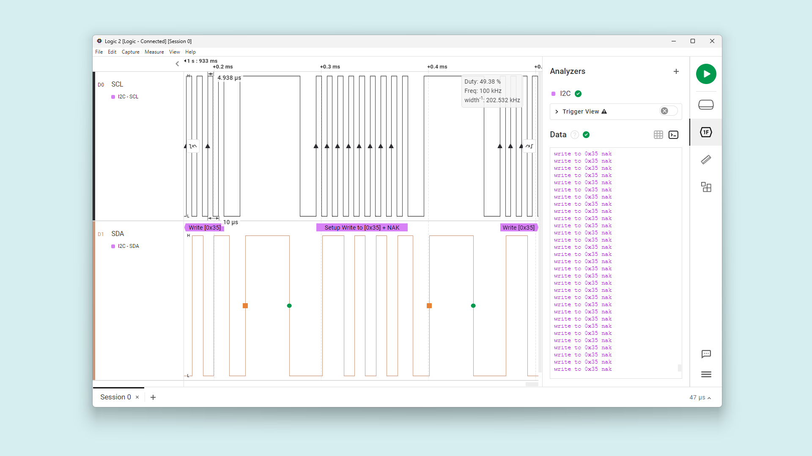


To read data from an I2C-compatible device, you can use the `requestFrom()` function to request data from the device and the `read()` function to read the received bytes:

```arduino
// The target device's I2C address
byte deviceAddress = 0x1;

// The number of bytes to read
int numBytes = 2;

// Request data from the target device
Wire.requestFrom(deviceAddress, numBytes);

// Read while there is data available
while (Wire.available()) {
  byte data = Wire.read();
}
```

### UART

The pins used in the Nicla Sense ME for the UART communication protocol are the following:

| **Microcontroller Pin** | **Arduino Pin Mapping** |
|:-----------------------:|:-----------------------:|
|         P0_09         |       RX or 1       |
|         P0_20         |       TX or 2       |

Please, refer to the [board pinout section](#pinout) of the user manual to localize them on the board.

To begin with UART communication, you will need to configure it first. In the `setup()` function, set the baud rate (bits per second) for UART communication:

```arduino
// Start UART communication at 115200 baud
Serial1.begin(115200);
```

To read incoming data, you can use a `while()` loop to continuously check for available data and read individual characters. The code shown below stores the incoming characters in a String variable and processes the data when a line-ending character is received:

```arduino
// Variable for storing incoming data
String incoming = "";

void loop() {
  // Check for available data and read individual characters
  while (Serial1.available()) {
    // Allow data buffering and read a single character
    delay(2);
    char c = Serial1.read();

    // Check if the character is a newline (line-ending)
    if (c == '\n') {
      // Process the received data
      processData(incoming);

      // Clear the incoming data string for the next message
      incoming = "";
    } else {
      // Add the character to the incoming data string
      incoming += c;
    }
  }
}
```

To transmit data to another device via UART, you can use the `write()` function:

```arduino
// Transmit the string "Hello world!
Serial1.write("Hello world!");
```

You can also use the `print` and `println()` to send a string without a newline character or followed by a newline character:

```arduino
// Transmit the string "Hello world!"
Serial1.print("Hello world!");

// Transmit the string "Hello world!" followed by a newline character
Serial1.println("Hello world!");
```

### Bluetooth® Low Energy

To enable Bluetooth® Low Energy communication on the Nicla Sense ME, you can use the [ArduinoBLE library](https://www.arduino.cc/reference/en/libraries/arduinoble/).

For this BLE application example, we are going to monitor the Nicla Sense ME battery level. Here is an example of how to use the ArduinoBLE library to achieve it:

```arduino
#include "Nicla_System.h"
#include <ArduinoBLE.h>

// Bluetooth® Low Energy Battery Service
BLEService batteryService("180F");

// Bluetooth® Low Energy Battery Level Characteristic
BLEUnsignedCharCharacteristic batteryLevelChar("2A19",                // standard 16-bit characteristic UUID
                                               BLERead | BLENotify);  // remote clients will be able to get notifications if this characteristic changes

int oldBatteryLevel = 0;  // last battery level reading from analog input
long previousMillis = 0;  // last time the battery level was checked, in ms

void blePeripheralDisconnectHandler(BLEDevice central) {
  nicla::leds.setColor(red);
  Serial.println("Device disconnected.");
}

void blePeripheralConnectHandler(BLEDevice central) {
  nicla::leds.setColor(blue);
  Serial.println("Device connected.");
}

void setup() {
  Serial.begin(9600);  // initialize serial communication
  while (!Serial)
    ;

  // run this code once when Nicla Sense ME board turns on
  nicla::begin();       // initialize library
  nicla::leds.begin();  // initialize LEDs support

  nicla::setBatteryNTCEnabled(false);  // Set to false if your battery doesn't have an NTC thermistor.
  nicla::enableCharging(100);  // enable the battery charger and define the charging current in mA

  nicla::leds.setColor(green);

  // begin initialization
  if (!BLE.begin()) {
    Serial.println("starting BLE failed!");

    while (1)
      ;
  }

  /* Set a local name for the Bluetooth® Low Energy device
     This name will appear in advertising packets
     and can be used by remote devices to identify this Bluetooth® Low Energy device
     The name can be changed but maybe be truncated based on space left in advertisement packet
  */
  BLE.setLocalName("BatteryMonitor");
  BLE.setAdvertisedService(batteryService);            // add the service UUID
  batteryService.addCharacteristic(batteryLevelChar);  // add the battery level characteristic
  BLE.addService(batteryService);                      // Add the battery service
  batteryLevelChar.writeValue(oldBatteryLevel);        // set initial value for this characteristic
  BLE.setEventHandler(BLEDisconnected, blePeripheralDisconnectHandler);   // handler that fires when BLE is disconnected
  BLE.setEventHandler(BLEConnected, blePeripheralConnectHandler);         // handler that fires when BLE is disconnected

  /* Start advertising Bluetooth® Low Energy.  It will start continuously transmitting Bluetooth® Low Energy
     advertising packets and will be visible to remote Bluetooth® Low Energy central devices
     until it receives a new connection */

  // start advertising
  BLE.advertise();

  Serial.println("Bluetooth® device active, waiting for connections...");
}

void loop() {
  // wait for a Bluetooth® Low Energy central
  BLEDevice central = BLE.central();

  // if a central is connected to the peripheral:
  if (central) {
    Serial.print("Connected to central: ");
    // print the central's BT address:
    Serial.println(central.address());

    // check the battery level every 200ms
    // while the central is connected:
    while (central.connected()) {
      long currentMillis = millis();
      // if 200ms have passed, check the battery level:
      if (currentMillis - previousMillis >= 200) {
        previousMillis = currentMillis;
        updateBatteryLevel();
      }
    }

    Serial.print("Disconnected from central: ");
    Serial.println(central.address());
  }
}

void updateBatteryLevel() {
  /* Read the power management IC registers to retrieve the battery percentage
  */

  int batteryLevel = nicla::getBatteryVoltagePercentage();  // this command return the battery percentage

  if (batteryLevel != oldBatteryLevel) {       // if the battery level has changed
    Serial.print("Battery Level % is now: ");  // print it
    Serial.println(batteryLevel);
    batteryLevelChar.writeValue(batteryLevel);  // and update the battery level characteristic
    oldBatteryLevel = batteryLevel;             // save the level for next comparison
  }
}


```

The example code shown above creates a Bluetooth® Low Energy service and characteristics according to the [BLE standard](https://btprodspecificationrefs.blob.core.windows.net/assigned-numbers/Assigned%20Number%20Types/Assigned_Numbers.pdf) for transmitting a battery percentage value read by Nicla Sense ME power management IC.

- The code begins by importing all the necessary libraries and defining the Bluetooth® Low Energy service and characteristics for a battery-level application.


  |         **Description**        |       **ID**       |
  |:------------------------------:|:------------------:|
  |  Battery Service             |       180F       |
  | Battery Level Characteristic |       2A19       |

- In the `setup()` function, the code initializes the Nicla Sense ME board and sets up the Bluetooth® Low Energy service and characteristics; then, it begins advertising the defined Bluetooth® Low Energy service.

- A Bluetooth® Low Energy connection is constantly verified in the `loop()` function; when a central device connects to the Nicla Sense ME, its built-in LED is turned on blue. The code then enters into a loop that constantly reads the battery percent. It also prints it to the Serial Monitor and transmits it to the central device over the defined Bluetooth® Low Energy characteristic.

Using the nRF Connect app (available for [Android](https://play.google.com/store/apps/details?id=no.nordicsemi.android.mcp&hl=es_419&gl=US) and [iOS](https://apps.apple.com/us/app/nrf-connect-for-mobile/id1054362403?platform=iphone)) you can easily connect to your Nicla Sense ME and monitor the battery level in real time.

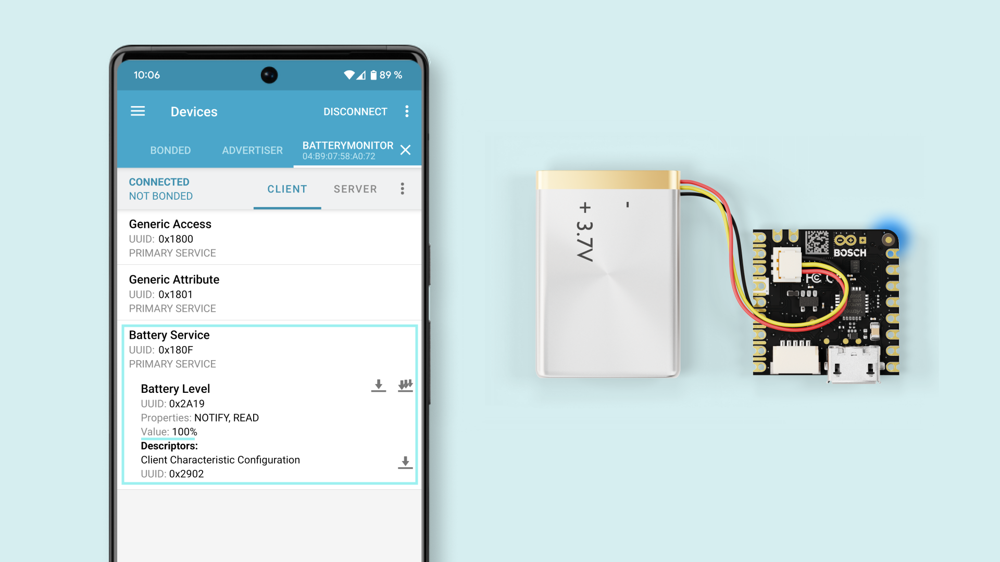

### ESLOV Connector

The Nicla Sense ME board features an onboard ESLOV connector meant as an **extension** of the I2C communication bus. This connector simplifies the interaction between the Nicla Sense ME and various sensors, actuators, and other modules, without soldering or wiring.

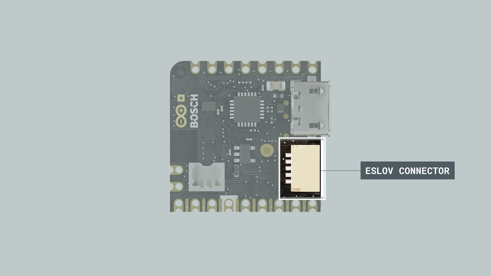

The ESLOV connector is a small 5-pin connector with a 1.00 mm pitch; the mechanical details of the connector can be found in the connector's datasheet.

The manufacturer part number of the ESLOV connector is SM05B-SRSS and its matching receptacle manufacturer part number is SHR-05V-S-B.

The pin layout of the ESLOV connector is the following:

1. VCC_IN (5V input)
2. INT
3. SCL
4. SDA
5. GND

## Arduino Cloud

The Nicla Sense ME does not have built-in Wi-Fi®, so it can not be directly connected to the internet. For this, we need to use a Wi-Fi® capable Arduino board as a host for the Nicla.

In this example, a Portenta C33 will be used as a gateway to forward Nicla Sense ME sensors data to the Arduino Cloud.

### Nicla Sense ME Setup

The **Nicla Sense ME** will be listening to the Host board to send back the required data. This is all automated via the libraries **Arduino_BHY2** and **Arduino_BHY2Host**.

The code is available inside the examples provided with the Arduino_BHY2 Library. Open it by going to **Examples > Arduino_BHY2 > App**.

```arduino
#include "Arduino.h"
#include "Arduino_BHY2.h"

// Set DEBUG to true in order to enable debug print
#define DEBUG false

void setup()
{
#if DEBUG
  Serial.begin(115200);
  BHY2.debug(Serial);
#endif

  BHY2.begin();   // this initialization enables the ESLOV and BLE communication
}

void loop()
{
  // Update and then sleep
  BHY2.update(100);
}
```

Upload the sketch above to the Nicla Sense ME using the Arduino IDE.

### Arduino Cloud Setup

To start using the Arduino Cloud, we first need to [log in or sign up](https://create.arduino.cc/iot/things).

Once in, it is time to configure your Portenta C33. For this, follow this [section](https://docs.arduino.cc/tutorials/portenta-c33/user-manual#arduino-iot-cloud) on the Portenta C33 user manual.

With a Thing already created, add a variable, in this case, "temperature" float type.

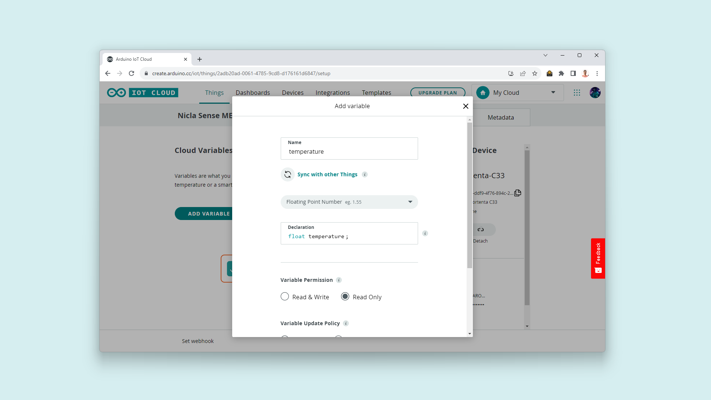

Once the variable is added, let's define the Wi-Fi® credentials for the board, for this, click on your Thing Network setting and add your Wi-Fi® SSID and password:

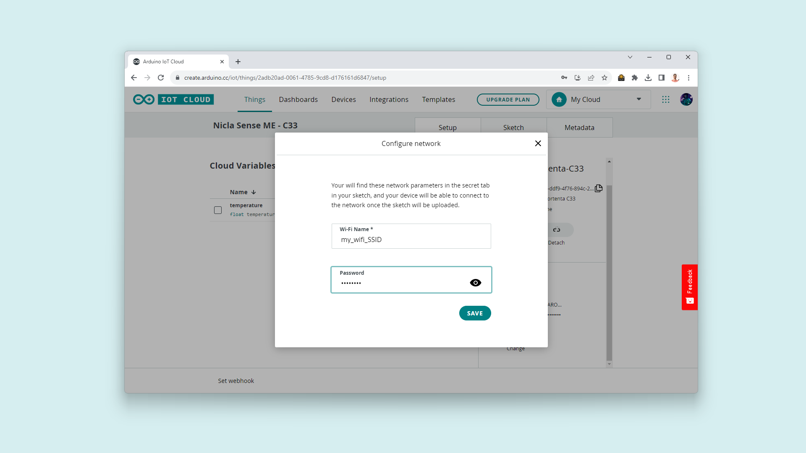

It is time to open the automatically generated sketch and modify the code. It should be replaced by the following:

```arduino
#include "thingProperties.h"
#include "Arduino_BHY2Host.h"

Sensor tempSensor(SENSOR_ID_TEMP);  // Temperature sensor ID

void setup() {
  Serial.begin(9600);
  delay(1500);

  Serial.print("Configuring the Arduino Cloud");
  // Defined in thingProperties.h
  initProperties();

  // Connect to Arduino Cloud
  ArduinoCloud.begin(ArduinoIoTPreferredConnection);

  Serial.println("Connecting to the Arduino Cloud");
  while (ArduinoCloud.connected() != 1) {
    ArduinoCloud.update();
    delay(500);
  }

  delay(1500);

  Serial.println("Initialize the Nicla as a ESLOV connected device");
  BHY2Host.begin(false, NICLA_VIA_ESLOV);  // use NICLA_VIA_BLE if a wireless connection is desired

  tempSensor.configure(1,0);
  temperature = tempSensor.value();   // take a first sample
}

void loop() {

  BHY2Host.update();

  temperature = tempSensor.value();

  ArduinoCloud.update();

  Serial.print("Temperature: ");
  Serial.println(temperature);

  delay(2000);

}
```
***If you are interested in using a different sensor from the onboard options of the Nicla Sense ME, check all the sensors IDs on this [list](https://docs.arduino.cc/tutorials/nicla-sense-me/cheat-sheet#sensor-ids)***

### Portenta C33 Setup

Before uploading the code to the Portenta C33 code ready on the Arduino Cloud, let's connect everything together.

Using the ESLOV cable included with the Nicla Sense ME, connect both boards by their respective connectors as shown below:

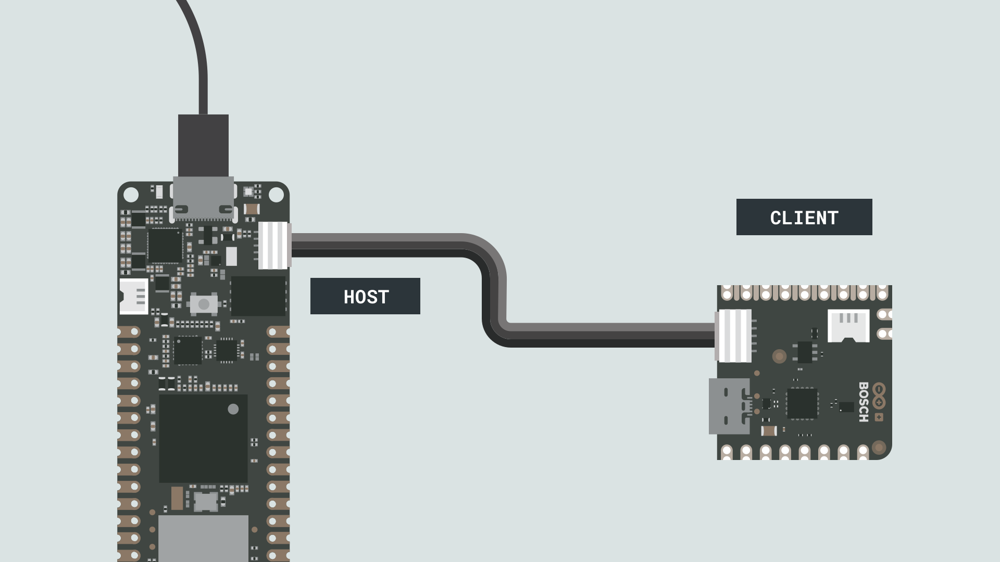

Upload the code to the Portenta C33 by connecting it to your computer using a USB cable and clicking on the upload button in the IoT Cloud editor.

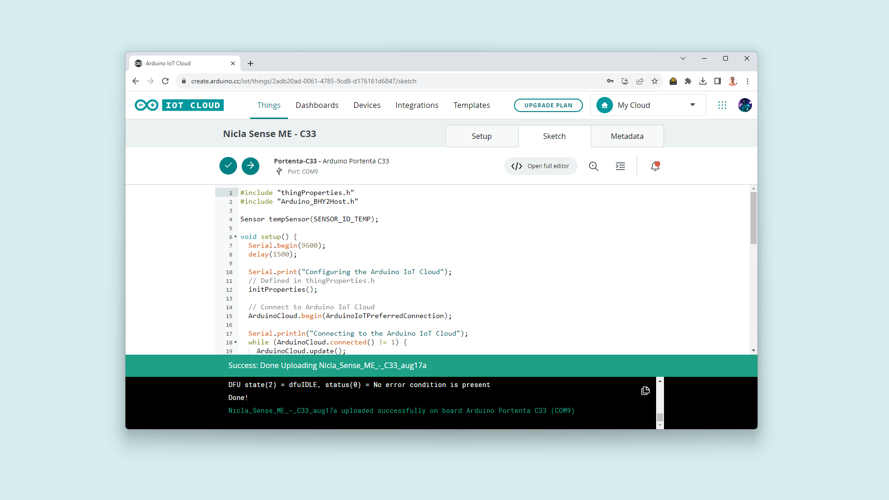

Finally, after searching for and connecting to your Wi-Fi® network, it will gather the temperature information from the Nicla Sense ME. Every 2 seconds it will forward it to the Cloud where we can monitor it from anywhere in the world and from any device.

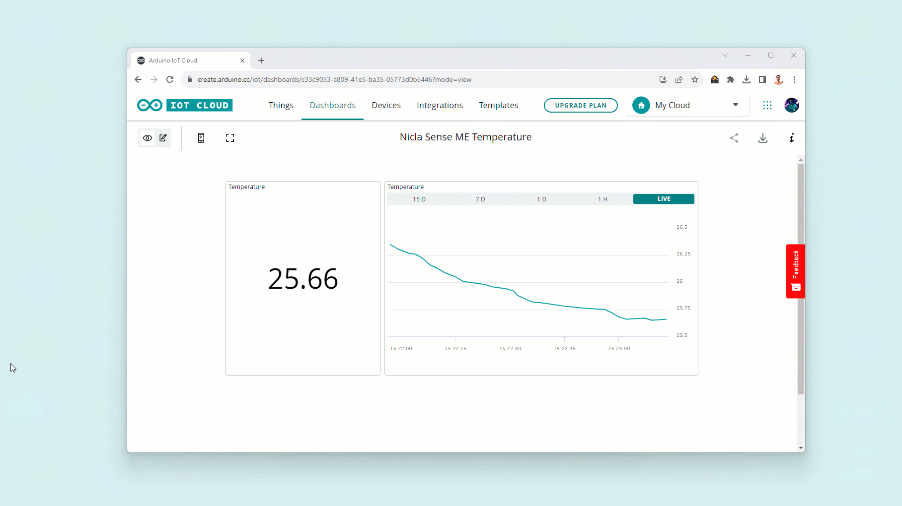

### Bluetooth® Low Energy Connection

For Bluetooth® communication, substitute the line of code `BHY2Host.begin(false, NICLA_VIA_ESLOV);` with `BHY2Host.begin(false, NICLA_VIA_BLE);` in the host sketch so that the boards will bind wirelessly.


### Using the Nicla Sense ME as an MKR Shield

Another way to communicate the Nicla Sense ME with a Portenta C33/H7 is by using it as a shield.

To convert the Nicla Sense ME into a Shield, you will have to **solder** 2 rows of headers: one side has 9 pins and the other 8 pins; the long side of the headers needs to be on the **battery connectors side.**

The host (Portenta C33/H7) will communicate through the BHY2Host library with the Nicla Sense ME (both devices communicate over I2C).

To the Nicla Sense ME to communicate with the Arduino Cloud, set the communication method as `NICLA_AS_SHIELD` in the host sketch as follows:

`BHY2Host.begin(false, NICLA_AS_SHIELD);`

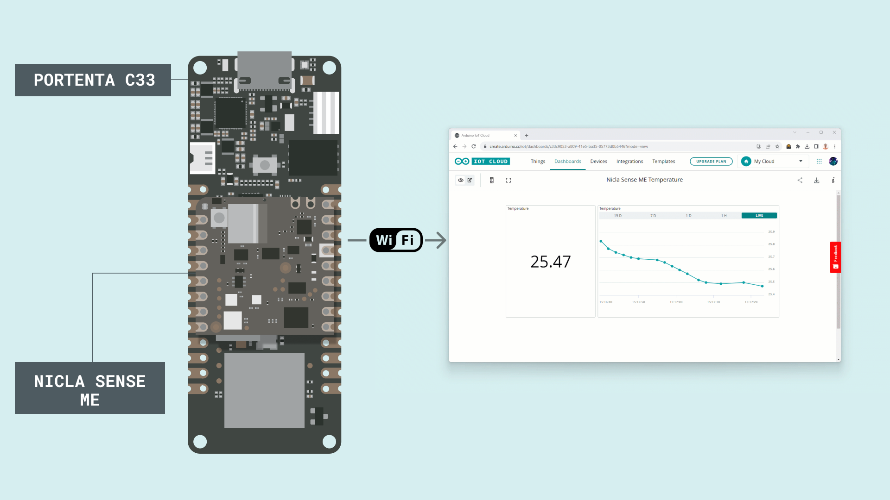

***This setup works with the ESLOV cable too. Keep in mind that female headers or raw cables can be used as well, but make sure the connection of the pin matches the MKR pinout (3V3, GND, SCL and SDA).***

***For a more detailed process on how to connect the Nicla Sense ME to the Arduino Cloud, follow this [guide](https://docs.arduino.cc/tutorials/nicla-sense-me/connecting-to-iot-cloud)***

## Support

If you encounter any issues or have questions while working with the Nicla Sense ME, we provide various support resources to help you find answers and solutions.

### Help Center

Explore our [Help Center](https://support.arduino.cc/hc/en-us), which offers a comprehensive collection of articles and guides for the Nicla Sense ME. The Arduino Help Center is designed to provide in-depth technical assistance and help you make the most of your device.

- [Nicla Family help center page](https://support.arduino.cc/hc/en-us/sections/4410176504978-Nicla-Family)

### Forum

Join our community forum to connect with other Nicla Sense ME users, share your experiences, and ask questions. The forum is an excellent place to learn from others, discuss issues, and discover new ideas and projects related to the Nicla Sense ME.

- [Nicla Sense ME category in the Arduino Forum](https://forum.arduino.cc/c/hardware/nicla-family/nicla-family/170)

### Contact Us

Please get in touch with our support team if you need personalized assistance or have questions not covered by the help and support resources described before. We're happy to help you with any issues or inquiries about the Nicla Sense ME.

- [Contact us page](https://www.arduino.cc/en/contact-us/)