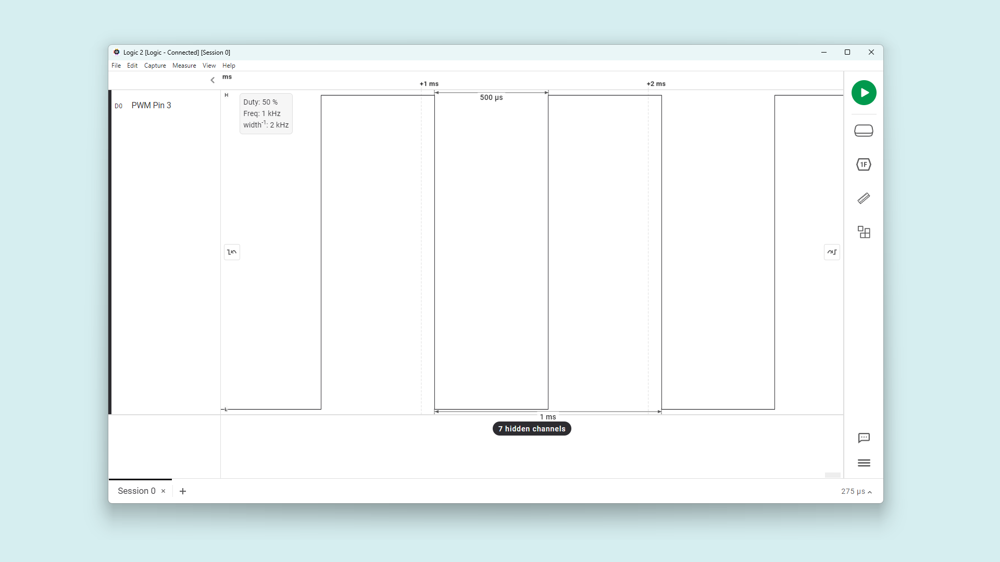
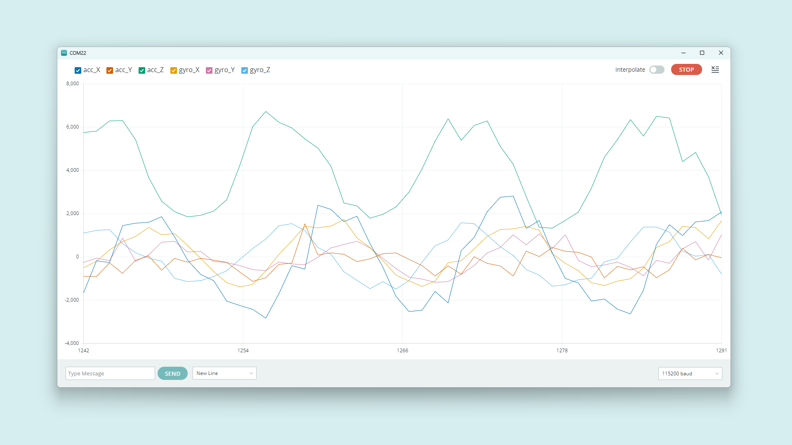
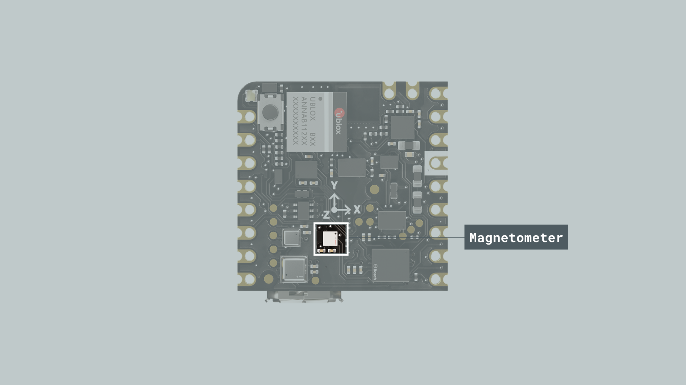
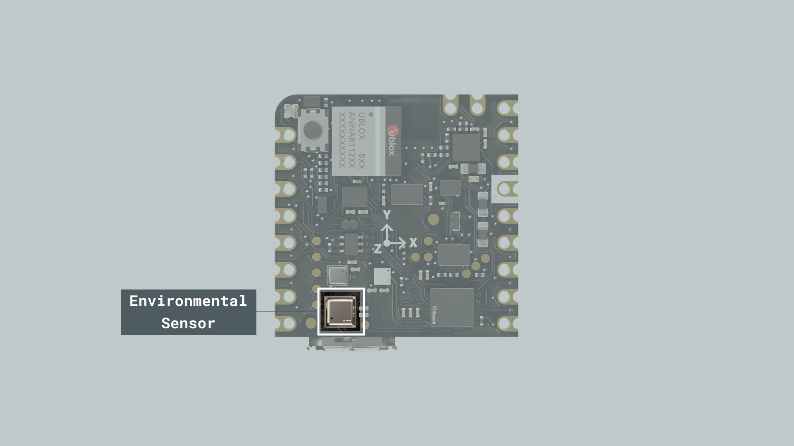

## Overview

This user manual will guide you through a practical journey covering the most interesting features of the Arduino Nicla Sense ME. With this user manual, you will learn how to set up, configure and use this Arduino board.

## Hardware and Software Requirements
### Hardware Requirements

- [Nicla Sense ME](https://store.arduino.cc/products/nicla-sense-me) (x1)
- Micro USB cable (x1)

### Software Requirements

- [Arduino IDE 1.8.10+](https://www.arduino.cc/en/software), [Arduino IDE 2.0+](https://www.arduino.cc/en/software), or [Arduino Web Editor](https://create.arduino.cc/editor)
- To create custom Machine Learning models, the integrated Machine Learning Tools of the [Arduino Cloud](https://create.arduino.cc/iot/) are needed. In case you do not have an Arduino Cloud account, you will need to create one first.

## Product Overview

Introducing the Arduino® Nicla Sense ME, our most compact design to date, housing an array of high-quality industrial grade sensors in a remarkably small package. This versatile device allows you to monitor essential process parameters like temperature, humidity, and movement accurately. Equipped with a 9-axis inertial measurement unit and the option for Bluetooth® Low Energy connectivity, it becomes an ideal choice for crafting your next Bluetooth® Low Energy enabled project. Harness the power of the onboard Bosch sensors, including BHI260AP, BMP390, BMM150, and BME688, to create your very own industrial grade wireless sensing network.

### Board Architecture Overview

The Nicla Sense ME features a robust and efficient architecture that integrates a range of sensors packed into a tiny footprint. It features four industrial grade Bosch sensors that can accurately measure rotation, acceleration, pressure, humidity, temperature, air quality and CO2 levels.


Here is an overview of the board's architecture's main components shown in the images above:

- **Microcontroller**: at the heart of the Nicla Sense ME is the nRF52832, a powerful and versatile System-on-Chip (SoC) from Nordic® Semiconductor. The nRF52832 is built around a 32-bit Arm® Cortex®-M4 processor running at 64 MHz.
- **Onboard advanced motion sensors**: the board features the BHI260AP, a smart IMU that includes a 3-axis accelerometer and a 3-axis gyroscope. It is trained with Machine Learning algorithms for step counting, position tracking, and activity recognition. The board also features the BMM150, a compact geomagnetic sensor from Bosch® Sensortec with a 3-axis magnetometer.
- **Onboard environment sensors**: the Nicla Sense ME is equipped with the BME688, this is the first gas sensor with Artificial Intelligence (AI) and integrated high-linearity and high-accuracy pressure, humidity and temperature sensors. The gas sensor can detect Volatile Organic Compounds (VOCs), volatile sulfur compounds (VSCs) and other gases such as carbon monoxide and hydrogen in the part per billion (ppb) range.
- **Wireless connectivity**: the board supports Bluetooth® Low Energy connectivity, provided by the ANNA-B112 module developed by u-blox®. This compact, high-performance Bluetooth® Low Energy module allows the Nicla Sense ME to communicate wirelessly with other devices and systems.
- **Power management**: the Nicla Sense ME is designed for ultra-low power operation, with efficient power management features that ensure minimal energy consumption even when using always-on motion recognition and environment analysis sensors. The Nicla Sense ME features the BQ25120 from Texas Instruments®; a highly integrated battery charge management integrated circuit (IC) designed for wearables and Internet of Things (IoT) devices. 

### Board Core and Libraries

The **Arduino Mbed OS Nicla Boards** core contains the libraries and examples you need to work with the board's components, such as its IMU, magnetometer, and environment sensor. To install the core for Nicla boards, navigate to **Tools > Board > Boards Manager** or click the Boards Manager icon in the left tab of the IDE. In the Boards Manager tab, search for `Nicla Sense Me` and install the latest `Arduino Mbed OS Nicla Boards` version.


### Pinout


The full pinout is available and downloadable as PDF from the link below:

- [Nicla Sense ME pinout](https://docs.arduino.cc/static/b35956b631d757a0455c286da441641b/ABX00050-full-pinout.pdf)

### Datasheet

The complete datasheet is available and downloadable as PDF from the link below:

- [Nicla Sense ME datasheet](https://docs.arduino.cc/resources/datasheets/ABX00050-datasheet.pdf)

### Schematics

The complete schematics are available and downloadable as PDF from the link below:

- [Nicla Sense ME schematics](https://docs.arduino.cc/resources/schematics/ABX00050-schematics.pdf)

### STEP Files

The complete STEP files are available and downloadable from the link below:

- [Nicla Sense ME STEP files](https://docs.arduino.cc/static/10c0953581f489a9a136ff00f2d2fa9d/ABX00050-step.zip)


## First Use
### Powering the Board

The Nicla Sense ME can be powered by:

- Using a Micro USB cable (not included). 
- Using an external **5V power supply** connected to `VIN_BQ25120` pin (please, refer to the [board pinout section](#pinout) of the user manual).
- Using a **3.7V Lithium Polymer (Li-Po) battery** connected to the board through the onboard battery connector; the manufacturer part number of the battery connector is BM03B-ACHSS and its matching receptacle manufacturer part number is ACHR-03V-S. The **recommended minimum battery capacity for the Nicla Sense ME is 200 mAh**. A Li-Po battery with an integrated NTC thermistor is also recommended for thermal protection. 
- Using the onboard **ESLOV connector**, which has a dedicated 5V power line.


### Battery Charging 

One of the characteristic features of the Nicla Sense ME is power management, the BQ25120 battery charger IC is configurable by the user, which means that its charging parameters can be customized by software. We listed the main ones below:

- **Enable charging:** If you are powering the board with a rechargeable battery, you may want it to be recharged, the IC lets you enable the charging function by calling `nicla::enableCharging()`.

- **Battery charging current:** A safe default charging current value that works for most common LiPo batteries is 0.5C, which means charging at a rate equal to half of the battery's capacity. For example, a 200mAh battery could be charged at 100mA (0.1A).

  The desired current must be set as the parameter of the enabling function:
    `nicla::enableCharging(100)`.

  When the function parameter is left blank, the default current is 20mA.

- **Battery NTC:** If your battery has an NTC to measure its temperature, you can enable it by calling this function: `nicla::setBatteryNTCEnabled(true)`, if not, set the argument to *false*. 

- **Battery maximum charging time:** To get an estimation of the charging time, you can use the following formula:

  `Charging time (in hours) = (Battery capacity in mAh) / (0.8 * Charging current in mA)`

  This formula takes into account that the charging process is approximately 80% efficient (hence the 0.8 factor). This is just a rough estimate, and actual charging time may vary depending on factors like the charger, battery quality, and charging conditions.

  To set a charging time of nine hours, define it as follows:

  `nicla::configureChargingSafetyTimer(ChargingSafetyTimerOption::NineHours)`

- **Get the battery voltage:** To monitor the battery voltage you just need to store the returned value of the following function in a *float* variable:

  `float currentVoltage = nicla::getCurrentBatteryVoltage();`

- **Get the power IC operating status:** In order to know if the battery is fully charged, charging, or presents any error, you can check its status using this code block:

```arduino
auto operatingStatus = nicla::getOperatingStatus();

    switch(operatingStatus) {
      case OperatingStatus::Charging:
      nicla::leds.setColor(255,100,0); // Yellow
        break;
      case OperatingStatus::ChargingComplete:
        nicla::leds.setColor(green);
        
        // This will stop further charging until enableCharging() is called again.
        nicla::disableCharging();
        break;
      case OperatingStatus::Error:
        nicla::leds.setColor(red);
        break;
      case OperatingStatus::Ready:
        nicla::leds.setColor(blue);
        break;
      default:
        nicla::leds.setColor(off);
        break;
    }
```

To extend your knowledge on this topic, refer to the board examples by navigating to "**File > Examples > Nicla_Sense_System**", and chose between both examples:

- `NiclaSenseME_BatteryStatus`
- `NiclaSenseME_BatteryChargingSimple`

## Pins
### Analog Pins

The Nicla Sense ME has **two analog input pins**, mapped as follows:

| **Microcontroller Pin** | **Arduino Pin Mapping** |
|:-----------------------:|:-----------------------:|
|      `ADC1`/`P0_02`     |           `A0`          |
|      `ADC2`/`P0_30`     |           `A1`          |

Both pins can be used through the built-in functions of the Arduino programming language. 

Nicla boards ADC can be configured to 8, 10 or 12 bits defining the argument of the following function respectively (default is 10 bits):

```arduino
analogReadResolution(12);  // ADC resolution set to 12 bits (0-4095)
```

***The Nicla boards ADC reference voltage is fixed to 1.8v, this means that it will map the ADC range from 0 to 1.8 volts.***

The example code shown below reads the analog input value from a potentiometer connected to `A0` and displays it on the IDE Serial Monitor:


```arduino
#include "Nicla_System.h"

int sensorPin = A0;   // select the input pin for the potentiometer
int sensorValue = 0;  // variable to store the value coming from the sensor

void setup() {

  analogReadResolution(12); // ADC bits configuration
  nicla::begin();           // Nicla peripherals initialization, this enables the VDDIO_EXT 3.3v output.
  Serial.begin(115200);     // Serial initialization
}

void loop() {
  // read the value from the sensor:
  sensorValue = analogRead(sensorPin);
  // print the value
  Serial.println(sensorValue);
  delay(1000);
}
```

***The ADC inputs support 3.3v even when the ADC reference is 1.8v, it just won't sense any change from 1.8v and above.***

### Digital Pins

The Nicla Sense ME has **twelve digital pins**, mapped as follows:

| **Microcontroller Pin** | **Arduino Pin Mapping** |
|:-----------------------:|:-----------------------:|
|         `P0_10`         |           `0`           |
|         `P0_09`         |           `1`           |
|         `P0_20`         |           `2`           |
|         `P0_23`         |           `3`           |
|         `P0_22`         |           `4`           |
|         `P0_24`         |           `5`           |
|         `P0_29`         |           `6`           |
|         `P0_27`         |           `7`           |
|         `P0_28`         |           `8`           |
|         `P0_11`         |           `9`           |
|         `P0_02`         |           `A0`          |
|         `P0_30`         |           `A1`          |

Notice that analog pins `A0` and `A1` (`P0_02` and `P0_30`) can also be used as digital pins. Please, refer to the [board pinout section](#pinout) of the user manual to find them on the board.

The digital pins of the Nicla Sense ME can be used as inputs or outputs through the built-in functions of the Arduino programming language. The configuration of a digital pin is done in the `setup()` function with the built-in function `pinMode()` as shown below:

```arduino
// Pin configured as an input
pinMode(pin, INPUT);        

// Pin configured as an output
pinMode(pin, OUTPUT);        

// Pin configured as an input, internal pull-up resistor enabled
pinMode(pin, INPUT_PULLUP);  
```

The state of a digital pin, configured as an input, can be read using the built-in function `digitalRead()` as shown below:

```arduino
// Reads pin state, stores value in state variable
state = digitalRead(pin);
```

The state of a digital pin, configured as an output, can be changed using the built-in function `digitalWrite()` as shown below:

```arduino
// Set pin on
digitalWrite(pin, HIGH);    

// Set pin off
digitalWrite(pin, LOW);    
```

The example code shown below uses digital pin `3` to control an LED and reads the state of a button connected to digital pin `2`:


```arduino
// Define button and LED pin
int buttonPin = 2;
int ledPin = 3;

// Variable to store the button state
int buttonState = 0;

void setup() {
  // Configure button and LED pins
  pinMode(buttonPin, INPUT_PULLUP);
  pinMode(ledPin, OUTPUT);

  // Initialize Serial communication
  Serial.begin(115200);
}

void loop() {
  // Read the state of the button
  buttonState = digitalRead(buttonPin);

  // If the button is pressed, turn on the LED and print its state to the Serial Monitor
  if (buttonState == LOW) {
    digitalWrite(ledPin, HIGH);
    Serial.println("- Button is pressed. LED is on.");
  } else {
    // If the button is not pressed, turn off the LED and print to the Serial Monitor
    digitalWrite(ledPin, LOW);
    Serial.println("- Button is not pressed. LED is off.");
  }

  // Wait for 1000 milliseconds
  delay(1000);
}
```

### PWM Pins

Most digital and analog pins of the Nicla Sense ME can be used as PWM (Pulse Width Modulation) pins. This functionality can be used with the built-in function `analogWrite()` as shown below:

```arduino
analogWrite(pin, value);  
```
By default, the output resolution is 8 bits, so the output value should be between 0 and 255. To set a greater resolution, do it using the built-in function `analogWriteResolution` as shown below:

```arduino
analogWriteResolution(bits);  
```

Using this function has some limitations, for example, the PWM signal frequency is fixed at 500 Hz, and this could not be ideal for every application.


If you need to work with a higher frequency PWM signal, you must do it by working with the PWM peripheral at a lower level as shown in the example code below:

```arduino
#include "nrfx_pwm.h"

static nrfx_pwm_t pwm1 = NRFX_PWM_INSTANCE(0);

static uint16_t /*const*/ seq1_values[] = {0};

static nrf_pwm_sequence_t seq1 = {
  .values = { .p_common = seq1_values },
  .length = NRF_PWM_VALUES_LENGTH(seq1_values),
  .repeats = 0,
  .end_delay = 0
};

void setup() {

  nrfx_pwm_config_t config1 = {
    .output_pins = {
      32 + 23,  // Nicla Sense ME pin 3  = pin P0_23 in the ANNAB112 MCU
    },
    .irq_priority = APP_IRQ_PRIORITY_LOWEST,
    .base_clock = NRF_PWM_CLK_1MHz,   // 1 us period
    .count_mode = NRF_PWM_MODE_UP,
    .top_value = 1000,                //  PWM counter limit, this will set the final output frequency 1MHz / 1000 = 1KHz
    .load_mode = NRF_PWM_LOAD_COMMON,
    .step_mode = NRF_PWM_STEP_AUTO,
  };

  nrfx_pwm_init(&pwm1, &config1, NULL);

  (*seq1_values) = 500;   // this variable sets the signal duty cycle, for a 50% we are using 500. (1000 / 500  = 1/2)
  (void)nrfx_pwm_simple_playback(&pwm1, &seq1, 1, NRFX_PWM_FLAG_LOOP);
}

void loop() {

}

```

The code above results in a 1KHz square waveform with a 50% duty cycle as in the image below. The frequency is defined by the `.base_clock` and `.top_value` variables, and the duty cycle by the `seq1_values` variable.



## Onboard Sensors

The Nicla Sense ME boards come with various onboard sensors that allow you to capture and process environmental and motion data via a 6-axis IMU, a 3-axis magnetometer and a gas, temperature, humidity and pressure sensor. The onboard sensors can be used for developing various applications, such as activity recognition, and environmental monitoring.

To read from any of these sensors you need to install the Arduino_BHY2 and Arduino_BHY2Host libraries. These can be found in the Arduino IDE library manager. To do so in the IDE, select it from the left side menu, now search for Arduino_BHY and click on the install button.


### IMU

The Nicla Sense ME features an advanced IMU, which allows the board to sense motion. The IMU on the board is the BHI260AP from Bosch®. It consists of a 3-axis accelerometer and a 3-axis gyroscope. They can provide information about the board's motion, orientation, and rotation in a 3D space. The BHI260AP apart from being able to do raw measurements of movements; is equipped with pre-trained machine-learning models that recognize activities right out of the box.


The example code below shows how to get acceleration and angular velocity data from the onboard IMU and stream it to the Arduino IDE Serial Monitor and Serial Plotter.

```arduino

#include "Arduino.h"
#include "Arduino_BHY2.h"

SensorXYZ accel(SENSOR_ID_ACC);
SensorXYZ gyro(SENSOR_ID_GYRO);


void setup() {
  Serial.begin(115200);
  while (!Serial)
    ;

  BHY2.begin();

  accel.begin();
  gyro.begin();
}

void loop() {
  static auto printTime = millis();

  // Update function should be continuously polled
  BHY2.update();

  if (millis() - printTime >= 50) {
    printTime = millis();

    // Accelerometer values
    Serial.print("acc_X:");
    Serial.print(accel.x());
    Serial.print(",");
    Serial.print("acc_Y:");
    Serial.print(accel.y());
    Serial.print(",");
    Serial.print("acc_Z:");
    Serial.print(accel.z());
    Serial.print(",");

    // Gyroscope values
    Serial.print("gyro_X:");
    Serial.print(gyro.x());
    Serial.print(",");
    Serial.print("gyro_Y:");
    Serial.print(gyro.y());
    Serial.print(",");
    Serial.print("gyro_Z:");
    Serial.println(gyro.z());
  }
}
```



To take advantage of the IMU pre-trained ML capabilities, we can do it by using the *Activity Recognition* class, the following example code let your Nicla Sense ME classify movements from different daily activities.

```arduino
#include "Nicla_System.h"
#include "Arduino_BHY2.h"

SensorActivity activ(SENSOR_ID_AR);

unsigned long previousMillis = 0;  // will store last time the sensor was updated

const long interval = 1000;

void setup() {

  Serial.begin(115200);
  nicla::begin();
  BHY2.begin(NICLA_I2C);
  activ.begin();
}

void loop() {

  BHY2.update();

  unsigned long currentMillis = millis();

  if (currentMillis - previousMillis >= interval) {
    
    previousMillis = currentMillis;
    Serial.println(String("Activity info: ") + activ.toString());
  
  }

}
```
The code from above prints the inferred activity between:

- Standing still
- Walking
- Running
- On bicycle
- In vehicle
- Tilting
- In vehicle still

### Magnetometer

The Nicla Sense ME is equipped with an onboard magnetometer, which allows the board to sense orientation and magnetic fields. The BMM150 allows measurements of the magnetic field in three perpendicular axes. Based on Bosch’s proprietary FlipCore technology, performance and features of BMM150 are carefully tuned and perfectly match the demanding requirements of all 3-axis mobile applications such as electronic compass, navigation or augmented reality.



In the example code below, the magnetometer is used as a compass measuring the heading orientation in degrees.

```arduino

#include "Nicla_System.h"
#include "Arduino_BHY2.h"
#include "Math.h"

SensorXYZ magnetometer(SENSOR_ID_MAG);

float heading = 0;

unsigned long previousMillis = 0;  // will store last time the sensor was updated

const long interval = 1000;

void setup() {

  Serial.begin(115200);
  nicla::begin();
  BHY2.begin(NICLA_I2C);
  magnetometer.begin();

}

void loop() {
  BHY2.update();

  unsigned long currentMillis = millis();

  if (currentMillis - previousMillis >= interval) {

    previousMillis = currentMillis;

    heading = round(atan2(magnetometer.x(), magnetometer.y()) * 180.0 / PI);
    Serial.println(String(heading) + "º");
  }
}

```


### Environmental Sensor

The Arduino Nicla Sense ME is able to perform environmental monitoring via the Bosch BME688 sensor. This provides capabilities for pressure, humidity, temperature as well as gas detection. The gas sensor can detect Volatile Organic Compounds (VOCs), volatile sulfur compounds (VSCs) and other gases such as carbon monoxide and hydrogen in the part per billion (ppb) range.



The BME688 apart from letting you measure pressure, humidity, temperature and gas sensor resistance, alongside a proprietary solution from Bosch called BSEC, the system is capable of providing numerous useful outputs such as:

- Index for Air Quality (IAQ)
- CO<sub>2</sub> equivalents
- b-VOC equivalents
- Gas % 

To extract these measurements from the sensor use the below example code:

```arduino

#include "Nicla_System.h"
#include "Arduino_BHY2.h"


unsigned long previousMillis = 0;  // will store last time the sensor was updated

const long interval = 1000;

SensorBSEC bsec(SENSOR_ID_BSEC);    // 4-in-1 sensor.

void setup() {

  Serial.begin(115200);
  nicla::begin();
  BHY2.begin(NICLA_I2C);
  bsec.begin();
}

void loop() {

  BHY2.update();

  unsigned long currentMillis = millis();

  if (currentMillis - previousMillis >= interval) {

    previousMillis = currentMillis;

    Serial.println(bsec.toString());
  }
}

```

***When using the BSEC sensor class be aware that the system will need several minutes to start providing IAQ and CO<sub>2</sub> measurements due to some internal calibrations.***

### Pressure sensor

The Nicla Sense ME counts with a high-accuracy digital pressure sensor (BMP390). Its operating range is from 300 to 1250 hPa which makes it perfect for a variety of applications such as:

- Weather forecast
- Outdoor navigation
- Vertical velocity indication
- Portable health care devices
- Fitness applications


To use this sensor in standalone mode, you can do it with the below example code:

```arduino

#include "Nicla_System.h"
#include "Arduino_BHY2.h"


unsigned long previousMillis = 0;  // will store last time the sensor was updated

const long interval = 1000;

Sensor pressure(SENSOR_ID_BARO);    

void setup() {

  Serial.begin(115200);
  nicla::begin();
  BHY2.begin(NICLA_I2C);
  pressure.begin();
}

void loop() {

  BHY2.update();

  unsigned long currentMillis = millis();

  if (currentMillis - previousMillis >= interval) {

    previousMillis = currentMillis;

    Serial.println(String(pressure.value()) + " hPa");
  }
}

```

***To know how to work with every sensor class and predefined objects to get readings from them, go to our [Nicla Sense ME Cheat Sheet](https://docs.arduino.cc/tutorials/nicla-sense-me/cheat-sheet#sensor-classes).***


### On-Board Sensors WebBLE Dashboard

A very interesting way to test the Nicla Sense ME onboard sensors all at once, is by the WebBLE dashboard demo.

- Enable your PC Bluetooth connection and go to the [dashboard link](https://arduino.github.io/ArduinoAI/NiclaSenseME-dashboard/), add this [firmware](https://create.arduino.cc/editor/FT-CONTENT/333e2e07-ecc4-414c-bf08-005b611ddd75/preview) to your sketchbook in the Arduino Cloud or download it to use it locally.

- Upload the code to your Nicla Sense ME and now you are ready to start monitoring the variables through the WebBLE dashboard.

- Click on "CONNECT", search for your board and pair it.


## Actuators

## Communication
### I2C
### SPI
### UART
### Bluetooth® Low Energy
### ESLOV Connector 

## Support
### Help Center
### Forum
### Contact Us