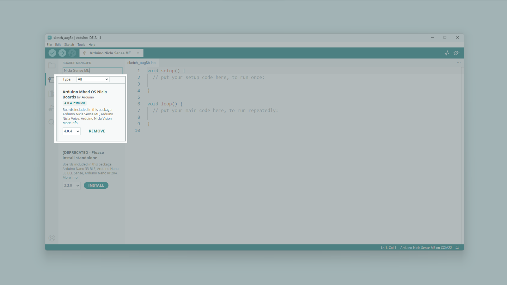

## Overview

This user manual will guide you through a practical journey covering the most interesting features of the Arduino Nicla Sense ME. With this user manual, you will learn how to set up, configure and use this Arduino board.

## Hardware and Software Requirements
### Hardware Requirements

- [Nicla Sense ME](https://store.arduino.cc/products/nicla-sense-me) (x1)
- Micro USB cable (x1)

### Software Requirements

- [Arduino IDE 1.8.10+](https://www.arduino.cc/en/software), [Arduino IDE 2.0+](https://www.arduino.cc/en/software), or [Arduino Web Editor](https://create.arduino.cc/editor)
- To create custom Machine Learning models, the integrated Machine Learning Tools of the [Arduino Cloud](https://create.arduino.cc/iot/) are needed. In case you do not have an Arduino Cloud account, you will need to create one first.

## Product Overview

Introducing the Arduino® Nicla Sense ME, our most compact design to date, housing an array of high-quality industrial grade sensors in a remarkably small package. This versatile device allows you to monitor essential process parameters like temperature, humidity, and movement accurately. Equipped with a 9-axis inertial measurement unit and the option for Bluetooth® Low Energy connectivity, it becomes an ideal choice for crafting your next Bluetooth® Low Energy enabled project. Harness the power of the onboard Bosch sensors, including BHI260AP, BMP390, BMM150, and BME688, to create your very own industrial grade wireless sensing network.

### Board Architecture Overview

The Nicla Sense ME features a robust and efficient architecture that integrates a range of sensors packed into a tiny footprint. It features four industrial grade Bosch sensors that can accurately measure rotation, acceleration, pressure, humidity, temperature, air quality and CO2 levels.

Here is an overview of the board's architecture's main components shown in the images above:

- **Microcontroller**: at the heart of the Nicla Sense ME is the nRF52832, a powerful and versatile System-on-Chip (SoC) from Nordic® Semiconductor. The nRF52832 is built around a 32-bit Arm® Cortex®-M4 processor running at 64 MHz.
- **Onboard advanced motion sensors**: the board features the BHI260AP, a smart IMU that includes a 3-axis accelerometer and a 3-axis gyroscope. It is trained with Machine Learning algorithms for step counting, position tracking, and activity recognition. The board also features the BMM150, a compact geomagnetic sensor from Bosch® Sensortec with a 3-axis magnetometer.
- **Onboard environment sensors**: the Nicla Sense ME is equipped with the BME688, this is the first gas sensor with Artificial Intelligence (AI) and integrated high-linearity and high-accuracy pressure, humidity and temperature sensors. The gas sensor can detect Volatile Organic Compounds (VOCs), volatile sulfur compounds (VSCs) and other gases such as carbon monoxide and hydrogen in the part per billion (ppb) range.
- **Wireless connectivity**: the board supports Bluetooth® Low Energy connectivity, provided by the ANNA-B112 module developed by u-blox®. This compact, high-performance Bluetooth® Low Energy module allows the Nicla Sense ME to communicate wirelessly with other devices and systems.
- **Power management**: the Nicla Sense ME is designed for ultra-low power operation, with efficient power management features that ensure minimal energy consumption even when using always-on motion recognition and environment analysis sensors. The Nicla Sense ME features the BQ25120 from Texas Instruments®; a highly integrated battery charge management integrated circuit (IC) designed for wearables and Internet of Things (IoT) devices. 

### Board Core and Libraries

The **Arduino Mbed OS Nicla Boards** core contains the libraries and examples you need to work with the board's components, such as its IMU, magnetometer, and environment sensor. To install the core for Nicla boards, navigate to **Tools > Board > Boards Manager** or click the Boards Manager icon in the left tab of the IDE. In the Boards Manager tab, search for `Nicla Sense Me` and install the latest `Arduino Mbed OS Nicla Boards` version.

### Pinout

The full pinout is available and downloadable as PDF from the link below:

- [Nicla Sense ME pinout](https://docs.arduino.cc/static/b35956b631d757a0455c286da441641b/ABX00050-full-pinout.pdf)

### Datasheet

The complete datasheet is available and downloadable as PDF from the link below:

- [Nicla Sense ME datasheet](https://docs.arduino.cc/resources/datasheets/ABX00050-datasheet.pdf)

### Schematics

The complete schematics are available and downloadable as PDF from the link below:

- [Nicla Sense ME schematics](https://docs.arduino.cc/resources/schematics/ABX00050-schematics.pdf)

### STEP Files

The complete STEP files are available and downloadable from the link below:

- [Nicla Sense ME STEP files](https://docs.arduino.cc/static/10c0953581f489a9a136ff00f2d2fa9d/ABX00050-step.zip)

## First Use
### Powering the Board
// examples using internal stuff

## Pins
### Analog Pins
### Digital Pins
### PWM Pins

## Onboard Sensors

## Actuators

## Communication
### I2C
### SPI
### UART
### Bluetooth® Low Energy
### ESLOV Connector 

## Support
### Help Center
### Forum
### Contact Us