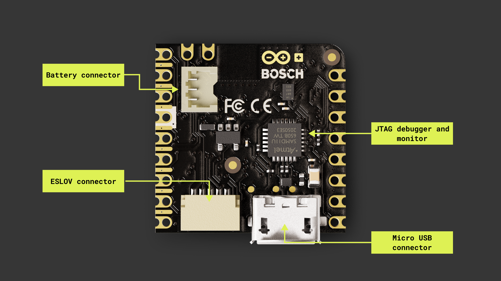

## Overview

This user manual will guide you through a practical journey covering the most interesting features of the Arduino Nicla Sense ME. With this user manual, you will learn how to set up, configure and use this Arduino board.

## Hardware and Software Requirements
### Hardware Requirements

- [Nicla Sense ME](https://store.arduino.cc/products/nicla-sense-me) (x1)
- Micro USB cable (x1)

### Software Requirements

- [Arduino IDE 1.8.10+](https://www.arduino.cc/en/software), [Arduino IDE 2.0+](https://www.arduino.cc/en/software), or [Arduino Web Editor](https://create.arduino.cc/editor)
- To create custom Machine Learning models, the integrated Machine Learning Tools of the [Arduino Cloud](https://create.arduino.cc/iot/) are needed. In case you do not have an Arduino Cloud account, you will need to create one first.

## Product Overview

Introducing the Arduino® Nicla Sense ME, our most compact design to date, housing an array of high-quality industrial grade sensors in a remarkably small package. This versatile device allows you to monitor essential process parameters like temperature, humidity, and movement accurately. Equipped with a 9-axis inertial measurement unit and the option for Bluetooth® Low Energy connectivity, it becomes an ideal choice for crafting your next Bluetooth® Low Energy enabled project. Harness the power of the onboard Bosch sensors, including BHI260AP, BMP390, BMM150, and BME688, to create your very own industrial grade wireless sensing network.

### Board Architecture Overview

The Nicla Sense ME features a robust and efficient architecture that integrates a range of sensors packed into a tiny footprint. It features four industrial grade Bosch sensors that can accurately measure rotation, acceleration, pressure, humidity, temperature, air quality and CO2 levels.

Here is an overview of the board's architecture's main components shown in the images above:

- **Microcontroller**: at the heart of the Nicla Voice is the nRF52832, a powerful and versatile System-on-Chip (SoC) from Nordic® Semiconductor. The nRF52832 is built around a 32-bit Arm® Cortex®-M4 processor running at 64 MHz.

### Board Core and Libraries
### Pinout
### Datasheet
### Schematics
### STEP Files

## First Use
### Powering the Board
// examples using internal stuff

## Pins
### Analog Pins
### Digital Pins
### PWM Pins

## Onboard Sensors

## Actuators

## Communication
### I2C
### SPI
### UART
### Bluetooth® Low Energy
### ESLOV Connector 

## Support
### Help Center
### Forum
### Contact Us