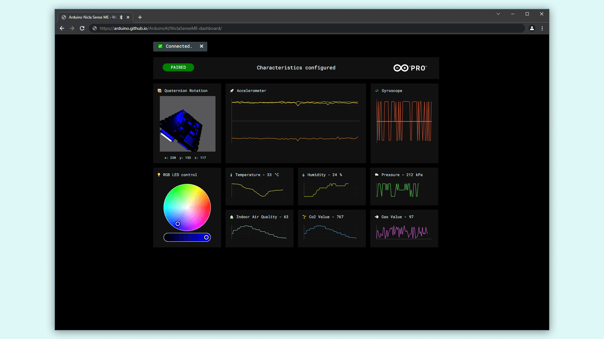

## Overview
The Arduino Nicla Sense ME can give you information about the environment such as pressure, temperature and gas readings. Sometimes, you may have to place the sensor in a hard-to-reach area and therefore want to access the data wirelessly.

Thanks to the ANNA B112 Bluetooth® chip and the libraries developed for the Nicla Sense ME, you can easily stream data over Bluetooth® to a device of your choice. By using WebBLE, no additional software other than a compatible browser (Google Chrome is recommended) is required.

To demonstrate this, we prepared a simple sketch and hosted a dashboard so you can try it yourself. 

A [previous version](https://arduino.github.io/ArduinoAI/BLESense-test-dashboard/) of this dashboard was developed to be used with the Arduino® Nano 33 BLE. You can see a video that shows how it looks [here](https://www.facebook.com/official.arduino/videos/ble-sense-test-dashboard/336762167617547/). 

In this tutorial we will focus on the Arduino® Nicla Sense ME.

## Goals

- Upload the sketch to the Arduino® Nicla Sense ME.
- Connect through Bluetooth® Low Energy to our dashboard and read sensor data.

### Required Hardware and Software

- [Nicla Sense ME](https://store.arduino.cc/products/nicla-sense-me)
- Micro USB-A cable (USB-A to Micro USB-A)
- Arduino IDE 1.8.10+, Arduino IDE 2 or Arduino Web Editor
- If you choose the Arduino IDE, you will need to install 2 libraries: `Arduino_BHY2`and `ArduinoBLE`

## Instructions

### Set up the Board

If you use the Web Editor to upload the [sketch](https://create.arduino.cc/editor/FT-CONTENT/333e2e07-ecc4-414c-bf08-005b611ddd75/preview) you don't need to install any library. They are all included automatically. If you use the Arduino IDE or the CLI, you need to download the **Arduino_BHY2** and the **ArduinoBLE** libraries.

If you use a local IDE, you can copy & paste the following sketch:
```arduino
  /*
  Arduino Nicla Sense ME WEB Bluetooth® Low Energy Sense dashboard demo
  Hardware required: https://store.arduino.cc/nicla-sense-me
  1) Upload this sketch to the Arduino Nano Bluetooth® Low Energy sense board
  2) Open the following web page in the Chrome browser:
  https://arduino.github.io/ArduinoAI/NiclaSenseME-dashboard/
  3) Click on the green button in the web page to connect the browser to the board over Bluetooth® Low Energy
  Web dashboard by D. Pajak
  Device sketch based on example by Sandeep Mistry and Massimo Banzi
  Sketch and web dashboard copy-fixed to be used with the Nicla Sense ME by Pablo Marquínez
  */

  #include "Nicla_System.h"
  #include "Arduino_BHY2.h"
  #include <ArduinoBLE.h>

  #define BLE_SENSE_UUID(val) ("19b10000-" val "-537e-4f6c-d104768a1214")

  const int VERSION = 0x00000000;

  BLEService service(BLE_SENSE_UUID("0000"));

  BLEUnsignedIntCharacteristic versionCharacteristic(BLE_SENSE_UUID("1001"), BLERead);
  BLEFloatCharacteristic temperatureCharacteristic(BLE_SENSE_UUID("2001"), BLERead);
  BLEUnsignedIntCharacteristic humidityCharacteristic(BLE_SENSE_UUID("3001"), BLERead);
  BLEFloatCharacteristic pressureCharacteristic(BLE_SENSE_UUID("4001"), BLERead);

  BLECharacteristic accelerometerCharacteristic(BLE_SENSE_UUID("5001"), BLERead | BLENotify, 3 * sizeof(float));  // Array of 3x 2 Bytes, XY
  BLECharacteristic gyroscopeCharacteristic(BLE_SENSE_UUID("6001"), BLERead | BLENotify, 3 * sizeof(float));    // Array of 3x 2 Bytes, XYZ
  BLECharacteristic quaternionCharacteristic(BLE_SENSE_UUID("7001"), BLERead | BLENotify, 4 * sizeof(float));     // Array of 4x 2 Bytes, XYZW

  BLECharacteristic rgbLedCharacteristic(BLE_SENSE_UUID("8001"), BLERead | BLEWrite, 3 * sizeof(byte)); // Array of 3 bytes, RGB

  BLEFloatCharacteristic bsecCharacteristic(BLE_SENSE_UUID("9001"), BLERead);
  BLEIntCharacteristic  co2Characteristic(BLE_SENSE_UUID("9002"), BLERead);
  BLEUnsignedIntCharacteristic gasCharacteristic(BLE_SENSE_UUID("9003"), BLERead); 

  // String to calculate the local and device name
  String name;

  Sensor temperature(SENSOR_ID_TEMP);
  Sensor humidity(SENSOR_ID_HUM);
  Sensor pressure(SENSOR_ID_BARO);
  Sensor gas(SENSOR_ID_GAS);
  SensorXYZ gyroscope(SENSOR_ID_GYRO);
  SensorXYZ accelerometer(SENSOR_ID_ACC);
  SensorQuaternion quaternion(SENSOR_ID_RV);
  SensorBSEC bsec(SENSOR_ID_BSEC);

  void setup(){
    Serial.begin(115200);

    Serial.println("Start");

    nicla::begin();
    nicla::leds.begin();
    nicla::leds.setColor(green);

    //Sensors initialization
    BHY2.begin(NICLA_STANDALONE);
    temperature.begin();
    humidity.begin();
    pressure.begin();
    gyroscope.begin();
    accelerometer.begin();
    quaternion.begin();
    bsec.begin();
    gas.begin();

    if (!BLE.begin()){
      Serial.println("Failed to initialized BLE!");

      while (1)
        ;
    }

    String address = BLE.address();

    Serial.print("address = ");
    Serial.println(address);

    address.toUpperCase();

    name = "BLESense-";
    name += address[address.length() - 5];
    name += address[address.length() - 4];
    name += address[address.length() - 2];
    name += address[address.length() - 1];

    Serial.print("name = ");
    Serial.println(name);

    BLE.setLocalName(name.c_str());
    BLE.setDeviceName(name.c_str());
    BLE.setAdvertisedService(service);

    // Add all the previously defined Characteristics
    service.addCharacteristic(temperatureCharacteristic);
    service.addCharacteristic(humidityCharacteristic);
    service.addCharacteristic(pressureCharacteristic);
    service.addCharacteristic(versionCharacteristic);
    service.addCharacteristic(accelerometerCharacteristic);
    service.addCharacteristic(gyroscopeCharacteristic);
    service.addCharacteristic(quaternionCharacteristic);
    service.addCharacteristic(bsecCharacteristic);
    service.addCharacteristic(co2Characteristic);
    service.addCharacteristic(gasCharacteristic);
    service.addCharacteristic(rgbLedCharacteristic);

    // Disconnect event handler
    BLE.setEventHandler(BLEDisconnected, blePeripheralDisconnectHandler);
    
    // Sensors event handlers
    temperatureCharacteristic.setEventHandler(BLERead, onTemperatureCharacteristicRead);
    humidityCharacteristic.setEventHandler(BLERead, onHumidityCharacteristicRead);
    pressureCharacteristic.setEventHandler(BLERead, onPressureCharacteristicRead);
    bsecCharacteristic.setEventHandler(BLERead, onBsecCharacteristicRead);
    co2Characteristic.setEventHandler(BLERead, onCo2CharacteristicRead);
    gasCharacteristic.setEventHandler(BLERead, onGasCharacteristicRead);

    rgbLedCharacteristic.setEventHandler(BLEWritten, onRgbLedCharacteristicWrite);

    versionCharacteristic.setValue(VERSION);

    BLE.addService(service);
    BLE.advertise();
  }

  void loop(){
    while (BLE.connected()){
      BHY2.update();

      if (gyroscopeCharacteristic.subscribed()){
        float x, y, z;

        x = gyroscope.x();
        y = gyroscope.y();
        z = gyroscope.z();

        float gyroscopeValues[3] = {x, y, z};

        gyroscopeCharacteristic.writeValue(gyroscopeValues, sizeof(gyroscopeValues));
      }

      if (accelerometerCharacteristic.subscribed()){
        float x, y, z;
        x = accelerometer.x();
        y = accelerometer.y();
        z = accelerometer.z();

        float accelerometerValues[] = {x, y, z};
        accelerometerCharacteristic.writeValue(accelerometerValues, sizeof(accelerometerValues));
      }

      if(quaternionCharacteristic.subscribed()){
        float x, y, z, w;
        x = quaternion.x();
        y = quaternion.y();
        z = quaternion.z();
        w = quaternion.w();

        float quaternionValues[] = {x,y,z,w};
        quaternionCharacteristic.writeValue(quaternionValues, sizeof(quaternionValues));
      }

    }
  }

  void blePeripheralDisconnectHandler(BLEDevice central){
    nicla::leds.setColor(red);
  }

  void onTemperatureCharacteristicRead(BLEDevice central, BLECharacteristic characteristic){
    float temperatureValue = temperature.value();
    temperatureCharacteristic.writeValue(temperatureValue);
  }

  void onHumidityCharacteristicRead(BLEDevice central, BLECharacteristic characteristic){
    uint8_t humidityValue = humidity.value() + 0.5f;  //since we are truncating the float type to a uint8_t, we want to round it
    humidityCharacteristic.writeValue(humidityValue);
  }

  void onPressureCharacteristicRead(BLEDevice central, BLECharacteristic characteristic){
    float pressureValue = pressure.value();
    pressureCharacteristic.writeValue(pressureValue);
  }

  void onBsecCharacteristicRead(BLEDevice central, BLECharacteristic characteristic){
    float airQuality = float(bsec.iaq());
    bsecCharacteristic.writeValue(airQuality);
  }

  void onCo2CharacteristicRead(BLEDevice central, BLECharacteristic characteristic){
    uint32_t co2 = bsec.co2_eq();
    co2Characteristic.writeValue(co2);
  }

  void onGasCharacteristicRead(BLEDevice central, BLECharacteristic characteristic){
    unsigned int g = gas.value();
    gasCharacteristic.writeValue(g);
  }

  void onRgbLedCharacteristicWrite(BLEDevice central, BLECharacteristic characteristic){
    byte r = rgbLedCharacteristic[0];
    byte g = rgbLedCharacteristic[1];
    byte b = rgbLedCharacteristic[2];

    nicla::leds.setColor(r, g, b);
  }
```

### Connect to the Dashboard

Once you uploaded the sketch to your board you can open the [Nicla Sense ME Dashboard](https://arduino.github.io/ArduinoAI/NiclaSenseME-dashboard/). If you're interested in the source code, you can have a look at the [repository](https://github.com/arduino/ArduinoAI).



To connect your board to the dashboard, you will need to click on the top left button which says "Connect Board". A pop up will be displayed in your browser and it starts searching for Bluetooth® devices. This application leverages the WebBLE functionality of your browser.


***For this feature to work, make sure that WebBLE is both supported and enabled! In Google Chrome go to <chrome://flags> and enable "Experimental Web Platform features". Check the website [compatibility list](https://developer.mozilla.org/en-US/docs/Web/API/Web_Bluetooth_API#browser_compatibility) to confirm that your browser supports this feature***

Once it is connected, the button will change its color to green, and the graphs will start to show data in real time.

Try to rotate the board and see the 3D model of the board spin.

You can also select a different LED color from the bottom left widget.

Breathe onto the board and see the humidity and temperature values changing.


## Conclusion

The Nicla Sense ME supports a lot of use cases through its on-board sensors and the Bluetooth® Low Energy functionality. By leveraging the WebBLE API you do not need to install or run any application from your computer as shown in this tutorial. You can read more about WebBLE technology [here](https://web.dev/bluetooth/).
