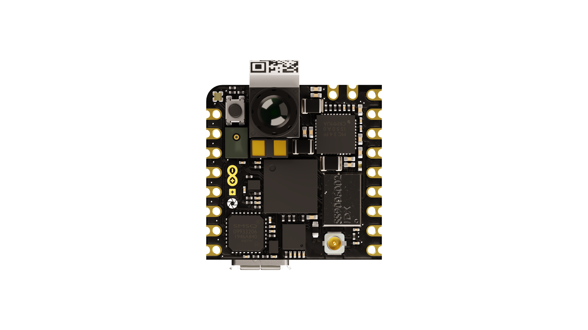
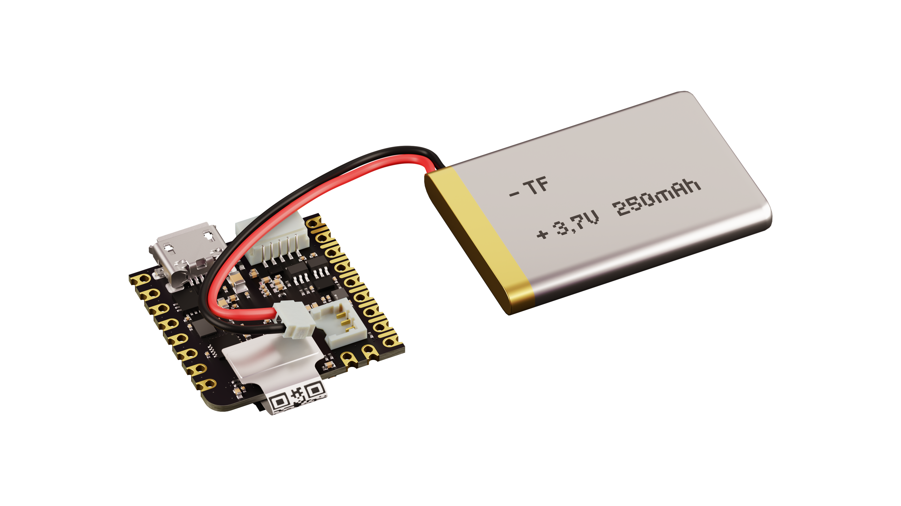
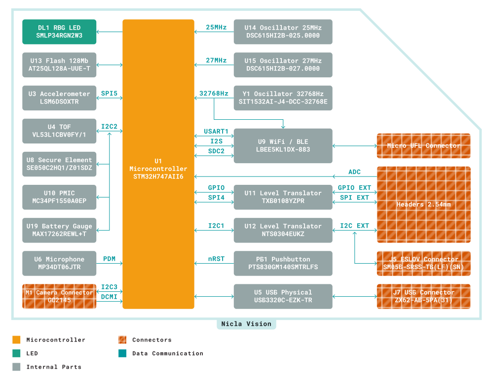
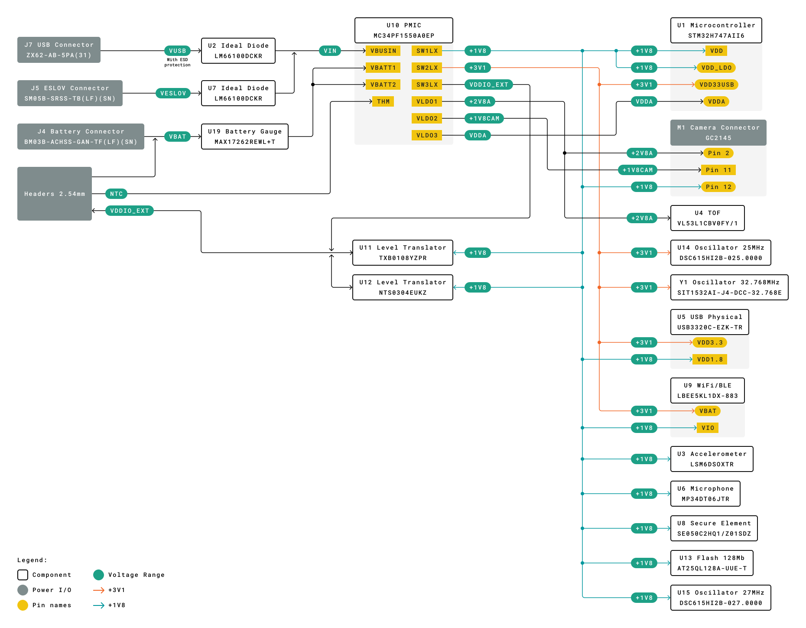
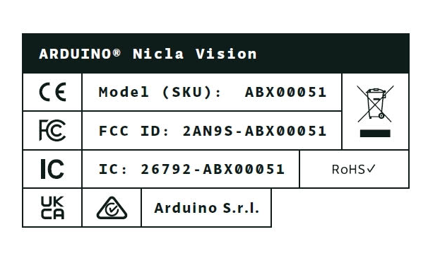
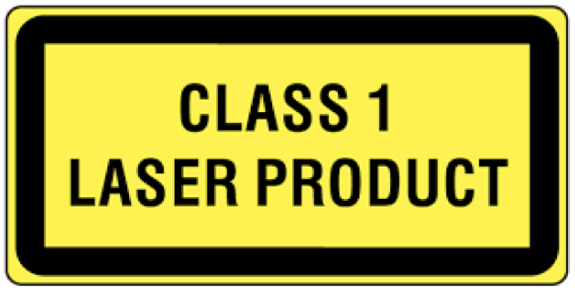

# Description

The **Arduino® Nicla Vision** packs machine vision capabilities on the edge into a tiny fingerprint. Record, analyze and upload to the Cloud with the help of one **Arduino® Nicla Vision**. Leverage the onboard camera, STM32 microcontroller, Wi-Fi®/Bluetooth® module and 6-axis IMU to create your wireless sensor network for machine vision applications.

# Target Areas

Wireless sensor networks, data fusion, artificial intelligence, machine vision

# Features

- **STM32H747AII6** Microcontroller
Dual-core
  - 32-bit Arm® Cortex®-M7 core with double-precision FPU and L1 cache up to 480 MHz
  - 32-bit Arm® 32-bit Cortex®-M4 core with FPU up to 240 MHz
  - Full set of DSP instructions
  - Memory Protection Unit (MPU)
- **Murata® 1DX** Wi-Fi®/Bluetooth® Module
  - Wi-Fi® 802.11b/g/n 65 Mbps
  - Bluetooth® 4.2 BR/EDR/LE
- **MAX17262REWL+T** Fuel Gauge
  - Implements ModelGauge m5 EZ for battery monitoring
  - Low 5.2 μA Operating Current
  - No Calibration Required
- **NXP® SE050C2** Crypto
  - Common Criteria EAL 6+ certified up to OS level
  - RSA & ECC functionalities, high key lengths and future-proof curves, such as brainpool, Edwards, and Montgomery
  - AES & 3DES encryption and decryption
  - HMAC, CMAC, SHA-1, SHA-224/256/384/512 operations
  - HKDF, MIFARE® KDF, PRF (TLS-PSK)
  - Support of main TPM functionalities
  - Secured flash user memory up to 50 kB
  - SCP03 (bus encryption and encrypted credential injection on applet and platform level)
- **VL53L1CBV0FY/1** Time-of-Flight Sensor
  - Fully integrated miniature module
  - 940 nm invisible laser (VCSEL) emitter
  - Receiving array with integrated lens
  - 400 cm detection with a full field of view (FoV)
- **MP34DT06JTR** Microphone
  - AOP = 122.5 dBSPL
  - 64 dB signal-to-noise ratio
  - Omnidirectional sensitivity
  - –26 dBFS ± 1 dB sensitivity
- **GC2145** Camera
  - 2 Megapixel CMOS Camera
  - on-chip 10-bit ADC
  - 1.75 μm pixel size
  - Focal length: 2.2 mm
  - F-value: 2.2 ± 5%
  - View angle: 80°
  - Distortion: &lt; 1.0%
- **LSM6DSOX** 6-axis IMU
  - Always-on 3D accelerometer and 3D gyroscope
  - Smart FIFO up to 4 kByte
  - ±2/±4/±8/±16 g full scale
  - ±125/±250/±500/±1000/±2000 dps full scale
- **USB3320C-EZK-TR** USB Transceiver
  - Integrated ESD Protection circuit (up to ±15 kV IEC Air Discharge)
- **AT25QL128A-UUE-T** 16 MB Flash
- **MC34PF1550A0EP** Power Management IC

# Contents

## Introduction

### Application Examples

The **Arduino® Nicla Vision** houses the computational power, camera and IMU you need to quickly develop machine vision solutions at the edge, along with two wireless technologies. The board can function as a field-ready standalone board or be extended with external peripherals through the I/O available on the chip. Ultra-low power consumption and integrated battery management allow for deployment in various capabilities. WebBLE allows for easy OTA updates to the firmware as well as remote monitoring.

- **Warehouse & Automated Inventory Management**:
The **Arduino Nicla Vision** can detect packages as they approach and activate accordingly. This provides the benefits of an always-on camera with reduced power consumption. It can take pictures, estimate volume/weight, and check for potential defects. Package QR codes can also be tracked for automated follow-up and data transmission to the Cloud.

- **Real-time process management**:
The **Arduino Nicla Vision** is well-suited for Automated Optical Inspection (AOI), even in challenging or hazardous environments, thanks to the small footprint and wireless connectivity options. The fast Time-of-Flight sensor ensures consistent image capture with minimal impact on the process. Additionally, the IMU can provide vibration analysis for predictive maintenance purposes.

- **Wireless Sensor Network Reference Design**:
The Nicla form factor has been specifically developed at Arduino® as a standard for wireless sensor networks, allowing partners to build custom industrial solutions. Researchers and educators can use this platform to work on an industrially recognized standard in wireless sensor research and development, helping to reduce the time from concept to market.

### Accessories (Not Included)

* Single-cell Li-ion/Li-Po battery

### Related Products

- Arduino® Portenta H7 (SKU: ABX00042)

### Assembly Overview

**Note**: The NTC pin on the battery connector is optional. This feature allows safer use and thermal shutoff of the PMIC.

## Ratings

### Recommended Operating Conditions

| Symbol               | Description                      | Min                      | Typ | Max                      | Unit |
|----------------------|----------------------------------|--------------------------|-----|--------------------------|------|
| VIN       | Input voltage from VIN pad       | 3.5                      | 5.0 | 5.5                      | V    |
| VUSB      | Input voltage from USB connector | 4.8                      | 5.0 | 5.5                      | V    |
| VBATT     | Input voltage from battery       | 3.5                      | 3.7 | 4.7                      | V    |
| VDDIO_EXT | Level Translator Voltage         | 1.8                      | 3.3 | 3.3                      | V    |
| VIH       | Input high-level voltage         | 0.7*VDDIO_EXT |     | VDDIO_EXT     | V    |
| VIL       | Input low-level voltage          | 0                        |     | 0.3*VDDIO_EXT | V    |
| TOP       | Operating Temperature            | -40                      | 25  | 85                       | °C   |

**Note 1:** VDDIO_EXT is software programmable.  While the ADC inputs can accept up to 3.3V, the AREF value is at the STM32 operating voltage.

**Note 2:** If the internal VDDIO_EXT is disabled, it is possible to supply it externally.

### Power Consumption

| Description                                                 | Min | Typ | Max | Unit |
|-------------------------------------------------------------|-----|-----|-----|------|
| Average current consumption in deep sleep mode              |     | 374 |     | uA   |
| Average current consumption during image capture            |     | 105 |     | mA   |

**Note:** The measurements have been performed with a battery power supply (200mAh Li-ion battery) and OpenMV IDE firmware version 4.3.4.

## Functional Overview

### Block Diagram

### Board Topology

**Top View**

| **Ref.**   | **Description**                                                         | **Ref.** | **Description**                                                         |
|------------|-------------------------------------------------------------------------|----------|-------------------------------------------------------------------------|
| U1         | STM32H747AII6 Dual-core Arm® Cortex®-M7/M4 microcontroller              | U4       | VL53L1CBV0FY/1 Time-of-Flight long distance ranging sensor              |
| U5         | USB3320C-EZK-TR Hi-Speed USB 2.0 ULPI Transceiver                       | U6       | MP34DT06J MEMS omnidirectional digital microphone                       |
| U9         | LBEE5KL1DX-883 Type 1DX Wi-Fi® + Bluetooth® module w/ Infineon CYW4343W | U10      | MC34PF1550A0EP Power Management Integrated Circuit (PMIC)               |
| U13        | AT25QL128A-UUE-T 128 Mbit Quad SPI flash memory                         | U14      | DSC6151HI2B-025.0000 25 MHz Ultra-Low Power MEMS Oscillator             |
| U15        | DSC6151HI2B-027.0000T 27 MHz Ultra-Low Power MEMS Oscillator            | L6       | LQM18PN2R2MGHD 2.2 µH fixed surface-mount inductor                      |
| L9,L10,L11 | DFE201610P-1R0M=P2 1 µH fixed surface-mount inductor                    | PB1      | PTS830GM140-SMTR-LFS Tactile switch, surface-mount, 3.5mm, Reset button |
| J6         | U.FL-R-SMT-1(60) Male micro UFL surface-mount coaxial connector         | DL1      | SMLP34RGB2W3 RGB SMD LED                                                |
| DL2        | KPHHS-1005SURCK 0402 SMD red LED                                        | J1       | ADC, SPI and LPIO pin headers                                           |
| J2         | I2C, JTAG, Power and LPIO pin headers                                   | J3       | Battery connection pin headers                                          |
| M1         | GC2145 2 Megapixel CMOS Camera                                          |

**Back View**

| **Ref.** | **Description**                                                                            | **Ref.** | **Description**                                                                                  |
|----------|--------------------------------------------------------------------------------------------|----------|--------------------------------------------------------------------------------------------------|
| U2,U7    | LM66100DCKR Low-IQ Ideal Diode 5.5 V, 1.5 A, 79 mΩ                                         | U3       | LSM6DSOXTR 6-axis IMU with Embedded ML Core                                                      |
| U8       | SE050C2HQ1/Z01SDZ IoT Secure Element IC                                                    | U11      | TXB0108YZPR 8-bit bidirectional voltage-level translator                                         |
| U12      | NTS0304EUKZ 4-bit dual-supply translating transceiver with open-drain                      | U19      | MAX17262REWL+T 5.2 µA 1-Cell fuel gauge with internal current sensing                            |
| L3       | MLF1608C330KTD00 33 µH shielded multilayer inductor, 2 mA, 2.2 Ohm max, 0603 surface-mount | D1       | PRTR5V0U2F,115 bidirectional TVS diode array, 2-channel ESD protection for high-speed data lines |
| Y1       | SiT1532AI-J4-DCC-32.768E 32.768 kHz XO (Standard) LVCMOS MEMS oscillator                   | J4       | BM03B-ACHSS-GAN-TF(LF)(SN) 3-pin battery connector, 1.2mm pitch, wire-to-board, surface-mount    |
| J5       | SM05B-SRSS-TB(LF)(SN) 5-pin ESLOV connector, 1.0mm pitch, wire-to-board, surface-mount     | J7       | ZX62-AB-5PA(31) 5-position micro USB connector, surface-mount, right-angle, with shielded shell  |
| J8       | 505550-2420 24-position SlimStack board-to-board receptacle, 0.40mm pitch, surface-mount   |

### Processor

The Nicla Vision's main processor is the dual-core STM32H747 (U1), which includes a Cortex® M7 running at 480 MHz and a Cortex® M4 running at 240 MHz. The two cores communicate via a Remote Procedure Call mechanism, which allows functions to be called on the other processor seamlessly.

### 6-Axis IMU

It is possible to obtain 3D gyroscope and 3D accelerometer data from the LSM6DSOX 6-axis IMU (U3). In addition to providing such data, machine learning on the IMU for gesture detection can be done, offloading computation load from the main processor.

### Wi-Fi®/Bluetooth® Connectivity

The Murata® LBEE5KL1DX-883 wireless module (U9) simultaneously provides Wi-Fi® and Bluetooth® connectivity in an ultra-small package based on the Cypress CYW4343W. The IEEE802.11 b/g/n Wi-Fi® interface can be operated as an access point (AP), station (STA) or dual-mode simultaneous AP/STA. It supports a maximum transfer rate of 65 Mbps. Bluetooth® interface supports Bluetooth® Classic and BLE. An integrated antenna circuitry switch allows a single external antenna (J6) to be shared between Wi-Fi® and Bluetooth®.

### Crypto Capabilities

The Arduino® Nicla Vision enables IC-level edge-to-cloud security capability through the NXP SE050C2 Crypto chip (U8). This provides Common Criteria EAL 6+ security certification up to OS level, RSA/ECC cryptographic algorithm support, and credential storage.

### Time of Flight Sensor

The VL53L1CBV0FY Time-of-Flight sensor (U4) adds accurate and low power ranging capabilities to the Arduino® Nicla Vision. The invisible near-infrared VCSEL laser (including the analog driver) is encapsulated with receiving optics in an all-in-one small module below the camera.

### Digital Microphones

The MP34DT05 digital MEMS microphone is omnidirectional and operates via a capacitive sensing element with a high (64 dB) signal-to-noise ratio. The sensing element, capable of detecting acoustic waves, is manufactured using a specialized silicon micromachining process dedicated to producing audio sensors (U6).

### Power Tree

Input voltage can be provided to the Nicla Vision through the USB connector (J7), the ESLOV connector (J5), the battery connector (J4) or the headers. The USB connector is prioritized over the ESLOV connector, both of which are prioritized over the battery connector and header. Reverse polarity protection for the USB connector (J7) and the ESLOV connector (J5) is provided by ideal diodes U2 and U7 respectively. Input voltage from the battery does NOT have reverse polarity protection and the user is responsible for respecting the polarity.

An NTC (negative thermal coefficient) sensor provides overtemperature shutoff to the battery. The battery fuel gauge provides an indication of the remaining battery capacity.

There are three main power lines provided:

- **+3V1** provides power to the microprocessor (U1), 25 MHz oscillator (U14), 32.768 kHz oscillator (Y1), USB transceiver (U5) and Wi-Fi®/Bluetooth® module.
- **+2V8A** provides power to the camera (M1) and time-of-flight sensor (U4)
- **+1V8** provides power to the microprocessor (U1), camera (M1), USB transceiver (U5), Wi-Fi®/Bluetooth® module (U9), accelerometer (U3), microphone (U6), crypto (U8), FLASH (U13), 27 MHz oscillator (U15) as well as the two level translators (U11, U12).

- Additionally, a dedicated analog supply rail (VDDA) is provided for the microcontroller (U1). The camera module (M1) also has a dedicated power rail (+1V8CAM).

## Board Operation

### Getting Started - IDE

If you want to program your Arduino® Nicla Vision while offline, you need to install the Arduino® Desktop IDE **[1]**. To connect the Arduino® Vision to your computer, you will need a micro USB cable. This also provides power to the board, as indicated by the LED.

### Getting Started - Arduino Cloud Editor

All Arduino® boards, including this one, work out-of-the-box on the Arduino® Cloud Editor **[2]** by installing a simple plugin.

The Arduino® Cloud Editor is hosted online. Therefore, it will always be up-to-date with all the latest features and support of the boards. Follow **[3]** to start coding in the browser and upload your sketches to your board.

### Getting Started - Arduino Cloud

All Arduino® IoT enabled products are supported on Arduino® Cloud, which allows you to log, graph and analyze sensor data, trigger events, and automate your home or business.

### Getting Started - WebBLE

The Arduino Nicla Vision provides the capability for OTA updates to the STM32 microcontroller using WebBLE.

### Getting Started - ESLOV

This board can function as a secondary to an ESLOV controller and update the firmware through this method.

### Sample Sketches

Sample sketches for the Arduino® Nicla Vision can be found either in the “Examples” menu in the Arduino® IDE or on the Arduino® documentation website **[4]**

### Online Resources

Now that you have learned the basics of what you can do with the board, you can explore its endless possibilities by checking out exciting projects on ProjectHub **[5]**, the Arduino® Library Reference **[6]**, and the online store **[7]**, where you can complement your board with sensors, actuators, and more.

### Board Recovery

All Arduino® boards have a built-in bootloader, which allows flashing the board via USB. In case a sketch locks up the processor and the board is no longer reachable via USB, it is possible to enter bootloader mode by double-tapping the reset button right after a power-up.

## Connector Pinouts

**Note 1:** All the pins on J1 and J2 (excluding fins) are referenced to the VDDIO_EXT voltage which can be generated internally or supplied externally.
**Note 2:** I2C1 is connected to the level translator U12 which has internal 10k pullups. R9 and R10 pull-up resistors are not mounted on the board.

### J1 Pin Connector

| Pin | **Function** | **Type** | **Description**                    |
|-----|--------------|----------|------------------------------------|
| 1   | D0/LPIO0     | Digital  | Digital IO 0 / Low Power IO Pin 0  |
| 2   | A2/D18       | Analog   | Analog Input 2 / Digital IO 18     |
| 3   | SS           | Digital  | SPI Slave Select                   |
| 4   | COPI         | Digital  | SPI Controller Out / Peripheral In |
| 5   | CIPO         | Digital  | SPI Controller In / Peripheral Out |
| 6   | SCK          | Digital  | SPI Clock                          |
| 7   | A1/D17       | Analog   | Analog Input 1 / Digital IO 17     |
| 8   | A0/D16       | Analog   | Analog Input 0 / Digital IO 16     |

### J2 Pin Header

| Pin |    **Function**     | **Type** |                       **Description**                        |
|-----|---------------------|----------|--------------------------------------------------------------|
| 1   | SDA                 | Digital  | I2C Data Line                                                |
| 2   | SCL                 | Digital  | I2C Clock                                                    |
| 3   | D1/LPIO1/UART_TX    | Digital  | Digital IO 1 / Low Power IO Pin 1 / Serial Transmission Pin  |
| 4   | D2/LPIO2/UART_RX    | Digital  | Digital IO 2 / Low Power IO Pin 2 / Serial Reception Pin     |
| 5   | D3/LPIO3            | Digital  | Digital IO 3 / Low Power IO Pin 3                            |
| 6   | GND                 | Power    | Ground                                                       |
| 7   | VDDIO_EXT           | Digital  | Logic Level Reference                                        |
| 8   | N/C                 | N/A      | N/A                                                          |
| 9   | VIN                 | Digital  | Input Voltage                                                |

**Note:** For further information on how Low Power I/Os work, check [Nicla Family Form Factor](https://docs.arduino.cc/learn/hardware/nicla-form-factor) documentation.

### J2 Fins

| Pin | **Function** | **Type** | **Description**              |
|-----|--------------|----------|------------------------------|
| P1  | SDA_PMIC     | Digital  | PMIC I2C Data Line           |
| P2  | SCL_PMIC     | Digital  | PMIC I2C Clock Line          |
| P3  | TDO/SWD      | Digital  | Data SWD JTAG Interface      |
| P4  | TCK/SCK      | Digital  | Clock of SWD JTAG            |
| P5  | TMS/NRST     | Digital  | Reset Pin                    |
| P6  | SWO          | Digital  | Output of SWD JTAG Interface |
| P7  | +1V8         | Power    | +1.8V Voltage Rail           |
| P8  | VOTP_PMIC    | Digital  | Reserved                     |

### J3 Battery Pads

| Pin | **Function** | **Type** | **Description** |
|-----|--------------|----------|-----------------|
| 1   | VBAT         | Power    | Battery input   |
| 2   | NTC          | Analog   | NTC Thermistor  |

### J4 Battery Connector

| Pin | **Function** | **Type** | **Description** |
|-----|--------------|----------|-----------------|
| 1   | VBAT         | Power    | Battery input   |
| 2   | NTC          | Analog   | NTC Thermistor  |
| 3   | GND          | Power    | Ground          |

### J5 ESLOV

| Pin | **Function** | **Type** | **Description** |
|-----|--------------|----------|-----------------|
| 1   | 5V           | Power    | 5V Power Rail   |
| 2   | INT          | Digital  | Digital IO      |
| 3   | SCL          | Digital  | I2C Clock Line  |
| 4   | SDA          | Digital  | I2C Data Line   |
| 5   | GND          | Power    | Ground          |

## Mechanical Information

## Certifications

### Product Labeling

The product labeling of the Arduino Nicla Vision is shown in the image below:

### Declaration of Conformity CE DoC (EU)

We declare under our sole responsibility that the products above are in conformity with the essential requirements of the following EU Directives and therefore qualify for free movement within markets comprising the European Union (EU) and European Economic Area (EEA).

### Declaration of Conformity to EU RoHS & REACH 211 01/19/2021

Arduino boards are in compliance with RoHS 2 Directive 2011/65/EU of the European Parliament and RoHS 3 Directive 2015/863/EU of the Council of 4 June 2015 on the restriction of the use of certain hazardous substances in electrical and electronic equipment.

| **Substance**                          | **Maximum Limit (ppm)** |
| -------------------------------------- | ----------------------- |
| Lead (Pb)                              | 1000                    |
| Cadmium (Cd)                           | 100                     |
| Mercury (Hg)                           | 1000                    |
| Hexavalent Chromium (Cr6+)             | 1000                    |
| Poly Brominated Biphenyls (PBB)        | 1000                    |
| Poly Brominated Diphenyl ethers (PBDE) | 1000                    |
| Bis(2-Ethylhexyl} phthalate (DEHP)     | 1000                    |
| Benzyl butyl phthalate (BBP)           | 1000                    |
| Dibutyl phthalate (DBP)                | 1000                    |
| Diisobutyl phthalate (DIBP)            | 1000                    |

Exemptions : No exemptions are claimed.

Arduino Boards are fully compliant with the related requirements of European Union Regulation (EC) 1907 /2006 concerning the Registration, Evaluation, Authorization and Restriction of Chemicals (REACH). We declare none of the SVHCs (<https://echa.europa.eu/web/guest/candidate-list-table>), the Candidate List of Substances of Very High Concern for authorization currently released by ECHA, is present in all products (and also package) in quantities totaling in a concentration equal or above 0.1%. To the best of our knowledge, we also declare that our products do not contain any of the substances listed on the "Authorization List" (Annex XIV of the REACH regulations) and Substances of Very High Concern (SVHC) in any significant amounts as specified by the Annex XVII of Candidate list published by ECHA (European Chemical Agency) 1907 /2006/EC.

### Conflict Minerals Declaration

As a global supplier of electronic and electrical components, Arduino is aware of our obligations with regards to laws and regulations regarding Conflict Minerals, specifically the Dodd-Frank Wall Street Reform and Consumer Protection Act, Section 1502. Arduino does not directly source or process conflict minerals such as Tin, Tantalum, Tungsten, or Gold. Conflict minerals are contained in our products in the form of solder, or as a component in metal alloys. As part of our reasonable due diligence Arduino has contacted component suppliers within our supply chain to verify their continued compliance with the regulations. Based on the information received thus far we declare that our products contain Conflict Minerals sourced from conflict-free areas.

## FCC Caution

Any Changes or modifications not expressly approved by the party responsible for compliance could void the user’s authority to operate the equipment.

This device complies with part 15 of the FCC Rules. Operation is subject to the following two conditions:

(1) This device may not cause harmful interference

(2) this device must accept any interference received, including interference that may cause undesired operation.

**FCC RF Radiation Exposure Statement:**

1. This Transmitter must not be co-located or operating in conjunction with any other antenna or transmitter.

2. This equipment complies with RF radiation exposure limits set forth for an uncontrolled environment.

3. This equipment should be installed and operated with a minimum distance of 20cm between the radiator & your body.

**Note:** This equipment has been tested and found to comply with the limits for a Class B digital
device, pursuant to part 15 of the FCC Rules. These limits are designed to provide
reasonable protection against harmful interference in a residential installation. This equipment
generates, uses and can radiate radio frequency energy and, if not installed and used in
accordance with the instructions, may cause harmful interference to radio communications.
However, there is no guarantee that interference will not occur in a particular installation. If
this equipment does cause harmful interference to radio or television reception, which can be
determined by turning the equipment off and on, the user is encouraged to try to correct the
interference by one or more of the following measures:
- Reorient or relocate the receiving antenna.
- Increase the separation between the equipment and receiver.
- Connect the equipment into an outlet on a circuit different from that to which the
receiver is connected.
- Consult the dealer or an experienced radio/TV technician for help.

English:
User manuals for license-exempt radio apparatus shall contain the following or equivalent notice in a conspicuous location in the user manual or alternatively on the device or both. This device complies with Industry Canada license-exempt RSS standard(s). Operation is subject to the following two conditions:

(1) this device may not cause interference

(2) this device must accept any interference, including interference that may cause undesired operation of the device.

French:
Le présent appareil est conforme aux CNR d’Industrie Canada applicables aux appareils radio exempts de license. L’exploitation est autorisée aux deux conditions suivantes:

(1) l’appareil nedoit pas produire de brouillage

(2) l’utilisateur de l’appareil doit accepter tout brouillage radioélectrique subi, même si le brouillage est susceptible d’en compromettre le fonctionnement.

**IC SAR Warning:**

English
This equipment should be installed and operated with a minimum distance of 20 cm between the radiator and your body.

French:
Lors de l’ installation et de l’ exploitation de ce dispositif, la distance entre le radiateur et le corps est d ’au moins 20 cm.

**Important:** The operating temperature of the EUT can’t exceed 85℃ and shouldn’t be lower than -40℃.

Hereby, Arduino S.r.l. declares that this product is in compliance with essential requirements and other relevant provisions of Directive 201453/EU. This product is allowed to be used in all EU member states.

| Frequency bands                 | Maximum Output Power |
| ------------------------------- | -------------------- |
| 2402 MHz ~ 2480 MHz (EDR)       | -0.21 dBm            |
| 2402 MHz ~ 2480 MHz (BLE)       | 4.79 dBm             |
| 2412 MHz ~ 2462 MHz (2.4GHz WiFi) | 16.21 dBm            |

## Laser Safety Information
This product contains a laser emitter and corresponding drive circuitry. The laser output is designed to meet **Class 1 laser safety limits** under all reasonably foreseeable conditions including single faults, in compliance with **IEC 60825-1:2014**.
Do not increase the laser output power by any means. Do not use any optics to focus the laser beam.
**Caution:**  
Use of controls or adjustments, or performance of procedures other than those specified herein may result in hazardous radiation exposure.

## Company Information

| Company name    | Arduino S.r.l.                               |
| --------------- | -------------------------------------------- |
| Company Address | Via Andrea Appiani, 25 - 20900 MONZA (Italy) |

## Reference Documentation

| Ref                                | Link                                                                                                  |
| ---------------------------------- | ----------------------------------------------------------------------------------------------------- |
| Arduino® IDE (Desktop)             | <https://www.arduino.cc/en/Main/Software>                                                             |
| Arduino® IDE (Cloud)               | <https://create.arduino.cc/editor>                                                                    |
| Arduino® Cloud IDE Getting Started | <https://create.arduino.cc/projecthub/Arduino_Genuino/getting-started-with-arduino-web-editor-4b3e4a> |
| Arduino® Pro Website               | <https://www.arduino.cc/pro>                                                                          |
| Online Store                       | <https://store.arduino.cc/>                                                                           |

## Revision History

| **Date**   | **Revision** | **Changes**                                              |
|------------|--------------|----------------------------------------------------------|
| 01/10/2024 | 8            | Board Topology & general documentation update            |
| 03/09/2024 | 7            | Cloud Editor updated from Web Editor                     |
| 10/04/2024 | 6            | Product Labeling section added - FCC information updated |
| 28/03/2024 | 5            | FCC Warning Updated, small fixes                         |
| 05/12/2023 | 4            | Accessories section updated                              |
| 27/01/2023 | 3            | Add power consumption information                        |
| 10/01/2023 | 2            | Updated information and fixes                            |
| 03/09/2021 | 1            | Initial Version                                          |
