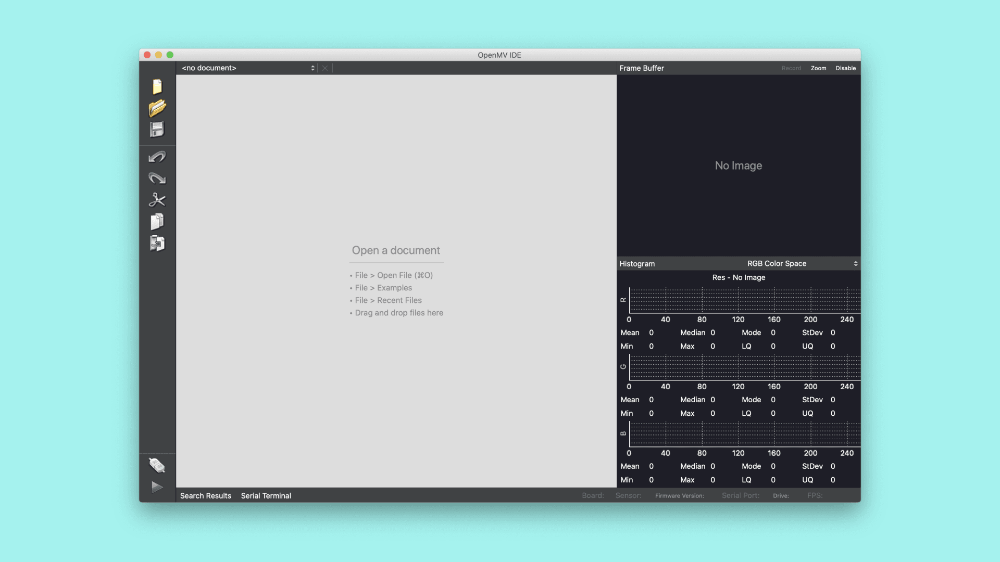
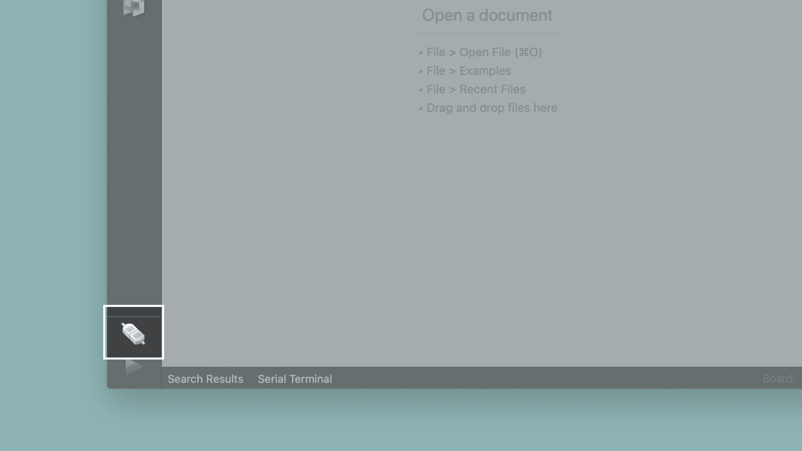
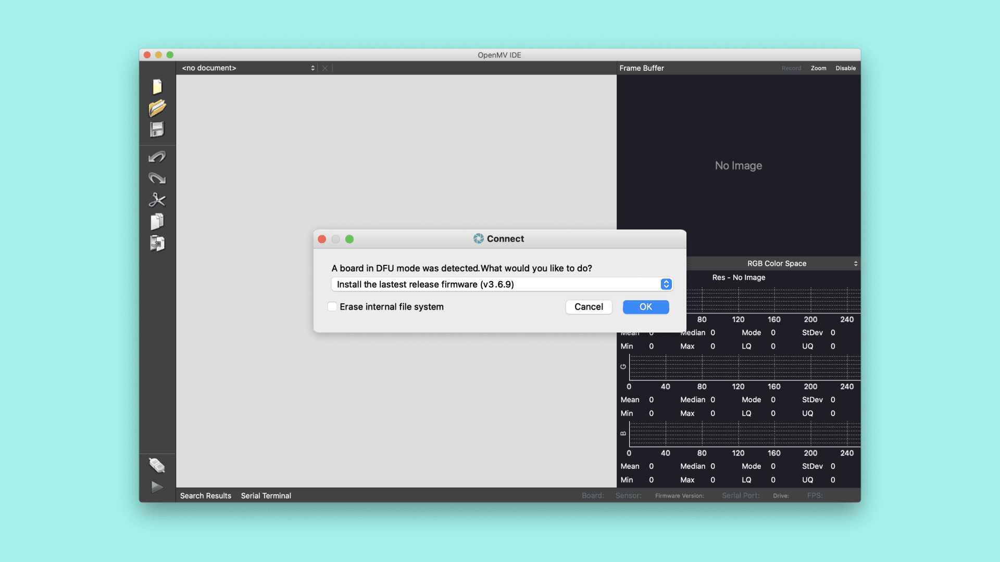
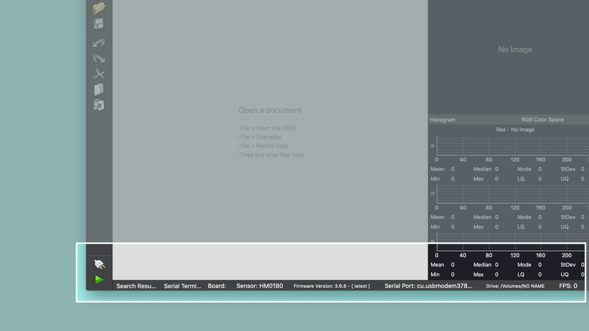
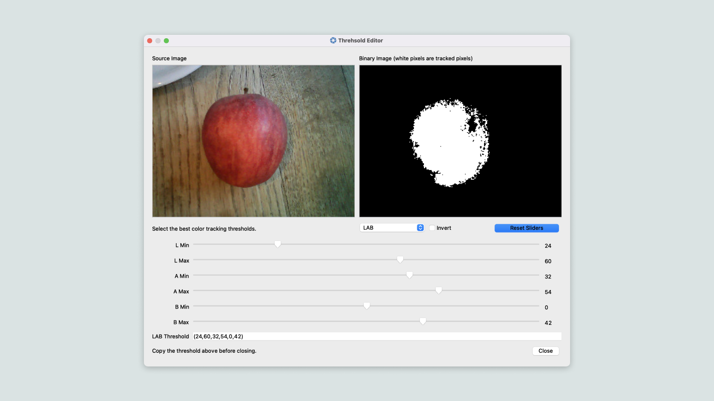
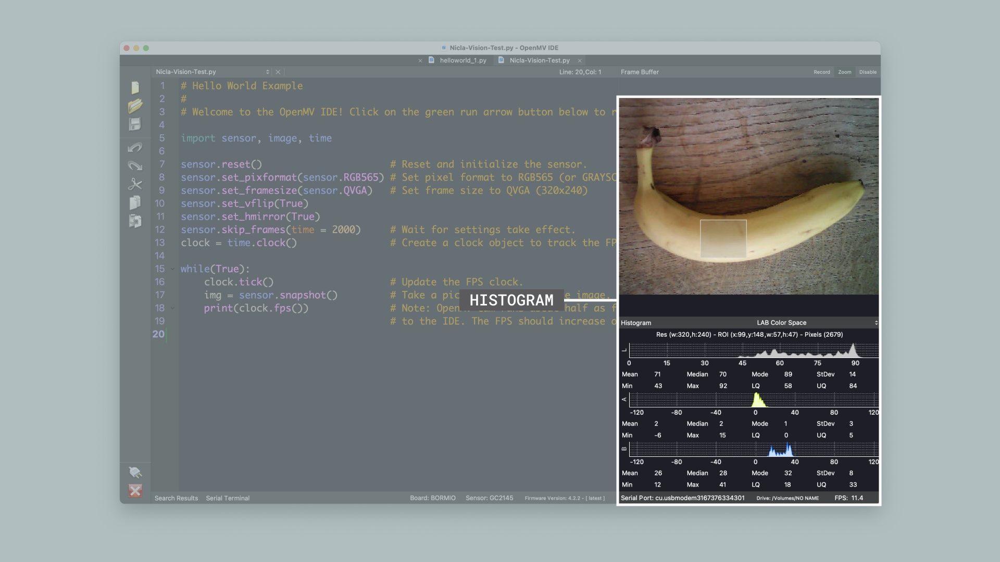
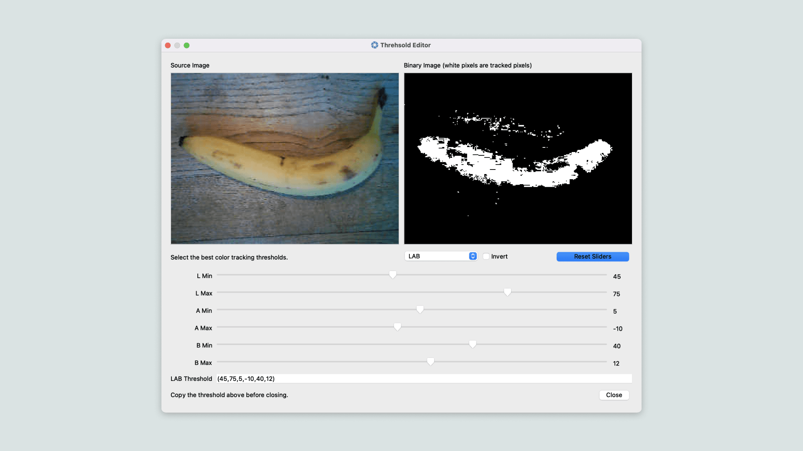
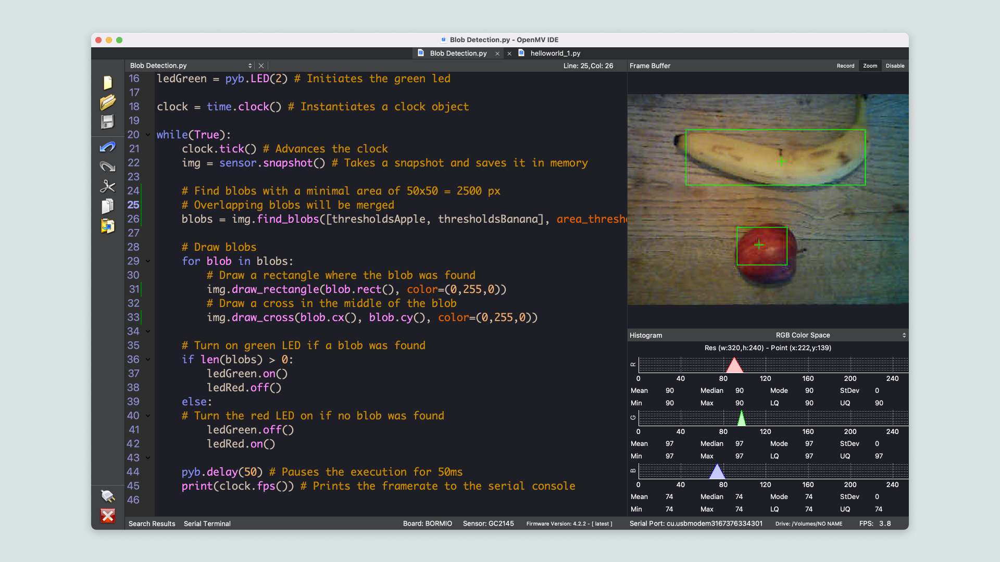

## Overview
In this tutorial you will use the Arduino® Nicla Vision to detect the presence and the position of objects in a camera image. For that you will use a technique referred to as blob detection. For this task you will write a MicroPython script and run it on the Nicla Vision with the help of the OpenMV IDE.

## Goals

- Learn how to use the OpenMV IDE to run MicroPython on Nicla Vision
- Learn how to use the built-in blob detection algorithm of OpenMV
- Learn how to use MicroPython to toggle the built-in LEDs

### Required Hardware and Software

- [Nicla Vision](https://store.arduino.cc/products/nicla-vision)
- Micro USB cable (either USB-A to Micro USB or USB-C® to Micro USB)
- OpenMV IDE 2.9.0+

## Nicla Vision and the OpenMV IDE

The OpenMV IDE was built for Machine Vision applications. It is meant to provide an Arduino like experience for simple computer vision tasks using a camera sensor. OpenMV comes with its own firmware that is built on MicroPython. Among other hardware, it supports the Nicla Vision board. OpenMV allows you to easily preview the camera stream and visually inspect color ranges to define thresholds for your machine vision scripts. [Here](https://openmv.io/) you can read more about the OpenMV IDE.

## Instructions

### Configuring the Development Environment
Before you can start programming OpenMV scripts for the Portenta, you need to download and install the OpenMV IDE. Open the [OpenMV download](https://openmv.io/pages/download) page in your browser and download the version that you need for your operating system. Please follow the instructions of the installer.

***IMPORTANT: Please make sure to update the bootloader to the most recent version to benefit from the latest improvements. Follow [these steps](/tutorials/portenta-h7/updating-the-bootloader) before you proceed with the next step of this tutorial.***

### Flashing the OpenMV Firmware

Connect the Nicla Vision to your computer via the USB cable if you have not done so yet. Now open the OpenMV IDE. 



Click on the "connect" symbol at the bottom of the left toolbar. Note that in previous versions of the OpenMV IDE you had to manually put the Nicla Vision in bootloader mode by double pressing the reset button on the board to make it detectable by the OpenMV IDE. This is no longer necessary.



A pop-up will ask you how you would like to proceed "DFU bootloader(s) found. What would you like to do?". Select "Reset Firmware to Release Version". This will install the latest OpenMV firmware on the board. If it asks you whether it should erase the internal file system you can click "No".



The board's LED will start flashing while the OpenMV firmware is being uploaded. A pop-up window will open to show you the upload progress. Wait until the LED stops flashing and fading. You will see a message saying "DFU firmware update complete!" when the process is done.

***Installing the OpenMV firmware will overwrite any existing sketches in the internal Flash. As a result, the board's port will not be exposed in the Arduino IDE anymore. To re-flash an Arduino firmware you need to put the board into bootloader mode. To do so double press the reset button on the board. The built-in LED will start fading in and out. In bootloader mode you will see the board's port again in the Arduino IDE.***

The Nicla Vision will start flashing its blue LED when it is ready to be connected. After confirming the completion dialog, the board should already be connected to the OpenMV IDE, otherwise click the "connect" button (plug icon) once again.




## Blob Detection

In this section you will learn how to use the built-in blob detection algorithm to detect the location of objects in an image. That algorithm allows to detect areas in a digital image that differ in properties, such as brightness or color compared to surrounding areas. These areas are called blobs. Think of a blob as a lump of similar pixels. 

Application Examples:

- Detect specific vehicles passing in front of the camera
- Detect missing pieces in an assembly line
- Detect insect infestation on vegetables

To find blobs you need to feed an image from the camera to the algorithm. It will then analyze it and output the coordinates of the found blobs. You will visualize these coordinates directly on the image and indicate whether a blob was found by using the red and green LED.

### 1. Prepare the Script

Create a new script by clicking the "New File" button in the toolbar on the left side. Import the required modules:

```python
import pyb # Import module for board related functions
import sensor # Import the module for sensor related functions
import image # Import module containing machine vision algorithms
import time # Import module for tracking elapsed time
```

A module in Python® is a confined bundle of functionality. By importing it into the script it gets made available.

### 2. Preparing the Sensor

In order to take a snapshot with the camera, it has to be configured in the script.

```python
sensor.reset() # Resets the sensor
sensor.set_pixformat(sensor.RGB565) # Sets the sensor to RGB
sensor.set_framesize(sensor.QVGA) # Sets the resolution to 320x240 px
sensor.set_vflip(True) # Flips the image vertically
sensor.set_hmirror(True) # Mirrors the image horizontally
sensor.skip_frames(time = 2000) # Skip some frames to let the image stabilize
```

The most relevant functions in this snipped are `set_pixformat` and `set_framesize`. The camera that comes with the Nicla Vision supports RGB 565 images. Therefore you need to set it via the `sensor.RGB565` parameter.

The resolution of the camera needs to be set to a supported format both by the sensor and the algorithm.  `QVGA` is a good trade-off between performance and resolution so you will use that in this tutorial.

Depending on how you hold the camera, you may want to play with the `set_vflip` and `set_hmirror` functions. To hold the board with the USB cable facing down, you will need to call `set_vflip(True)`. If you want the image to be displayed the same way as you see it with your eyes, you need to call `sensor.set_hmirror(True)`. Otherwise elements in the image such as text would be mirrored.

### 3. Defining the Color Thresholds

In order to feed the blob detection algorithm with an image, you have to take a snapshot from the camera or load the image from memory (e.g. SD card or internal Flash). In this case you will take a snapshot using the `snapshot()` function. The resulting image needs then to be fed to the algorithm using the `find_blobs` function. You will notice that a list of tuples gets passed to the algorithm. In this list you can specify the LAB color values that are mostly contained in the object that you would like to track. If you were for example to detect purely red objects on a black background, the resulting range of colors would be very narrow. The corresponding LAB value for pure red is roughly (53,80,67). A slightly brighter red could be (55,73,50). Therefore the LAB range would be L: 53-55 A: 73-80 B: 50-67. OpenMV provides a convenient tool to figure out the desired color ranges: Threshold Editor. You can find it in the OpenMV IDE in the menu under **Tools > Machine Vision > Threshold Editor**. Place the desired object in front of the camera and open the tool. When it asks you about the "Source image location?", select "Frame Buffer". In the window that opens you will see a snapshot from the camera and a few sliders to adjust the LAB color ranges. As you move the sliders you will see in the black and white image on the right hand side which of the pixels would match the set color range. White pixels denote the matching pixels. As you can see in the following example, the pixels of a red apple on brown background are very nicely clustered. It results in mostly one big blob.



To get a rough idea of the LAB color range of the target object, you can use the histogram view in OpenMV. Make sure you have set the histogram to LAB color mode. Draw a rectangle with the mouse pointer just above the target object in the frame buffer view. In the histogram you can see which color values appear most often. You can set the target color ranges to the min and max values of the corresponding color component.



As opposed to the example above with the apple, the clustering of the banana's pixels is slightly less coherent. This is because the banana lies on a background that has slightly similar color. That means that the algorithm is sensitive to the background pixels. In order to exclude blobs that do not belong to the target object, additional filtering is necessary. You can for example set a minimum bounding box size, a blob pixel density, define the elongation of the object, its roundness or even just look for objects in a specific part of the image.



### 4. Detecting Blobs

Now that you know the range of color values to be used to find the blobs, you can pass these 6 tuples as a list to the `find_blobs` function:

```python
# Define the min/max LAB values we're looking for
thresholdsApple = (24, 60, 32, 54, 0, 42)
thresholdsBanana = (45, 75, 5, -10, 40, 12)
img = sensor.snapshot() # Takes a snapshot and saves it in memory

# Find blobs with a minimal area of 50x50 = 2500 px
# Overlapping blobs will be merged
blobs = img.find_blobs([thresholdsApple, thresholdsBanana], area_threshold=2500, merge=True)
```

Once the blobs are detected you may be interested in seeing where in the image they were found. This can be done by drawing directly on the camera image.

```python
# Draw blobs
for blob in blobs:
    # Draw a rectangle where the blob was found
    img.draw_rectangle(blob.rect(), color=(0,255,0))
    # Draw a cross in the middle of the blob
    img.draw_cross(blob.cx(), blob.cy(), color=(0,255,0))
```

If you need to know which blob matched which color threshold you can use the `blob.code()` function (see [here](https://docs.openmv.io/library/omv.image.html#image.image.blob.blob.code) for more information).

The result of that will be visible in the Frame Buffer preview panel on the right side of the OpenMV IDE.



### 5. Toggling LEDs

What if you want some visual feedback from the blob detection without any computer connected to your board? You could use for example the built-in LEDs to indicate whether or not a blob was found in the camera image. Let's initialize the red and the green LEDs with the following code:

```python
ledRed = pyb.LED(1) # Initiates the red led
ledGreen = pyb.LED(2) # Initiates the green led
```

And then add the logic that will turn on the appropriate LED if a blob is present. This part of the code will be added after the "Draw Blobs" logic.

```python
# Turn on green LED if a blob was found
if len(blobs) > 0:
    ledGreen.on()
    ledRed.off()
else:
# Turn the red LED on if no blob was found
    ledGreen.off()
    ledRed.on()
```

In this example the green LED will light up when there is at least one blob found in the image. The red LED will light up if no blob could be found.

### 6. Uploading the Script
Let's program the board with the complete script and test if the algorithm works. Copy the following script and paste it into the new script file that you created.

```python
import pyb # Import module for board related functions
import sensor # Import the module for sensor related functions
import image # Import module containing machine vision algorithms
import time # Import module for tracking elapsed time

sensor.reset() # Resets the sensor
sensor.set_pixformat(sensor.RGB565) # Sets the sensor to RGB
sensor.set_framesize(sensor.QVGA) # Sets the resolution to 320x240 px
sensor.set_vflip(True) # Flips the image vertically
sensor.set_hmirror(True) # Mirrors the image horizontally
sensor.skip_frames(time = 2000) # Skip some frames to let the image stabilize

# Define the min/max LAB values we're looking for
thresholdsApple = (24, 60, 32, 54, 0, 42)
thresholdsBanana = (45, 75, 5, -10, 40, 12)

ledRed = pyb.LED(1) # Initiates the red led
ledGreen = pyb.LED(2) # Initiates the green led

clock = time.clock() # Instantiates a clock object

while(True):
    clock.tick() # Advances the clock
    img = sensor.snapshot() # Takes a snapshot and saves it in memory

    # Find blobs with a minimal area of 50x50 = 2500 px
    # Overlapping blobs will be merged
    blobs = img.find_blobs([thresholdsApple, thresholdsBanana], area_threshold=2500, merge=True)

    # Draw blobs
    for blob in blobs:
        # Draw a rectangle where the blob was found
        img.draw_rectangle(blob.rect(), color=(0,255,0))
        # Draw a cross in the middle of the blob
        img.draw_cross(blob.cx(), blob.cy(), color=(0,255,0))

    # Turn on green LED if a blob was found
    if len(blobs) > 0:
        ledGreen.on()
        ledRed.off()
    else:
    # Turn the red LED on if no blob was found
        ledGreen.off()
        ledRed.on()

    pyb.delay(50) # Pauses the execution for 50ms
    print(clock.fps()) # Prints the framerate to the serial console
```

Click on the "Play" button at the bottom of the left toolbar. Place some objects on your desk and check if the Nicla Vision can detect them.

***The MicroPython script does not get compiled and linked into an actual firmware. Instead it gets copied to the internal Flash of the board where it gets interpreted and executed on the fly.***

## Conclusion

In this tutorial you learned how to use the OpenMV IDE to develop MicroPython scripts that then run on the Nicla Vision. You also learned how to configure the camera of the Nicla Vision to be used for machine vision applications in OpenMV. Last but not least you learned how to interact with the built-in LEDs in MicroPython on the OpenMV firmware.  

### Next Steps

-   Familiarize yourself with the OpenMV IDE. There are many other features that did not get mentioned in this tutorial (e.g. the Serial Terminal).
-   Try out other machine vision examples that come with the OpenMV IDE. You can find them in the "Examples" menu.

## Troubleshooting

### OpenMV Firmware Flashing Issues

- If the upload of the OpenMV firmware fails during the download, put the board back in boot loader mode and try again. Give it a few tries until the firmware gets successfully uploaded.
- If the upload of the OpenMV firmware fails without even starting, try uploading the latest firmware using the "Load Specific Firmware File" option. You can find the latest firmware on the [OpenMV Github repository](https://github.com/openmv/openmv/releases). Look for a file called **firmware.bin** in the NVISION folder.
- If the camera cannot get recognized by the OpenMV IDE or if you see a "No OpenMV Cams found!" message, press the reset button of the board once and wait until you see the blue LED flashing. Then try again connecting to the board.
- If you see a "OSError: Reset Failed" message, reset the board by pressing the reset button. Wait until you see the blue LED flashing, connect the board to the OpenMV IDE and try running the script again.
