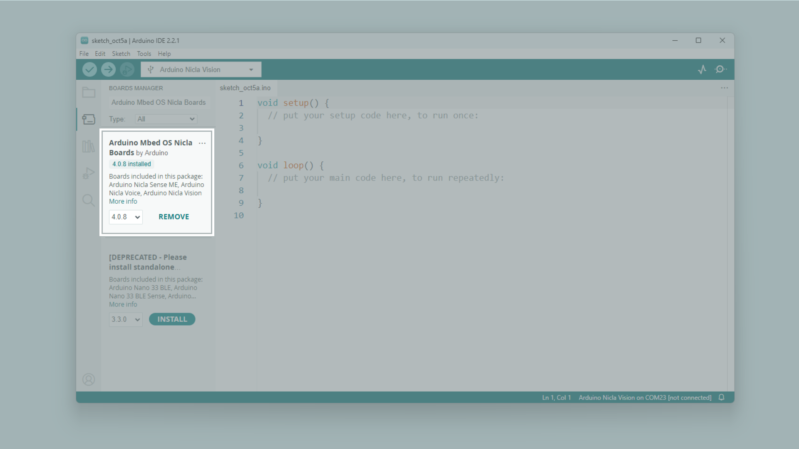
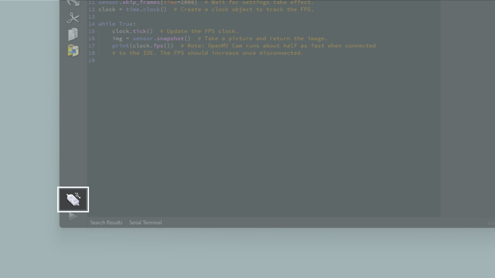
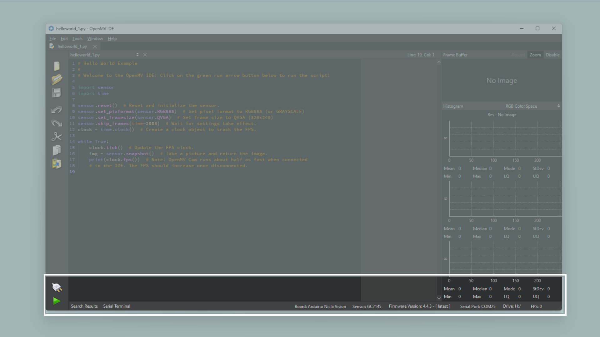
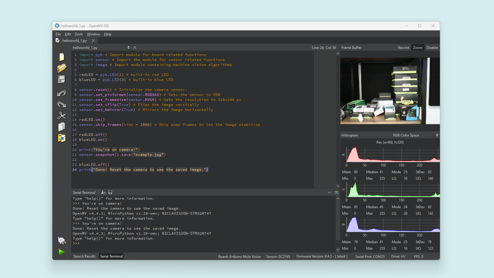

## Overview
The OpenMV IDE is meant to provide an Arduino like experience for simple machine vision tasks using a camera sensor. In this tutorial, you will learn about some of the basic features of the OpenMV IDE and how to create a simple MicroPython script. The Nicla Vision has OpenMV firmware on the board by default, making it easy to connect to the OpenMV IDE.

***If you are willing to use the Nicla Vision with the "Arduino IDE" instead, navitage to this [section](#using-the-nicla-vision-with-arduino-ide) for more details.***

## Goals

- The basic features of the OpenMV IDE
- How to create a simple MicroPython script
- How to use the OpenMV IDE to run MicroPython on Nicla Vision


### Required Hardware and Software

- [Nicla Vision](https://store.arduino.cc/products/nicla-vision)
- Micro USB cable (either USB-A to Micro USB or USB-C® to Micro USB)
- OpenMV IDE 2.6.4+

## Instructions

Using the OpenMV IDE you can run [MicroPython](http://docs.MicroPython.org/en/latest/) scripts on Nicla Vision. MicroPython provides a lot of classes and modules that make it easy to quickly explore the features of the Nicla Vision. 

In this tutorial you will first download the OpenMV IDE and set up the development environment. [Here](https://openmv.io/) you can read more about the OpenMV IDE. OpenMV comes with its own firmware that is built on MicroPython. You will then learn to write a simple script that will blink the on-board RGB LED using some basic MicroPython commands.

***Before proceeding with the tutorial, please update the board's bootloader following the instructions below.***

- Download the latest version of the board support package by searching for `Arduino Mbed OS Nicla Boards` in the Arduino IDE's `Boards Manager`.

  

- Then, go to **File > Examples > STM32H747_System > STM32H747_manageBootloader** and upload this sketch to your board.

  

- After the sketch is uploaded, follow the instructions in the Serial Monitor.

  

- If your Nicla Vision hasn't the latest bootloader, type `"Y"` in the input text box of the Serial Monitor, tap on Enter and wait for the update.

***If you get the "error exit status 74" verify you close any serial monitor window and that you have selected the board serial port correctly.***

### Nicla Vision LED Codes

🟢 **Blinking Green:** Your Nicla Vision onboard bootloader is running. The onboard bootloader runs for a few seconds when your OpenMV Cam is powered via USB to allow OpenMV IDE to reprogram your OpenMV Cam.

🔵 **Blinking Blue:** Your Nicla Vision is running the default [main.py](http://main.py/) script onboard. 

If you overwrote the [main.py](http://main.py/) script on your Nicla Vision then it will run whatever code you loaded on it instead.

If the LED is blinking blue but OpenMV IDE can't connect to your Nicla Vision please make sure you are connecting your Nicla Vision to your PC with a USB cable that supplies both data and power.

⚪ **Blinking White:** Your Nicla Vision firmware is panicking because of a hardware failure. Please check that your Nicla Vision's camera module is installed securely.

***If you tap the Nicla Vision reset button once, the board resets. If you tap it twice the board enters in DFU mode and its green LED start blinking and fading.***

### 1. Downloading the OpenMV IDE

Before you can start programming OpenMV scripts for the Nicla Vision, you need to download and install the OpenMV IDE.

Open the [OpenMV download](https://openmv.io/pages/download) page in your browser, download the version that you need for your operating system and follow the instructions of the installer.

### 2. Connecting to the OpenMV IDE

Open the OpenMV IDE and connect the Nicla Vision to your computer via the USB cable if you have not done so yet.


Click on the "connect" symbol at the bottom of the left toolbar.



If your Nicla Vision has not the latest firmware, a pop-up will ask you to install it. Your board will enter in DFU mode and it's green LED will start fading. 

Select `Install the latest release firmware`. This will install the latest OpenMV firmware on the Nicla Vision. You can leave the option of erasing the internal file system unselected and click `OK`.


Nicla Vision's green LED will start flashing while the OpenMV firmware is being uploaded to the board. A loading bar will start showing you the flashing progress. Wait until the green LED stops flashing and fading. You will see a message saying `DFU firmware update complete!` when the process is done.


The board will start flashing its blue LED when it is ready to be connected. After confirming the completion dialog, the Nicla Vision should already be connected to the OpenMV IDE, otherwise click the "connect" button (plug symbol) once again (the blue blinking should stop).



### 3. Preparing the Script

Create a new script by clicking the "New File" button in the toolbar on the left side. Import the required module `pyb`:

```python
import pyb # Import module for board related functions
```

A module in Python® is a confined bundle of functionality. By importing it into the script, it becomes available. For this example you will only need `pyb`, which is a module that contains board related functionality such as PIN handling. You can read more about its functions [here](https://docs.micropython.org/en/latest/library/pyb.html).

Now you can create the variables that will control our built-in RGB LED. With `pyb` you can easily control each color.

```python
redLED = pyb.LED(1) # built-in red LED
greenLED = pyb.LED(2) # built-in green LED
blueLED = pyb.LED(3) # built-in blue LED
```

At this point, you can easily distinguish between which color you control in the script.

### 4. Creating the Main Loop in the Script

Putting our code inside a while loop will make the code run continuously. In the loop you can turn on an LED with `on`, then you can use the `delay` function to create a delay. This function will start executing with the next instruction in the script. The duration of the delay can be controlled by changing the value inside the parentheses. The number defines how many milliseconds the board will wait. After the specified time has passed, you can turn off the LED with the `off` function. You can repeat that for each color.

```python
while True:
  # Turns on the red LED
  redLED.on()
  # Makes the script wait for 1 second (1000 milliseconds)
  pyb.delay(1000)
  # Turns off the red LED
  redLED.off()
  pyb.delay(1000)
  greenLED.on()
  pyb.delay(1000)
  greenLED.off()
  pyb.delay(1000)
  blueLED.on()
  pyb.delay(1000)
  blueLED.off()
  pyb.delay(1000)
```

### 5. Uploading the Script

Here you can see the complete blink script:

```python
import pyb # Import module for board related functions

redLED = pyb.LED(1) # built-in red LED
greenLED = pyb.LED(2) # built-in green LED
blueLED = pyb.LED(3) # built-in blue LED

while True:

  # Turns on the red LED
  redLED.on()
  # Makes the script wait for 1 second (1000 milliseconds)
  pyb.delay(1000)
  # Turns off the red LED
  redLED.off()
  pyb.delay(1000)
  greenLED.on()
  pyb.delay(1000)
  greenLED.off()
  pyb.delay(1000)
  blueLED.on()
  pyb.delay(1000)
  blueLED.off()
  pyb.delay(1000)
```

Connect your board to the OpenMV IDE and upload the above script by pressing the play button in the lower left corner.


Now, the built-in LED on your Nicla Vision board should be blinking red, green and then blue repeatedly.


## Using the Nicla Vision Camera

You can easily access the camera on the Nicla Vision through OpenMV IDE. Below is a short script that will set up the camera and take a photo. The board will blink its LED to indicate when it will take the picture. 

The taken photo will be saved in the Nicla Vision drive directory and will be accessible after taping the reset button.

```python
import pyb # Import module for board related functions
import sensor # Import the module for sensor related functions
import image # Import module containing machine vision algorithms

redLED = pyb.LED(1) # built-in red LED
blueLED = pyb.LED(3) # built-in blue LED

sensor.reset() # Initialize the camera sensor.
sensor.set_pixformat(sensor.RGB565) # Sets the sensor to RGB
sensor.set_framesize(sensor.QVGA) # Sets the resolution to 320x240 px
sensor.set_vflip(True) # Flips the image vertically
sensor.set_hmirror(True) # Mirrors the image horizontally

redLED.on()
sensor.skip_frames(time = 2000) # Skip some frames to let the image stabilize

redLED.off()
blueLED.on()

print("You're on camera!")
sensor.snapshot().save("example.jpg")

blueLED.off()
print("Done! Reset the camera to see the saved image.")
```

The camera that comes with the Nicla Vision supports RGB 565 images. That is why you have to use `sensor.set_pixformat(sensor.RGB565)`, enabling the camera to take an image with color. Then you need to set the resolution of the camera. Here we will use `sensor.set_framesize(sensor.QVGA)`.

Using `sensor.set_vflip` and `sensor.set_hmirror` will help you set the correct orientation of the image. If you hold the board with the USB cable facing down, you should call `sensor.set_vflip(True)`. The image will be mirrored, if you want the image to be displayed as you see it from your perspective, you should call `sensor.set_hmirror(True)`.

Running this script in OpenMV will show the image that the camera is currently capturing in the top right corner, inside the frame buffer. The onboard red LED will be on for a couple of seconds, then the blue LED will turn on to indicate when the picture is about to be taken. A message will be printed in the serial terminal when the image is taken.



The image will be saved as `"example.jpg"` in the boards directory. It is also possible to save the image in a `".bmp"` format. If you reset the camera by pressing the reset button, the image file will appear in the boards directory.


***If you want to try the built-in OpenMV IDE examples using MacOS, you may face format issues, use this [converter](https://handbrake.fr/) if needed ***

## Using the Nicla Vision with Arduino IDE

As mentioned before, the Nicla Vision comes with OpenMV firmware pre-installed. This makes it easier to use the board with OpenMV out of the box. However, it is possible to use the Nicla Vision with the Arduino IDE.

First make sure that you have the latest core installed. To install the core navigate to **Tools > Board > Boards Manager...**, in the Boards Manager window search for **Mbed OS Nicla Boards** and install it. When this core is installed and you have your board connected to your computer, select the port that the board is connected to and the board core. You should now be able to upload an Arduino sketch to the board.


If you wish to use the board with OpenMV after it has been used with the Arduino IDE, you have to put the board into bootloader mode and install OpenMV firmware. You can do this by double pressing the reset button, located next to the LED. When the board is in bootloader mode and connected to your computer, follow the steps above in the **[2. Connecting to the OpenMV IDE](#2-connecting-to-the-openmv-ide)** section to connect the board to the OpenMV IDE again.

## Conclusion
In this tutorial you learned how to use the OpenMV IDE with your Nicla Vision board. You also learned how to control the Nicla Vision's RGB LED with MicroPython functions and to upload the script to your board using the OpenMV IDE.

### Next Steps

-   Experiment with MicroPythons capabilities. If you want some suggestion on what to do, take a look at the examples included in the OpenMV IDE. Go to: **File > Examples > Arduino > ** in the OpenMV IDE.
-   It is possible to use the board for more advanced image processing tasks. Be sure to take a look at our other tutorials if you want to learn more.
-   Take a look at our other Nicla Vision tutorials which showcase its many uses. You can find them [here](https://docs.arduino.cc/hardware/nicla-vision#tutorials).

## Troubleshooting

### OpenMV Firmware Flashing Issues

- If the upload of the OpenMV firmware fails during the download, put the board back in bootloader mode and try again. Repeat until the firmware gets successfully uploaded.
- If the OpenMV IDE still cannot connect after flashing the firmware, try uploading the latest firmware using the "Load Specific Firmware File" option. You can find the latest firmware in the [OpenMV Github repository](https://github.com/openmv/openmv/releases). Look for a file named **firmware.bin**.
- If you see a "OSError: Reset Failed" message, reset the board by pressing the reset button. Wait until you see the blue LED flashing, connect the board to the OpenMV IDE and try running the script again.
