## Overview 

This tutorial teaches you how to train a custom machine learning model with Edge Impulse® and to do image classification on the Arduino Nicla Vision. The Machine Learning (ML) model will use the TensorFlow Lite format and the classification example will run on OpenMV.

## Goals

- Learn how to create datasets to be used for classification
- Learn how to train a ML model in Edge Impulse®
- Learn how to use OpenMV to run a classification example
- Learn how to embed a ML model in the OpenMV firmware

## Required Hardware and Software

- [Nicla Vision board](https://store.arduino.cc/products/nicla-vision)
- Micro USB cable
- An [Edge Impulse®](https://studio.edgeimpulse.com/) account for training the ML model
- Fruits (or other objects) to create the classification model 🍏🍌🍐

## Machine Learning on the Edge

Machine learning on powerful computers has been around for a while. On microcontrollers this is a rather new territory. Microcontrollers might not be able to run ML models to process high resolution images at high frame rates but there are some interesting aspects. On the one hand microcontrollers can run at very low power on batteries for a long time. You could even put the processor to sleep and only wake it up when the camera or the on-board proximity sensor registers activity. On the other hand ML models on a microcontroller can run without internet connection as they don't need to upload data to the cloud. This means that you can install distributed ML solutions in places where there is no Internet connection (Edge Computing). Additionally processing data locally means that the data stays on the device which ensures data privacy.

## The Edge Impulse® Platform

Edge Impulse® is a platform that simplifies the process of creating machine learning models by choosing reasonable defaults for the countless parameters you could set when creating a ML model. It provides a simple user interface that not only allows to train a ML model but also to inspect the data and test the model.

## Training the ML Model

To train a ML model to classify an image we need to feed it with image data of that object. During the training process the model will be trained using a concept called [supervised learning](https://en.wikipedia.org/wiki/Supervised_learning). This means that we train the model with known data and tell it while it's "practicing" its predictions if they are correct or not. This is similar to what happens when you tell a toddler who is pointing at a donkey saying "horse" and you tell them that it's actually a donkey. The next few times they see a donkey they may still get it wrong but over time under your supervision they will learn to correctly identify a donkey. Conceptually, that's also how our ML model learns.

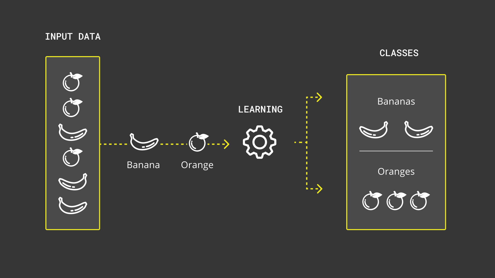

### Overfitting

One thing to consider is overfitting. If a machine learning model is overfitting, it means that it is too well geared towards your training data and won't perform well with unseen input data. To get back to the above example, once the toddler has seen many donkeys and all of them had perfectly gray fur, all were 170 cm long and 127 cm tall, they have learned that a donkey must be exactly like that, otherwise it's not a donkey. If now a donkey shows up that is slightly taller, the toddler would have to think that it's not a donkey. And even if there was one brownish, slightly taller donkey that the toddler has seen many times, it wouldn't necessarily help as the toddler may just remember that one specific donkey that looks a bit odd. It may not have learned that donkeys can actually have different shades of color in their fur.

You need some variation in the training dataset and adjust the parameters so that it doesn't just learn all input data by heart and makes the classification based on that but you rather want the model to learn the concept of an object. Luckily in the real world this rarely ever happens. In machine learning however, it's a common pitfall. 

To find the right configuration for your application often requires trial and error. Edge Impulse® shows in [this article](https://docs.edgeimpulse.com/docs/increasing-model-performance) how to improve poorly performing machine learning models.

### 1. Creating a Data Set

The first step is to create a representative dataset of the objects that the ML model is supposed to identify. The key is to have as much diversity in the models as possible. If we show it for example only one specific apple that has a certain size, shape and peel, then it won't be very good at recognizing other apples that look different. This is referred to as a bias and should be avoided as much as possible. In addition you need to teach the model what an apple is not. For that purpose you feed it random image data of things that are not an apple. You could name that class of image data "unknown". If you don't have such a class and the model has only ever seen an apple, it won't know what to do if there is no apple in the image.

Creating data sets in OpenMV is simple as there is a built-in function to create them. Before you proceed, connect your Nicla Vision board. Click on the connect button in the OpenMV IDE. If you haven't set up your board for OpenMV please consult the [getting started tutorial](/tutorials/nicla-vision/getting-started).

Create a new dataset by using the menu command **Tools > Dataset Editor > New Dataset** and name it `Dataset-Fruits`.

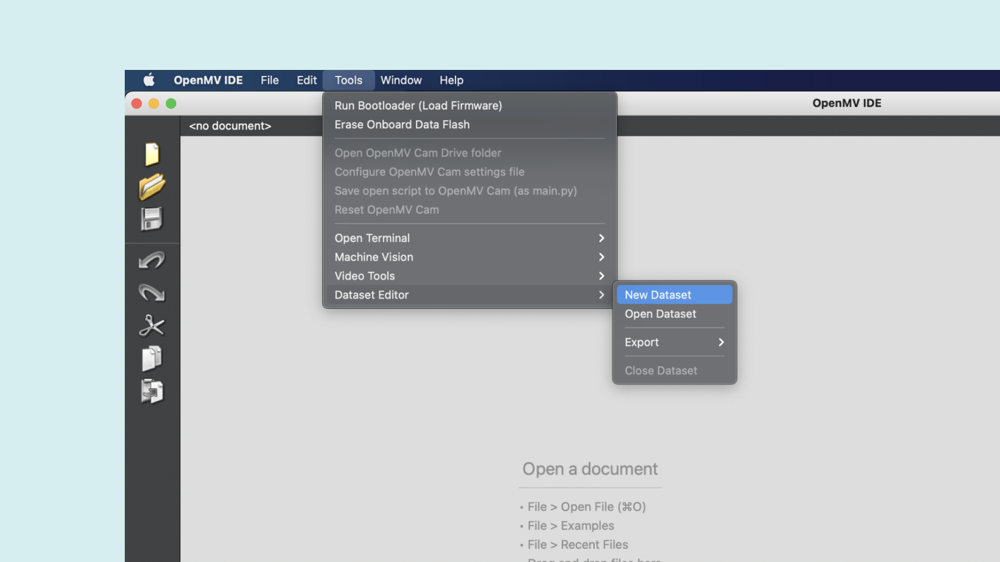

The next step is to create image classes. A class represents a unique type of object, in this case the type of fruit.

First, create a new image class and name it `orange` by clicking on "New Class Folder" in the toolbar. Now run the image capturing script that is already open by clicking the play button. Focus the orange with the camera and click on **Capture Data** to snap a picture of it. To conveniently hold the camera with the cable facing down you can use the following lines of code to flip the image accordingly:

```python
sensor.set_vflip(True) # Flips the image vertically
sensor.set_hmirror(True) # Mirrors the image horizontally
```

 Capture it from different angles and with different backgrounds to make the recognition later on more robust. Repeat this for other fruits that you would like to classify (e.g. a pear and a banana). Add an `unknown` class and capture some images of different backgrounds without the fruits that you would like to use during the classification later on.

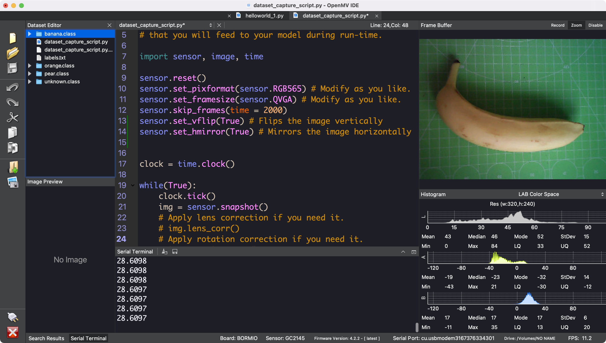

You may have also noticed that there is a labels text file. This file is used to store a textual representation of the classes to later classify the objects and print the class names. The classes are added to that automatically.

***Please note that creating a machine learning model with training data based around just one specific piece of fruit while always using the same background does not create a robust model. It will perform well in the controlled environment but will struggle when being presented with new data.***

### 2. Uploading the Data to Edge Impulse®
Now that all data is ready to be uploaded you need to create a new Edge Impulse® project. If you haven't registered an Edge Impulse® account yet, you may create one on [their website](https://studio.edgeimpulse.com/login). Log in to the Edge Impulse® Studio and create a new project named `Fruit-Detector`.

After that you can go back to the OpenMV IDE and select **Tools > Dataset Editor > Export > Log in to Edge Impulse® Account and Upload to Project**. The OpenMV IDE will ask you for your Edge Impulse® login credentials. Select the project that you just created and click OK. Leave the data set split setting at the default. This will keep 20% of the images aside for testing the model once it has been trained. That allows you to assess how well your model performs at detecting the objects with data that it hasn't seen yet.

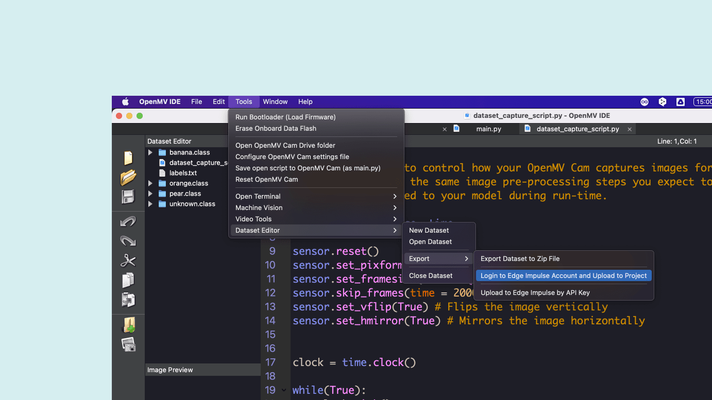


### 3. Acquire Data

Open your project in the Edge Impulse® studio and navigate to "Data Acquisition". You can see that the images have been uploaded and labeled according to the classes that you created. With this tool you can browse through the image samples and remove the ones which you don't deem valuable for the training (e.g. if one of the images is too blurry). You could also do that in the OpenMV IDE before you upload the data.

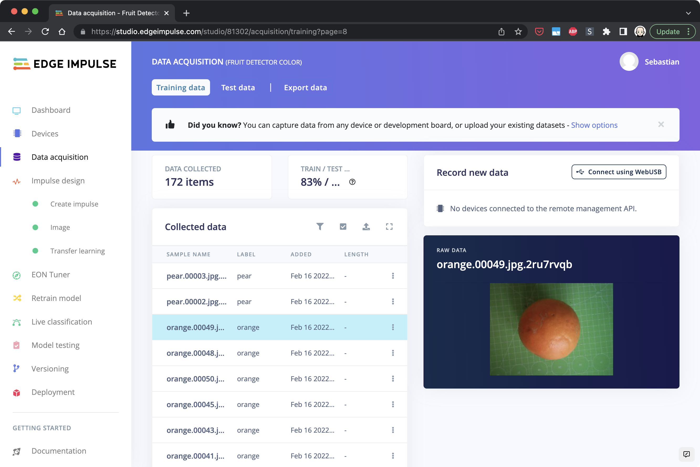


Make sure to have a good training / test data split ratio of around 80/20. The test data is used to test the model with "unseen" data after the training has finished. If you have an overfitting model you may see high accuracy in the training results but poor performance in the testing results. If that's the case you may have to tweak the parameters or collect more / better training data. More information on this can be found in the Edge Impulse® documentation referenced above.


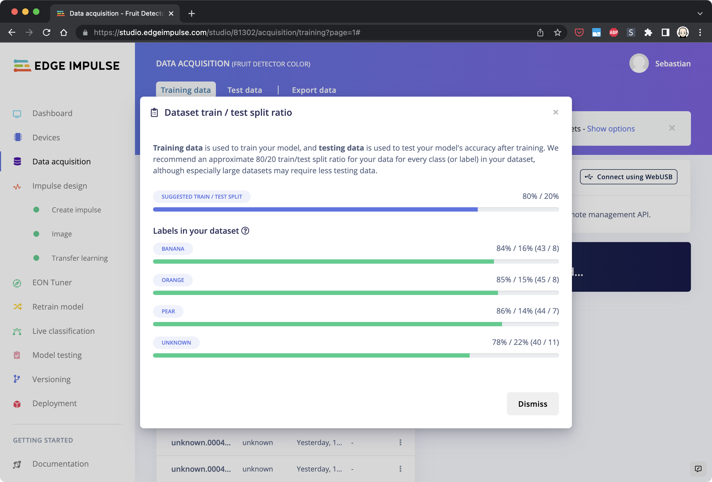

### 4. Create an Impulse

If you're happy with the data samples you can move on to designing your impulse. An impulse is in a nutshell a recipe with which the model is being trained. It defines actions that are performed on your input data to make them better suited for machine learning and a learning block that defines the algorithm for the classification. In the menu navigate to "Create Impulse" under "Impulse Design" and add an **Image** processing block as well as a **Transfer Learning** learning block.

It's recommended to adjust the image size to 48x48 for improved performance. You can try with higher resolutions but you will notice that the frame rate during the classification will drop significantly. Click on Save Impulse to apply the adjusted settings.

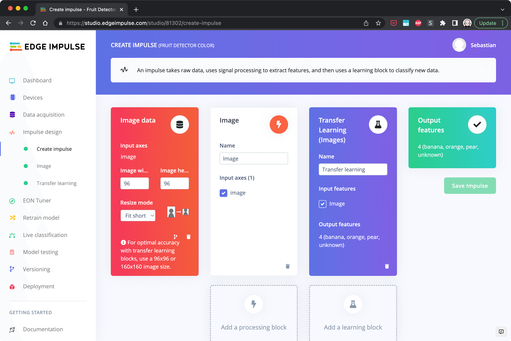


### 5. Generate Features

In this step you will adjust the image settings and generate the features from the input data. Features are unique properties that will be used by the classification algorithm to detect the objects. A feature can be the round shape of an orange or the fact that an image of a banana has many bright pixels as bananas are mostly yellow.
In the menu navigate to "Image" under "Impulse Design". Set the color depth to "RGB" and save the parameters. 

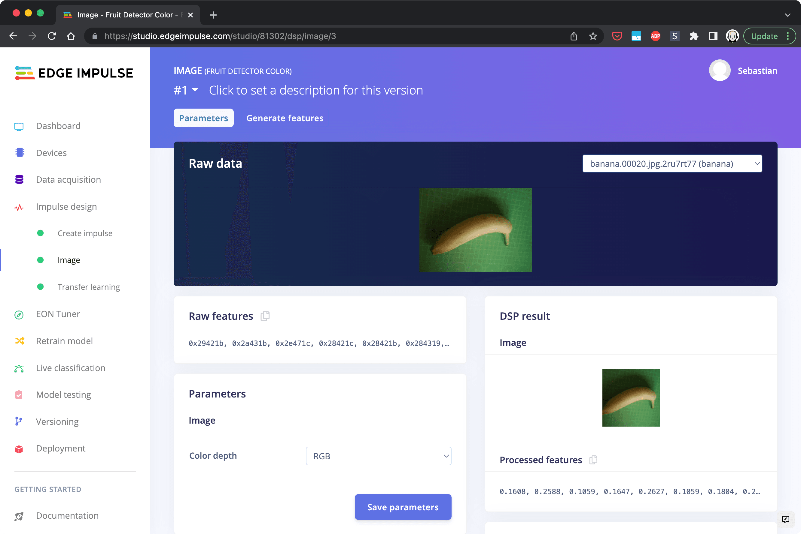

Then click on "Generate Features". The analysis process will take a while to complete depending on the amount of images that you uploaded. When it's done you can inspect the results. On the right hand side you can see a visualization of the features in a 3D space. You can see that some bananas (blue dots) and pears (green dots) are somewhat hard to tell apart possibly due to their long-ish shape and the stem and  therefore have some data points in close proximity. An orange on the other hand is easier to distinguish as it looks quite different.

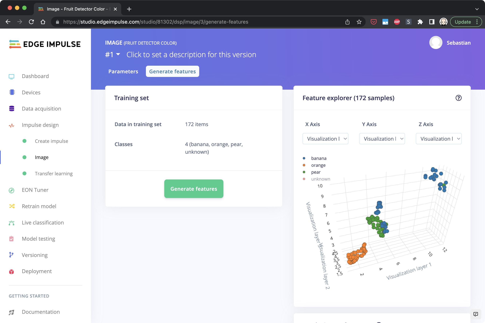

### 6. Train the Model

Now that the features of your image data are ready to be used for the actual training you can navigate to "Transfer Learning" in the menu. You need to tweak the settings slightly. Set the "Number of training cycles" to a number that yields good results. In this example we chose 80. This defines how many times the model is being trained. The model gets better with each cycle the same way you get better when learning how to ride a bike and you practice it the first couple of times. 

***Choose `MobileNetV2 96x96 0.1` as model type. This will use roughly 200 KB of flash memory. A model with higher ROM usage will likely not fit in the flash!***

In this example we also increased the drop out rate to 0.15 and the output neurons to 12. This increased the accuracy with the given training / test data. You may need to adapt those values based on your own data.

Click on "Start Training" to train the machine learning model. A small amount of images, the **validation set**, are put aside before the training starts to validate the trained model. Not to be confused with the **test set** which can be used to evaluate the final model. Once the training finishes you will see some statistics on how well the model performed during validation. Ideally you get an accuracy of 100% for each object. If you get poor results you may have some images which are not representative of the objects you're trying to classify and should be removed from the data set.

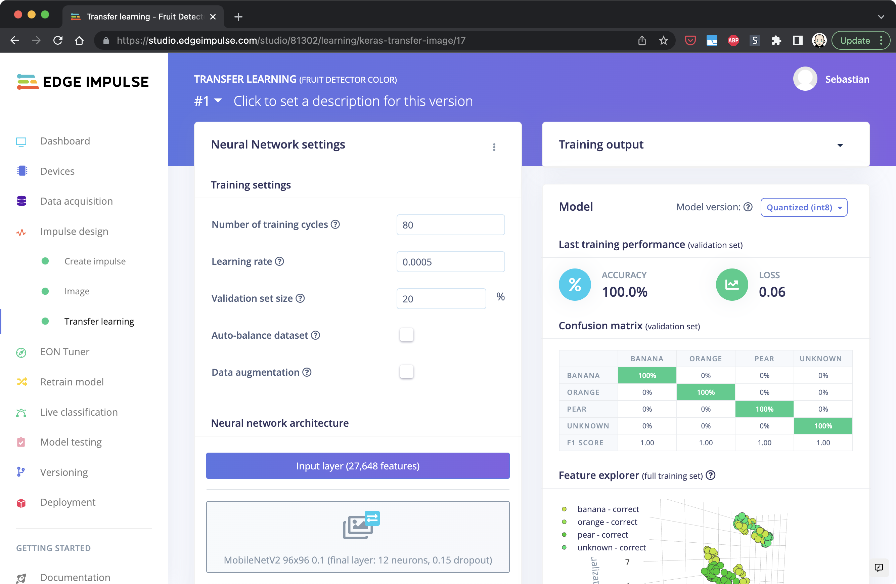

## 7. Test the Model

After training the model, you will have an idea of how well the model performs on the data that it knows from the training. That is only half of the story. You also need to know how well it performs on unseen data. In almost any real-world application a model will be confronted only with unseen data. Being able to cope with that is crucial. Edge Impulse® studio provides a tool to easily test the model. You can find it under "Model Testing". The model testing results will give you an insight on the performance. If the model gets bad results while testing, but had a good accuracy after training it may be overfitting. 

You may ask yourself why this model performs so well even if the model is not robust at all. It's because the data used for testing comes from the same controlled environment as the learning data. The test images have the same background and feature the exact same fruits as the training images. If you wait a few days until the banana becomes brown, you will see a decrease in performance.


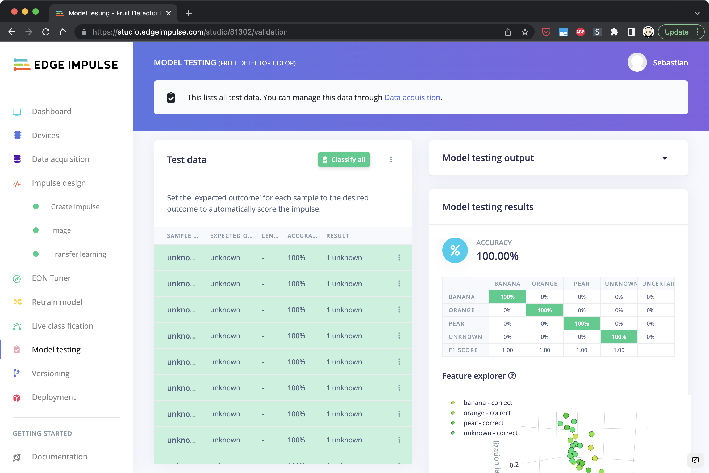

## Using the ML Model

The ML model is trained and already optimized to be used with microcontrollers. This is done automatically in the background through quantization. This is a process where the numbers in the machine learning models are constrained in their value range for improved performance while sacrificing a bit of accuracy.

### Deploy

Deploying the ML model to your board requires a few simple steps. The Edge Impulse® Studio provides an export feature for OpenMV. Since the Nicla Vision doesn't have any on-board SRAM we need to bake the machine learning model into the firmware and load it from the flash. Switch to the deployment section in the menu, select "OpenMV Firmware" under "Configure your deployment" and click "build". This will create an OpenMV compatible firmware that includes the machine learning model. Unzip the file once it's downloaded. The download should start automatically.

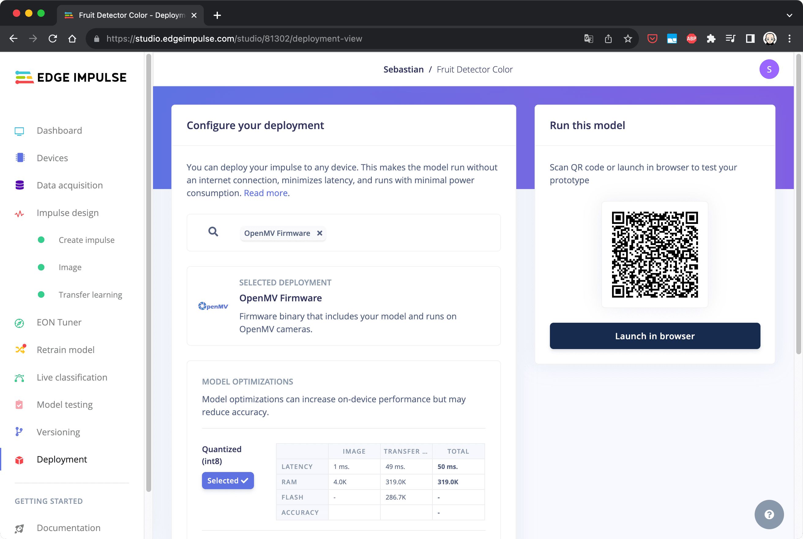


Put the board in bootloader mode and click on the connect symbol in the OpenMV IDE. In the dialog select "Load a specific firmware". Select `edge_impulse_firmware_arduino_nicla_vision.bin` in the folder that you created while unziping the downloaded file and flash it to the board.

### Run the Script

The final step is to run the **ei_image_classification.py** script. Open it in the OpenMV IDE.

Replace the print statement in the innermost for loop with the following code:

```python
confidence = predictions_list[i][1]
label = predictions_list[i][0]
print("%s = %f" % (label[2:], confidence))

if confidence > 0.9 and label != "unknown":
    print("It's a ", label, "!")
```

This code will print a message saying e.g. "It's a orange!" in case the confidence is above 90%. In the following screenshot you can see that the orange was detected with a confidence level of 0.99 which corresponds to 99%.

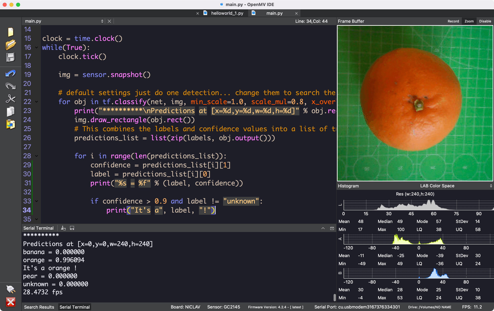

Try pointing the camera of your board at any of your fruits or other objects that you used for the training and check if it can be recognized successfully.

The complete script of the classification example is as follows:

```python
import sensor, image, time, os, tf

sensor.reset()                         # Reset and initialize the sensor.
sensor.set_pixformat(sensor.RGB565)    # Set pixel format to RGB565 (or GRAYSCALE)
sensor.set_framesize(sensor.QVGA)      # Set frame size to QVGA (320x240)
sensor.set_vflip(True)
sensor.set_hmirror(True)
sensor.set_windowing((240, 240))       # Set 240x240 window.
sensor.skip_frames(time=2000)          # Let the camera adjust.

labels, net = tf.load_builtin_model('trained')

clock = time.clock()
while(True):
    clock.tick()

    img = sensor.snapshot()

    # default settings just do one detection... change them to search the image...
    for obj in tf.classify(net, img, min_scale=1.0, scale_mul=0.8, x_overlap=0.5, y_overlap=0.5):
        print("**********\nPredictions at [x=%d,y=%d,w=%d,h=%d]" % obj.rect())
        img.draw_rectangle(obj.rect())
        # This combines the labels and confidence values into a list of tuples
        predictions_list = list(zip(labels, obj.output()))

        for i in range(len(predictions_list)):
            confidence = predictions_list[i][1]
            label = predictions_list[i][0]
            print("%s = %f" % (label, confidence))

            if confidence > 0.9 and label != "unknown":
                print("It's a", label, "!")

    print(clock.fps(), "fps")
```

## Conclusion

You have learned about classification as a machine learning concept which categorizes a set of data into classes. You have also learned how supervised learning works and what quantization of a model means. Furthermore you have learned to train a custom TFLite machine learning model and deploy it to your board.

## Troubleshooting

If you’re encountering difficulties while deploying your machine learning model, make sure that you chose `MobileNetV2 96x96 0.1` as model type, otherwise the model will likely be too big.
