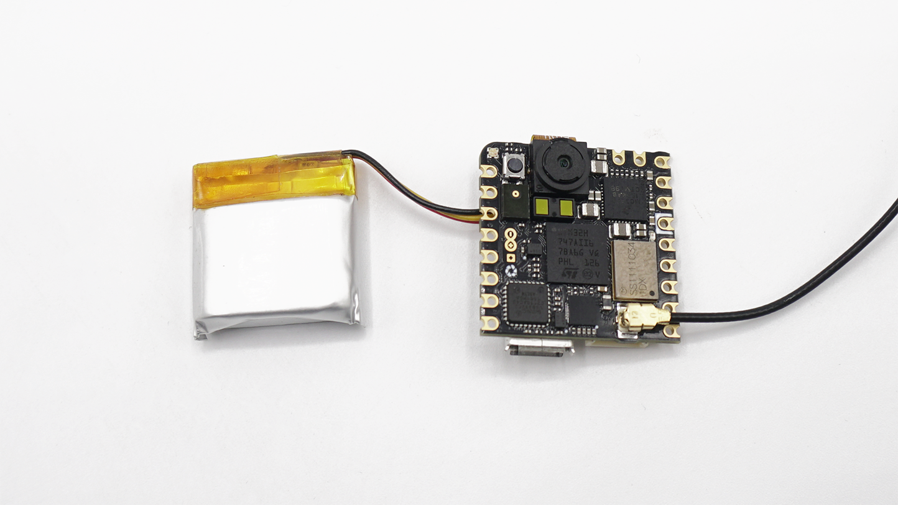

## Overview
In this tutorial you will use the Arduino® Nicla Vision to capture and stream a live video feed to your local network. For that, you will use the onboard camera sensor and the Wi-Fi® connectivity. For this task you will write a MicroPython script and run it on the Nicla Vision with the help of the OpenMV IDE.

## Goals

- Learn how to use the OpenMV IDE to run MicroPython on Nicla Vision
- Learn how to use the Nicla Vision Wi-Fi® connectivity
- Learn how to use MicroPython to capture images and stream them to the network

### Required Hardware and Software

- [Nicla Vision](https://store.arduino.cc/products/nicla-vision)
- Micro USB cable (either USB-A to Micro USB or USB-C® to Micro USB)
- OpenMV IDE 4.0.14+
- Access to a Wi-Fi® local network (2.4Ghz only)

## Nicla Vision and the OpenMV IDE

The OpenMV IDE was built for Machine Vision applications. It is meant to provide an Arduino like experience for simple computer vision tasks using a camera sensor. OpenMV comes with its own firmware that is built on MicroPython. Among other hardware, it supports the Nicla Vision board. OpenMV allows you to easily preview the camera stream and visually inspect color ranges to define thresholds for your machine vision scripts. [Here](https://openmv.io/) you can read more about the OpenMV IDE.

## Instructions

### Configuring the Development Environment

Before you can start programming micropython scripts for the Nicla Vision, you need to download and install the OpenMV IDE.

Open the [OpenMV](https://openmv.io/pages/download) download page in your browser, download the latest version available for your operating system, and follow the instructions of the installer.


Open the OpenMV IDE and connect the Nicla Vision to your computer via the USB cable if you have not done so yet.


Click on the "connect" symbol at the bottom of the left toolbar.


If your Nicla Vision does not have the latest firmware, a pop-up will ask you to install it. Your board will enter in DFU mode and its green LED will start fading. 

Select `Install the latest release firmware`. This will install the latest OpenMV firmware on the Nicla Vision. You can leave the option of erasing the internal file system unselected and click `OK`.


Nicla Vision's green LED will start flashing while the OpenMV firmware is being uploaded to the board. A loading bar will start showing you the flashing progress.

Wait until the green LED stops flashing and fading. You will see a message saying `DFU firmware update complete!` when the process is done.


The board will start flashing its blue LED when it is ready to be connected. After confirming the completion dialog, the Nicla Vision should already be connected to the OpenMV IDE, otherwise, click the "connect" button (plug symbol) once again (the blue blinking should stop).


## Live Streaming
In this section you will learn how the MicroPython script works in order to capture live video and stream it to your local network. Live video streaming across local or internet networks is one of the most used applications for connected cameras. 

Some application examples are:

- Monitor industrial processes, from analog gauges, food-industry processes, to CNC machinery or 3D printers
- Video surveillance of a place
- Robotics perception, from AGVs vehicles to computer vision powered robotics arms or SLAM navigation

### The Example Code

This tutorial's main objective is to use the Nicla Vision to stream live video reachable from inside the network using our favorite web browser.

The example code we are going to use can also be found in OpenMV by navigating to **File > Examples > WiFi > mjpeg_streamer**.

***In the newer versions of the OpenMV IDE you must connect the board to your computer so the examples appear.***

You can copy and paste the script below to test this tutorial application.

```python
import sensor
import time
import network
import socket

SSID = "*********"  # Network SSID
KEY = "***********"  # Network key
HOST = ""  # Use first available interface
PORT = 8080  # Arbitrary non-privileged port

# Init wlan module and connect to network
wlan = network.WLAN(network.STA_IF)
wlan.active(True)
wlan.connect(SSID, KEY)

while not wlan.isconnected():
    print('Trying to connect to "{:s}"...'.format(SSID))
    time.sleep_ms(1000)

# We should have a valid IP now via DHCP
print("WiFi Connected ", wlan.ifconfig())

# Create server socket
s = socket.socket(socket.AF_INET, socket.SOCK_STREAM)
s.setsockopt(socket.SOL_SOCKET, socket.SO_REUSEADDR, True)

# Bind and listen
s.bind([HOST, PORT])
s.listen(5)

# Set server socket to blocking
s.setblocking(True)

# Init sensor
sensor.reset()
sensor.set_framesize(sensor.QVGA)
sensor.set_pixformat(sensor.RGB565)

def start_streaming(s):
    print("Waiting for connections..")
    client, addr = s.accept()
    # set client socket timeout to 5s
    client.settimeout(5.0)
    print("Connected to " + addr[0] + ":" + str(addr[1]))

    # Read request from client
    data = client.recv(1024)
    # Should parse client request here

    # Send multipart header
    client.sendall(
        "HTTP/1.1 200 OK\r\n"
        "Server: OpenMV\r\n"
        "Content-Type: multipart/x-mixed-replace;boundary=openmv\r\n"
        "Cache-Control: no-cache\r\n"
        "Pragma: no-cache\r\n\r\n"
    )

    # FPS clock
    clock = time.clock()

    # Start streaming images
    # NOTE: Disable IDE preview to increase streaming FPS.
    while True:
        clock.tick()  # Track elapsed milliseconds between snapshots().
        frame = sensor.snapshot()
        cframe = frame.compressed(quality=35)
        header = (
            "\r\n--openmv\r\n"
            "Content-Type: image/jpeg\r\n"
            "Content-Length:" + str(cframe.size()) + "\r\n\r\n"
        )
        client.sendall(header)
        client.sendall(cframe)
        print(clock.fps())


while True:
    try:
        start_streaming(s)
    except OSError as e:
        print("socket error: ", e)
        # sys.print_exception(e)

```

Now, let's briefly explain the main code sections of the example script from above.

#### 1. Prepare the Script

Create a new script by clicking the "New File" button in the toolbar on the left side. Delete the example program that initially appears and import the required modules:

```python
import sensor   # Import the module for sensor related functions
import time     # Import module for tracking elapsed time
import network  # Import module for WiFi connectivity
import socket   # Import module for sockets communication
```

#### 2. Network Setup

Define your WiFi® credentials so the Nicla Vision can connect to the internet.

```python
SSID = "*********"  # Network SSID
KEY = "************"  # Network key
HOST = ""  # Use first available interface
PORT = 8080  # Arbitrary non-privileged port
```

Set the `SSID` and `KEY` variables with your Wi-Fi® network credentials respectively.

The `HOST` variable must be empty so the socket uses the DHCP IP assigned to the Nicla Vision for the connection.

You can use `8080` as the `PORT` by default. Check with your network administrator if the port is closed or reserved so you know which you can use for this application.

The code section below search for a WiFi® network with the credentials supplied before and start a connection process to it. Also, it creates a socket server for video streaming.

```python
# Init wlan module and connect to network
wlan = network.WLAN(network.STA_IF)
wlan.active(True)
wlan.connect(SSID, KEY)

while not wlan.isconnected():
    print('Trying to connect to "{:s}"...'.format(SSID))
    time.sleep_ms(1000)

# We should have a valid IP now via DHCP
print("WiFi Connected ", wlan.ifconfig())

# Create server socket
s = socket.socket(socket.AF_INET, socket.SOCK_STREAM)
s.setsockopt(socket.SOL_SOCKET, socket.SO_REUSEADDR, True)

# Bind and listen
s.bind([HOST, PORT])
s.listen(5)

# Set server socket to blocking (block the operations until completed)
s.setblocking(True)

```

#### 3. Preparing the Sensor
```python
# Camera setup and initialization
sensor.reset() # Resets the sensor
sensor.set_framesize(sensor.QVGA) # Sets the resolution to 320x240 px
sensor.set_pixformat(sensor.RGB565) # Sets the sensor to RGB
```

The most relevant functions in this snipped are `set_pixformat` and `set_framesize`. The camera that comes with the Nicla Vision supports RGB 565 images. Therefore you need to set it via the `sensor.RGB565` parameter.

The resolution of the camera needs to be set to a supported format both by the sensor and the algorithm. `QVGA` is a good trade-off between performance and resolution so you will use that in this tutorial.

#### 4. Streaming Function

The `start_streaming()` function waits for a client to get connected to the socket server, prints the client address and sends it the headers preparing the connection for live streaming.

Finally, it captures images continuously and sends them to the client compressed and in the right format. 

```python
def start_streaming(s):
    print("Waiting for connections..")
    client, addr = s.accept()
    # set client socket timeout to 5s
    client.settimeout(5.0)
    print("Connected to " + addr[0] + ":" + str(addr[1]))

    # Read request from client
    data = client.recv(1024)
    # Should parse client request here

    # Send multipart header
    client.sendall(
        "HTTP/1.1 200 OK\r\n"
        "Server: OpenMV\r\n"
        "Content-Type: multipart/x-mixed-replace;boundary=openmv\r\n"
        "Cache-Control: no-cache\r\n"
        "Pragma: no-cache\r\n\r\n"
    )

    # FPS clock
    clock = time.clock()

    # Start streaming images
    # NOTE: Disable IDE preview to increase streaming FPS.
    while True:
        clock.tick()  # Track elapsed milliseconds between snapshots().
        frame = sensor.snapshot()
        cframe = frame.compressed(quality=35)
        header = (
            "\r\n--openmv\r\n"
            "Content-Type: image/jpeg\r\n"
            "Content-Length:" + str(cframe.size()) + "\r\n\r\n"
        )
        client.sendall(header)
        client.sendall(cframe)
        print(clock.fps())
```

#### 5. Uploading the Script
Let's program the board with the complete script and test if everything works. Copy the whole [example code](#the-example-code) and paste it into the new script file that you created.

Open the OpenMV Serial Monitor by clicking on _Serial Terminal_ in the lower left corner. Click the _Play_ button at the bottom of the left toolbar. See the board connection progress in the terminal, once connected, the _host address_ will be printed out. 


The Nicla Vision IP address is the __first one__ printed, `10.0.0.131` in this case.

To watch the live stream, open your favorite web browser and enter the Nicla Vision IP address followed by the port, in this case, `10.0.0.131:8080`.


You can play with the camera resolution by changing it in the `set_framesize` as follows:

```python
sensor.set_framesize(sensor.QVGA) # this is the example default resolution
sensor.set_framesize(sensor.HD) # this is for HD resolution
```

You can see all the supported resolutions [here](https://docs.openmv.io/library/omv.sensor.html#sensor.set_framesize) to suit your application.

For example, the streaming below is in `HD`, as you can notice, this affects the streaming fps.


## Conclusion

In this tutorial, you learned how to use the OpenMV IDE to develop MicroPython scripts that then run on the Nicla Vision. You also learned how to connect it to the network via WiFi®. Last but not least you learned how to configure the Nicla Vision to be used as a surveillance camera in OpenMV.  

### Next Steps

-   Using a secure domain and a free DNS provider like [CloudFlare](https://www.cloudflare.com/what-is-cloudflare/) you can access your live stream from outside your local network wherever you are.
-   Familiarize yourself with the OpenMV IDE. There are many other features that were not mentioned in this tutorial (e.g. Machine Learning built-in functions).
- Learn more about the **Nicla Vision** on its [User Manual](https://docs.arduino.cc/tutorials/nicla-vision/user-manual).

