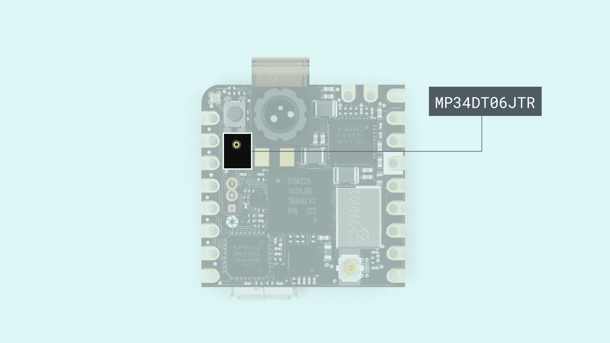
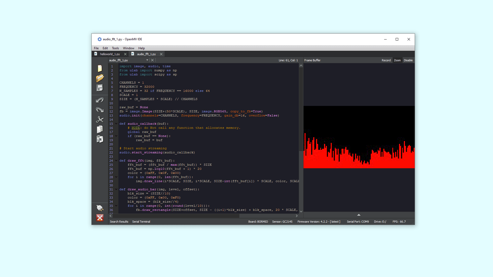

## Overview

In this tutorial you will use the **Arduino Nicla Vision** board to get the microphone (MP34DT06JTR) readings and change the LED brightness.

## Goals

- Get the microphone data
- Use the PDM(Pulse-density modulation) library
- Print the microphone values in the Serial Monitor
- Change RGB blinking speed with the last microphone reading (Arduino IDE)
- Show the values on a spectrum analyzer (only with openMV)

### Required Hardware and Software

- [Nicla Vision](https://store.arduino.cc/products/nicla-vision)
- Latest mbed Core version
- Latest openMV IDE version

## Set Up

To check that you correctly set up the board, please visit our [Getting Started Guide](https://docs.arduino.cc/tutorials/nicla-vision/getting-started) for both **OpenMV** and **Arduino** instructions.

## Instructions

### OpenMV

Open the script by going to **Examples > Arduino > NanoRP2040 > Audio > Audio_fft.py**.

***Using the same sketch as the NanoRP2040, because both boards access the microphone in the same way***

Make sure the board is connected, if the board is connected to OpenMV you should see a green play button in the bottom left corner of the window. If you do not see this icon, try pressing the connect button in the bottom left corner. If there still is some issue to connect the board, take another look at the getting started guide.

When the script is running, you will see a spectrum analyzer in the top right panel that reflects the audio readings input. Try making some noise and see how it reacts.



### Arduino

#### Setting Up the Sketch

You will edit the example from the mbed Core, go to **Examples > PDM > PDMSerialPlotter** and save it into your sketchbook.

You can run the sketch to see the result, it will show the data that the microphone is getting on the **Serial Plotter**.

#### Controlling the Blinking LED 

Now that you can get the microphone data, let's control the built-in RGB LED and change the speed of its blinking depending on the values, by changing the blinking time to the last reading of the microphone; the blink will be slow if the sound is loud, and fast if it is quiet.

You can access the example sketch at **Examples > PDM > PDMSerialPlotter** and then edit as shown in this tutorial.
Or find the full edited sketch in our **Arduino_Pro_Tutorials** library.

#### Complete Sketch

```arduino
  /*
    This example reads audio data from the on-board PDM microphones, and prints
    out the samples to the Serial console. The Serial Plotter built into the
    Arduino IDE can be used to plot the audio data (Tools -> Serial Plotter)
    Circuit:
    - Arduino Nicla Vision, or
    - Arduino Nano 33 BLE board, or
    - Arduino Nano RP2040 Connect, or
    - Arduino Portenta H7 board plus Portenta Vision Shield
    This example code is in the public domain.
  */

  
  #include <PDM.h>

  // default number of output channels
  static const char channels = 1;

  // default PCM output frequency
  static const int frequency = 16000;

  // Buffer to read samples into, each sample is 16-bits
  short sampleBuffer[512];

  // Number of audio samples read
  volatile int samplesRead;

  // Blinking 
  bool state = false;
  int timeStart = 0;

  void setup() {
    Serial.begin(9600);
    pinMode(LEDB, OUTPUT);

    while (!Serial);

    // Configure the data receive callback
    PDM.onReceive(onPDMdata);

    // Optionally set the gain
    // Defaults to 20 on the BLE Sense and 24 on the Portenta Vision Shield
    // PDM.setGain(30);

    // Initialize PDM with:
    // - one channel (mono mode)
    // - a 16 kHz sample rate for the Arduino Nano 33 BLE Sense
    // - a 32 kHz or 64 kHz sample rate for the Arduino Portenta Vision Shield
    if (!PDM.begin(channels, frequency)) {
      Serial.println("Failed to start PDM!");
      while (1);
    }


  }

  void loop() {
    // Wait for samples to be read
    if (samplesRead) {

      // Print samples to the serial monitor or plotter
      for (int i = 0; i < samplesRead; i++) {
        if (channels == 2) {
          Serial.print("L:");
          Serial.print(sampleBuffer[i]);
          Serial.print(" R:");
          i++;
        }
        Serial.println(sampleBuffer[i]);
      }

      // Clear the read count
      samplesRead = 0;

      if (millis() - timeStart > sampleBuffer[2]) {
        digitalWrite(LEDB, state);
        state = !state;
      }
    }
  }

  /**
    Callback function to process the data from the PDM microphone.
    NOTE: This callback is executed as part of an ISR.
    Therefore using `Serial` to print messages inside this function isn't supported.
  * */
  void onPDMdata() {
    // Query the number of available bytes
    int bytesAvailable = PDM.available();

    // Read into the sample buffer
    PDM.read(sampleBuffer, bytesAvailable);

    // 16-bit, 2 bytes per sample
    samplesRead = bytesAvailable / 2;
  }
```


### Testing It Out

After you have successfully verified and uploaded the sketch to the board, open the Serial Monitor from the menu on the left. You will now see the new values printed.

If you want to test it, the only thing you need to do is to speak or play some sounds close to the board and see how the blinking of the RGB LED changes based on the input.

### Troubleshoot

- In case the Serial Monitor freezes, unplug and then plug the board into your computer again. Now try to upload the sketch.
- If the sketch is not working, try to double tap the reset button and upload the sketch once again.
  
## Conclusion

You have learned how to use the Arduino IDE and OpenMV to get data from the microphone and then use it to change the RGB LED on the board. This can for example be used as an alarm system to wake the board up and take a screenshot with the Camera.
