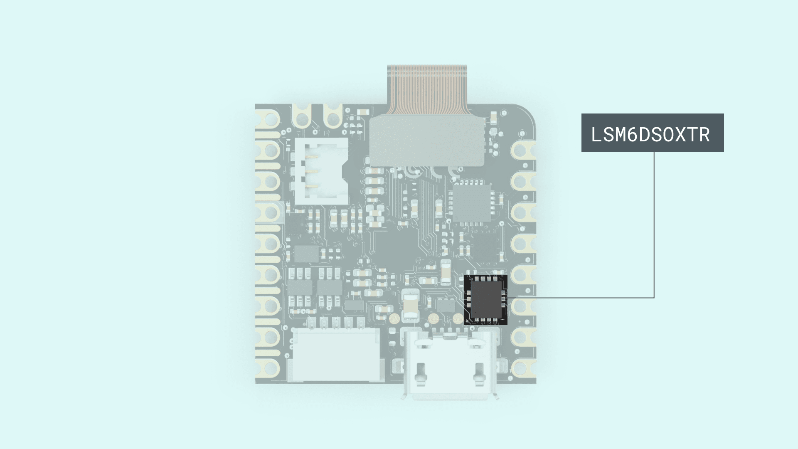
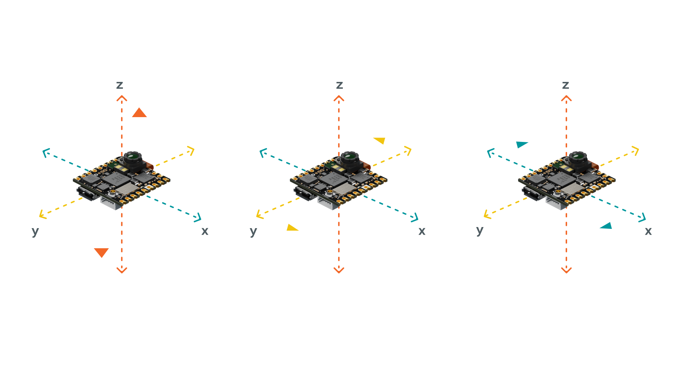
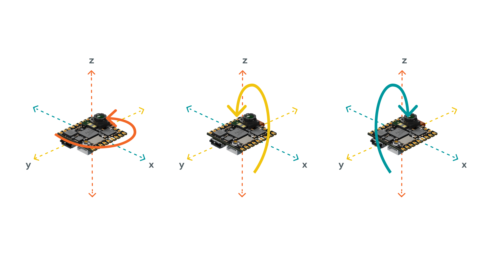

## Overview

In this tutorial, you will learn how to access the gyroscope and accelerometer that are placed on the Nicla Vision board. For this, you will be using the [Arduino_LSM6DSOX](https://www.arduino.cc/en/Reference/ArduinoLSM6DSOX) library and the Arduino IDE, printing the values in the Serial Monitor of the Arduino IDE.

## Goals

The goals of this project are:

- Read accelerometer data
- Read gyroscope data
- Print the data in the Serial Monitor

### Hardware & Software Needed

- Arduino IDE ([online](https://create.arduino.cc/) or [offline](https://www.arduino.cc/en/main/software)).
- [LSM6DSOX library](https://github.com/arduino-libraries/Arduino_LSM6DSOX) 
- [Nicla Vision](https://store.arduino.cc/products/nicla-vision)

## IMU (Inertial Measurement Unit)

An IMU is a component that consists of different sensors and can record data such as specific force, angular rate, orientation. The Nicla Visions IMU has a **gyroscope** and a **accelerometer.** On the image below you can see exactly where the IMU is located on the board.



### Accelerometer & Gyroscope

An accelerometer is an electromechanical device used to measure acceleration forces. Such forces may be static, like the continuous force of gravity, or, as in the case of many mobile devices, dynamic to sense movement or vibrations.



A gyroscope sensor is a device that can measure and maintain the orientation and angular velocity of an object. Gyroscopes are more advanced than accelerometers, since they can measure the tilt and lateral orientation of an object, whereas an accelerometer can only measure its linear motion. Gyroscope sensors are also called "Angular Rate Sensors" or "Angular Velocity Sensors". Measured in degrees per second, angular velocity is the change in the rotational angle of the object per unit of time.



In this tutorial, you will use the gyroscope as an indicator for the direction of the force that is applied to the board. You will also use the accelerometer as a "level" that will provide information about the position of the board. With this application you will be able to read what the relative position of the board is as well as its orientation, by tilting the board up, down, left or right. The results will be visible through the Serial Monitor.

## Instructions

### Setting up the Arduino IDE

Make sure the latest Nicla Core is installed in the Arduino IDE. **Tools > Board > Board Manager...**. Here you need to look for the **Arduino Mbed OS Nicla Boards** and install it. Now you have to install the library needed for the IMU. Go to **Tools > Manage libraries..**, search for **Arduino_LSM6DSOX** and install it.

### IMU Sketch

The full sketch can be found at the end of the **Instructions** section. Upload the sketch to the board.

To use the IMU you first need to include the library. To simplify the values coming from the IMU, you can create a variable for each axis. 

```arduino
#include <Arduino_LSM6DSOX.h>

float Ax, Ay, Az;
float Gx, Gy, Gz;

```

To initializes the library you need to call `IMU.begin()`. When the IMU is initialized, you can quickly check the sample rates of the sensors. Calling `IMU.accelerationSampleRate()` and `IMU.gyroscopeSampleRate()` will read the sampling rate of the respective sensor in Hz. 

```arduino
void setup() {
  Serial.begin(9600);

  while(!Serial);

  if (!IMU.begin()) {
    Serial.println("Failed to initialize IMU!");
    while (1);
  }
  
  Serial.print("Accelerometer sample rate = ");
  Serial.print(IMU.accelerationSampleRate());
  Serial.println("Hz");
  Serial.println();

  Serial.print("Gyroscope sample rate = ");  
  Serial.print(IMU.gyroscopeSampleRate());
  Serial.println("Hz");
  Serial.println();

}
```

In the loop of the sketch you can check the sensors to see if there is data available on the IMU sensors, using `IMU.accelerationAvailable()` and `IMU.gyroscopeAvailable()`. Then you can call `IMU.readAcceleration(Ax, Ay, Az)` to read the accelerometer. It will return the value of the **x**, **y** and **z** axis and update the variables `Ax`, `Ay` and `Az`. You can do the same for the gyroscope, formatting it in the Serial Monitor so it will be a bit easier to read the data. The data is being printed with an interval of 500 milliseconds. This can be adjusted by changing the line `delay(500)` at the bottom of the sketch.

```arduino
void loop() {

  if (IMU.accelerationAvailable()) {
    IMU.readAcceleration(Ax, Ay, Az);

    Serial.println("Accelerometer data: ");
    Serial.print(Ax);
    Serial.print('\t');
    Serial.print(Ay);
    Serial.print('\t');
    Serial.println(Az);
    Serial.println();
  }

  if (IMU.gyroscopeAvailable()) {
    IMU.readGyroscope(Gx, Gy, Gz);
    
    Serial.println("Gyroscope data: ");
    Serial.print(Gx);
    Serial.print('\t');
    Serial.print(Gy);
    Serial.print('\t');
    Serial.println(Gz);
    Serial.println();
  }

delay(500);

}
```

### Testing It Out

After successfully uploading the code to the board, you will need to open the Serial Monitor to initialize the program. Once you open it, data will start printing. 

### Complete Sketch

```arduino
#include <Arduino_LSM6DSOX.h>

float Ax, Ay, Az;
float Gx, Gy, Gz;

void setup() {
  Serial.begin(9600);

  while(!Serial);

  if (!IMU.begin()) {
    Serial.println("Failed to initialize IMU!");
    while (1);
  }
  
  Serial.print("Accelerometer sample rate = ");
  Serial.print(IMU.accelerationSampleRate());
  Serial.println("Hz");
  Serial.println();

  Serial.print("Gyroscope sample rate = ");  
  Serial.print(IMU.gyroscopeSampleRate());
  Serial.println("Hz");
  Serial.println();

}

void loop() {

  if (IMU.accelerationAvailable()) {
    IMU.readAcceleration(Ax, Ay, Az);

    Serial.println("Accelerometer data: ");
    Serial.print(Ax);
    Serial.print('\t');
    Serial.print(Ay);
    Serial.print('\t');
    Serial.println(Az);
    Serial.println();
  }

  if (IMU.gyroscopeAvailable()) {
    IMU.readGyroscope(Gx, Gy, Gz);
    
    Serial.println("Gyroscope data: ");
    Serial.print(Gx);
    Serial.print('\t');
    Serial.print(Gy);
    Serial.print('\t');
    Serial.println(Gz);
    Serial.println();
  }

delay(500);

}
``` 

## Conclusion

In this tutorial you have learned how to use the **Arduino_LSM6DSOX** library to access the IMU on the Nicla Vision. With this you learned how to print the gyroscope and accelerometer data in the Arduino IDE Serial Monitor. 
