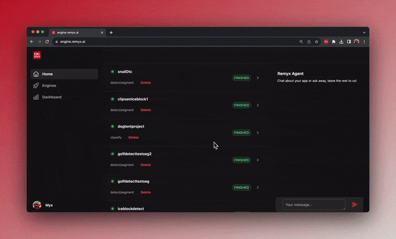

## Overview 
This tutorial shows you how to create a custom computer vision model with Remyx AI to classify images on the Arduino Nicla Vision. The Machine Learning (ML) model will use the TensorFlow Lite format and run on OpenMV.

## Goals

- Learn how to create a model with Remyx AI
- Learn how to use OpenMV to run a classification example
- Learn how to embed a ML model in the OpenMV firmware

## Required Hardware and Software

- [Nicla Vision board](https://store.arduino.cc/products/nicla-vision)
- Micro USB cable
- A [Remyx AI](https://engine.remyx.ai/) account for training the ML model
- Up to 5 objects you'd like to classify. 

This demo identifies the scene using the labels `empty tent interior` and `dog` for doghouse occupancy detection.

## The Remyx AI Platform
Remyx AI makes it easy to create custom vision models, even if you're not an expert. You don't need pre-labeled data, and your privacy is safeguarded because your data isn't collected. The platform is designed to generate models that are optimized for microcontrollers, making it ideal for low-power, battery-operated devices.

### 1. Create your ML Model
Using the Remyx Engine to create a custom image classifier is very straightforward. Chat with the Remyx Agent found in the Home tab and describe your project. Include information about your chosen device, in this case, the Arduino Nicla Vision, and define the labels you want to classify. Here's an example:

> I'm making a dog presence project using the Arduino Nicla Vision. The Arduino needs to differentiate between an empty tent interior and a dog. Name my model DoggyTentExample.




### 2. Test the Model
Training takes around 30 minutes for this example. Soon, you'll see your model's progress on the Home or Dashboard tab. When it's done, click to see more details. To run a quick test, go to "Predictions" on the dashboard, click "Options" and then "Run model in browser". Drop a test image and see the result.


## Using the ML Model

The ML model is trained and converted to be used with microcontrollers. Download your model from the dashboard by clicking "Options" then "Download" and choosing "TFLite".

### Deploy


Make sure you have OpenMV IDE and can connect to your Nicla Vision. Copy the downloaded model.tflite model into the Nicla Vision's drive. Open the following python script in the OpenMV editor. Update the labels as needed for your application.

```python
import sensor, image, time, tf

# Initialize and configure the sensor
sensor.reset()
sensor.set_pixformat(sensor.GRAYSCALE)
sensor.set_framesize(sensor.QVGA)
sensor.skip_frames(time=2000)

# Load the TFLite model
net = tf.load('model.tflite', load_to_fb=True)  # Change the path

# Create a clock object to track the FPS
clock = time.clock()

while True:
    clock.tick()

    # Capture image
    img = sensor.snapshot()

    # Run the TFLite classifier (adjust the input/output tensor as needed)
    obj = net.classify(img, min_scale=1.0, scale_mul=0.5, x_overlap=0.0, y_overlap=0.0)
    # Note: The classify() method's arguments can vary depending on the model,
    # refer to the OpenMV documentation for details.

    # Get classification results
    if obj:
        prediction = obj[0].output()  # This will be a list if you have multiple output nodes in your neural network
        label = prediction.index(max(prediction))
        confidence = max(prediction)
        label = 'Dog' if label else 'Tent Interior'

        # Draw a box around the object and label it
        img.draw_rectangle(obj[0].rect())
        img.draw_string(obj[0].x()+8, obj[0].y()-3, str(label) + ' ' + '{:.2f}'.format(confidence), scale=2.0, mono_space = False)

    print("FPS:", clock.fps())
```

Put the board in bootloader mode and click on the connect symbol in the OpenMV IDE. Finally, press the run button at the bottom left of the IDE to see the streaming inference results from the camera!


## Conclusion

You've created and deployed a custom TFLite machine learning model to your board! 🎉

