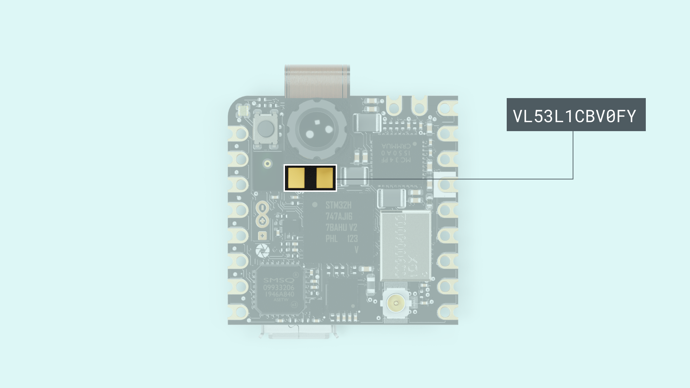

## Overview

In this tutorial you will use the Nicla Vision to detect proximity, thanks to the Time of Flight (ToF) sensor **VL53L1X**.

This tutorial teaches you how to create a sketch that will blink the built-in RGB LED and control the speed of its blink with the proximity values. It can be useful for future projects where there is the need to control the camera only when something is detected in front of the sensor. 

***The Arduino sketch shown is available inside the `Arduino_Pro_Tutorials` library by going to Examples > Nicla Vision > Proximity_Blink***

## Goals

- Set up the needed libraries
- Learn how to interact with the proximity readings
- Change the RGB values of the LED

### Required Hardware and Software

- [Nicla Vision](https://store.arduino.cc/products/nicla-vision)
- VL53L1X library (Available in the Library Manager)

## Instructions

### Time of Flight Sensor



To make sure that the sketch works properly, the latest versions of the **Arduino mbed Core** and the **VL53L1X library** needs to be installed. Both can be found inside the Arduino IDE.

- The **Arduino mbed Core** can be found in the **boards manager...**.  
- The **VL53L1X library** can be found in the **Library manager**, 

If you are using version 1.6.2 or later of the Arduino software (IDE), you can use the Library Manager to install the VL53L1X library:

- In the Arduino IDE, open the "Sketch" menu, select "Include Library", then "Manage Libraries...".
- Search for "VL53L1X".
- Click the VL53L1X entry in the list, authored by Pololu.
- Click "Install". More detailed instructions on how to install a library can be found [here](/learn/starting-guide/software-libraries).


### Include the Needed Libraries and Objects Declaration

First of all, declare the sensor's class so you can access it later on in your sketch. You can use variables to control the time elements in the sketch. This will make sure that the readings stay accurate over time.

```cpp
#include "VL53L1X.h"
VL53L1X proximity;

bool blinkState = false;
int reading = 0;
int timeStart = 0;
int blinkTime = 2000;
```

### Initialize the Proximity Sensor and the LED

Inside the setup you need to initialize and configure the proximity sensor. Also the RGB LED needs to be set as an output to make it light up and enable you to change its behavior.

***The LEDs are accessed in the same way as on the Portenta H7: LEDR, LEDG and LEDB.***

```cpp
  void setup(){
    Serial.begin(115200);
    Wire1.begin();
    Wire1.setClock(400000); // use 400 kHz I2C
    proximity.setBus(&Wire1);
    
    pinMode(LEDB,OUTPUT);
    digitalWrite(LEDB, blinkState);
    
    if (!proximity.init()){
      Serial.println("Failed to detect and initialize sensor!");
      while (1);
    }

    proximity.setDistanceMode(VL53L1X::Long);
    proximity.setMeasurementTimingBudget(10000);
    proximity.startContinuous(10);
  }
```

***Make sure you initialize `Wire1`, set the clock speed to 400 kHz and set the bus pointer to `Wire1`. It will not work if you do not add these setting.***

### Control the Speed of the Blink

The sketch is going to get the reading on every loop, store it and then the state of the LED will change, until the time is up and another proximity reading is taken.

```cpp
  void loop(){
    reading = proximity.read();
    Serial.println(reading);

    if (millis() - timeStart >= reading){
      digitalWrite(LEDB, blinkState);
      timeStart = millis();

      blinkState = !blinkState;
    }
  }
```

### Complete Sketch

```cpp
#include "VL53L1X.h"
VL53L1X proximity;

bool blinkState = false;
int reading = 0;
int timeStart = 0;
int blinkTime = 2000;

void setup() {
  Serial.begin(115200);
  Wire1.begin();
  Wire1.setClock(400000); // use 400 kHz I2C
  proximity.setBus(&Wire1);


  pinMode(LEDB, OUTPUT);
  digitalWrite(LEDB, blinkState);

  if (!proximity.init()) {
    Serial.println("Failed to detect and initialize sensor!");
    while (1);
  }

  proximity.setDistanceMode(VL53L1X::Long);
  proximity.setMeasurementTimingBudget(10000);
  proximity.startContinuous(10);
}

void loop() {
  reading = proximity.read();
  Serial.println(reading);

  if (millis() - timeStart >= reading) {
    digitalWrite(LEDB, blinkState);
    timeStart = millis();

    blinkState = !blinkState;
  }
}
```

## API
| Command                              |                           Details                            | type              |
| :----------------------------------- | :----------------------------------------------------------: | :---------------- |
| setAddress(newAddress)               |      Change the I2C sensor's address (Mandatory to set it to `Wire1`)       | `void`            |
| getAddress()                         |                 Get the Sensor's I2C address                 | `uint8_t`         |
| init()                               | Configures the sensor and needed data. Like the usual begin()| `void`            |
| setDistanceMode(mode)                |  Set the distance mode (check the datasheet). Available modes `VL53L1X::Short`, `VL53L1X::Medium`, `VL53L1X::Long`, `VL53L1X::Unknown` | `void` |
| getDistanceMode()                    |  Returns the mode that has been set. Available modes `VL53L1X::Short`, `VL53L1X::Medium`, `VL53L1X::Long`, `VL53L1X::Unknown`| `enum DistanceMode ` |
| setMeasurementTimingBudget(uSeconds) | Set the time to get the measure, greater the value, better precision. In micro seconds. | `void` |
| getMeasurementTimingBudget()         |        Get the measure timing value in micro seconds.        | `uint32_t`        |
| startContinuous()                    | Start the non stop readings, set the period inside the parameter, after that time you will get the reading. | `void` |
| stopContinuous()                     |               Stop the non stop measurements.                | `void`            |
| read()                               |        Get the last reading from the continuous mode.        | `void`            |
| readSingle()                         |           Trigger one reading and get its result.            | `uint16_t`        |
| dataReady()                          |        Returns if the sensor has new data available.         | `bool`            |
| setTimeout(mSeconds)                 | Configure the milliseconds the sensor will wait in case it is not getting the proper reading to abort, and continue with a new one, 0 disables it. | `void`            |
| getTimeout()                         |              Get the configured timeout value.               | `uint16_t`        |
| timeoutOccurred()                    |       Returns true whenever the sensor had a timeout.        | `bool`            |


## Conclusion

In this tutorial we went through how to get readings from the ToF sensor and how use these readings to change how the built-in LED behaves. At the end of the tutorial you can also find a reference list for the ToF library.
