## Overview

This user manual will guide you through a practical journey covering the most interesting features of the Arduino Nicla Vision. With this user manual, you will learn how to set up, configure and use this Arduino board.

## Hardware and Software Requirements
### Hardware Requirements

- [Arduino Nicla Vision](https://store.arduino.cc/products/nicla-vision) (x1)
- [Micro USB cable](https://store.arduino.cc/products/usb-cable2in1-type-c) (x1)

### Software Requirements

- [OpenMV IDE](https://openmv.io/pages/download)
- [Arduino IDE 1.8.10+](https://www.arduino.cc/en/software), [Arduino IDE 2.0+](https://www.arduino.cc/en/software), or [Arduino Cloud Editor](https://create.arduino.cc/editor)
- To create custom Machine Learning models, the Machine Learning Tools add-on integrated into the [Arduino Cloud](https://create.arduino.cc/iot/) is needed. In case you do not have an Arduino Cloud account, you will need to create one first.

## Product Overview

The Nicla Vision is a ready-to-use, standalone camera board for analyzing and processing images on the edge. Thanks to its 2 MP color camera, smart 6-axis motion sensor, integrated microphone, and distance sensor, it is suitable for asset tracking, object recognition, and predictive maintenance.

The Nicla Vision lets you quickly implement sensor nodes to send collected data to the Arduino® Cloud (or third-party vendor services) via its onboard Wi-Fi® and Bluetooth® module.

### Board Architecture Overview

The Nicla Vision features a robust and efficient architecture that integrates a range of sensors packed into a tiny footprint. Nicla Vision combines a powerful STM32H747AII6 Dual Arm® Cortex®-M7/M4 IC processor with a 2MP color camera that supports TinyML, as well as a smart 6-axis motion sensor, integrated PDM microphone and a Time of Flight distance sensor.


Here is an overview of main components of the board, as shown in the images above:

- **Camera**: the Nicla Vision features a camera based on the GC2145 Color rolling shutter image sensor. The GC2145 incorporates a 1616V x 1232H active pixel
array, on-chip 10-bit ADC, and an image signal processor.
The 2MP GC2145 CMOS camera module is equipped with an 80° (DFOV) stock lens, 1.75 μm pixel size and a focal length of 2.2 mm. It supports RGB output format.
- **Microcontroller**: the heart of the Nicla Vision is the dual-core STM32H747 (U1), including an Arm® Cortex®-M7 running at 480 MHz and an Arm® Cortex®-M4 running at 240 MHz. The two cores communicate via a Remote Procedure Call mechanism that allows calling functions on the other processor seamlessly.
- **Onboard advanced motion sensor**: the board features the LSM6DSOX, a smart IMU that includes a 3-axis accelerometer and a 3-axis gyroscope. The LSM6DSOX has a full-scale acceleration range of ±2/±4/±8/±16 g and an angular rate range of ±125/±250/±500/±1000/±2000 dps.
- **Onboard distance sensor**: the VL53L1CBV0FY Time-of-Flight sensor (U4) adds accurate and low-power ranging capabilities to the Nicla Vision. The invisible near infrared VCSEL laser (including the analog driver) is encapsulated together with receiving optics in an all-in-one small module located below the camera.
- **Digital Microphone**: the MP34DT05 digital MEMS microphone (U6) is omnidirectional and operates via a capacitive sensing element with a high (64 dB) signal-to-noise ratio. The sensing element, capable of detecting acoustic waves, is manufactured using a specialized silicon micromachining process dedicated to audio sensors production.
- **Wireless connectivity**: the Murata® LBEE5KL1DX-883 wireless module (U9) simultaneously provides Wi-Fi® and Bluetooth® connectivity in an ultra-small package based on the Cypress CYW4343W. The IEEE802.11 b/g/n Wi-Fi® interface can operate as an access point (AP), station (STA), or dual-mode simultaneous AP/STA. It supports a maximum transfer rate of 65 Mbps. Bluetooth® interface supports Bluetooth® Classic and Bluetooth® Low Energy. An integrated antenna circuitry switch allows a single external antenna (J6) to be shared between Wi-Fi® and Bluetooth®.
- **Power management**: the Nicla Vision is designed for ultra-low power operation, with efficient power management features that ensure minimal energy consumption even when using always-on motion recognition and image processing. The Nicla Vision features the PF1550 from NXP®, a highly integrated battery charge management integrated circuit (IC) designed for wearables and Internet of Things (IoT) devices. 
- **Security Elements**: the Nicla Vision enables IC level edge-to-cloud security capability through the NXP SE050C2 Crypto chip (U8). This provides Common Criteria EAL 6+ security certification up to OS level, as well as RSA/ECC cryptographic algorithm support and credential storage.

### Board Core and Libraries

#### With OpenMV IDE

Before you can start programming MicroPython scripts for the Nicla Vision, you need to download and install the OpenMV IDE.

Open the [OpenMV](https://openmv.io/pages/download) download page in your browser, download the latest version available for your operating system, and follow the instructions of the installer.


Open the OpenMV IDE and connect the Nicla Vision to your computer via the USB cable if you have not done so yet.


Click on the "connect" symbol at the bottom of the left toolbar.


If your Nicla Vision does not have the latest firmware, a pop-up will ask you to install it. Your board will enter in DFU mode and its green LED will start fading. 

Select `Install the latest release firmware`. This will install the latest OpenMV firmware on the Nicla Vision. You can leave the option of erasing the internal file system unselected and click `OK`.


Nicla Vision's green LED will start flashing while the OpenMV firmware is being uploaded to the board. A loading bar will start showing you the flashing progress.

Wait until the green LED stops flashing and fading. You will see a message saying `DFU firmware update complete!` when the process is done.


The board will start flashing its blue LED when it is ready to be connected. After confirming the completion dialog, the Nicla Vision should already be connected to the OpenMV IDE, otherwise, click the "connect" button (plug symbol) once again (the blue blinking should stop).


While using the Nicla Vision with OpenMV, the RGB LED of the board can be used to inform the user about its current status. Some of the most important ones are the following:

🟢 **Blinking Green:** Your Nicla Vision onboard bootloader is running. The onboard bootloader runs for a few seconds when your Nicla Vision is powered via USB to allow OpenMV IDE to reprogram your Nicla Vision.

🔵 **Blinking Blue:** Your Nicla Vision is running the default __main.py__ script onboard. 

If you overwrite the __main.py__ script on your Nicla Vision, then it will run whatever code you loaded on it instead.

***If the LED is blinking blue but OpenMV IDE cannot connect to your Nicla Vision, please make sure you are connecting your Nicla Vision to your PC with a USB cable that supplies both data and power.***

⚪ **Blinking White:** Your Nicla Vision firmware is panicking because of a hardware failure. Please check that your Nicla Vision's camera module is installed securely.

***If you tap the Nicla Vision reset button once, the board resets. If you tap it twice, the board enters in Device Firmware Upgrade (DFU) mode and its green LED starts blinking and fading.***


#### With Arduino IDE

The **Arduino Mbed OS Nicla Boards** core contains the libraries and examples you need to work with the board's components, such as its camera and IMU. To install the core for Nicla boards, navigate to **Tools > Board > Boards Manager** or click the Boards Manager icon in the left tab of the IDE. In the Boards Manager tab, search for `Nicla Vision` and install the latest `Arduino Mbed OS Nicla Boards` version.


To update the bootloader firmware of your Nicla Vision,  go to **File > Examples > STM32H747_System > STM32H747_manageBootloader** and upload this sketch to your board.


After the sketch is uploaded, follow the instructions in the Serial Monitor.

  

### Pinout


The full pinout is available and downloadable as PDF from the link below:

- [Nicla Vision full pinout](https://docs.arduino.cc/resources/pinouts/ABX00051-full-pinout.pdf)

### Datasheet

The complete datasheet is available and downloadable as PDF from the link below:

- [Nicla Vision datasheet](https://docs.arduino.cc/resources/datasheets/ABX00051-datasheet.pdf)

### Schematics

The complete schematics are available and downloadable as PDF from the link below:

- [Nicla Vision schematics](https://docs.arduino.cc/resources/schematics/ABX00051-schematics.pdf)

### STEP Files

The complete STEP files are available and downloadable from the link below:

- [Nicla Vision STEP files](../../downloads/ABX00051-step.zip)

## First Use
### Powering the Board

The Nicla Vision can be powered by:

- Using a Micro USB cable (not included). 
- Using an external **5 V power supply** connected to `VIN` pin (please, refer to the [board pinout section](#pinout) of the user manual).
- Using a **3.7 V Lithium Polymer (Li-Po) battery** connected to the board through the onboard battery connector; the manufacturer part number of the battery connector is BM03B-ACHSS and its matching receptacle manufacturer part number is ACHR-03V-S. The **recommended minimum battery capacity for the Nicla Vision is 200 mAh**. A Li-Po battery with an integrated NTC thermistor is also recommended for thermal protection. 
- Using the onboard **ESLOV connector**, which has a dedicated 5V power line.

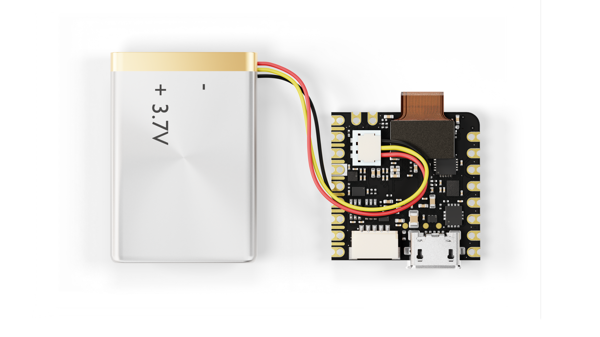

### Hello World Example

Let's program the Nicla Vision with the classic `hello world` example used in the Arduino ecosystem: the `Blink` sketch. We will use this example to verify the board's connection to the IDEs and that the Nicla Vision core and the board itself are working as expected. 

#### With OpenMV
Copy and paste the code below into a new sketch in the OpenMV IDE.
```python
import time
from machine import LED

redLED = LED("LED_RED")
greenLED = LED("LED_GREEN")
blueLED = LED("LED_BLUE")

while True:
    redLED.on()
    time.sleep_ms(1000)
    redLED.off()
    time.sleep_ms(1000)
    greenLED.on()
    time.sleep_ms(1000)
    greenLED.off()
    time.sleep_ms(1000)
    blueLED.on()
    time.sleep_ms(1000)
    blueLED.off()
    time.sleep_ms(1000)
```
To run the code on the Nicla Vision, click the **Connect** button and then the **Start** button.


#### With Arduino IDE

Copy and paste the code below into a new sketch in the Arduino IDE.

```arduino
void setup() {

  pinMode(LEDR, OUTPUT);
  pinMode(LEDG, OUTPUT);
  pinMode(LEDB, OUTPUT);

  digitalWrite(LEDR, HIGH);
  digitalWrite(LEDG, HIGH);
  digitalWrite(LEDB, HIGH);

}

void loop() {

  digitalWrite(LEDR, LOW);  // Nicla Vision LED's turn on with logic '0'
  delay(1000);                     
  digitalWrite(LEDR, HIGH);   
  delay(1000);   
  digitalWrite(LEDG, LOW);  
  delay(1000);                     
  digitalWrite(LEDG, HIGH);   
  delay(1000);
  digitalWrite(LEDB, LOW);  
  delay(1000);                     
  digitalWrite(LEDB, HIGH);   
  delay(1000);

}
```

To upload the code to the Nicla Vision, click the **Verify** button to compile the sketch and check for errors; then click the **Upload** button to program the board with the sketch.

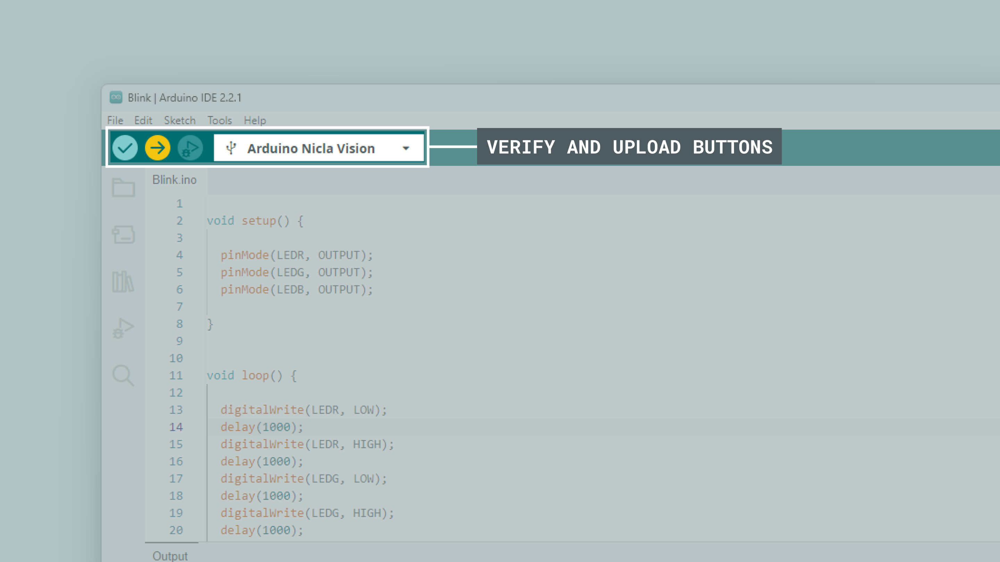

#### Results
You should now repeatedly see the onboard LED turning red, green, and blue.


## Pins
### Analog Pins

The Nicla Vision has **three analog input pins**, mapped as follows:

| **Microcontroller Pin** | **Arduino Pin Mapping** |
| :---------------------: | :---------------------: |
|        ADC1/PC_4        |           A0            |
|       ADC2/PF_13        |           A1            |
|        ADC3/PF_3        |           A2            |

All of them can be used through the built-in functions of the Arduino programming language. 

***The Nicla Vision ADC reference voltage is fixed to 3.3V, this means that it will map the ADC range from 0 to 3.3 volts.***

We will use the Nicla Vision analog inputs on both IDEs, OpenMV and Arduino. For the example codes shown below, we will be reading the analog input `A0` and displaying the read voltage on the Serial Monitor of both IDEs:


#### With OpenMV

Using Micropython on the OpenMV IDE the Nicla boards ADC resolution is fixed to 12 bits (it's maximum).

This example code can also be found on **File > Examples > Board Control > adc_read_ext_channel.py**:

```python
import time
from pyb import ADC

adc = ADC("A0")   # PC4 microcontroller port

while True:
    # The ADC has 12-bits of resolution for 4096 values.
    print(adc.read())
    print("ADC = %fv" % ((adc.read() * 3.3) / 4095))
    time.sleep_ms(100)
```

#### With Arduino IDE

Nicla boards ADC can be configured to 8, 10 or 12 bits defining the argument of the following function respectively (default is 10 bits):

```arduino
analogReadResolution(12);  // ADC resolution set to 12 bits (0-4095)
```
Example code:

```arduino
int potPin = A0;   // select the input pin for the potentiometer

void setup() {
  Serial.begin(115200);
  analogReadResolution(12);
}

void loop() {
  // read the value from the sensor:
  Serial.print("ADC = ");
  Serial.print((analogRead(potPin) * 3.3) / 4095);;
  Serial.println(" v");
  delay(100);
}

```
### Digital Pins

The Nicla Vision has **ten digital pins**, mapped as follows:

| **Microcontroller Pin** | **Arduino Pin Mapping** |
| :---------------------: | :---------------------: |
|          PG_12          |           D0            |
|          PA_9           |           D1            |
|          PA_10          |           D2            |
|          PG_1           |           D3            |
|          PE_12          |          SCKL           |
|          PE_13          |          CIPO           |
|          PE_14          |          COPI           |
|          PE_11          |           CS            |
|          PB_8           |           SCL           |
|          PB_9           |           SDA           |


Notice that I2C and SPI pins can also be used as digital pins. Please, refer to the [board pinout section](#pinout) of the user manual to find them on the board.

***The __analog inputs__ of the Nicla Vision can be used as digital pins but they can just handle 1.8 V, a greater input may damage the board.***

The digital pins of the Nicla Vision can be used as inputs or outputs through the built-in functions of the Arduino programming language. 

***The Nicla Vision digital I/O's are low power, so to drive output devices like LEDs, resistive loads, buzzers, etc, it is recommended to use a MOSFET driver or a buffer to guarantee the required current flow. Learn more about the Nicla I/O's considerations [here](https://docs.arduino.cc/learn/hardware/nicla-form-factor).***

As an application example after learning the __Digital Pins__ basics, we are going to control an LED using a push button. See the wiring below:


#### With OpenMV

The configuration of a digital pin is done in the upper section of the code as shown below:

```python
# Pin configured as an input
pin1 = Pin("D1", Pin.IN, Pin.PULL_NONE)          
# Pin configured as an input, internal pull-up resistor enabled
pin1 = Pin("D1", Pin.IN, Pin.PULL_UP) 
# Pin configured as an output
pin0 = Pin("D0", Pin.OUT_PP, Pin.PULL_NONE)     
```
The pin function can be set as: `Pin.IN`, `Pin.OUT_PP`, `Pin.OUT_OD`, `Pin.AF_PP`, or `Pin.AF_OD`. An explanation of the pin modes can be found [here](https://docs.openmv.io/library/pyb.Pin.html#methods). The third parameter represents the pull-up/pull-down resistor. It can be set to: `Pin.PULL_NONE`, `Pin.PULL_UP` or `Pin.PULL_DOWN`.

The state of a digital pin, configured as an input, can be read as shown below:

```python
# Reads pin1 state, stores value in "state" variable
state = pin1.value()
```

The state of a digital pin, configured as an output, can be changed as shown below:

```python
# Set pin0 on
pin0.value(True)    
# Set pin0 off
pin0.value(False)    
```
The example code shown below uses digital pin `D0` to control an LED and reads the state of a button connected to digital pin `D1`:

```python
import time
from machine import Pin

# Define button and LED pin
button = Pin("D1", Pin.IN, Pin.PULL_UP)
led = Pin("D0", Pin.OUT_PP, Pin.PULL_NONE)

while True:
    if button.value() == 0:   # if the button is pressed
        led.value(1)
        print("- Button is pressed. LED is on.")
    else:                     # if the button is not pressed
        led.value(0)
        print("- Button is not pressed. LED is off.")
    time.sleep_ms(1000)       # wait for a second

```
#### With Arduino IDE
The configuration of a digital pin is done in the `setup()` function with the built-in function `pinMode()` as shown below:

```arduino
// Pin configured as an input
pinMode(D1, INPUT);             
// Pin configured as an input, internal pull-up resistor enabled
pinMode(D1, INPUT_PULLUP);  
// Pin configured as an output
pinMode(D0, OUTPUT);   
```

The state of a digital pin, configured as an input, can be read using the built-in function `digitalRead()` as shown below:

```arduino
// Reads pin state, stores value in state variable
state = digitalRead(D1);
```

The state of a digital pin, configured as an output, can be changed using the built-in function `digitalWrite()` as shown below:

```arduino
// Set pin on
digitalWrite(D0, HIGH);    
// Set pin off
digitalWrite(D0, LOW);    
```
The example code shown below uses digital pin `D0` to control an LED and reads the state of a button connected to digital pin `D1`:

```arduino
// Define button and LED pin
int buttonPin = D1;
int ledPin = D0;

// Variable to store the button state
int buttonState = 0;

void setup() {
  // Configure button and LED pins
  pinMode(buttonPin, INPUT_PULLUP);
  pinMode(ledPin, OUTPUT);
  // Initialize Serial communication
  Serial.begin(115200);
}

void loop() {
  // Read the state of the button
  buttonState = digitalRead(buttonPin);
  // If the button is pressed, turn on the LED and print its state to the Serial Monitor
  if (buttonState == LOW) {
    digitalWrite(ledPin, HIGH);
    Serial.println("- Button is pressed. LED is on.");
  } else {
    // If the button is not pressed, turn off the LED and print to the Serial Monitor
    digitalWrite(ledPin, LOW);
    Serial.println("- Button is not pressed. LED is off.");
  }
  // Wait for 1000 milliseconds
  delay(1000);
}
```

### PWM Pins

Most digital pins of the Nicla Vision can be used as PWM (Pulse Width Modulation) pins, including I2C and SPI interfaces. 

#### With OpenMV

PWM outputs can be controlled with MicroPython easily by using built-in functions as shown below:

First, we need to identify the `Timer` and `Channel` used by the `PWM` output to be used. For this, search for the desired pin on the [STM32H747 datasheet](https://www.st.com/resource/en/datasheet/stm32h747ai.pdf) from page 89.

Here is a table with the details of the exposed pins on the Nicla Vision:

| **Microcontroller Pin** | **Arduino Pin Mapping** | **Timer** | **Channel** |
| :---------------------: | :---------------------: | :-------: | :---------: |
|          PA_9           |           D1            |  TIMER1   |     CH2     |
|          PA_10          |           D2            |  TIMER1   |     CH3     |
|          PB_8           |           SCL           |  TIMER4   |     CH3     |
|          PB_9           |           SDA           |  TIMER4   |     CH4     |
|          PE_11          |           CS            |  TIMER1   |     CH2     |
|          PE_12          |          SCKL           |  TIMER1   |     CH3     |
|          PE_13          |          CIPO           |  TIMER1   |     CH3     |
|          PE_14          |          COPI           |  TIMER1   |     CH4     |


To use the PWM functions, you need to import the `time`, `Pin`, and `Timer` modules.

```python
import time
from pyb import Pin, Timer
```

First you need to choose the pin you want to use PWM with.

```python
OUT = Pin("D1", Pin.OUT_PP, Pin.PULL_NONE)
```

Create a timer for the PWM, where you set the `timer number` (following the table from above) and the frequency.

```python
timer1 = Timer(1, freq=1000)
```

Then you need to start a `PWM channel` (following the table from above) with the timer object. 

```python
channel1 = timer1.channel(2, Timer.PWM, pin=OUT, pulse_width_percentage=0)
```

Get or set the pulse width value on a channel. To get, pass no arguments. To set, give a value as an argument.

```python
channel1.pulse_width_percentage(Width) # Width (0-100)
```
As a complete example here is a code to generate a __50% duty cycle__ PWM signal at __10 Khz__.

```python
import time
from pyb import Pin, Timer

# D1 is connected to TIMER1_CH2

OUT = Pin("D1")

timer1 = Timer(1, freq=10000)
channel1 = timer1.channel(2, Timer.PWM, pin=OUT, pulse_width_percent=0)

channel1.pulse_width_percent(50)


while True:
    time.sleep_ms(1000)

```


#### With Arduino IDE

This functionality can be used with the built-in function `analogWrite()` as shown below:

```arduino
analogWrite(pin, value);  
```
The output resolution is 8 bits by default, so the output value should be between 0 and 255. To set a greater resolution, you can use the built-in function `analogWriteResolution` as shown below:

```arduino
analogWriteResolution(bits);  
```

Using `analogWrite` has some limitations, for example, the PWM signal frequency is fixed at 763 Hz, and this could not be ideal for every application.

```arduino
// 12 bits PWM 50% duty cycle example code

void setup() {
  analogWriteResolution(12);    // 12 bits (0-4095)
}

void loop() {
  analogWrite(D1, 2048);    // PWM output on D1
}
```


## Onboard Sensors

The Nicla Vision comes with various onboard sensors that allow you to capture and process motion data via a 6-axis IMU, distance with a Time of Flight (ToF) sensor, record sound with a PDM microphone, and capture images and videos with a camera. 

The onboard sensors can be used for developing various applications, such as voice commanded projects, activity recognition, vibration detection and image classification. The onboard sensors are suitable for Machine Learning applications using our [Arduino Cloud ML Tools](https://cloud.arduino.cc/machine-learning-tools/).

### IMU

The Nicla Vision features an advanced IMU, which allows the board to sense motion. The IMU on the board is the LSM6DSOXTR from ST®. It consists of a 3-axis accelerometer and a 3-axis gyroscope. They can provide information about the board's motion, orientation, and rotation in a 3D space.

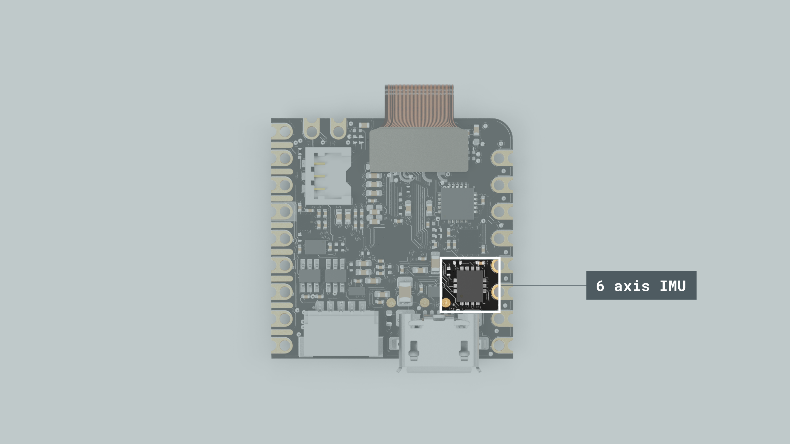

#### With OpenMV

In this MicroPython environment, you can choose between a basic usage of the IMU by sampling raw motion data using the example code below.

```python
import time
from lsm6dsox import LSM6DSOX
from machine import Pin
from machine import SPI

lsm = LSM6DSOX(SPI(5), cs=Pin("PF6", Pin.OUT_PP, Pin.PULL_UP))

while True:
    print("Accelerometer: x:{:>8.3f} y:{:>8.3f} z:{:>8.3f}".format(*lsm.accel()))
    print("Gyroscope:     x:{:>8.3f} y:{:>8.3f} z:{:>8.3f}".format(*lsm.gyro()))
    print("")
    time.sleep_ms(100)
```


Also, you can develop Machine Learning applications using the Nicla Vision IMU. As a practical example, we are going to test a `Vibration monitoring` model that will be able to identify three states: `no vibration`, `low vibration` and `high vibration`.

First, download the pre-trained model file from the [example repository](https://github.com/STMicroelectronics/STMems_Machine_Learning_Core/tree/master/application_examples/lsm6dsox/Vibration%20monitoring) and copy it to the Nicla Vision storage drive.


Reset the board and run the following code on the OpenMV IDE.

```python
from machine import Pin
from machine import SPI
from lsm6dsox import LSM6DSOX

INT_MODE = True  # Run in interrupt mode.
INT_FLAG = False  # Set True on interrupt.


def imu_int_handler(pin):
    global INT_FLAG
    INT_FLAG = True


if INT_MODE is True:
    int_pin = Pin("PA1", mode=Pin.IN, pull=Pin.PULL_UP)
    int_pin.irq(handler=imu_int_handler, trigger=Pin.IRQ_RISING)

# Vibration detection example
UCF_FILE = "lsm6dsox_vibration_monitoring.ucf"
UCF_LABELS = {0: "no vibration", 1: "low vibration", 2: "high vibration"}
# NOTE: Selected data rate and scale must match the MLC data rate and scale.
lsm = LSM6DSOX(
    SPI(5),
    cs=Pin("PF6", Pin.OUT_PP, Pin.PULL_UP),
    gyro_odr=26,
    accel_odr=26,
    gyro_scale=2000,
    accel_scale=4,
    ucf=UCF_FILE,
)

print("MLC configured...")

while True:
    if INT_MODE:
        if INT_FLAG:
            INT_FLAG = False
            print(UCF_LABELS[lsm.mlc_output()[0]])
    else:
        buf = lsm.mlc_output()
        if buf is not None:
            print(UCF_LABELS[buf[0]])

```

In the OpenMV IDE Serial Monitor, the inference results will be printed after a vibration event.


***You can download and test many other pre-trained models available in this [repository](https://github.com/STMicroelectronics/STMems_Machine_Learning_Core/tree/master/application_examples/lsm6dsox).***

#### With Arduino IDE

First, to use this sensor with the Arduino IDE, you need to install the `Arduino_LSM6DSOX` library, which can be found in the Arduino IDE library manager. To do so in the IDE, select it from the left side menu, search for `LSM6DSOX` and install the one from Arduino.

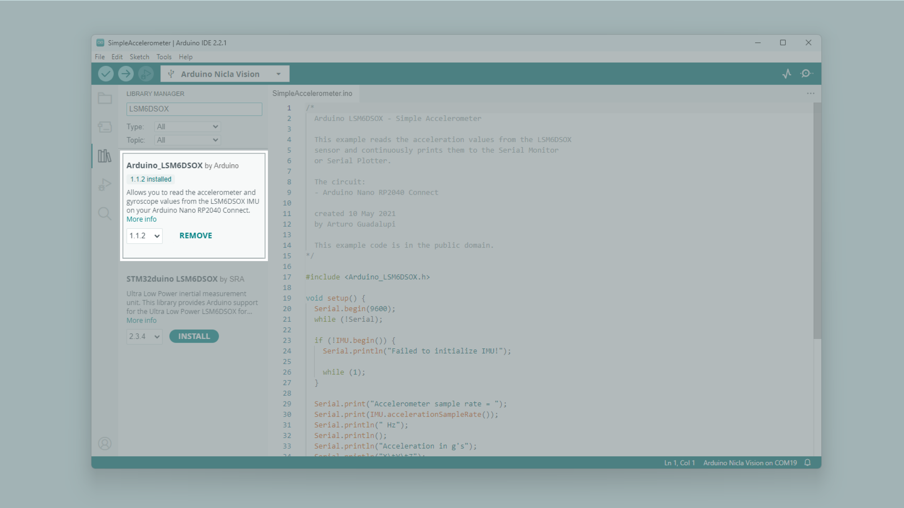

The example code below shows how to get acceleration and angular velocity data from the onboard IMU and stream it to the IDE's Serial Monitor and Serial Plotter.

```arduino
#include <Arduino_LSM6DSOX.h>

void setup() {
  Serial.begin(9600);
  while (!Serial)
    ;

  if (!IMU.begin()) {
    Serial.println("Failed to initialize IMU!");

    while (1)
      ;
  }

  Serial.print("Accelerometer sample rate = ");
  Serial.print(IMU.accelerationSampleRate());
  Serial.println(" Hz");
  Serial.println();
  Serial.println("Acceleration in g's");
  Serial.println("X\tY\tZ");

  Serial.print("Gyroscope sample rate = ");
  Serial.print(IMU.gyroscopeSampleRate());
  Serial.println(" Hz");
  Serial.println();
  Serial.println("Gyroscope in degrees/second");
  Serial.println("X\tY\tZ");

  delay(3000);  // Wait 3 seconds
}

void loop() {
  float a_x, a_y, a_z;

  if (IMU.accelerationAvailable()) {
    IMU.readAcceleration(a_x, a_y, a_z);

    Serial.print("acc_X:");
    Serial.print(a_x);
    Serial.print(",");
    Serial.print("acc_Y:");
    Serial.print(a_y);
    Serial.print(",");
    Serial.print("acc_Z:");
    Serial.println(a_z);
  }
  float g_x, g_y, g_z;

  if (IMU.gyroscopeAvailable()) {
    IMU.readGyroscope(g_x, g_y, g_z);

    Serial.print("gyro_X:");
    Serial.print(g_x);
    Serial.print(",");
    Serial.print("gyro_Y:");
    Serial.print(g_y);
    Serial.print(",");
    Serial.print("gyro_Z:");
    Serial.println(g_z);
  }
}
```


***To test a Machine Learning model on the Arduino IDE, navigate to __File > Examples > MLC > NiclaVision_MLC_Motion_Intensity__ and it will identify three scenarios: `Stationary`, `Medium Intensity` and `High Intensity` movements.***

### Microphone

The onboard high-performance microphone of the Nicla Vision is the MP34DT06JTR from ST®. It is specifically designed for applications that require high-quality audio recording and accurate voice detection, such as voice-controlled Internet of Things (IoT) devices, smart home systems, and mobile devices.

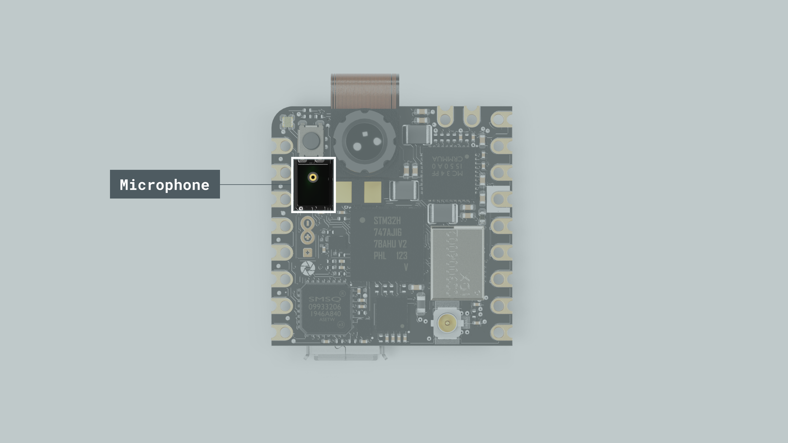

#### Using OpenMV

The OpenMV IDE includes some examples to get started using the Nicla Vision onboard microphone that can be found on **File > Examples > Audio**. We are going to use the one called `micro_speech.py` to test the machine-learning speech recognition capabilities of the board.

First, download the pre-trained model file from the [example repository](https://raw.githubusercontent.com/iabdalkader/microspeech-yesno-model/main/model.tflite) and **copy** it to the Nicla Vision **storage drive**.


Reset the board and run the following code on the OpenMV IDE.

```python
import time
from ml.apps import MicroSpeech
import pyb


led_red = pyb.LED(1)
led_green = pyb.LED(2)


def callback(label, scores):
    print(f'\nHeard: "{label}" @{time.ticks_ms()}ms Scores: {scores}')
    
    led = led_green if label == "Yes" else led_red

    for i in range(0, 4):
        led.on()
        time.sleep_ms(25)
        led.off()
        time.sleep_ms(25)

        


# By default, the MicroSpeech object uses the built-in audio preprocessor (float) and the
# micro speech module for audio preprocessing and speech recognition, respectively. The
# user can override both by passing two models:
# MicroSpeech(preprocessor=ml.Model(...), micro_speech=ml.Model(...), labels=["label",...])
speech = MicroSpeech()

# Starts the audio streaming and processes incoming audio to recognize speech commands.
# If a callback is passed, listen() will loop forever and call the callback when a keyword
# is detected. Alternatively, `listen()` can be called with a timeout (in ms), and it
# returns if the timeout expires before detecting a keyword.
speech.listen(callback=callback, threshold=0.8)
```
After running the code, the matches will be printed on the Serial Monitor if the board hears a `No` or a `Yes`, turning on the red and green LED respectively.

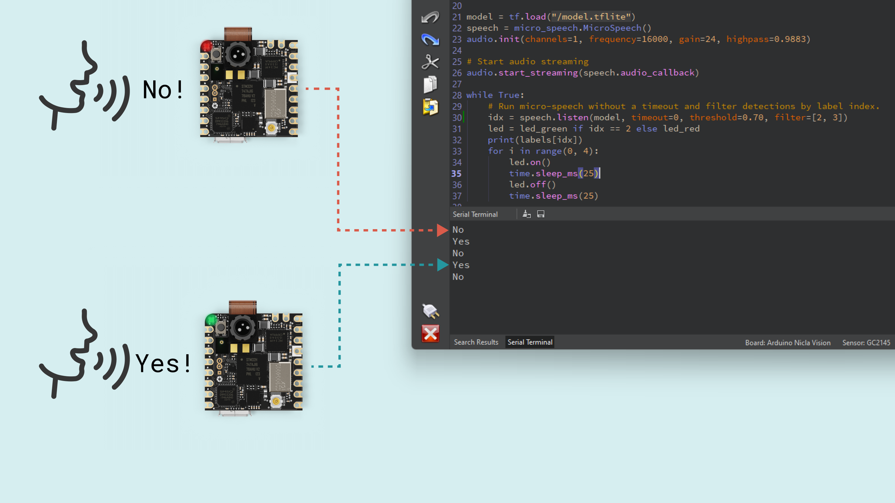

#### Using Arduino IDE

The Arduino IDE includes a simple example to visualize raw data from the PDM microphone. To test it, navigate to **File > Examples > PDM > PDMSerialPlotter**. 

```arduino
#include <PDM.h>

// default number of output channels
static const char channels = 1;

// default PCM output frequency
static const int frequency = 16000;

// Buffer to read samples into, each sample is 16-bits
short sampleBuffer[512];

// Number of audio samples read
volatile int samplesRead;

void setup() {
  Serial.begin(9600);
  while (!Serial);

  // Configure the data receive callback
  PDM.onReceive(onPDMdata);

  // Optionally set the gain
  // Defaults to 20 on the BLE Sense and 24 on the Portenta Vision Shield
  // PDM.setGain(30);

  // Initialize PDM with:
  // - one channel (mono mode)
  // - a 16 kHz sample rate for the Arduino Nano 33 BLE Sense
  // - a 32 kHz or 64 kHz sample rate for the Arduino Portenta Vision Shield
  if (!PDM.begin(channels, frequency)) {
    Serial.println("Failed to start PDM!");
    while (1);
  }
}

void loop() {
  // Wait for samples to be read
  if (samplesRead) {

    // Print samples to the serial monitor or plotter
    for (int i = 0; i < samplesRead; i++) {
      if(channels == 2) {
        Serial.print("L:");
        Serial.print(sampleBuffer[i]);
        Serial.print(" R:");
        i++;
      }
      Serial.println(sampleBuffer[i]);
    }

    // Clear the read count
    samplesRead = 0;
  }
}

/**
 * Callback function to process the data from the PDM microphone.
 * NOTE: This callback is executed as part of an ISR.
 * Therefore using `Serial` to print messages inside this function isn't supported.
 * */
void onPDMdata() {
  // Query the number of available bytes
  int bytesAvailable = PDM.available();

  // Read into the sample buffer
  PDM.read(sampleBuffer, bytesAvailable);

  // 16-bit, 2 bytes per sample
  samplesRead = bytesAvailable / 2;
}
```

Upload the example code to the Nicla Vision and open the Serial Plotter to see the sound wave output.


### Time of Flight (Distance) Sensor

The onboard ToF sensor of the Nicla Vision is the VL53L1CBV0FY from ST®. It adds accurate and low power ranging capabilities to the Nicla Vision. The invisible near-infrared VCSEL laser (including the analog driver) is encapsulated with receiving optics in an all-in-one small module located below the camera.


Here are listed the sensor's main features:
- Up to 400 cm distance measurement
- Up to 50 Hz ranging frequency
- 27° field-of-view (FoV) 

#### With OpenMV

The OpenMV IDE includes an example to start using the ToF sensor. To test it, navigate to **File > Examples > Sensors > vl53l1x_tof** and run it on the Nicla Vision. 

```python
from machine import I2C
from vl53l1x import VL53L1X
import time

tof = VL53L1X(I2C(2))

while True:
    print(f"Distance: {tof.read()}mm")
    time.sleep_ms(50)
```


#### With Arduino IDE

To use the ToF sensor with the Arduino IDE, install the `VL53L1X` library authored by Pololu by searching for it on the IDE library manager and clicking on install.

Once installed, you will be able to compile and upload the example code below to your Nicla Vision.

The distance measured by the sensor will be printed on the IDE's Serial Monitor, and the built-in LED will blink proportionally to that distance.

```arduino 
#include "VL53L1X.h"
VL53L1X proximity;

bool blinkState = false;
int reading = 0;
int timeStart = 0;
int blinkTime = 2000;

void setup() {
  Serial.begin(115200);
  Wire1.begin();
  Wire1.setClock(400000); // use 400 kHz I2C
  proximity.setBus(&Wire1);


  pinMode(LEDB, OUTPUT);
  digitalWrite(LEDB, blinkState);

  if (!proximity.init()) {
    Serial.println("Failed to detect and initialize sensor!");
    while (1);
  }

  proximity.setDistanceMode(VL53L1X::Long);
  proximity.setMeasurementTimingBudget(50000);
  proximity.startContinuous(50);
}

void loop() {
  reading = proximity.read();
  Serial.print(reading);
  Serial.println(" mm");

  if (millis() - timeStart >= reading) {
    digitalWrite(LEDB, blinkState);
    timeStart = millis();

    blinkState = !blinkState;
  }
}
```


### Camera

The Nicla Vision's main feature is its onboard 2MP camera, based on the GC2145 color rolling shutter image sensor. It is perfect for Machine Learning applications such as object detection, image classification, machine/computer vision, robotics, IoT, and more.


The Nicla Vision is primarily intended to be used with the OpenMV MicroPython ecosystem. So, it's recommended to use this IDE for machine vision applications.


#### With OpenMV

The OpenMV IDE is designed to work specifically with machine/computer vision hardware, it is optimized for easy and fast development of image processing applications with a MicroPython framework and streaming monitors, color data graphics, and more.

The Nicla Vision uses a 2MP camera sensor, meaning its maximum resolution is 1920x1080 pixels. However, the effective resolution is 1616(H) × 1232(V).

Here we have the minimum code necessary to make the camera work streaming live video on the OpenMV IDE:

```python
import sensor
import time

sensor.reset()  # Reset and initialize the sensor.
sensor.set_pixformat(sensor.RGB565)  # Set pixel format to RGB565 (or GRAYSCALE)
sensor.set_framesize(sensor.QVGA)  # Set frame size to QVGA (320x240)
sensor.skip_frames(time=2000)  # Wait for settings take effect.
clock = time.clock()  # Create a clock object to track the FPS.

while True:
    clock.tick()  # Update the FPS clock.
    img = sensor.snapshot()  # Take a picture and return the image.
    print(clock.fps())  # Note: OpenMV Cam runs about half as fast when connected
    # to the IDE. The FPS should increase once disconnected.
```


From the above example script, we can highlight the main functions:

- `sensor.set_pixformat(<Sensor>)` lets you set the pixel format for the camera sensor. The Nicla Vision is compatible with these: `sensor.GRAYSCALE`, `sensor.RGB565`, `sensor.BAYER`, and `sensor.YUV422`. 

  To define the pixel format to any of the supported ones, just add it to the `set_pixformat` function argument.

- `sensor.set_framesize(<Resolution>)` lets you define the image frame size in terms of pixels. [Here](https://docs.openmv.io/library/omv.sensor.html#sensor.set_framesize) you can find all the different options.

- `sensor.snapshot()` lets you take a picture and return the image so you can save it, stream it or process it.

The example code below lets you take a picture and save it on the Nicla Vision local storage as `example.jpg`.

```python
import sensor
import time
import machine

sensor.reset()  # Reset and initialize the sensor.
sensor.set_pixformat(sensor.RGB565)  # Set pixel format to RGB565 (or GRAYSCALE)
sensor.set_framesize(sensor.QVGA)  # Set frame size to QVGA (320x240)
sensor.skip_frames(time=2000)  # Wait for settings take effect.

led = machine.LED("LED_BLUE")

start = time.ticks_ms()
while time.ticks_diff(time.ticks_ms(), start) < 3000:
    sensor.snapshot()
    led.toggle()

led.off()

img = sensor.snapshot()
img.save("example.jpg")  # or "example.bmp" (or others)

raise (Exception("Please reset the camera to see the new file."))
```
After the snapshot is taken, reset the board by pressing the reset button and the image will be on the board storage drive.

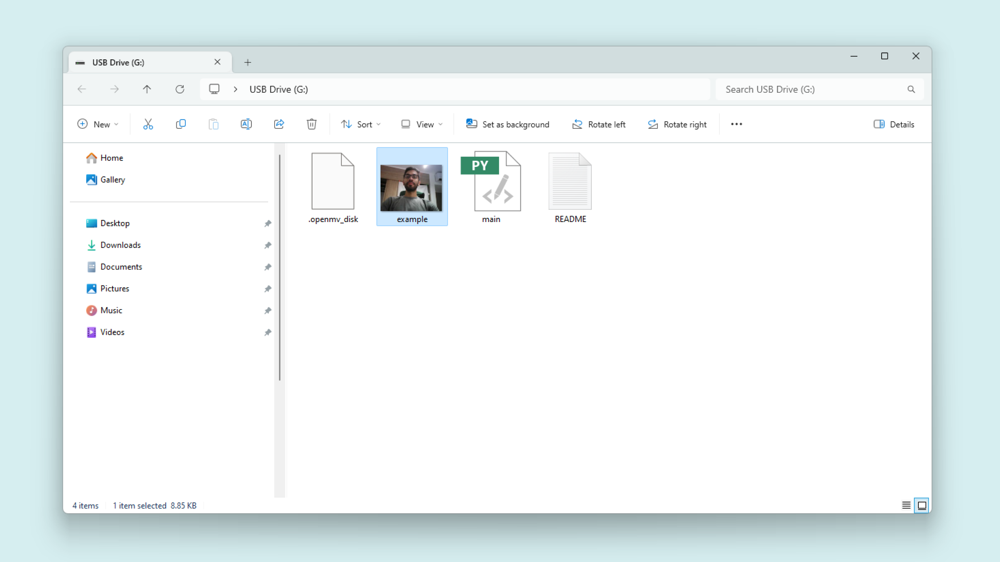

The example code below lets you record a video and save it on the Nicla Vision local storage as `example.mjpeg`.

```python
import sensor
import time
import mjpeg
import machine

sensor.reset()  # Reset and initialize the sensor.
sensor.set_pixformat(sensor.RGB565)  # Set pixel format to RGB565 (or GRAYSCALE)
sensor.set_framesize(sensor.QVGA)  # Set frame size to QVGA (320x240)
sensor.skip_frames(time=2000)  # Wait for settings take effect.

led = machine.LED("LED_RED")

led.on()
m = mjpeg.Mjpeg("example.mjpeg")

clock = time.clock()  # Create a clock object to track the FPS.
for i in range(200):
    clock.tick()
    m.add_frame(sensor.snapshot())
    print(clock.fps())

m.close(clock.fps())
led.off()

raise (Exception("Please reset the camera to see the new file."))
```
After the video is recorded, reset the board by pressing the reset button and the file will be on the board storage drive.


***We recommend using [VLC](https://www.videolan.org/vlc/index.es.html) to play the video due to the format.***

The next example lets you live stream what the camera sees through HTTP so you can watch it on your favorite browser from any device connected to the same network as the Nicla Vision.

Make sure to fill in the `SSID` and `KEY` variables with your Wi-Fi® credentials.

```python
import sensor
import time
import network
import socket

SSID = "*********"  # Network SSID
KEY = "************"  # Network key
HOST = ""  # Use first available interface
PORT = 8080  # Arbitrary non-privileged port

# Init sensor
sensor.reset()
sensor.set_framesize(sensor.QVGA)
sensor.set_pixformat(sensor.RGB565)

# Init wlan module and connect to network
wlan = network.WLAN(network.STA_IF)
wlan.active(True)
wlan.connect(SSID, KEY)

while not wlan.isconnected():
    print('Trying to connect to "{:s}"...'.format(SSID))
    time.sleep_ms(1000)

# We should have a valid IP now via DHCP
print("WiFi Connected ", wlan.ifconfig())

# Create server socket
s = socket.socket(socket.AF_INET, socket.SOCK_STREAM)
s.setsockopt(socket.SOL_SOCKET, socket.SO_REUSEADDR, True)

# Bind and listen
s.bind([HOST, PORT])
s.listen(5)

# Set server socket to blocking
s.setblocking(True)


def start_streaming(s):
    print("Waiting for connections..")
    client, addr = s.accept()
    # set client socket timeout to 5s
    client.settimeout(5.0)
    print("Connected to " + addr[0] + ":" + str(addr[1]))

    # Read request from client
    data = client.recv(1024)
    # Should parse client request here

    # Send multipart header
    client.sendall(
        "HTTP/1.1 200 OK\r\n"
        "Server: OpenMV\r\n"
        "Content-Type: multipart/x-mixed-replace;boundary=openmv\r\n"
        "Cache-Control: no-cache\r\n"
        "Pragma: no-cache\r\n\r\n"
    )

    # FPS clock
    clock = time.clock()

    # Start streaming images
    # NOTE: Disable IDE preview to increase streaming FPS.
    while True:
        clock.tick()  # Track elapsed milliseconds between snapshots().
        frame = sensor.snapshot()
        cframe = frame.compressed(quality=35)
        header = (
            "\r\n--openmv\r\n"
            "Content-Type: image/jpeg\r\n"
            "Content-Length:" + str(cframe.size()) + "\r\n\r\n"
        )
        client.sendall(header)
        client.sendall(cframe)
        print(clock.fps())


while True:
    try:
        start_streaming(s)
    except OSError as e:
        print("socket error: ", e)
        # sys.print_exception(e)

```

Once you run this script, the Nicla Vision IP address will be printed on the OpenMV serial monitor after the Wi-Fi® connection processes. 

To watch the live stream, enter the device IP address followed by the `:8080` port as follows:

`<Nicla Vision IP>:8080`


To expand your knowledge using the Nicla Vision camera with MicroPython, try other built-in examples within the OpenMV IDE.


## Machine Learning Tools

The Nicla Vision is a ready-to-use, standalone camera board, ready for analyzing and processing images on the Edge. Thanks to its 2MP color camera, smart 6-axis motion sensor, integrated microphone, and distance sensor, it is suitable for almost infinite machine-learning applications.

Creating this type of application has never been easier thanks to our Machine Learning Tool powered by Edge Impulse®, where we can easily create in a __No-Code__ environment, __Audio__, __Motion__, __Proximity__ and __Image__ processing models.

The first step to start creating awesome artificial intelligence and machine learning projects is to create an [Arduino Cloud](https://cloud.arduino.cc/home/) account.

There you will find a dedicated integration called __Machine Learning Tools__.

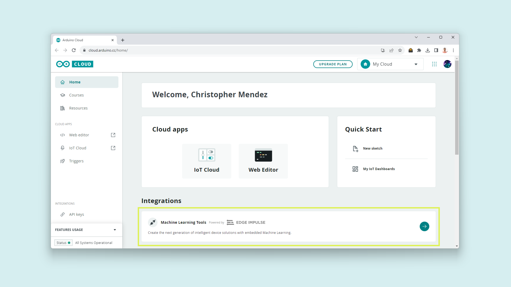

Once in, create a new project and give it a name.


Enter your newly created project and the landing page will look like the following:


### Edge Impulse® Environment Setup

Now, it is time to set up the __Edge Impulse®__ environment on your PC. For this, follow [these](https://docs.edgeimpulse.com/docs/tools/edge-impulse-cli/cli-installation) instructions to install the __Edge Impulse CLI__.

***For Windows users: make sure to install [Visual Studio Community](https://visualstudio.microsoft.com/downloads/) and[Visual Studio Build Tools](https://visualstudio.microsoft.com/downloads/#build-tools-for-visual-studio-2022).***

- Download and install the latest __Arduino CLI__ from [here](https://arduino.github.io/arduino-cli/0.35/installation/). ([Video Guide for Windows](https://www.youtube.com/watch?v=1jMWsFER-Bc))  

- Download the [latest Edge Impulse® firmware](https://cdn.edgeimpulse.com/firmware/arduino-nicla-vision.zip), and unzip the file.

- Open the flash script for your operating system (`flash_windows.bat`, `flash_mac.command` or `flash_linux.sh`) to flash the firmware.

- To test if the __Edge Impulse CLI__ was installed correctly, open the __Command Prompt__ or your favorite terminal and run:

  `edge-impulse-daemon`

  If everything went okay, you should be asked for your account credentials.

  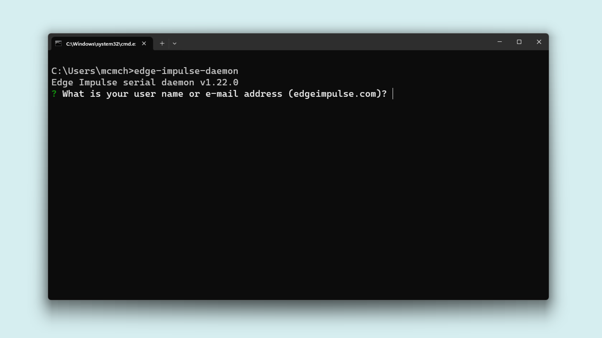

- Enter your account username or e-mail address and your password. 
- Select the project you have created on the Arduino ML Tools, it will be listed.
- Give your device a name and wait for it to connect to the platform.

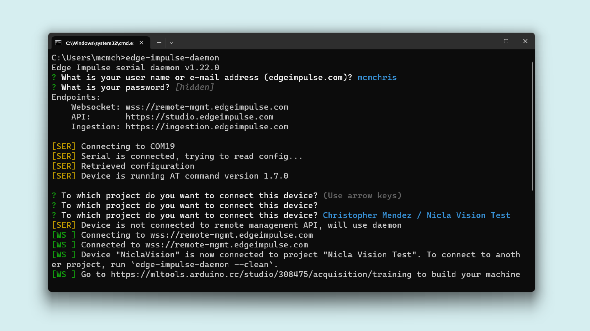

### Uploading Sensor Data 

The first thing to start developing a machine learning project is to create a dataset for your model. This means, uploading data to your model from any of the Nicla Vision sensors.

To upload data from your Nicla Vision on the Machine Learning Tools platform, navigate to __Data Acquisition__.


In this section, you will be able to select the Nicla Vision onboard sensors individually or several interesting combinations. 

This is the supported sensors list:
- Built-in microphone
- Inertial (IMU)
- ADC sensor (A0)
- Proximity sensor
- Camera (different resolutions)

Now you know how to start with our __Machine Learning Tools__ creating your dataset from scratch, you can get inspired by some of our ML projects listed below: 

- [Image Classification with Edge Impulse®](https://docs.arduino.cc/tutorials/nicla-vision/image-classification) (Article).
- [Glass-Breaking Detector using Edge Impulse®](https://www.youtube.com/watch?v=x65tRhBIWwY) (Video).

## Communication

This section of the user manual covers the different communication protocols that are supported by the Nicla Vision, including the Serial Peripheral Interface (SPI), Inter-Integrated Circuit (I2C), Universal Asynchronous Receiver-Transmitter (UART), and Bluetooth® Low Energy; communication via the onboard ESLOV connector is also explained in this section. The Nicla Vision features dedicated pins for each communication protocol, making connecting and communicating with different components, peripherals, and sensors easy.

### SPI

The Nicla Vision supports SPI communication, which allows data transmission between the board and other SPI-compatible devices. The pins used in the Nicla Vision for the SPI communication protocol are the following:

| **Microcontroller Pin** | **Arduino Pin Mapping** |
| :---------------------: | :---------------------: |
|      SCLK / PE_12       |      SCKL or PE12       |
|      CIPO / PE_13       |      CIPO or PE13       |
|      COPI / PE_14       |      COPI or PE14       |
|       CS / PE_11        |       CS or PE11        |


Please, refer to the [board pinout section](#pinout) of the user manual to localize them on the board.

#### With OpenMV

Import the `SPI` submodule from the `pyb` module at the top of your sketch alongside `time` and `Pin` to use the SPI communication protocol. The SPI driver provides functions for SPI communication:

```python
import time
from pyb import Pin, SPI
```
Before your infinite loop, configure the chip select (`CS`) pin and initialize the SPI peripheral as a `Master`:

```python
spi = SPI(4, SPI.MASTER, baudrate=int(480000000 / 256), polarity=0, phase=0)
```
To send data over SPI, use:

```python
spi.send(<data>)  # add the data (integer or buffer) to be sent as the argument
```
To receive data over SPI, use:

```python
spi.recv(<bytes>) # add the number of bytes to be received as the argument
```
Here is a simple example showing how to send data over SPI.

```python
import time
from pyb import Pin, SPI

cs = Pin("CS", Pin.OUT_OD) # CS pin = PE11

spi = SPI(4, SPI.MASTER, baudrate=int(480000000 / 256), polarity=0, phase=0)

while True:
    # Replace with the target device's address
    address = 0x35
    # Replace with the value to send
    value = 0xFA
    # Pull the CS pin LOW to select the device
    cs.low()
    # Send the address
    spi.send(address)
    # Send the value
    spi.send(value)
    # Pull the CS pin HIGH to unselect the device
    cs.high()
    
    time.sleep_ms(1000)
```

The example code above should output this:


#### With Arduino IDE

Include the `SPI` library at the top of your sketch to use the SPI communication protocol. The SPI library provides functions for SPI communication:

```arduino
#include <SPI.h>
```

In the `setup()` function, initialize the SPI library, define and configure the chip select (`CS`) pin:

```arduino
void setup() {
  // Set the chip select pin as output
  pinMode(SS, OUTPUT); 
  // Pull the CS pin HIGH to unselect the device
  digitalWrite(SS, HIGH); 
  
  // Initialize the SPI communication
  SPI.begin();
}
```

To transmit data to an SPI-compatible device, you can use the following commands:

```arduino
// Replace with the target device's address
byte address = 0x35; 
// Replace with the value to send
byte value = 0xFA; 
// Pull the CS pin LOW to select the device
digitalWrite(SS, LOW); 
// Send the address
SPI.transfer(address); 
// Send the value
SPI.transfer(value); 
// Pull the CS pin HIGH to unselect the device
digitalWrite(SS, HIGH); 
```
Here is the complete sketch for a simple SPI communication:

```arduino
#include <SPI.h>

void setup(){
  // Set the chip select pin as output
  pinMode(SS, OUTPUT); 
  // Pull the CS pin HIGH to unselect the device
  digitalWrite(SS, HIGH); 
  
  // Initialize the SPI communication
  SPI.begin();
}

void loop(){
  // Replace with the target device's address
  byte address = 0x35; 
  // Replace with the value to send
  byte value = 0xFA; 
  // Pull the CS pin LOW to select the device
  digitalWrite(SS, LOW); 
  // Send the address
  SPI.transfer(address); 
  // Send the value
  SPI.transfer(value); 
  // Pull the CS pin HIGH to unselect the device
  digitalWrite(SS, HIGH); 
  delay(1000);
}
```
The example code above should output this:


### I2C

The Nicla Vision supports I2C communication, which allows data transmission between the board and other I2C-compatible devices. The pins used in the Nicla Vision for the I2C communication protocol are the following:

| **Microcontroller Pin** | **Arduino Pin Mapping** |
| :---------------------: | :---------------------: |
|       PB_8 / SCL        |  SCL / I2C1_SCL / PB8   |
|       PB_9 / SDA        |  SDA / I2C1_SDA / PB9   |

Please, refer to the [board pinout section](#pinout) of the user manual to localize them on the board. The I2C pins are also available through the onboard ESLOV connector of the Nicla Vision.


#### With OpenMV

To use I2C communication with OpenMV, import `I2C` from the `machine` module as follows.

```python
from machine import I2C
```
Create the I2C object and initialize it attached to defined pins, below is the available command to do it.

```python
i2c = I2C(scl="PB8",sda="PB9",freq=400000)          # create I2C peripheral at frequency of 400kHz on defined pins
```

The basic methods are `writeto` and `readfrom` implemented as follows:

```python
i2c.writeto(42, b'123')         # write 3 bytes to peripheral with 7-bit address 42

i2c.readfrom(42, 4)             # read 4 bytes from peripheral with 7-bit address 42
```

You can scan for peripherals with the following function:

```python
i2c.scan()                      # scan for peripherals, returning a list of 7-bit addresses
```

This is a simple example showing how to send data over I2C from a master to a slave.

```python
from machine import I2C

i2c = I2C(scl="PB8",sda="PB9",freq=400000)          # create I2C peripheral at frequency of 400kHz

buf = bytearray(2)
buf[0] = 0x00
buf[1] = 0xFA

i2c.writeto(0x35, buf) 
```
The output data should look like the image below, where we can see the device address data frame:


To learn more about the I2C class on MicroPython, continue [here](https://docs.micropython.org/en/latest/library/machine.I2C.html). 

#### With Arduino IDE
To use I2C communication, include the `Wire` library at the top of your sketch. The `Wire` library provides functions for I2C communication:

```arduino
#include <Wire.h>
```

In the `setup()` function, initialize the I2C library:

```arduino
 // Initialize the I2C communication
Wire.begin();
```

To transmit data to an I2C-compatible device, you can use the following commands:

```arduino
// Replace with the target device's I2C address
byte deviceAddress = 0x35; 
// Replace with the appropriate instruction byte
byte instruction = 0x00; 
// Replace with the value to send
byte value = 0xFA; 
// Begin transmission to the target device
Wire.beginTransmission(deviceAddress); 
// Send the instruction byte
Wire.write(instruction); 
// Send the value
Wire.write(value); 
// End transmission
Wire.endTransmission(); 
```

The output data should look like the image below, where we can see the device address data frame:


Here is the complete sketch for a simple I2C communication:

```arduino
#include <Wire.h>

void setup(){
  // Initialize the I2C communication
  Wire.begin();
}

void loop(){
  // Replace with the target device's I2C address
  byte deviceAddress = 0x35; 
  // Replace with the appropriate instruction byte
  byte instruction = 0x00; 
  // Replace with the value to send
  byte value = 0xFA; 
  // Begin transmission to the target device
  Wire.beginTransmission(deviceAddress); 
  // Send the instruction byte
  Wire.write(instruction); 
  // Send the value
  Wire.write(value); 
  // End transmission
  Wire.endTransmission(); 
  delay(1000);
}

```

To read data from an I2C-compatible device, you can use the `requestFrom()` function to request data from the device and the `read()` function to read the received bytes:

```arduino
// The target device's I2C address
byte deviceAddress = 0x1; 
// The number of bytes to read
int numBytes = 2; 
// Request data from the target device
Wire.requestFrom(deviceAddress, numBytes);
// Read while there is data available
while (Wire.available()) {
  byte data = Wire.read(); 
}
```
### UART

The pins used in the Nicla Vision for the UART (external) communication protocol are the following:

| **Microcontroller Pin** | **Arduino Pin Mapping** |
| :---------------------: | :---------------------: |
|          PA_10          |     UART_RX or PA10     |
|          PA_9           |     UART_TX or PA9      |

Please, refer to the [board pinout section](#pinout) of the user manual to localize them on the board.


#### With OpenMV

To begin with UART communication, you will need to import `UART` from the `machine` module.

```python
from machine import UART
```
Then, initialize the UART object defining the __bus number__ and __baudrate__.

```python
uart = UART(9, 115200)  # bus 9 uses PA9 and PA10 as (TX and RX) respectively
```

You can define UART settings with the following function:

```python
uart.init(9600, bits=8, parity=None, stop=1) # init with given parameters
```

To read incoming data, you can use different functions as the following.

```python
uart.read(10)       # read 10 characters, returns a bytes object
uart.read()         # read all available characters
uart.readline()     # read a line
uart.readinto(buf)  # read and store into the given buffer
```

To write data, use the following function.

```python
uart.write('abc')   # write the 3 characters
```

Here is the complete example that writes "Hello World!" on the external serial port of the Nicla Vision.

```python
import time
from machine import UART

# Init UART object.
uart = UART(9, 115200)

while True:
    uart.write("Hello World!\r")
    time.sleep_ms(1000)
```

This is the output of the example code from above.


#### With Arduino IDE

To begin with UART communication, you will need to configure it first. In the `setup()` function, set the baud rate (bits per second) for UART communication:

```arduino
// Start UART communication at 115200 baud
Serial1.begin(115200);  // Serial1 for the external UART pins | Serial for the internal virtual/monitor UART
```

***Using the Arduino IDE, the minimum supported baud rate is 19200.***

To read incoming data, you can use a `while()` loop to continuously check for available data and read individual characters. The code shown above stores the incoming characters in a String variable and processes the data when a line-ending character is received:

```arduino
// Variable for storing incoming data
String incoming = ""; 
void loop() {
  // Check for available data and read individual characters
  while (Serial1.available()) {
    // Allow data buffering and read a single character
    delay(2); 
    char c = Serial1.read();
    
    // Check if the character is a newline (line-ending)
    if (c == '\n') {
      // Process the received data
      processData(incoming);
      // Clear the incoming data string for the next message
      incoming = ""; 
    } else {
      // Add the character to the incoming data string
      incoming += c; 
    }
  }
}
```

To transmit data to another device via UART, you can use the `write()` function:

```arduino
// Transmit the string "Hello world!
Serial1.write("Hello world!");
```

You can also use the `print` and `println()` to send a string without a newline character or followed by a newline character:

```arduino
// Transmit the string "Hello world!" 
Serial1.print("Hello world!");
// Transmit the string "Hello world!" followed by a newline character
Serial1.println("Hello world!");
```


***If you want to communicate through the USB serial port, use "Serial" instead of "Serial1" for this case.***

### Bluetooth® Low Energy

To enable the Bluetooth® Low Energy communication on the Nicla Vision, you can use the `bluetooth` module in [OpenMV](#with-openmv-5) or the [ArduinoBLE library](https://www.arduino.cc/reference/en/libraries/arduinoble/) in the [Arduino IDE](#with-arduino-ide-5).

We are going to build a Bluetooth® LE temperature monitor that using the __nRF Connect__ app (available for [Android](https://play.google.com/store/apps/details?id=no.nordicsemi.android.mcp&hl=es_419&gl=US) and [iOS](https://apps.apple.com/us/app/nrf-connect-for-mobile/id1054362403?platform=iphone)) will let us easily connect to our Nicla Vision and monitor the temperature in real time.

#### With OpenMV

For this Bluetooth® LE application example, we are going to emulate the temperature sensor.  Below you will find the complete sketch.

```python
from micropython import const
import uasyncio as asyncio
import aioble
import bluetooth
import random
import struct
# org.bluetooth.service.environmental_sensing
_ENV_SENSE_UUID = bluetooth.UUID(0x181A)
# org.bluetooth.characteristic.temperature
_ENV_SENSE_TEMP_UUID = bluetooth.UUID(0x2A6E)
# org.bluetooth.characteristic.gap.appearance.xml
_ADV_APPEARANCE_GENERIC_THERMOMETER = const(768)
# How frequently to send advertising beacons.
_ADV_INTERVAL_MS = 250_000
# Register GATT server.
temp_service = aioble.Service(_ENV_SENSE_UUID)
temp_characteristic = aioble.Characteristic(
    temp_service, _ENV_SENSE_TEMP_UUID, read=True, notify=True
)
aioble.register_services(temp_service)
# Helper to encode the temperature characteristic encoding (sint16, hundredths of a degree).
def _encode_temperature(temp_deg_c):
    return struct.pack("<h", int(temp_deg_c * 100))
# This would be periodically polling a hardware sensor.
async def sensor_task():
    t = 24.5
    while True:
        temp_characteristic.write(_encode_temperature(t))
        t += random.uniform(-0.5, 0.5)
        await asyncio.sleep_ms(1000)
# Serially wait for connections. Don't advertise while a central is
# connected.
async def peripheral_task():
    while True:
        async with await aioble.advertise(
            _ADV_INTERVAL_MS,
            name="mpy-temp",
            services=[_ENV_SENSE_UUID],
            appearance=_ADV_APPEARANCE_GENERIC_THERMOMETER,
        ) as connection:
            print("Connection from", connection.device)
            await connection.disconnected()
# Run both tasks.
async def main():
    t1 = asyncio.create_task(sensor_task())
    t2 = asyncio.create_task(peripheral_task())
    await asyncio.gather(t1, t2)
asyncio.run(main())
```

The example code shown above creates a Bluetooth® Low Energy service and characteristics according to the [Bluetooth® LE standard](https://btprodspecificationrefs.blob.core.windows.net/assigned-numbers/Assigned%20Number%20Types/Assigned_Numbers.pdf) for transmitting an emulated temperature value. 

- The code begins by importing all the necessary modules and defining the Bluetooth® Low Energy service and characteristics for an environment-sensing application.

|        **Description**        | **ID** |
|:-----------------------------:|:------:|
| Environmental Sensing Service |  181A  |
|  Temperature Characteristic   |  2A6E  |

- Then sets up the Bluetooth® Low Energy service and characteristics; and begins advertising the defined Bluetooth® Low Energy service.

- A Bluetooth® Low Energy connection is constantly verified; when a central device connects to the Nicla Vision, its built-in LED is turned on blue. The code then enters into a loop that constantly emulates a temperature reading.

  It also prints it to the Serial Monitor and transmits it to the central device over the defined Bluetooth® Low Energy characteristic.

#### With Arduino IDE

For this Bluetooth® LE application example, we are going to monitor the Nicla Vision IMU __temperature sensor__. Below you will find the complete sketch.

```arduino

#include <ArduinoBLE.h>
#include <Arduino_LSM6DSOX.h>
// Bluetooth® Low Energy Environmental Sensing service
BLEService environmentService("181A");
// Bluetooth® Low Energy Temperature Characteristic
BLEIntCharacteristic temperatureVal("2A6E",                // standard 16-bit characteristic UUID
                                    BLERead | BLENotify);  // remote clients will be able to get notifications if this characteristic changes
int oldTemperature = 0;                                    // last temperature reading from analog input

long previousMillis = 0;  // last time the temperature was checked, in ms
void blePeripheralDisconnectHandler(BLEDevice central) {
  digitalWrite(LEDR, LOW);  // turn on red LED
  digitalWrite(LEDG, HIGH);
  digitalWrite(LEDB, HIGH);
  Serial.println("Device disconnected.");
}
void blePeripheralConnectHandler(BLEDevice central) {
  digitalWrite(LEDB, LOW);  // turn on blue LED
  digitalWrite(LEDR, HIGH);
  digitalWrite(LEDG, HIGH);
  Serial.println("Device connected.");
}
void setup() {
  Serial.begin(9600);  // initialize serial communication
  while (!Serial)
    ;

  pinMode(LEDR, OUTPUT);
  pinMode(LEDG, OUTPUT);
  pinMode(LEDB, OUTPUT);
  // turn off all the LEDs
  digitalWrite(LEDR, HIGH);
  digitalWrite(LEDG, HIGH);
  digitalWrite(LEDB, HIGH);

  if (!IMU.begin()) {
    Serial.println("Failed to initialize IMU!");
    while (1)
      ;
  }

  // begin initialization
  if (!BLE.begin()) {
    Serial.println("starting BLE failed!");
    while (1)
      ;
  }
  /* Set a local name for the Bluetooth® Low Energy device
     This name will appear in advertising packets
     and can be used by remote devices to identify this Bluetooth® Low Energy device
     The name can be changed but maybe be truncated based on space left in advertisement packet
  */
  BLE.setLocalName("Temperature Sensor");
  BLE.setAdvertisedService(environmentService);                          // add the service UUID
  environmentService.addCharacteristic(temperatureVal);                  // add the temperature characteristic
  BLE.addService(environmentService);                                    // Add the environment sensing service
  temperatureVal.writeValue(oldTemperature);                             // set initial value for this characteristic
  BLE.setEventHandler(BLEDisconnected, blePeripheralDisconnectHandler);  // handler that fires when BLE is disconnected
  BLE.setEventHandler(BLEConnected, blePeripheralConnectHandler);        // handler that fires when BLE is disconnected
  /* Start advertising Bluetooth® Low Energy.  It will start continuously transmitting Bluetooth® Low Energy
     advertising packets and will be visible to remote Bluetooth® Low Energy central devices
     until it receives a new connection */
  // start advertising
  BLE.advertise();
  Serial.println("Bluetooth® device active, waiting for connections...");
}
void loop() {
  // wait for a Bluetooth® Low Energy central
  BLEDevice central = BLE.central();
  // if a central is connected to the peripheral:
  if (central) {
    Serial.print("Connected to central: ");
    // print the central's BT address:
    Serial.println(central.address());
    // check the temperature every 200ms
    // while the central is connected:
    while (central.connected()) {
      long currentMillis = millis();
      // if 200ms have passed, check the temperature:
      if (currentMillis - previousMillis >= 200) {
        previousMillis = currentMillis;
        updateTemperature();
      }
    }
    Serial.print("Disconnected from central: ");
    Serial.println(central.address());
  }
}
void updateTemperature() {
  /* Read the temperature*/
  int temperature = 0;  // this command return the battery percentage
  if (IMU.temperatureAvailable()) {
    IMU.readTemperature(temperature);
  }

  if (temperature != oldTemperature) {  // if the battery level has changed
    Serial.print("Temperature is: ");   // print it
    Serial.print(temperature);
    Serial.println(" °C");
    temperatureVal.writeValue(temperature * 100);  // and update the battery level characteristic
    oldTemperature = temperature;                  // save the level for next comparison
  }
  delay(1000);
}
```

The example code shown above creates a Bluetooth® Low Energy service and characteristics according to the [Bluetooth® LE standard](https://btprodspecificationrefs.blob.core.windows.net/assigned-numbers/Assigned%20Number%20Types/Assigned_Numbers.pdf) for transmitting temperature value read by Nicla Vision IMU IC. 

- The code begins by importing all the necessary libraries and defining the Bluetooth® Low Energy service and characteristics for an environment sensing application.

|         **Description**        |       **ID**       |
|:------------------------------:|:------------------:|
| Environmental Sensing Service  |        181A        |
| Temperature Characteristic     |        2A6E        |

- In the `setup()` function, the code initializes the Nicla Vision board and sets up the Bluetooth® Low Energy service and characteristics; then, it begins advertising the defined Bluetooth® Low Energy service.

- A Bluetooth® Low Energy connection is constantly verified in the `loop()` function; when a central device connects to the Nicla Vision, its built-in LED is turned on blue. The code then enters into a loop that constantly reads the IMU temperature sensor. It also prints it to the Serial Monitor and transmits it to the central device over the defined Bluetooth® Low Energy characteristic.


### Wi-Fi®

The Nicla Vision onboard IEEE802.11 b/g/n Wi-Fi® interface can be operated as an access point (AP), station (STA) or dual-mode simultaneous AP/STA. It supports a maximum transfer rate of 65 Mbps.

#### With OpenMV

The example code below shows how to get the current time using NTP.

```python
import network
import socket
import struct
import time

SSID = ""  # Network SSID
KEY = ""  # Network key

TIMESTAMP = 2208988800

if time.gmtime(0)[0] == 2000:
    TIMESTAMP += 946684800

# Init wlan module and connect to network
print("Trying to connect... (This may take a while)...")
wlan = network.WLAN(network.STA_IF)
wlan.active(True)
wlan.connect(SSID, KEY)

while not wlan.isconnected():
    print('Trying to connect to "{:s}"...'.format(SSID))
    time.sleep_ms(1000)

# We should have a valid IP now via DHCP
print("WiFi Connected ", wlan.ifconfig())

# Create new socket
client = socket.socket(socket.AF_INET, socket.SOCK_DGRAM)

# Get addr info via DNS
addr = socket.getaddrinfo("pool.ntp.org", 123)[0][4]

# Send query
client.sendto("\x1b" + 47 * "\0", addr)
data, address = client.recvfrom(1024)

# Print time
t = struct.unpack(">IIIIIIIIIIII", data)[10] - TIMESTAMP
print("Year:%d Month:%d Day:%d Time: %d:%d:%d" % (time.localtime(t)[0:6]))

```

Make sure to enter your Wi-Fi® credentials on the `SSID` and `KEY` variables and run the script from the OpenMV IDE.

The current time and date will be printed on the IDE serial monitor.


***If you want to learn more about using Nicla Vision's Wi-Fi® with OpenMV, explore the built-in examples on __File > Examples > WiFi__.***

#### With Arduino IDE

The example code below shows how to get the current time using NTP.

```arduino
#include <NTPClient.h>  //http://librarymanager/All#NTPClient
#include <WiFi.h>  
#include <WiFiUdp.h>

const char *ssid = "";
const char *password = "";

WiFiUDP ntpUDP;

NTPClient timeClient(ntpUDP);

void setup() {
  Serial.begin(115200);

  WiFi.begin(ssid, password);

  while (WiFi.status() != WL_CONNECTED) {
    delay(500);
    Serial.print(".");
  }

  timeClient.begin();
}

void loop() {
  timeClient.update();

  time_t nowEpoch = timeClient.getEpochTime();
  struct tm *nowStruct = gmtime(&nowEpoch);
  int year = nowStruct->tm_year + 1900;
  int day = nowStruct->tm_mday;

  Serial.print("Year: ");
  Serial.print(year);
  Serial.print(" Day: ");
  Serial.print(day);
  Serial.print(" Time: ");
  Serial.println(timeClient.getFormattedTime());

  delay(1000);
}
```
Make sure to enter your Wi-Fi® credentials on the `*ssid` and `*password` variables and upload the code from the Arduino IDE.

The current time and date will be printed on the IDE serial monitor.


***If your Nicla Vision reports an error when trying to connect to Wi-Fi® saying _Failed to mount the filesystem containing the WiFi firmware_, follow the next steps.***

In the Arduino IDE navigate to **File > Examples > STM32H747_System > WiFiFirmwareUpdater**, upload this code to your Nicla Vision and wait for the update. The progress can be followed in the Serial Monitor.

### ESLOV Connector 

The Nicla Vision board features an onboard ESLOV connector meant as an **extension** of the I2C communication bus. This connector simplifies the communication between the Nicla Vision and various sensors, actuators, and other modules without soldering or wiring.

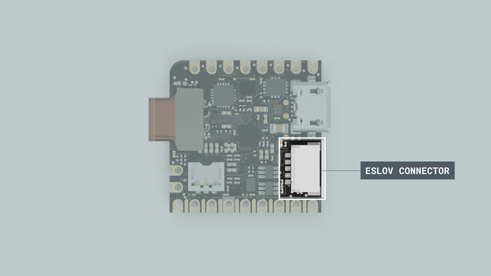

 The ESLOV connector is a small 5-pin connector with a 1.00 mm pitch; the mechanical details of the connector can be found in the connector's datasheet.

The pin layout of the ESLOV connector is the following:

1. VCC_IN (5V input)
2. INT
3. SCL
4. SDA
5. GND


## Arduino Cloud

Leveraging the Nicla Vision's Wi-Fi® connectivity we can develop Smart IoT projects using the [Arduino Cloud](https://cloud.arduino.cc/).

By using the Arduino Cloud, you can, for example, monitor your Nicla's inputs and sensors, control your device's built-in LEDs remotely, and update your device's firmware OTA.

In case it is the first time you are using the Arduino Cloud:

- You need an __account__. If you do not have an account, create one for free [here](https://create.arduino.cc/iot/things).
- To use the Arduino Cloud Editor or Arduino Cloud, the __Arduino Create Agent__ must be running on your computer. You can install the Arduino Create Agent [here](https://create.arduino.cc/getting-started/plugin/welcome?_gl=1*oeovt6*_ga*Mzg1NjE0MjQ0LjE2OTc4NDQxMjk.*_ga_NEXN8H46L5*MTY5OTY0MzEwMS43NC4xLjE2OTk2NTMyMjEuMC4wLjA.).

Let's walk through a step-by-step demonstration of how to use a Nicla Vision with the Arduino Cloud.

Log in to your Arduino Cloud account; you should see the following (without any "Thing" created):


First, provision your Nicla Vision on your Arduino Cloud space. To do this, navigate to __Devices__ and then click on the __ADD__ button:


The Setup Device pop-up window will appear. Navigate into __AUTOMATIC__ and select the __Arduino board__ option:


After a while, your Nicla Vision should be discovered by the Arduino Cloud, as shown below:


Click the __CONFIGURE__ button, give your device a name, and your Nicla Vision will be configured to communicate securely with the Arduino Cloud; this process can take a while.


Once your Nicla Vision has been configured, let's create a __"Thing"__ to test the connection between your board and the Arduino Cloud. Navigate into  __Things__ and select the __CREATE__ button; give your thing a name.


Navigate into __Associate Device__ and click the __Select Device__ button. Select your Nicla Vision and associate it with your "Thing." Then, navigate into __Network__ and click the __Configure__ button; enter your network credentials.

The project is ready to add variables to your "Thing"; navigate into __Cloud Variables__ and click the __ADD VARIABLE__ button.

Add one variable with the following characteristics:

- **Name:** `led`
- **Variable type:** `boolean`
- **Variable permission:** `Read & Write`
- **Variable update policy:** `On change`

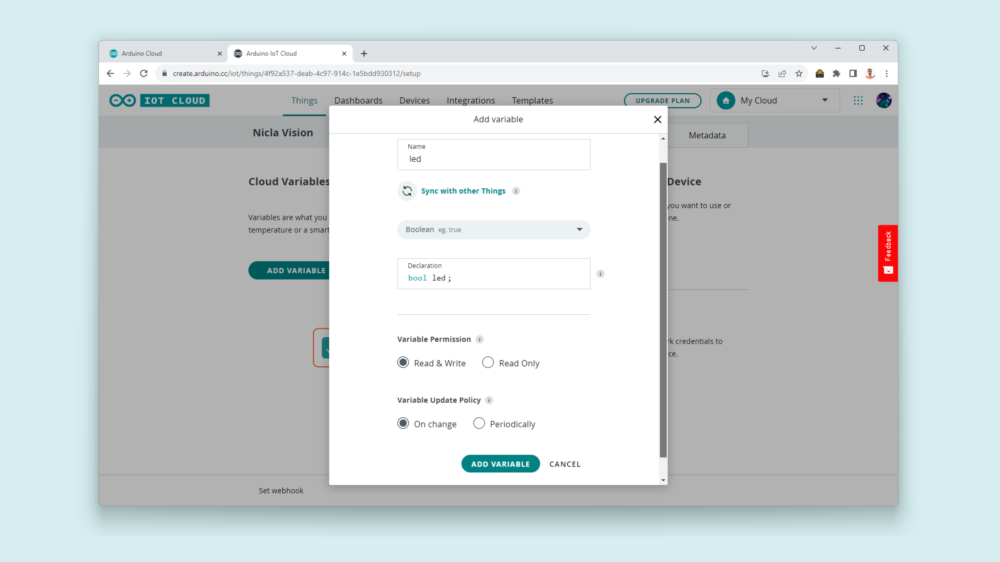

Now, navigate into __Dashboards__ and select the __CREATE__ button; this will create a new dashboard and give your dashboard a name.


Add the following widgets to your dashboard:

- **Switch:** Name the widget Switch and link it to the `led` variable you created before.
- **LED:** Name the widget LED and link it to the `led` variable you created before.
- **Sticky Note:** Give context to your dashboard with a descriptive title (optional).

Your dashboard should look like the following:

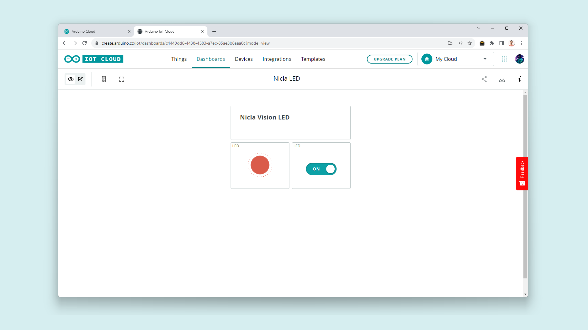

Go back to your __Things__ and open the "Thing" you created. In the "Thing" setup page, navigate into __Sketch__, where you should see the online editor.

In the generated sketch, define `LEDR` pin as an output in the `setup()` function:

```arduino
void setup() {
  // Initialize serial and wait for port to open:
  Serial.begin(9600);
  // This delay gives the chance to wait for a Serial Monitor without blocking if none is found
  delay(1500); 
  
  // Nicla Vision's red LED macro is LEDR
  pinMode(LEDR, OUTPUT);
  // As they turn on with "LOW", initially turn it off.
  digitalWrite(LEDR, HIGH);
  
  // Defined in thingProperties.h
  initProperties();

  // Connect to Arduino Cloud
  ArduinoCloud.begin(ArduinoIoTPreferredConnection);
  
  /*
     The following function allows you to obtain more information
     related to the state of network and IoT Cloud connection and errors
     the higher number the more granular information you’ll get.
     The default is 0 (only errors).
     Maximum is 4
 */
  setDebugMessageLevel(2);
  ArduinoCloud.printDebugInfo();
}
```
In the `onLedChange()` function, which was generated automatically by the Arduino Cloud when the variable `led` was created, you must associate the onboard red LED state with the `led` variable:

```arduino
/*
  Since Led is READ_WRITE variable, onLedChange() is
  executed every time a new value is received from IoT Cloud.
*/
void onLedChange()  {
  digitalWrite(LEDR, !led);
}
```

To upload the code to the Nicla Vision from the online editor, click the green __Verify__ button to compile the sketch and check for errors, then click the green __Upload__ button to program the board with the sketch.

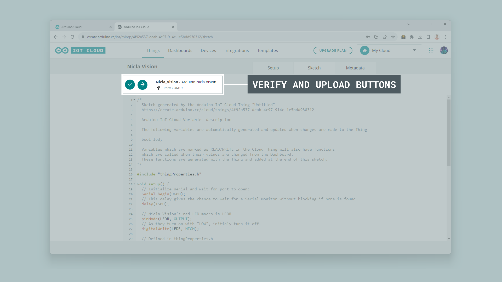

Navigate into __Dashboards__ again, your board should connect to the Wi-Fi® network you defined before (you can follow the connection process with the online editor's integrated Serial Monitor). Your board's red LED (LEDR) should light on or off when the position of the switch changes.


## Support

If you encounter any issues or have questions while working with the Nicla Vision, we provide various support resources to help you find answers and solutions.

### Help Center

Explore our [Help Center](https://support.arduino.cc/hc/en-us), which offers a comprehensive collection of articles and guides for the Nicla Vision. The Arduino Help Center is designed to provide in-depth technical assistance and help you make the most of your device.

- [Nicla Family Help Center page](https://support.arduino.cc/hc/en-us/sections/4410176504978-Nicla-Family)

### Forum

Join our community forum to connect with other Nicla Vision users, share your experiences, and ask questions. The forum is an excellent place to learn from others, discuss issues, and discover new ideas and projects related to the Nicla Vision.

- [Nicla Vision category in the Arduino Forum](https://forum.arduino.cc/c/hardware/nicla-family/nicla-vision/171)

### Contact Us

Please get in touch with our support team if you need personalized assistance or have questions not covered by the help and support resources described before. We're happy to help you with any issues or inquiries about the Nicla Vision.

- [Contact us page](https://www.arduino.cc/en/contact-us/) 
