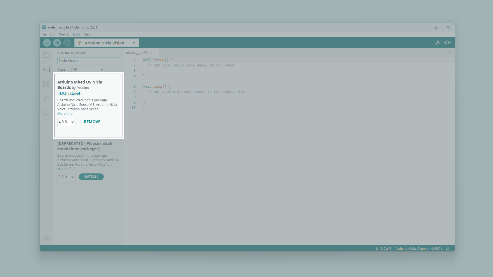
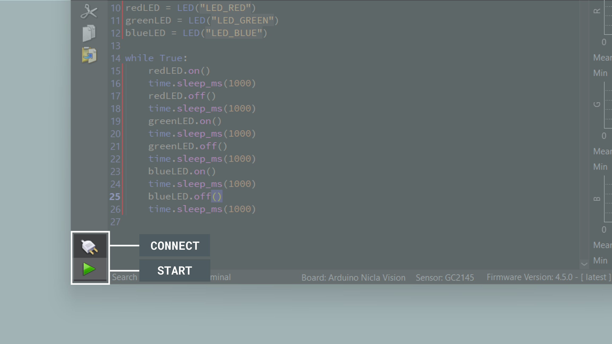
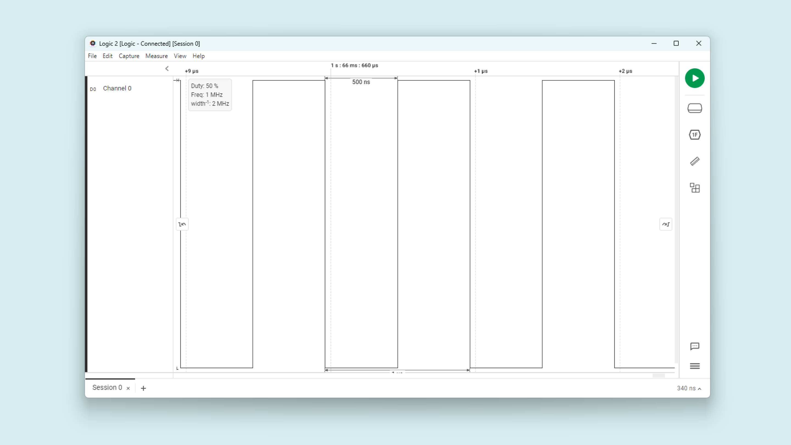
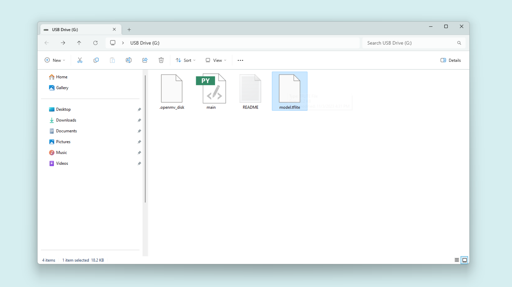

## Overview

This user manual will guide you through a practical journey covering the most interesting features of the Arduino Nicla Vision. With this user manual, you will learn how to set up, configure and use this Arduino board.

## Hardware and Software Requirements
### Hardware Requirements

- [Nicla Vision](https://store.arduino.cc/products/nicla-vision) (x1)
- Micro USB cable (x1)

### Software Requirements

- [OpenMV IDE](https://openmv.io/pages/download)
- [Arduino IDE 1.8.10+](https://www.arduino.cc/en/software), [Arduino IDE 2.0+](https://www.arduino.cc/en/software), or [Arduino Web Editor](https://create.arduino.cc/editor)
- To create custom Machine Learning models, the integrated Machine Learning Tools of the [Arduino Cloud](https://create.arduino.cc/iot/) are needed. In case you do not have an Arduino Cloud account, you will need to create one first.

## Product Overview

The Arduino® Nicla Vision is a ready-to-use, standalone camera for analyzing and processing images on the edge. Thanks to its 2 MP color camera, smart 6-axis motion sensor, integrated microphone and distance sensor, it is suitable for asset tracking, object recognition and predictive maintenance. Quickly implement sensor nodes to send collected data to the Arduino® Cloud (or third-party vendor services) via integrated Wi-Fi®/Bluetooth® LE connectivity.

### Board Architecture Overview

The Nicla Vision features a robust and efficient architecture that integrates a range of sensors packed into a tiny footprint. Nicla Vision combines a powerful STM32H747AII6 Dual ARM® Cortex® M7/M4 IC processor with a 2MP color camera that supports TinyML, as well as a smart 6-axis motion sensor, integrated PDM microphone and a Time of Flight distance sensor.


Here is an overview of the board's architecture's main components shown in the images above:

- **Camera**: the Nicla Vision features a camera based on GC2145 Color rolling shutter image sensor. The GC2145 incorporates a 1616V x 1232H active pixel
array, on-chip 10-bit ADC, and an image signal processor.
The 2MP GC2145 CMOS camera module is equipped with a 80°(DFOV) stock lens, 1.75 μm pixel size and a focal length of 2.2 mm. It supports RGB output format.
- **Microcontroller**: at the heart of the Nicla Vision is the dual-core STM32H747 (U1) including a Cortex® M7 running at 480 MHz and a Cortex® M4 running at 240 MHz. The two cores communicate via a Remote Procedure Call mechanism that allows calling functions on the other processor seamlessly.
- **Onboard advanced motion sensor**: the board features the LSM6DSOX, a smart IMU that includes a 3-axis accelerometer and a 3-axis gyroscope. The LSM6DSOX has a full-scale acceleration range of ±2/±4/±8/±16 g and an angular rate range of ±125/±250/±500/±1000/±2000 dps.
- **Onboard distance sensor**: the VL53L1CBV0FY Time-of-Flight sensor (U4) adds accurate and low-power ranging capabilities to the Arduino® Nicla Vision. The invisible near infrared VCSEL laser (including the analog driver) is encapsulated together with receiving optics in an all-in-one small module located below the camera.
- **Digital Microphone**: the MP34DT05 digital MEMS microphone is omnidirectional and operates via a capacitive sensing element with a high (64 dB) signal-to-noise ratio. The sensing element, capable of detecting acoustic waves, is manufactured using a specialized silicon micromachining process dedicated to producing audio sensors (U6).
- **Wireless connectivity**: the Murata® LBEE5KL1DX-883 wireless module (U9) simultaneously provides Wi-Fi® and Bluetooth® connectivity in an ultra-small package based on the Cypress CYW4343W. The IEEE802.11 b/g/n Wi-Fi® interface can be operated as an access point (AP), station (STA) or dual-mode simultaneous AP/STA. It supports a maximum transfer rate of 65 Mbps. Bluetooth® interface supports Bluetooth® Classic and BLE. An integrated antenna circuitry switch allows a single external antenna (J6) to be shared between Wi-Fi® and Bluetooth®.
- **Power management**: the Nicla Vision is designed for ultra-low power operation, with efficient power management features that ensure minimal energy consumption even when using always-on motion recognition and image processing. The Nicla Vision features the PF1550 from NXP®; a highly integrated battery charge management integrated circuit (IC) designed for wearables and Internet of Things (IoT) devices. 
- **Security Elements**: the Arduino® Nicla Vision enables IC level edge-to-cloud security capability through the NXP SE050C2 Crypto chip (U8). This provides Common Criteria EAL 6+ security certification up to OS level, as well as RSA/ECC cryptographic algorithm support and credential storage.

### Board Core and Libraries

#### With Arduino IDE

The **Arduino Mbed OS Nicla Boards** core contains the libraries and examples you need to work with the board's components, such as its camera and IMU. To install the core for Nicla boards, navigate to **Tools > Board > Boards Manager** or click the Boards Manager icon in the left tab of the IDE. In the Boards Manager tab, search for `Nicla Vision` and install the latest `Arduino Mbed OS Nicla Boards` version.



To update the bootloader firmware of your Nicla Vision,  go to **File > Examples > STM32H747_System > STM32H747_manageBootloader** and upload this sketch to your board.


After the sketch is uploaded, follow the instructions in the Serial Monitor.

  

#### With OpenMV IDE
Before you can start programming OpenMV scripts for the Nicla Vision, you need to download and install the OpenMV IDE.

Open the [OpenMV](https://openmv.io/pages/download) download page in your browser, download the latest version available for your operating system, and follow the instructions of the installer.


Open the OpenMV IDE and connect the Nicla Vision to your computer via the USB cable if you have not done so yet.


Click on the "connect" symbol at the bottom of the left toolbar.


If your Nicla Vision has not the latest firmware, a pop-up will ask you to install it. Your board will enter in DFU mode and its green LED will start fading. 

Select `Install the latest release firmware`. This will install the latest OpenMV firmware on the Nicla Vision. You can leave the option of erasing the internal file system unselected and click `OK`.


Nicla Vision's green LED will start flashing while the OpenMV firmware is being uploaded to the board. A loading bar will start showing you the flashing progress.

Wait until the green LED stops flashing and fading. You will see a message saying `DFU firmware update complete!` when the process is done.


The board will start flashing its blue LED when it is ready to be connected. After confirming the completion dialog, the Nicla Vision should already be connected to the OpenMV IDE, otherwise, click the "connect" button (plug symbol) once again (the blue blinking should stop).


### Pinout


The full pinout is available and downloadable as PDF from the link below:

- [Nicla Vision full pinout](https://docs.arduino.cc/resources/pinouts/ABX00051-full-pinout.pdf)

### Datasheet

The complete datasheet is available and downloadable as PDF from the link below:

- [Nicla Vision datasheet](https://docs.arduino.cc/resources/datasheets/ABX00051-datasheet.pdf)

### Schematics

The complete schematics are available and downloadable as PDF from the link below:

- [Nicla Vision schematics](https://docs.arduino.cc/resources/schematics/ABX00051-schematics.pdf)

### STEP Files

The complete STEP files are available and downloadable from the link below:

- [Nicla Vision STEP files](https://docs.arduino.cc/static/24f56d94c6040c9c3a4a187375cf7601/ABX00051-step.zip)

## First Use
### Powering the Board

The Nicla Vision can be powered by:

- Using a Micro USB cable (not included). 
- Using an external **5V power supply** connected to `VIN` pin (please, refer to the [board pinout section](#pinout) of the user manual).
- Using a **3.7V Lithium Polymer (Li-Po) battery** connected to the board through the onboard battery connector; the manufacturer part number of the battery connector is BM03B-ACHSS and its matching receptacle manufacturer part number is ACHR-03V-S. The **recommended minimum battery capacity for the Nicla Vision is 200 mAh**. A Li-Po battery with an integrated NTC thermistor is also recommended for thermal protection. 
- Using the onboard **ESLOV connector**, which has a dedicated 5V power line.


### Hello World Example

Let's program the Nicla Vision with the classic `hello world` example used in the Arduino ecosystem: the `Blink` sketch. We will use this example to verify the board's connection to the IDE's and that the Nicla Vision core and the board itself are working as expected. 

#### Using OpenMV
Copy and paste the code below into a new sketch in the OpenMV IDE.
```python
import time
from machine import LED

redLED = LED("LED_RED")
greenLED = LED("LED_GREEN")
blueLED = LED("LED_BLUE")

while True:
    redLED.on()
    time.sleep_ms(1000)
    redLED.off()
    time.sleep_ms(1000)
    greenLED.on()
    time.sleep_ms(1000)
    greenLED.off()
    time.sleep_ms(1000)
    blueLED.on()
    time.sleep_ms(1000)
    blueLED.off()
    time.sleep_ms(1000)
```
To run the code on the Nicla Vision, click the **Connect** button and the **Start**.



#### Using Arduino

Copy and paste the code below into a new sketch in the Arduino IDE.

```arduino
void setup() {

  pinMode(LEDR, OUTPUT);
  pinMode(LEDG, OUTPUT);
  pinMode(LEDB, OUTPUT);

}

void loop() {

  digitalWrite(LEDR, LOW);  // Nicla Vision LED's turn on with logic '0'
  delay(1000);                     
  digitalWrite(LEDR, HIGH);   
  delay(1000);   
  digitalWrite(LEDG, LOW);  
  delay(1000);                     
  digitalWrite(LEDG, HIGH);   
  delay(1000);
  digitalWrite(LEDB, LOW);  
  delay(1000);                     
  digitalWrite(LEDB, HIGH);   
  delay(1000);

}
```

To upload the code to the Nicla Vision, click the **Verify** button to compile the sketch and check for errors; then click the **Upload** button to program the board with the sketch.


#### Results
You should see now the LED turning red, green and blue, repeatedly.


## Pins
### Analog Pins

The Nicla Vision has **three analog input pins**, mapped as follows:

| **Microcontroller Pin** | **Arduino Pin Mapping** |
|:-----------------------:|:-----------------------:|
|      ADC1/PC_4         |           A0            |
|      ADC2/PF_13        |           A1            |
|      ADC3/PF_3`        |           A2            |

All of them can be used through the built-in functions of the Arduino programming language. 

***The Nicla vision ADC reference voltage is fixed to 3.3v, this means that it will map the ADC range from 0 to 3.3 volts.***

We are going to use the Nicla Vision analog inputs on both environments, OpenMV and Arduino. For the example codes shown below, we will be reading the analog input `A0` and displaying the read voltage on the Serial Monitor:


#### Using OpenMV

Using Micropython on the OpenMV IDE the Nicla boards ADC resolution is fixed to 12 bits (it's maximum).

This example code can also be found on **File > Examples > Board Control > adc_read_ext_channel.py**:

```python
import time
from pyb import ADC

adc = ADC("A0")   # PC4 microcontroller port

while True:
    # The ADC has 12-bits of resolution for 4096 values.
    print(adc.read())
    print("ADC = %fv" % ((adc.read() * 3.3) / 4095))
    time.sleep_ms(100)
```

#### Using Arduino

Nicla boards ADC can be configured to 8, 10 or 12 bits defining the argument of the following function respectively (default is 10 bits):

```arduino
analogReadResolution(12);  // ADC resolution set to 12 bits (0-4095)
```
Example code:

```arduino
int potPin = A0;   // select the input pin for the potentiometer

void setup() {
  Serial.begin(115200);
  analogReadResolution(12);
}

void loop() {
  // read the value from the sensor:
  Serial.print("ADC = ");
  Serial.print((analogRead(potPin) * 3.3) / 4095);;
  Serial.println(" v");
  delay(100);
}

```
### Digital Pins

The Nicla Vision has **ten digital pins**, mapped as follows:

| **Microcontroller Pin** | **Arduino Pin Mapping**  |
|:-----------------------:|:------------------------:|
|         PG_12         |           D0           |
|         PA_9          |           D1           |
|         PA_10         |           D2           |
|         PG_1          |           D3           |
|         PE_12         |           SCK          |
|         PE_13         |           MISO         |
|         PE_14         |           MOSI         |
|         PE_11         |           SS           |
|         PB_8          |           I2C_SCL      |
|         PB_9          |           I2C_SDA      |


Notice that I2C and SPI pins can also be used as digital pins. Please, refer to the [board pinout section](#pinout) of the user manual to find them on the board.

The digital pins of the Nicla Vision can be used as inputs or outputs through the built-in functions of the Arduino programming language. 

As an application example after learning the __Digital Pins__ basics, we are going to control an LED using a push button. See the wiring below:


#### With OpenMV

The configuration of a digital pin is done in the upper section of the code as shown below:

```python
# Pin configured as an input
pin1 = Pin("D1", Pin.IN, Pin.PULL_NONE)          
# Pin configured as an input, internal pull-up resistor enabled
pin1 = Pin("D1", Pin.IN, Pin.PULL_UP) 
# Pin configured as an output
pin0 = Pin("D0", Pin.OUT_PP, Pin.PULL_NONE)     
```
The pin function can be set as: `Pin.IN`, `Pin.OUT_PP`, `Pin.OUT_OD`, `Pin.AF_PP`, or `Pin.AF_OD`. An explanation of the pin modes can be found [here](https://docs.openmv.io/library/pyb.Pin.html#methods). The third parameter represents the pull mode. It can be set to: `Pin.PULL_NONE`, `Pin.PULL_UP` or `Pin.PULL_DOWN`.

The state of a digital pin, configured as an input, can be read as shown below:

```python
# Reads pin1 state, stores value in "state" variable
state = pin1.value()
```

The state of a digital pin, configured as an output, can be changed as shown below:

```python
# Set pin0 on
pin0.value(True)    
# Set pin0 off
pin0.value(False)    
```
The example code shown below uses digital pin `D0` to control an LED and reads the state of a button connected to digital pin `D1`:

```python
import time
from machine import Pin

# Define button and LED pin
button = Pin("D1", Pin.IN, Pin.PULL_UP)
led = Pin("D0", Pin.OUT_PP, Pin.PULL_NONE)

while True:
    if button.value() == 0:   # if the button is pressed
        led.value(1)
        print("- Button is pressed. LED is on.")
    else:                     # if the button is not pressed
        led.value(0)
        print("- Button is not pressed. LED is off.")
    time.sleep_ms(1000)       # wait for a second

```
#### With Arduino IDE
The configuration of a digital pin is done in the `setup()` function with the built-in function `pinMode()` as shown below:

```arduino
// Pin configured as an input
pinMode(D1, INPUT);             
// Pin configured as an input, internal pull-up resistor enabled
pinMode(D1, INPUT_PULLUP);  
// Pin configured as an output
pinMode(D0, OUTPUT);   
```

The state of a digital pin, configured as an input, can be read using the built-in function `digitalRead()` as shown below:

```arduino
// Reads pin state, stores value in state variable
state = digitalRead(D1);
```

The state of a digital pin, configured as an output, can be changed using the built-in function `digitalWrite()` as shown below:

```arduino
// Set pin on
digitalWrite(D0, HIGH);    
// Set pin off
digitalWrite(D0, LOW);    
```
The example code shown below uses digital pin `D0` to control an LED and reads the state of a button connected to digital pin `D1`:

```arduino
// Define button and LED pin
int buttonPin = D1;
int ledPin = D0;

// Variable to store the button state
int buttonState = 0;

void setup() {
  // Configure button and LED pins
  pinMode(buttonPin, INPUT_PULLUP);
  pinMode(ledPin, OUTPUT);
  // Initialize Serial communication
  Serial.begin(115200);
}

void loop() {
  // Read the state of the button
  buttonState = digitalRead(buttonPin);
  // If the button is pressed, turn on the LED and print its state to the Serial Monitor
  if (buttonState == LOW) {
    digitalWrite(ledPin, HIGH);
    Serial.println("- Button is pressed. LED is on.");
  } else {
    // If the button is not pressed, turn off the LED and print to the Serial Monitor
    digitalWrite(ledPin, LOW);
    Serial.println("- Button is not pressed. LED is off.");
  }
  // Wait for 1000 milliseconds
  delay(1000);
}
```

### PWM Pins

Most digital and analog pins of the Nicla Vision can be used as PWM (Pulse Width Modulation) pins, including I2C and SPI interfaces. 

#### With OpenMV

PWM outputs can be controlled with Micropython on a very flexible manner by using built-in functions as shown below:

First, we need to identify the `Timer` and `Channel` used by the `PWM` output to be used. For this, search for the desired pin on the [STM32H747 datasheet](https://www.st.com/resource/en/datasheet/stm32h747ai.pdf) from page 89.

Here is a table with the details of the exposed pins on the Nicla Vision:

| **Microcontroller Pin** | **Arduino Pin Mapping**  | **Timer**  |**Channel** |
|:-----------------------:|:------------------------:|:----------:|:----------:|
|         PA_9            |           D1             |   TIMER1   |    CH2     |
|         PA_10           |           D2             |   TIMER1   |    CH3     |
|         PB_8            |           I2C_SCL        |   TIMER4   |    CH3     |
|         PB_9            |           I2C_SDA        |   TIMER4   |    CH4     |
|         PE_11           |           SS             |   TIMER1   |    CH2     |
|         PE_12           |           SCK            |   TIMER1   |    CH3     |
|         PE_13           |           MISO           |   TIMER1   |    CH3     |
|         PE_14           |           MOSI           |   TIMER1   |    CH4     |


To use PWM, you import the `time`, `Pin`, `Timer` modules.

```python
import time
from pyb import Pin, Timer
```

First you need to choose the pin you want to use PWM with.

```python
OUT = Pin("D1", Pin.OUT_PP, Pin.PULL_NONE)
```

Create a timer for the PWM, where you set the `timer number` (following the table from above) and the frequency.

```python
timer1 = Timer(1, freq=1000)
```

Then you need to start a `PWM channel` (following the table from above) with the timer object. 

```python
channel1 = timer1.channel(2, Timer.PWM, pin=OUT, pulse_width_percentage=0)
```

Get or set the pulse width value on a channel. To get, pass no arguments. To set, give a value as an argument.

```python
channel1.pulse_width_percentage(Width) # Width (0-100)
```
As a complete example here is an example code to generate a __50% duty cycle__ PWM signal at __1 Mhz__.

```python
import time
from pyb import Pin, Timer

# D1 is connected to TIMER1_CH2

OUT = Pin("D1")

timer1 = Timer(1, freq=1000000)
channel1 = timer1.channel(2, Timer.PWM, pin=OUT, pulse_width_percent=0)

channel1.pulse_width_percent(50)


while True:
    time.sleep_ms(1000)

```



#### With Arduino IDE

This functionality can be used with the built-in function `analogWrite()` as shown below:

```arduino
analogWrite(pin, value);  
```
By default, the output resolution is 8 bits, so the output value should be between 0 and 255. To set a greater resolution, do it using the built-in function `analogWriteResolution` as shown below:

```arduino
analogWriteResolution(bits);  
```

Using `analogWrite` has some limitations, for example, the PWM signal frequency is fixed at 763 Hz, and this could not be ideal for every application.

```arduino
// 12 bits PWM 50% duty cycle example code

void setup() {
  analogWriteResolution(12);    // 12 bits (0-4095)
}

void loop() {
  analogWrite(D1, 2048);    // PWM output on D1
}
```


## Onboard Sensors

The Nicla Vision comes with various onboard sensors that allow you to capture and process motion data via a 6-axis IMU, distance with a Time of Flight (ToF) sensor, record sound with a PDM microphone, and capture images and videos with a camera. 

The onboard sensors can be used for developing various applications, such as voice commanded projects, activity recognition, vibration detection and image classification. The onboard sensors are suitable for Machine Learning applications using our [Arduino Cloud ML Tools](https://cloud.arduino.cc/machine-learning-tools/).

### IMU

The Nicla Vision features an advanced IMU, which allows the board to sense motion. The IMU on the board is the LSM6DSOXTR from ST®. It consists of a 3-axis accelerometer and a 3-axis gyroscope. They can provide information about the board's motion, orientation, and rotation in a 3D space.


#### With OpenMV

In this Micropython environment, you can choose between a basic usage of the IMU by sampling raw motion data using the example code below.

```python
import time
from lsm6dsox import LSM6DSOX
from machine import Pin
from machine import SPI

lsm = LSM6DSOX(SPI(5), cs=Pin("PF6", Pin.OUT_PP, Pin.PULL_UP))

while True:
    print("Accelerometer: x:{:>8.3f} y:{:>8.3f} z:{:>8.3f}".format(*lsm.accel()))
    print("Gyroscope:     x:{:>8.3f} y:{:>8.3f} z:{:>8.3f}".format(*lsm.gyro()))
    print("")
    time.sleep_ms(100)
```


Also, you can develop Machine Learning applications using the Nicla Vision IMU. As a practical example, we are going to test a `Vibration monitoring` model that will be able to identify three states: `no vibration`, `low vibration` and `high vibration`.

First, download the pre-trained model file from the [example repository](https://github.com/STMicroelectronics/STMems_Machine_Learning_Core/tree/master/application_examples/lsm6dsox/Vibration%20monitoring) and copy it to the Nicla Vision storage drive.


Reset the board and run the following code on the OpenMV IDE.

```python
from machine import Pin
from machine import SPI
from lsm6dsox import LSM6DSOX

INT_MODE = True  # Run in interrupt mode.
INT_FLAG = False  # Set True on interrupt.


def imu_int_handler(pin):
    global INT_FLAG
    INT_FLAG = True


if INT_MODE is True:
    int_pin = Pin("PA1", mode=Pin.IN, pull=Pin.PULL_UP)
    int_pin.irq(handler=imu_int_handler, trigger=Pin.IRQ_RISING)

# Vibration detection example
UCF_FILE = "lsm6dsox_vibration_monitoring.ucf"
UCF_LABELS = {0: "no vibration", 1: "low vibration", 2: "high vibration"}
# NOTE: Selected data rate and scale must match the MLC data rate and scale.
lsm = LSM6DSOX(
    SPI(5),
    cs=Pin("PF6", Pin.OUT_PP, Pin.PULL_UP),
    gyro_odr=26,
    accel_odr=26,
    gyro_scale=2000,
    accel_scale=4,
    ucf=UCF_FILE,
)

print("MLC configured...")

while True:
    if INT_MODE:
        if INT_FLAG:
            INT_FLAG = False
            print(UCF_LABELS[lsm.mlc_output()[0]])
    else:
        buf = lsm.mlc_output()
        if buf is not None:
            print(UCF_LABELS[buf[0]])

```

In the OpenMV IDE Serial Monitor, the inference results will be printed after a vibration event.


***You can download and test many other pre-trained models found in this [repository](https://github.com/STMicroelectronics/STMems_Machine_Learning_Core/tree/master/application_examples/lsm6dsox).***

#### With Arduino IDE

First, to use this sensor with the Arduino IDE, you need to install the `Arduino_LSM6DSOX` library, which can be found in the Arduino IDE library manager. To do so in the IDE, select it from the left side menu, search for `LSM6DSOX` and install the one from Arduino.


The example code below shows how to get acceleration and angular velocity data from the onboard IMU and stream it to the Serial Monitor and Serial Plotter.

```arduino
#include <Arduino_LSM6DSOX.h>

void setup() {
  Serial.begin(9600);
  while (!Serial)
    ;

  if (!IMU.begin()) {
    Serial.println("Failed to initialize IMU!");

    while (1)
      ;
  }

  Serial.print("Accelerometer sample rate = ");
  Serial.print(IMU.accelerationSampleRate());
  Serial.println(" Hz");
  Serial.println();
  Serial.println("Acceleration in g's");
  Serial.println("X\tY\tZ");

  Serial.print("Gyroscope sample rate = ");
  Serial.print(IMU.gyroscopeSampleRate());
  Serial.println(" Hz");
  Serial.println();
  Serial.println("Gyroscope in degrees/second");
  Serial.println("X\tY\tZ");

  delay(3000);  // Wait 3 seconds
}

void loop() {
  float a_x, a_y, a_z;

  if (IMU.accelerationAvailable()) {
    IMU.readAcceleration(a_x, a_y, a_z);

    Serial.print("acc_X:");
    Serial.print(a_x);
    Serial.print(",");
    Serial.print("acc_Y:");
    Serial.print(a_y);
    Serial.print(",");
    Serial.print("acc_Z:");
    Serial.println(a_z);
  }
  float g_x, g_y, g_z;

  if (IMU.gyroscopeAvailable()) {
    IMU.readGyroscope(g_x, g_y, g_z);

    Serial.print("gyro_X:");
    Serial.print(g_x);
    Serial.print(",");
    Serial.print("gyro_Y:");
    Serial.print(g_y);
    Serial.print(",");
    Serial.print("gyro_Z:");
    Serial.println(g_z);
  }
}
```


***To test a Machine Learning model on the Arduino IDE, navigate to **File > Examples > MLC > NiclaVision_MLC_Motion_Intesity** and it will identify three scenarios: `Stationary`, `Medium Intensity` and `High Intensity` movements.***

### Microphone

The onboard high-performance microphone of the Nicla Vision is the MP34DT06JTR from ST®. It is specifically designed for applications that require high-quality audio recording and accurate voice detection, such as voice-controlled Internet of Things (IoT) devices, smart home systems, and mobile devices.


#### Using OpenMV

The OpenMV IDE includes some examples to get started using the Nicla Vision onboard microphone that can be found on **File > Examples > Audio**. We are going to use the one called `micro_speech.py` to test the machine-learning speech recognition capabilities of the board.

First, download the pre-trained model file from the [example repository](https://raw.githubusercontent.com/iabdalkader/microspeech-yesno-model/main/model.tflite) and copy it to the Nicla Vision storage drive.



Reset the board and run the following code on the OpenMV IDE.

```python
import audio
import time
import tf
import micro_speech
import pyb

labels = ["Silence", "Unknown", "Yes", "No"]

led_red = pyb.LED(1)
led_green = pyb.LED(2)

model = tf.load("/model.tflite")
speech = micro_speech.MicroSpeech()
audio.init(channels=1, frequency=16000, gain=24, highpass=0.9883)

# Start audio streaming
audio.start_streaming(speech.audio_callback)

while True:
    # Run micro-speech without a timeout and filter detections by label index.
    idx = speech.listen(model, timeout=0, threshold=0.70, filter=[2, 3])
    led = led_green if idx == 2 else led_red
    print(labels[idx])
    for i in range(0, 4):
        led.on()
        time.sleep_ms(25)
        led.off()
        time.sleep_ms(25)

# Stop streaming
audio.stop_streaming()
```
After running the code, the matches will be printed on the Serial Monitor if the board hears a `No` or a `Yes`, turning on the red and green LED respectively.


#### Using Arduino IDE

The Arduino IDE includes a simple example to visualize raw data from the PDM microphone. To test it navigate to **File > Examples > PDM > PDMSerialPlotter**. 

```arduino
#include <PDM.h>

// default number of output channels
static const char channels = 1;

// default PCM output frequency
static const int frequency = 16000;

// Buffer to read samples into, each sample is 16-bits
short sampleBuffer[512];

// Number of audio samples read
volatile int samplesRead;

void setup() {
  Serial.begin(9600);
  while (!Serial);

  // Configure the data receive callback
  PDM.onReceive(onPDMdata);

  // Optionally set the gain
  // Defaults to 20 on the BLE Sense and 24 on the Portenta Vision Shield
  // PDM.setGain(30);

  // Initialize PDM with:
  // - one channel (mono mode)
  // - a 16 kHz sample rate for the Arduino Nano 33 BLE Sense
  // - a 32 kHz or 64 kHz sample rate for the Arduino Portenta Vision Shield
  if (!PDM.begin(channels, frequency)) {
    Serial.println("Failed to start PDM!");
    while (1);
  }
}

void loop() {
  // Wait for samples to be read
  if (samplesRead) {

    // Print samples to the serial monitor or plotter
    for (int i = 0; i < samplesRead; i++) {
      if(channels == 2) {
        Serial.print("L:");
        Serial.print(sampleBuffer[i]);
        Serial.print(" R:");
        i++;
      }
      Serial.println(sampleBuffer[i]);
    }

    // Clear the read count
    samplesRead = 0;
  }
}

/**
 * Callback function to process the data from the PDM microphone.
 * NOTE: This callback is executed as part of an ISR.
 * Therefore using `Serial` to print messages inside this function isn't supported.
 * */
void onPDMdata() {
  // Query the number of available bytes
  int bytesAvailable = PDM.available();

  // Read into the sample buffer
  PDM.read(sampleBuffer, bytesAvailable);

  // 16-bit, 2 bytes per sample
  samplesRead = bytesAvailable / 2;
}
```

Upload the example code to the Nicla Vision and open the Serial Plotter to see the sound wave output.


### Time of Flight (Distance) Sensor

The onboard ToF sensor of the Nicla Vision is the VL53L1CBV0FY from ST®. It adds accurate and low power ranging capabilities to the Arduino® Nicla Vision. The invisible near infrared VCSEL laser (including the analog driver) is encapsulated together with receiving optics in an all-in-one small module located below the camera.


Here are listed the sensor's main features:
- Up to 400 cm distance measurement
- Up to 50 Hz ranging frequency
- 27° field-of-view (FoV) 

#### With OpenMV

The OpenMV IDE includes an example to start using the ToF sensor. To test it navigate to **File > Examples > Sensors > vl53l1x_tof** and run it on the Nicla Vision. 

```python
from machine import I2C
from vl53l1x import VL53L1X
import time

tof = VL53L1X(I2C(2))

while True:
    print(f"Distance: {tof.read()}mm")
    time.sleep_ms(50)
```


#### With Arduino IDE

To use the ToF sensor with the Arduino IDE, install the `VL53L1X` library authored by Pololu by searching for it on the IDE library manager and clicking on install.

Once installed, you will be able to compile and upload the example code below to your Nicla Vision.

The distance measured by the sensor will be printed on the IDE serial monitor and the built-in LED will blink proportionally to that distance.

```arduino 
#include "VL53L1X.h"
VL53L1X proximity;

bool blinkState = false;
int reading = 0;
int timeStart = 0;
int blinkTime = 2000;

void setup() {
  Serial.begin(115200);
  Wire1.begin();
  Wire1.setClock(400000); // use 400 kHz I2C
  proximity.setBus(&Wire1);


  pinMode(LEDB, OUTPUT);
  digitalWrite(LEDB, blinkState);

  if (!proximity.init()) {
    Serial.println("Failed to detect and initialize sensor!");
    while (1);
  }

  proximity.setDistanceMode(VL53L1X::Long);
  proximity.setMeasurementTimingBudget(50000);
  proximity.startContinuous(50);
}

void loop() {
  reading = proximity.read();
  Serial.print(reading);
  Serial.println(" mm");

  if (millis() - timeStart >= reading) {
    digitalWrite(LEDB, blinkState);
    timeStart = millis();

    blinkState = !blinkState;
  }
}
```


### Camera

The Nicla Vision main feature is its onboard 2MP camera, which is based on the GC2145 color rolling shutter image sensor. It is perfect for machine learning applications such as object detection, image classification, machine/computer vision, robotics, IoT and more.


The Nicla Vision is primarily intended to be used with the OpenMV micropython ecosystem. So, it's recommended to use this IDE for machine vision applications.

#### With OpenMV

The OpenMV IDE is an environment designed to work specifically with machine/computer vision hardware, it is optimized for easy and fast development of image processing applications with a micropython framework and streaming monitors, color data graphics and more.

The Nicla Vision uses a 2MP camera sensor which means that its maximum resolution should be 1920x1080 pixels. However, the effective resolution is 1616(H) × 1232(V).

Here we have the minimum code necessary to make the camera work streaming live video on the OpenMV IDE:

```python
import sensor
import time

sensor.reset()  # Reset and initialize the sensor.
sensor.set_pixformat(sensor.RGB565)  # Set pixel format to RGB565 (or GRAYSCALE)
sensor.set_framesize(sensor.QVGA)  # Set frame size to QVGA (320x240)
sensor.skip_frames(time=2000)  # Wait for settings take effect.
clock = time.clock()  # Create a clock object to track the FPS.

while True:
    clock.tick()  # Update the FPS clock.
    img = sensor.snapshot()  # Take a picture and return the image.
    print(clock.fps())  # Note: OpenMV Cam runs about half as fast when connected
    # to the IDE. The FPS should increase once disconnected.
```


From the above example script, we can highlight the main functions:

- `sensor.set_pixformat(<Sensor>)` lets you set the pixel format for the camera sensor. The Nicla Vision is compatible with these: `sensor.GRAYSCALE`, `sensor.RGB565`, `sensor.BAYER` and `sensor.YUV422`. To define the pixel format to any of the supported ones, just add it to the `set_pixformat` function argument.

- `sensor.set_framesize(<Resolution>)` lets you define the image frame size in terms of pixels. [Here](https://docs.openmv.io/library/omv.sensor.html#sensor.set_framesize) you can find all the different options.

- `sensor.snapshot()` lets you take a picture and return the image so you can save it, stream it or process it.

The example code below lets you take a picture and save it on the Nicla Vision local storage as `example.jpg`.

```python
import sensor
import time
import machine

sensor.reset()  # Reset and initialize the sensor.
sensor.set_pixformat(sensor.RGB565)  # Set pixel format to RGB565 (or GRAYSCALE)
sensor.set_framesize(sensor.QVGA)  # Set frame size to QVGA (320x240)
sensor.skip_frames(time=2000)  # Wait for settings take effect.

led = machine.LED("LED_BLUE")

start = time.ticks_ms()
while time.ticks_diff(time.ticks_ms(), start) < 3000:
    sensor.snapshot()
    led.toggle()

led.off()

img = sensor.snapshot()
img.save("example.jpg")  # or "example.bmp" (or others)

raise (Exception("Please reset the camera to see the new file."))
```
After the snapshot is taken, reset the board by pressing the reset button and the image will be on the board storage drive.


The example code below lets you records a video and save it on the Nicla Vision local storage as `example.mjpeg`.

```python
import sensor
import time
import mjpeg
import machine

sensor.reset()  # Reset and initialize the sensor.
sensor.set_pixformat(sensor.RGB565)  # Set pixel format to RGB565 (or GRAYSCALE)
sensor.set_framesize(sensor.QVGA)  # Set frame size to QVGA (320x240)
sensor.skip_frames(time=2000)  # Wait for settings take effect.

led = machine.LED("LED_RED")

led.on()
m = mjpeg.Mjpeg("example.mjpeg")

clock = time.clock()  # Create a clock object to track the FPS.
for i in range(200):
    clock.tick()
    m.add_frame(sensor.snapshot())
    print(clock.fps())

m.close(clock.fps())
led.off()

raise (Exception("Please reset the camera to see the new file."))
```
After the video is recorded, reset the board by pressing the reset button and the file will be on the board storage drive.


***We recommend using VLC to play the video because of the format.***

The next example lets you live stream what the camera sees through HTTP so you can watch it on your favorite browser from any device connected to the same network as the Nicla Vision.

Make sure to fill in the `SSID` and `KEY` variables with your WiFi credentials.

```python
import sensor
import time
import network
import socket

SSID = "*********"  # Network SSID
KEY = "************"  # Network key
HOST = ""  # Use first available interface
PORT = 8080  # Arbitrary non-privileged port

# Init sensor
sensor.reset()
sensor.set_framesize(sensor.QVGA)
sensor.set_pixformat(sensor.RGB565)

# Init wlan module and connect to network
wlan = network.WLAN(network.STA_IF)
wlan.active(True)
wlan.connect(SSID, KEY)

while not wlan.isconnected():
    print('Trying to connect to "{:s}"...'.format(SSID))
    time.sleep_ms(1000)

# We should have a valid IP now via DHCP
print("WiFi Connected ", wlan.ifconfig())

# Create server socket
s = socket.socket(socket.AF_INET, socket.SOCK_STREAM)
s.setsockopt(socket.SOL_SOCKET, socket.SO_REUSEADDR, True)

# Bind and listen
s.bind([HOST, PORT])
s.listen(5)

# Set server socket to blocking
s.setblocking(True)


def start_streaming(s):
    print("Waiting for connections..")
    client, addr = s.accept()
    # set client socket timeout to 5s
    client.settimeout(5.0)
    print("Connected to " + addr[0] + ":" + str(addr[1]))

    # Read request from client
    data = client.recv(1024)
    # Should parse client request here

    # Send multipart header
    client.sendall(
        "HTTP/1.1 200 OK\r\n"
        "Server: OpenMV\r\n"
        "Content-Type: multipart/x-mixed-replace;boundary=openmv\r\n"
        "Cache-Control: no-cache\r\n"
        "Pragma: no-cache\r\n\r\n"
    )

    # FPS clock
    clock = time.clock()

    # Start streaming images
    # NOTE: Disable IDE preview to increase streaming FPS.
    while True:
        clock.tick()  # Track elapsed milliseconds between snapshots().
        frame = sensor.snapshot()
        cframe = frame.compressed(quality=35)
        header = (
            "\r\n--openmv\r\n"
            "Content-Type: image/jpeg\r\n"
            "Content-Length:" + str(cframe.size()) + "\r\n\r\n"
        )
        client.sendall(header)
        client.sendall(cframe)
        print(clock.fps())


while True:
    try:
        start_streaming(s)
    except OSError as e:
        print("socket error: ", e)
        # sys.print_exception(e)

```

Once you run this script, on the OpenMV serial monitor will be printed the Nicla Vision IP address after the WiFi connection process. 

To watch the live stream enter the device IP address followed by the `:8080` port as follows:

`<Nicla Vision IP>:8080`


#### With Arduino IDE


