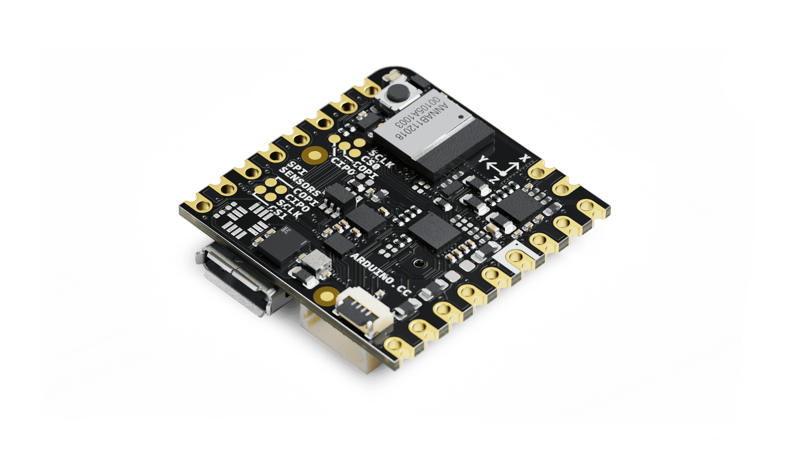

# Description
The **Arduino® Nicla Voice** packs machine-learning capabilities on the edge into a tiny fingerprint.

Implement always-on speech recognition with the Nicla Voice. The board integrates a dedicated Neural Decision Processor **Syntiant® NDP 120** able to run multiple AI algorithms at the same time. Leverage the built-in microphone, nRF52832 microcontroller, Bluetooth® Low Energy module, 6-axis IMU and 3-axis magnetometer to create your own wireless sensor network for machine learning applications with low power consumption capabilities.

# Target areas:
noise and vibration detection, low-power speech recognition, contactless operations, gesture recognition

# Features

- **ANNA-B112** Bluetooth®  Module with integrated microprocessor
  - **nRF52832** System-on-chip
    - 64 MHz ARM® Cortex-M4F microcontroller 
    - 64 KB SRAM
    - 512 KB Flash
    - RAM mapped FIFOs using EasyDMA
    - 2x SPI (one is accessible via pin header)
    - 2x I2C (one is accessible via pin header)
    - 12-bit/200 ksps ADC
    - 2.400 - 2.4835 GHz Bluetooth®  (5.0 via cordio stack, 4.2 via ArduinoBLE)
  - Internal antenna
  - Internal 32 MHz oscillator
  - 1.8 V Operating Voltage
- **Syntiant® NDP120** Neural Decision Processor™ (Microprocessor)
  - 1x Syntiant® Core 2™ ultra-low power deep neural network inference engine
  - 1x HiFi 3 Audio DSP
  - 1x Arm® Cortex® M0 core up to 48 MHz
  - Dedicated Low IQ High PSRR Low-Dropout regulator (TPS7A05)
    - 1μA of typical very-low quiescent current consumption (3μA maximum)
  - Dedicated 48KB SRAM
- **Sensors**
  - IMU 6-axis (BMI270)
    - 16 bit 3-axis accelerometer ± 2/4/8/16 g range
      - Output data rates (ODR): 0.78Hz-1.6 kHz
    - 16 bit 3-axis gyroscope ±125/250/500/1000/2000 dps range
      - Output data rates (ODR): 25Hz-6.4 kHz
    - Fast offset error compensation for accelerometer and gyroscope
    - Rapid startup time:
      - 2ms for Gyroscope with fast start mode
      - 2ms for Accelerometer
    - <1μs of HW synchronization
    - Wide voltage supply range
    - Low Power
      - Current consumption: typ. 685 μA (full ODR and aliasing-free operation)
      - Built-in PMU
  - Magnetometer 3-axis (BMM150)
    - Low voltage operation
    - Ultra-low power, current consumption 170μA @ 10 Hz in low power preset
    - Interrupt signal generation for magnetic Low-/High-Threshold detection
    - Magnetic field range typical of ±1300μT (x, y-axis), ±2500μT (z-axis)
    - Magnetic field resolution of ~0.3μT
    - Maximum magnetic field rating at any direction >7T
  - High-Performance Microphone (IM69D130)
    - Frequency range 20 Hz ~ 20 kHz
    - MEMS (silicon) type
    - Dynamic range of 105dB
    - <1% total harmonic distortions up to 128 dBSPL
    - Sensitivity (± 1dB) and phase (± 2° @1kHz) matched
    - Flat frequency response with low-frequency roll-off at 28Hz
    - Power optimized modes determined by PDM clock frequency
    - PDM output
    - Omnidirectional pickup pattern
- **I/O**
  - Castellated pads (J1, J2, J3)
    - 1x I2C bus, also available on the ESLOV connector
    - 1x Serial Port (UART)
    - 1x SPI
    - 2x ADC
    - GPIOs configurable voltage 1.8 V/3.3 V
    - 1x Battery Input
      - Integrated battery charger and fuel gauge (BQ25120AYFPR) for 3.7V Li-Po battery
    - Power Input and Output (3.3 V, GND and VIN)
  - External PDM microphone connector (Via 4-pin 0.5 mm pitch FFC cable compatible with FH33J-4S ZIF connector)

# Contents

## The Board

### Application Examples
The Arduino® Nicla Voice is your cutting edge development and deployment solution taking advantage of Syntiant® NDP120, a neural decision processor that will let you run multiple AI algorithms. Deploy predictive maintenance, gesture and speech recognition, and contactless applications in a miniaturized form factor. A 6-axis motion sensor, a magnetometer, and always-on speech recognition on the edge are at your disposal for unrestricted research and development. On-board Bluetooth® Low Energy connectivity grants interoperability with compatible Nicla, Portenta, and MKR devices for scalability. Ultra-low power consumption enables long lasting device life-time and wide range of deployment possibilities.

- **Automated Intruder Detection System**:
Nicla Voice’s edge capabilities enable faster identification of critical and time-sensitive events, including glass-breaking or motion sensing. Multiple voices, sound and sensor applications can run simultaneously with low power consumption, all in a tiny battery-powered size, allowing long periods of usage without intervention.

- **Predictive Maintenance**:
Nicla Voice can be used to predict the wear of industrial equipment, machinery and automation devices. It can detect vibrations, noises coming from motors or coils and gather the information needed for the Neural Decision Network to align maintenance with the operational characteristics.

- **Add low-power speech recognition**:
With the built-in microphone and its tiny form factor, you can easily equip an existing setup with the Nicla Voice to improve the workflow by adding speech recognition like voice commands. Moreover, an always-on speech recognition application can be developed thanks to the ultra low-power Syntiant® NDP120 Neural Decision Processor™.

### Accessories (Not Included)
- Single-cell Li-ion/Li-Po battery

### Related Products
- ESLOV connector
- Arduino® Portenta H7 (SKU: ABX00042)
- Arduino® Portenta H7 Lite (SKU: ABX00045)
- Arduino® Portenta H7 Lite Connected (SKU: ABX00046)
- Arduino® Nicla Sense ME (SKU: ABX00050)

### Assembly Overview

**Note**: The NTC pin on the battery connector is optional. This is a feature that allows safer use and thermal shutoff of the PMIC.

## Ratings
| Symbol               | Description                      | Min                                 | Typ | Max                                 | Unit |
| -------------------- | -------------------------------- | ----------------------------------- | --- | ----------------------------------- | ---- |
| VIN       | Input voltage from VIN pad       | 3.5                                 | 5.0 | 5.5                                 | V    |
| VUSB      | Input voltage from USB connector | 4.8                                 | 5.0 | 5.5                                 | V    |
| VDDIO_EXT | Level Translator Voltage         | 1.8                                 | 3.3 | 3.3                                 | V    |
| VIH       | Input high-level voltage         | 0.7VDDIO_EXT1 |     | VDDIO_EXT                | V    |
| VIL       | Input low-level voltage          | 0                                   |     | 0.3VDDIO_EXT2 | V    |
| TOP       | Operating Temperature            | 0                                   | 25  | 70                                  | °C   |

**Note** : VDDIO_EXT is software programmable. While the ADC inputs can accept up to 3.3 V, the maximum value is at the ANNA-B112 operating voltage.

All I/O pins operate at VDDIO_EXT apart from the following:
- ADC1 and ADC2 - 1.8 V
- JTAG_SAMD11 - 3.3 V
- JTAG_ANNA - 1.8 V
- JTAG_BMI - 1.8 V
- VDDOTP - 1.8 V

**2** : If the internal VDDIO_EXT is disabled by software, it is possible to supply it externally.

## Power Consumption
| Description                                                   | Min | Typ  | Max | Unit |
| ------------------------------------------------------------- | --- | ---- | --- | ---- |
| Standby                                                       | -   | 0.46 | -   | mA   |
| Alexa demo ON with BLE off                                    | -   | 0.80 | -   | mA   |
| Alexa demo ON with BLE advertising and sensor polling at 1 Hz | -   | 2.4  | -   | mA   |

The measurements have been performed with VBAT = 3.7 V. Alexa demo corresponds to the factory firmware flashed by default on the Nicla Voice.

## Functional Overview

### Block Diagram

### Board Topology

#### Connectors Topology

| **Ref.** | **Description**              | **Ref.** | **Description**                 |
| -------- | ---------------------------- | -------- | ------------------------------- |
| J1       | Nicla Header A               | J2       | Nicla Header B                  |
| J3       | Battery Pads                 | J4       | Battery Connector (BM03B-ACHSS) |
| J5       | ESLOV Connector (SM05B-SRSS) | J6       | External Microphone (FH33J-4S)  |
| J7       | Micro USB-AB (ZX62-AB)       |

#### Components Topology

| **Ref.** | **Description**                  | **Ref.** | **Description**                            |
| -------- | -------------------------------- | -------- | ------------------------------------------ |
| DL1      | RGB LED                          | MD1      | u-blox ANNA-B112                           |
| PB1      | Push Button                      | D1       | Schottky Diode, PMEG4005EPK                |
| D2       | Resistor array PRTR5V0U0F        | U1       | Arm® Cortex M0 ATSAM-D11                   |
| U2       | Microphone IM69D130V01           | U3       | Syntiant® Neural Decision Processor NDP120 |
| U4       | Magnetic Sensor BMM150           | U5       | LDO TPS7A0511PDQNR                         |
| U7       | Flash, 128MX1. AT25QL128A        | U8       | RGB LED Driver IS31FL3194                  |
| U9       | Battery Charger LDO Buck BQ25120 | U10      | Bus Transceiver 74LVC1T45DW                |
| U11      | Level Shifter TXB0108Y           | U12      | Level Shifter NTS0304                      |
| U13      | Level Shifter NTS0304            | U14      | LDO regulator, 3.3 V AP2112K               |
| U15      | IMU 6 Axis Low Power BMI270      |

#### Front

### Microcontroller
The Arduino® Nicla Voice is powered by a nRF52832 SoC within the ANNA-B112 module (MD1). The nRF52832 SoC is built around an ARM® Cortex-M4 microcontroller with floating point unit running at 64 MHz. Sketches are stored inside the nRF52832 internal 512 KB FLASH which is shared with the bootloader. 64 KB SRAM is available to the user. The ANNA-B112 acts as the SPI host for the data logging 16MB flash (U7). While the module itself runs at 1.8 V, a level shifter can adjust the logic level between 1.8 V and 3.3 V depending on the LDO set in BQ25120 (U9). An external oscillator (Y1) provides a 32 KHz signal. The ANNA-B112 acts as the SPI host for the data logging 16MB flash (U7) and the Syntiant® NDP120 IC (U3).

### Neural Decision Processor
The Arduino® Nicla Voice integrates a Neural Decision Processor™ NDP120 from Syntiant® (U3). The NDP120 leverages Syntiant Core 2™ ultra-low-power deep neural network inference engine to move larger neural networks into always-on domains with the capacity to run multiple applications simultaneously with minimal power consumption, including keyword spotting and event detection. The Syntiant® NDP120 IC (U3) also acts as the SPI host for the BMM150 3-axis magnetometer (U4) and the BMI270 6-axis IMU (U15).

### IMU
The Nicla Voice provides 9-axis IMU capabilities, by the combination of the 3-axis BMM150 (U4) and 6-axis BMI270 (U15) ICs. The BMI270 includes both a three-axis gyroscope as well as a three-axis accelerometer, while the BMM150 is capable of sensing magnetic field variations in all three dimensions. The information obtained can be used for measuring raw movement parameters as well as for machine learning. Both are connected via an SPI connection to the Syntiant® NDP120 IC (U3).

### RGB LED
An I2C LED driver (U8) drives the common anode RGB LED (DL1) and is capable of a maximum output of 40 mA. It is driven by the ANNA-B112 (U5) microcontroller.

### Microphone
The IM69D130V01XTSA1 microphone IC (U2) includes two near identical MEMS microphones with a common membrane. The audio signal is transported over a PDM channel to the NDP120 (U3). An external microphone can be added using the J6 connector, which is also connected to the NDP120 (U3) over a separate PDM channel. Internal microphone (U2) and optional external microphone (J6) are on PDM 0 and PDM 1 channels respectively. 

### USB Bridge
The SAMD11 microcontroller (U1) is dedicated to act as both the USB bridge as well as the JTAG controller for the ANNA-B112. A logic level translator (U13) acts as an in between to translate 3.3 V logic to 1.8 V for the ANNA-B112. The 3.3 V voltage is generated from the USB voltage by a LDO (U14).

 

### Power Tree

The **Arduino® Nicla Voice** can be powered via micro USB (J7), ESLOV (J5) or VIN pin. The input power is converted into the relevant voltages via the BQ2512BAYFPR IC (U9). A Schottky diode provides reverse polarity protection to the USB and ESLOV voltages. When voltage is supplied via the micro USB, a linear 3.3 V regulator also provides power to the SAMD11 microcontroller used for programming the board as well as for JTAG and SWD. The LED driver (U8) and RGB Leds (DL1) are driven by a boost voltage of 5V. All other components operate off the 1.8 V rail regulated by a buck converter. PMID acts as an OR switch between VIN and BATT and operates the LED driver. All I/O broken out to the pins are fed through a bi-direction voltage translator running at VDDIO_EXT.

Additionally, the BQ25120AYFPR (U9) also provides support for a single cell 3.7 V LiPo/Li-ion battery pack connected to J4, allowing the use of the board as a wireless sensor network.

## Board Operation
### Getting Started - IDE
If you want to program your Arduino® Nicla Voice while offline you need to install the Arduino® Desktop IDE **[1]**. To connect the Arduino® Nicla Voice to your computer, you’ll need a micro USB cable.

### Getting Started - Arduino Web Editor
All Arduino® boards, including this one, work out-of-the-box on the Arduino® Web Editor **[2]**, by just installing a simple plugin. 

The Arduino® Web Editor is hosted online, therefore it will always be up-to-date with the latest features and support for all boards. Follow **[3]** to start coding on the browser and upload your sketches onto your board.

### Getting Started - Arduino Cloud
All Arduino® IoT enabled products are supported on Arduino® Cloud which allows you to log, graph and analyze sensor data, trigger events, and automate your home or business.

### Getting Started - ESLOV

The Nicla Voice board features an onboard ESLOV connector meant as an **extension** of the I2C communication bus; the board itself can act as a secondary ESLOV controller or peripheral. The ESLOV connector simplifies connecting various sensors, actuators, and other modules to the Nicla Voice without soldering or wiring.

 The ESLOV connector is a small 5-pin connector with a 1.00 mm pitch; the mechanical details of the connector can be found in the connector's datasheet.

The pin layout of the Nicla Voice ESLOV connector is the following:

1. VCC_IN (5V input)
2. INT
3. SCL
4. SDA
5. GND

The manufacturer part number of the ESLOV connector is SM05B-SRSS and its matching receptacle manufacturer part number is SHR-05V-S-B. 

**Note**: Pin 1 of the ESLOV connector of the Nicla Voice board is a **5V voltage input**, not a voltage output. This means that the Nicla Voice is intended to be used as a secondary or a peripheral board of a main board or controller with an ESLOV connector with a 5V output like, for example, the Portenta H7.

### Sample Sketches
Sample sketches for the Arduino® Nicla Voice can be found either in the “Examples” menu in the Arduino® IDE or in the “Documentation” section of the Arduino® Pro website **[4]**.

### Online Resources
Now that you have gone through the basics of what you can do with the board you can explore the endless possibilities it provides by checking exciting projects on ProjectHub **[5]**, the Arduino® Library Reference **[6]** and the online store **[7]** where you will be able to complement your board with sensors, actuators and more.

### Board Recovery
All Arduino® boards have a built-in bootloader which allows flashing the board via USB. In case a sketch locks up the processor and the board is not reachable anymore via USB, it is possible to enter bootloader mode by double-tapping the reset button right after power up.

## Connector Pinouts
All the pins on J1 and J2 (excluding fins) are referenced to the VDDIO_EXT voltage which can be generated internally or supplied externally.

### J1 Nicla Header A

| Pin | **Function** | **Type** | **Description**                    | **MKR Compatibility** |
| --- | ------------ | -------- | ---------------------------------- | --------------------- |
| 1   | LPIO0_EXT    | Digital  | Low Power IO Pin 0                 | A6                    |
| 2   | NC           | N/A      | N/A                                | A5                    |
| 3   | CS           | Digital  | SPI Cable Select                   | A4                    |
| 4   | COPI         | Digital  | SPI Controller Out / Peripheral In | A3                    |
| 5   | CIPO         | Digital  | SPI Controller In / Peripheral Out | A2                    |
| 6   | SCLK         | Digital  | SPI Clock                          | A1                    |
| 7   | ADC2         | Analog   | Analog Input 2                     | A0                    |
| 8   | ADC1         | Analog   | Analog Input 1                     | AREF                  |

### J2 Nicla Header B

| Pin | **Function** | **Type** | **Description**       | **MKR Compatibility** |
| --- | ------------ | -------- | --------------------- | --------------------- |
| 1   | SDA          | Digital  | I2C Data Line         | SDA                   |
| 2   | SCL          | Digital  | I2C Clock             | SCL                   |
| 3   | LPIO1_EXT    | Digital  | Low Power IO Pin 1    | RX                    |
| 4   | LPIO2_EXT    | Digital  | Low Power IO Pin 2    | TX                    |
| 5   | LPIO3_EXT    | Digital  | Low Power IO Pin 3    | RESET                 |
| 6   | GND          | Power    | Ground                | GND                   |
| 7   | VDDIO_EXT    | Digital  | Logic Level Reference | 3.3 V                 |
| 8   | N/C          | N/A      | N/A                   | VIN                   |
| 9   | VIN          | Digital  | Input Voltage         | 5V                    |

**Note:** For further information on how Low Power I/Os work, check [Nicla Family Form Factor](https://docs.arduino.cc/learn/hardware/nicla-form-factor) documentation.

### J2 Fins

Between the main pins, there are smaller contacts (fins) that provide access to debugging capabilities. These test points can easily be accessed by inserting the board in a double row 1.27 mm/50 mil pitch male header.

| Pin | **Function**  | **Type** | **Description**                     |
| --- | ------------- | -------- | ----------------------------------- |
| P1  | BMI_SWDIO     | Digital  | BMI270 JTAG Serial Wire Debug Data  |
| P2  | BMI_SWDCLK    | Digital  | BMI270 JTAG Serial Wire Debug Clock |
| P3  | ANNA_SWDIO    | Digital  | ANNA JTAG Serial Wire Debug Data    |
| P4  | ANNA_SWDCLK   | Digital  | ANNA JTAG Serial Wire Debug Clock   |
| P5  | RESET         | Digital  | Reset Pin                           |
| P6  | SAMD11_SWDIO  | Digital  | SAMD11 JTAG Serial Wire Debug Data  |
| P7  | +1.8 V        | Power    | +1.8 V Voltage Rail                 |
| P8  | SAMD11_SWDCLK | Digital  | SAMD11 JTAG Serial Wire Debug Clock |

**Note:** All JTAG logic levels operate at 1.8 V apart from the SAMD11 pins (P6 and P8) which are 3.3 V. All these JTAG pins are 1.8 V only and don't scale with VDDIO.

### J3 Battery Pads

| Pin | **Function** | **Type** | **Description** |
| --- | ------------ | -------- | --------------- |
| 1   | VBAT         | Power    | Battery input   |
| 2   | NTC          | Analog   | NTC Thermistor  |

### J4 Battery Connector

| Pin | **Function** | **Type** | **Description** |
| --- | ------------ | -------- | --------------- |
| 1   | VBAT         | Power    | Battery input   |
| 2   | NTC          | Analog   | NTC Thermistor  |
| 3   | GND          | Power    | Ground          |

### J5 ESLOV

| Pin | **Function** | **Type** | **Description** |
| --- | ------------ | -------- | --------------- |
| 1   | 5V           | Power    | 5V Power Rail   |
| 2   | INT          | Digital  | Digital IO      |
| 3   | SCL          | Digital  | I2C Clock Line  |
| 4   | SDA          | Digital  | I2C Data Line   |
| 5   | GND          | Power    | Ground          |

### J6 External Microphone

| Pin | **Function** | **Type** | **Description**  |
| --- | ------------ | -------- | ---------------- |
| 1   | 1.8 V_MIC    | Power    | 1.8 V Power Rail |
| 2   | GND          | Power    | Ground           |
| 3   | PDMDIN1      | Digital  | PDM 1 Data Line  |
| 4   | PDMCLK1      | Digital  | PDM 1 Clock Line |

 

## Mechanical Information
### Outline Board Measures

 

### Board's Connectors Measures

## Certifications
### Declaration of Conformity CE DoC (EU)
We declare under our sole responsibility that the products above are in conformity with the essential requirements of the following EU Directives and therefore qualify for free movement within markets comprising the European Union (EU) and European Economic Area (EEA).

### Declaration of Conformity to EU RoHS & REACH 211 01/19/2021
Arduino boards are in compliance with RoHS 2 Directive 2011/65/EU of the European Parliament and RoHS 3 Directive 2015/863/EU of the Council of 4 June 2015 on the restriction of the use of certain hazardous substances in electrical and electronic equipment.

| **Substance**                          | **Maximum Limit (ppm)** |
| -------------------------------------- | ----------------------- |
| Lead (Pb)                              | 1000                    |
| Cadmium (Cd)                           | 100                     |
| Mercury (Hg)                           | 1000                    |
| Hexavalent Chromium (Cr6+)             | 1000                    |
| Poly Brominated Biphenyls (PBB)        | 1000                    |
| Poly Brominated Diphenyl ethers (PBDE) | 1000                    |
| Bis(2-Ethylhexyl} phthalate (DEHP)     | 1000                    |
| Benzyl butyl phthalate (BBP)           | 1000                    |
| Dibutyl phthalate (DBP)                | 1000                    |
| Diisobutyl phthalate (DIBP)            | 1000                    |

Exemptions : No exemptions are claimed.

Arduino Boards are fully compliant with the related requirements of European Union Regulation (EC) 1907 /2006 concerning the Registration, Evaluation, Authorization and Restriction of Chemicals (REACH). We declare none of the SVHCs (https://echa.europa.eu/web/guest/candidate-list-table), the Candidate List of Substances of Very High Concern for authorization currently released by ECHA, is present in all products (and also package) in quantities totaling in a concentration equal or above 0.1%. To the best of our knowledge, we also declare that our products do not contain any of the substances listed on the "Authorization List" (Annex XIV of the REACH regulations) and Substances of Very High Concern (SVHC) in any significant amounts as specified by the Annex XVII of Candidate list published by ECHA (European Chemical Agency) 1907 /2006/EC.

### Conflict Minerals Declaration
As a global supplier of electronic and electrical components, Arduino is aware of our obligations with regards to laws and regulations regarding Conflict Minerals, specifically the Dodd-Frank Wall Street Reform and Consumer Protection Act, Section 1502. Arduino does not directly source or process conflict minerals such as Tin, Tantalum, Tungsten, or Gold. Conflict minerals are contained in our products in the form of solder, or as a component in metal alloys. As part of our reasonable due diligence Arduino has contacted component suppliers within our supply chain to verify their continued compliance with the regulations. Based on the information received thus far we declare that our products contain Conflict Minerals sourced from conflict-free areas.

## FCC Caution
Any Changes or modifications not expressly approved by the party responsible for compliance could void the user’s authority to operate the equipment.

This device complies with part 15 of the FCC Rules. Operation is subject to the following two conditions:

(1) This device may not cause harmful interference

(2) this device must accept any interference received, including interference that may cause undesired operation.

**FCC RF Radiation Exposure Statement:**

1. This Transmitter must not be co-located or operating in conjunction with any other antenna or transmitter.

2. This equipment complies with RF radiation exposure limits set forth for an uncontrolled environment.

3. This equipment should be installed and operated with a minimum distance of 20cm between the radiator & your body.

English:
User manuals for license-exempt radio apparatus shall contain the following or equivalent notice in a conspicuous location in the user manual or alternatively on the device or both. This device complies with Industry Canada license-exempt RSS standard(s). Operation is subject to the following two conditions:

(1) this device may not cause interference

(2) this device must accept any interference, including interference that may cause undesired operation of the device.

French:
Le présent appareil est conforme aux CNR d’Industrie Canada applicables aux appareils radio exempts de licence. L’exploitation est autorisée aux deux conditions suivantes:

(1) l’appareil nedoit pas produire de brouillage

(2) l’utilisateur de l’appareil doit accepter tout brouillage radioélectrique subi, même si le brouillage est susceptible d’en compromettre le fonctionnement.

**IC SAR Warning:**

English
This equipment should be installed and operated with a minimum distance of 20 cm between the radiator and your body.

French:
Lors de l’ installation et de l’ exploitation de ce dispositif, la distance entre le radiateur et le corps est d ’au moins 20 cm.

**Important:** The operating temperature of the EUT can’t exceed 85℃ and shouldn’t be lower than -40℃.

Hereby, Arduino S.r.l. declares that this product is in compliance with essential requirements and other relevant provisions of Directive 201453/EU. This product is allowed to be used in all EU member states.

| Frequency bands     | Typical Output Power |
| ------------------- | -------------------- |
| 2.4GHz, 40 channels | +4dBm                |

## Company Information

| Company name    | Arduino SRL                                  |
| --------------- | -------------------------------------------- |
| Company Address | Via Andrea Appiani, 25 - 20900 MONZA (Italy) |

## Reference Documentation

| Ref                                | Link                                                                                                |
| ---------------------------------- | --------------------------------------------------------------------------------------------------- |
| Arduino® IDE (Desktop)             | https://www.arduino.cc/en/Main/Software                                                             |
| Arduino® IDE (Cloud)               | https://create.arduino.cc/editor                                                                    |
| Arduino® Cloud IDE Getting Started | https://create.arduino.cc/projecthub/Arduino_Genuino/getting-started-with-arduino-web-editor-4b3e4a |
| Arduino® Pro Website               | https://www.arduino.cc/pro                                                                          |
| Project Hub                        | https://create.arduino.cc/projecthub?by=part&part_id=11332&sort=trending                            |
| Online Store                       | https://store.arduino.cc/                                                                           |

## Revision History

| **Date**              | **Revision** | **Changes**               |
| --------------------- | ------------ | ------------------------- |
| 17/05/2023            | 2            | ESLOV Information updated |
| 05/01/2023            | 1            | First release             |

## Product Warnings and Disclaimers

THESE PRODUCTS ARE INTENDED FOR SALE TO AND INSTALLATION BY QUALIFIED PROFESSIONALS. ARDUINO CANNOT PROVIDE ANY ASSURANCE THAT ANY PERSON OR ENTITY BUYING ITS PRODUCTS, INCLUDING ANY “AUTHORIZED DEALER” OR “AUTHORIZED RESELLER”, IS PROPERLY TRAINED OR EXPERIENCED TO CORRECTLY INSTALL RELATED PRODUCTS.

A PROPERLY INSTALLED AND MAINTAINED SYSTEM MAY ONLY REDUCE THE RISK OF EVENTS SUCH AS LOSS OF FUNCTIONALITY; IT IS NOT INSURANCE OR A GUARANTEE THAT SUCH EVENTS WILL NOT OCCUR, THAT ADEQUATE WARNING OR PROTECTION WILL BE PROVIDED, OR THAT THERE WILL BE NO DEATH, PERSONAL INJURY, AND/OR PROPERTY DAMAGE AS A RESULT.

BEFORE INSTALLING THE PRODUCTS, ENSURE THAT ITS FIRMWARE IS UPGRADED TO THE LATEST VERSION, AVAILABLE FOR DOWNLOAD FROM OUR WEBSITE. DURING THE LIFESPAN OF PRODUCTS, IT IS IMPORTANT TO CHECK ABOUT THE APPLICABILITY OF FIRMWARE UPDATES.

USERS SHOULD, WHERE APPLICABLE, CHANGE PASSWORDS FREQUENTLY AND ENSURE A HIGH-QUALITY PASSWORD (PASSWORDS SHOULD BE LONG AND COMPLEX ENOUGH, NEVER SHARED, AND ALWAYS UNIQUE). FURTHERMORE, IT IS THE USERS’ RESPONSIBILITY TO KEEP ITS ANTI-VIRUS SYSTEM UP TO DATE.

WHILE ARDUINO MAKES REASONABLE EFFORTS TO REDUCE THE PROBABILITY THAT A THIRD PARTY MAY HACK, COMPROMISE OR CIRCUMVENT ITS SECURITY PRODUCTS, RELATED SOFTWARE OR CLOUD SERVERS, ANY SECURITY PRODUCT, SOFTWARE OR CLOUD SERVER MANUFACTURED, SOLD AND/OR LICENSED BY ARDUINO, MAY STILL BE HACKED, COMPROMISED AND/OR CIRCUMVENTED.

CERTAIN PRODUCTS OR SOFTWARE MANUFACTURED, SOLD OR LICENSED BY ARDUINO CONNECT TO THE INTERNET TO SEND AND/OR RECEIVE DATA (“INTERNET OF THINGS” OR “IOT” PRODUCTS). ANY CONTINUED USE OF AN IOT PRODUCT AFTER ARDUINO HAS CEASED SUPPORTING THAT IOT PRODUCT (E.G., THROUGH NOTICE THAT ARDUINO NO LONGER PROVIDES FIRMWARE UPDATES OR BUG FIXES) MAY RESULT IN REDUCED PERFORMANCE, MALFUNCTION, AND/OR INCREASED VULNERABILITY TO HACKING, COMPROMISE AND/OR CIRCUMVENTION.

ARDUINO DOES NOT ALWAYS ENCRYPT COMMUNICATIONS BETWEEN PRODUCTS AND THEIR PERIPHERAL DEVICES INCLUDING, BUT NOT LIMITED TO, SENSORS OR DETECTORS UNLESS REQUIRED BY APPLICABLE LAW. AS A RESULT THESE COMMUNICATIONS MAY BE INTERCEPTED AND COULD BE USED TO CIRCUMVENT YOUR SYSTEM.

THE ABILITY OF ARDUINO PRODUCTS AND SOFTWARE TO WORK PROPERLY DEPENDS ON A NUMBER OF PRODUCTS AND SERVICES MADE AVAILABLE BY THIRD PARTIES OVER WHICH ARDUINO HAS NO CONTROL INCLUDING, BUT NOT LIMITED TO, INTERNET, CELLULAR AND LANDLINE CONNECTIVITY; MOBILE DEVICE AND OPERATING SYSTEM COMPATIBILITY; AND PROPER INSTALLATION AND MAINTENANCE. ARDUINO SHALL NOT BE LIABLE FOR ANY DAMAGES CAUSED BY ACTIONS OR OMISSIONS OF THIRD PARTIES.

BATTERY OPERATED SENSORS, DETECTORS, KEYFOBS, DEVICES AND OTHER PANEL ACCESSORIES HAVE A LIMITED BATTERY LIFE. WHILE THESE PRODUCTS MAY BE DESIGNED TO PROVIDE SOME WARNING OF IMMINENT BATTERY DEPLETION, THE ABILITY TO DELIVER SUCH WARNINGS IS LIMITED AND SUCH WARNINGS MAY NOT BE PROVIDED IN ALL CIRCUMSTANCES. PERIODIC TESTING OF THE SYSTEM IN ACCORDANCE WITH PRODUCT DOCUMENTATION IS THE ONLY WAY TO DETERMINE IF ALL SENSORS, DETECTORS, KEYFOBS, DEVICES AND OTHER PANEL ACCESSORIES ARE FUNCTIONING PROPERLY.

CERTAIN SENSORS, DEVICES AND OTHER PANEL ACCESSORIES MAY BE PROGRAMMED INTO PANEL AS “SUPERVISORY” SO THAT THE PANEL WILL INDICATE IF IT DOES NOT RECEIVE A REGULAR SIGNAL FROM THE DEVICE WITHIN A CERTAIN PERIOD OF TIME. CERTAIN DEVICES CANNOT BE PROGRAMMED AS SUPERVISORY. DEVICES CAPABLE OF BEING PROGRAMMED AS SUPERVISORY MAY NOT BE PROPERLY PROGRAMMED AT INSTALLATION, RESULTING IN A FAILURE TO REPORT TROUBLE WHICH COULD RESULT IN DEATH, SERIOUS INJURY AND/OR PROPERTY DAMAGE.

PURCHASED PRODUCTS CONTAIN SMALL PARTS THAT COULD BE A CHOCKING HAZARD TO CHILDREN OR PETS. KEEP ALL SMALL PARTS AWAY FROM CHILDREN AND PETS.

BUYER SHALL PASS ON THE FOREGOING INFORMATION ON PRODUCT RISKS, WARNINGS AND DISCLAIMERS TO ITS CUSTOMERS AND END USERS.

**WARRANTY DISCLAIMERS AND OTHER DISCLAIMERS**

ARDUINO HEREBY DISCLAIMS ALL WARRANTIES AND REPRESENTATIONS, WHETHER EXPRESS, IMPLIED, STATUTORY OR OTHERWISE INCLUDING (BUT NOT LIMITED TO) ANY WARRANTIES OF MERCHANTABILITY OR FITNESS FOR A PARTICULAR PURPOSE WITH RESPECT TO ITS PRODUCTS AND RELATED SOFTWARE.

ARDUINO MAKES NO REPRESENTATION, WARRANTY, COVENANT OR PROMISE THAT ITS PRODUCTS AND/OR RELATED SOFTWARE (I) WILL NOT BE HACKED, COMPROMISED AND/OR CIRCUMVENTED; (II) WILL PREVENT, OR PROVIDE ADEQUATE WARNING OR PROTECTION FROM, BREAK-INS, BURGLARY, ROBBERY, FIRE; OR (III) WILL WORK PROPERLY IN ALL ENVIRONMENTS AND APPLICATIONS.

ARDUINO WILL NOT BE LIABLE FOR UNAUTHORIZED ACCESS (I.E. HACKING) INTO THE CLOUD SERVERS OR TRANSMISSION FACILITIES, PREMISES OR EQUIPMENT, OR FOR UNAUTHORIZED ACCESS TO DATA FILES, PROGRAMS, PROCEDURES OR INFORMATION THEREON, UNLESS AND ONLY TO THE EXTENT THAT THIS DISCLAIMER IS PROHIBITED BY APPLICABLE LAW.

SYSTEMS SHOULD BE CHECKED BY A QUALIFIED TECHNICIAN AT LEAST EVERY TWO YEARS UNLESS OTHERWISE INSTRUCTED IN THE PRODUCT DOCUMENTATION AND, IF APPLICABLE, THE BACKUP BATTERY REPLACED AS REQUIRED.

ARDUINO MAY MAKE CERTAIN BIOMETRIC CAPABILITIES (E.G., FINGERPRINT, VOICE PRINT, FACIAL RECOGNITION, ETC.) AND/OR DATA RECORDING CAPABILITIES (E.G., VOICE RECORDING), AND/OR DATA/INFORMATION RECOGNITION AND/OR TRANSLATION CAPABILITIES AVAILABLE IN PRODUCTS ARDUINO MANUFACTURES AND/OR RESELLS. ARDUINO DOES NOT CONTROL THE CONDITIONS AND METHODS OF USE OF PRODUCTS IT MANUFACTURES AND/OR RESELLS. THE END-USER AND/OR INSTALLER AND/OR DISTRIBUTOR ACT AS CONTROLLER OF THE DATA RESULTING FROM USE OF THESE PRODUCTS, INCLUDING ANY RESULTING PERSONALLY IDENTIFIABLE INFORMATION OR PRIVATE DATA, AND ARE SOLELY RESPONSIBLE TO ENSURE THAT ANY PARTICULAR INSTALLATION AND USE OF ARDUINO’S PRODUCTS COMPLY WITH ALL APPLICABLE PRIVACY AND OTHER LAWS, INCLUDING ANY REQUIREMENT TO OBTAIN CONSENT FROM OR PROVIDE NOTICE TO INDIVIDUALS AND ANY OTHER OBLIGATIONS END-USER AND/OR INSTALLER MAY HAVE AS CONTROLLERS OR OTHERWISE UNDER LAW. THE CAPABILITY OR USE OF ANY PRODUCTS MANUFACTURED OR SOLD BY ARDUINO TO RECORD CONSENT SHALL NOT BE SUBSTITUTED FOR THE CONTROLLER’S OBLIGATION TO INDEPENDENTLY DETERMINE WHETHER CONSENT OR NOTICE IS REQUIRED, NOR SHALL SUCH CAPABILITY OR USE SHIFT ANY OBLIGATION TO OBTAIN ANY REQUIRED CONSENT OR NOTICE TO ARDUINO.

THE INFORMATION IN THIS DOCUMENT IS SUBJECT TO CHANGE WITHOUT NOTICE. UPDATED INFORMATION CAN BE FOUND ON OUR WEB PRODUCT PAGE. ARDUINO ASSUMES NO RESPONSIBILITY FOR INACCURACIES OR OMISSIONS AND SPECIFICALLY DISCLAIMS ANY LIABILITIES, LOSSES, OR RISKS, PERSONAL OR OTHERWISE, INCURRED AS A CONSEQUENCE, DIRECTLY OR INDIRECTLY, OF THE USE OR APPLICATION OF ANY OF THE CONTENTS OF THIS DOCUMENT.

THIS PUBLICATION MAY CONTAIN EXAMPLES OF SCREEN CAPTURES AND REPORTS USED IN DAILY OPERATIONS. EXAMPLES MAY INCLUDE FICTITIOUS NAMES OF INDIVIDUALS AND COMPANIES. ANY SIMILARITY TO NAMES AND ADDRESSES OF ACTUAL BUSINESSES OR PERSONS IS ENTIRELY COINCIDENTAL.

REFER TO THE DATA SHEET AND USER DOCUMENTATION FOR INFORMATION ON USE. FOR THE LATEST PRODUCT INFORMATION, CONTACT YOUR SUPPLIER OR VISIT THE PRODUCT PAGES ON THIS SITE.
