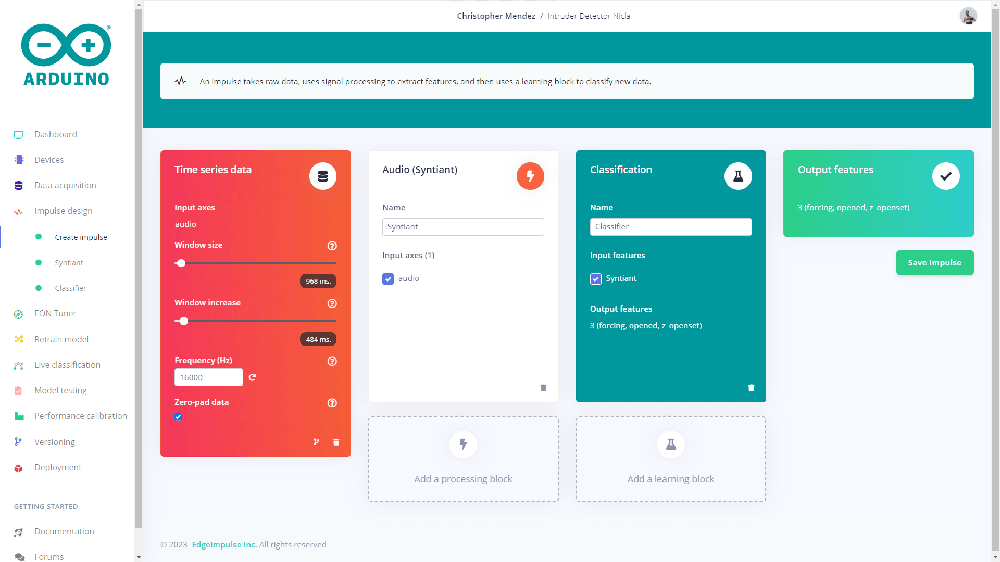
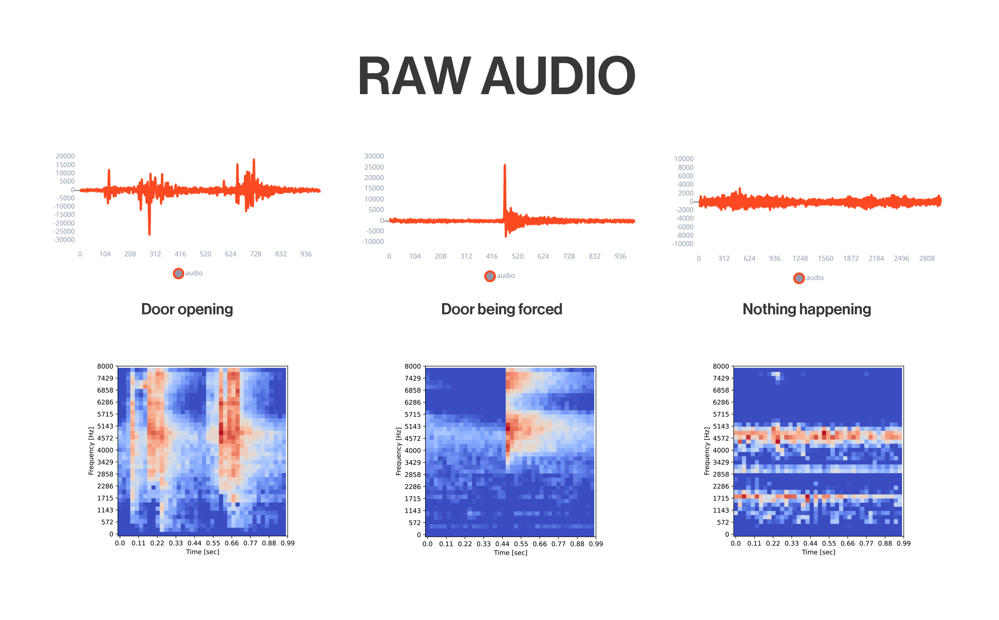
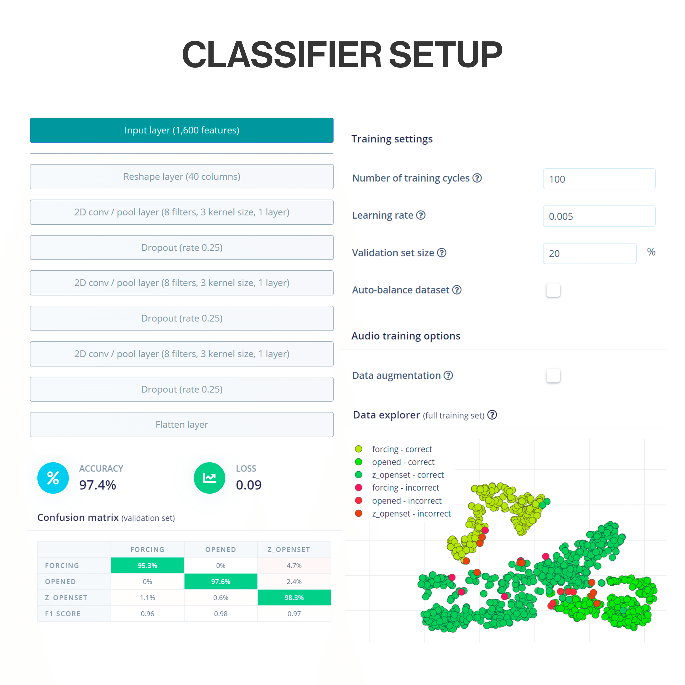
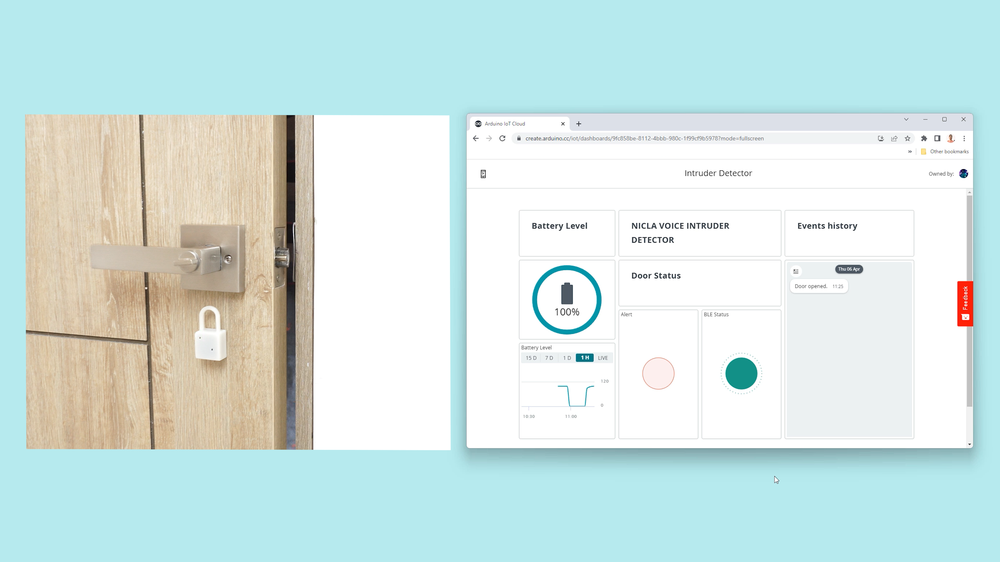
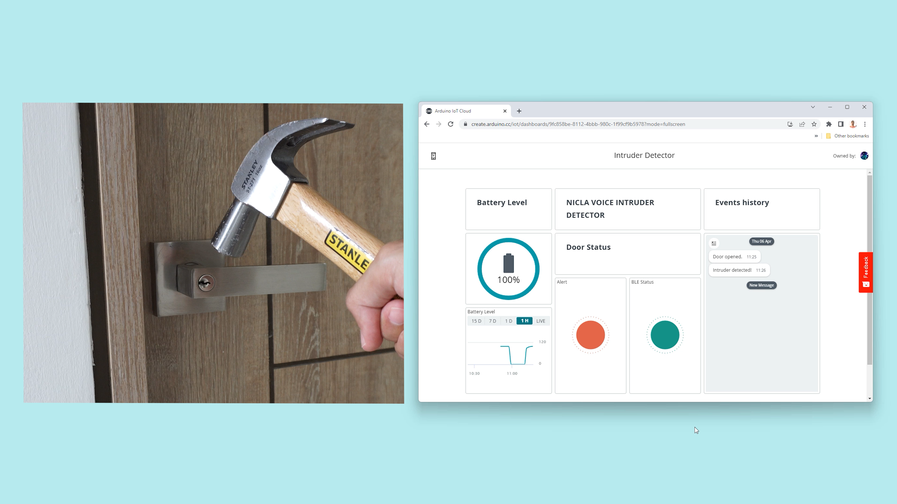

## Introduction

Security has always been a very important factor for our well-being. From the personal to the material, keeping our assets safe is something we struggle with every day, in our cars, lockers, computers, and our houses, we insure everything is locked up, but there are times when that is not enough. 


In such a connected world, where we have a lot of information in the palm of our hand, it would also be very useful to have the status of those things that we have insured in a more analogous way, such as the front door of our home. Leveraging the integrated microphone of the Nicla Voice provides the possibility to build this kind of protection system.

## Goals

The goal of this application note is to showcase an intruder detection and monitoring system for a house front door using the Nicla Voice + a Portenta H7 as a host and the Arduino IoT Cloud. This project's objectives are the following:

- Analyze the surrounding sounds with the onboard microphone of the Nicla Voice and run artificial intelligence algorithms at the edge.
- Correctly identify if a door has been opened in an ordinary manner or suffered a forced attempt.
- Report opening and intruder detection events through BLE to a Host.
- The host must forward the data from the Nicla Voice to the Arduino IoT cloud using an Internet connection (Wi-Fi® in this case).
- Create an Arduino Cloud dashboard that syncs in real time to inform and alert the user.
- Gather real-world data to train a Machine Learning model.

## Hardware and Software Requirements


### Hardware Requirements
- Nicla Voice
- 3.7 V LiPo battery
- Portenta H7
- USB-C® cable
- Micro USB cable
- 5 VDC wall power adapter
- DC brushless fan Model: LD3007MS
- [Nicla Voice and Portenta H7 3D Printed enclosures](assets/Intruder_Detector_3D_Files.zip)

### Software Requirements
- [Arduino IDE 1.8.10+](https://www.arduino.cc/en/software), [Arduino IDE 2.0+](https://www.arduino.cc/en/software), or [Arduino Web Editor](https://create.arduino.cc/editor)
- If you are going to use an offline Arduino IDE, you must install the following libraries: `ArduinoBLE`, `ArduinoIoTCloud`, and `Arduino_ConnectionsHandler`. You can install them using the Arduino IDE Library Manager.
- The [intruder detector example code](assets/Nicla_Portenta_Codes.zip)
- [Edge Impulse® CLI](https://docs.edgeimpulse.com/docs/edge-impulse-cli/cli-overview), which you can install following these [instructions](https://docs.edgeimpulse.com/docs/edge-impulse-cli/cli-installation)
- Nicla Voice audio [firmware](https://cdn.edgeimpulse.com/firmware/arduino-nicla-voice-firmware.zip) to upload recordings to Edge Impulse®.
- [Syntiant® uploader and precompiled ML model](assets/Syntiant_Uploader.zip)
- [Arduino Agent](https://create.arduino.cc/getting-started/plugin/welcome) to add the Portenta H7 to the IoT Cloud

## The Machine Learning Model

The Machine Learning is a way of programming in which we make our device process raw data from sensors and learn based on extracted meaningful features that will be later used for identifying or predicting the originally trained scenarios.

To be able to identify when the door is being opened or when it is being forced by someone, we trained a machine learning model using the [Edge Impulse](https://www.edgeimpulse.com/) integration with the [Arduino Cloud](https://cloud.arduino.cc/), that will be running repetitively in the Nicla Voice.

First, we flashed the Nicla Voice with an [audio ingestion firmware](https://cdn.edgeimpulse.com/firmware/arduino-nicla-voice-firmware.zip) to record and upload samples to our Edge Impulse project of three different scenarios that we want to identify later. 

Here is our model design:



As we are using the Nicla Voice, we must follow the model design to be supported by the onboard Syntiant® NDP120 Neural Decision Processor™, taking care of these characteristics.

In the time series data block:

- Window size: 968 ms
- Window increase: 484 ms
- Frequency: 16000 Hz

In the processing block:

- **Audio (Syntiant)**
- This DSP block computes log Mel-filterbank energy features from audio signals

In the learning block:

- **Classification**
- This block includes the Neural Network architecture to learn patterns from audio data.


Here is a graphical representation of how the samples look before and after the digital signal processing:



Our three classes are:

- Opened: here we record the sound of the door being opened.
- Forcing: here we record the sound of the door lock being hit with a metallic tool.
- Z_openset: here we record the environment noise when nothing is happening and unknown sounds like music and conversations.

Here is the neural network classifier configuration for this application:



After the model is trained with a lot of samples of a door being opened, being forced and nothing happening, we got considerable good results that we can evidentiate on the "Confusion matrix" with a 97.4% of accuracy being achieved with a validation set of new data.

> **Note:** The model performance can be affected if the application is implemented on a very different environment than the one used for training. It's recommended to feed the datasets with new samples and retrain the model for a new and upgraded deployment. 

For a new model deployment, use the [Syntiant® uploader](assets/Syntiant_Uploader.zip) and replace the `ei_model.synpkg` with yours.

## Intruder Detector System Setup

In this application, we don't need any particular wiring diagram other than the Nicla Voice and the Portenta H7. 

The Nicla Voice will be attached to the guarded door and near the lock, the Portenta H7 host will be somewhere with good Wi-Fi® coverage and not so far from the Nicla Voice due to BLE's narrow range of a couple of meters.


The Nicla will communicate with the Portenta H7 through BLE advertising any event to the host that will receive and forward the notification to the Arduino IoT cloud using Wi-Fi®.

The Nicla Voice is powered by a LiPo battery inside its enclosure. The Portenta H7 will be powered by a 5VDC USB adapter accompanied by a cooling fan.

## Intruder Detector System Overview

The Nicla Voice attached to the door is running an ML model listening to the surrounding noises and searching for known sounds like the door being opened or the door lock being hit with a metallic tool, for example, to simulate a forcing process.

If the sounds are recognized with a certainty higher than 70% the event will be considered as occurred and a BLE notification will be sent to the Portenta H7 host updating the door status.

The Portenta H7 will be in charge of receiving the door event notification and updating the dashboard variables in the IoT Cloud immediately so the user can be aware in real time of any change. In addition to these features, the application dashboard will show a historic record of events, alongside an "Intruder Alert", the BLE connection status between both devices and the Nicla Voice battery level so we can know when to recharge it.

### Nicla Voice Code

Now, we will go through some important code sections to make this application fully operative. We will begin with the required libraries:

- Including `NDP.h` will enable and run the Neural Decision Processor (NDP120), it's included in the BSP of the Nicla Voice.
- Including `ArduinoBLE.h` will enable the BLE communication, install it by searching for it on the Library Manager.

The BLE services and characteristics are standardized for the specific use of this application's features. The service is defined as "Immediate alert" which makes it ideal for the use that we will give of notifying on a door opening or forcing event, in addition to this, we defined two characteristics, one for the "Alert Level" that will advertise between both events and a "Battery Level" one to advertise the Nicla Voice battery level to the host. Notice that they have specific and standardized UUIDs.

```arduino
#include "NDP.h"
#include <ArduinoBLE.h>

// Alert Service
BLEService alertService("1802");  // Immediate alert

// BLE Alert Characteristic
BLEUnsignedCharCharacteristic alertLevel("2A06",                // standard 16-bit characteristic UUID
                                         BLERead | BLENotify);  // remote clients will be able to get notifications if this characteristic changes

// Bluetooth® Low Energy Battery Level Characteristic
BLEUnsignedCharCharacteristic batteryLevelChar("2A19",                // standard 16-bit characteristic UUID
                                               BLERead | BLENotify);  // remote clients will be able to get notifications if this characteristic changes
```
The Nicla Voice's integrated NDP needs some files stored in the external flash of the board which are:
- mcu_fw_120_v91.synpkg
- dsp_firmware_v91.synpkg
- ei_model.synpkg

> The files must be named exactly as showed below.
To store them in the Nicla Voice memory you must use the [Syntiant Uploader](assets/Syntiant_Uploader.zip), these files won't be overwritten after any sketch update.


```arduino
  // Neural Decision Processor firmware and ML model files loading
  NDP.begin("mcu_fw_120_v91.synpkg");
  NDP.load("dsp_firmware_v91.synpkg");
  NDP.load("ei_model.synpkg");
  Serial.println("packages loaded");
  NDP.getInfo();
  Serial.println("Configure mic");
  NDP.turnOnMicrophone();
```
The main responsibility of the Nicla Voice code is to listen to and identify the trained sounds, the below code section is in charge of comparing the inferred category and taking a certain action between them. In the case the Nicla detects the door opening, the label parameter will turn to "NN0:opened", this will trigger a BLE alert sending command followed by a listening pause to avoid duplicated alerts and a green LED blinking to visually indicate the event. The same for the "NN0:forcing" label, with the difference that in this case the LED flashes red and the alert message changes.

```arduino
/**
  Inference Interruption Callback to be executed with every triggered inference,
  it controls the built-in LED's and send the alerts through BLE.
  
  Possible labels: NN0:opened, NN0:forcing

  Alerts: 1 = mild alert (for door opened), 2 = high alert (for intruder detected)

  @param label The inferred category label
*/
void BLEsend(char* label) {

  if (strcmp(label, "NN0:opened") == 0) {
    alertLevel.writeValue(1);
    NDP.noInterrupts();
    nicla::leds.begin();
    nicla::leds.setColor(green);
    delay(3000);
    nicla::leds.end();
    NDP.interrupts();
  }
  if (strcmp(label, "NN0:forcing") == 0) {
    alertLevel.writeValue(2);
    NDP.noInterrupts();
    nicla::leds.begin();
    nicla::leds.setColor(red);
    delay(3000);
    nicla::leds.end();
    NDP.interrupts();
  }
  if (!lowestPower) {
    Serial.println(label);
  }
}
```
These methods are used to update the characteristics of this application.

```arduino
alertLevel.writeValue(x);  // x = 1 if the door is opened or x = 2 if the door is forced
batteryLevelChar.writeValue(HigherBatteryLevel);
```

### Portenta H7 Code

The Portenta H7 needs different libraries to work, in this case, are:

- `ArduinoIoTCloud.h` This one handles the IoT Cloud connection and project variables publishing, it can be installed directly from the Arduino Library Manager.
- `Arduino_ConnectionHandler.h` This one manages the Wi-Fi® connection and can be installed directly from the Arduino Library Manager.
- `thingProperties.h` This is automatically generated by the Arduino Cloud, however, if you are using an offline IDE verify it's in the same directory as your sketch.

In the global parameters, we have two variables that will store the local status of the alerts and the Nicla Voice battery level. 

```arduino
#include <ArduinoIoTCloud.h>
#include <Arduino_ConnectionHandler.h>
#include "thingProperties.h"
#include <ArduinoBLE.h>

#define DEBUG false

// Global Parameters
byte BatteryValue = 0;  // last battery level received.
byte AlertValue = 0;    // last alert value received.
```
In the `thingProperties.h` file we encounter the definition of several important variables to properly connect our project to the internet and the Arduino IoT Cloud.
- We must update the `THING_ID` variable with our Arduino IoT Cloud Thing ID.
- For a successful internet connection, we must update the `SSID` and `PASS` variables with our Wi-Fi® credentials.

In the `initProperties()` function we have listed the variables that will be monitored in the IoT Cloud and their update method, in this case, is `ON_CHANGE` which means that the Portenta H7 will only send the value of any variable to the Cloud if it's changes compared to the previous value.

```arduino
const char THING_ID[] = "xxxxxxxx-xxxx-xxxx-xxxx-xxxxxxxxxxxx"; // Arduino Cloud Thing ID

const char SSID[]     = "xxxxxxxx";    // Network SSID (name)
const char PASS[]     = "xxxxxxxx";    // Network password (use for WPA, or use as key for WEP)

String DoorEvent = "System initiated";  
int battery;
bool BLEstatus;
bool alertStatus;

void initProperties(){

  ArduinoCloud.setThingId(THING_ID);
  ArduinoCloud.addProperty(DoorEvent, READ, ON_CHANGE, NULL);
  ArduinoCloud.addProperty(battery, READ, ON_CHANGE, NULL);
  ArduinoCloud.addProperty(BLEstatus, READ, ON_CHANGE, NULL);
  ArduinoCloud.addProperty(alertStatus, READ, ON_CHANGE, NULL);

}

WiFiConnectionHandler ArduinoIoTPreferredConnection(SSID, PASS);
```
The main responsibility of the Portenta H7 code is to connect to the Nicla Voice and be aware of new notifications to forward them to the Cloud. To achieve this, the first thing done by the Portenta is to initialize the BLE communication, then initialize the Arduino IoT Cloud service and start scanning for peripherals.

```arduino
  // Initialize BLE
  if (!BLE.begin()) {
    Serial.println("Starting BLE failed!");
    while (1) {
    }
  }

  // Defined in thingProperties.h
  initProperties();

  // Connect to Arduino IoT Cloud
  if (!ArduinoCloud.begin(ArduinoIoTPreferredConnection)) {
    Serial.println("ArduinoCloud.begin FAILED!");
  }

  setDebugMessageLevel(2);
  ArduinoCloud.printDebugInfo();

    // start scanning for peripheral
  BLE.scan();
  Serial.println("Scanning for peripherals.");
```
The scanning process will automatically stop when it finds a "Nicla Lock" called device, then it will search for its services and characteristics with the `NiclaLockHandler()` function.

```arduino

void loop() {

  // check if a peripheral has been discovered
  BLEDevice peripheral = BLE.available();

  // Turn on the Green LED if the board is successfully connected to the Cloud. On with Low.
  if (ArduinoCloud.connected()) {
    digitalWrite(LEDG, LOW);
  } else {
    digitalWrite(LEDG, HIGH);
  }

  if (peripheral) {
    // peripheral discovered, print out address, local name, and advertised service
    Serial.print("Found ");
    Serial.print(peripheral.address());
    Serial.print(" '");
    Serial.print(peripheral.localName());
    Serial.print("' ");
    Serial.print(peripheral.advertisedServiceUuid());
    Serial.println();

    // Check if the peripheral is a Nicla Lock:
    if (peripheral.localName() == "Nicla Lock") {
      // stop scanning
      BLE.stopScan();

      // Nicla Voice node connection handler
      NiclaLockHandler(peripheral);

      // peripheral disconnected, start scanning again
      BLE.scan();
    }
  }
  ArduinoCloud.update();
}

```

In order to just get connected with the Nicla Voice, the Portenta searches for the specific "Alert Service" using its UUID `1802` and for the necessary characteristics, the "Battery Level" using the `2A19` UUID  and the "Alert Level" using the `2A06` UUID.

```arduino
  // discover peripheral attributes
  Serial.println("Searching for service 1802 ...");

  if (peripheral.discoverService("1802")) {
    Serial.println("Service discovered");
  } else {
    Serial.println("Attribute discovery failed.");
    peripheral.disconnect();

    while (1)
      ;
    return;
  }

  // retrieve the simple key characteristics
  BLECharacteristic batteryLevelChar = peripheral.characteristic("2A19");
  BLECharacteristic alertLevel = peripheral.characteristic("2A06");

  // subscribe to the simple key characteristics process
  Serial.println("Subscribing to simple key characteristic ...");
  if (!batteryLevelChar || !alertLevel) {
    Serial.println("no simple key characteristic found!");
    peripheral.disconnect();
    return;
  } else if (!batteryLevelChar.canSubscribe() || !alertLevel.canSubscribe()) {
    Serial.println("simple key characteristic is not subscribable!");
    peripheral.disconnect();
    return;
  } else if (!batteryLevelChar.subscribe() || !alertLevel.subscribe()) {
    Serial.println("subscription failed!");
    peripheral.disconnect();
    return;
  } else {
    Serial.println("Subscribed to Battery Level and Alert Characteristic");
  }
```
Finally, the Portenta verifies continuously if a characteristic is updated to upload it to the Cloud.

```arduino
// while the peripheral is connected
  while (peripheral.connected()) {
    
    // check if the value of the characteristic has been updated
    if (batteryLevelChar.valueUpdated()) {

      batteryLevelChar.readValue(BatteryValue);

      Serial.print("Battery Level: ");
      Serial.print(BatteryValue);
      Serial.println(" %");

      battery = BatteryValue;
    }

    // check if the value of the characteristic has been updated
    if (alertLevel.valueUpdated()) {

      alertLevel.readValue(AlertValue);

      Serial.print("Alert: ");
      Serial.println(AlertValue);

      
      if (AlertValue == 1) {    // if the Alert = 1 means the door was opened
        control = !control;     // as variables are updated if they change, add a simple dot "." to be able to update it if happens twice consecutive.
        if (control) {
          DoorEvent = "Door opened";
        } else {
          DoorEvent = "Door opened.";
        }

        alertStatus = false;

      } else if (AlertValue == 2) {   // if the Alert = 2 means the door was forced
        control = !control;           // as variables are updated if they change, add a simple dot "." to be able to update it if happens twice consecutive.
        if (control) {
          DoorEvent = "Intruder detected!";
        } else {
          DoorEvent = "Intruder detected!.";
        }

        alertStatus = true;
      }
    }

    // turn off green LED if disconnected from Cloud.
    if (ArduinoCloud.connected()) {
      digitalWrite(LEDG, LOW);
    } else {
      digitalWrite(LEDG, HIGH);
    }

    ArduinoCloud.update();
  }
```
### The Cloud Dashboard

Taking advantage of the Arduino Cloud, we can seamlessly integrate a simple but powerful dashboard to monitor and visualize the status of the system in real-time:


Within the Arduino Cloud's dashboard, the system variables can be monitored. We have a battery level indicator widget accompanied by a time series graph, a chat-looking widget to store the events historically, a red LED to shine when an intruder is detected by the system, and a green LED to show the BLE connection status between the Nicla Voice and the Portenta H7 host. We can easily access this dashboard from a PC, mobile phone or tablet from anywhere, receiving an instantaneous update wherever we are. In addition, we can set different integrations to complement our project, for example, setting up an IFTTT automation to receive an email, an cellphone notification, or even triggering some automation like turning on all the lights at home whenever an alert is fired.





## Full Intruder Detector Example


All the necessary files to replicate this application notes can be found below:

* The complete code can be downloaded [here](assets/Nicla_Portenta_Codes.zip)
* The enclosure 3D printed models can be downloaded [here](assets/Intruder_Detector_3D_Files.zip). 
* The Edge Impulse project is public [here](https://mltools.arduino.cc/public/204744/latest) so you can clone it and modify it to adapt it to your needs by improving the dataset or model architecture for a custom deployment.

## Conclusion

In this application note, we have learned how to implement a Machine learning project powered by Edge Impulse and the Arduino Cloud at the edge using a Nicla Voice and a Portenta H7. This application could be a simple demonstration of how Arduino's environment simplifies the workflow for developing smart solutions to solve real-life situations by integrating "complex" and mighty algorithms with just a few easy-to-follow steps. We covered sound recognition, BLE communication, and real-time Cloud monitoring.

### Next Steps

As you already know how to develop an Intruder Detector with the Nicla Voice and the Portenta H7, it's time for you to continue exploring all the capabilities of the Arduino Pro environment to integrate it with your professional setup and improve it with powerful solutions. 

You can create your application by training your own model with different scenario sounds or using the built-in Nicla Voice's IMU to analyze machine vibrations and making smart your existing manufacturing setup.