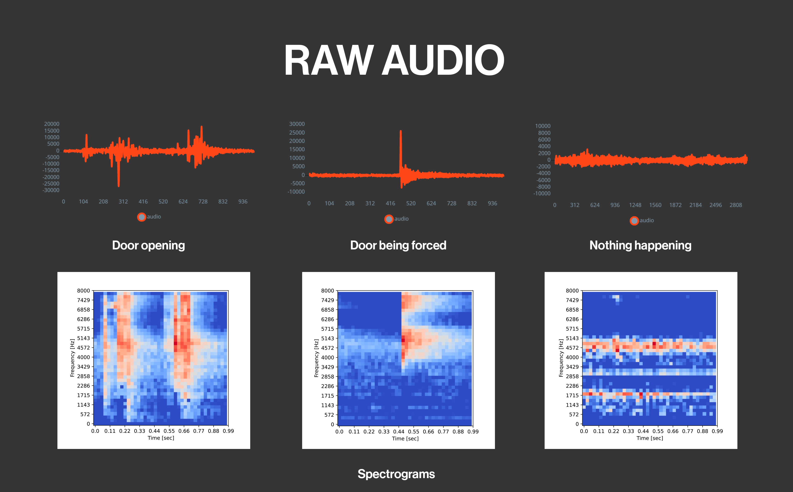
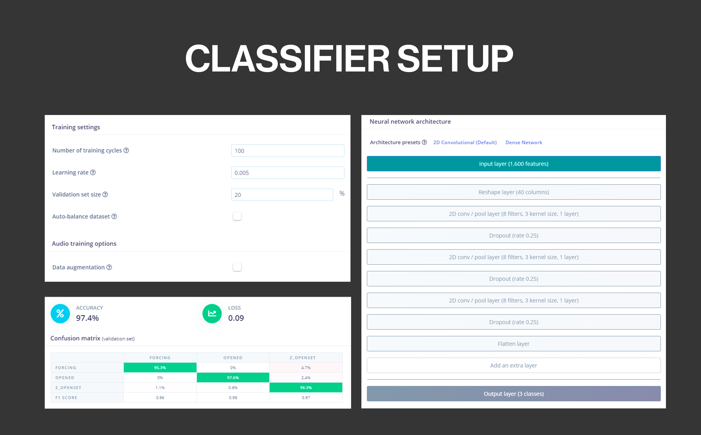

## Introduction

Security has always been a very important factor for our well-being, from the personal to the material, keeping our assets safe is something we struggle with every day, in our cars, lockers, computers, our houses, we insure everything is locked up, but there are times when that is not enough. In such a connected world, where we have a lot of information in the palm of our hand, it would also be very useful to have the status of those things that we have insured in a more analogous way, such as the front door of our home. Using its integrated microphone the Nicla Voice is an ideal option to achieve this.

## Goals

The goal of this application note is to showcase an intruder detection and monitoring system for a house front door using the Nicla Voice + a Portenta H7 as a host and the Arduino IoT Cloud. This project's objectives are the following:

- Analyze the surrounding sounds with the Nicla Voice integrated microphone and run artificial intelligence algorithms at the edge.
- Correctly identify if a door is opened or tried to be forced.
- Report opening and intruder detection events through BLE to a Host.
- The host must forward the data from the Nicla Voice to the Arduino IoT cloud using an Internet connection (WiFi in this case).
- The cloud variables are updated just on change and will be presented on a Arduino IoT Cloud dashboard.
- Gather real-world data to train a Machine Learning model.

## Hardware and Software Requirements

### Hardware Requirements
- Nicla Voice
- 3.7v LiPo battery
- Portenta H7
- USB-C® cable
- 5VDC wall power adapter
- DC brushless fan Model: LD3007MS
- Nicla Voice 3D printed enclosure
- Portenta H7 3D printed enclosure

### Software Requirements
- [Arduino IDE 1.8.10+](https://www.arduino.cc/en/software), [Arduino IDE 2.0+](https://www.arduino.cc/en/software), or [Arduino Web Editor](https://create.arduino.cc/editor)
- If you are going to use an offline Arduino IDE, you must install the following libraries: `ArduinoBLE`, `ArduinoIoTCloud`, and `Arduino_ConnectionsHandler`. You can install them using the Arduino IDE Library Manager.
- The [intruder detector example code](assets/intruder-detector-sketch.zip)
- [Edge Impulse CLI](https://docs.edgeimpulse.com/docs/edge-impulse-cli/cli-overview), which you can install following these [instructions](https://docs.edgeimpulse.com/docs/edge-impulse-cli/cli-installation)
- Nicla Voice audio [firmware](https://cdn.edgeimpulse.com/firmware/arduino-nicla-voice-firmware.zip) to upload recordings to Edge Impulse.
- [Syntiant uploader and precompiled ML model](assets/intruder-detector-ml-model.zip).

## The Machine Learning Model

In simple words, Machine Learning is a way of programming in which we make our device to process raw data from sensors and extract meaningful features from it to be learned and later used for identifying or predicting the originally trained scenarios.

To be able to identify when the door is being opened or when it is being forced by someone, we trained a machine learning model using the [Edge Impulse](https://www.edgeimpulse.com/) integration with the [Arduino Cloud](https://cloud.arduino.cc/), that will be running repetitively in the Nicla Voice.

We flashed the Nicla Voice with an [audio ingestion firmware](https://cdn.edgeimpulse.com/firmware/arduino-nicla-voice-firmware.zip) to record and upload samples to our Edge Impulse project of three different scenarios that we want to identify later. 

Here is our model design:

As we are using the Nicla Voice we must follow the showed model design to be supported by the onboard Syntiant AI accelerator, taking care of these characteristics:

In the time series data block:

- Window size: 968 ms.
- Window increase: 484 ms.
- Frequency: 16000 Hz.

In the processing block:

- Audio (Syntiant).
    - This DSP block computes log Mel-filterbank energy features from audio signals.

In the learning block:

- Classification.
    - This block includes the Neural Network architecture to learn patterns from audio data. 

Here is a graphical representation of how the samples look before and after the digital signal processing:

Here is the neural network classifier configuration for this application:

After the model is trained with a lot of samples of a door being opened, being forced and nothing happening, we get

## Intruder Detector System Setup

## Intruder Detector System Overview

### Nicla Voice Code

### Portenta H7 Code

### The Cloud Dashboard

## Full Intruder Detector Example

## Conclusion