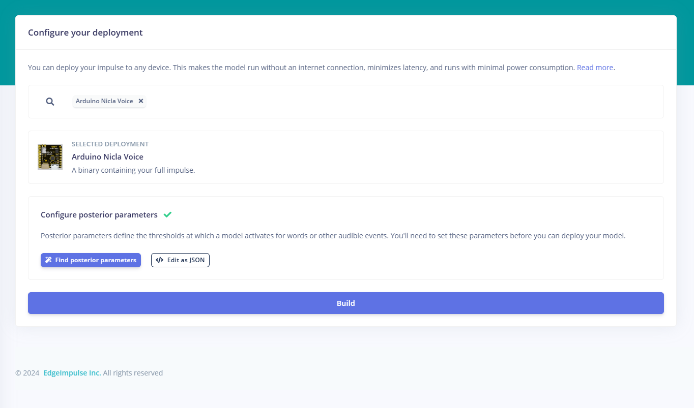
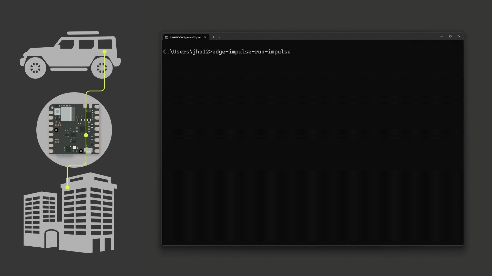

## Introduction

The Nicla Voice and Edge Impulse offer powerful tools for monitoring environments like spaces with glass structures. This system allows timely detection and responses for environments like buildings, vehicles, or specialized facilities. You can create scalable AI solutions for security needs by leveraging these tools.


This application note will show you how to build and deploy a machine learning model on Nicla Voice with Edge Impulse that detects glass-breaking sounds. The content will cover how audio dataset is managed and used for training for efficient sound classification.

## Goals

This application note will show you how to create a glass-breaking detection system using the Nicla Voice and Edge Impulse. The objectives are:

- Process audio data of glass-breaking sounds and background noise using the [**DCASE**](http://dcase.community/challenge2017/task-rare-sound-event-detection-results) dataset.
- Train a machine learning model to distinguish glass-breaking sounds from other noises reliably.
- Deploy the trained model to the Nicla Voice for on-device inference, removing the need for external computation.
- Showcase the model’s real-time detection capabilities through practical examples.

At the end of the application note, you will have all resources and details for implementing a glass-breaking detection system in various environments.

## Hardware and Software Requirements

### Hardware Requirements

- [Nicla Voice](https://store.arduino.cc/nicla-voice)
- [USB-C® cable](https://store.arduino.cc/products/usb-cable2in1-type-c) (x1)
- 3.7 V LiPo battery (Optional)

For [expanded Glass Breaking detector section](#expanding-glass-breaking-detector), it requires:

- [Portenta H7](https://store.arduino.cc/portenta-h7)
- [USB-C® cable](https://store.arduino.cc/products/usb-cable2in1-type-c) (x1)
- Wi-Fi® Access Point (x1)

### Software Requirements

- [Arduino Machine Learning Tools](https://cloud.arduino.cc/machine-learning-tools/)
- [Edge Impulse® CLI](https://docs.edgeimpulse.com/docs/edge-impulse-cli/cli-overview), to easily flash any Machine Learning model created with the Arduino Machine Learning Tools, we can install the Edge Impulse® Cli tool following these [instructions](https://docs.edgeimpulse.com/docs/edge-impulse-cli/cli-installation).
- Nicla Voice audio [firmware](https://cdn.edgeimpulse.com/firmware/arduino-nicla-voice-firmware.zip) to upload recordings to Machine Learning Tools.
- [Arduino IDE 1.8.10+](https://www.arduino.cc/en/software), [Arduino IDE 2](https://www.arduino.cc/en/software), or [Arduino Cloud Editor](https://create.arduino.cc/editor) (Optional).
- The [Arduino Create Agent](https://cloud.arduino.cc/download-agent/)
- The [Arduino Cloud](https://cloud.arduino.cc/). If you do not have an account, you can create one for free inside [cloud.arduino.cc](https://cloud.arduino.cc/home/?get-started=true).

### Additional Resources

Complete example code and Edge Impulse project:

- [Glass-breaking detection model](https://mltools.arduino.cc/public/210541/latest)
- [Base glass-breaking detector example](assets/glass-break-detector.zip)
- [Extended glass-breaking detector with Arduino Cloud](assets/glass-break-detection-building.zip)

Dataset resources:

- Pre-recorded glass-breaking sound samples (or access to the [**DCASE**](http://dcase.community/challenge2017/task-rare-sound-event-detection-results) dataset).  
- A speaker or audio playback device for live testing.

## Edge Impulse and Nicla Voice Versatility

Edge Impulse and Nicla Voice provide a highly flexible and adaptable solution for various monitoring applications, including glass structure monitoring systems.


These applications, such as monitoring buildings, vehicles, and public spaces, are some examples that can develop into a comprehensive system integrated with the Arduino Cloud:

- **Buildings:** Identify glass-breaking incidents in residential, commercial, or industrial properties. Programmed alerts can trigger lockdown protocols, notify security teams, and log incidents in real time.

- **Vehicles:** Detect windshield breakage and provide real-time SOS signals, vehicle location, or license plate details. This feature is particularly beneficial for improving vehicle security.

- **Custom Environments:** Deploy in specific setups like public transportation, specialized labs, or sensitive equipment areas where glass-related incidents require immediate attention.

This adaptability provides comprehensive coverage and flexible response mechanisms for various scenarios. Additionally, integrating BLE communication and Arduino Cloud makes the system more versatile and responsive.

***If you are new to the Nicla Voice, it is recommended that you review the [Nicla Voice User Manual](https://docs.arduino.cc/tutorials/nicla-voice/user-manual) to familiarize yourself with its features and setup before continuing with this application note.***

## Glass Break Machine Learning Model Development

The application will be based on a preconfigured example model created by Aurelien Lequertier that is available on the [Arduino Machine Learning Tools](https://mltools.arduino.cc/public/210541/latest).

This example detects anomalous sounds of glass breaking using the [**DCASE** rare sound events dataset](http://dcase.community/challenge2017/task-rare-sound-event-detection-results). With this example, you will learn how to build and deploy a glass-breaking detection system.

### Data Collection

Data collection is the foundation of any machine learning project. This application note will use an existing [**DCASE dataset** (Detection and Classification of Acoustic Scenes and Events)](http://dcase.community/challenge2017/task-rare-sound-event-detection-results) to avoid the practical challenges of recording actual glass-breaking sounds.

This dataset provides a broad collection of audio samples designed for rare sound event detection, including glass-breaking sounds and background noise. It includes:

- **Mixtures:** 1500 of 30 second audio mixtures, totaling 12 hours and 30 minutes of audio, created by combining isolated events with background recordings.
- **Isolated Events:** 474 unique events across three target categories: baby crying, **glass breaking**, and gunshot.
- **Background Recordings:** 1121 of 30 second recordings of ambient sounds totaling 9 hours and 20 minutes of audio.

For this application note, we focus on glass-breaking sounds. From this dataset, *313 audio samples* are used for training and *54 samples* for testing. These samples represent two main categories:

- Glass-breaking events
- Non-glass-breaking ambient noise

Using the [**DCASE**](http://dcase.community/challenge2017/task-rare-sound-event-detection-results) dataset helps you to have a diverse range of audio conditions, improving the robustness of the final model.

The audio data was preprocessed with **Edge Impulse**. Its user interface allows you to manage audio files, including cropping unnecessary segments and splitting longer recordings into manageable pieces.

This preprocessing step ensures that only relevant data is provided into the training pipeline, maximizing the model performance. The preprocessing step includes following steps:

- **Audio Segmentation:** Splitting long audio recordings into smaller, manageable clips for more effective training.
- **Noise Handling:** Removing background noise or irrelevant segments to ensure the dataset focuses on the target sounds.
- **Normalization:** Ensuring consistent audio levels across all samples to improve model reliability. Using Edge Impulse GUI, you can crop unnecessary segments, annotate audio clips, and simplify this process.

Using Edge Impulse, you can simplify these preprocessing steps with tools to crop unnecessary segments, annotate audio clips, and visualize the processed data. The dataset can be found within the **Data acquisition** section in the Edge Impulse platform.


The above image shows the dataset overview in Edge Impulse, where you can see the collected audio samples for glass-breaking events. The data is divided into training and testing sets to ensure the model's generalization.

Additionally, Edge Impulse allows you to collect data directly from your devices, either through a USB connection or wirelessly. This capability is particularly useful for iterative model improvement, allowing you to add new audio samples over time as real-world conditions change. This flexibility ensures that the model remains accurate and effective throughout its lifecycle.

### Data Processing

In this step, you will use an audio processing block specifically optimized for the NDP120 processor integrated into the Nicla Voice. This block uses a *Fast Fourier Transform (FFT)* to convert audio signals from the time domain into the frequency domain, extracting meaningful features for classification.

Dimensionality reduction techniques help visualize and cluster features, effectively distinguishing between glass-breaking and non-glass-breaking sounds.

The first image below shows the time series configuration and audio processing block in Edge Impulse. Configurable parameters, such as window size and frequency, are important in extracting the most meaningful features for audio data classification.

These configurations are available in the **Create Impulse** section of the Edge Impulse platform.


The processing block includes customizable settings such as window size and feature scaling, allowing users to fine-tune signal processing based on specific application requirements. This flexibility provides optimal feature extraction and improved classification accuracy.


The second image shows the output of feature generation. The data visualization reveals clusters corresponding to glass-breaking and non-glass-breaking audio samples.

This helps us understand how well the system can separate these two types of sounds, which can be accessed under the **Parameters** tab of the **Syntiant** section in Edge Impulse.

### Model Training

You will use a dense neural network architecture that is well-suited for audio classification tasks. The configuration ensures compatibility with the hardware, using a 968 millisecond audio window for processing requirements.

Edge Impulse’s Eon tuner can help automatically optimize model parameters, simplifying the process for you without extensive machine learning expertise.

The model achieved an accuracy of *89 %* during training, showing its capability to differentiate between glass-breaking and background noises. This can be found within the **Classifier** section in the Edge Impulse platform.


- **Architecture**: Dense neural network  
- **Window Size**: 968 milliseconds  
- **Optimization**: The **Eon tuner** automatically optimized signal processing and model parameters.  
- **Accuracy**: The model achieved an accuracy of 89% on the training set, demonstrating robust performance. 


The image shows the training settings and the neural network architecture used in Edge Impulse. This window can be found within the **Generate features** tab from **Syntiant** section in the Edge Impulse platform. The Eon tuner can help you optimize hyperparameters like learning rate, number of neurons, and layer configurations to achieve the best balance between model size, accuracy, and latency.

### Model Testing

After training, the model is evaluated using a test dataset that includes previously unseen audio samples. This evaluation helps ensure the model generalizes adequately to new data and determine glass-breaking events under various conditions.


The image above shows the testing results with an accuracy of **99.12 %**. This can be found within the **Model testing** section in the Edge Impulse platform.

The confusion matrix highlights the model's capability to classify audio samples correctly while identifying potential areas for improvement:

- Correctly classified "glassbreak" events: 94.4 %
- Correctly classified "unknown" samples: 100 %

Misclassifications could have happened for short-duration glass-breaking sounds, suggesting the need for additional data or refinement of the processing pipeline to improve robustness. Regular updates to the dataset with new samples can address such limitations and improve performance.

***The model performance can be affected if the application is implemented in a very different environment than the one used for training. It is recommended that the datasets be provided with new samples and the model be retrained for a new and upgraded deployment.***

## Deployment

### Model Deployment

After training the model, it can be deployed to the Nicla Voice using **binary firmware builder from Edge Impulse**. This builder creates firmware that includes the trained model and the necessary scripts for on-device inference, allowing operation without internet connectivity.

To begin, navigate to the **Deployment** section in the Edge Impulse platform. The following image shows the deployment configuration screen, where you can select Nicla Voice as the deployment target.



Once the Nicla Voice is selected as the deployment target, click on **Build** to start the firmware build process. The animation below provides an overview of how this process looks:


After the build is complete, the firmware files will automatically download. You can retrieve them later from the **Latest build** tab in the **Deployment** section if needed.


The downloaded firmware comes as a compressed file. Extract it to your preferred directory. You will find several files in the extracted folder, including a directory named **`ndp120`**.

This folder contains the NDP120 processor firmware and the trained machine learning model. There are four scripts for each supported operating system:

- **flash_(os):** Runs the MCU firmware and model flash scripts.
- **flash_(os)_mcu:** Flashes only the MCU firmware.
- **flash_(os)_model:** Flashes the NDP firmware, DSP firmware (if not present), and updates the model.
- **format_(os)_ext_flash:** Erases the external flash memory.

**`(os)`** refers to the operating system: linux, mac, or windows.

To install the required dependencies, run the `install_lib` script for your operating system. This script only needs to be run once. The model update process uses the Python package [`pyserial`](https://pyserial.readthedocs.io/en/latest/).

After preparing the firmware, connect the Nicla Voice to your computer. 

Use the corresponding script to automatically proceed with the firmware update and model upload. For Windows users, for example, the following command can be used in a terminal:

```bash
flash_windows
```

The animation below shows the firmware update process and uploading the trained model:


If you prefer to update manually, navigate to the **`ndp120`** directory and run the following commands in sequence:

```bash
./syntiant-uploader-win send -m "Y" -w "Y" -p COM<Port Number> mcu_fw_120_v91.synpkg
```

```bash
./syntiant-uploader-win send -m "Y" -w "Y" -p COM<Port Number> dsp_firmware_v91.synpkg
```

```bash
./syntiant-uploader-win send -m "Y" -w "Y" -p COM<Port Number> ei_model.synpkg
```

***If you are not familiar with updating the NDP120 processor firmware and uploading the trained machine learning model, please refer to [this section](https://docs.arduino.cc/tutorials/nicla-voice/user-manual/#ndp120-processor-firmware-update) of the Nicla Voice User Manual.***

For a new model deployment with manual approach, use the [Syntiant® uploader](assets/Syntiant_Uploader.zip) and replace the `ei_model.synpkg`, which you can find inside the downloaded folder with yours.

### Running with Edge Impulse CLI

Once the Nicla Voice is updated with the firmware and model, you can run the trained glass-breaking detector model using the Edge Impulse CLI:

```bash
edge-impulse-run-impulse
```

If everything is set up correctly, the terminal will display information similar to the image below:


### Running with Arduino IDE

Alternatively, you can monitor the inference process using an Arduino script uploaded to the Nicla Voice.

Open the Arduino IDE and use the following example script to observe results in the Serial Monitor:

```arduino
#include "NDP.h"

const bool lowestPower = false;

void ledBlueOn(char* label) {
  nicla::leds.begin();
  nicla::leds.setColor(blue);
  delay(200);
  nicla::leds.setColor(off);
  if (!lowestPower) {
    Serial.println(label);
  }
  nicla::leds.end();
}

void ledGreenOn() {
  nicla::leds.begin();
  nicla::leds.setColor(green);
  delay(200);
  nicla::leds.setColor(off);
  nicla::leds.end();
}

void ledRedBlink() {
  while (1) {
    nicla::leds.begin();
    nicla::leds.setColor(red);
    delay(200);
    nicla::leds.setColor(off);
    delay(200);
    nicla::leds.end();
  }
}

void setup() {

  Serial.begin(115200);
  nicla::begin();
  nicla::disableLDO();
  nicla::leds.begin();

  NDP.onError(ledRedBlink);
  NDP.onMatch(ledBlueOn);
  NDP.onEvent(ledGreenOn);
  Serial.println("Loading synpackages");
  NDP.begin("mcu_fw_120_v91.synpkg");
  NDP.load("dsp_firmware_v91.synpkg");
  NDP.load("ei_model.synpkg");
  Serial.println("packages loaded");
  NDP.getInfo();
  Serial.println("Configure mic");
  NDP.turnOnMicrophone();
  NDP.interrupts();

  // For maximum low power; please note that it's impossible to print after calling these functions
  nicla::leds.end();
  if (lowestPower) {
    NRF_UART0->ENABLE = 0;
  }
  //NDP.turnOffMicrophone();
}

void loop() {
  uint8_t command = 0xFF;

  while (Serial.available()) {
    command = Serial.read();
    if (command == 'f') {
      Serial.println("Interrupts disabled");
      NDP.noInterrupts();
    } else if (command == 'o') {
      Serial.println("Interrupts enabled");
      NDP.interrupts();
    }
  }
  //Serial.println("in the loop");
  delay(100);
}
```

## Glass Breaking Detection

With the firmware and model successfully deployed, you can simulate glass-breaking events by playing recorded sounds through a speaker or testing with real-world glass.

The trained model processes the sound in real-time and detects glass-breaking events, showing its capability.

***Although the sound of the real-world glass structure breaking presents the best method to test and validate the trained model, please take precautions and safety measures to avoid possible accidents or injuries.***

The Edge Impulse CLI provides real-time monitoring and classification results. The Arduino IDE Serial Monitor also allows you to observe the same information.

Below is an example of a real-time glass break classification result:



You can also use the Arduino IDE's Serial Monitor to observe similar results found within the Edge Impulse CLI.


With the machine learning model trained, validated, and deployed onto the Nicla Voice, the system is ready for real-world use case applications. As an example, the following section shows how to validate the setup and test the system in practical scenarios.

## Expanding Glass Breaking Detector

Nicla Voice is now capable of detecting glass-breaking sounds using a trained machine learning model. You can create an expanded system by integrating the Nicla Voice with the Portenta H7 and Arduino Cloud to add functionality and scalability.


The expanded glass breaking detector uses the Nicla Voice, Portenta H7, and Arduino Cloud to provide practical and scalable safety features for buildings and other enclosed spaces. Its adaptability makes it suitable for various monitoring and security scenarios.

### Expanded System Overview

The system begins with the Nicla Voice, which runs a trained machine learning model to detect glass-breaking sounds. Here you will use the model discussed in the [Machine Learning Model Development](#machine-learning-model-development) section, providing a nice foundation for real-world implementations in controlled environments.

Upon recognizing such an event, the Nicla Voice sends a notification via Bluetooth® Low Energy (BLE) to the Portenta H7.


The Portenta H7 is the host device, bridging the detection hardware with the Arduino Cloud. It receives the BLE notification, processes the alert, and updates the cloud dashboard in real-time.

In addition, it provides an action-based response system that can be customized to comply with the required standards if needed:

- **Security Alert Call:** It is activated upon recognizing the first glass-breaking event. This is to provide an immediate warning that a critical event may have occurred, enabling early intervention.

- **Lockdown Motor:** It is triggered if additional glass-breaking events are detected, escalating the response by activating mechanisms such as reinforced shutters to secure the environment.

This example shows a possible practical example of how the system can be applied to monitor and safeguard buildings or enclosed areas with an escalation mechanism. The approach combines simplicity and adaptability, ensuring the system can address specific needs while providing reliable and responsive features.

### Nicla Voice Integration

The Nicla Voice identifies glass-breaking sounds and communicates alerts to the Portenta H7 via BLE.

When the Nicla Voice recognizes a glass-breaking sound, it triggers the **`sendAlert`** function to notify the Portenta H7. The following code shows how part of the alert mechanism works:

```arduino
void sendAlert(char* label) {
  if (strcmp(label, "NN0:glassbreak") == 0) {
    Serial.println("Glass break detected. Sending BLE alert...");

    // Write to BLE characteristic
    glassBreakAlert.writeValue(1); 
    NDP.noInterrupts();
    nicla::leds.begin();
    nicla::leds.setColor(red);
    delay(3000);
    nicla::leds.end();
    NDP.interrupts();
  } else {
    Serial.println("No relevant event detected.");
  }
}
```

This part of the code ensures that the Nicla Voice communicates detected events to the host device, allowing you to have rapid responses. In this case, the function ensures the Nicla Voice can notify the Portenta H7 as soon as a glass-breaking sound is detected.

The full implementation of the Nicla Voice includes the BLE setup, NDP configuration, and event handling routines. The complete code for the Nicla Voice for Arduino IDE is as follows:

```arduino
/**
  Glass-Breaking Detection Using Edge Impulse & Nicla Voice

  Nicla Voice code to identify glass-breaking sounds with a trained ML model with Edge Impulse
    and notifying the Portenta H7 host via BLE.
*/

#include "NDP.h"
#include <ArduinoBLE.h>

// BLE Service for Glass Break Detection
BLEService alertService("180D");  // Custom Glass Break Detection Service

// BLE Alert Characteristic
BLEByteCharacteristic glassBreakAlert("2A56", BLERead | BLENotify);  // Glass Break Alert Characteristic

// Global Parameters
const bool lowestPower = false;  // Flag to minimize power consumption if set to true

/*************************************
 * Nicla Voice ML Node Routines
 *************************************/

/**
  Inference Interruption Callback to be run when a glass-breaking sound is detected and recognized.
  It triggers the built-in LED and sends an alert through BLE.
  - Trigger label: NN0:glass_break
*/

void sendAlert(char* label) {
  if (strcmp(label, "NN0:glassbreak") == 0) {
    Serial.println("Glass break detected. Sending BLE alert...");

    // Write to BLE characteristic
    glassBreakAlert.writeValue(1); 
    NDP.noInterrupts();
    nicla::leds.begin();
    nicla::leds.setColor(red);
    delay(3000);
    nicla::leds.end();
    NDP.interrupts();
  } else {
    Serial.println("No relevant event detected.");
  }
}

/**
  Blinking green LED to indicate system readiness.
*/
void ledGreenOn() {
  nicla::leds.begin();
  nicla::leds.setColor(green);
  delay(200);
  nicla::leds.setColor(off);
  nicla::leds.end();
}

/**
  Red LED Blink loop to indicate a system error.
*/
void ledRedBlink() {
  while (1) {
    nicla::leds.begin();
    nicla::leds.setColor(red);
    delay(200);
    nicla::leds.setColor(off);
    delay(200);
    nicla::leds.end();
  }
}

/**
  Blinking blue LED to indicate BLE connection.
*/
void ledBlueBlink() {
  for (int i = 0; i < 3; i++) {
    nicla::leds.begin();
    nicla::leds.setColor(blue);
    delay(200);
    nicla::leds.setColor(off);
    delay(200);
    nicla::leds.end();
  }
}

/**
  Setup section
*/
void setup() {
  Serial.begin(115200);

  // Nicla System Setup
  nicla::begin();
  nicla::disableLDO();
  nicla::leds.begin();

  // BLE Initialization
  if (!BLE.begin()) {
    Serial.println("Starting BLE failed!");
    while (1);
  }

  // BLE Service and Characteristic Setup
  BLE.setLocalName("NiclaGlassDetector");             // Device Name
  BLE.setAdvertisedService(alertService);             // Add the Service UUID
  alertService.addCharacteristic(glassBreakAlert);    // Add the Alert Characteristic
  BLE.addService(alertService);                       // Add the Service
  glassBreakAlert.writeValue(0);                      // Set initial value for the Alert Characteristic

  // Neural Decision Processor Callbacks
  NDP.onError(ledRedBlink);
  NDP.onMatch(sendAlert);
  NDP.onEvent(ledGreenOn);

  Serial.println("Loading synpackages");

  // Load NDP Firmware and Model
  NDP.begin("mcu_fw_120_v91.synpkg");
  NDP.load("dsp_firmware_v91.synpkg");
  NDP.load("ei_model.synpkg");
  Serial.println("Packages loaded");
  NDP.getInfo();
  Serial.println("Configure mic");
  NDP.turnOnMicrophone();

  // Start BLE Advertising
  BLE.advertise();
  Serial.println("BLE advertising started");

  nicla::leds.end();

  // Minimize power consumption if enabled
  if (lowestPower) {
    NRF_UART0->ENABLE = 0;
  }
}

void loop() {
  BLEDevice central = BLE.central();

  if (central) {
    // Start inferencing after BLE connection
    ledBlueBlink();
    NDP.interrupts();

    while (central.connected()) {
      delay(1000);                  // Run inference during BLE connection
    }

    // Handle disconnection
    Serial.println("Disconnected from central device.");
    NDP.noInterrupts();
    glassBreakAlert.writeValue(0);  // Reset alert characteristic
  }

  delay(1000);
}
```

***If you have not yet deployed and tested the Nicla Voice with trained machine learning model for glass-break detection, please refer to how to [deploy the model](#deployment) or to its [development process](#machine-learning-model-development).***

### Portenta H7 Integration

The Portenta H7 is responsible for processing BLE notifications from the Nicla Voice and interfacing with the Arduino Cloud. It interprets alerts and manages the system's response through cloud updates and hardware control routines with event level details.

The following code snippet shows how the Portenta H7 processes these specific alerts:

```arduino
if (AlertValue == 1) {
  alertStatus = true;              // General alert status triggered
  if (!securityAlert) {
    securityAlert = true;          // Turn on security alert
    GlassEvent = "Security Alert ON: Glass break detected";

    // Insert Code with preferred security alert routine  

    Serial.println("Security Alert activated.");
  } else {
    lockdownMotor = true;           // Turn on lockdown motor
    GlassEvent = "Lockdown activated: Additional glass break detected";

    // Insert Code with preferred lockdown or defensive routine 

    Serial.println("Lockdown motor activated.");
  }
}
```

- **Initial Alert:** When the first glass-breaking event is detected, the system sets `SecurityAlert` to `true`. This activates the **Security Alert Call** orutine, warning connected users or systems via the cloud dashboard.

- **Escalated Alert:** If further glass-breaking events occur, the system sets `LockdownMotor` to `true`, activating physical mechanisms like shutters to secure the environment.

The logic exemplifies how the subsequent events escalated appropriately, providing a dynamic and layered response to potential threats and handle possible complex scenarios.

The full implementation for the Portenta H7 includes BLE initialization, Cloud updates, and response routines. The complete code for the Portenta H7 is as follows:

```arduino
/**
  Glass-Breaking Detection Using Edge Impulse & Nicla Voice

  This code sets the Portenta H7 to behave as a host for receiving BLE notifications
    from the Nicla Voice and forwarding real-time glass-breaking event data to the
    Arduino Cloud. The system escalates responses based on the received alerts,
    activating a Security Alert and optionally triggering a Lockdown Motor.
*/

#include <ArduinoIoTCloud.h>
#include <Arduino_ConnectionHandler.h>
#include "thingProperties.h"
#include <ArduinoBLE.h>

// Global Parameters
byte AlertValue = 0;    // Last alert value received

/**
  Main setup section
*/
void setup() {
  // Initialize serial and wait for port to open
  Serial.begin(115200);
  while (!Serial);

  // Cloud connection status LED
  pinMode(LEDG, OUTPUT);

  // Initialize Cloud properties
  initProperties();

  // Connect to Arduino Cloud
  Serial.println("Connecting to Arduino Cloud...");
  while (!ArduinoCloud.begin(ArduinoIoTPreferredConnection)) {
    Serial.println("Retrying connection to Arduino Cloud...");
    delay(5000);
  }

  Serial.println("Connected to Arduino Cloud.");
  setDebugMessageLevel(2);
  ArduinoCloud.printDebugInfo();

  // Initialize BLE
  Serial.println("Initializing BLE...");
  if (!BLE.begin()) {
    Serial.println("Starting BLE failed!");
    while (1);
  }

#ifndef TARGET_PORTENTA_H7
  Serial.println("Unsupported board!");
  while (1);
#endif

  // Start scanning for peripherals
  BLE.scan();
  Serial.println("Scanning for peripherals.");
}

/**
  Main loop section
*/
void loop() {
  ArduinoCloud.update();

  // Check if a peripheral has been discovered
  BLEDevice peripheral = BLE.available();

  // Update Cloud connection LED status
  if (ArduinoCloud.connected()) {
    digitalWrite(LEDG, LOW);  // Turn on the LED
  } else {
    digitalWrite(LEDG, HIGH); // Turn off the LED
  }


  if (peripheral) {
    // Print out the discovered peripheral details
    Serial.print("Found ");
    Serial.print(peripheral.address());
    Serial.print(" '");
    Serial.print(peripheral.localName());
    Serial.print("' ");
    Serial.print(peripheral.advertisedServiceUuid());
    Serial.println();

    // Check if the peripheral is the Glass Detector
    if (peripheral.localName() == "NiclaGlassDetector") {
      // Stop scanning and handle the peripheral
      BLE.stopScan();
      GlassDetectorHandler(peripheral);

      // Resume scanning after disconnection
      BLE.scan();
    }
  }
}

/*************************************
* Portenta H7 Host Routines
*************************************/

/**
  Handles the BLE connection to the Glass Detector and manages received alerts.

  @param peripheral Nicla Glass Detector peripheral and its characteristics
*/
void GlassDetectorHandler(BLEDevice peripheral) {
  // Connect to the peripheral
  Serial.println("Connecting ...");
  if (!peripheral.connect()) {
    Serial.println("Failed to connect!");
    return;
  }

  Serial.println("Connected to Glass Detector");

  // Discover services and characteristics
  if (!peripheral.discoverService("180D")) {
    Serial.println("Service discovery failed.");
    peripheral.disconnect();
    return;
  }

  BLECharacteristic alertLevel = peripheral.characteristic("2A56");

  // Subscribe to the alert characteristic
  if (!alertLevel || !alertLevel.canSubscribe() || !alertLevel.subscribe()) {
    Serial.println("Subscription to alert characteristic failed!");
    peripheral.disconnect();
    return;
  }

  Serial.println("Subscribed to Alert Characteristic");
  BLEstatus = true;
  ArduinoCloud.update();

  // While the peripheral is connected
  while (peripheral.connected()) {
    // Check if the alert value has been updated
    if (alertLevel.valueUpdated()) {
      alertLevel.readValue(AlertValue);
      Serial.print("Alert received: ");
      Serial.println(AlertValue);

      // Update Cloud variables based on alert values
      if (AlertValue == 1) {
        alertStatus = true;              // General alert status triggered
        if (!securityAlert) {
          securityAlert = true;          // Turn on security alert
          GlassEvent = "Security Alert ON: Glass break detected";

          // Insert Code with preferred security alert routine  

          Serial.println("Security Alert activated.");
        } else {
          lockdownMotor = true;           // Turn on lockdown motor
          GlassEvent = "Lockdown activated: Additional glass break detected";

          // Insert Code with preferred lockdown or defensive routine 

          Serial.println("Lockdown motor activated.");
        }
      }
    }

    // Update Cloud connection LED status
    digitalWrite(LEDG, ArduinoCloud.connected() ? LOW : HIGH);
    ArduinoCloud.update();
  }

  Serial.println("Disconnected from Glass Detector.");
  BLEstatus = false;
  alertStatus = false;                     // Reset alert status on disconnect
  ArduinoCloud.update();
}
```

Once the Nicla Voice and Portenta H7 are ready with the scripts and configurations, you can expect to observe behavior similar to the animation below:


The expanded system integrates cloud connectivity via the Portenta H7, allowing real-time updates to the Arduino Cloud and automated responses such as activating a lockdown mechanism for motor activated shutters.

### Arduino Cloud Integration

By integrating the system with the Arduino IoT Cloud, you will have the access to a centralized dashboard that provides real-time monitoring and control of your Glass Breaking Detector system.

In this example, you can view real-time event logs, track BLE connection status, and observe the *Security Alert* or *Lockdown* activation:

- **Real-Time Event Monitoring:** The dashboard logs and displays events as they occur, allowing you to stay informed about glass-breaking incidents.
- **Connection Status:** The BLE connection status between the Nicla Voice and Portenta H7 is shown, to provide present system operation.
- **Security Alert and Lockdown Mechanism Indicators:** You can monitor the activation status of the *Security Alert* and *Lockdown* mechanism directly from the dashboard.

The following image shows an example of Arduino Cloud dashboard displaying the ongoing events:


The cloud integration allows you to receive updates and take action from anywhere, making the system more accessible and responsive. The following clip shows a brief insight of the inference process and communication of Nicla Voice and the Portenta H7:


## Full Glass-Breaking Detector Resources

All the codes and files of this application note can be found below:

- [Base glass-breaking detector example](assets/glass-break-detector.zip)
- [Extended glass-breaking detector with Arduino Cloud](assets/glass-break-detection-building.zip)
- The Machine Learning Tools project is public [here](https://mltools.arduino.cc/public/210541/latest) by Aurelien Lequertier. You can clone it and modify it to adapt it to your needs by improving the dataset or model architecture for a custom deployment.

## Conclusion 

This application note explains how to use Edge Impulse and Nicla Voice for real-time sound classification directly on the device. The process is straightforward, covering from managing data to running the model, making it accessible even for those with limited experience in machine learning.

While this application note focuses on detecting glass-breaking sounds, the same approach can be used for other tasks like fall detection or identifying different audio events. With the Nicla Voice and Edge Impulse, you can develop flexible systems for various safety and monitoring needs.

## Next Steps

This system can be adapted to recognize other sounds or events by retraining the model with a new dataset. Potential applications include:

- Detecting specific machinery noises in industrial settings.  
- Monitoring animal sounds in wildlife conservation.  
- Recognizing spoken keywords for voice-controlled systems.  

You can also explore the [Door Intruder Detector Using ML with the Nicla Voice](https://docs.arduino.cc/tutorials/nicla-voice/ei-intruder-detector/) application note that shows how machine learning can detect door-opening and intrusion events, providing additional insights into creating versatile sound detection systems for enhanced domestic security.

