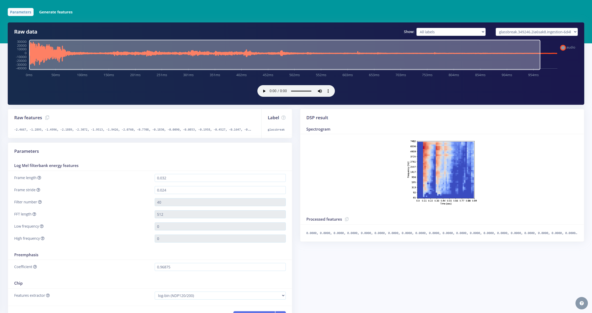

## Introduction

The Nicla Voice and Edge Impulse offer adaptable solutions for monitoring environments with glass structures, enabling applications in various domains. This system ensures timely detection and actionable responses, whether for buildings, vehicles, or specialized facilities. You can create scalable AI-powered solutions for specific security needs by leveraging these tools.

This application note provides a comprehensive walkthrough on building and deploying a machine learning model to detect glass-breaking sounds using the Nicla Voice and Edge Impulse. You will learn how to collect, process, and train audio data, then deploy the trained model on the Nicla Voice to create an effective sound classification system.

## Goals

The goal of this application note is to showcase an glass-breaking detection system for the environments with glass builds using Nicla Voice and the Edge Impulse. The project's objectives are the following:

- Process audio data of glass-breaking sounds and background noise based on [**DCASE**](http://dcase.community/challenge2017/task-rare-sound-event-detection-results) dataset.
- Train a machine learning model capable of distinguishing glass-breaking sounds from other noises.
- Deploy the trained model to the Nicla Voice for on-device inference.
- Showcase the real-time glass-breaking detection capabilities of the model.

## Hardware and Software Requirements

### Hardware Requirements

- [Nicla Voice](https://store.arduino.cc/nicla-voice)
- [USB-C® cable](https://store.arduino.cc/products/usb-cable2in1-type-c) (x1)
- 3.7 V LiPo battery (Optional)

### Software Requirements

- [Arduino Machine Learning Tools](https://cloud.arduino.cc/machine-learning-tools/)
- [Edge Impulse® CLI](https://docs.edgeimpulse.com/docs/edge-impulse-cli/cli-overview), to easily flash any Machine Learning model created with the Arduino Machine Learning Tools, we can install the Edge Impulse® Cli tool following these [instructions](https://docs.edgeimpulse.com/docs/edge-impulse-cli/cli-installation).
- Nicla Voice audio [firmware](https://cdn.edgeimpulse.com/firmware/arduino-nicla-voice-firmware.zip) to upload recordings to Machine Learning Tools.
- [Arduino IDE 1.8.10+](https://www.arduino.cc/en/software), [Arduino IDE 2](https://www.arduino.cc/en/software), or [Arduino Cloud Editor](https://create.arduino.cc/editor) (Optional)

### Additional Resources  

- Pre-recorded glass-breaking sound samples (or access to the [**DCASE**](http://dcase.community/challenge2017/task-rare-sound-event-detection-results) dataset).  
- A speaker or audio playback device for live testing.

## Edge Impulse and Nicla Voice Versatility

Edge Impulse and Nicla Voice provide a highly flexible and adaptable solution for various monitoring applications, including glass structure monitoring systems. It can be integrated and trained to operate in:

- **Buildings:** Identify glass-breaking incidents in residential, commercial, or industrial properties. Alerts can trigger lockdown protocols, notify security teams, and log incidents in real time.

- **Vehicles:** Detect windshield breakage and provide real-time SOS signals, vehicle location, or license plate details. This feature is particularly beneficial for enhancing vehicle security.

- **Custom Environments:** Deploy in specific setups like public transportation, specialized labs, or sensitive equipment areas where glass-related incidents require immediate attention.

This adaptability provides comprehensive coverage and flexible response mechanisms for various scenarios. Additionally, integrating BLE communication and Arduino Cloud makes the system even more versatile and responsive.

## Machine Learning Model Development

### Data Collection

Data collection is the foundation of any machine learning project. An existing dataset known as [**DCASE dataset** (Detection and Classification of Acoustic Scenes and Events)](http://dcase.community/challenge2017/task-rare-sound-event-detection-results) will be used in this application note to avoid the practical challenges of recording actual glass-breaking sounds.

This dataset provides high-quality audio samples of glass-breaking sounds and background noise, which is essential for training and testing the model.

You will have a total of 300 audio samples for training and 54 samples for testing. These samples represent two main categories:

- Glass-breaking events
- Non-glass-breaking ambient noise

Using the [**DCASE**](http://dcase.community/challenge2017/task-rare-sound-event-detection-results) dataset helps you to have a diverse range of audio conditions, improving the robustness of the final model.

The audio data was preprocessed with **Edge Impulse**. Its user interface allows you to manage audio files, including cropping unnecessary segments and splitting longer recordings into manageable pieces.

This preprocessing step ensures that only relevant data is provided into the training pipeline, maximizing the model's performance.


The above image shows the dataset overview in Edge Impulse, where you can see the collected audio samples for glass-breaking events. The data is divided into training and testing sets to ensure the model's generalization.

Additionally, Edge Impulse allows you to collect data directly from your devices, either through a USB connection or wirelessly. This capability is particularly useful for iterative model improvement, allowing you to add new audio samples over time as real-world conditions change. This flexibility ensures that the model remains accurate and effective throughout its lifecycle.

### Data Processing

In this step, you will use an audio processing block optimized for the NDP120 processor found on the Nicla Voice. This block uses a Fast Fourier Transform (FFT) to convert audio data from the time domain to the frequency domain, helping in extracting meaningful features for classification.

Dimensionality reduction techniques visualize the features, describing different clusters for glass-breaking and non-glass-breaking sounds.

The image below shows the time series and audio processing block configuration in Edge Impulse. Configuring parameters like window size and frequency is important for extracting meaningful audio data features.


The processing block provides configurable parameters such as window size and feature scaling, allowing you to fine-tune signal processing. This application note emphasizes the ease with which these configurations can be adjusted.



In the image above, you can see the feature generation output. The data is visualized in clusters, which helps you understand the different features of the glass-breaking and non-glass-breaking classes.

### Model Training

You will use a dense neural network architecture that is well-suited for audio classification tasks. The configuration ensures compatibility with the hardware, using a 968-millisecond audio window for processing requirements.

Edge Impulse’s Eon tuner can automatically optimize model parameters, simplifying the process for you without extensive machine learning expertise.

The model achieved an accuracy of 89% during training, showing its efficacy in differentiating between glass-breaking and background noises.


In summary, the neural network for this application note was designed to classify audio signals effectively for glass-breaking scenarios:

- **Architecture**: Dense neural network  
- **Window Size**: 968 milliseconds  
- **Optimization**: The **Eon tuner** automatically optimized signal processing and model parameters.  
- **Accuracy**: The model achieved an accuracy of 89% on the training set, demonstrating robust performance. 


The image shows the training settings and the neural network architecture used in Edge Impulse. The Eon tuner can help you optimize hyperparameters like learning rate, number of neurons, and layer configurations to achieve the best balance between model size, accuracy, and latency.

### Model Testing

After training, the model is evaluated using a test dataset comprising previously unseen audio samples. This evaluation helps ensure the model generalizes nicely to new data and accurately determines glass-breaking events under various conditions.


The image above shows the testing results with an accuracy of 99.12%. The confusion matrix highlights the model's ability to classify audio samples correctly while identifying potential areas for improvement.

Misclassifications mainly occurred for short-duration glass-breaking sounds, suggesting the need for additional data or refinement of the processing pipeline to improve robustness. Regular updates to the dataset with new samples can address such limitations and enhance performance.

***The model performance can be affected if the application is implemented in a very different environment than the one used for training. It is recommended that the datasets be provided with new samples and the model be retrained for a new and upgraded deployment.***

For a new model deployment, use the [Syntiant® uploader](assets/Syntiant_Uploader.zip) and replace the `ei_model.synpkg`, which you can find inside the downloaded folder with yours.

## Deployment

### Model Deployment

Once the model is trained, you will deploy it to the Nicla Voice using **Edge Impulse’s binary firmware builder**. The firmware includes the trained model and the necessary scripts for on-device inference, removing the need for internet connectivity during operation.

You will learn to connect the Nicla Voice via USB, select the deployment target, and flash the firmware using Edge Impulse CLI. The deployment process will be shown step-by-step, focusing on using the CLI to manage device setup.

Additionally, the model can be deployed as a library, allowing you to customize it further for specific applications.


The image above shows the deployment configuration screen, where you will select Nicla Voice as the deployment target. Configuring posterior parameters and building the deployment model ensures it is ready for real-time inference. The following clip shows the expected firmware build process:


### Build And Flash

1. Connect the Nicla Voice to your computer via USB.  
2. Load the prebuilt firmware onto the board.


3. Wait for the LED indicator to have visual readiness indicator.  


### Manual Flash Process

```bash
./syntiant-uploader send -m "Y" -w "Y" -p COM17 mcu_fw_120_v91.synpkg
```

```bash
./syntiant-uploader send -m "Y" -w "Y" -p COM17 dsp_firmware_v91.synpkg
```

```bash
./syntiant-uploader send -m "Y" -w "Y" -p COM17 ei_model.synpkg
```

### Running with Edge Impulse CLI

Once Nicla Voice has been flashed with the firmware build, you can use the following Edge Impulse CLI command to run the trained glass-breaking detector model:

```bash
edge-impulse-run-impulse
```

### Running with Arduino IDE

If you wish to run with an Arduino script, the following script can be uploaded to Nicla Voice and observe within the Arduino IDE Serial Monitor:

```arduino
#include "NDP.h"

const bool lowestPower = false;

void ledBlueOn(char* label) {
  nicla::leds.begin();
  nicla::leds.setColor(blue);
  delay(200);
  nicla::leds.setColor(off);
  if (!lowestPower) {
    Serial.println(label);
  }
  nicla::leds.end();
}

void ledGreenOn() {
  nicla::leds.begin();
  nicla::leds.setColor(green);
  delay(200);
  nicla::leds.setColor(off);
  nicla::leds.end();
}

void ledRedBlink() {
  while (1) {
    nicla::leds.begin();
    nicla::leds.setColor(red);
    delay(200);
    nicla::leds.setColor(off);
    delay(200);
    nicla::leds.end();
  }
}

void setup() {

  Serial.begin(115200);
  nicla::begin();
  nicla::disableLDO();
  nicla::leds.begin();

  NDP.onError(ledRedBlink);
  NDP.onMatch(ledBlueOn);
  NDP.onEvent(ledGreenOn);
  Serial.println("Loading synpackages");
  NDP.begin("mcu_fw_120_v91.synpkg");
  NDP.load("dsp_firmware_v91.synpkg");
  NDP.load("ei_model.synpkg");
  Serial.println("packages loaded");
  NDP.getInfo();
  Serial.println("Configure mic");
  NDP.turnOnMicrophone();
  NDP.interrupts();

  // For maximum low power; please note that it's impossible to print after calling these functions
  nicla::leds.end();
  if (lowestPower) {
    NRF_UART0->ENABLE = 0;
  }
  //NDP.turnOffMicrophone();
}

void loop() {
  uint8_t command = 0xFF;

  while (Serial.available()) {
    command = Serial.read();
    if (command == 'f') {
      Serial.println("Interrupts disabled");
      NDP.noInterrupts();
    } else if (command == 'o') {
      Serial.println("Interrupts enabled");
      NDP.interrupts();
    }
  }
  //Serial.println("in the loop");
  delay(100);
}
```

## Glass Breaking Detection

With firmware flashed and script uploaded to Nicla Voice, you can play recorded glass-breaking sounds through a speaker to simulate rupture conditions. The model will detect these sounds in real-time, showing its effectiveness. You could also try using real-world glass to test the model's effectiveness.

***Although the sound of the real-world glass structure breaking presents the best method to test and validate the trained model, please take precautions to avoid possible accidents or injuries.***

The Edge Impulse Command Line Interface (CLI) will show you monitoring information for the inference process and allow you to view real-time classification results. The Arduino IDE Serial Monitor will also provide you with the same information.

The capability of the Nicla Voice to detect glass-breaking sounds in real-time using machine learning is now possible. The integration of Edge Impulse simplified the process, making it accessible even for users with minimal machine learning experience.  

The following clip shows the real-time classification result. The model identified the glass-breaking sound when a signal representing glass structure failure was present.


You can also use the Arduino IDE's Serial Monitor to observe similar results found within the Edge Impulse CLI.


## Expanding Glass Breaking Detector

You can expand the Glass Breaking Detector system described in this application note to include real-time alerts and interesting automation by integrating the Nicla Voice, Portenta H7 and the Arduino IoT Cloud.

This enhanced functionality will allow you to perform improved safety and monitoring capabilities specific to environments with glass structures.

### Expanded System Overview

The system starts with the Nicla Voice, which runs a trained machine learning model to detect high-accuracy glass-breaking sounds. When a glass-breaking sound is detected, the Nicla Voice sends a notification via Bluetooth® Low Energy (BLE) to the Portenta H7.

Working as the host, the Portenta H7 forwards the alert to the Arduino IoT Cloud, where you can monitor updates on a dashboard and actions triggered in real time.

This integration also includes an escalation mechanism. The system will activate a Security Alert upon detecting the initial glass-breaking event.

If additional glass-breaking events are detected, the system will escalate the response by activating a Lockdown Motor to secure the environment that could be connected to reinforced shutters.

This feature provides you with an adaptable solution for possible scenarios.

### Nicla Voice Integration

The Nicla Voice identifies glass-breaking sounds and sends alerts to the Portenta H7. The following code shows how part of the alert mechanism works:

```arduino
void sendAlert(char* label) {
  if (strcmp(label, "NN0:glassbreak") == 0) {
    Serial.println("Glass break detected. Sending BLE alert...");
    glassBreakAlert.writeValue(1);  // Write to BLE characteristic
    NDP.noInterrupts();
    nicla::leds.begin();
    nicla::leds.setColor(red);
    delay(3000);
    nicla::leds.end();
    NDP.interrupts();
  } else {
    Serial.println("No relevant event detected.");
  }
}
```

This part of the code ensures that the Nicla Voice communicates detected events to the host device, allowing you to have rapid responses.

### Portenta H7 Integration

The Portenta H7 will handle BLE notifications from the Nicla Voice and work as the bridge between the detection hardware and the Arduino IoT Cloud.

Using the Portenta H7, you can update the cloud with event details and manage system responses based on the alert level.

The following code snippet shows how the Portenta H7 processes these specific alerts:

```arduino
if (AlertValue == 1) {
    alertStatus = true; // General alert status triggered
    if (!SecurityAlert) {
        SecurityAlert = true; // Turn on security alert
        GlassEvent = "Security Alert ON: Glass break detected";
        Serial.println("Security Alert activated.");
    } else {
        LockdownMotor = true; // Turn on lockdown motor
        GlassEvent = "Lockdown activated: Additional glass break detected";
        Serial.println("Lockdown motor activated.");
    }
}
```

This structure ensures the system determines between initial and subsequent alerts, escalating responses as needed so you can handle possible complex scenarios.

### IoT Cloud Integration

By integrating with the Arduino IoT Cloud, you can access a user-friendly dashboard to monitor the system status. You can view real-time event logs, track BLE connection status, and observe the Security Alert or Lockdown Motor activation.

The cloud integration also enables you to receive updates and take action from anywhere, making the system more accessible and responsive.

## Full Glass-Breaking Detector Resources

All the necessary files to replicate this application notes can be found below:

* The complete code can be downloaded here:
  - Base glass-breaking detector example
  - Extended glass-breaking detector with Arduino Cloud
* The Machine Learning Tools project is public here, so you can clone it and modify it to adapt it to your needs by improving the dataset or model architecture for a custom deployment.

## Conclusion 

This application note shows how Edge Impulse and the Nicla Voice enable real-time, on-device sound classification with a streamlined workflow from data acquisition to local inference. This integration simplifies the development of low-power AI applications, even for users with minimal machine learning experience.  

Beyond glass-breaking detection, this solution can be adapted for applications like fall detection and other audio-based classifications. With Edge Impulse’s flexible deployment and the Nicla Voice's capabilities, you can create versatile edge AI systems to address various safety and monitoring challenges.  

## Next Steps

This system can be adapted to recognize other sounds or events by retraining the model with a new dataset. Potential applications include:

- Detecting specific machinery noises in industrial settings.  
- Monitoring animal sounds in wildlife conservation.  
- Recognizing spoken keywords for voice-controlled systems.  

For further experimentation, the Edge Impulse provides tools to customize and refine your machine learning models.

